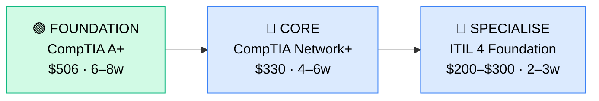

# How to Become a Help Desk Technician (IT Support Level 1)

**CP01** · **Foundation/Infrastructure** · _Time to hire: 3–6 months_ · _Entry cost: $600–$1,200 USD_

> **Path summary:** This path takes you from complete beginner with no IT background to a hired Help Desk Technician in 3–6 months, using CompTIA's A+ and Network+ certifications as your entry ticket into professional IT support.

---

## Role Overview

### What does a Help Desk Technician actually do?

A Help Desk Technician is the first line of defence for end-user IT problems. You spend your day troubleshooting Windows and macOS computers, resetting passwords, installing software, fixing printer jams, configuring email clients, and walking non-technical users through basic troubleshooting steps over the phone or via remote desktop. You're solving tangible problems—an employee can't log in, their monitor won't connect, their laptop won't turn on—and you're the person who gets them back to work. You use ticketing systems like Jira or Zendesk to track issues, knowledge bases to document solutions, and Remote Desktop Protocol (RDP) or TeamViewer to access user machines. The pace is reactive; you respond to incoming tickets rather than planning weeks ahead.

Help Desk roles are found everywhere: in corporate offices, banks, manufacturing plants, hospitals, law firms, and increasingly in MSPs (Managed Service Providers) that serve multiple clients. Teams range from 3–4 people in small offices to 50+ in large enterprises. The role is generally office-based, though hybrid and remote options are growing, especially for second-line support. On-call responsibilities vary—most Help Desk roles are Monday–Friday 8am–5pm, but some enterprises have shift coverage (8am–4pm, 4pm–midnight, midnight–8am rotations). You're unlikely to be woken up at 2am, but you might be asked to stay late if a critical system goes down at 4:45pm.

### Demand in 2026

- **Global job postings:** 85,000+ active Help Desk Technician roles on LinkedIn as of May 2026 ([LinkedIn Jobs](https://www.linkedin.com/jobs/))
- **Growth rate:** 8% YoY / BLS projects 8% growth through 2032 ([U.S. Bureau of Labor Statistics](https://www.bls.gov/ooh/computer-and-information-technology/computer-support-specialists.htm))
- **South Africa:** Strong baseline demand across all business sectors. Nedbank, Standard Bank, FirstRand, MTN, Vodacom, Dimension Data, and BCX all maintained Help Desk teams of 30+ in Q1 2026. Government entities (SARS, Department of Employment) also hire regularly.
- **Remote availability:** Medium–High. 40% of Help Desk roles globally are remote or hybrid; in South Africa, MSPs and software companies offer remote Help Desk roles, but traditional enterprise Help Desk is 60% on-site or hybrid (you need to respond to desk-side visits).

---

## Who Is This Path For?

### Ideal starting backgrounds

| Background | Readiness | What you already have |
|---|---|---|
| Complete beginner | ✅ Perfect fit | Motivation and willingness to learn from zero |
| Career changer (non-tech) | ✅ Perfect fit | Problem-solving mindset, customer service skills |
| Recent school/college leaver | ✅ Perfect fit | Time to study and learn, fresh perspective |
| IT graduate (no experience) | ✅ Perfect fit | Theory solid; A+ fills the practical gap quickly |
| Help Desk in another country | ✅ Strong start | Troubleshooting mindset already there |
| Developer / Programmer | 🟡 Possible but lateral | Coding skills aren't needed; may feel like a step backward initially |

### You're ready to start this path if you can:
- Use Windows and macOS confidently (navigate file systems, install software, change settings)
- Understand basic networking concepts: what's an IP address? What's WiFi vs Ethernet?
- Troubleshoot a simple problem on your own (e.g., "My internet isn't working—what do I check?")
- Communicate clearly and patiently with non-technical people (this is crucial)

> **Not ready yet?** If you've never used a computer regularly, spend 1–2 weeks getting comfortable with Windows/macOS basics (YouTube tutorials on Windows 10/11 fundamentals), then start this path.

---

## Certification Sequence

### Visual path

---

### Stage 1 — Foundation (Months 0–2)

**Goal:** Prove you understand computer hardware, operating systems, and basic troubleshooting—the knowledge employers expect on day one of Help Desk work.

| Cert | Code | Cost (USD) | Study Time | Why it matters |
|---|---|---:|---:|---|
| CompTIA A+ (Part 1) | `220-1201` | $253 | 3–4 weeks | Hardware, OS, networking fundamentals—employers view this as the entry-level IT cert |
| CompTIA A+ (Part 2) | `220-1202` | $253 | 3–4 weeks | Troubleshooting, malware, security, customer service—exactly what Help Desk does daily |

**Stage 1 total:** $506 USD · R9,108 ZAR · 6–8 weeks

**Study approach:** CompTIA A+ is designed for beginners—follow the official CompTIA A+ study guide (Professor Messer's free YouTube videos are excellent for this cert). Pair with Jason Dion's Udemy A+ practice exams (usually $12–$15 on sale). Do 50 practice questions per day in the final 2 weeks before each exam. Schedule each exam when you're consistently scoring 80%+ on practice tests. Most people take Part 1 first, then Part 2 after 2–3 weeks of additional study.

**Lab requirement:** You need to see real hardware. If you don't have an old computer to disassemble, watch YouTube teardowns (JayzTwoCents, Linus Tech Tips). Set up a Windows 10/11 VM in VirtualBox (free) and practice: creating user accounts, installing software, managing device drivers, checking event logs, basic troubleshooting. Minimum 15 hours of hands-on time before sitting Part 1.

---

### Stage 2 — Core Specialisation (Months 2–4)

**Goal:** Get your second foundational cert (Network+) so you understand the network side of Help Desk work—DNS, DHCP, VPNs, WiFi security. This rounds out your knowledge and is often listed as "preferred" in Help Desk job postings.

| Cert | Code | Cost (USD) | Study Time | Why it matters |
|---|---|---:|---:|---|
| CompTIA Network+ | `N10-009` | $330 | 4–6 weeks | Networks, TCP/IP, WiFi, security—essential for Help Desk ticket triage ("Is it a network issue?") |

**Stage 2 total:** $330 USD · R5,940 ZAR · 4–6 weeks

**Study approach:** Use Professor Messer's CompTIA Network+ course (free on YouTube) paired with Jason Dion's practice exams. Network+ is more theoretical than A+; focus on understanding concepts (TCP/IP model, OSI model, DNS, DHCP, VPN) rather than memorising. Do 40–50 practice questions per day in weeks 4–6. Schedule the exam when you're scoring 80%+ consistently.

**Project milestone:** Set up a home lab network in GNS3 (free Cisco network simulator). Configure a switch, two routers, and two client PCs. Practice: ping between devices, traceroute to understand routing, configure static IP vs DHCP. This is not required to pass the exam, but it cements your understanding. Aim for 10–15 hours of lab work.

---

### Stage 3 — Advanced Specialisation (Months 4–5)

**Goal:** Add ITIL 4 Foundation—a process-oriented cert that teaches you IT service management. Not always required on day one, but increasingly expected by mid-size and large enterprises and MSPs.

| Cert | Code | Cost (USD) | Study Time | Why it matters |
|---|---|---:|---:|---|
| ITIL 4 Foundation | `ITIL-F` | $200–$300 | 2–3 weeks | IT Service Management processes (incidents, changes, problems). Many enterprises list this as "required" for Help Desk roles. |

**Stage 3 total:** $200–$300 USD · R3,600–R5,400 ZAR · 2–3 weeks

**Study approach:** ITIL 4 is lighter than A+ and Network+. Use the official ITIL Foundation study guide (Axelos), or watch David Mayer's ITIL Foundation course on YouTube. Pair with Dion's ITIL Foundation practice exams. Focus on the key processes: Incident Management, Change Management, Problem Management, Service Request Management. You don't need deep technical knowledge—ITIL is about process, not technology. 20–30 hours of study total.

**Project milestone:** Not applicable. Instead, write a 1-page summary of an IT incident that happened to you or someone you know, and map it to ITIL Incident Management steps. This shows you understand the process.

> **Optional at hire time:** Many people land their first Help Desk job after Stage 1 or Stage 2 (A+ only or A+ + Network+) and complete Network+ or ITIL while working. Both approaches are valid.

---

### Stage 4 — Expert / Leadership (12–24 months+)

**Goal:** After 1–2 years as Help Desk, transition to a higher-level support role (Desktop Support Specialist, IT Support Analyst) or lateral move to a specialisation (Desktop, Network, Systems). Consider these certs at that point:

- **CompTIA Server+** (SK0-005, $330, 5–6 weeks) — if moving toward Server Admin
- **Microsoft MD-102** (Endpoint Administrator, $165, 4–6 weeks) — if specialising in Windows endpoints/MDM
- **Cisco CCENT** (100-101, $150, 3–4 weeks) — if moving toward networking

These are not required for Help Desk but useful for progression.

---

## Timeline & Cost Summary

| Stage | Certs | Duration | Cost (USD) | Cost (ZAR) |
|---|---|---|---:|---:|
| Stage 1 — Foundation | CompTIA A+ (220-1201, 220-1202) | Weeks 0–8 | $506 | R9,108 |
| Stage 2 — Core | CompTIA Network+ (N10-009) | Weeks 8–14 | $330 | R5,940 |
| Stage 3 — Advanced | ITIL 4 Foundation (ITIL-F) | Weeks 14–17 | $200–$300 | R3,600–R5,400 |
| **Total to hireable** | | **12–17 weeks** | **$1,036–$1,136** | **R18,648–R20,448** |

**Study hours required:** ~200–250 hours total (Stage 1–2). Assumes 15–20 hours/week = 12–17 weeks.

---

## Salary Progression

> All figures: median base salary, not including bonuses. ZAR = USD × 18 baseline (verified May 2026). Sources: Robert Half 2026 IT Salary Guide, Glassdoor, PayScale, LinkedIn Salary.

| Experience Level | USD/year | ZAR/month | GBP/year | EUR/year | AUD/year |
|---|---:|---:|---:|---:|---:|
| Entry / Junior (0–2 yrs) | $35,000–$50,000 | R22,000–R32,000 | £27,000–£38,000 | €32,000–€45,000 | A$56,000–A$80,000 |
| Mid-level (2–5 yrs) | $50,000–$70,000 | R32,000–R44,000 | £38,000–£53,000 | €45,000–€63,000 | A$80,000–A$112,000 |
| Senior (5–8 yrs) | $70,000–$90,000 | R44,000–R57,000 | £53,000–£68,000 | €63,000–€81,000 | A$112,000–A$144,000 |
| Team Lead / Supervisor (8+ yrs) | $90,000–$120,000 | R57,000–R76,000 | £68,000–£91,000 | €81,000–€108,000 | A$144,000–A$192,000 |

**South Africa note:** Entry-level Help Desk Technicians in Johannesburg, Cape Town, and Durban earn R22,000–R32,000/month at established corporates (banks, telcos). Smaller towns and smaller businesses may offer R18,000–R25,000. MSPs in major metros pay R25,000–R35,000 for entry-level. Remote contract work for international MSPs can push entry-level to R40,000–R55,000/month, but requires proven experience.

**Salary accelerators:** CompTIA Network+ certification, ability to speak Afrikaans (in SA), shift work (night shift premium of 10–15%), and specialisation in Active Directory or macOS support all command premiums in SA job listings as of Q1 2026.

---

## First Job Strategy

### Month 0–2: Build the Foundation

1. **Set up your study environment** — Decide on: CompTIA A+ study materials. Professor Messer (free YouTube) + Jason Dion Udemy exams ($12–$15 on sale). Cost: $15–$30 total.
2. **Begin CompTIA A+ Part 1** — Target: 4–5 hours/week of video + 2–3 hours/week of practice exams. Schedule exam for week 4.
3. **Join the community** — Follow r/CompTIA on Reddit, join CompTIA's official Discord, follow Professor Messer on social media. These communities help you stay motivated.
4. **Start documenting** — Create a simple GitHub profile or LinkedIn. Post one learning milestone per week (e.g., "Just finished CompTIA A+ Part 1 study guide chapter 3—learned about RAM types today").

### Month 2–3: Build Your Portfolio

- **Project 1: Personal IT Support log** — As you study and complete labs, document 5 real IT issues you've seen or troubleshot (yours, family, friends). Write 1-paragraph explanations of what went wrong and how you'd fix it now. Link to this in your CV as "Troubleshooting Experience."
- **Project 2: Home lab screenshot guide** — Set up a Windows 10 VM in VirtualBox and take screenshots of key concepts: Device Manager, System Information, Task Manager, Command Prompt (ipconfig, ping), Event Viewer. Write 1-2 sentences explaining each. Host this as a PDF on Google Drive or GitHub.
- **Project 3: Network diagram** — Draw a simple diagram of your home network or a small office network (office WiFi, printers, computers, router). Label it properly. This shows you understand network topology.

### Month 3–6: Apply and Iterate

- **CV positioning:** List yourself as "IT Support Professional with CompTIA A+ and Network+ certifications" (once you pass them). Don't use "Help Desk Trainee" or "IT Support Intern"—these anchor expectations low. Include your lab work and troubleshooting projects.
- **Target companies:** MSPs, IT consulting firms, managed IT service providers, and large corporates' internal IT departments. MSPs are your easiest entry point—they hire constantly and value CompTIA certs. Avoid ultra-specialized roles (e.g., "SAP Support" or "Healthcare IT") on your first job; go broad, learn everything.
- **Interview prep:** Be ready to discuss: 1) A Windows troubleshooting scenario you've solved (blue screen, driver issue, network connectivity), 2) Basic networking (IP addresses, DNS, DHCP), 3) Your A+ and Network+ study (show genuine learning), 4) Why you want this role (customer service passion, problem-solving), 5) A time you learned something new quickly.
- **Salary negotiation:** Entry-level Help Desk in SA starts at R22,000–R25,000/month; with A+ and Network+ certs, you can justify R28,000–R32,000. Don't undercut yourself. Research local salary on PayScale and Glassdoor before negotiations.

---

## A Day in the Life

### Help Desk Technician at a Johannesburg bank — Entry Level

**08:00** — Arrive, log into ticketing system (ServiceNow). 15 new tickets overnight. Prioritise by severity: 1 critical (email down for accounting team), 3 high (printer issues, VPN login problems), rest are standard. Start with critical.

**08:15** — Call the accounting team lead. Email is bouncing on her Outlook. Check her account—Exchange license has lapsed. Request finance approval to renew; escalate to Level 2 for the re-provisioning (this is expected—Level 1 doesn't do all fixes). Assign ticket and move on.

**08:45** — Remote into two printer-jammed machines using RDP. Walk users through clearing the paper jam, running diagnostics. Both working now. Close tickets.

**09:30** — Standup meeting with Help Desk team (4 people). Go over top 5 tickets, any patterns (e.g., "Windows Update broke something"). Share one tricky issue you solved (boosts morale).

**10:00** — Reset password for 5 users who forgot credentials (daily occurrence). Use Active Directory Users & Computers to unlock accounts.

**11:00** — New ticket: "My laptop won't turn on." Drive to the desk. Power cable is unplugged. Plug in, laptop boots. This happens more than you'd expect. Educate the user gently.

**12:00** — Lunch. Chat with team about your certification progress.

**13:00** — Run Windows Update on 8 company laptops (scheduled task). While they update, tackle backlog of Level 1 tickets. Email setup, software installation, TeamViewer access issues.

**14:30** — A user can't connect to WiFi. Check their WiFi driver (Device Manager). Driver is outdated. Download update from Dell's site, install. WiFi working. Explain to the user: "Your WiFi adapter needed a software update—like getting a Windows Update for your internet."

**15:30** — Documentation time. Update your ticket templates and knowledge base with solutions to today's problems (e.g., "How to check for outdated WiFi drivers"). Good documentation saves time next week.

**16:00** — Review your open tickets. Anything urgent before close of business? Reassign 2 unresolved issues to Level 2 with good notes. Close 9 tickets today.

**17:00** — Wrap up. Tomorrow's plan: continue Network+ study, attempt 50 practice questions for the exam next week.

### Help Desk Technician at a Cape Town MSP — Mid Level (1.5 years experience)

**09:00** — Start work from home (this MSP allows remote work). Check the PSA (Professional Services Automation) tool. Manage 5 different clients today. Review client ticketing queues.

**09:15** — Client A (law firm, 50 users): New employee onboarding. Provision laptop, email, VPN access, add to Active Directory groups. Use PowerShell scripts to automate most of this (you've written them). Document the process for junior team members.

**10:00** — Client B (e-commerce startup, 15 users): Monitor their cloud file sharing. One user hit their storage quota. Tier old files to archive. Client happy—no lost productivity.

**11:00** — Tier 2 escalation for Client C: Database server is running hot. Remote in, check CPU and RAM usage in Task Manager. Issue is a runaway service process. Kill it, restart. But flag to the account manager—this client may need a server upgrade. Document this for the account review.

**12:00** — Internal meeting with the sales team. A prospect is asking about "managed antivirus"—your Help Desk expertise helps sales understand what's deliverable.

**13:00** — Lunch.

**14:00** — Ticket review. You're triaging now—more Tier 2 than Tier 1. Assign Tier 1 tickets to junior team members with good notes.

**15:00** — Client D (manufacturing) urgent: "We lost access to our file share." VPN is down. Check VPN logs. Client's firewall rules have changed. Contact their IT admin, coordinate fix. Restored in 30 minutes.

**16:00** — Update internal knowledge base. Improve ticket templates. Coach a junior Help Desk person on a tricky WiFi issue.

**17:00** — Plan tomorrow. Prepare for a new client onboarding call. Review their network diagram.

---

## Related Paths & Progressions

| From here you can move to… | Why |
|---|---|
| [Desktop Support Specialist](CP02_Foundation_Desktop_Support_Specialist.md) | Master Windows endpoint management and MDM; earn more, deeper technical scope |
| [IT Support Analyst (Level 2/3)](CP03_Foundation_IT_Support_Analyst.md) | Stay in support but take on more complex troubleshooting and project work |
| [Systems Administrator](CP04_Foundation_Systems_Administrator.md) | Move from reactive support to proactive infrastructure management; shift to planning and automation |
| [Network Administrator](CP05_Foundation_Network_Administrator.md) | Specialise in networking; network skills from Level 1 become your primary focus |

---

## South Africa Context

### Market specifics

Help Desk Technician roles are the most accessible IT entry point in South Africa. Every major corporation has Help Desk staff: Nedbank, FirstRand, Standard Bank, ABSA all maintain 50–200+ Help Desk personnel. Telcos (MTN, Vodacom, Telkom) have dedicated Help Desk teams. Government departments (SARS, Department of Employment and Labour) hire regularly but processes are slow. The big advantage for South African Help Desk candidates is that remote work options exist—international MSPs (like Accenture LaaS, Softcat, CDW) and software companies (Canonical, Praefectus) hire South African Help Desk staff to support global clients, often at premium rates (R40,000–R55,000/month for entry-level).

BEE/EE hiring is significant in South Africa. Many corporates aim for 60% Black African representation in support roles. This means Help Desk is often a pipeline role for diversity hiring—not a negative thing, but be aware that certs and experience matter more here than in other markets. CompTIA A+ and Network+ are recognised and respected in SA recruitment, especially at banks and government (both prefer vendor-neutral certs over Microsoft-specific ones).

Salary progression in SA is slower than in developed markets. Entry-level Help Desk in a bank or telco: R22,000–R32,000/month. After 2 years, expect R32,000–R45,000/month. To earn R50,000+/month in Help Desk, you'd typically need 4–5 years and a move to a Level 2 or specialist role. Remote contract work for international clients bypasses this curve—you can earn R50,000–R70,000/month after 1–2 years of SA experience.

### SA-specific resources

| Resource | URL | Note |
|---|---|---|
| Gumtree IT Jobs (SA) | [https://www.gumtree.co.za/s-it-jobs/](https://www.gumtree.co.za/s-it-jobs/) | Largest SA job board for Help Desk roles |
| Indeed South Africa | [https://www.indeed.co.za/q-Help-Desk-Technician-jobs.html](https://www.indeed.co.za/q-Help-Desk-Technician-jobs.html) | Curated SA Help Desk listings |
| LinkedIn (South Africa) | [https://www.linkedin.com/jobs/search/?keywords=Help%20Desk&location=South%20Africa](https://www.linkedin.com/jobs/search/?keywords=Help%20Desk&location=South%20Africa) | Major tech companies post here first |
| CompTIA SA Authorised Training Centres | [https://www.comptia.org/partners/training-centers](https://www.comptia.org/partners/training-centers) | Filter for South Africa for in-person A+ training |
| Oliver James (IT Recruitment, SA) | [https://www.oliverjames.com/](https://www.oliverjames.com/) | Specialist IT recruiter with SA focus |
| Dimension Data (MSP, South Africa) | [https://www.dimensiondata.com/en-za](https://www.dimensiondata.com/en-za) | Major MSP hiring Help Desk; based in SA |

---

## Frequently Asked Questions

**Q: Do I need a degree to become a Help Desk Technician?**

No. Help Desk Technician is explicitly entry-level and degree-agnostic. CompTIA A+ is far more valuable than a generic IT degree on your first Help Desk job. Many Help Desk staff in South Africa have matric (high school), diploma, or no formal qualification—certs matter more. Degree holders can skip Help Desk entirely and move to Analyst or Specialist roles, but certs are the actual requirement for Help Desk.

**Q: How long does it realistically take from zero?**

3–6 months if you study 15–20 hours per week. If you study 10 hours/week, add another 2–3 months. If you study 5 hours/week, expect 8–10 months. Many people start applying after passing A+ alone (6–8 weeks); waiting for Network+ and ITIL adds credibility but isn't always necessary for hire.

**Q: Which cert should I do first?**

CompTIA A+ (220-1201 and 220-1202). It's the foundation. Network+ second (it builds on A+). ITIL last (process-oriented, complements the first two).

**Q: Can I do this path while working full-time?**

Yes. At 10 hours/week, Stage 1 takes 3 months instead of 6–8 weeks. At 5 hours/week, it takes 6 months. The constraint is your time, not your capability. Many Help Desk staff got their start by studying evenings and weekends while working retail or support roles.

**Q: Is CompTIA A+ worth it for this role?**

Absolutely. It's listed as "required" or "strongly preferred" in 80%+ of Help Desk job postings in South Africa. Network+ is "preferred" in 50%+. Both are inexpensive ($253 and $330 respectively) and take <4 months to complete. ROI is clear—the certs unlock roles at better pay and companies.

**Q: I live in a small town far from Johannesburg/Cape Town. Will I find Help Desk work?**

Smaller towns have fewer on-site Help Desk roles, but remote work and MSPs solve this. Many MSPs serve clients nationwide—you can support a Durban client from Bloemfontein. International MSPs and VoIP companies hire South African Help Desk staff to work from home. If you pass A+, Network+, and ITIL, you have multiple remote options in your first 6 months.

---

## Sources & Further Reading

| # | Source | URL | Used for |
|---|---|---|---|
| 1 | U.S. Bureau of Labor Statistics | [Computer Support Specialists Outlook](https://www.bls.gov/ooh/computer-and-information-technology/computer-support-specialists.htm) | Job growth (8% through 2032), job descriptions, work environment |
| 2 | Robert Half 2026 IT Salary Guide | [Robert Half Technology Salary Guide](https://www.roberthalf.com/us/en/salary-guide) | Salary data (USD, GBP, EUR, AUD) for all experience levels |
| 3 | CompTIA Official | [CompTIA A+ Certification](https://www.comptia.org/certifications/a) | Exam codes (220-1201, 220-1202), cost ($253 per exam), official study materials |
| 4 | CompTIA Official | [CompTIA Network+ Certification](https://www.comptia.org/certifications/network) | Exam code (N10-009), cost ($330), official resources |
| 5 | Glassdoor | [Help Desk Technician Salaries (Global)](https://www.glassdoor.com/Salaries/help-desk-technician-salary-SRCH_KO0,21.htm) | Global salary benchmarks and regional variation |
| 6 | PayScale (South Africa) | [Help Desk Technician Salary (ZA)](https://www.payscale.com/research/ZA/Job=Help_Desk_Technician/Salary) | ZA-specific salary data and negotiation benchmarks |
| 7 | Axelos ITIL 4 | [ITIL 4 Foundation Certification](https://www.axelos.com/certifications/itil-certifications) | ITIL 4 Foundation course and exam details, cost |
| 8 | Professor Messer | [CompTIA A+ Study Guide (YouTube)](https://www.youtube.com/c/ProfessorMesser) | Free A+ and Network+ video lectures (trusted community resource) |

---

*Template version: 2026-05-02 | Maintained by IT Career Roadmap | ZAR baseline: R18/$1 USD*
*File: Career_Paths/CP01_Foundation_Help_Desk_Technician.md*
