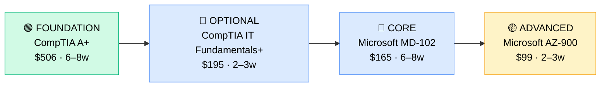

# How to Become a Desktop Support Specialist / Deskside Support

**CP02** · **Foundation/Infrastructure** · _Time to hire: 4–8 months_ · _Entry cost: $800–$1,400 USD_

> **Path summary:** This path takes you from Help Desk or general IT support to a specialised Desktop Support Specialist role, deepening your expertise in Windows/macOS endpoint management, MDM (Mobile Device Management), and Microsoft Active Directory—moving from reactive support to proactive device administration.

---

## Role Overview

### What does a Desktop Support Specialist actually do?

A Desktop Support Specialist is the local expert for end-user devices. While Help Desk fixes individual tickets, a Desktop Support Specialist owns the policy layer—they design and maintain how Windows endpoints are configured, managed, and secured across an organisation. You spend your day: building and deploying Windows 10/11 images to new machines, managing Active Directory (users, groups, GPOs—Group Policy Objects), supporting macOS and iOS devices, rolling out antivirus and MDM (Mobile Device Management) policies, configuring printers and network shares, troubleshooting hardware issues at the desk (and you spend time at desks, not just at a desk), and advising leadership on endpoint strategy (e.g., "Should we move to Windows 11?" or "Do we need MDM for BYOD?"). You work with real hardware—laptops, desktops, tablets, printers—and your hands-on experience is your superpower.

Desktop Support Specialists typically work in corporate environments, banks, large government agencies, and enterprises with 200+ endpoints. Teams range from 3–5 people in medium companies to 20+ in large enterprises. The role is usually office-based—you're expected at desks for hardware replacements, new hires, and troubleshooting—but increasingly hybrid with a 2–3 day/week on-site expectation. Some roles are 100% remote if the organisation has a mature BYOD/MDM program. On-call is rare; this is a business-hours role unless you support C-suite or critical systems.

### Demand in 2026

- **Global job postings:** 45,000+ active Desktop Support Specialist roles on LinkedIn as of May 2026 ([LinkedIn Jobs](https://www.linkedin.com/jobs/))
- **Growth rate:** 5% YoY / BLS projects steady demand (end-user support is stable if not explosive) ([U.S. Bureau of Labor Statistics](https://www.bls.gov/ooh/computer-and-information-technology/computer-support-specialists.htm))
- **South Africa:** Strong demand at banks, insurance, and large corporates. Nedbank, ABSA, FirstRand, Old Mutual, and Sanlam all hire Desktop Support Specialists. Government and education (universities) also maintain teams. Remote Desktop Support roles at international companies are available from SA.
- **Remote availability:** Medium. 30–40% of Desktop Support roles globally are hybrid or remote; in South Africa, on-site is more common (60%), but MSPs and tech companies offer remote options.

---

## Who Is This Path For?

### Ideal starting backgrounds

| Background | Readiness | What you already have |
|---|---|---|
| Help Desk Technician (1+ yrs) | ✅ Perfect fit | Troubleshooting mindset, OS familiarity, ticket handling |
| IT Support Analyst | ✅ Perfect fit | Broader technical knowledge, ready to specialise |
| Recent IT graduate | 🟡 Good with gaps | Theory solid; needs hands-on with Windows/macOS |
| Desktop technician in another country | ✅ Strong start | Device knowledge carries over |
| Developer / Sysadmin | 🟡 Lateral move | Technical skills there; endpoint focus is new |
| Complete beginner | ❌ Not ideal | Start with Help Desk first (CP01) |

### You're ready to start this path if you can:
- Confidently troubleshoot Windows 10/11 issues (BSOD, driver problems, networking)
- Understand Active Directory basics (user accounts, groups, domain login)
- Know what a Group Policy Object (GPO) is and why it matters
- Explain the difference between local admin and domain admin

> **Not ready yet?** Complete CP01 (Help Desk Technician) and 1–2 years of Help Desk work first, or do CP03 (IT Support Analyst) and move sideways into Desktop Support.

---

## Certification Sequence

### Visual path

---

### Stage 1 — Foundation (Months 0–2)

**Goal:** Reinforce Windows OS knowledge and endpoint security fundamentals. If you already hold CompTIA A+, skip the first cert and move to MD-102.

| Cert | Code | Cost (USD) | Study Time | Why it matters |
|---|---|---:|---:|---|
| CompTIA A+ (if needed) | `220-1201/1202` | $506 | 6–8 weeks | Foundation in hardware, OS, and troubleshooting. Skip if you already have this. |
| CompTIA IT Fundamentals+ (optional) | `FC0-U61` | $195 | 2–3 weeks | Light foundation cert; mostly review if you have A+. More relevant for career-changers. |

**Stage 1 total:** $506–$701 USD · R9,108–R12,618 ZAR · 6–8 weeks (or skip if A+ already held)

**Study approach:** If you're coming from Help Desk and already have A+, consider skipping Stage 1 entirely and going straight to Microsoft MD-102. IT Fundamentals+ is CompTIA's lightest cert and is optional—most Desktop Support Specialists skip it. If you're coming from a non-IT background and don't have A+, do A+ first, then MD-102.

**Lab requirement:** If doing A+, build a home lab in VirtualBox. If skipping to MD-102, you'll need access to Windows 10/11 and Active Directory (see Stage 2 for details).

---

### Stage 2 — Core Specialisation (Months 2–6)

**Goal:** Get Microsoft MD-102 (Windows Endpoint Administrator), the anchor cert for Desktop Support Specialists. This cert proves you can manage Windows endpoints at scale using Intune (MDM) and Group Policy.

| Cert | Code | Cost (USD) | Study Time | Why it matters |
|---|---|---:|---:|---|
| Microsoft MD-102 (Endpoint Administrator) | `MD-102` | $165 | 6–8 weeks | Windows 10/11 deployment, Intune MDM, Group Policy, device compliance—core Desktop Support work. Employers specifically look for this on CVs. |

**Stage 2 total:** $165 USD · R2,970 ZAR · 6–8 weeks

**Study approach:** Use Microsoft Learn (free, official) for MD-102, paired with Scott Duffy's Udemy course ($12–$15 on sale) for practical examples. The exam is 60% Group Policy and Intune, 40% troubleshooting. You need hands-on experience with a Windows domain and Intune. Join Microsoft's Insider Program to get free Office 365 and Intune access. Do 30–40 practice questions per day in weeks 5–8. Schedule the exam when you're scoring 75%+ on practice tests.

**Project milestone:** Deploy Windows 10 using DBAN (Darik's Boot and Nuke) to wipe a machine, then reinstall Windows 10/11 from an ISO. Configure that machine to join a domain (if you have access to an AD environment) or at minimum set up local users and group policies using gpedit.msc. Document the process. If you don't have an on-premise AD environment, use Azure Virtual Machines to stand up a domain controller and a client VM—this costs ~$10–$20/month in Azure Free Tier credit.

---

### Stage 3 — Advanced Specialisation (Months 6–7)

**Goal:** Add Microsoft AZ-900 (Azure Fundamentals) to show you understand cloud-delivered services (Intune is cloud; understanding Azure strengthens your candidacy for roles supporting hybrid on-prem + cloud environments).

| Cert | Code | Cost (USD) | Study Time | Why it matters |
|---|---|---:|---:|---|
| Microsoft AZ-900 (Azure Fundamentals) | `AZ-900` | $99 | 2–3 weeks | Cloud infrastructure and services. Not strictly necessary for Desktop Support, but increasingly relevant as enterprises move to cloud-delivered device management. Differentiates you from peers. |

**Stage 3 total:** $99 USD · R1,782 ZAR · 2–3 weeks

**Study approach:** AZ-900 is one of the easiest Microsoft certs. Use Microsoft Learn (free) and Andrew Brock's 1-hour YouTube intro to AZ-900. You don't need deep technical knowledge—just understand what Azure is, what Intune is, and how Azure AD (now Entra ID) connects to endpoints. 15–20 hours of study total.

**Project milestone:** Set up a free Azure account and explore Azure AD, Intune, and Azure Virtual Machines. Don't deploy anything complex—just understand the portal layout and what each service does.

> **Optional at hire time:** Many Desktop Support Specialists land their first role after Stage 2 (MD-102 alone) and complete AZ-900 while employed. Both approaches are valid.

---

### Stage 4 — Expert / Leadership (12–24 months+)

**Goal:** After 2–3 years of hands-on Desktop Support, consider specialisation or management:

- **Microsoft AZ-104** (Azure Administrator, $165, 6–8 weeks) — if moving toward hybrid infrastructure
- **Microsoft MS-900** (Microsoft 365 Fundamentals, $99, 1–2 weeks) — if deepening Microsoft 365 knowledge
- **Intune Advanced Certification** (vendor-specific, varies) — if Intune becomes your core skill
- **CompTIA Security+** (SY0-701, $370, 6–8 weeks) — if moving toward Security-focused roles

These are for progression beyond entry-level Desktop Support.

---

## Timeline & Cost Summary

| Stage | Certs | Duration | Cost (USD) | Cost (ZAR) |
|---|---|---|---:|---:|
| Stage 1 — Foundation | CompTIA A+ (if needed), IT Fundamentals+ | Weeks 0–8 | $506–$701 | R9,108–R12,618 |
| Stage 2 — Core | Microsoft MD-102 | Weeks 8–16 | $165 | R2,970 |
| Stage 3 — Advanced | Microsoft AZ-900 | Weeks 16–19 | $99 | R1,782 |
| **Total to hireable** | | **16–19 weeks** | **$770–$965** | **R13,860–R17,370** |

**Study hours required:** ~150–200 hours total (Stage 2–3, assuming A+ already held). Assumes 12–15 hours/week = 12–16 weeks.

---

## Salary Progression

> All figures: median base salary, not including bonuses. ZAR = USD × 18 baseline (verified May 2026). Sources: Robert Half 2026, Glassdoor, PayScale, LinkedIn Salary.

| Experience Level | USD/year | ZAR/month | GBP/year | EUR/year | AUD/year |
|---|---:|---:|---:|---:|---:|
| Entry / Junior (0–2 yrs) | $40,000–$55,000 | R26,000–R36,000 | £31,000–£42,000 | €37,000–€50,000 | A$64,000–A$88,000 |
| Mid-level (2–5 yrs) | $55,000–$75,000 | R36,000–R49,000 | £42,000–£58,000 | €50,000–€69,000 | A$88,000–A$120,000 |
| Senior (5–8 yrs) | $75,000–$100,000 | R49,000–R65,000 | £58,000–£77,000 | €69,000–€92,000 | A$120,000–A$160,000 |
| Specialist / Lead (8+ yrs) | $100,000–$130,000 | R65,000–R85,000 | £77,000–£100,000 | €92,000–€123,000 | A$160,000–A$208,000 |

**South Africa note:** Entry-level Desktop Support Specialists in major metros (Johannesburg, Cape Town, Durban) earn R26,000–R36,000/month. After 2–3 years with MD-102, expect R36,000–R50,000/month. Specialists who add Intune and Azure knowledge can earn R50,000–R70,000/month in major cities. Remote contract work for international companies pushes this to R60,000–R95,000/month for mid-level specialists.

**Salary accelerators:** Microsoft MD-102, Azure certifications (AZ-900, AZ-104), Intune expertise, macOS support (growing premium), and security-focused roles (device security, Mobile Threat Defense) all command premiums in SA job listings as of Q1 2026. Ability to speak Afrikaans also helps (10–15% bump in SA recruitment).

---

## First Job Strategy

### Month 0–2: Build the Foundation

1. **Set up your learning environment** — Determine if you have CompTIA A+ already. If yes, skip Stage 1. If no, complete it first (6–8 weeks). Assume A+ is already done for this timeline.
2. **Begin Microsoft MD-102** — Use Microsoft Learn (free) for official content. Pair with Scott Duffy's Udemy course ($12–$15 on sale). Target: 8–10 hours/week.
3. **Set up your lab** — Azure Free Tier ($200/month credit). Stand up a Windows 10 VM and a domain controller. This is mandatory for MD-102—you need to see Active Directory and Intune in action.
4. **Join the community** — Follow r/Microsoft365 and r/Intune on Reddit. Join Microsoft Tech Community for Endpoint Management. Participate in one discussion per week.

### Month 2–4: Build Your Portfolio

- **Project 1: Windows 10 Deployment Guide** — Document the process of deploying Windows 10 from scratch: clean install, domain join, local user setup, Group Policy application. Screenshot each step. This shows hands-on competence.
- **Project 2: Group Policy Audit** — If you have access to an on-prem environment, audit 5 common GPOs (password policy, antivirus enforcement, app installation restrictions). Document what each does and why it matters. If not, watch Group Policy tutorials and document what GPOs you'd recommend for a 50-person company.
- **Project 3: Intune Device Setup** — Enrol a Windows 10 device in Intune (free trial). Deploy a compliance policy, an endpoint security policy, and app provisioning. Screenshot the process. Document the business value (device security, asset tracking, etc.).

### Month 4–8: Apply and Iterate

- **CV positioning:** List yourself as "Desktop Support Specialist with Microsoft MD-102 and Intune expertise" (once certified). Mention on-premise Active Directory and Group Policy experience. Include your three portfolio projects as "Hands-on Infrastructure Projects."
- **Target companies:** Banks, insurance, large corporates, government agencies, education (universities). Avoid startups initially (they often don't have endpoint management complexity). MSPs also hire Desktop Support Specialists to manage client environments.
- **Interview prep:** Be ready to discuss: 1) A Windows deployment or troubleshooting scenario, 2) Active Directory and Group Policy (explain why it matters), 3) Intune MDM basics (what's device compliance?), 4) A project you built, 5) Your experience with hardware (printers, monitors, etc.), 6) Lifecycle management (planning device refreshes).
- **Salary negotiation:** Entry-level Desktop Support in SA starts at R26,000–R32,000/month. With MD-102 cert, justify R32,000–R40,000/month. Don't accept first offers. Research local salary on PayScale and Glassdoor.

---

## A Day in the Life

### Desktop Support Specialist at a Johannesburg bank — Entry Level

**08:00** — Arrive at office. Check Intune console for device compliance issues. 3 devices are non-compliant (antivirus not updated, BitLocker off). Remote in and apply patches and policies.

**09:00** — New hire onboarding. Allocate laptop from stock, image it with company standard Windows 10 image, join domain, configure email and network shares, enrol in Intune. This takes 90 minutes end-to-end.

**11:00** — Ticket: "Printer not working in the 3rd floor office." Walk to desk. Printer driver is missing (Windows Update removed it). Reinstall from manufacturer's site. Document the printer model and driver version—add to troubleshooting guide for next time.

**12:00** — Lunch with team. Discuss upcoming Windows 11 rollout planned for Q3.

**13:00** — Work on Group Policy update. Finance department needs a new app (proprietary software) deployed to 15 laptops. Test the installation on a test VM, then create a GPO to push the app via software deployment. Pilot with 2 users first.

**14:30** — Hardware refresh planning. 10 laptops from 2016 are aging out. Check Intune for their specs and usage. Recommend replacement models to IT manager. Compare costs and support windows.

**15:30** — Troubleshoot a VPN issue. User can't connect to remote desktop over VPN. Check their certificate, network connectivity, VPN client logs. Issue: VPN certificate expired. Request renewal from admin.

**16:30** — Document today's issues in the knowledge base. Update two troubleshooting articles. Wrap up open tickets.

**17:00** — Plan tomorrow: Windows 11 compatibility assessment for 50 devices; this will inform rollout timing.

### Desktop Support Specialist at a Cape Town tech company (cloud-first) — Mid Level

**09:00** — Start day remotely. Check Intune and Azure AD for any alerts. One user has a jailbroken iOS device; it's been blocked per policy. Email the user to re-enrol a compliant device.

**09:30** — Review Intune reports. Device deployment success rate is 96% (target: 98%). Investigate the 4 failed deployments—turns out two are old devices nearing end-of-life, two need manual intervention. Add to asset lifecycle plan.

**10:00** — Configure a new mobile device policy for recently hired sales team. They need secure email and VPN access. Use Intune to create device compliance and security policies. Test with two pilot devices.

**11:00** — Tier 2 escalation from the Help Desk. A developer's MacBook won't connect to WiFi. It's a certificate issue with the corporate WiFi. Work with Networking to diagnose. Root cause: certificate renewal didn't push to all devices. Escalate to certificate management team.

**12:00** — Lunch.

**13:00** — Planning meeting with IT leadership. Q3 roadmap includes: end-of-life 200 devices, migrate to cloud-delivered identity (currently hybrid). Estimate effort, timeline, cost. Your endpoint expertise informs the roadmap.

**14:30** — Execute a device migration: move 10 old laptops to a staging group in Intune, retire their on-prem AD accounts, remove from domain. Proper decommissioning—no data loss, secure wipe.

**15:30** — Document new MDM policy in wiki. Create a user guide for the sales team about device enrollment and security expectations.

**16:30** — Respond to emails and wrap up. Prepare for tomorrow's all-hands meeting on the Windows 11 migration.

---

## Related Paths & Progressions

| From here you can move to… | Why |
|---|---|
| [IT Support Analyst (Level 2/3)](CP03_Foundation_IT_Support_Analyst.md) | Broader support scope; own more of the infrastructure stack |
| [Systems Administrator](CP04_Foundation_Systems_Administrator.md) | Move beyond endpoints to servers, storage, and infrastructure planning |
| [Infrastructure Engineer](CP08_Foundation_Infrastructure_Engineer.md) | Specialise in hybrid on-prem and cloud infrastructure |
| [IT Operations Manager](CP07_Foundation_IT_Operations_Manager.md) | Move into team leadership after 3–5 years Desktop Support experience |

---

## South Africa Context

### Market specifics

Desktop Support Specialist is a stable, well-regarded role in South Africa. Banks (Nedbank, ABSA, FirstRand, Standard Bank) all employ 15–50+ Desktop Support Specialists each. Large corporates in insurance (Old Mutual, Sanlam), manufacturing, and professional services also have dedicated teams. Government entities (SARS, Department of Employment) hire Desktop Support staff. The advantage in SA is that endpoint management (Windows, Active Directory, Intune) is highly valued because many organisations are modernising their infrastructure. A specialist with hands-on Active Directory and Intune experience can command premium salaries in SA.

Remote work is growing but not dominant in this role—most Desktop Support work requires on-site presence for hardware troubleshooting and new hires. However, MSPs and tech companies based in SA offer remote Desktop Support roles supporting clients nationwide or even globally. International companies hiring from SA (e.g., tech companies with EMEA support centres) often offer remote roles at premium rates.

BEE/EE hiring is significant. Many corporates aim for diverse teams in support roles. However, technical skills (certs, hands-on experience) matter more than demographics in Desktop Support—your MD-102 cert and hands-on portfolio are your strongest hiring assets.

### SA-specific resources

| Resource | URL | Note |
|---|---|---|
| Gumtree IT Jobs (SA) | [https://www.gumtree.co.za/s-it-jobs/](https://www.gumtree.co.za/s-it-jobs/) | Filter for "Desktop Support" or "Endpoint Management" |
| Indeed South Africa | [https://www.indeed.co.za/q-Desktop-Support-jobs.html](https://www.indeed.co.za/q-Desktop-Support-jobs.html) | Active Desktop Support listings across SA |
| LinkedIn (South Africa) | [https://www.linkedin.com/jobs/search/?keywords=Desktop%20Support&location=South%20Africa](https://www.linkedin.com/jobs/search/?keywords=Desktop%20Support&location=South%20Africa) | Major tech and corporates post here |
| Microsoft Learn | [https://learn.microsoft.com/en-us/training/](https://learn.microsoft.com/en-us/training/) | Free Microsoft training for MD-102, Azure |
| Dimension Data (SA) | [https://www.dimensiondata.com/en-za](https://www.dimensiondata.com/en-za) | Major MSP hiring Desktop Support; based in SA |
| Oliver James (IT Recruitment, SA) | [https://www.oliverjames.com/](https://www.oliverjames.com/) | Specialist IT recruiter with Desktop Support placements |

---

## Frequently Asked Questions

**Q: Do I need CompTIA A+ before doing MD-102?**

No. If you have 1+ years of Help Desk or IT Support experience, you can skip A+ and go straight to MD-102. The exam assumes you know Windows basics. If you have zero IT background, do A+ first (6–8 weeks), then MD-102.

**Q: How long does it take from Help Desk to Desktop Support?**

4–8 months if you study 12–15 hours/week. If you're working full-time Help Desk and studying 8–10 hours/week evenings, expect 4–6 months. Many Help Desk staff transition after 1–2 years and completing MD-102.

**Q: Which cert should I do first?**

If you don't have A+, do that. Then Microsoft MD-102 (the anchor cert for Desktop Support). AZ-900 is optional but helpful.

**Q: Can I do this path while working full-time in Help Desk?**

Yes. Many Help Desk staff complete MD-102 over 4–6 months while working. The key is structured study: 10–12 hours/week (2 hours on weeknights, 5 hours on weekend days). Some employers even subsidise Microsoft cert exam costs—ask your current employer.

**Q: Is Microsoft MD-102 worth it?**

Absolutely. It's listed in 70%+ of Desktop Support Specialist job postings in South Africa. It directly maps to the job (endpoint management, Group Policy, Intune). Worth the $165 and 6–8 weeks of study.

**Q: Should I learn macOS and iOS support too?**

It's increasingly valuable. If your target company uses Apple devices (common in tech companies, some banks), add 2–4 weeks of learning macOS/iOS basics. There's no single "CompTIA macOS cert," but Apple offers certifications (Apple Certified Associate—Ecosystem Support) and hands-on labs. Not required initially, but adds salary premium later.

---

## Sources & Further Reading

| # | Source | URL | Used for |
|---|---|---|---|
| 1 | Microsoft Learn | [Microsoft MD-102 Training](https://learn.microsoft.com/en-us/training/paths/endpoint-administrator/) | Official MD-102 training content and exam objectives |
| 2 | U.S. Bureau of Labor Statistics | [Computer Support Specialists Outlook](https://www.bls.gov/ooh/computer-and-information-technology/computer-support-specialists.htm) | Job growth, work environment, career outlook |
| 3 | Robert Half 2026 IT Salary Guide | [Robert Half Technology Salary Guide](https://www.roberthalf.com/us/en/salary-guide) | Salary data for Desktop Support Specialists (all experience levels) |
| 4 | Glassdoor | [Desktop Support Specialist Salaries](https://www.glassdoor.com/Salaries/desktop-support-specialist-salary-SRCH_KO0,21.htm) | Global salary benchmarks and regional variation |
| 5 | PayScale (South Africa) | [Desktop Support Specialist Salary (ZA)](https://www.payscale.com/research/ZA/Job=Desktop_Support_Specialist/Salary) | ZA-specific salary data and market insights |
| 6 | Microsoft Official | [Microsoft MD-102 Exam](https://learn.microsoft.com/en-us/certifications/windows-server-hybrid-administrator/) | Exam code, cost, official objectives |
| 7 | Scott Duffy Udemy | [MD-102 Endpoint Administrator Course](https://www.udemy.com/) | Practical course for MD-102 (search for "Scott Duffy MD-102") |
| 8 | Azure Free Tier | [Azure Free Account](https://azure.microsoft.com/en-us/free/) | Free access to Intune, Azure AD, and VM labs for study |

---

*Template version: 2026-05-02 | Maintained by IT Career Roadmap | ZAR baseline: R18/$1 USD*
*File: Career_Paths/CP02_Foundation_Desktop_Support_Specialist.md*
