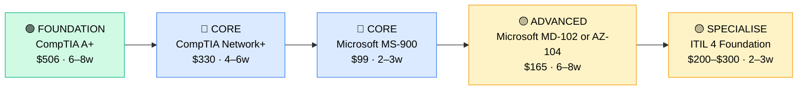

# How to Become an IT Support Analyst (Level 2/3 Support)

**CP03** · **Foundation/Infrastructure** · _Time to hire: 6–12 months_ · _Entry cost: $900–$1,500 USD_

> **Path summary:** This path takes you from Help Desk Technician (1–2 years experience) to IT Support Analyst, broadening your scope beyond first-line reactive support to second-line problem-solving, troubleshooting complex technical issues, and supporting enterprise systems—using CompTIA and Microsoft certifications to document your expanded skillset.

---

## Role Overview

### What does an IT Support Analyst actually do?

An IT Support Analyst is the escalation point—Help Desk hands off complex tickets to you. You spend your day debugging network connectivity issues (ping, traceroute, packet analysis), troubleshooting application crashes (event logs, memory dumps), investigating database connectivity, supporting business-critical systems, assisting with infrastructure changes, and owning the customer relationship for complex issues (often talking directly to clients). You use tools like Wireshark, Event Viewer, application logs, and sometimes you write PowerShell scripts to automate troubleshooting. You're expected to research unknown issues, read documentation, learn on the fly, and provide structured root-cause analysis. Unlike Help Desk, which is reactive (ticket comes in, you fix it), this role is half-reactive, half-proactive—you design ticket templates, improve knowledge bases, and mentor Help Desk staff.

IT Support Analysts work in mid-size to large organisations—you need a complexity baseline to justify the role. Teams range from 5–10 analysts per 200–500 end users. The role is often office-based if supporting on-prem infrastructure, but increasingly remote/hybrid as companies move to cloud services. On-call is common for critical systems (database down, email down)—expect 1 week/month on-call rotation with a 30–60 minute response SLA for major incidents.

### Demand in 2026

- **Global job postings:** 65,000+ active IT Support Analyst roles on LinkedIn as of May 2026 ([LinkedIn Jobs](https://www.linkedin.com/jobs/))
- **Growth rate:** 6% YoY / BLS projects steady growth ([U.S. Bureau of Labor Statistics](https://www.bls.gov/ooh/computer-and-information-technology/computer-support-specialists.htm))
- **South Africa:** Strong demand at banks, insurance, telcos, and large corporates. Nedbank, ABSA, FirstRand, MTN, Vodacom, Old Mutual, and Sanlam all have dedicated Analyst teams. MSPs increasingly hire Analysts to support client infrastructure.
- **Remote availability:** Medium–High. 40%+ of roles globally are remote or hybrid; in South Africa, 50% are remote if supporting cloud infrastructure.

---

## Who Is This Path For?

### Ideal starting backgrounds

| Background | Readiness | What you already have |
|---|---|---|
| Help Desk Technician (1–2 yrs) | ✅ Perfect fit | Troubleshooting mindset, ticket systems, user empathy |
| Desktop Support Specialist | ✅ Perfect fit | Deeper technical knowledge, ready for infrastructure |
| Systems Administrator | ✅ Strong start | Infrastructure knowledge; support-focused work is lateral |
| IT Graduate with internship | ✅ Good start | Theory solid; practical experience needed |
| Network technician | ✅ Strong start | Networking skills carry over |
| Complete beginner | ❌ Not ideal | Start with Help Desk (CP01) first, 1–2 years |

### You're ready to start this path if you can:
- Troubleshoot Windows/Linux issues independently (not just follow a script)
- Read and interpret application logs and event logs
- Understand TCP/IP, DNS, and networking (not just "what's an IP?")
- Have handled 3+ complex tickets where you had to investigate beyond first-line solutions

> **Not ready yet?** Complete CP01 (Help Desk) for 1–2 years, then revisit this path.

---

## Certification Sequence

### Visual path

---

### Stage 1 — Foundation (Months 0–2)

**Goal:** Reinforce fundamentals if you don't already have CompTIA A+ and Network+. If you hold both from Help Desk, skip to Stage 2.

| Cert | Code | Cost (USD) | Study Time | Why it matters |
|---|---|---:|---:|---|
| CompTIA A+ (if needed) | `220-1201/1202` | $506 | 6–8 weeks | Hardware and OS fundamentals. Skip if already held. |
| CompTIA Network+ (if needed) | `N10-009` | $330 | 4–6 weeks | Networking fundamentals essential for Analyst-level troubleshooting. Skip if already held. |

**Stage 1 total:** $0–$836 USD (likely $0 if you have both certs already) · R0–R15,048 ZAR

**Study approach:** If coming from 1–2 years Help Desk with A+ and Network+, skip entirely. If you're missing one, complete it using Professor Messer (free) + practice exams.

**Lab requirement:** If doing Network+, build a GNS3 lab with routers, switches, and clients. Hands-on networking is non-negotiable.

---

### Stage 2 — Core Specialisation (Months 2–6)

**Goal:** Get Microsoft certifications that broaden your scope from endpoints to infrastructure (cloud or hybrid).

| Cert | Code | Cost (USD) | Study Time | Why it matters |
|---|---|---:|---:|---|
| Microsoft MS-900 (Microsoft 365 Fundamentals) | `MS-900` | $99 | 2–3 weeks | Understand Microsoft 365, cloud services, licensing. Many enterprises use M365. |
| Microsoft MD-102 or AZ-104 (choose one) | `MD-102` or `AZ-104` | $165 | 6–8 weeks | MD-102 for endpoint-focused Analysts; AZ-104 for cloud infrastructure Analysts. Choose based on target role. |

**Stage 2 total:** $264 USD · R4,752 ZAR · 8–11 weeks

**Study approach:** Do MS-900 first (2–3 weeks), then choose either MD-102 (Windows endpoints) or AZ-104 (Azure infrastructure). AZ-104 is more advanced but increasingly important for Analysts supporting hybrid cloud environments.

**Project milestone:** If doing AZ-104, deploy a 3-tier application in Azure (frontend, application server, database). If doing MD-102, design an Intune device management policy for a 100-person company and document it.

---

### Stage 3 — Advanced Specialisation (Months 6–10)

**Goal:** Add ITIL 4 Foundation (process methodology) so you can escalate tickets with structure, understand SLAs, and document incidents professionally.

| Cert | Code | Cost (USD) | Study Time | Why it matters |
|---|---|---:|---:|---|
| ITIL 4 Foundation | `ITIL-F` | $200–$300 | 2–3 weeks | IT Service Management process. Analysts manage incidents and changes; ITIL formalises this. |

**Stage 3 total:** $200–$300 USD · R3,600–R5,400 ZAR · 2–3 weeks

**Study approach:** Use the official ITIL 4 Foundation study guide + David Mayer's YouTube course. Focus on: Incident Management (SLA, escalation), Change Management (CAB—Change Advisory Board), and Problem Management (root cause analysis).

**Project milestone:** Document 3 real IT incidents from your Help Desk experience using ITIL Incident Management structure: what was the incident? What was the impact? How was it diagnosed? What was the solution? What was the root cause?

> **Optional at hire time:** Many IT Analysts land jobs after Stage 2 (MS-900 + one Microsoft cert) and complete ITIL while employed. Valid path.

---

### Stage 4 — Expert / Leadership (18–36 months+)

**Goal:** After 2–3 years as Analyst, specialise:

- **Microsoft AZ-300 series** (Solutions Architect, advanced) — if moving toward infrastructure design
- **AWS Solutions Architect Associate** — if company uses AWS
- **Cisco CCNA** — if specialising in networking
- **CompTIA Security+** — if moving toward security-focused roles

---

## Timeline & Cost Summary

| Stage | Certs | Duration | Cost (USD) | Cost (ZAR) |
|---|---|---|---:|---:|
| Stage 1 — Foundation | CompTIA A+/Network+ (if needed) | Weeks 0–14 | $0–$836 | R0–R15,048 |
| Stage 2 — Core | Microsoft MS-900, MD-102 or AZ-104 | Weeks 2–13 | $264 | R4,752 |
| Stage 3 — Advanced | ITIL 4 Foundation | Weeks 13–16 | $200–$300 | R3,600–R5,400 |
| **Total to hireable** | | **12–20 weeks** | **$464–$1,136** | **R8,352–R20,448** |

**Study hours required:** ~180–220 hours total (assuming A+ and Network+ already held). Assumes 12–15 hours/week = 12–18 weeks.

---

## Salary Progression

> All figures: median base salary, not including bonuses. ZAR = USD × 18 baseline (verified May 2026). Sources: Robert Half 2026, Glassdoor, PayScale, LinkedIn Salary.

| Experience Level | USD/year | ZAR/month | GBP/year | EUR/year | AUD/year |
|---|---:|---:|---:|---:|---:|
| Entry / Junior (0–2 yrs) | $45,000–$65,000 | R30,000–R42,000 | £35,000–£50,000 | €42,000–€60,000 | A$72,000–A$104,000 |
| Mid-level (2–5 yrs) | $65,000–$90,000 | R42,000–R58,000 | £50,000–£69,000 | €60,000–€83,000 | A$104,000–A$144,000 |
| Senior (5–8 yrs) | $90,000–$120,000 | R58,000–R76,000 | £69,000–£92,000 | €83,000–€110,000 | A$144,000–A$192,000 |
| Lead / Architect (8+ yrs) | $120,000–$160,000 | R76,000–R102,000 | £92,000–£123,000 | €110,000–€147,000 | A$192,000–A$256,000 |

**South Africa note:** Entry-level IT Support Analysts in major metros earn R30,000–R42,000/month. After 2–3 years with cloud certs (AZ-104), expect R42,000–R60,000/month. Senior Analysts with specialisation (cloud architect, security Analyst) earn R60,000–R90,000/month in major cities. Remote contract work for international companies reaches R70,000–R120,000/month for mid-to-senior Analysts.

**Salary accelerators:** Microsoft AZ-104, AWS Solutions Architect Associate, Cisco CCNA, Python scripting, cloud certifications, and specialisation in critical infrastructure (database support, security) all command premiums in SA listings as of Q1 2026.

---

## First Job Strategy

### Month 0–3: Build the Foundation

1. **Assess your certs** — Do you have A+ and Network+? If not, complete them first (6–8 weeks).
2. **Begin Microsoft MS-900** — Lightweight cert to understand modern cloud services. Use Microsoft Learn (free) + 1-hour YouTube intro. Target: 1–2 weeks.
3. **Set up your lab** — Azure or AWS free tier. You need cloud hands-on. Minimum: deploy a VM, understand networking, understand identity.
4. **Join the community** — Follow r/sysadmin and r/ITSupport on Reddit. Join local tech meetups in your city (Johannesburg, Cape Town, Durban all have active IT communities).

### Month 3–6: Build Your Portfolio

- **Project 1: Incident Report Template** — Design a professional incident report template using ITIL structure. Include: incident ID, timeline, root cause, solution, lessons learned. Show 2 real examples you've worked on.
- **Project 2: Troubleshooting Guide** — Document 5 complex issues you've resolved. For each: problem statement, symptoms, diagnostic steps, solution, why it worked. Show this in interviews.
- **Project 3: Cloud Infrastructure Lab** — In Azure or AWS, deploy: 1 web server, 1 database, 1 network security group. Document with diagrams and screenshots. This demonstrates infrastructure understanding.

### Month 6–12: Apply and Iterate

- **CV positioning:** List yourself as "IT Support Analyst with Microsoft certifications and cloud infrastructure experience." Highlight: ticket volume handled, average resolution time, complex issues resolved, team mentoring.
- **Target companies:** Banks, insurance, large corporates, MSPs, software companies. Avoid startups initially (they often need generalists, not specialists). Government (SARS, Department of Employment) hires Analysts but processes are slow.
- **Interview prep:** Be ready to discuss: 1) A complex technical issue you escalated and resolved, 2) Root-cause analysis methodology, 3) Cloud infrastructure basics (you did the lab), 4) ITIL incident management process, 5) Communication with non-technical stakeholders, 6) On-call experience (if any).
- **Salary negotiation:** Entry-level IT Support Analyst in SA starts R30,000–R36,000/month. With Microsoft certs and cloud experience, justify R36,000–R45,000/month. Don't accept low-ball offers.

---

## A Day in the Life

### IT Support Analyst at a Johannesburg bank — Entry Level

**08:00** — Standup with Help Desk and Analyst team (10 people total). Review escalations from yesterday: 1 critical (email server connectivity issue), 3 high (network problems), 5 medium (application issues). Assign Tier 1 escalations.

**08:30** — Investigate email connectivity issue. Check email server logs, network connectivity from the server, DNS resolution. Discover: network team misconfigured the firewall rule for email protocol. Coordinate with Network team to fix. Updated status with Help Desk.

**10:00** — A user reports that a critical business application (order management system) is crashing on 5 PCs. Check event logs on those machines. All show the same error: database connection timeout. Application doesn't reconnect gracefully. Alert database team and application vendor. In the meantime, document workaround (restart the application).

**11:30** — Update knowledge base: "Application crashes when database connection drops—workaround: restart." This saves Help Desk time next time.

**12:00** — Lunch.

**13:00** — Conference call with application vendor (in US). Review error logs. Vendor identifies: new database driver version has a bug. Recommend rollback. Coordinate with database team to roll back driver on dev and then production. Test with the affected user. Issue resolved.

**14:30** — Ticket: "Email client won't sync on a Mac." This is unusual for the bank (mostly Windows). Investigate: Exchange certificate issue on that specific machine. Update certificate chain. Resolved.

**15:30** — Help Desk requests mentoring on ticket triage. Walk them through: how to differentiate between network, application, and user error. Show them diagnostic tools (ping, nslookup, netstat).

**16:00** — Plan tomorrow. Review open escalations. Prepare for change advisory board (CAB) meeting on Friday (planning a server update).

**17:00** — Wrap up. Tomorrow: participate in CAB meeting, follow up on vendor ticket, continue mentoring.

### IT Support Analyst at a Cape Town tech company (cloud-native) — Mid Level

**09:00** — Start day from home. Check Azure alerts and application logs. Two API endpoints are experiencing high latency. Check Azure Monitor: one service is CPU-throttled, another has a memory leak. Escalate to the respective development teams with diagnostics.

**09:45** — Conference call with vendor (database provider). They're recommending a major version upgrade. Your job: assess impact on running applications, create a test plan, estimate downtime. Provide recommendations to IT leadership.

**11:00** — Ticket from Finance: "I can't upload payroll files to the cloud system." Investigate: file upload is failing at the network layer (packet loss). Work with Network team. Turns out: WiFi signal is weak in that office. Recommend WiFi access point upgrade.

**12:00** — Lunch.

**13:00** — Planning meeting: company is moving to hybrid multi-cloud (Azure + AWS). Your expertise is needed for infrastructure planning. You're being asked to scope the work, timeline, risks.

**14:30** — Mentoring: an entry-level Analyst is struggling with a complex network issue. Walk them through: how to use Wireshark to capture packets, how to read TCP flags, how to identify where the connection is failing.

**15:30** — Document a complex incident: why the API latency happened, what we changed, what the monitoring shows now. This becomes a case study for the team.

**16:30** — Prepare for tomorrow's change management meeting (CAB). Review 3 planned infrastructure changes. Assess risks and impact.

---

## Related Paths & Progressions

| From here you can move to… | Why |
|---|---|
| [Systems Administrator](CP04_Foundation_Systems_Administrator.md) | Own the full infrastructure stack; broader scope than support |
| [Infrastructure Engineer](CP08_Foundation_Infrastructure_Engineer.md) | Specialise in hybrid/cloud infrastructure; move from reactive to proactive |
| [Network Administrator](CP05_Foundation_Network_Administrator.md) | Specialise in networking; network support becomes your focus |
| [IT Operations Manager](CP07_Foundation_IT_Operations_Manager.md) | After 3–5 years Analyst, move into team leadership |

---

## South Africa Context

### Market specifics

IT Support Analyst is a well-valued role in South Africa. Banks (Nedbank, ABSA, FirstRand) employ 20–50+ Analysts each. Telcos (MTN, Vodacom), insurance (Old Mutual, Sanlam), and large corporates all have dedicated Analyst teams. MSPs increasingly hire Analysts to support client environments at scale. Government entities (SARS, Department of Employment) hire Analysts but processes are slow.

The advantage in SA is that Analyst roles pay well relative to Help Desk—the jump from Help Desk to Analyst is typically 25–40% salary increase. This makes it an attractive progression path. However, competition is increasing as more people upskill. Having cloud certifications (AZ-104, AWS) gives you a significant advantage in South Africa's increasingly cloud-focused job market.

Remote work is common for Analyst roles supporting cloud infrastructure. Many international companies hire South African Analysts for EMEA support at premium rates (R60,000–R100,000/month for mid-level). This is attractive if you want higher pay without relocating.

### SA-specific resources

| Resource | URL | Note |
|---|---|---|
| Gumtree IT Jobs (SA) | [https://www.gumtree.co.za/s-it-jobs/](https://www.gumtree.co.za/s-it-jobs/) | Filter for "IT Support Analyst" or "Technical Support" |
| Indeed South Africa | [https://www.indeed.co.za/q-IT-Support-Analyst-jobs.html](https://www.indeed.co.za/q-IT-Support-Analyst-jobs.html) | Active Analyst listings across SA |
| LinkedIn (South Africa) | [https://www.linkedin.com/jobs/search/?keywords=IT%20Support%20Analyst&location=South%20Africa](https://www.linkedin.com/jobs/search/?keywords=IT%20Support%20Analyst&location=South%20Africa) | Major tech and corporates post here |
| Microsoft Learn | [https://learn.microsoft.com/en-us/training/](https://learn.microsoft.com/en-us/training/) | Free training for AZ-104, MS-900 |
| Dimension Data (SA) | [https://www.dimensiondata.com/en-za](https://www.dimensiondata.com/en-za) | Major MSP hiring Analysts; SA-based |

---

## Frequently Asked Questions

**Q: Do I need all these certs to get hired as an Analyst?**

No. A+ and Network+ + one Microsoft cert (MS-900 or MD-102) is enough for entry-level. ITIL is valuable but not always required on day one. You can add it after hire if needed.

**Q: How long does it take from Help Desk to Analyst?**

6–12 months if you have Help Desk experience and study 12–15 hours/week. If you're missing A+ and Network+, add 10–14 weeks. Most people transition after 1–2 years in Help Desk.

**Q: Should I choose MD-102 or AZ-104?**

MD-102 if your target company is Windows-endpoint heavy (banks, corporates with traditional setups). AZ-104 if they're cloud-first (tech companies, startups, modern enterprises). AZ-104 is slightly harder but opens more doors in 2026.

**Q: Can I do this path while working Help Desk?**

Yes. Most people do. Study 10–12 hours/week while working. It takes longer (8–12 months instead of 6–8 months), but it's manageable. Many employers subsidise exam costs—ask.

**Q: Is ITIL 4 Foundation worth it?**

Yes, increasingly. 60%+ of Analyst job postings now list ITIL as "preferred." It's cheap ($200–$300) and fast (2–3 weeks). Do it.

---

## Sources & Further Reading

| # | Source | URL | Used for |
|---|---|---|---|
| 1 | Microsoft Learn | [Microsoft AZ-104 Training](https://learn.microsoft.com/en-us/training/paths/administrator/) | Official Azure Administrator training |
| 2 | U.S. Bureau of Labor Statistics | [Computer Support Specialists Outlook](https://www.bls.gov/ooh/computer-and-information-technology/computer-support-specialists.htm) | Job growth, work environment |
| 3 | Robert Half 2026 IT Salary Guide | [Robert Half Technology Salary Guide](https://www.roberthalf.com/us/en/salary-guide) | Salary data for IT Support Analysts |
| 4 | Glassdoor | [IT Support Analyst Salaries](https://www.glassdoor.com/Salaries/it-support-analyst-salary-SRCH_KO0,21.htm) | Global salary benchmarks |
| 5 | PayScale (South Africa) | [IT Support Analyst Salary (ZA)](https://www.payscale.com/research/ZA/Job=IT_Support_Analyst/Salary) | ZA-specific salary data |
| 6 | Axelos ITIL 4 | [ITIL 4 Foundation Certification](https://www.axelos.com/certifications/itil-certifications) | ITIL exam details and study resources |
| 7 | CompTIA Network+ | [CompTIA Network+ Certification](https://www.comptia.org/certifications/network) | Network+ exam code and details |
| 8 | Azure Free Tier | [Azure Free Account](https://azure.microsoft.com/en-us/free/) | Free cloud lab environment |

---

*Template version: 2026-05-02 | Maintained by IT Career Roadmap | ZAR baseline: R18/$1 USD*
*File: Career_Paths/CP03_Foundation_IT_Support_Analyst.md*
