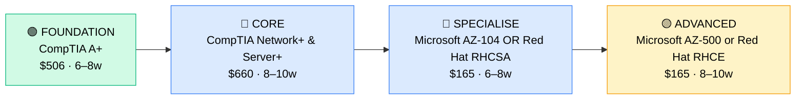

# How to Become a Systems Administrator

**CP04** · **Foundation/Infrastructure** · _Time to hire: 12–18 months_ · _Entry cost: $1,200–$2,000 USD_

> **Path summary:** This path takes you from IT Support background (1–2 years) to a hired Systems Administrator role, owning on-premise and hybrid server infrastructure using CompTIA, Microsoft, or Red Hat certifications—moving from reactive support to proactive infrastructure management, automation, and planning.

---

## Role Overview

### What does a Systems Administrator actually do?

A Systems Administrator owns server infrastructure. You spend your day: provisioning new servers (Windows Server or Linux), configuring virtual machines, managing storage arrays, setting up backup policies and disaster recovery, patching and updating systems (applying security updates, managing downtime), troubleshooting application-layer problems (database server down, web server crashing), planning capacity (will we run out of disk space?), writing scripts to automate tasks (PowerShell, Bash, Python), managing user access (Active Directory for Windows, LDAP for Linux), and advising on infrastructure decisions (should we migrate to cloud? Upgrade storage?). You own the uptime and performance of the systems that run the business. Help Desk calls you when they can't fix something; Analysts escalate to you for infrastructure issues.

Sysadmins work in any organisation with on-prem servers: banks, corporates, government, hospitals, universities, MSPs, and software companies. Teams range from 1–2 sysadmins in small companies (they do everything) to 10–20+ in large enterprises (each specialises: database, storage, security). Most roles require office presence for hardware maintenance but increasingly hybrid/remote as infrastructure moves to cloud. On-call is common—expect 1 week/month on-call rotation with a 15–30 minute response time for critical outages.

### Demand in 2026

- **Global job postings:** 75,000+ active Systems Administrator roles on LinkedIn as of May 2026 ([LinkedIn Jobs](https://www.linkedin.com/jobs/))
- **Growth rate:** 5% YoY / BLS projects steady demand ([U.S. Bureau of Labor Statistics](https://www.bls.gov/ooh/computer-and-information-technology/database-administrators-and-architects.htm))
- **South Africa:** Strong demand at banks (Nedbank, ABSA, FirstRand), telcos (MTN, Vodacom), large corporates, government (SARS, Department of Employment), and universities (UCT, Wits, Stellenbosch). Government and finance are the largest employers.
- **Remote availability:** Medium. 25–35% of Sysadmin roles globally are remote; in South Africa, on-site is more common (70%) due to hardware maintenance needs, but cloud-focused roles offer remote options.

---

## Who Is This Path For?

### Ideal starting backgrounds

| Background | Readiness | What you already have |
|---|---|---|
| IT Support Analyst (1–2 yrs) | ✅ Perfect fit | Infrastructure knowledge, troubleshooting, escalation handling |
| Desktop Support Specialist | ✅ Strong start | User management, Active Directory, Group Policy foundations |
| Help Desk Technician (2+ yrs) | ✅ Strong start | OS knowledge, user mindset; needs infrastructure depth |
| IT graduate with internship | ✅ Good start | Theory solid; needs hands-on server experience |
| Network technician | 🟡 Good but gaps | Networking knowledge strong; server OS needs learning |
| Developer / Programmer | 🟡 Lateral move | Scripting skills valuable; infrastructure is new domain |
| Complete beginner | ❌ Not ideal | Start with Help Desk (CP01) for 1–2 years first |

### You're ready to start this path if you can:
- Troubleshoot Windows or Linux issues independently (not just endpoints—server OS)
- Understand server roles (file server, print server, domain controller, database server)
- Explain what a virtual machine is and why it matters
- Have 1+ years of IT support experience

> **Not ready yet?** Complete CP01 (Help Desk) and work 1–2 years in support before moving to Sysadmin track.

---

## Certification Sequence

### Visual path

---

### Stage 1 — Foundation (Months 0–2)

**Goal:** Prove you have Windows/Linux OS knowledge and networking fundamentals—baseline for Sysadmin work. Skip if you already hold CompTIA A+ and Network+.

| Cert | Code | Cost (USD) | Study Time | Why it matters |
|---|---|---:|---:|---|
| CompTIA A+ (if needed) | `220-1201/1202` | $506 | 6–8 weeks | Hardware and OS fundamentals. Skip if held. |
| CompTIA Network+ (if needed) | `N10-009` | $330 | 4–6 weeks | Networking fundamentals essential for sysadmin. Skip if held. |

**Stage 1 total:** $0–$836 USD (likely $0 if already held) · R0–R15,048 ZAR

**Study approach:** If coming from IT Support with 1–2 years experience, you likely hold these. If not, complete using Professor Messer (free) + practice exams. Prioritise Network+ over A+ for Sysadmin track.

**Lab requirement:** GNS3 lab for networking. Hands-on understanding of routing, switching, TCP/IP is essential for infrastructure work.

---

### Stage 2 — Core Specialisation (Months 2–6)

**Goal:** Get CompTIA Server+ (vendor-neutral foundation for server administration) to prove you understand server roles, maintenance, and uptime concepts.

| Cert | Code | Cost (USD) | Study Time | Why it matters |
|---|---|---:|---:|---|
| CompTIA Server+ | `SK0-005` | $330 | 5–6 weeks | Server hardware, RAID, virtual machines, patch management, disaster recovery. Vendor-neutral foundation. |

**Stage 2 total:** $330 USD · R5,940 ZAR · 5–6 weeks

**Study approach:** Use Jason Dion's Server+ Udemy course ($12–$15 on sale) + Professor Messer's YouTube videos. Server+ is lighter than CCNA but heavier than Network+. Covers real sysadmin scenarios. Do 30–40 practice questions per day in weeks 4–6.

**Project milestone:** Set up a home lab with VirtualBox: 1 Windows Server with Active Directory, 1 file server sharing folders, 1 Linux server running Apache web server. Document the setup with screenshots and step-by-step guide. This demonstrates hands-on understanding.

---

### Stage 3 — Advanced Specialisation (Months 6–10)

**Goal:** Choose vendor-specific path: Microsoft (Azure/Windows Server) or Red Hat (Linux). Both are valuable; choose based on your target market.

**Option A: Microsoft Windows Server Path**

| Cert | Code | Cost (USD) | Study Time | Why it matters |
|---|---|---:|---:|---|
| Microsoft AZ-104 (Azure Administrator) | `AZ-104` | $165 | 6–8 weeks | Manages hybrid Windows/cloud infrastructure. Core cert for Windows Sysadmins moving to cloud. |

**Option B: Red Hat Linux Path**

| Cert | Code | Cost (USD) | Study Time | Why it matters |
|---|---|---:|---:|---|
| Red Hat RHCSA (Red Hat Certified System Administrator) | `EX200` | $400 | 8–10 weeks | Linux server administration on RHEL/CentOS. If targeting Linux-heavy organisations. |

**Stage 3 total:** $165 (Microsoft) or $400 (Red Hat) · R2,970 or R7,200 ZAR

**Study approach (Microsoft):** Use Microsoft Learn (free, official) + Jon Bonso's AZ-104 practice exams (Udemy). AZ-104 requires hands-on Azure. Use free tier ($200/month credit).

**Study approach (Red Hat):** Use Red Hat's official training or Linux Academy (now Pluralsight). Red Hat exams are performance-based—you sit at a terminal and perform real tasks. More challenging but highly respected.

**Project milestone (Microsoft):** Deploy a 3-tier application in Azure: frontend (App Service), application layer (VMs), backend (SQL Database). Configure backup, scaling, and monitoring.

**Project milestone (Red Hat):** Set up a Linux server with Apache web server, MariaDB database, SSL certificates, user management, SELinux policies, and automated backups.

---

### Stage 4 — Expert / Leadership (18–36 months+)

**Goal:** After 2–3 years Sysadmin, specialise:

- **Microsoft AZ-500** (Azure Security Engineer, $165, 8–10 weeks) — if moving toward security
- **Red Hat RHCE** (Red Hat Certified Engineer, $400, 8–10 weeks) — if specialising in advanced Linux
- **VMware VCP-DCV** (vSphere, 2V0-21.23, $300, 6–8 weeks) — if managing virtual infrastructure
- **CompTIA Security+** (SY0-701, $370, 6–8 weeks) — if moving toward security roles

---

## Timeline & Cost Summary

| Stage | Certs | Duration | Cost (USD) | Cost (ZAR) |
|---|---|---|---:|---:|
| Stage 1 — Foundation | CompTIA A+/Network+ (if needed) | Weeks 0–14 | $0–$836 | R0–R15,048 |
| Stage 2 — Core | CompTIA Server+ | Weeks 6–12 | $330 | R5,940 |
| Stage 3 — Advanced | Microsoft AZ-104 OR Red Hat RHCSA | Weeks 12–20 | $165–$400 | R2,970–R7,200 |
| **Total to hireable** | | **18–20 weeks** | **$495–$1,236** | **R8,910–R22,248** |

**Study hours required:** ~220–280 hours total (assuming A+ and Network+ already held). Assumes 12–15 hours/week = 15–20 weeks.

---

## Salary Progression

> All figures: median base salary, not including bonuses. ZAR = USD × 18 baseline (verified May 2026). Sources: Robert Half 2026, Glassdoor, PayScale, LinkedIn Salary.

| Experience Level | USD/year | ZAR/month | GBP/year | EUR/year | AUD/year |
|---|---:|---:|---:|---:|---:|
| Entry / Junior (0–2 yrs) | $55,000–$75,000 | R36,000–R48,000 | £42,000–£58,000 | €50,000–€69,000 | A$88,000–A$120,000 |
| Mid-level (2–5 yrs) | $75,000–$110,000 | R48,000–R71,000 | £58,000–£85,000 | €69,000–€101,000 | A$120,000–A$176,000 |
| Senior (5–8 yrs) | $110,000–$150,000 | R71,000–R97,000 | £85,000–£115,000 | €101,000–€137,000 | A$176,000–A$240,000 |
| Lead / Architect (8+ yrs) | $150,000–$200,000 | R97,000–R129,000 | £115,000–£153,000 | €137,000–€182,000 | A$240,000–A$320,000 |

**South Africa note:** Entry-level Sysadmins in major metros earn R36,000–R48,000/month. After 2–3 years with cloud certs, expect R48,000–R70,000/month. Senior Sysadmins with specialisation (infrastructure design, security) earn R70,000–R120,000/month in major cities. Government and banking tend toward lower end; tech companies toward higher end. Remote contract work for international companies reaches R80,000–R150,000/month for mid-to-senior Sysadmins.

**Salary accelerators:** Microsoft AZ-104, AZ-500; Red Hat RHCSA, RHCE; automation skills (PowerShell, Bash, Python, Terraform); cloud infrastructure (AWS, Azure); virtualisation (VMware); and security certifications all command premiums in SA listings as of Q1 2026.

---

## First Job Strategy

### Month 0–3: Build the Foundation

1. **Assess your certs** — Do you have A+, Network+? If not, complete them first.
2. **Begin CompTIA Server+** — Use Jason Dion's Udemy course ($12–$15 on sale). Target: 5–6 weeks.
3. **Set up your lab** — VirtualBox home lab with Windows Server and Linux server. You need hands-on. Spend 20–30 hours in the lab building and troubleshooting.
4. **Learn scripting basics** — PowerShell for Windows OR Bash for Linux. Spend 1–2 weeks learning. Sysadmins script; it's non-negotiable.

### Month 3–6: Build Your Portfolio

- **Project 1: Windows Server Lab Documentation** — Document a complete Windows Server setup: Active Directory, file shares, Group Policy, user provisioning. Include security best practices. This is portfolio gold.
- **Project 2: Linux Server Lab Documentation** — Set up a RHEL/CentOS server with Apache, MariaDB, SSL, user management, backup policy. Document everything.
- **Project 3: Automation Script** — Write a PowerShell script that provisions new user accounts (create AD user, add to groups, create home folder, set permissions) OR a Bash script for Linux. Show real utility—make it something a sysadmin would actually use.

### Month 6–12: Apply and Iterate

- **CV positioning:** List yourself as "Systems Administrator with Windows Server and Azure / Red Hat Linux expertise." Highlight: uptime achievements, automation projects, infrastructure improvements you've driven.
- **Target companies:** Banks, insurance, large corporates, government, universities, MSPs. Avoid small startups (they often want generalists, not specialists). Government hires Sysadmins but processes are slow (3–6 months).
- **Interview prep:** Be ready to discuss: 1) A complex infrastructure issue you've managed, 2) Your lab setup (show knowledge, not just theory), 3) A script you've written, 4) Disaster recovery planning, 5) Patch management policy, 6) Scalability and capacity planning.
- **Salary negotiation:** Entry-level Sysadmin in SA starts R36,000–R44,000/month. With Server+ and one vendor cert (AZ-104 or RHCSA), justify R44,000–R55,000/month. Don't accept lowball offers—Sysadmin roles pay well for a reason.

---

## A Day in the Life

### Systems Administrator at a Johannesburg bank — Entry Level

**07:45** — Arrive early. Check infrastructure monitoring (Nagios/Zabbix console). 2 alerts: disk space on file server at 85% (warning), network latency on one segment (investigating). Disk space is manageable; network team is looking at latency.

**08:30** — Standup with IT team. Announce: planned maintenance window this weekend (patch Tuesday patches going out). Review status of ongoing projects.

**09:00** — Patch Windows Server 2019 machines in the development environment. Apply security updates from Microsoft. Test with a subset first, then push to full fleet. Coordinate with application teams—patching requires a reboot; they need to know downtime window.

**10:30** — New employee onboarding. Provision: new user account in Active Directory, email mailbox in Exchange, home folder on file server, group memberships. Set up their laptop to connect to domain and shares. This takes 30 minutes end-to-end with automation.

**11:30** — Ticket: "Database server disk is full." Investigate. Customer data has grown 300% in the past quarter. Immediate: expand the storage (LUN expansion in the SAN). Medium-term: discuss archiving strategy with database team and business. Reboot database server after expansion.

**12:30** — Lunch with Sysadmin colleague. Discuss upcoming Windows Server 2025 migration planning.

**13:30** — Backup verification. Review backup logs from the previous night. All critical servers backed up successfully. One backup of an archive server failed—investigate storage connectivity. Rerun backup. Document issue.

**14:30** — Configuration management work. Update server inventory in CMDB (Configuration Management Database). Document server roles, dependencies, contacts.

**15:30** — Mentoring: Help Desk staff are escalating tickets to you. Walk them through: what questions should they ask before escalating? How to check event logs on a server? This reduces unnecessary escalations.

**16:30** — Plan tomorrow. Monitor alerts. Prepare for Friday's change advisory board (CAB) meeting—you're proposing an upgrade to the storage infrastructure.

**17:00** — Wrap up. Update ticket documentation. You're on-call this week; keep your phone nearby.

### Systems Administrator at a Cape Town tech company (cloud-first hybrid) — Mid Level

**09:00** — Start day from home. Check Azure and on-prem infrastructure monitoring (hybrid environment). One on-prem server is approaching CPU saturation. Review metrics. Workload is growing; recommend scaling the server (vertical scale—add CPU/RAM).

**09:45** — Conference call with infrastructure team. Planning migration of 10 on-prem file servers to Azure Files (cloud file storage). Estimate timeline, costs, data transfer approach, user impact. Your voice carries weight here.

**11:00** — Execute a planned capacity upgrade: add storage to the cloud SQL database. No downtime (cloud platforms enable this). Verify: application connections remain stable, backup still works.

**12:00** — Lunch.

**13:00** — Automation work. Write a PowerShell script to automatically provision new VMs in Azure: create VM, configure networking, install updates, enrol in MDM. Save 30 minutes per VM provisioning. This is what differentiates a good Sysadmin from a great one.

**14:30** — Disaster recovery drill. Simulate a data centre failure (on-prem). Failover to Azure backup. Measure RPO (Recovery Point Objective) and RTO (Recovery Time Objective). Document lessons learned.

**15:30** — Update infrastructure documentation. Keep wiki current on: server roles, network topology, backup strategy, escalation procedures. This is what onboards new Sysadmins.

**16:30** — Prepare for change management meeting. Review 5 planned infrastructure changes. Assess risks, document rollback plans.

---

## Related Paths & Progressions

| From here you can move to… | Why |
|---|---|
| [Infrastructure Engineer](CP08_Foundation_Infrastructure_Engineer.md) | Design and architect infrastructure; move from operations to engineering |
| [Network Administrator](CP05_Foundation_Network_Administrator.md) | Specialise in networking; network infrastructure becomes your focus |
| [IT Operations Manager](CP07_Foundation_IT_Operations_Manager.md) | After 3–5 years Sysadmin, move into team leadership |
| [Cloud Architect](../Cloud_Paths/Senior_Cloud_Architect.md) | Specialise in cloud infrastructure design and strategy |

---

## South Africa Context

### Market specifics

Systems Administrator is a stable, well-paid role in South Africa. Banks (Nedbank, ABSA, FirstRand, Standard Bank) employ 30–100+ Sysadmins each. Large corporates (JSE-listed companies), telcos (MTN, Vodacom), insurance (Old Mutual, Sanlam), and government (SARS, Department of Employment) all hire. Government and finance are the largest sectors.

The advantage in SA is that traditional on-prem infrastructure is still prevalent—many organisations still run significant on-prem datacentres alongside cloud. This creates demand for Sysadmins skilled in both. However, the trend is clear: hybrid/cloud-skilled Sysadmins command premium salaries. Adding AZ-104 or Red Hat RHCSA significantly improves your competitiveness.

Remote work is growing but not dominant—most Sysadmin work requires on-prem presence for hardware maintenance, patching, and physical access. However, cloud-focused organisations (tech companies, fintech) offer remote Sysadmin roles. International companies hiring from SA offer remote roles at premium rates (R80,000–R150,000/month for mid-level).

BEE/EE is significant in government and banking. However, technical skills matter most—your certs and hands-on portfolio are your strongest hiring assets.

### SA-specific resources

| Resource | URL | Note |
|---|---|---|
| Gumtree IT Jobs (SA) | [https://www.gumtree.co.za/s-it-jobs/](https://www.gumtree.co.za/s-it-jobs/) | Filter for "Systems Administrator" or "Sysadmin" |
| Indeed South Africa | [https://www.indeed.co.za/q-Systems-Administrator-jobs.html](https://www.indeed.co.za/q-Systems-Administrator-jobs.html) | Active Sysadmin listings across SA |
| LinkedIn (South Africa) | [https://www.linkedin.com/jobs/search/?keywords=Systems%20Administrator&location=South%20Africa](https://www.linkedin.com/jobs/search/?keywords=Systems%20Administrator&location=South%20Africa) | Major corporates post here |
| Red Hat Training (South Africa) | [https://www.redhat.com/en/services/training-and-certification](https://www.redhat.com/en/services/training-and-certification) | Red Hat certification and training |
| Dimension Data (SA) | [https://www.dimensiondata.com/en-za](https://www.dimensiondata.com/en-za) | Major MSP hiring Sysadmins; SA-based |

---

## Frequently Asked Questions

**Q: Do I need all these certs?**

No. Server+ + one vendor cert (AZ-104 or RHCSA) is enough for entry-level. Many Sysadmins are hired with Server+ alone, then complete vendor certs on the job.

**Q: Should I learn Windows Server or Linux?**

Both are valuable. Windows Server if targeting banks, corporates, government. Linux (Red Hat/CentOS) if targeting tech companies, cloud, or smaller startups. For maximum flexibility, learn both.

**Q: How long does it take from Help Desk to Sysadmin?**

12–18 months if you have IT Support experience and study 12–15 hours/week. If you're starting from zero, add 10–14 weeks for A+ and Network+.

**Q: Can I do this path while working full-time?**

Yes, most people do. Study 10–12 hours/week while working Help Desk or Support. It takes longer (18–24 months instead of 12–18 months), but it's achievable.

**Q: Which cert is most valuable in SA?**

Microsoft AZ-104 if you want flexibility and cloud knowledge. Red Hat RHCSA if you want deep Linux expertise. CompTIA Server+ is vendor-neutral and respected—good foundation either way.

---

## Sources & Further Reading

| # | Source | URL | Used for |
|---|---|---|---|
| 1 | Microsoft Learn | [Azure Administrator (AZ-104) Training](https://learn.microsoft.com/en-us/training/paths/administrator/) | Official Microsoft training |
| 2 | Red Hat Training | [RHCSA Certification](https://www.redhat.com/en/services/training-and-certification) | Red Hat certification details |
| 3 | CompTIA Server+ | [CompTIA Server+ Certification](https://www.comptia.org/certifications/server) | Exam code SK0-005, cost, objectives |
| 4 | Robert Half 2026 IT Salary Guide | [Robert Half Technology Salary Guide](https://www.roberthalf.com/us/en/salary-guide) | Salary data for Sysadmins |
| 5 | Glassdoor | [Systems Administrator Salaries](https://www.glassdoor.com/Salaries/systems-administrator-salary-SRCH_KO0,21.htm) | Global salary benchmarks |
| 6 | PayScale (South Africa) | [Systems Administrator Salary (ZA)](https://www.payscale.com/research/ZA/Job=Systems_Administrator/Salary) | ZA-specific salary data |
| 7 | Jason Dion Udemy | [CompTIA Server+ Course](https://www.udemy.com/) | Practical Server+ training (search "Jason Dion Server+") |
| 8 | Azure Free Tier | [Azure Free Account](https://azure.microsoft.com/en-us/free/) | Free lab environment for AZ-104 |

---

*Template version: 2026-05-02 | Maintained by IT Career Roadmap | ZAR baseline: R18/$1 USD*
*File: Career_Paths/CP04_Foundation_Systems_Administrator.md*
