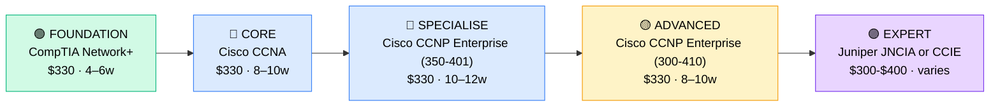

# How to Become a Network Administrator

**CP05** · **Foundation/Infrastructure** · _Time to hire: 10–16 months_ · _Entry cost: $1,100–$1,800 USD_

> **Path summary:** This path takes you from IT Support or networking background (1–2 years) to a hired Network Administrator role, specialising in routing, switching, network security, and troubleshooting using CompTIA and Cisco certifications—owning the organisation's network infrastructure.

---

## Role Overview

### What does a Network Administrator actually do?

A Network Administrator owns the network. You spend your day: configuring and maintaining routers and switches (Cisco, Juniper, Arista), managing network security (firewalls, intrusion detection), troubleshooting connectivity issues (using Wireshark, ping, traceroute), planning network capacity and growth, setting up VLANs and subnetting, managing network monitoring tools (Nagios, SolarWinds), deploying VPNs for remote access, and advising on network design (should we upgrade the core switch?). You're responsible for keeping the network up and secure. When Help Desk escalates a "network is slow" ticket, it lands on your desk. Users depend on the network you maintain.

Network Administrators work in any organisation with complex networking: banks, telcos, large corporates, government, universities, ISPs, and MSPs. Teams range from 1–2 in small companies to 10–20+ in large enterprises with multi-site WAN. Most roles are office-based due to hardware maintenance needs, but increasingly hybrid with remote options for monitoring and design work. On-call is common—expect 1 week/month on-call rotation with a 15–30 minute response time for network outages.

### Demand in 2026

- **Global job postings:** 60,000+ active Network Administrator roles on LinkedIn as of May 2026 ([LinkedIn Jobs](https://www.linkedin.com/jobs/))
- **Growth rate:** 4% YoY / BLS projects steady demand ([U.S. Bureau of Labor Statistics](https://www.bls.gov/ooh/computer-and-information-technology/network-and-computer-systems-administrators.htm))
- **South Africa:** Strong demand at telcos (MTN, Vodacom, Telkom), banks (Nedbank, ABSA), large corporates, ISPs (Liquid Intelligent Technologies, Afrihost), and government. Telcos are the largest employers of Network Administrators in SA.
- **Remote availability:** Medium. 20–30% of Network Admin roles globally are remote; in South Africa, on-site is more common (75%) due to hardware and site visits, but cloud-network roles offer remote options.

---

## Who Is This Path For?

### Ideal starting backgrounds

| Background | Readiness | What you already have |
|---|---|---|
| Network technician (1+ yrs) | ✅ Perfect fit | Networking fundamentals, hands-on switching/routing |
| IT Support with network focus | ✅ Strong start | Troubleshooting mindset, networking knowledge base |
| Systems Administrator | ✅ Strong start | Infrastructure experience, learning networking is lateral |
| CCNA student / IT graduate | ✅ Good start | Theory solid; hands-on lab work needed |
| Help Desk Technician (2+ yrs) | 🟡 Possible | Needs formal networking training and hands-on labs |
| Complete beginner | ❌ Not ideal | Start with IT Support (CP01) first, focus on networking |

### You're ready to start this path if you can:
- Explain TCP/IP model, OSI model, and why they matter
- Understand subnetting and CIDR notation
- Know what a VLAN is and why it matters
- Have hands-on experience with at least one switch or router
- Be comfortable with command-line interfaces (CLI)

> **Not ready yet?** Complete CP01 (Help Desk) or spend 1–2 years in IT Support with networking focus, learning network fundamentals and Cisco basics through labs.

---

## Certification Sequence

### Visual path

---

### Stage 1 — Foundation (Months 0–2)

**Goal:** Prove you have networking fundamentals (TCP/IP, OSI model, routing, switching). CompTIA Network+ is the foundation cert for networking professionals.

| Cert | Code | Cost (USD) | Study Time | Why it matters |
|---|---|---:|---:|---|
| CompTIA Network+ | `N10-009` | $330 | 4–6 weeks | TCP/IP, OSI model, routing, switching, wireless, VPNs, security. Foundation for all networking roles. |

**Stage 1 total:** $330 USD · R5,940 ZAR · 4–6 weeks

**Study approach:** Use Professor Messer's Network+ videos (free YouTube) paired with Jason Dion's Udemy practice exams ($12–$15 on sale). Network+ has a significant practical component—understand concepts deeply, not just memorise. Do 40–50 practice questions daily in weeks 4–6.

**Lab requirement:** GNS3 home lab is mandatory. Set up: 2 routers, 2 switches, 4 client PCs. Practice: basic routing, VLAN configuration, static and dynamic routing (RIP, OSPF). Minimum 20 hours of hands-on lab work before exam.

---

### Stage 2 — Core Specialisation (Months 2–8)

**Goal:** Get Cisco CCNA (Cisco Certified Network Associate), the anchor cert for Network Administrators. CCNA proves hands-on networking skills and is highly respected globally.

| Cert | Code | Cost (USD) | Study Time | Why it matters |
|---|---|---:|---:|---|
| Cisco CCNA | `200-301` | $330 | 8–10 weeks | Cisco switching, routing, network services, infrastructure security. CCNA is the industry standard for Network Admins. |

**Stage 2 total:** $330 USD · R5,940 ZAR · 8–10 weeks

**Study approach:** Use Jeremy's IT Lab CCNA course (YouTube, free and excellent), paired with Neil Anderson's Udemy course ($12–$15 on sale). Cisco exams are detailed and practical—you need to understand routing protocols (OSPF, EIGRP), switching concepts (STP, VLANs), and security basics. Do 30–40 practice questions daily in weeks 7–10.

**Lab requirement:** GNS3 home lab, but more complex: 4–5 routers, multiple switches, multiple subnets, static and dynamic routing. Practice: routing protocol configuration, VLAN trunking, ACL (Access Control List) design. Minimum 40–50 hours of lab work.

---

### Stage 3 — Advanced Specialisation (Months 8–14)

**Goal:** Get Cisco CCNP Enterprise to differentiate yourself—move from "I know the basics" to "I'm a network expert." CCNP has two exams; complete both for full certification.

| Cert | Code | Cost (USD) | Study Time | Why it matters |
|---|---|---:|---:|---|
| Cisco CCNP Enterprise Core | `350-401` | $330 | 10–12 weeks | Advanced routing, switching, troubleshooting. Core knowledge for Network Admins. |
| Cisco CCNP Enterprise Route (Infrastructure) | `300-410` | $330 | 8–10 weeks | Deep routing expertise: OSPF, BGP, VPN, QoS. |

**Stage 3 total:** $660 USD · R11,880 ZAR · 18–22 weeks

**Study approach:** Do 350-401 first (broader knowledge), then 300-410 (routing deep-dive). Use Network Direction's CCNP course (Udemy, $12–$15 on sale) or Cisco DevNet learning. These exams are significantly harder than CCNA—expect 3–4 months of dedicated study per exam.

**Project milestone:** Design and implement a multi-site WAN topology in GNS3: main office, 2 branch offices, all connected via OSPF/BGP routing. Implement redundancy (backup links), QoS, and basic security filtering.

> **Optional at hire time:** Many Network Admins land roles with CCNA alone (6–8 months total time). CCNP takes longer (14–18 months) but opens senior/architect roles. Both are valid hiring points.

---

### Stage 4 — Expert / Leadership (24–36 months+)

**Goal:** After 2–3 years as Network Administrator, consider specialisation:

- **Cisco CCNP Security** (advanced security focus) — $1,000+, 12–16 weeks
- **Juniper JNCIA / JNCIS** (alternative vendor) — $300–$400, 8–12 weeks
- **Cisco CCIE Enterprise Infrastructure** (expert level, requires 3–5 years experience) — $300, 20–40 weeks of study

These are for progression beyond entry-level Network Admin.

---

## Timeline & Cost Summary

| Stage | Certs | Duration | Cost (USD) | Cost (ZAR) |
|---|---|---|---:|---:|
| Stage 1 — Foundation | CompTIA Network+ | Weeks 0–6 | $330 | R5,940 |
| Stage 2 — Core | Cisco CCNA | Weeks 6–16 | $330 | R5,940 |
| Stage 3 — Advanced | Cisco CCNP (350-401 + 300-410) | Weeks 16–38 | $660 | R11,880 |
| **Total to hireable** | | **16–24 weeks** | **$660–$1,320** | **R11,880–R23,760** |

**Study hours required:** ~280–350 hours total (Stage 1–2). Assumes 15–18 hours/week = 16–24 weeks. CCNP adds another 300–350 hours.

---

## Salary Progression

> All figures: median base salary, not including bonuses. ZAR = USD × 18 baseline (verified May 2026). Sources: Robert Half 2026, Glassdoor, PayScale, LinkedIn Salary.

| Experience Level | USD/year | ZAR/month | GBP/year | EUR/year | AUD/year |
|---|---:|---:|---:|---:|---:|
| Entry / Junior (0–2 yrs) | $55,000–$72,000 | R36,000–R46,000 | £42,000–£55,000 | €50,000–€66,000 | A$88,000–A$115,000 |
| Mid-level (2–5 yrs) | $72,000–$105,000 | R46,000–R68,000 | £55,000–£81,000 | €66,000–€97,000 | A$115,000–A$168,000 |
| Senior (5–8 yrs) | $105,000–$140,000 | R68,000–R91,000 | £81,000–£108,000 | €97,000–€129,000 | A$168,000–A$224,000 |
| Lead / Architect (8+ yrs) | $140,000–$180,000 | R91,000–R117,000 | £108,000–£139,000 | €129,000–€166,000 | A$224,000–A$288,000 |

**South Africa note:** Entry-level Network Admins in major metros (Johannesburg, Cape Town) earn R36,000–R46,000/month. Telcos (MTN, Vodacom) tend toward the higher end. After 2–3 years with CCNP, expect R46,000–R68,000/month. Senior Network Admins (8+ years, with CCNP) earn R68,000–R120,000/month. Remote contract work for international companies reaches R80,000–R150,000/month for mid-to-senior admins.

**Salary accelerators:** Cisco CCNP Enterprise, Juniper JNCIA/JNCIS, advanced routing skills (BGP, OSPF), security certifications, and specialisation in network design or cloud networking all command premiums in SA listings as of Q1 2026.

---

## First Job Strategy

### Month 0–2: Build the Foundation

1. **Begin CompTIA Network+** — Use Professor Messer (free YouTube) + Jason Dion Udemy exams. Target: 4–6 weeks.
2. **Set up your lab** — GNS3 with basic router/switch setup. You must have hands-on experience. Spend 20 hours minimum.
3. **Join networking communities** — Follow r/ccna, r/networking on Reddit. Join Cisco Learning Network. Follow content creators like Jeremy's IT Lab.
4. **Start CCNA basics** — Overlap the last 2 weeks of Network+ with intro CCNA material. Get your mind primed for the harder exam.

### Month 2–6: Build Your Portfolio

- **Project 1: GNS3 Network Design Documentation** — Design a small corporate network (main office, 2 branches, 100 users). Include: network diagram, IP addressing scheme, VLAN design, routing protocol choice, security considerations. Document with screenshots.
- **Project 2: CCNA Lab Configuration** — Set up a working GNS3 lab: 3 routers with OSPF dynamic routing, 2 switches with VLAN trunking, 4 client PCs with proper routing. Show the configuration and screenshots.
- **Project 3: Network Troubleshooting Guide** — Document 5 networking issues you've encountered or studied: packet loss, routing failures, VLAN connectivity. For each: symptom, diagnostic steps (ping, traceroute, show commands), solution.

### Month 6–16: Apply and Iterate

- **CV positioning:** List yourself as "Network Administrator with Cisco CCNA" (or CCNP when earned). Highlight: network infrastructure managed, uptime achieved, project implementations, hands-on router/switch experience.
- **Target companies:** Telcos (MTN, Vodacom, Telkom), banks (Nedbank, ABSA, FirstRand), ISPs (Liquid, Afrihost), large corporates, government. Telcos are the largest employers. MSPs also hire Network Admins.
- **Interview prep:** Be ready to discuss: 1) Your GNS3 lab setup (you must understand it inside-out), 2) A real networking issue you've resolved or studied, 3) Routing protocols (OSPF, BGP if interviewer is senior), 4) Network design decisions, 5) Security best practices in network design, 6) Troubleshooting methodology (systematic approach).
- **Salary negotiation:** Entry-level Network Admin in SA starts R36,000–R42,000/month. With CCNA cert and demonstrated lab work, justify R42,000–R50,000/month. Don't accept lowball offers—Network Admins are well-paid for a reason.

---

## A Day in the Life

### Network Administrator at MTN South Africa (Johannesburg) — Entry Level

**07:30** — Arrive, check network monitoring console (SolarWinds). Network is stable. Review overnight alerts: one link had brief congestion (resolved). Check email for escalations.

**08:00** — Standup with Network team (5 people). Review ongoing projects: WAN upgrade in progress, new office network being designed, security policy update pending.

**08:30** — Help Desk escalation: "Network is slow in 3rd floor office." Investigate with ping and traceroute. One switch port showing errors (CRC errors indicating physical issue). Walk to 3rd floor, inspect the cable—it's kinked. Rerun cable routing. Performance restored.

**09:30** — VLAN configuration task. New department spinning up (50 people). Create VLAN, configure switch ports, set up IP addressing, configure OSPF routing so traffic gets to the right network segment. Test end-to-end.

**11:00** — Security project: implement a new firewall rule to block certain traffic patterns (as per security policy). Test in lab first, then deploy to production during maintenance window.

**12:00** — Lunch with Network team. Discuss your CCNA study progress and upcoming CCNP journey.

**13:00** — QoS (Quality of Service) configuration. VoIP traffic is competing with data traffic; jitter is high. Implement QoS policies on the core switch to prioritise VoIP. Test with IP phone. Quality improved.

**14:30** — Capacity planning. Review network growth trends. Interface utilisation is at 70% on the core. Recommend upgrade timeline to leadership. Start research on new switch models.

**15:30** — Mentoring: a junior technician is learning switch configuration. Walk them through VLAN trunking, port configuration, and basic troubleshooting commands.

**16:30** — Documentation. Update network topology diagram. A new switch was deployed today; add it to the diagram. Update runbooks.

**17:00** — Wrap up. You're on-call next week; prepare. Review your CCNA study plan for the evening.

### Network Administrator at a Cape Town ISP (Liquid Intelligent) — Mid Level

**09:00** — Start day in office. Check network NOC (Network Operations Centre) dashboard. BGP routes are stable, but one peering connection with a upstream provider is flapping (going up and down). Investigate with a colleague. It's likely an issue on the provider's end. Open a ticket with them.

**09:45** — Customer network design consultation. A corporate customer is requesting a dedicated connection (MPLS VPN) to our network. You're designing the architecture: bandwidth, redundancy, SLA targets. Present design to customer. Customer approves; schedule implementation.

**11:00** — Deploy new BGP route to a customer network. Test in lab first, then coordinate with team to deploy during maintenance window. Monitor metrics closely.

**12:00** — Lunch.

**13:00** — BGP troubleshooting. A route to a peer is no longer being advertised. Check BGP configuration on both sides. Missing a route-map filter. Add it, test, verify. Route is now visible.

**14:30** — Security audit. Review firewall logs for unusual traffic patterns. Identify a potential DDoS attack originating from a specific IP range. Implement temporary filtering. Notify security team. Document incident.

**15:30** — Planning next quarter's network upgrades: core router replacement, new optical fibre deployment to a branch office, BGP optimisation. You're providing the network architecture perspective.

**16:30** — Documentation and knowledge transfer. Write a runbook for the new MPLS VPN customer setup so your junior team members can handle similar requests next time.

---

## Related Paths & Progressions

| From here you can move to… | Why |
|---|---|
| [Network Engineer](CP09_Networking_Network_Engineer.md) | Design and architect networks; move from operations to engineering |
| [Infrastructure Engineer](CP08_Foundation_Infrastructure_Engineer.md) | Broaden beyond network to manage hybrid infrastructure |
| [IT Operations Manager](CP07_Foundation_IT_Operations_Manager.md) | After 3–5 years Network Admin, move into team leadership |
| [Senior Network Engineer](CP10_Networking_Senior_Network_Engineer.md) | Specialise in network architecture and advanced routing/switching |

---

## South Africa Context

### Market specifics

Network Administrators are highly valued in South Africa. Telcos (MTN, Vodacom, Telkom) are the largest employers—they have extensive networks and hire continuously. Banks (Nedbank, ABSA, FirstRand) maintain corporate networks. ISPs (Liquid Intelligent Technologies, Afrihost) hire for both operations and infrastructure roles. Large corporates with multiple sites (manufacturing, financial services) all employ Network Admins. Government entities hire Network Admins, but processes are slow.

The advantage in SA is that network infrastructure is mature and complex. Many organisations are modernising with SD-WAN (Software-Defined WAN), implementing security overlays, and upgrading from older Cisco IOS to modern platforms. Network Admins with current skills (CCNA, CCNP, modern protocols) are in high demand and command good salaries.

Remote work for Network Admin roles is limited (15–25%) due to hardware maintenance and on-site requirements. However, ISPs and tech companies offer some remote roles for monitoring and design work. International companies hiring from SA offer remote network roles at premium rates (R80,000–R150,000/month).

### SA-specific resources

| Resource | URL | Note |
|---|---|---|
| Gumtree IT Jobs (SA) | [https://www.gumtree.co.za/s-it-jobs/](https://www.gumtree.co.za/s-it-jobs/) | Filter for "Network Administrator" |
| Indeed South Africa | [https://www.indeed.co.za/q-Network-Administrator-jobs.html](https://www.indeed.co.za/q-Network-Administrator-jobs.html) | Active listings across SA |
| LinkedIn (South Africa) | [https://www.linkedin.com/jobs/search/?keywords=Network%20Administrator&location=South%20Africa](https://www.linkedin.com/jobs/search/?keywords=Network%20Administrator&location=South%20Africa) | Major telcos and corporates post here |
| Cisco Learning Network | [https://learningnetwork.cisco.com/](https://learningnetwork.cisco.com/) | Official Cisco certification community |
| GNS3 | [https://www.gns3.com/](https://www.gns3.com/) | Free network simulator for labs |

---

## Frequently Asked Questions

**Q: Do I need CCNA before moving to Network Administrator?**

Yes. CCNA is the baseline for Network Admin roles. Network+ alone is not sufficient—you need hands-on Cisco experience. Many hiring managers require CCNA explicitly.

**Q: How long does it take from Help Desk to Network Administrator?**

10–16 months if you have IT background and study 15–18 hours/week. If you're starting from zero networking knowledge, add 3–4 months for networking fundamentals.

**Q: Should I learn Juniper or stick with Cisco?**

Cisco is the standard in most organisations (90%+ of networks). Juniper is valuable in specific environments (some ISPs, large enterprises). Start with Cisco CCNA; add Juniper later if you specialise in that direction.

**Q: Is the GNS3 lab really necessary?**

Absolutely. CCNA and CCNP exams are practical—you need hands-on router/switch experience. GNS3 is the only practical way to get 200+ hours of hands-on practice without expensive hardware. Skip at your peril.

**Q: Can I do this path while working full-time?**

Yes, but it's tough. Network+ + CCNA takes 12–16 weeks at 15–18 hours/week. If you're working 40 hours/week, you need 25+ hours/week total commitment. Most people take 18–24 months doing this while employed. It's achievable but demanding.

---

## Sources & Further Reading

| # | Source | URL | Used for |
|---|---|---|---|
| 1 | Cisco Learning Network | [Cisco CCNA Certification](https://learningnetwork.cisco.com/s/ccna-exam-topics) | Official CCNA exam topics and resources |
| 2 | U.S. Bureau of Labor Statistics | [Network and Computer Systems Administrators](https://www.bls.gov/ooh/computer-and-information-technology/network-and-computer-systems-administrators.htm) | Job growth, work environment |
| 3 | Robert Half 2026 IT Salary Guide | [Robert Half Technology Salary Guide](https://www.roberthalf.com/us/en/salary-guide) | Salary data for Network Admins |
| 4 | Glassdoor | [Network Administrator Salaries](https://www.glassdoor.com/Salaries/network-administrator-salary-SRCH_KO0,21.htm) | Global salary benchmarks |
| 5 | PayScale (South Africa) | [Network Administrator Salary (ZA)](https://www.payscale.com/research/ZA/Job=Network_Administrator/Salary) | ZA-specific salary data |
| 6 | CompTIA Network+ | [CompTIA Network+ Certification](https://www.comptia.org/certifications/network) | Network+ exam code N10-009 |
| 7 | GNS3 | [GNS3 Network Simulator](https://www.gns3.com/) | Free, open-source network lab platform |
| 8 | Jeremy's IT Lab | [CCNA Study Playlist (YouTube)](https://www.youtube.com/playlist?list=PLxbwE86jKGN5qYeEiuFpuVQzwcHRIxSm2) | Free, comprehensive CCNA video course |

---

*Template version: 2026-05-02 | Maintained by IT Career Roadmap | ZAR baseline: R18/$1 USD*
*File: Career_Paths/CP05_Foundation_Network_Administrator.md*
