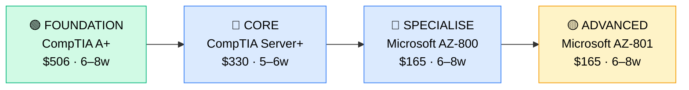

# How to Become a Server Administrator / Windows Server Admin

**CP06** · **Foundation/Infrastructure** · _Time to hire: 10–16 months_ · _Entry cost: $950–$1,600 USD_

> **Path summary:** This path takes you from Systems Administrator or IT Support background (1–2 years) to a specialised Server Administrator role, deepening expertise in Windows Server deployment, management, and administration using CompTIA and Microsoft certifications—owning critical server infrastructure for mission-critical services.

---

## Role Overview

### What does a Server Administrator actually do?

A Server Administrator specialises in server operating systems and services. You spend your day: managing Windows Server infrastructure (domain controllers, file servers, print servers, application servers), configuring Active Directory and Group Policies at scale, deploying and patching Windows Server 2016/2019/2022, managing DNS and DHCP services, configuring backup and disaster recovery for critical servers, troubleshooting Active Directory replication and Kerberos authentication, optimising server performance, and planning server refresh cycles. You own the health of dozens or hundreds of Windows Servers. You're the go-to person for "why isn't domain login working?" or "the file server is running out of space." Server Admin is a hybrid of operations (keeping things running) and engineering (designing solutions for scale).

Server Administrators work in organisations with significant on-prem server infrastructure: banks, large corporates, government, universities, hospitals, and MSPs. Most organisations with 300+ employees have at least 1–2 dedicated Server Admins. Teams range from 1–2 in mid-size companies to 10–15+ in large enterprises. On-site presence is needed for physical hardware maintenance and troubleshooting. On-call is common—expect 1 week/month on-call rotation. Server outages are high-priority emergencies.

### Demand in 2026

- **Global job postings:** 50,000+ active Server Administrator roles on LinkedIn as of May 2026 ([LinkedIn Jobs](https://www.linkedin.com/jobs/))
- **Growth rate:** 4% YoY (steady demand as organisations maintain hybrid on-prem/cloud) ([U.S. Bureau of Labor Statistics](https://www.bls.gov/ooh/computer-and-information-technology/database-administrators-and-architects.htm))
- **South Africa:** Strong demand at banks (Nedbank, ABSA, FirstRand), large corporates, government (SARS, Department of Employment), universities (UCT, Wits). Many organisations still run significant on-prem Windows Server infrastructure.
- **Remote availability:** Low–Medium. 15–25% of roles offer remote options; most require on-site presence for hardware and crisis management. Cloud-native organisations are shifting away from on-prem server roles, so traditional Server Admin is evolving.

---

## Who Is This Path For?

### Ideal starting backgrounds

| Background | Readiness | What you already have |
|---|---|---|
| Systems Administrator | ✅ Perfect fit | Infrastructure knowledge, user management, Group Policy |
| IT Support Analyst | ✅ Strong start | Troubleshooting skills, infrastructure basics |
| Desktop Support Specialist | ✅ Good start | Active Directory and Group Policy knowledge from endpoint side |
| Help Desk Technician (2+ yrs) | 🟡 Possible | Needs formal infrastructure training |
| IT graduate with internship | 🟡 Good start | Theory solid; hands-on server experience needed |
| Complete beginner | ❌ Not ideal | Start with Help Desk (CP01) and work 1–2 years first |

### You're ready to start this path if you can:
- Understand Active Directory basics (user creation, group creation, domain join)
- Explain what a Group Policy Object (GPO) is and how it's applied
- Troubleshoot Windows Server basic issues (login failures, driver issues)
- Have 1+ years of IT support experience
- Understand the difference between domain admin and local admin

> **Not ready yet?** Complete CP04 (Systems Administrator) or CP03 (IT Support Analyst) first—work 1–2 years gaining infrastructure experience.

---

## Certification Sequence

### Visual path

---

### Stage 1 — Foundation (Months 0–2)

**Goal:** Prove you have server infrastructure fundamentals. CompTIA A+ and Server+ form the foundation. Skip if you already have these.

| Cert | Code | Cost (USD) | Study Time | Why it matters |
|---|---|---:|---:|---|
| CompTIA A+ (if needed) | `220-1201/1202` | $506 | 6–8 weeks | Hardware and OS fundamentals. Skip if held. |
| CompTIA Server+ (if needed) | `SK0-005` | $330 | 5–6 weeks | Server hardware, RAID, virtual machines, patch management. Skip if held. |

**Stage 1 total:** $0–$836 USD (likely $0 if already held) · R0–R15,048 ZAR

**Study approach:** If coming from Systems Administrator role with 1–2 years experience, you likely hold these. If not, complete using Jason Dion's Udemy courses + practice exams.

**Lab requirement:** If doing Server+, set up a Windows Server VM in VirtualBox. Configure it as a domain controller, add client VMs to the domain, test user logon. Hands-on experience with Active Directory is non-negotiable.

---

### Stage 2 — Core Specialisation (Months 2–6)

**Goal:** Get Microsoft AZ-800 (Windows Server Hybrid Administrator) to specialise in Windows Server administration and hybrid cloud/on-prem management.

| Cert | Code | Cost (USD) | Study Time | Why it matters |
|---|---|---:|---:|---|
| Microsoft AZ-800 (Windows Server Hybrid Administrator) | `AZ-800` | $165 | 6–8 weeks | Windows Server 2019/2022 on-prem and hybrid cloud (Azure). Core Windows Server administration. |

**Stage 2 total:** $165 USD · R2,970 ZAR · 6–8 weeks

**Study approach:** Use Microsoft Learn (free, official) for AZ-800 training. Pair with Scott Duffy's Udemy AZ-800 course ($12–$15 on sale). AZ-800 covers: Group Policy, Active Directory, Hyper-V, Windows Server updates, storage, networking. Hands-on is essential. Use Azure free tier ($200/month credit) to spin up Windows Server VMs and practice.

**Project milestone:** Deploy a Windows Server domain controller in Azure. Configure Group Policy. Provision users and computers. Set up file shares. Implement Group Policy security policies (password policy, account lockout, etc.). Document the setup.

---

### Stage 3 — Advanced Specialisation (Months 6–10)

**Goal:** Get Microsoft AZ-801 (Windows Server Hybrid Administrator Advanced) to deepen Windows Server expertise and move toward infrastructure architecture.

| Cert | Code | Cost (USD) | Study Time | Why it matters |
|---|---|---:|---:|---|
| Microsoft AZ-801 (Windows Server Hybrid Administrator — Advanced) | `AZ-801` | $165 | 6–8 weeks | Advanced Windows Server, troubleshooting, disaster recovery, performance tuning. Deeper expertise than AZ-800. |

**Stage 3 total:** $165 USD · R2,970 ZAR · 6–8 weeks

**Study approach:** AZ-801 is more challenging than AZ-800. Use Microsoft Learn + paid courses. Focus on: Active Directory troubleshooting, DNS/DHCP services, backup and disaster recovery, Hyper-V clustering, performance monitoring.

**Project milestone:** Design and implement a highly available Windows Server architecture: 2 domain controllers (replication), 2 file servers (DFS replication), backup strategy (Windows Backup or Backup Server), disaster recovery plan. Document with architecture diagram and runbooks.

> **Optional at hire time:** Many Server Administrators land roles with AZ-800 alone. AZ-801 is more for senior/architect progression. Both are valid entry points.

---

### Stage 4 — Expert / Leadership (18–36 months+)

**Goal:** After 2–3 years as Server Admin, consider specialisation or advanced certifications:

- **Microsoft AZ-500** (Azure Security Engineer) — $165, 8–10 weeks — if moving toward security
- **Microsoft AZ-104** (Azure Administrator) — $165, 6–8 weeks — if expanding to broader cloud infrastructure
- **CompTIA Security+** (SY0-701) — $370, 6–8 weeks — if moving toward security roles

---

## Timeline & Cost Summary

| Stage | Certs | Duration | Cost (USD) | Cost (ZAR) |
|---|---|---|---:|---:|
| Stage 1 — Foundation | CompTIA A+/Server+ (if needed) | Weeks 0–14 | $0–$836 | R0–R15,048 |
| Stage 2 — Core | Microsoft AZ-800 | Weeks 6–14 | $165 | R2,970 |
| Stage 3 — Advanced | Microsoft AZ-801 | Weeks 14–22 | $165 | R2,970 |
| **Total to hireable** | | **12–16 weeks** | **$330–$1,166** | **R5,940–R20,988** |

**Study hours required:** ~200–250 hours total (assuming A+ and Server+ already held). Assumes 12–15 hours/week = 14–20 weeks.

---

## Salary Progression

> All figures: median base salary, not including bonuses. ZAR = USD × 18 baseline (verified May 2026). Sources: Robert Half 2026, Glassdoor, PayScale, LinkedIn Salary.

| Experience Level | USD/year | ZAR/month | GBP/year | EUR/year | AUD/year |
|---|---:|---:|---:|---:|---:|
| Entry / Junior (0–2 yrs) | $52,000–$72,000 | R34,000–R46,000 | £40,000–£55,000 | €48,000–€66,000 | A$83,000–A$115,000 |
| Mid-level (2–5 yrs) | $72,000–$105,000 | R46,000–R68,000 | £55,000–£81,000 | €66,000–€97,000 | A$115,000–A$168,000 |
| Senior (5–8 yrs) | $105,000–$140,000 | R68,000–R91,000 | £81,000–£108,000 | €97,000–€129,000 | A$168,000–A$224,000 |
| Lead / Architect (8+ yrs) | $140,000–$180,000 | R91,000–R117,000 | £108,000–£139,000 | €129,000–€166,000 | A$224,000–A$288,000 |

**South Africa note:** Entry-level Server Administrators in major metros (Johannesburg, Cape Town) earn R34,000–R46,000/month. Banks and finance tend toward the higher end. After 2–3 years with AZ-800/AZ-801, expect R46,000–R68,000/month. Senior Server Admins with specialisation (infrastructure architecture, disaster recovery) earn R68,000–R120,000/month. Remote contract work for international companies reaches R70,000–R130,000/month for mid-to-senior admins.

**Salary accelerators:** Microsoft AZ-800, AZ-801, AZ-500; advanced automation (PowerShell); disaster recovery expertise; Hyper-V clustering; virtualisation knowledge (VMware); and security certifications all command premiums in SA listings as of Q1 2026.

---

## First Job Strategy

### Month 0–3: Build the Foundation

1. **Assess your certs** — Do you have A+ and Server+? If not, complete them first.
2. **Begin Microsoft AZ-800** — Use Microsoft Learn (free) + Scott Duffy Udemy course. Target: 6–8 weeks.
3. **Set up your lab** — Azure free tier. Spin up Windows Server VMs. Practice: Active Directory, Group Policy, Windows Server roles. Spend 25–30 hours in the lab.
4. **Learn PowerShell** — Even basic PowerShell skills (user provisioning scripts, automation) are valuable. Spend 1–2 weeks learning. Sysadmins use PowerShell; it's expected.

### Month 3–6: Build Your Portfolio

- **Project 1: Windows Server Architecture Document** — Design a multi-server environment for a 200-person company: domain controller, file server, print server, application server. Include: topology diagram, Group Policy strategy, backup plan, disaster recovery approach.
- **Project 2: Active Directory Lab Setup** — Deploy a complete AD environment in Azure or VirtualBox: 2 domain controllers (replication), 50+ test users, 20+ computers, 10+ security groups. Document the setup with screenshots and runbooks.
- **Project 3: PowerShell Automation Script** — Write a PowerShell script that automates something real: bulk user creation, Group Policy reporting, or server maintenance tasks. Document the script and its usage.

### Month 6–16: Apply and Iterate

- **CV positioning:** List yourself as "Server Administrator with Windows Server and Azure expertise." Highlight: servers managed, uptime maintained, infrastructure improvements driven, automation projects.
- **Target companies:** Banks, insurance, large corporates, government, universities, MSPs. Banks and finance hire many Server Admins. Government hires but processes are slow.
- **Interview prep:** Be ready to discuss: 1) Your lab architecture (you must know it inside-out), 2) Active Directory design and Group Policy strategy, 3) A complex server issue you've managed, 4) Disaster recovery planning, 5) Patch management policy, 6) Your PowerShell automation experience.
- **Salary negotiation:** Entry-level Server Admin in SA starts R34,000–R40,000/month. With AZ-800 cert, justify R40,000–R50,000/month. Don't undercut yourself.

---

## A Day in the Life

### Server Administrator at a Johannesburg bank — Entry Level

**07:45** — Arrive, log into monitoring console (System Centre Operations Manager). 3 servers have high CPU utilisation overnight. One is running a nightly backup (expected). Two others need investigation.

**08:15** — Investigate high CPU servers. One is domain controller with replication traffic (end-of-month period, normal spike). Other is file server with unusual access patterns. Check audit logs. A user has mapped 500 folders (misconfiguration). Contact user to resolve.

**09:00** — Help Desk escalation: "User can't log in to domain." Investigate in Active Directory: account is disabled. Check with HR—user was terminated yesterday; account should have been disabled. It was. Verify: user's old account is correctly disabled, new contractor's account is enabled. Help Desk resolves user issue.

**09:45** — Standup with IT team. Review: patching status (Tuesday, 50 servers updated), backup status (all succeeded), infrastructure alerts.

**10:30** — Group Policy update. Security team has mandated new password policy (14 characters, expire every 60 days). Create a new GPO, test it on a pilot group, then roll out organisation-wide. Monitor for issues (some legacy systems may have problems).

**12:00** — Lunch.

**13:00** — File server maintenance. One file share is running low on space (85% utilisation). Identify old archived files. Archive them to tape storage. Document in the knowledge base for next time.

**14:30** — Disaster recovery drill. Simulate backup restoration. Restore 10 files to a test location. Verify integrity. Document time-to-recover. This is critical for the bank's compliance (they need to know they can recover).

**15:30** — Mentoring: Help Desk staff are escalating tickets about domain replication. Walk them through: what is replication? How do you check replication status? What are common issues? This reduces future escalations.

**16:30** — Plan tomorrow. Prepare for weekly change advisory board (CAB) meeting.

**17:00** — Wrap up. You're on-call next week; keep your phone close.

### Server Administrator at a Cape Town tech company (hybrid on-prem/cloud) — Mid Level

**09:00** — Start day from home. Check monitoring console. On-prem servers are healthy. Azure servers show one instance with high memory utilization (a database server). Check trends. It's growing; recommend vertical scaling.

**09:45** — Design meeting: company is migrating 10 legacy on-prem applications to Azure. Your job: design the Windows Server infrastructure, Active Directory strategy (hybrid AD—part on-prem, part cloud), security groups, networking. Sketch out architecture and present to the team.

**11:00** — Execute a planned server maintenance: patch Windows Server 2022 instances in Azure. Coordinate with application team—updates require a brief reboot. Schedule maintenance window. Execute. All servers come back up cleanly.

**12:00** — Lunch.

**13:00** — Hybrid identity management task. Company just enabled Azure AD Connect (sync between on-prem AD and Azure AD). Monitor the first sync. Verify all users and groups have synced correctly. Catch and fix a few mismatches (disabled accounts need special handling).

**14:30** — Troubleshoot a replication issue: on-prem domain controller is not replicating with an Azure domain controller. Check network connectivity, Kerberos authentication, DNS. Issue: Azure network security group is blocking the replication port. Update firewall rule. Replication resumes.

**15:30** — Document the hybrid infrastructure setup. Wiki needs updating—new staff should understand the architecture.

**16:30** — Prepare for tomorrow's planning meeting on the application migration.

---

## Related Paths & Progressions

| From here you can move to… | Why |
|---|---|
| [Systems Administrator](CP04_Foundation_Systems_Administrator.md) | Broaden beyond Windows Server to full infrastructure |
| [Infrastructure Engineer](CP08_Foundation_Infrastructure_Engineer.md) | Move from operations to design; architect hybrid infrastructure |
| [IT Operations Manager](CP07_Foundation_IT_Operations_Manager.md) | After 3–5 years Server Admin, move into team leadership |
| Cloud Architect | Specialise in cloud infrastructure design; transition from on-prem focus |

---

## South Africa Context

### Market specifics

Server Administrator is a stable role in South Africa, though gradually evolving. Banks (Nedbank, ABSA, FirstRand) still run significant on-prem Windows Server infrastructure and hire dedicated Server Admins. Large corporates, government (SARS, Department of Employment), and universities all employ Server Admins. However, the trend is clear: migration to cloud is happening. New hiring favours hybrid skills (on-prem + cloud).

The advantage in SA is that many organisations are in the middle of their cloud migration—they need people who understand both traditional on-prem Windows Server and hybrid/cloud architectures. Server Admins with Azure skills are particularly valuable right now.

Remote work for Server Admin is growing but not dominant (20–30%). Most Server Admin work requires on-prem presence for hardware maintenance, patching windows, and crisis management. However, cloud-focused organisations and MSPs offer more remote options.

### SA-specific resources

| Resource | URL | Note |
|---|---|---|
| Gumtree IT Jobs (SA) | [https://www.gumtree.co.za/s-it-jobs/](https://www.gumtree.co.za/s-it-jobs/) | Filter for "Server Administrator" |
| Indeed South Africa | [https://www.indeed.co.za/q-Server-Administrator-jobs.html](https://www.indeed.co.za/q-Server-Administrator-jobs.html) | Active listings across SA |
| LinkedIn (South Africa) | [https://www.linkedin.com/jobs/search/?keywords=Server%20Administrator&location=South%20Africa](https://www.linkedin.com/jobs/search/?keywords=Server%20Administrator&location=South%20Africa) | Major corporates and banks post here |
| Microsoft Learn | [https://learn.microsoft.com/en-us/training/](https://learn.microsoft.com/en-us/training/) | Free training for AZ-800, AZ-801 |
| Azure Free Tier | [https://azure.microsoft.com/en-us/free/](https://azure.microsoft.com/en-us/free/) | Free lab environment for Server Admin study |

---

## Frequently Asked Questions

**Q: Do I need A+ and Server+ before doing AZ-800?**

Not strictly, if you have 1–2 years of infrastructure experience. However, both are valuable foundation certs. If you have neither, do Server+ before AZ-800 (it covers vendor-neutral server concepts).

**Q: Should I focus on Windows Server or cloud (Azure)?**

Both. The job market for pure on-prem Server Admin is shrinking. Focus on hybrid: Windows Server on-prem + Azure cloud. AZ-800 covers both, so it's the right cert.

**Q: How long does it take from Systems Administrator to Server Administrator?**

10–16 months if you study 12–15 hours/week. If you're coming from Help Desk with zero infrastructure experience, add 6–10 weeks for foundational certs.

**Q: Can I do this path while working full-time?**

Yes, most people do. Study 10–12 hours/week while working. It takes longer (16–24 months instead of 10–16 months), but it's manageable.

**Q: Is AZ-801 worth it for Server Admin roles?**

Yes, increasingly. AZ-801 deepens your expertise and is more for architecture/senior progression. Entry-level can start with AZ-800 alone, but AZ-801 differentiates you within 2–3 years.

---

## Sources & Further Reading

| # | Source | URL | Used for |
|---|---|---|---|
| 1 | Microsoft Learn | [Windows Server Hybrid Administrator (AZ-800) Training](https://learn.microsoft.com/en-us/training/paths/windows-server-hybrid-administrator/) | Official Microsoft training |
| 2 | Microsoft Learn | [Windows Server Hybrid Administrator Advanced (AZ-801) Training](https://learn.microsoft.com/en-us/training/paths/windows-server-hybrid-administrator-advanced/) | Official Microsoft training for AZ-801 |
| 3 | Robert Half 2026 IT Salary Guide | [Robert Half Technology Salary Guide](https://www.roberthalf.com/us/en/salary-guide) | Salary data for Server Admins |
| 4 | Glassdoor | [Server Administrator Salaries](https://www.glassdoor.com/Salaries/server-administrator-salary-SRCH_KO0,21.htm) | Global salary benchmarks |
| 5 | PayScale (South Africa) | [Server Administrator Salary (ZA)](https://www.payscale.com/research/ZA/Job=Server_Administrator/Salary) | ZA-specific salary data |
| 6 | CompTIA Server+ | [CompTIA Server+ Certification](https://www.comptia.org/certifications/server) | Server+ exam code SK0-005 |
| 7 | Scott Duffy Udemy | [AZ-800 Course](https://www.udemy.com/) | Practical AZ-800 training (search "Scott Duffy AZ-800") |
| 8 | Azure Free Tier | [Azure Free Account](https://azure.microsoft.com/en-us/free/) | Free lab environment for Server Admin study |

---

*Template version: 2026-05-02 | Maintained by IT Career Roadmap | ZAR baseline: R18/$1 USD*
*File: Career_Paths/CP06_Foundation_Server_Administrator.md*
