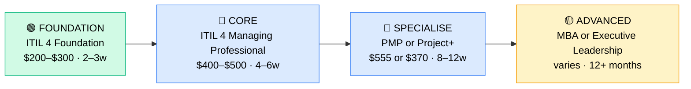

# How to Become an IT Operations Manager

**CP07** · **Foundation/Infrastructure** · _Time to hire: 3–5 years progression from IT support background_ · _Entry cost: $1,200–$2,000 USD_

> **Path summary:** This path takes you from 3–5 years of IT operations background (Support Analyst, Sysadmin, Server Admin) into IT Operations Manager, leading infrastructure and support teams using ITIL, PMP, and CompTIA Project+ certifications—transitioning from hands-on technical work to team leadership and operational strategy.

---

## Role Overview

### What does an IT Operations Manager actually do?

An IT Operations Manager leads the IT operations team—Help Desk, Sysadmins, Network Admins, Server Admins report to you. You spend your day: planning team capacity and hiring, managing performance reviews and coaching staff, setting SLAs (Service Level Agreements) and monitoring them, overseeing infrastructure changes and incidents, managing budgets for hardware and software, handling escalations (when a complex issue reaches you), working with business stakeholders to understand their needs, implementing process improvements (CI/CD, automation), and planning for growth and disaster recovery. You're responsible for team output and infrastructure uptime. You've transitioned from "how do I fix this technical issue?" to "how do I grow and manage this team effectively?"

IT Operations Managers work in any large organisation with significant IT infrastructure: banks, corporations, government, universities, large MSPs. Teams range from 5–10 direct reports (Help Desk + specialists) to 50+ in enterprise settings (separate teams for networking, servers, help desk, each with a lead). On-site presence is expected for meetings and crisis management. On-call during major incidents is expected, but it's rare to be called at 2am unless something critical is happening.

### Demand in 2026

- **Global job postings:** 35,000+ active IT Operations Manager roles on LinkedIn as of May 2026 ([LinkedIn Jobs](https://www.linkedin.com/jobs/))
- **Growth rate:** 5% YoY / BLS projects steady growth in management roles ([U.S. Bureau of Labor Statistics](https://www.bls.gov/ooh/business-and-financial-operations/managers.htm))
- **South Africa:** Moderate demand. Banks (Nedbank, ABSA, FirstRand), large corporates, government, and major MSPs hire IT Operations Managers. Fewer openings than technical roles, so competition is higher.
- **Remote availability:** Medium. 30–40% of IT Operations Manager roles are hybrid or remote; many require on-site presence for team leadership and meetings.

---

## Who Is This Path For?

### Ideal starting backgrounds

| Background | Readiness | What you already have |
|---|---|---|
| IT Support Analyst (3–5 yrs) | ✅ Perfect fit | Technical foundation, ticket handling, escalation experience |
| Systems Administrator (3–5 yrs) | ✅ Perfect fit | Infrastructure knowledge, technical credibility with team |
| Server Administrator (3–5 yrs) | ✅ Strong start | Deep infrastructure knowledge, problem-solving skills |
| Network Administrator (3–5 yrs) | ✅ Strong start | Technical expertise, specialisation carries credibility |
| Help Desk Technician (3–5 yrs + progression) | 🟡 Possible | Needs growth into Analyst/Specialist role first |
| Developer / IT graduate | ❌ Not ideal | Move into operations track first (3–5 years) before management |

### You're ready to start this path if you can:
- Have 3–5 years of IT operations/support experience
- Have mentored or supported junior staff (informal leadership)
- Understand IT service management basics (ITIL processes)
- Be comfortable with people conversations (performance, growth, difficult situations)
- Have some project experience (managed a technical project or initiative)

> **Not ready yet?** Work 3–5 years in IT Support Analyst or Systems Administrator roles first. Management comes after strong technical foundation.

---

## Certification Sequence

### Visual path

---

### Stage 1 — Foundation (Months 0–1)

**Goal:** Understand IT Service Management (ITIL) processes. You'll use these every day as a manager—incident management, change management, problem management are all critical.

| Cert | Code | Cost (USD) | Study Time | Why it matters |
|---|---|---:|---:|---|
| ITIL 4 Foundation | `ITIL-F` | $200–$300 | 2–3 weeks | IT Service Management processes. Managers are responsible for implementing and overseeing these. |

**Stage 1 total:** $200–$300 USD · R3,600–R5,400 ZAR · 2–3 weeks

**Study approach:** Use the official ITIL 4 Foundation study guide + David Mayer's YouTube videos. Focus on: Incident Management (SLA, escalation), Change Management (CAB—Change Advisory Board), Problem Management (root cause analysis), Service Request Management, Configuration Management. These are the processes you'll manage.

**Lab requirement:** N/A. ITIL is process-oriented, not technical. Instead, reflect on your IT support experience and map it to ITIL concepts.

---

### Stage 2 — Core Specialisation (Months 1–5)

**Goal:** Get ITIL 4 Managing Professional to deepen your understanding of IT service management strategy and implementation. This is the manager-level ITIL cert.

| Cert | Code | Cost (USD) | Study Time | Why it matters |
|---|---|---:|---:|---|
| ITIL 4 Managing Professional | `ITIL-MP` | $400–$500 | 4–6 weeks | ITIL strategy, implementation, and management. How to build a high-performing operations team. |

**Stage 2 total:** $400–$500 USD · R7,200–R9,000 ZAR · 4–6 weeks

**Study approach:** ITIL Managing Professional requires ITIL Foundation first (which you have from Stage 1). Use official AXELOS training or online courses. Focus on: continual improvement, service design, service transition, release management. This is what you'll implement as a manager.

**Project milestone:** Design an IT Service Management strategy for a hypothetical 100-person company: what processes matter? How would you measure success (KPIs)? What improvements would you make in year 1, 2, 3?

---

### Stage 3 — Advanced Specialisation (Months 5–11)

**Goal:** Get Project Management certification (PMP or CompTIA Project+) to manage infrastructure projects and initiatives.

**Option A: PMP (Project Management Professional)**

| Cert | Code | Cost (USD) | Study Time | Why it matters |
|---|---|---:|---:|---|
| PMP (Project Management Professional) | `PMP` | $555 | 8–12 weeks | Industry-standard project management cert. Valuable if you manage large infrastructure projects. |

**Option B: CompTIA Project+ (lighter alternative)**

| Cert | Code | Cost (USD) | Study Time | Why it matters |
|---|---|---:|---:|---|
| CompTIA Project+ | `PK0-005` | $370 | 6–8 weeks | Lighter than PMP. Vendor-neutral project management. Sufficient for IT operations roles. |

**Stage 3 total:** $370–$555 USD · R6,660–R9,990 ZAR

**Study approach (PMP):** PMP is challenging; requires 3+ years documented project experience. Use Andrew Ramdayal's Udemy course ($12–$15 on sale) + practice exams. Focus on: project planning, risk management, stakeholder management, resource management. PMP is gold-standard globally.

**Study approach (Project+):** CompTIA Project+ is more practical and accessible. Use Jason Dion's Udemy course ($12–$15 on sale). More suitable for IT ops managers who manage projects but may not be professional project managers.

**Project milestone:** Document a complex infrastructure project you've managed or studied: scope, timeline, budget, risks, team composition, communications plan. Show how you'd manage this as an ops manager.

> **Optional at hire time:** Many IT Ops Managers don't have PMP/Project+ on day one. You can complete it after promotion or while employed in the role. ITIL Foundation and Managing Professional are more critical upfront.

---

### Stage 4 — Expert / Leadership (24–36 months+)

**Goal:** After a few years as IT Ops Manager, consider advanced certifications:

- **ITIL 4 Strategic Leader** — advanced ITIL strategy certification
- **MBA (Master of Business Administration)** — broader business and leadership education
- **Executive coaching certifications** — enhance leadership skills

---

## Timeline & Cost Summary

| Stage | Certs | Duration | Cost (USD) | Cost (ZAR) |
|---|---|---|---:|---:|
| Stage 1 — Foundation | ITIL 4 Foundation | Weeks 0–3 | $200–$300 | R3,600–R5,400 |
| Stage 2 — Core | ITIL 4 Managing Professional | Weeks 3–9 | $400–$500 | R7,200–R9,000 |
| Stage 3 — Advanced | PMP or Project+ | Weeks 9–21 | $370–$555 | R6,660–R9,990 |
| **Total to hireable** | | **8–16 weeks** | **$970–$1,355** | **R17,460–R24,390** |

**Study hours required:** ~150–200 hours total. Assumes 10–15 hours/week = 10–20 weeks.

---

## Salary Progression

> All figures: median base salary, not including bonuses/equity. ZAR = USD × 18 baseline (verified May 2026). Sources: Robert Half 2026, Glassdoor, PayScale, LinkedIn Salary.

| Experience Level | USD/year | ZAR/month | GBP/year | EUR/year | AUD/year |
|---|---:|---:|---:|---:|---:|
| Entry / First Manager (0–2 yrs as manager) | $75,000–$110,000 | R48,000–R70,000 | £58,000–£85,000 | €69,000–€101,000 | A$120,000–A$176,000 |
| Established Manager (2–5 yrs) | $110,000–$155,000 | R70,000–R100,000 | £85,000–£119,000 | €101,000–€142,000 | A$176,000–A$248,000 |
| Senior Manager / Director (5–8 yrs) | $155,000–$220,000 | R100,000–R142,000 | £119,000–£169,000 | €142,000–€202,000 | A$248,000–A$352,000 |
| Director / VP (8+ yrs) | $220,000–$300,000 | R142,000–R194,000 | £169,000–£231,000 | €202,000–€276,000 | A$352,000–A$480,000 |

**South Africa note:** Entry-level IT Ops Managers (first-time managers) in major metros earn R48,000–R70,000/month. Banks and finance tend toward the higher end. After 3–5 years as a manager, expect R70,000–R100,000/month. Senior managers (8+ years) earn R100,000–R180,000/month. Director-level roles (VP of IT, CIO path) earn R180,000–R300,000/month.

**Salary accelerators:** ITIL Managing Professional, PMP, MBA, team growth (managing larger teams), cost savings initiatives, and security/compliance expertise all command premiums in SA management roles as of Q1 2026.

---

## First Job Strategy

### Year 0–1: Build Your Foundation as a Manager

1. **Get ITIL Foundation & Managing Professional** — Your operational roadmap. Understand processes you'll oversee.
2. **Seek mentorship from your current manager** — Learn leadership, difficult conversations, hiring, budgeting.
3. **Start small projects** — Lead a technical project or infrastructure improvement. Build project management experience.
4. **Develop people skills** — Take communication/leadership courses (many are free on LinkedIn Learning, Coursera). Learn to give feedback, handle conflict, coach staff.

### Year 1–2: Build Your Credibility as a Manager

- **Project 1: Process Improvement Initiative** — Identify a inefficiency in your IT operations. Propose and execute an improvement. Measure the impact (cost savings, efficiency gains, team satisfaction).
- **Project 2: Team Development Plan** — Design a learning/career plan for your team. How do Help Desk staff progress to Analysts? How do you upskill the team? Show growth mindset.
- **Project 3: Budget & Capacity Plan** — Create a 3-year IT infrastructure plan: hardware refreshes, software licenses, team growth, cost projections. This is what ops managers do.

### Year 2–3: Apply and Iterate

- **CV positioning:** Highlight: team size managed, cost savings driven, processes improved, project implementations, business impact. Move away from technical jargon to business outcomes.
- **Target companies:** Banks, large corporates, government, major MSPs. Look for roles titled "IT Operations Manager," "Infrastructure Manager," "Service Delivery Manager."
- **Interview prep:** Be ready to discuss: 1) Your team management experience, 2) A process improvement or cost-saving initiative you led, 3) Handling a difficult employee or situation, 4) Your approach to SLA management and incident escalation, 5) Budgeting and resource planning, 6) Your leadership philosophy, 7) How you develop your team.
- **Salary negotiation:** Entry-level IT Ops Manager in SA starts R48,000–R60,000/month. With ITIL MP and PMP/Project+, justify R60,000–R75,000/month. Senior manager roles pay much more—know your target level.

---

## A Day in the Life

### IT Operations Manager at a Johannesburg bank (medium-sized IT team) — First-time Manager (0–2 years)

**08:00** — Arrive, review incidents from overnight. One major (email server down for 2 hours, resolved by on-call admin). Review incident report. What went wrong? Root cause? What can we improve?

**08:30** — 1-on-1 with a Help Desk Technician (quarterly review). Discuss their performance, growth aspirations. They want to move toward Systems Admin. Agree on a learning plan: Security+ cert over 3 months, mentorship from your Sysadmin.

**09:30** — Team standup. Discuss: patching status (50 servers done, 50 to go), incident trends (high volume of password resets—should we improve self-service?), upcoming projects (database server upgrade in 3 weeks).

**10:30** — Finance business partner calls. They're requesting a new application rollout next month. What does IT need? Timeline? Risks? Costs? You're coordinating with your team to scope the work.

**11:30** — Change Advisory Board (CAB) meeting. Review 5 planned changes for next week. Assess risks, approve/defer each one. Document decisions.

**12:00** — Lunch (often working—you manage email and Slack).

**13:00** — Budget planning. Reviewing quotes for new storage infrastructure. Team recommends vendor A (better service), but vendor B is 20% cheaper. Balance cost and team satisfaction—you go with vendor A but negotiate the price.

**14:00** — Coaching a junior admin on incident response. A complex network issue happened this morning. Walk them through: how did they diagnose? What did they escalate? How would you handle it differently? This is growth.

**15:00** — Review SLA metrics with the team. Help Desk average response time is 8 minutes (target: 5 minutes). Discuss why. Volume is up 20%. Do we need more staff or process improvement? Make a plan.

**16:00** — 1-on-1 with your direct report (IT Support Analyst lead). Discuss her career path. She wants your job in 3 years. Talk about what skills she needs: ITIL, project management, hiring/feedback skills. Create a development plan.

**17:00** — Wrap up. Emails and administrative work. Tomorrow: interview a candidate for Help Desk expansion.

### IT Operations Manager at a Cape Town tech company — Established Manager (2–5 years)

**09:00** — Start day from home. Review overnight metrics. All systems green. Check Slack for any urgent items—nothing critical.

**09:30** — Strategic planning meeting with IT leadership (VP IT, other managers). Planning next year's IT strategy: cloud migration progress, infrastructure refresh cycle, security roadmap. You're providing the operations perspective: what's feasible? What risks do we need to mitigate?

**11:00** — Hiring panel for a Systems Administrator candidate. Interview 2 candidates. You're assessing: technical knowledge, fit with team culture, growth mindset. One candidate is strong; you recommend moving forward.

**12:00** — Lunch.

**13:00** — Process improvement project. Your team is proposing a new incident categorisation system to improve ticket routing. You're reviewing the proposal, assessing impact, timeline, and team readiness. Approve with some modifications.

**14:30** — Cost optimisation initiative. Cloud bill is higher than expected. Work with your Cloud Operations Analyst to find savings: rightsize instances, remove unused resources. Target: 15% reduction by end of quarter.

**15:30** — All-hands IT team meeting. Announce: 2 new hires (exciting growth), Q1 metrics (uptime 99.8%, incident volume down 10%), kudos to specific team members (growth mindset). Discuss upcoming projects and team learning priorities.

**16:30** — Coach a manager in another department. They're struggling with a difficult employee. Share your approach to feedback, documentation, and supporting growth.

**17:00** — Wrap up. Plan tomorrow. Think about: next quarter's projects, team growth, strategic initiatives. This is where your mindset is now—not fixing individual technical issues, but enabling the team to do their best work.

---

## Related Paths & Progressions

| From here you can move to… | Why |
|---|---|
| Director of IT Operations | Manage multiple IT operations managers and larger organisational scope |
| CIO (Chief Information Officer) | Strategic IT leadership; move from operations to enterprise-wide IT strategy |
| VP Engineering (if cloud-focused) | Broaden from operations management to broader engineering leadership |

---

## South Africa Context

### Market specifics

IT Operations Manager is a moderately competitive role in South Africa. Banks (Nedbank, ABSA, FirstRand) have multiple operations managers across different teams. Large corporates, government, and major MSPs hire for these roles. However, competition is higher than for technical roles—fewer openings, more applicants. The advantage is the salary jump: IT Ops Managers earn significantly more than individual contributors.

The challenge in SA is that the role is still evolving. Some organisations are consolidating operations (moving to managed services, cloud), while others are growing on-prem operations. Understanding the market you're targeting is important.

Remote work for IT Ops Managers is growing but not dominant (30–40%). Most require on-site presence for team leadership, meetings, and crisis management. However, tech companies and distributed teams offer more flexibility.

BEE/EE is significant in SA management hiring. Organisations aim for diverse leadership teams. This creates opportunity but also means competition from candidates in the same hiring pool. Your technical skills and management potential matter most.

### SA-specific resources

| Resource | URL | Note |
|---|---|---|
| Gumtree IT Jobs (SA) | [https://www.gumtree.co.za/s-it-jobs/](https://www.gumtree.co.za/s-it-jobs/) | Filter for "IT Operations Manager" |
| Indeed South Africa | [https://www.indeed.co.za/q-IT-Operations-Manager-jobs.html](https://www.indeed.co.za/q-IT-Operations-Manager-jobs.html) | Active listings |
| LinkedIn (South Africa) | [https://www.linkedin.com/jobs/search/?keywords=IT%20Operations%20Manager&location=South%20Africa](https://www.linkedin.com/jobs/search/?keywords=IT%20Operations%20Manager&location=South%20Africa) | Major companies post management roles here |
| PMI (Project Management Institute) | [https://www.pmi.org/](https://www.pmi.org/) | PMP certification and community |
| AXELOS ITIL | [https://www.axelos.com/certifications/itil-certifications](https://www.axelos.com/certifications/itil-certifications) | ITIL Managing Professional training |

---

## Frequently Asked Questions

**Q: Do I need 3–5 years of IT experience before becoming a manager?**

Yes. It's rare to move into IT management without solid technical foundation. You need to credibility with your team. Aim for at least 3 years in technical role first.

**Q: Which is more important: ITIL or PMP?**

ITIL for IT Ops Manager roles. PMP is valuable if you manage large projects. ITIL Managing Professional is the manager-specific certification you need.

**Q: How do I transition from technical to management?**

Start with informal leadership: mentor junior staff, lead small projects, step up for team lead opportunities. Many organisations promote from within. Show management potential while in your technical role.

**Q: Can I stay technical and avoid management?**

Yes. Staff Engineer, Principal Engineer, and Architecture roles offer growth without people management. But compensation tops out lower than management track.

**Q: Is management really my path?**

Honestly assess: do you enjoy coaching people? Are you energised by organisational problems, not just technical ones? Do you want to lead a team? If yes, pursue it. If no, the technical track is equally valued.

---

## Sources & Further Reading

| # | Source | URL | Used for |
|---|---|---|---|
| 1 | AXELOS ITIL | [ITIL 4 Managing Professional](https://www.axelos.com/certifications/itil-certifications) | ITIL MP certification details |
| 2 | PMI | [Project Management Professional (PMP)](https://www.pmi.org/certifications/types/project-management-pmp) | PMP certification details and requirements |
| 3 | CompTIA Project+ | [CompTIA Project+ Certification](https://www.comptia.org/certifications/project) | Project+ exam PK0-005 |
| 4 | Robert Half 2026 IT Salary Guide | [Robert Half Technology Salary Guide](https://www.roberthalf.com/us/en/salary-guide) | Salary data for IT Ops Managers |
| 5 | Glassdoor | [IT Operations Manager Salaries](https://www.glassdoor.com/Salaries/it-operations-manager-salary-SRCH_KO0,21.htm) | Global salary benchmarks |
| 6 | PayScale (South Africa) | [IT Operations Manager Salary (ZA)](https://www.payscale.com/research/ZA/Job=IT_Operations_Manager/Salary) | ZA-specific salary data |
| 7 | LinkedIn Learning | [Leadership & Management Courses](https://www.linkedin.com/learning/topics/leadership-management) | Free courses for developing leadership skills |
| 8 | Andrew Ramdayal Udemy | [PMP Exam Prep Course](https://www.udemy.com/) | Comprehensive PMP training (search "Andrew Ramdayal PMP") |

---

*Template version: 2026-05-02 | Maintained by IT Career Roadmap | ZAR baseline: R18/$1 USD*
*File: Career_Paths/CP07_Foundation_IT_Operations_Manager.md*
