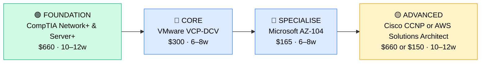

# How to Become an Infrastructure Engineer (On-Prem + Hybrid Cloud)

**CP08** · **Foundation/Infrastructure** · _Time to hire: 18–24 months_ · _Entry cost: $1,400–$2,200 USD_

> **Path summary:** This path takes you from Systems Administrator or Network Administrator (2–3 years experience) to Infrastructure Engineer, designing and implementing hybrid on-prem and cloud infrastructure using CompTIA, Cisco, VMware, and Microsoft certifications—moving from operations to engineering and architecture.

---

## Role Overview

### What does an Infrastructure Engineer actually do?

An Infrastructure Engineer designs infrastructure. You spend your day: architecting hybrid cloud solutions (on-prem + AWS/Azure), designing high-availability systems, planning infrastructure growth, implementing virtualisation (VMware, Hyper-V), managing cloud infrastructure as code (Terraform, CloudFormation), optimising costs and performance, mentoring junior sysadmins, presenting technical solutions to stakeholders, and owning infrastructure roadmaps. You're not just keeping systems running (that's Operations)—you're designing how systems should run. You answer questions like: "Should we use Kubernetes or VMs?" or "How do we architect a disaster recovery solution?" or "How do we migrate 50 servers to Azure?"

Infrastructure Engineers work in large organisations or specialised roles: banks, tech companies, large corporates, cloud-focused startups, managed service providers. You typically work on 2–3 major projects simultaneously. Most roles are hybrid or remote—your work is design and planning, not hands-on hardware maintenance. You're the bridge between business needs and technical implementation.

### Demand in 2026

- **Global job postings:** 40,000+ active Infrastructure Engineer roles on LinkedIn as of May 2026 ([LinkedIn Jobs](https://www.linkedin.com/jobs/))
- **Growth rate:** 6% YoY / strong demand as organisations adopt hybrid cloud ([U.S. Bureau of Labor Statistics](https://www.bls.gov/ooh/computer-and-information-technology/network-and-computer-systems-administrators.htm))
- **South Africa:** Moderate demand. Banks (Nedbank, ABSA, FirstRand) hiring for hybrid infrastructure roles. Tech companies, fintech, and large corporates all seek Infrastructure Engineers. Growing as organisations modernise.
- **Remote availability:** High. 60%+ of Infrastructure Engineer roles are remote or hybrid globally; in South Africa, mostly remote/hybrid for cloud-focused roles, more on-site for traditional infrastructure.

---

## Who Is This Path For?

### Ideal starting backgrounds

| Background | Readiness | What you already have |
|---|---|---|
| Systems Administrator (2–3 yrs) | ✅ Perfect fit | Infrastructure knowledge, operational foundation |
| Network Administrator (2–3 yrs) | ✅ Perfect fit | Networking expertise, systems thinking |
| Infrastructure Operations Specialist | ✅ Perfect fit | Operational experience, ready for design thinking |
| IT Support Analyst (3+ yrs) | 🟡 Good with gaps | Troubleshooting mindset; needs specialisation |
| Server Administrator (2–3 yrs) | ✅ Strong start | Server knowledge, Windows/Linux; needs networking/cloud |
| Cloud Operations Engineer | ✅ Perfect fit | Cloud knowledge; needs on-prem depth |
| Complete beginner | ❌ Not ideal | Start with Help Desk (CP01), progress through Sysadmin (CP04) first |

### You're ready to start this path if you can:
- Design a small infrastructure solution (3-tier application, network design, security groups)
- Understand on-prem infrastructure thoroughly (servers, storage, networking)
- Explain cloud basics (IaaS, PaaS, SaaS; public, private, hybrid)
- Have 2–3 years of hands-on infrastructure operations experience
- Understand virtualization (VMware or Hyper-V)

> **Not ready yet?** Work 2–3 years as Systems Administrator or Network Administrator first, gaining operational depth.

---

## Certification Sequence

### Visual path

---

### Stage 1 — Foundation (Months 0–3)

**Goal:** Reinforce server and networking fundamentals. If you have CompTIA Server+ and Network+, skip and move to Stage 2.

| Cert | Code | Cost (USD) | Study Time | Why it matters |
|---|---|---:|---:|---|
| CompTIA Server+ (if needed) | `SK0-005` | $330 | 5–6 weeks | Server fundamentals, RAID, virtualisation. Skip if held. |
| CompTIA Network+ (if needed) | `N10-009` | $330 | 4–6 weeks | Networking fundamentals. Skip if held. |

**Stage 1 total:** $0–$660 USD (likely $0 if both held) · R0–R11,880 ZAR

**Study approach:** If coming from Sysadmin role with both certs, skip entirely. If missing either, complete using Professor Messer (free) + practice exams.

---

### Stage 2 — Core Specialisation (Months 3–9)

**Goal:** Get VMware VCP-DCV (vSphere virtualization certification) to prove hands-on virtualization expertise. Virtualization is core to modern infrastructure.

| Cert | Code | Cost (USD) | Study Time | Why it matters |
|---|---|---:|---:|---|
| VMware VCP-DCV (vSphere Data Centre Virtualisation) | `2V0-21.23` | $300 | 6–8 weeks | VMware vSphere, virtual machine management, cluster management. Core to infrastructure architecture. |

**Stage 2 total:** $300 USD · R5,400 ZAR · 6–8 weeks

**Study approach:** Use Linux Academy/Pluralsight VMware courses (paid, ~$300/year subscription) or free VMware hands-on labs. VCP exam is challenging—deep vSphere knowledge required. Pair with Nicholas Dille's VCP study notes on GitHub. Do 30–40 practice questions daily in weeks 6–8.

**Lab requirement:** Access to VMware vSphere (your employer or free trial). Build a 4-6 host cluster with storage and networking. Practice: VM provisioning, resource allocation, HA/DRS, storage vMotion. Minimum 40–50 hours of hands-on lab.

---

### Stage 3 — Advanced Specialisation (Months 9–15)

**Goal:** Get Microsoft AZ-104 (Azure Administrator) to specialise in cloud infrastructure. Hybrid infrastructure means both on-prem (VMware) and cloud (Azure/AWS).

| Cert | Code | Cost (USD) | Study Time | Why it matters |
|---|---|---:|---:|---|
| Microsoft AZ-104 (Azure Administrator) | `AZ-104` | $165 | 6–8 weeks | Cloud infrastructure on Azure. Hybrid scenarios (on-prem + Azure). |

**Stage 3 total:** $165 USD · R2,970 ZAR · 6–8 weeks

**Study approach:** Use Microsoft Learn (free) + paid courses. AZ-104 covers: networking in Azure, storage, VMs, database, security. Hands-on with Azure free tier ($200/month credit).

**Project milestone:** Design a hybrid infrastructure solution: on-prem vSphere environment connected to Azure via VPN or ExpressRoute. Deploy a web application across both environments with failover capability.

---

### Stage 4 — Expert / Leadership (18–36 months+)

**Goal:** After 2–3 years as Infrastructure Engineer, specialise:

- **Cisco CCNP Enterprise** (advanced networking, $660, 18–22 weeks) — if networking specialisation
- **AWS Solutions Architect Professional** (advanced cloud, $150 exam, 10–12 weeks) — if AWS specialisation
- **Terraform Associate** (infrastructure as code, $70, 4–6 weeks) — if IaC specialisation
- **Kubernetes Administrator (CKA)** (container orchestration, $395, 8–10 weeks) — if Kubernetes specialisation

---

## Timeline & Cost Summary

| Stage | Certs | Duration | Cost (USD) | Cost (ZAR) |
|---|---|---|---:|---:|
| Stage 1 — Foundation | CompTIA Server+/Network+ (if needed) | Weeks 0–12 | $0–$660 | R0–R11,880 |
| Stage 2 — Core | VMware VCP-DCV | Weeks 9–17 | $300 | R5,400 |
| Stage 3 — Advanced | Microsoft AZ-104 | Weeks 17–25 | $165 | R2,970 |
| **Total to hireable** | | **20–25 weeks** | **$465–$1,125** | **R8,370–R20,250** |

**Study hours required:** ~280–350 hours total (assuming Server+ and Network+ held). Assumes 12–15 hours/week = 20–28 weeks.

---

## Salary Progression

> All figures: median base salary, not including bonuses/equity. ZAR = USD × 18 baseline (verified May 2026). Sources: Robert Half 2026, Glassdoor, PayScale, LinkedIn Salary.

| Experience Level | USD/year | ZAR/month | GBP/year | EUR/year | AUD/year |
|---|---:|---:|---:|---:|---:|
| Entry / Junior (0–2 yrs) | $70,000–$95,000 | R45,000–R60,000 | £54,000–£73,000 | €65,000–€88,000 | A$112,000–A$152,000 |
| Mid-level (2–5 yrs) | $95,000–$140,000 | R60,000–R91,000 | £73,000–£108,000 | €88,000–€129,000 | A$152,000–A$224,000 |
| Senior (5–8 yrs) | $140,000–$190,000 | R91,000–R123,000 | £108,000–£146,000 | €129,000–€174,000 | A$224,000–A$304,000 |
| Principal / Architect (8+ yrs) | $190,000–$280,000 | R123,000–R182,000 | £146,000–£215,000 | €174,000–€257,000 | A$304,000–A$448,000 |

**South Africa note:** Entry-level Infrastructure Engineers in major metros earn R45,000–R60,000/month. After 2–3 years with VMware VCP and AZ-104, expect R60,000–R90,000/month. Senior engineers with specialization earn R90,000–R150,000/month. Remote roles for international companies reach R100,000–R200,000/month for mid-to-senior engineers.

**Salary accelerators:** VMware VCP, Microsoft AZ-104/AZ-500, AWS Solutions Architect, infrastructure as code (Terraform), Kubernetes, cloud cost optimisation, and disaster recovery expertise all command premiums in SA listings as of Q1 2026.

---

## First Job Strategy

### Month 0–3: Build the Foundation

1. **Assess your certs** — Do you have Server+ and Network+? If not, complete them.
2. **Begin VMware VCP-DCV** — Get hands-on with vSphere. Use Linux Academy or employer lab. Target: 6–8 weeks.
3. **Join the community** — Follow r/vmware, Virtualization communities on Reddit. Join VMware User Groups (VUGs).
4. **Start Azure basics** — Begin exploring Azure (free trial). Understand VMs, networking, storage.

### Month 3–6: Build Your Portfolio

- **Project 1: vSphere Architecture Document** — Design a production-grade vSphere environment: 6–8 hosts, shared storage, networking, resource pools, VM templates, backup strategy. Document with topology diagram, specifications, and considerations.
- **Project 2: Hybrid Infrastructure Design** — Design a hybrid architecture: on-prem vSphere + Azure. Include: network connectivity (VPN), data replication, disaster recovery, failover scenarios.
- **Project 3: Infrastructure Automation** — Write Terraform (or PowerShell) code to provision infrastructure: create VMs, configure networking, deploy applications. Show IaC thinking.

### Month 6–18: Apply and Iterate

- **CV positioning:** List yourself as "Infrastructure Engineer specialising in hybrid cloud." Highlight: systems designed, size/scale of infrastructure managed, major projects implemented, certifications.
- **Target companies:** Banks (hybrid infrastructure), tech companies (cloud-heavy), large corporates (diverse infrastructure), managed service providers.
- **Interview prep:** Be ready to discuss: 1) Your vSphere/VMware experience (you must know it deeply), 2) A complex infrastructure design you've done, 3) Hybrid cloud scenarios, 4) Cloud cost optimisation, 5) Disaster recovery planning, 6) Infrastructure as code thinking, 7) Your approach to capacity planning.
- **Salary negotiation:** Entry-level Infrastructure Engineer in SA starts R45,000–R55,000/month. With VMware VCP and AZ-104, justify R55,000–R70,000/month. Don't accept lowball offers.

---

## A Day in the Life

### Infrastructure Engineer at a Johannesburg bank — Entry Level

**08:00** — Arrive. Review infrastructure monitoring dashboard. Systems are healthy. Check Slack for any urgent messages—none.

**08:30** — Design meeting with business stakeholders. A new trading system is coming online in 6 months. Requirements: 100+ servers, high availability (99.99% uptime), secure network isolation, disaster recovery. You're designing the infrastructure: on-prem vSphere vs AWS? Hybrid? Present options and recommendations.

**10:00** — Capacity planning. The database team reports that storage utilisation is growing 50% YoY. At current growth, we'll hit capacity in 18 months. Design expansion strategy: upgrade vSphere storage (SAN), or move to cloud storage? Create a proposal.

**11:30** — Mentor a junior sysadmin on vSphere. They're setting up VMs and don't understand resource allocation properly. Walk them through: CPU, memory, storage; how does oversubscription work? When should you add more hosts?

**12:00** — Lunch.

**13:00** — Disaster recovery review. Your organisation has a disaster recovery requirement (RPO: 1 hour, RTO: 4 hours). Design how you'd achieve this with your current infrastructure. Test the plan: simulate data centre failure, measure actual recovery time, document.

**14:30** — Infrastructure as code (IaC) project. Write Terraform code that provisions 5 VMs on Azure, configures networking, and deploys a web application. Show the team the power of automation.

**15:30** — Architecture review. The network team is proposing a new network design. Review it from an infrastructure perspective: does it support our growth? Security? Scalability? Provide feedback.

**16:30** — Document a design decision. Why did we choose vSphere over KVM? Why are we using ExpressRoute instead of VPN? Documentation is infrastructure knowledge transfer.

**17:00** — Wrap up. Plan tomorrow: finalise the trading system infrastructure proposal.

### Infrastructure Engineer at a Cape Town fintech (cloud-native) — Mid Level

**09:00** — Start day from home. Review infrastructure costs. Cloud bill was higher than expected last month. Dig into usage. Find: unused VMs in test environment, over-provisioned database instances, data transfer costs. Create a cost optimisation plan.

**09:45** — Architecture proposal: company wants multi-region disaster recovery (currently single-region). Design: primary region (us-east), secondary region (eu-west). Include: data replication, failover automation, costs, timeline. Present to tech leadership.

**11:00** — Review a peer's infrastructure design for a new microservice. Provide feedback: security groups look good, storage scaling strategy is solid, but monitoring is weak. Suggest improvements.

**12:00** — Lunch.

**13:00** — Kubernetes adoption planning. Company wants to move from VMs to Kubernetes. Design the transition: stand up EKS cluster, plan workload migration, address security and compliance concerns. This is multi-month project.

**14:30** — Infrastructure as code review. Team has written 50+ Terraform modules. Review code: are they idempotent? Modular? Secure? Provide code review feedback. Good IaC is infrastructure documentation.

**15:30** — Disaster recovery simulation. Failover all services to the secondary region. Measure recovery time, identify bottlenecks. Document findings and improvements needed.

**16:30** — Cost optimisation report. Present the team with cost-saving opportunities identified this week: expected savings, timeline, risks. Drive decision.

---

## Related Paths & Progressions

| From here you can move to… | Why |
|---|---|
| Cloud Architect | Specialise in cloud architecture; move from hybrid to cloud-centric |
| Infrastructure Architect | Design enterprise-scale infrastructure; move to architectural strategy |
| IT Operations Manager | Move into team leadership after 3–5 years |

---

## South Africa Context

### Market specifics

Infrastructure Engineer is a growing role in South Africa. Banks (Nedbank, ABSA) are increasingly modernising their infrastructure with hybrid cloud. Tech companies (fintech, SaaS), large corporates, and managed service providers all hire Infrastructure Engineers. Remote work is common—many roles are fully remote or hybrid, especially for cloud-focused companies.

The advantage in SA is the skills gap. Many organisations are in the middle of hybrid cloud adoption and need engineers with both on-prem (vSphere) and cloud (Azure/AWS) expertise. This creates strong demand and good salaries.

### SA-specific resources

| Resource | URL | Note |
|---|---|---|
| Gumtree IT Jobs (SA) | [https://www.gumtree.co.za/s-it-jobs/](https://www.gumtree.co.za/s-it-jobs/) | Filter for "Infrastructure Engineer" |
| Indeed South Africa | [https://www.indeed.co.za/q-Infrastructure-Engineer-jobs.html](https://www.indeed.co.za/q-Infrastructure-Engineer-jobs.html) | Active listings |
| LinkedIn (South Africa) | [https://www.linkedin.com/jobs/search/?keywords=Infrastructure%20Engineer&location=South%20Africa](https://www.linkedin.com/jobs/search/?keywords=Infrastructure%20Engineer&location=South%20Africa) | Major companies post here |
| VMware Training | [https://www.vmware.com/learning/](https://www.vmware.com/learning/) | VMware certification and training |
| Microsoft Learn | [https://learn.microsoft.com/en-us/training/](https://learn.microsoft.com/en-us/training/) | Free Azure training |

---

## Frequently Asked Questions

**Q: Do I need VMware VCP before becoming an Infrastructure Engineer?**

Not strictly, but it significantly improves your candidacy. Many large organisations use VMware; having VCP proves expertise. If your target role is cloud-only, VMware is less critical, but it's still valuable.

**Q: Should I focus on AWS or Azure?**

Azure if targeting organisations with Microsoft ecosystems (banks, enterprises often Microsoft-heavy). AWS if targeting tech companies and startups. For maximum flexibility, know both.

**Q: How long does it take from Sysadmin to Infrastructure Engineer?**

18–24 months if you have operational experience and study 12–15 hours/week. VMware VCP is the biggest hurdle—6–8 weeks of intensive study.

**Q: Can I do this path while working full-time?**

Yes, but it's demanding. You need access to a lab environment (your employer or cloud free tier). Most people take 24–30 months doing this while employed (vs. 18–24 months full-time study).

**Q: Is Infrastructure Engineer a dead-end as companies move to cloud?**

No. The role is evolving toward cloud-native infrastructure (Kubernetes, serverless, IaC), but infrastructure engineering isn't going away. Hybrid skills (on-prem + cloud) are increasingly valuable.

---

## Sources & Further Reading

| # | Source | URL | Used for |
|---|---|---|---|
| 1 | VMware Training | [VCP-DCV Certification](https://www.vmware.com/learning/) | Official VMware training and exam details |
| 2 | Microsoft Learn | [Azure Administrator Training](https://learn.microsoft.com/en-us/training/paths/administrator/) | Official Azure training |
| 3 | Robert Half 2026 IT Salary Guide | [Robert Half Technology Salary Guide](https://www.roberthalf.com/us/en/salary-guide) | Salary data for Infrastructure Engineers |
| 4 | Glassdoor | [Infrastructure Engineer Salaries](https://www.glassdoor.com/Salaries/infrastructure-engineer-salary-SRCH_KO0,21.htm) | Global salary benchmarks |
| 5 | PayScale (South Africa) | [Infrastructure Engineer Salary (ZA)](https://www.payscale.com/research/ZA/Job=Infrastructure_Engineer/Salary) | ZA-specific salary data |
| 6 | Terraform Documentation | [Terraform Infrastructure as Code](https://www.terraform.io/docs) | Official Terraform docs for IaC learning |
| 7 | Linux Academy | [VMware VCP Training](https://linuxacademy.com/) | Comprehensive VMware VCP courses (Pluralsight subscription) |
| 8 | Azure Free Tier | [Azure Free Account](https://azure.microsoft.com/en-us/free/) | Free lab environment |

---

*Template version: 2026-05-02 | Maintained by IT Career Roadmap | ZAR baseline: R18/$1 USD*
*File: Career_Paths/CP08_Foundation_Infrastructure_Engineer.md*
