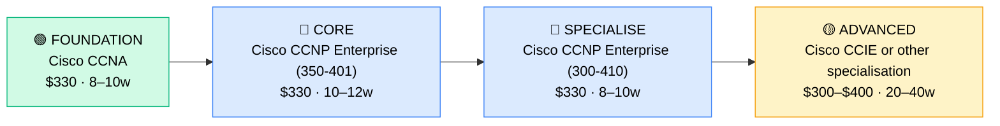

# How to Become a Network Engineer

**CP09** · **Networking** · _Time to hire: 12–18 months_ · _Entry cost: $1,300–$2,000 USD_

> **Path summary:** This path takes you from Network Administrator (1–2 years hands-on routing/switching experience) to Network Engineer, designing and optimising complex networks using Cisco CCNA and CCNP certifications—moving from network operations to network architecture and design.

---

## Role Overview

### What does a Network Engineer actually do?

A Network Engineer designs networks. You spend your day: architecting network solutions (how should this organisation's network look?), optimising routing protocols (OSPF, BGP, IS-IS), designing WAN (Wide Area Network) topologies, planning network security, troubleshooting complex network issues (using Wireshark and deep protocol knowledge), implementing network changes, mentoring junior network admins, presenting technical solutions to stakeholders, and owning network performance and reliability. You're answering questions like: "How do we scale our network for 50% growth?" or "What's the best approach for our multi-site WAN?" You're the bridge between business requirements (sales office needs connectivity) and technical implementation (MPLS VPN, SD-WAN, etc.).

Network Engineers work in telcos, large corporates, banks, ISPs, cloud companies, and MSPs. You work on 2–3 major projects simultaneously. Most roles are hybrid or remote—design and planning work can be done from anywhere. You're less likely to be on a ladder fixing a cable than a Network Admin; you're designing the infrastructure.

### Demand in 2026

- **Global job postings:** 45,000+ active Network Engineer roles on LinkedIn as of May 2026 ([LinkedIn Jobs](https://www.linkedin.com/jobs/))
- **Growth rate:** 5% YoY ([U.S. Bureau of Labor Statistics](https://www.bls.gov/ooh/computer-and-information-technology/network-and-computer-systems-administrators.htm))
- **South Africa:** Strong demand. Telcos (MTN, Vodacom, Telkom), banks, ISPs (Liquid Intelligent Technologies), and large corporates all hire Network Engineers. Networking is a valued specialization.
- **Remote availability:** High. 50%+ of Network Engineer roles are remote/hybrid globally; in South Africa, similar—design-focused work allows remote. Telcos and ISPs offer good remote options.

---

## Who Is This Path For?

### Ideal starting backgrounds

| Background | Readiness | What you already have |
|---|---|---|
| Network Administrator (1–2 yrs) | ✅ Perfect fit | Switching/routing experience, hands-on networking |
| Network Technician (2+ yrs) | ✅ Perfect fit | Field experience, hands-on skills |
| Systems Administrator with networking focus | ✅ Strong start | Infrastructure knowledge, learning networking specialisation |
| IT Support Analyst with network focus | 🟡 Good start | Troubleshooting mindset; needs hands-on network depth |
| Cisco CCNA certified | ✅ Perfect fit | If certified, you have baseline; continue to CCNP |
| Complete beginner | ❌ Not ideal | Start with Help Desk (CP01), progress through Network Admin (CP05) first |

### You're ready to start this path if you can:
- Configure and troubleshoot Cisco switches and routers
- Understand routing protocols (OSPF, EIGRP, BGP at a basic level)
- Design a multi-site network on paper
- Use Wireshark to analyse packets
- Have 1–2 years of hands-on network operations experience

> **Not ready yet?** Work 1–2 years as Network Administrator first, gaining operational depth.

---

## Certification Sequence

### Visual path

---

### Stage 1 — Foundation (Months 0–3)

**Goal:** Ensure you have solid Cisco CCNA knowledge. If already certified, skip to Stage 2.

| Cert | Code | Cost (USD) | Study Time | Why it matters |
|---|---|---:|---:|---|
| Cisco CCNA | `200-301` | $330 | 8–10 weeks | Cisco switching, routing, network services. Foundation for all Cisco careers. |

**Stage 1 total:** $330 USD (skip if already CCNA) · R5,940 ZAR

**Study approach:** If already CCNA, skip. If not, use Jeremy's IT Lab (free YouTube) + Neil Anderson Udemy course ($12–$15 on sale). Do 30–40 practice questions daily.

**Lab requirement:** GNS3 with 4–5 routers, multiple switches, static and dynamic routing. 40–50 hours of hands-on.

---

### Stage 2 — Core Specialisation (Months 3–10)

**Goal:** Get Cisco CCNP Enterprise (350-401) to specialise in enterprise routing and switching at scale.

| Cert | Code | Cost (USD) | Study Time | Why it matters |
|---|---|---:|---:|---|
| Cisco CCNP Enterprise Core | `350-401` | $330 | 10–12 weeks | Advanced switching, routing, troubleshooting for enterprise networks. Core CCNP knowledge. |

**Stage 2 total:** $330 USD · R5,940 ZAR · 10–12 weeks

**Study approach:** Use Network Direction's CCNP course (Udemy, $12–$15 on sale) or Cisco DevNet learning. 350-401 is harder than CCNA—expect 3–4 months of intensive study. Do 30–40 practice questions daily in weeks 8–12.

**Lab requirement:** Complex GNS3 lab: 6+ routers, VLANs, Spanning Tree, OSPF/EIGRP, Access Control Lists, QoS. 50+ hours of hands-on. OR access to real Cisco gear (some employers provide).

---

### Stage 3 — Advanced Specialisation (Months 10–16)

**Goal:** Get Cisco CCNP Enterprise (300-410) to deepen routing expertise. This exam focuses on infrastructure routing.

| Cert | Code | Cost (USD) | Study Time | Why it matters |
|---|---|---:|---:|---|
| Cisco CCNP Enterprise Route | `300-410` | $330 | 8–10 weeks | Deep routing expertise: OSPF, BGP, VPN, QoS. Infrastructure routing is critical for Network Engineers. |

**Stage 3 total:** $330 USD · R5,940 ZAR · 8–10 weeks

**Study approach:** Use Network Direction's CCNP Routing course. BGP is the most important topic—expect to spend 2–3 weeks just on BGP. Do 20–30 practice questions daily (this exam is very detailed).

**Project milestone:** Design and implement a multi-site WAN topology with BGP routing, redundancy, and failover. Document the design and all configuration.

> **Optional at hire time:** Many Network Engineers are hired with CCNA + 350-401 (without 300-410). CCNP full cert (both exams) is for senior engineers. Both are valid hiring points.

---

### Stage 4 — Expert / Leadership (18–36 months+)

**Goal:** After 2–3 years as Network Engineer, specialise:

- **Cisco CCIE Enterprise Infrastructure** ($300, 20–40 weeks study, requires 3–5 years experience) — expert level, architect track
- **Juniper JNCIA / JNCIS** ($300–$400, 8–12 weeks) — alternative vendor specialisation
- **AWS Certified Advanced Networking** (specialty cert, $150, 8–10 weeks) — if moving toward cloud networking

---

## Timeline & Cost Summary

| Stage | Certs | Duration | Cost (USD) | Cost (ZAR) |
|---|---|---|---:|---:|
| Stage 1 — Foundation | Cisco CCNA (if needed) | Weeks 0–10 | $330 | R5,940 |
| Stage 2 — Core | Cisco CCNP (350-401) | Weeks 10–22 | $330 | R5,940 |
| Stage 3 — Advanced | Cisco CCNP (300-410) | Weeks 22–32 | $330 | R5,940 |
| **Total to hireable** | | **18–22 weeks** | **$660–$990** | **R11,880–R17,820** |

**Study hours required:** ~300–350 hours total (assuming CCNA held). Assumes 15–20 hours/week = 18–24 weeks.

---

## Salary Progression

> All figures: median base salary, not including bonuses. ZAR = USD × 18 baseline (verified May 2026). Sources: Robert Half 2026, Glassdoor, PayScale, LinkedIn Salary.

| Experience Level | USD/year | ZAR/month | GBP/year | EUR/year | AUD/year |
|---|---:|---:|---:|---:|---:|
| Entry / Junior (0–2 yrs) | $65,000–$90,000 | R42,000–R58,000 | £50,000–£69,000 | €60,000–€83,000 | A$104,000–A$144,000 |
| Mid-level (2–5 yrs) | $90,000–$130,000 | R58,000–R84,000 | £69,000–£100,000 | €83,000–€120,000 | A$144,000–A$208,000 |
| Senior (5–8 yrs) | $130,000–$180,000 | R84,000–R117,000 | £100,000–£139,000 | €120,000–€166,000 | A$208,000–A$288,000 |
| Principal / Architect (8+ yrs) | $180,000–$260,000 | R117,000–R169,000 | £139,000–£200,000 | €166,000–€239,000 | A$288,000–A$416,000 |

**South Africa note:** Entry-level Network Engineers in major metros earn R42,000–R58,000/month. Telcos tend toward the higher end. After 2–3 years with CCNP, expect R58,000–R85,000/month. Senior engineers with both CCNP exams earn R85,000–R140,000/month. Architect-level (CCIE path) reach R140,000–R220,000/month. Remote roles for international companies reach R100,000–R200,000/month for mid-to-senior engineers.

**Salary accelerators:** Cisco CCNP Enterprise (both exams), Juniper JNCIS, AWS networking certs, BGP expertise, SD-WAN knowledge, and security specialisation (CCNP Security) all command premiums in SA listings as of Q1 2026.

---

## First Job Strategy

### Month 0–3: Build the Foundation

1. **Confirm CCNA** — Do you have Cisco CCNA? If not, complete it first (8–10 weeks).
2. **Begin CCNP (350-401)** — Intensive study. Target: 10–12 weeks. Use Network Direction + GNS3.
3. **Deep GNS3 labbing** — Build complex topologies. BGP, OSPF, redundancy. Spend 50+ hours in the lab.
4. **Join the community** — Follow r/ccna, r/ccnp on Reddit. Join Cisco Learning Network.

### Month 3–6: Build Your Portfolio

- **Project 1: Multi-Site Network Design** — Design a network for a 3-site company (main office, 2 branches, 300 users). Include: topology diagram, IP addressing, VLAN design, routing protocol choice (OSPF or BGP), security considerations, redundancy. Document with diagrams.
- **Project 2: BGP Configuration & Documentation** — Set up BGP in your GNS3 lab (4–6 routers, multiple prefixes). Document the configuration, show how prefixes are advertised, explain BGP AS path selection. BGP is critical for engineers.
- **Project 3: Network Troubleshooting Guide** — Document 5 complex network issues: routing problems, convergence issues, failover scenarios. For each: symptom, diagnostic steps (show commands, Wireshark analysis), solution.

### Month 6–18: Apply and Iterate

- **CV positioning:** List yourself as "Network Engineer with Cisco CCNP Enterprise." Highlight: networks designed, scale (how many routers? How much traffic?), projects implemented, tools used (Wireshark, GNS3, etc.).
- **Target companies:** Telcos (MTN, Vodacom, Telkom), banks (Nedbank, ABSA, FirstRand), ISPs (Liquid Intelligent Technologies), large corporates, MSPs.
- **Interview prep:** Be ready to discuss: 1) Your GNS3 lab setup (inside-out knowledge), 2) BGP design and configuration, 3) A complex network design you've done, 4) Troubleshooting methodology, 5) Redundancy and failover design, 6) Security in network design, 7) Your experience with real Cisco gear (if any).
- **Salary negotiation:** Entry-level Network Engineer in SA starts R42,000–R50,000/month. With CCNP (350-401), justify R50,000–R65,000/month. With both CCNP exams, justify R65,000–R75,000/month. Don't accept lowball offers.

---

## A Day in the Life

### Network Engineer at MTN South Africa (Johannesburg) — Entry Level

**07:30** — Arrive. Review network monitoring. BGP route flaps overnight on one upstream connection. Investigate logs. ISP had a brief outage; routes converged correctly. Monitor for stability.

**08:30** — Design review. A new data centre is being built; it needs network infrastructure. Work with the data centre team and application teams to design: how many uplinks? What bandwidth? Redundancy? Layer 3 design? Create a proposal.

**10:00** — Implement a planned network change. New QoS (Quality of Service) policy for VoIP traffic. Test in lab first, then deploy to production during a change window. Monitor for issues.

**11:30** — BGP troubleshooting. A specific customer network is receiving routes from us, but traffic isn't flowing correctly. Check BGP advertisements, verify routing tables, check for filter lists that might be affecting routes. Find: a route-map is filtering traffic unintentionally. Fix.

**12:00** — Lunch with Network team.

**13:00** — Mentoring a junior network admin on CCNP study. They're studying BGP. Walk them through: why BGP? How does it differ from OSPF? When would you use BGP vs OSPF? Help them understand the strategic role of BGP.

**14:30** — Network capacity planning. Traffic on one interface is consistently at 70%. At current growth, we'll hit saturation in 8 months. Design upgrade: add more bandwidth, upgrade interface cards, or traffic engineering? Present options and recommendations.

**15:30** — Documentation. Update network topology and runbooks. Keep internal wiki current on network designs and procedures.

**16:30** — Prepare for tomorrow's change advisory board (CAB) meeting. Review 3 planned network changes. Assess risks.

**17:00** — Wrap up. CCNP study planned for this evening.

### Network Engineer at a Cape Town ISP (Liquid Intelligent) — Mid Level

**09:00** — Start day from home. Review BGP routes and monitoring. All upstream connections stable.

**09:45** — Architecture design: Customer is requesting a direct peering connection with us (internet exchange point). Design the technical solution: routing, traffic engineering, security, SLA. Present to customer. They approve; schedule implementation.

**11:00** — SD-WAN (Software-Defined WAN) project. Company wants to migrate from traditional MPLS VPN to SD-WAN for branch connectivity. Design the architecture, identify risks (security, redundancy), create a rollout plan.

**12:00** — Lunch.

**13:00** — BGP configuration and testing. A new customer is on-boarding. Configure BGP with their network: announce routes, set AS paths, implement traffic engineering (inbound/outbound traffic control). Test with the customer's network team.

**14:30** — Network security review. Security team is proposing new DDoS mitigation. Review from network architecture perspective: how does it integrate? What's the impact on traffic? Performance impact? Approve with recommendations.

**15:30** — Mentoring. A peer is designing a multi-site WAN for a customer. Review their design: routing strategy is solid, but redundancy could be better. Suggest improvements.

**16:30** — Plan tomorrow. High-priority customer issue needs investigation—their network is experiencing packet loss on their VPN tunnel.

---

## Related Paths & Progressions

| From here you can move to… | Why |
|---|---|
| Senior Network Engineer | Specialise in network architecture; move toward CCIE path |
| Network Architect | Design enterprise-scale networks; broader strategic role |
| Infrastructure Engineer | Broaden beyond networking to full infrastructure |
| IT Operations Manager | Move into team leadership after 3–5 years |

---

## South Africa Context

### Market specifics

Network Engineer is a valued role in South Africa. Telcos (MTN, Vodacom, Telkom) hire many network engineers—this is a core business function. Banks, ISPs (Liquid Intelligent Technologies), and large corporates all employ network engineers. The role is evolving: traditional routing/switching skills are still valuable, but SD-WAN, cloud networking, and security integration are growing areas.

Remote work for Network Engineers is common, especially for ISPs and companies with distributed networks. Many international companies hire South African network engineers for EMEA support at premium rates.

### SA-specific resources

| Resource | URL | Note |
|---|---|---|
| Gumtree IT Jobs (SA) | [https://www.gumtree.co.za/s-it-jobs/](https://www.gumtree.co.za/s-it-jobs/) | Filter for "Network Engineer" |
| Indeed South Africa | [https://www.indeed.co.za/q-Network-Engineer-jobs.html](https://www.indeed.co.za/q-Network-Engineer-jobs.html) | Active listings |
| LinkedIn (South Africa) | [https://www.linkedin.com/jobs/search/?keywords=Network%20Engineer&location=South%20Africa](https://www.linkedin.com/jobs/search/?keywords=Network%20Engineer&location=South%20Africa) | Major telcos and corporates post here |
| Cisco Learning Network | [https://learningnetwork.cisco.com/](https://learningnetwork.cisco.com/) | Official Cisco community and study resources |
| GNS3 | [https://www.gns3.com/](https://www.gns3.com/) | Free network simulator for labs |

---

## Frequently Asked Questions

**Q: Do I need CCNA before becoming a Network Engineer?**

Yes. CCNA is the foundation. CCNP builds on CCNA. You need both.

**Q: Should I focus on 350-401 or 300-410 first?**

350-401 (Core) first. It's broader knowledge. 300-410 is focused on routing—do it after Core.

**Q: How long does CCNP take?**

18–24 months from zero (CCNA first). If you already have CCNA, 12–18 months for CCNP (both exams).

**Q: Is GNS3 realistic for CCNP?**

Yes. GNS3 runs actual Cisco IOS images. It's realistic for study. You won't get real hardware experience, but exam knowledge is solid.

**Q: Can I do this path while working as a Network Admin?**

Yes, but it's intense. Study 15–18 hours/week. Most people take 24–30 months doing this while employed.

---

## Sources & Further Reading

| # | Source | URL | Used for |
|---|---|---|---|
| 1 | Cisco Learning Network | [CCNP Enterprise Certification](https://learningnetwork.cisco.com/s/ccnp-enterprise-exam-topics) | Official CCNP exam topics |
| 2 | Robert Half 2026 IT Salary Guide | [Robert Half Technology Salary Guide](https://www.roberthalf.com/us/en/salary-guide) | Network Engineer salary data |
| 3 | Glassdoor | [Network Engineer Salaries](https://www.glassdoor.com/Salaries/network-engineer-salary-SRCH_KO0,21.htm) | Global salary benchmarks |
| 4 | PayScale (South Africa) | [Network Engineer Salary (ZA)](https://www.payscale.com/research/ZA/Job=Network_Engineer/Salary) | ZA-specific salary data |
| 5 | Network Direction | [CCNP Enterprise Courses](https://www.udemy.com/) | Comprehensive CCNP training (search "Network Direction CCNP") |
| 6 | GNS3 | [GNS3 Network Simulator](https://www.gns3.com/) | Free network lab platform |
| 7 | Jeremy's IT Lab | [CCNP Study Playlist (YouTube)](https://www.youtube.com/c/JeremysITLab) | Free CCNP video course |
| 8 | Cisco Official | [CCNP Exam Pages](https://www.cisco.com/c/en/us/training-events/training-certifications/certifications/expert.html) | Official exam details and cost |

---

*Template version: 2026-05-02 | Maintained by IT Career Roadmap | ZAR baseline: R18/$1 USD*
*File: Career_Paths/CP09_Networking_Network_Engineer.md*
