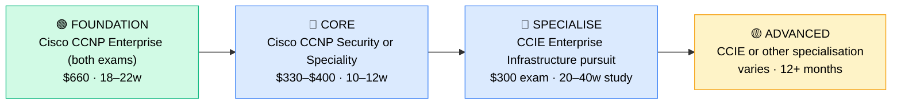

# How to Become a Senior Network Engineer

**CP10** · **Networking** · _Time to hire: Progression from 3–5 years as Network Engineer_ · _Entry cost: $1,500–$2,500 USD_

> **Path summary:** This path takes you from 3–5 years as Network Engineer to Senior Network Engineer, becoming a network architecture specialist and technical leader using advanced Cisco certifications (CCNP Enterprise completed, CCIE pursuit) and specialised networking knowledge—leading network design and strategy for complex organisations.

---

## Role Overview

### What does a Senior Network Engineer actually do?

A Senior Network Engineer is the network architect. You spend your day: architecting enterprise-scale network solutions (how should a global company's multi-site network look?), designing security overlays and network segmentation, optimising network performance at scale, mentoring junior engineers (they bring you their designs for review), presenting technical solutions to C-level stakeholders (CFO cares about costs, you present network ROI), owning network roadmaps (where is networking going in 3 years?), driving strategic initiatives (SD-WAN transformation, network security evolution), and sometimes hands-on: implementing critical network changes, troubleshooting complex multi-site issues. You're less on the keyboard fixing individual routers, more on the whiteboard designing networks.

Senior Network Engineers work at telcos, large banks, enterprise tech companies, ISPs, and advanced MSPs. You typically have 2–3 strategic projects simultaneously. Most roles are hybrid or remote—architecture and design work is done from anywhere, and crisis response can happen from home. You're likely on-call for critical network incidents, but it's rare to be woken up at 2am unless something truly critical is happening.

### Demand in 2026

- **Global job postings:** 25,000+ active Senior Network Engineer roles on LinkedIn as of May 2026 ([LinkedIn Jobs](https://www.linkedin.com/jobs/))
- **Growth rate:** 5% YoY ([U.S. Bureau of Labor Statistics](https://www.bls.gov/ooh/computer-and-information-technology/network-and-computer-systems-administrators.htm))
- **South Africa:** Moderate demand. Telcos (MTN, Vodacom, Telkom) hire at this level. Large banks (Nedbank, ABSA, FirstRand), ISPs (Liquid Intelligent Technologies), and enterprise tech companies seek senior engineers. Competition is moderate—fewer positions than entry-level, but strong candidates are in demand.
- **Remote availability:** High. 60%+ of Senior Network Engineer roles are remote or hybrid globally; in South Africa, similar—design and architecture can be done from home.

---

## Who Is This Path For?

### Ideal starting backgrounds

| Background | Readiness | What you already have |
|---|---|---|
| Network Engineer (3–5 yrs with CCNP) | ✅ Perfect fit | Technical foundation, design experience, ready to lead |
| Network Engineer (5+ yrs) | ✅ Perfect fit | Deep experience, ready to step up |
| Network Administrator (5+ yrs, self-taught) | 🟡 Possible | Lots of hands-on; may lack formal certs. CCIE pursuit helps. |
| Systems Architect with networking focus | 🟡 Possible | Broad infrastructure; may need deeper routing/switching |
| Complete beginner | ❌ Not ideal | Minimum 3–5 years as Network Engineer first |

### You're ready to start this path if you can:
- Have 3–5 years of hands-on network engineering experience
- Hold Cisco CCNP Enterprise (350-401 and 300-410)
- Have designed 2+ complex multi-site networks
- Mentor junior network engineers
- Communicate technical concepts to non-technical stakeholders
- Understand network architecture trade-offs (cost vs performance vs security)

> **Not ready yet?** Work 3–5 years as Network Engineer (CP09) first, completing CCNP Enterprise certifications.

---

## Certification Sequence

### Visual path

---

### Stage 1 — Foundation (Months 0–4, or skip if held)

**Goal:** Ensure you have complete Cisco CCNP Enterprise (both 350-401 and 300-410 exams). If you hold both, skip to Stage 2.

| Cert | Code | Cost (USD) | Study Time | Why it matters |
|---|---|---:|---:|---|
| Cisco CCNP Enterprise (both exams) | `350-401 + 300-410` | $660 | 18–22 weeks | Complete CCNP is baseline for senior engineer roles. |

**Stage 1 total:** $660 USD (or $0 if already held) · R11,880 ZAR

**Study approach:** If you already have both exams, skip. If missing one, complete using Network Direction courses and intensive GNS3 labbing.

---

### Stage 2 — Core Specialisation (Months 4–8)

**Goal:** Add a specialisation cert (CCNP Security or another speciality) to differentiate yourself and deepen your expertise.

**Option A: Cisco CCNP Security**

| Cert | Code | Cost (USD) | Study Time | Why it matters |
|---|---|---:|---:|---|
| Cisco CCNP Security | `300-730 + 300-710 + more` | $400+ | 12–16 weeks | Network security specialisation. In-demand as organisations prioritise security. |

**Option B: Cisco CCNP Service Provider or Cloud**

| Cert | Code | Cost (USD) | Study Time | Why it matters |
|---|---|---:|---:|---|
| Cisco CCNP Service Provider or Cloud | varies | $330–$400 | 10–12 weeks | Specialise in cloud networking or ISP/telco environments. |

**Stage 2 total:** $330–$400 USD · R5,940–R7,200 ZAR

**Study approach:** Choose based on your target role. Security specialisation is most in-demand. Use vendor courses and hands-on labs.

**Project milestone:** Design a comprehensive network security architecture for a large organisation: firewalls, intrusion detection, DDoS mitigation, encryption, access control, monitoring, compliance. Document with architecture diagrams.

---

### Stage 3 — Advanced Specialisation (Months 8–24+)

**Goal:** Pursue CCIE Enterprise Infrastructure (Cisco Certified Internetwork Expert). This is the gold standard in networking. CCIE requires 20–40 weeks of intensive study and real-world experience.

| Cert | Code | Cost (USD) | Study Time | Why it matters |
|---|---|---:|---:|---|
| CCIE Enterprise Infrastructure | `350-901 written + lab exam` | $300 + $500 lab | 20–40 weeks | Expert-level certification. Opens architect-track positions. |

**Stage 3 total:** $800 USD · R14,400 ZAR · 20–40 weeks

**Study approach:** CCIE is the hardest Cisco cert. Requires 3–5 years of hands-on experience. Study approach: use official Cisco training, INE courses (expensive but comprehensive, ~$3,000/year), build a 10+ router GNS3 lab, practice troubleshooting scenarios. The lab exam is 8 hours of hands-on networking—you must be fluent in every topic.

**Project milestone:** Design and implement a complex multi-site, multi-tenant network in GNS3 with 10+ routers, security, traffic engineering, and failover. This is close to the CCIE lab exam level.

> **Note:** CCIE pursuit is optional for Senior Network Engineer roles. Many senior engineers never pursue CCIE (it's very challenging and takes significant time/cost). However, CCIE opens architect-level and consultant roles with premium compensation.

---

### Stage 4 — Expert / Leadership (3+ years+)

**Goal:** CCIE certification + strategic leadership:

- **CCIE Enterprise Infrastructure** — expert-level routing/switching
- **Network Architect certifications** — from vendors or consortiums
- **MBA or Executive Education** — for broader business context
- **Thought Leadership** — speaking, publishing, mentoring at industry level

---

## Timeline & Cost Summary

| Stage | Certs | Duration | Cost (USD) | Cost (ZAR) |
|---|---|---|---:|---:|
| Stage 1 — Foundation | CCNP Enterprise (if needed) | Weeks 0–22 | $0–$660 | R0–R11,880 |
| Stage 2 — Core | CCNP Speciality (Security or other) | Weeks 22–34 | $330–$400 | R5,940–R7,200 |
| Stage 3 — Advanced | CCIE Enterprise Infrastructure pursuit | Weeks 34–100+ | $800 | R14,400 |
| **To Senior Network Engineer role** | | **12–24 months** | **$330–$1,460** | **R5,940–R26,280** |
| **To CCIE (optional)** | | **24–48 months** | **$1,130–$2,460** | **R20,340–R44,280** |

**Study hours required:** ~150–200 hours for speciality cert. ~400–600 hours for CCIE pursuit.

---

## Salary Progression

> All figures: median base salary, not including bonuses/equity. ZAR = USD × 18 baseline (verified May 2026). Sources: Robert Half 2026, Glassdoor, PayScale, LinkedIn Salary.

| Experience Level | USD/year | ZAR/month | GBP/year | EUR/year | AUD/year |
|---|---:|---:|---:|---:|---:|
| Senior Engineer (0–2 yrs in role) | $90,000–$130,000 | R58,000–R84,000 | £69,000–£100,000 | €83,000–€120,000 | A$144,000–A$208,000 |
| Principal Engineer (2–5 yrs) | $130,000–$180,000 | R84,000–R117,000 | £100,000–£139,000 | €120,000–€166,000 | A$208,000–A$288,000 |
| Architect / CCIE level (5+ yrs) | $180,000–$280,000 | R117,000–R182,000 | £139,000–£215,000 | €166,000–€257,000 | A$288,000–A$448,000 |
| Distinguished Engineer / VP (8+ yrs) | $280,000–$400,000+ | R182,000–R260,000+ | £215,000–£308,000+ | €257,000–€369,000+ | A$448,000–A$640,000+ |

**South Africa note:** Senior Network Engineers in major metros earn R58,000–R84,000/month. Telcos tend toward the higher end. CCNP-certified seniors command R70,000–R100,000/month. CCIE-level engineers (rare in SA) earn R120,000–R200,000/month. Architect-level roles push toward R150,000–R300,000/month. Remote contract work for international companies reaches R150,000–R250,000/month for senior engineers.

**Salary accelerators:** Cisco CCIE, CCNP Security, advanced specialisations, mentor/leadership track, cloud networking expertise (AWS/Azure), and strategic initiative ownership all command premiums in SA as of Q1 2026.

---

## First Job Strategy

### Year 0–2: Build Your Credentials

1. **Complete CCNP Enterprise** — Both exams (350-401, 300-410). This is baseline.
2. **Add specialisation** — CCNP Security OR another speciality cert. Shows depth.
3. **Lead strategic projects** — Design multi-site networks, lead network transformations (SD-WAN, etc.). Build your portfolio.
4. **Mentor junior engineers** — Start developing leadership skills. Mentor 1–2 people on your team.

### Year 2–3: Build Your Authority

- **Project 1: Network Architecture Document** — Document a major network you've designed or currently maintain. Include: topology, security model, scalability design, cost analysis, performance metrics. Show strategic thinking.
- **Project 2: Strategic Initiative** — Lead a network modernisation project: SD-WAN rollout, network segmentation, security overlay implementation. Document the business case, timeline, risks, outcomes.
- **Project 3: Thought Leadership** — Write 1–2 technical articles (blog, LinkedIn, or industry publication) on a complex networking topic (BGP, network security, cloud networking). Build your external visibility.

### Year 3–5: Apply for Senior Roles

- **CV positioning:** Highlight: networks designed (scale, complexity), projects led, team mentoring, strategic initiatives, business impact (cost savings, uptime improvements). Move away from technical jargon to business outcomes.
- **Target companies:** Telcos (MTN, Vodacom, Telkom), banks (Nedbank, ABSA, FirstRand), ISPs (Liquid Intelligent Technologies), enterprise tech companies.
- **Interview prep:** Be ready to discuss: 1) Your network design philosophy (why do you make specific architectural choices?), 2) A complex multi-site project you led, 3) How you mentor junior engineers, 4) Your approach to network security and compliance, 5) A major challenge you overcame, 6) Your vision for networking in 3 years.
- **Salary negotiation:** Senior Network Engineer in SA starts R58,000–R70,000/month. With CCNP + speciality cert, justify R70,000–R90,000/month. If you have CCIE or 5+ years experience, R90,000–R120,000/month. Know your market value.

---

## A Day in the Life

### Senior Network Engineer at MTN South Africa (Johannesburg) — 4 years in role

**08:00** — Arrive. Review network status and any critical alerts overnight. All systems healthy. Check email for escalations—one customer complaint about latency (ongoing issue you're investigating).

**08:30** — Architecture review with a junior engineer. They've designed a new customer network. Review their proposal: routing strategy is solid, but redundancy could be better, and they missed security considerations. Provide feedback and mentoring—this is part of your role.

**09:30** — Strategic planning meeting with network leadership. Planning next year's network investments: core router upgrades ($2M), branch redundancy improvements, security overlay expansion. You're presenting the business case, timeline, and expected outcomes (uptime improvement, cost savings, security posture).

**11:00** — Customer call. A key enterprise customer is considering migration away because of network performance. Work with them to understand their requirements, propose a solution (private line upgrade, traffic engineering), and timeline. Close the deal.

**12:00** — Lunch with a peer from another telco. Discuss industry trends: SD-WAN adoption, 5G network impact on enterprise connectivity, security evolution.

**13:00** — Deep work: BGP optimisation project. Customer is experiencing asymmetric routing (inbound and outbound traffic take different paths). Redesign BGP policies to ensure symmetric routing. Test in lab, coordinate with customer for production implementation.

**14:30** — Mentoring session. A senior engineer on your team is pursuing CCIE. Review their lab configurations, discuss challenging topics, provide encouragement. Leadership is mentoring.

**15:30** — Cost optimisation initiative. Network bandwidth costs are higher than expected. Analyse traffic patterns, identify opportunities to shift traffic to lower-cost circuits, recommend changes. Present to leadership.

**16:30** — Industry event planning. Propose that MTN sponsor a networking conference talk. You'd present on a strategic topic (network security evolution, cloud networking trends). Build MTN's thought leadership.

**17:00** — Wrap up. Tomorrow: customer presentation on their network upgrade proposal.

### Senior Network Engineer at Liquid Intelligent Technologies (Cape Town, ISP) — 5 years in role

**09:00** — Start day from home. Review network status globally (Liquid has operations across Africa). One peering point in West Africa experienced brief instability (now resolved). Document incident.

**09:45** — Strategic architecture work: planning Liquid's network evolution over next 3 years. Key initiatives: expand DCI (data centre interconnect) capacity, SD-WAN for enterprise customers, 5G backhaul readiness. You're owning the network architecture roadmap. Present to VP of Engineering.

**11:00** — Vendor negotiation. Working with Cisco on equipment discount for large order. Your architectural recommendations directly impact the business (if you recommend Cisco, it's a $5M deal). Leverage your expertise for better terms.

**12:00** — Lunch.

**13:00** — Complex troubleshooting: a major customer's network is experiencing intermittent packet loss. Multi-site issue, hard to diagnose. Use packet captures (Wireshark), routing analysis, and deep BGP knowledge to identify the issue: an ISP upstream has a configuration problem affecting your customer. Work with them to coordinate fix.

**14:30** — Thought leadership: writing a technical blog post on "Network Security in Multi-Cloud Environments" for Liquid's website. Your byline helps recruit senior talent and builds Liquid's industry presence.

**15:30** — Mentor two junior engineers. One is working on CCNP, another on CCIE. Review their progress, provide guidance, encourage.

**16:30** — Conference proposal: you've been invited to speak at Cisco Live (major industry conference). Prepare an abstract on "Designing Scalable Enterprise Networks in Africa." This is high-profile visibility.

**17:00** — Wrap up. Reflect on strategic initiatives. Your role is no longer "fix this router"—it's "where should the network go?"

---

## Related Paths & Progressions

| From here you can move to… | Why |
|---|---|
| CCIE Enterprise Infrastructure | Expert-level networking; opens consultant and architect roles |
| Network Architect / Principal Engineer | Lead network strategy and vision; broader organisational role |
| VP of Engineering / CTO | Transition from network specialist to technology leader |
| Consultant (independent) | CCIE + expertise makes you valuable as independent consultant |

---

## South Africa Context

### Market specifics

Senior Network Engineer is a competitive but well-valued role in South Africa. Telcos (MTN, Vodacom, Telkom) have multiple senior engineer positions. Banks (Nedbank, ABSA, FirstRand) hire at this level. ISPs (Liquid Intelligent Technologies) and enterprise tech companies also seek senior engineers. Competition is higher than entry-level—fewer positions, more qualified candidates. However, strong candidates with CCNP/CCIE and strategic project experience are consistently in demand.

Remote work is common for senior roles. Many international companies hire South African senior network engineers for EMEA support at premium rates. This can bypass traditional SA salary ceilings—a senior network engineer working for an international company can earn 2x SA market rates.

### SA-specific resources

| Resource | URL | Note |
|---|---|---|
| Gumtree IT Jobs (SA) | [https://www.gumtree.co.za/s-it-jobs/](https://www.gumtree.co.za/s-it-jobs/) | Filter for "Senior Network Engineer" |
| Indeed South Africa | [https://www.indeed.co.za/q-Senior-Network-Engineer-jobs.html](https://www.indeed.co.za/q-Senior-Network-Engineer-jobs.html) | Active listings |
| LinkedIn (South Africa) | [https://www.linkedin.com/jobs/search/?keywords=Senior%20Network%20Engineer&location=South%20Africa](https://www.linkedin.com/jobs/search/?keywords=Senior%20Network%20Engineer&location=South%20Africa) | Major companies post here |
| Cisco Learning Network | [https://learningnetwork.cisco.com/](https://learningnetwork.cisco.com/) | CCIE study community |
| INE (Internetwork Expert) | [https://www.ine.com/](https://www.ine.com/) | Premium CCIE training (expensive but comprehensive) |

---

## Frequently Asked Questions

**Q: Do I need CCIE to become a Senior Network Engineer?**

No. CCNP + 3–5 years experience gets you there. CCIE opens architect-level roles with higher pay, but not required for senior engineer positions.

**Q: How hard is the CCIE exam?**

Very hard. Failure rate is 50%+. It requires 3–5 years of real-world experience and 20–40 weeks of intensive study. It's considered one of the hardest IT certifications globally.

**Q: Can I skip CCNP and go straight for CCIE?**

No. CCIE requires CCNP as a prerequisite (or equivalent experience). Plus, you need real-world experience.

**Q: How much does CCIE study cost?**

$3,000–$10,000+ in courses and lab access (INE, Cisco, GNS3, etc.). Plus exam fees ($300 written, $500 lab). Plus opportunity cost (months of study time). Total investment: $5,000–$15,000 and 1–2 years of time.

**Q: Is CCIE worth it?**

If you want to be an architect or consultant: absolutely. If you want to stay hands-on: maybe not. CCIE opens doors; whether you walk through them depends on your career goals.

**Q: What's the job market like for CCIE in SA?**

Limited. Fewer than 50 CCIE-level positions in SA at any time. Most CCIE engineers are consultants or work for international companies remotely. But if you get one, the salary is excellent (R120,000–R200,000+/month).

---

## Sources & Further Reading

| # | Source | URL | Used for |
|---|---|---|---|
| 1 | Cisco Learning Network | [CCIE Enterprise Infrastructure](https://learningnetwork.cisco.com/s/ccie-enterprise-infrastructure-exam-topics) | Official CCIE exam topics |
| 2 | Robert Half 2026 IT Salary Guide | [Robert Half Technology Salary Guide](https://www.roberthalf.com/us/en/salary-guide) | Senior Engineer salary data |
| 3 | Glassdoor | [Senior Network Engineer Salaries](https://www.glassdoor.com/Salaries/senior-network-engineer-salary-SRCH_KO0,21.htm) | Global salary benchmarks |
| 4 | PayScale (South Africa) | [Senior Network Engineer Salary (ZA)](https://www.payscale.com/research/ZA/Job=Senior_Network_Engineer/Salary) | ZA-specific salary data |
| 5 | INE | [CCIE Training Programs](https://www.ine.com/) | Premium CCIE training and lab access |
| 6 | Cisco Official | [CCIE Enterprise Infrastructure Exam](https://www.cisco.com/c/en/us/training-events/training-certifications/certifications/expert.html) | Official exam details |
| 7 | Cisco Live | [Industry Conference](https://www.ciscolive.com/) | Networking conference for senior professionals |
| 8 | David Bombal YouTube | [CCIE Study Resources](https://www.youtube.com/c/DavidBombal) | Free CCIE study material and insights |

---

*Template version: 2026-05-02 | Maintained by IT Career Roadmap | ZAR baseline: R18/$1 USD*
*File: Career_Paths/CP10_Networking_Senior_Network_Engineer.md*
