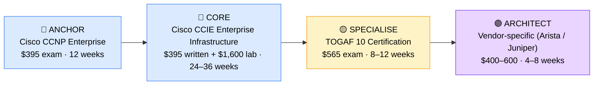

# How to Become a Network Architect

**`CP11`** · **Networking** · _Time to hire: Variable (7–10 years baseline experience required)_ · _Entry cost: $2,500–$4,200 USD_

> **Path summary:** This path takes you from Senior Network Engineer to Enterprise Network Architect—a strategic leadership role designing complex, scalable network infrastructures for Fortune 500 companies, financial institutions, and large government agencies. Unlike entry-level networking paths, this requires deep hands-on experience first.

---

## Role Overview

### What does a Network Architect actually do?

A Network Architect spends 40% of their time designing enterprise network topologies, capacity plans, and disaster recovery architectures. They work in Visio, network simulation tools, and architectural frameworks, translating business requirements (e.g. "we need 99.99% uptime across 50 data centres") into detailed technical blueprints. They review new technologies (SD-WAN, intent-based networking, zero-trust models) and make multi-million-dollar purchasing decisions. The remaining time is split between technical leadership (mentoring teams of 5–10 engineers), vendor negotiations, compliance audits (SOX, ISO 27001), and board-level presentations explaining network strategy in business terms.

Network Architects sit at the intersection of infrastructure, security, and business strategy. They're not "hands-on" in the day-to-day sense—they don't troubleshoot individual VLANs—but they're deeply technical and must validate designs in labs before rollout. They work on 2–5 year strategic initiatives: migrating to cloud-first networking, adopting zero-trust architecture, or consolidating multiple regional networks into a global fabric.

### Demand in 2026

- **Global job postings:** 12,000+ active roles on LinkedIn as of May 2026 [(source)](https://www.linkedin.com/jobs/search/?keywords=Network%20Architect)
- **Growth rate:** 5% YoY growth through 2030; strong demand for cloud-era architects [(source)](https://www.bls.gov/ooh/computer-and-information-technology/network-and-computer-systems-administrators.htm)
- **South Africa:** High demand at major banks (Nedbank, Standard Bank, ABSA), telcos (MTN, Vodacom), and cloud-first consultancies (Dimension Data, BCX, EOH). Network modernisation initiatives across the financial sector driving consistent hiring.
- **Remote availability:** Medium (40–50%)—many global firms hire remote Network Architects, but some require on-site presence for strategic planning meetings.

---

## Who Is This Path For?

### Ideal starting backgrounds

| Background | Readiness | What you already have |
|---|---|---|
| Network Engineer (5+ yrs) | ✅ Ready to start | Deep hands-on routing, switching, protocol knowledge |
| Senior Network Administrator | ✅ Ready to start | Operational knowledge; needs design methodology training |
| Systems Architect | 🟡 Possible with bridge | Infrastructure understanding; needs network-specific depth |
| Network Technician | ❌ Not ready | Needs 5+ years of engineering roles first; this is not an entry path |
| IT Support / Help Desk | ❌ Not ready | This is a 10+ year career progression minimum |

### You're ready to start this path if you can:

- Design a multi-site enterprise network with redundancy, failover, and QoS policies (not just implement existing designs)
- Explain BGP, OSPF, and when to use each; understand route summarization and convergence time
- Have led or mentored a team of 3+ network engineers
- Completed 5+ years of network engineering experience in production environments
- Understand enterprise compliance frameworks (SOX, PCI-DSS, ISO 27001) and how they affect network design
- Hold a CCNP-level certification and be working toward CCIE or equivalent

> **Not ready yet?** Start with [CCNP Enterprise or Service Provider path](CP01_Networking_CCNP_Enterprise.md) and gain 5+ years of hands-on engineering experience first. This is not a shortcut path.

---

## Certification Sequence

### Visual path

---

## Certification & Experience Path

### Stage 1 — Anchor Certification (Already in role or Months 0–3)

**Goal:** Refresh and validate enterprise-level networking knowledge if not already CCNP-certified.

| Cert | Code | Cost (USD) | Study Time | Why it matters |
|---|---|---:|---:|---|
| Cisco Certified Network Professional Enterprise (if not already held) | `350-401 ENCOR` | $395 | 8–12 weeks | Validator of core enterprise routing, switching, VRF, and QoS. Most Network Architects already hold this. |

**Stage 1 note:** Most candidates for Network Architect roles already hold CCNP. If you don't, pass this exam first while working as a Senior Network Engineer.

**Study approach:** If needed, use INE, CBT Nuggets, or Cisco Learning Network for enterprise-focused deep dives. This is a refresher for most; new candidates should dedicate 10 hours/week.

---

### Stage 2 — Expert Certification (Months 3–12)

**Goal:** Demonstrate expert-level knowledge through the CCIE Written and Lab exams—the gold standard for network architects.

| Cert | Code | Cost (USD) | Study Time | Why it matters |
|---|---|---:|---:|---|
| Cisco CCIE Enterprise Infrastructure Written | `400-007` | $395 | 12–16 weeks | Proves mastery of enterprise design principles, high availability, security integration. Prerequisite for Lab. |
| Cisco CCIE Enterprise Infrastructure Lab | `Lab exam` | $1,600 | 12–24 weeks | The pinnacle—8-hour hands-on exam building production-grade networks. Separates architects from engineers. Hiring managers expect CCIE for architect roles. |

**Stage 2 total:** $1,995 USD · R35,910 ZAR · 24–36 months

**Study approach:** CCIE is not a study-for-weeks path. Allocate 15–20 hours/week for 6–12 months. Use INE CCIE labs, Cisco's official blueprint, and real-world lab scenarios. Schedule the Written when you can consistently score 85%+ on practice exams. Only schedule the Lab after passing Written and completing 200+ hours of lab time.

**Lab requirement:** Build a full enterprise network in GNS3 or a dedicated CCIE lab platform. Simulate multi-site failover, BGP convergence, MPLS traffic engineering, and compliance audits. This is 300+ hours of hands-on work.

---

### Stage 3 — Architecture Framework (Months 12–18)

**Goal:** Learn enterprise architecture frameworks that bridge technical design and business strategy.

| Cert | Code | Cost (USD) | Study Time | Why it matters |
|---|---|---:|---:|---|
| TOGAF 10 Foundation + Practitioner | `TOGAF-C10` | $565 | 8–12 weeks | Enterprise architecture framework. Teaches how to link network design to business outcomes. Architects use this language in strategy meetings. |

**Stage 3 total:** $565 USD · R10,170 ZAR · 8–12 weeks

**Study approach:** Use official TOGAF study guides and Van Haren Publishing materials. The Foundation exam is straightforward; Practitioner requires applying TOGAF concepts to real scenarios. Schedule both within 3 months of each other.

**Project milestone:** Design a complete network modernisation strategy for a hypothetical Fortune 500 company migrating from legacy hub-and-spoke to cloud-first SD-WAN. Document the business case, technical architecture, phased migration plan, and risk mitigation. This becomes your portfolio piece for architect interviews.

---

### Stage 4 — Vendor-Specific Depth (Months 18–24, Optional but Recommended)

**Goal:** Master one modern networking platform at an advanced level (beyond Cisco, into SD-WAN or cloud-native networking).

| Cert | Code | Cost (USD) | Study Time | Why it matters |
|---|---|---:|---:|---|
| Cisco Architect Enterprise Networks | `CCNP Enterprise + exam` | $400–600 | 4–8 weeks | Optional but valuable. Shows mastery of modern enterprise design patterns. |
| OR Arista Certified Routing & Switching Expert (ACRE) | `ACRE` | $500 | 6–10 weeks | For cloud-native and hyperscaler environments. Increasingly common in modern architect roles. |

> **Optional at hire time:** Many Network Architects land their first architect role after Stage 2 (CCIE) + Stage 3 (TOGAF) and complete vendor-specific certs while employed. This is standard.

---

## Timeline & Cost Summary

| Stage | Certs | Duration | Cost (USD) | Cost (ZAR) |
|---|---|---|---:|---:|
| Stage 1 — Anchor (if needed) | CCNP Enterprise | Variable | $395 | R7,110 |
| Stage 2 — Expert | CCIE Written + Lab | 24–36 months | $1,995 | R35,910 |
| Stage 3 — Framework | TOGAF 10 | 8–12 weeks | $565 | R10,170 |
| **Total to hireable** | | **24–36 months** | **$2,955** | **R53,190** |
| Optional Stage 4 | Vendor-specific | 4–8 weeks | $400–600 | R7,200–10,800 |

**Study hours required:** 500–800 hours total (Stage 2–3). Assumes 15–20 hours/week over 24–36 months.

---

## Salary Progression

> All figures: median base salary, not including bonuses/equity. ZAR = USD × 18 baseline (verified May 2026). Sources: Robert Half 2026, Glassdoor, PayScale, LinkedIn Salary.

| Experience Level | USD/year | ZAR/year | GBP/year | EUR/year | AUD/year |
|---|---:|---:|---:|---:|---:|
| Mid-level Network Engineer (2–5 yrs) | $90,000 | R1,620,000 | £70,000 | €82,000 | A$145,000 |
| Senior Network Engineer (5–8 yrs) | $120,000 | R2,160,000 | £95,000 | €112,000 | A$195,000 |
| Entry Network Architect (8–10 yrs) | $145,000 | R2,610,000 | £115,000 | €135,000 | A$235,000 |
| Lead Network Architect (10+ yrs) | $175,000 | R3,150,000 | £138,000 | €162,000 | A$285,000 |

**South Africa note:** Network Architects at Johannesburg-based banks (Nedbank, Standard Bank, ABSA) earn R90,000–R125,000/month (entry), scaling to R135,000–R180,000/month for Lead roles. Telcos (MTN, Vodacom) pay similarly. Remote positions for international clients push mid-level roles to R120,000–R160,000/month. Consultancies (Dimension Data, BCX) typically pay 10–15% below banks but offer better learning opportunities.

**Salary accelerators:** CCIE certification adds 15–25% premium. Cloud certifications (AWS Professional, Azure Expert) add another 10%. TOGAF and vendor-specific certs (Arista, Juniper) add 5–10% combined.

---

## First Job Strategy

### Phase 1: Months 0–12 — Get CCIE Written & Build Architect Portfolio

1. **Commit to CCIE Written** — Allocate 15–20 hours/week. Use INE video course + Cisco Learning Network labs.
2. **Build a capstone design project** — Design a disaster recovery network for a multi-region company. Use Visio for architecture diagrams and document all design decisions.
3. **Present internally** — Pitch your design to your current team or at a local Cisco Learning Network meet-up. Get feedback and iterate.
4. **Mentor junior engineers** — Architects spend significant time mentoring. Start formalising this now—document your knowledge.

### Phase 2: Months 12–18 — Pass CCIE Written & Start TOGAF

1. **Pass CCIE Written** — Once this is done, you're "CCIE Written, Lab pending"—use this credential on your CV immediately.
2. **Begin TOGAF study** — 8–12 weeks part-time. Use official study materials and practice exams.
3. **Network with architects** — Join Cisco Architect community groups, attend enterprise networking conferences (Cisco Live), connect with architects at major financial institutions on LinkedIn.
4. **Document network trends** — Write 2–3 blog posts or LinkedIn articles about enterprise networking trends (SD-WAN adoption, zero-trust, cloud migration). Demonstrate strategic thinking.

### Phase 3: Months 18–24 — Lab & Architect Interviews

1. **Intensive CCIE Lab prep** — 20–25 hours/week. This is full immersion. Schedule the lab when you're scoring 95%+ on full-length practice exams.
2. **Target architect roles** — Apply to enterprise architect positions at banks, telcos, large consultancies. Your CV should read "CCIE Written, TOGAF Certified, [Years] network architecture experience."
3. **Interview prep** — Be ready to discuss a major network redesign you led, design trade-offs, vendor selection criteria, and how you balance technical elegance with business constraints.
4. **Negotiate for architect roles** — Don't settle for "Senior Engineer" titles. Architect roles are where the salary and strategy come in.

---

## A Day in the Life

### Network Architect at a Fortune 500 Bank — Entry Level

**08:00** — Review overnight emails. One data centre migration is scheduled for this weekend; review the runbook and sign-off on the change request. Check with the Network Operations Centre (NOC) on any incidents from yesterday.

**09:00** — Strategy meeting with the CTO. Present a proposal for migrating from MPLS to SD-WAN across 30 branch offices. Walk through cost savings (35%), implementation timeline (6 months), and risk mitigation. This is a $2M decision.

**10:30** — One-on-one with a Senior Network Engineer struggling with BGP design. Whiteboard through the problem, explain the business context (why we're using specific ASNs and route filtering), and set them up for success.

**12:00** — Lunch

**13:00** — Work with a security architect on zero-trust network design. Review firewall rules, micro-segmentation strategies, and how this affects network latency and compliance (PCI-DSS). This is a 12-month initiative.

**14:30** — Vendor call with Cisco account team. Discuss hardware refresh options for core routers. Negotiate contract terms and licensing model.

**15:30** — Documentation. Update the network architecture runbook with new QoS policies. This document is used by the NOC and on-call engineers.

**16:30** — End of day. Update your architecture roadmap and send it to leadership. Network Architects spend ~30% of their time in strategic communication, not hands-on configuration.

### Network Architect at a Cloud-Native Telco — Mid Level (10+ years)

**09:00** — Board-level presentation on network infrastructure roadmap. Present 5-year strategy: shift from traditional backbone to cloud-native networking, projected ROI, and competitive advantage. This is where architect value shines.

**10:30** — Technology evaluation. Vendors pitching intent-based networking platforms. You grill them on enterprise support, convergence times, and compatibility with your existing multi-vendor environment.

**12:00** — Lunch with the VP of Infrastructure. Strategic discussion: should we build a network operations centre (NOC) in-house or outsource to a managed services provider (MSP)? Architect must understand business, not just technology.

**13:00** — Design review with the architecture team (3 other architects covering security, cloud, and applications). Whiteboard a network design for a new 5G rollout. Debate trade-offs: latency vs. cost vs. resilience.

**14:30** — Mentoring. Two architects reporting to you. One struggling with a complex multi-cloud network design; coach them through it. The other is studying for CCIE; review their lab work.

**15:30** — Write RFP (Request for Proposal) for new WAN edge devices. You're the technical decision-maker for a $5M spend.

**16:30** — End of day. Update the enterprise architecture model (in TOGAF terms). Review quarterly KPIs: network availability, latency, cost per Mbps. This is where architects prove ROI.

---

## Related Paths & Progressions

| From here you can move to… | Why |
|---|---|
| [Chief Technology Officer (CTO)](CP90_IT_Management_CTO.md) | Network Architect is a common stepping stone to CTO; strategic thinking carries over perfectly. |
| [Enterprise Solutions Architect](CP89_IT_Management_Solutions_Architect.md) | Broaden from networks to full infrastructure strategy; architects often move here. |
| [Cloud Architect](CP18_Cloud_Cloud_Architect.md) | Network Architects often pivot to cloud architecture; network skills are directly applicable. |
| [Security Architect](CP70_Security_Security_Architect.md) | Network security expertise + zero-trust design often leads here. |

---

## South Africa Context

### Market specifics

Network Architects are in strong demand across South Africa's financial sector, driven by major infrastructure modernisation initiatives. Nedbank, Standard Bank, and ABSA are all actively hiring architects to redesign networks for cloud, digital banking, and resilience. Telcos (MTN, Vodacom) are investing heavily in 5G network infrastructure and cloud-native architectures, creating architect roles. Large consultancies (Dimension Data, BCX, EOH) employ teams of 20+ architects supporting enterprise clients across sub-Saharan Africa.

Remote work is increasingly available for Network Architects in South Africa. Many Johannesburg-based architects work remotely for global banks or consultancies, earning international salaries (USD or GBP) while based in Cape Town or Durban. This can push mid-level architect salaries to R120,000–R160,000/month, compared to R90,000–R125,000/month for local roles.

BEE (Black Economic Empowerment) and EE (Employment Equity) considerations apply strongly. Large South African corporates have preferential hiring for previously disadvantaged individuals, and CCIE/TOGAF certifications help level the field by providing objective credential verification. Many firms offer bursaries or study sponsorships for EE candidates pursuing CCIE.

### SA-specific resources

| Resource | URL | Note |
|---|---|---|
| Cisco Learning Network South Africa | [https://www.ciscolearningnetwork.com/](https://www.ciscolearningnetwork.com/) | Active community in SA; local study groups and meet-ups. |
| Dimension Data Architecture Community | [https://www.dimensiondata.com/careers](https://www.dimensiondata.com/careers) | Major employer of network architects in SA; often has mentorship programs. |
| MTN Careers (Architecture roles) | [https://careers.mtn.com/search/architect/](https://careers.mtn.com/search/architect/) | Strong hiring for network architects; competitive salaries. |
| EOH Skills Academy | [https://www.eoh.co.za/](https://www.eoh.co.za/) | South African consultancy offering CCIE training and mentorship. |
| Cisco CCIE Study Group South Africa | [https://www.linkedin.com/groups/8722681/](https://www.linkedin.com/groups/8722681/) | LinkedIn community; active discussions and study resource sharing. |

---

## Frequently Asked Questions

**Q: Do I need a degree to become a Network Architect?**
No formal degree is required. However, most Network Architects have either a degree in Computer Science/IT or equivalent experience. What matters is your CCIE and TOGAF credentials, plus 7–10 years of hands-on experience. Degree holders sometimes reach architect roles in 5–7 years; non-degree holders typically need 10+ years. In South Africa, large corporates may prefer degrees, but CCIE often overrides this.

**Q: How long does it realistically take from zero?**
If you're starting as a Help Desk technician with no networking knowledge: 10–12 years minimum. CCNP takes 2–3 years, CCIE takes another 2–3 years, and you need 5+ years of hands-on engineering experience between. Network Architect is not an entry-level path; it's a leadership destination after 10+ years of technical depth. Be honest with yourself about this timeline.

**Q: Which cert should I do first?**
You must have CCNP (Enterprise or Service Provider) before attempting CCIE. CCNP itself takes 1–2 years. Once you're 3–5 years past CCNP (so 5–7 years total networking), start CCIE Written. This sequencing matters because CCIE labs test judgment and design sense that only come from years in production environments.

**Q: Can I do this path while working full-time?**
Yes, absolutely. Most CCIE candidates study while working full-time. At 15–20 hours/week, CCIE Written takes 6–12 months; Lab takes 12–24 months. TOGAF takes 8–12 weeks part-time. The challenge is maintaining focus for 24–36 months. Many architects find a study partner or join a study group to stay accountable.

**Q: Is CCIE worth it for this role?**
For Network Architect roles at enterprise banks, telcos, and large consultancies: yes, absolutely. CCIE is the credential that signals "this person can design enterprise-scale networks without supervision." CCNP alone will not qualify you for architect roles in South Africa or globally. The investment ($2K exam cost + 500+ hours) is worth it for a $150K+/year career path.

**Q: Can I skip CCIE and go straight to architect roles with just CCNP?**
Practically speaking, no. Hiring managers for architect roles expect CCIE. You might find a "Senior Network Engineer" role without CCIE, but true architect positions (with architect titles, architect compensation, and architecture responsibilities) almost universally require CCIE. CCNP gets you to Senior Engineer; CCIE gets you to Architect.

---

## Sources & Further Reading

| # | Source | URL | Used for |
|---|---|---|---|
| 1 | LinkedIn Job Search | [https://www.linkedin.com/jobs/search/?keywords=Network%20Architect](https://www.linkedin.com/jobs/search/?keywords=Network%20Architect) | Job postings and demand analysis |
| 2 | Robert Half Salary Guide 2026 | [https://www.roberthalf.com/salary-guide/network-architect](https://www.roberthalf.com/salary-guide/network-architect) | Salary data for Network Architects |
| 3 | Cisco CCIE Enterprise Infrastructure | [https://www.cisco.com/c/en/us/training-events/training-certifications/certifications/expert.html](https://www.cisco.com/c/en/us/training-events/training-certifications/certifications/expert.html) | Exam details, costs, blueprint |
| 4 | Cisco Learning Network | [https://learningnetwork.cisco.com/](https://learningnetwork.cisco.com/) | Study resources and community |
| 5 | The Open Group TOGAF 10 | [https://www.opengroup.org/togaf](https://www.opengroup.org/togaf) | Enterprise architecture framework details |
| 6 | LinkedIn Salary Insights | [https://www.linkedin.com/salary/network-architect-salary/](https://www.linkedin.com/salary/network-architect-salary/) | Crowdsourced salary data |
| 7 | BLS Occupational Outlook | [https://www.bls.gov/ooh/computer-and-information-technology/network-and-computer-systems-administrators.htm](https://www.bls.gov/ooh/computer-and-information-technology/network-and-computer-systems-administrators.htm) | Growth projections through 2030 |
| 8 | Dimension Data Careers | [https://www.dimensiondata.com/careers](https://www.dimensiondata.com/careers) | SA employment context |

---

*Template version: 2026-05-02 | Maintained by IT Career Roadmap | ZAR baseline: R18/$1 USD*
*File naming: `Career_Paths/CP11_Networking_Network_Architect.md`*
