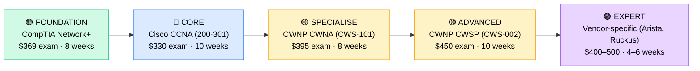

# How to Become a Wireless Network Engineer

**`CP12`** · **Networking** · _Time to hire: 12–18 months_ · _Entry cost: $1,200–$1,800 USD_

> **Path summary:** This path takes you from IT Support or Network Technician to a hired Wireless Network Engineer—designing, deploying, and maintaining enterprise Wi-Fi networks, mesh systems, and mobile infrastructure. Strong demand across campuses, hospitals, airports, and retail chains. Faster to hire than traditional routing/switching roles.

---

## Role Overview

### What does a Wireless Network Engineer actually do?

A Wireless Network Engineer spends 50% of their time designing and optimizing Wi-Fi networks—site surveys, RF propagation modeling, capacity planning, and roaming policies. They use tools like Ekahau Pro (heat mapping), network analyzers, and spectrum analysers to measure signal strength, interference, and data rates. The other 50% is troubleshooting: user connectivity issues, rogue access points, interference from microwaves or cordless phones, and integration with security systems (802.1X, WPA3, RADIUS servers).

Unlike traditional network engineers who spend time in configuration terminals, wireless engineers spend time in buildings with devices—crawling through ceilings to check AP placement, sitting with a laptop running site survey tools, and talking to end users about their connectivity complaints. They're part engineer, part detective, part vendor negotiator. They need to understand RF (radio frequency) theory, Wi-Fi standards (802.11ac, 802.11ax), WLAN controllers, and how to troubleshoot problems that traditional network engineers can't see.

### Demand in 2026

- **Global job postings:** 8,500+ active roles on LinkedIn as of May 2026 [(source)](https://www.linkedin.com/jobs/search/?keywords=Wireless%20Network%20Engineer)
- **Growth rate:** 7% YoY; 802.11ax (Wi-Fi 6) deployments and IoT proliferation driving strong demand [(source)](https://www.bls.gov/ooh/computer-and-information-technology/network-and-computer-systems-administrators.htm)
- **South Africa:** Growing demand at hospitals (Mediclinic, Life Healthcare), universities (University of Cape Town, Wits, Stellenbosch), and retail chains (Woolworths, Shoprite, Pick n Pay). Hospitality sector (hotels, resorts) increasingly requiring wireless expertise.
- **Remote availability:** Medium (35–45%)—some design and documentation work is remote, but site surveys and installations require on-site presence.

---

## Who Is This Path For?

### Ideal starting backgrounds

| Background | Readiness | What you already have |
|---|---|---|
| Network Technician | ✅ Strong start | TCP/IP, basic routing, hands-on troubleshooting |
| IT Support / Help Desk | ✅ Good start | Troubleshooting mindset, user-facing experience |
| Network Administrator | ✅ Strong start | VLAN management, DHCP, network architecture basics |
| Sysadmin | 🟡 Good with gaps | Infrastructure knowledge; needs Wi-Fi-specific learning |
| Fresh IT graduate | 🟡 Good with gaps | Theory solid; needs hands-on Wi-Fi labs |
| Developer | 🟡 Possible | Coding helps with automation; needs networking foundation |

### You're ready to start this path if you can:

- Explain what SSID, WPA2, 802.1X, and RADIUS are and how they work together
- Troubleshoot a basic Wi-Fi connectivity issue (weak signal, DNS resolution, roaming)
- Set up a home lab with a wireless AP and test basic security settings
- Understand subnetting (CIDR notation) and routing basics
- Pass CompTIA Network+ exam on first or second attempt

> **Not ready yet?** Start with [CompTIA Network+ path](CP01_Foundation_Network_Plus.md) first. This covers the TCP/IP and networking fundamentals you'll need.

---

## Certification Sequence

### Visual path

---

## Certification Path & Timeline

### Stage 1 — Foundation (Months 0–2)

**Goal:** Prove you have baseline networking knowledge before specialising in wireless.

| Cert | Code | Cost (USD) | Study Time | Why it matters |
|---|---|---:|---:|---|
| CompTIA Network+ | `N10-008` | $369 | 6–8 weeks | Covers TCP/IP, DNS, DHCP, routing, troubleshooting—all foundational for wireless. Employers expect this before hire. |

**Stage 1 total:** $369 USD · R6,642 ZAR · 2 months

**Study approach:** Use Professor Messer's free YouTube videos (comprehensive, well-paced) paired with CompTIA's official study guide and Jason Dion practice exams on Udemy. Aim for 10 hours/week. Schedule the exam when you're scoring 80%+ on practice tests.

**Lab requirement:** Build a home lab with a wireless router, a Linux VM, and a Windows PC. Practice basic DHCP configuration, static IP assignment, and packet capture with Wireshark. 15–20 hours hands-on minimum.

---

### Stage 2 — Core Specialisation (Months 2–5)

**Goal:** Get the Cisco CCNA—the primary credential hiring managers look for on Wireless Engineer CVs.

| Cert | Code | Cost (USD) | Study Time | Why it matters |
|---|---|---:|---:|---|
| Cisco Certified Network Associate (CCNA) | `200-301` | $330 | 10–12 weeks | Covers VLAN, routing, switching, basic wireless. Entry-level roles require CCNA. Gives you 70%+ of the knowledge wireless roles need. |

**Stage 2 total:** $330 USD · R5,940 ZAR · 3 months

**Study approach:** Use INE or CBT Nuggets for video training (both have dedicated CCNA wireless modules). Pair with Jeremy's IT Lab on YouTube (free, excellent). Complete 100+ practice questions from Exam Topics or Boson ExSim. Schedule when you're scoring 85%+ on practice exams.

**Project milestone:** Build a network in Cisco Packet Tracer with VLANs, inter-VLAN routing, and a wireless AP. Document how data flows from a wireless client through the VLAN to a server. Include screenshots and explanations. This becomes part of your portfolio.

---

### Stage 3 — Wireless Specialisation (Months 5–10)

**Goal:** Demonstrate wireless-specific expertise. CWNP is the industry standard for wireless engineers (Cisco CCNP Wireless is no longer offered).

| Cert | Code | Cost (USD) | Study Time | Why it matters |
|---|---|---:|---:|---|
| CWNP Certified Wireless Network Administrator (CWNA) | `CWS-101` | $395 | 8–10 weeks | RF theory, 802.11 standards, site surveys, security. Core wireless knowledge. Most entry-level wireless roles require CWNA. |
| CWNP Certified Wireless Security Professional (CWSP) | `CWS-002` | $450 | 8–10 weeks | Wi-Fi security (WPA3, 802.1X, RADIUS), encryption, threat mitigation. Increasingly required for enterprise roles. |

**Stage 3 total:** $845 USD · R15,210 ZAR · 5 months

**Study approach:** Use official CWNP course materials and exam guides. CWNA has 2 study books (Sybex); read both. Use Boson's Wi-Fi practice exams. CWSP requires deeper security understanding; supplement with David Coleman's books (the wireless Bible). Complete 50+ practice questions daily in final 2 weeks.

**Lab requirement:** Perform a real or simulated site survey. Use Ekahau's free Heat Mapper or Wi-Fi Analyzer app to map signal strength in your home or workplace. Identify dead zones, interference, and suggest AP placement improvements. Document with heatmaps and written analysis.

---

### Stage 4 — Advanced Specialisation (Months 10–15)

**Goal:** Add depth with vendor-specific certifications or advanced CWNP credentials.

| Cert | Code | Cost (USD) | Study Time | Why it matters |
|---|---|---:|---:|---|
| Cisco DevNet Associate (optional, for automation) | `200-901` | $330 | 8 weeks | Python scripting and network automation. Increasingly relevant as wireless networks become software-defined. |
| OR Ruckus Certified Associate (RCA) Wireless Engineer | `RCA-WE` | $400 | 6–8 weeks | Ruckus is strong in higher education and large enterprises. Add this if targeting Ruckus-heavy markets. |

**Stage 4 total:** $330–400 USD · R5,940–7,200 ZAR · 4–6 weeks

> **Optional at hire time:** Many people land their first Wireless Engineer job after Stage 3 (CCNA + CWNA + CWSP) and complete Stage 4 certs while employed. This is completely valid and common.

---

## Timeline & Cost Summary

| Stage | Certs | Duration | Cost (USD) | Cost (ZAR) |
|---|---|---|---:|---:|
| Stage 1 — Foundation | Network+ | Months 0–2 | $369 | R6,642 |
| Stage 2 — Core | CCNA | Months 2–5 | $330 | R5,940 |
| Stage 3 — Wireless | CWNA + CWSP | Months 5–10 | $845 | R15,210 |
| **Total to hireable** | | **12–15 months** | **$1,544** | **R27,792** |
| Optional Stage 4 | Vendor-specific | Months 10–15 | $330–400 | R5,940–7,200 |

**Study hours required:** 350–450 hours total (Stages 1–3). Assumes 10–15 hours/week over 15 months.

---

## Salary Progression

> All figures: median base salary, not including bonuses/equity. ZAR = USD × 18 baseline (verified May 2026). Sources: Robert Half 2026, Glassdoor, PayScale, LinkedIn Salary.

| Experience Level | USD/year | ZAR/year | GBP/year | EUR/year | AUD/year |
|---|---:|---:|---:|---:|---:|
| Entry / Junior (0–2 yrs) | $65,000 | R1,170,000 | £52,000 | €61,000 | A$105,000 |
| Mid-level (2–5 yrs) | $82,000 | R1,476,000 | £66,000 | €77,000 | A$133,000 |
| Senior (5–8 yrs) | $95,000 | R1,710,000 | £76,000 | €89,000 | A$154,000 |
| Lead / Architect (8+ yrs) | $115,000 | R2,070,000 | £92,000 | €108,000 | A$186,000 |

**South Africa note:** Wireless Network Engineers at Johannesburg-based hospitals and universities earn R42,000–R58,000/month (entry), scaling to R65,000–R85,000/month for senior roles. Retail chains (Woolworths, Shoprite) pay similarly. Remote positions for international firms push mid-level salaries to R50,000–R70,000/month. Consultancies (Dimension Data, BCX) typically pay at the lower end but offer excellent learning and project variety.

**Salary accelerators:** CWNP certifications (CWNA + CWSP) add 10–15% premium. RF analysis and site survey expertise (demonstrated by portfolio projects) adds another 5–10%. Vendor certifications (Ruckus, Cisco, Arista) add 5%.

---

## First Job Strategy

### Month 0–3: Build the Foundation

1. **Set up your lab** — Use VirtualBox with GNS3 or Cisco Packet Tracer. Deploy a home wireless network with a modern AP (TP-Link, Ubiquiti, or enterprise AP if you can borrow one). Cost: $0 (free tools) to $200 (used AP).
2. **Begin Network+** — Use Professor Messer's free videos (10 hours/week). Schedule the exam for week 6–8.
3. **Join the community** — r/ccna and r/ccnp on Reddit, Cisco Learning Network community, CWNP forums. Post one question or learning update per week.
4. **Start documenting** — Create a GitHub repo called "wireless-learning" and document your lab setup, site survey results, and network designs with screenshots and explanations.

### Month 3–6: Build Your Portfolio

1. **Project 1: Home Wireless Network Design** — Design a home network with multiple APs (using Ekahau or similar tool). Create a site survey report with heatmaps, signal strength data, AP placement recommendations, and security settings. Time: 10–12 hours.
2. **Project 2: Enterprise VLAN + Wireless Integration** — Build a GNS3 lab simulating an office building with multiple VLANs, a WLAN controller, and wireless clients. Document the design. Time: 15–20 hours.
3. **Project 3: Wireless Security Deep Dive** — Research and document WPA3 vs. WPA2, 802.1X configuration, and RADIUS server setup. Write a 2000-word guide (blog or LinkedIn article). This demonstrates security expertise. Time: 8–10 hours.

### Month 6–12: Apply and Iterate

- **CV positioning:** List as "Wireless Network Engineer" once you hold CCNA + CWNA. Don't use "Junior"; instead, position as "Entry-level" or "Specialist."
- **Target companies:** MSPs (Managed Service Providers) and IT consultancies hire entry-level wireless engineers most readily. Look at firms specializing in hospitality, healthcare, or retail. Large enterprises (banks, hospitals) prefer 1–2 years experience.
- **Interview prep:** Be ready to discuss: 1) RF basics and channel planning, 2) a site survey you've conducted, 3) WPA3 vs. WPA2 differences, 4) how roaming works, 5) a wireless troubleshooting scenario.
- **Salary negotiation:** Entry-level roles advertise $55K–$65K; negotiate to $65K–$75K with CCNA + CWNA. Benchmark against the salary table above and comparable Glassdoor roles.

---

## A Day in the Life

### Wireless Network Engineer at a Hospital (Mid-Size) — Entry Level

**08:00** — Review overnight tickets. One floor's Wi-Fi signal dropped; patients' tablets losing connectivity. Check the WLAN controller logs and discover an AP rebooted. Restart it and confirm connectivity restored.

**09:00** — Site survey meeting. A new patient ward is being built; you need to design the wireless network. Walk the space with a site survey tool, measure signal strength, identify interference sources (medical equipment). Plan AP placement.

**10:30** — Troubleshooting call from nursing. Wi-Fi on the pediatric floor is dropping. Hop on your laptop, connect to the network, and diagnose: too much traffic on one AP. Recommend load balancing and client band steering. Document the fix.

**12:00** — Lunch

**13:00** — Configuration. Update the WLAN controller to enable 802.11ax (Wi-Fi 6) on new APs. Test with a client device to confirm compatibility and performance improvement.

**14:30** — Security audit. Review RADIUS server logs for failed authentication attempts. Update the WPA2 Pre-Shared Key (PSK) on a guest network. This is monthly compliance work.

**15:30** — Documentation and planning. Write a site survey report for the new ward. Include heatmaps, AP placement diagram, and cost estimate. This report goes to leadership for approval before rollout.

**16:30** — End of day. Update the wireless network inventory in your documentation system. Create a ticket for next week's AP firmware updates.

### Wireless Network Engineer at a Hotel / Hospitality Chain — Mid Level

**09:00** — Client call. A resort property's guests complained about Wi-Fi dropping in certain areas. You're managing 5 properties with Ubiquiti or Ruckus systems. Review the network topology and guest AP coverage.

**10:00** — Hands-on work. Travel to one property (or remote diagnosis). Use Ekahau to perform a detailed site survey in the restaurant and pool areas. Identify dead zones and interference from microwave ovens. Recommend repositioning or adding APs.

**11:30** — Vendor negotiation. Working with an AP supplier on pricing for 20 units across the 5-property network. Calculate ROI based on expected guest satisfaction improvement.

**12:00** — Lunch

**13:00** — Automation project. Build a Python script to pull Wi-Fi performance metrics from the Ruckus cloud management console and generate a daily report. Share it with the IT team and hospitality managers. (This is where DevNet skills shine.)

**14:30** — Training. Conduct a brief training session with on-site IT staff at one property. Walk them through basic troubleshooting, password resets, and when to escalate to you.

**15:30** — Strategic planning. Document a 12-month upgrade plan: migrate all properties to Wi-Fi 6, upgrade WLAN controllers, and implement guest bandwidth management (to prevent one guest from saturating the network). Cost-benefit analysis goes to leadership.

**16:30** — End of day. Update network documentation. Respond to Slack messages from team members troubleshooting connectivity.

---

## Related Paths & Progressions

| From here you can move to… | Why |
|---|---|
| [Network Engineer (Routing & Switching)](CP10_Networking_Network_Engineer.md) | Wireless is a specialisation; broaden to full network engineering with routing/switching depth. |
| [Network Architect](CP11_Networking_Network_Architect.md) | After 5+ years, wireless expertise plus CCNP/CCIE leads to architecture roles. |
| [Network Security Engineer](CP60_Security_Network_Security_Engineer.md) | Wi-Fi security expertise (CWSP, 802.1X, WPA3) transfers directly to security-focused roles. |
| [IoT / Edge Engineer](CP88_DevOps_IoT_Edge_Engineer.md) | Wireless fundamentals apply to IoT networks and edge computing deployments. |

---

## South Africa Context

### Market specifics

Wireless Network Engineers are in growing demand across South Africa's healthcare, hospitality, and retail sectors. Mediclinic and Life Healthcare are actively modernising their Wi-Fi infrastructure to support mobile clinical devices and patient portals. Universities (University of Cape Town, Wits, Stellenbosch) are deploying campus-wide Wi-Fi 6 networks and have consistent hiring. Retail chains (Woolworths, Shoprite, Pick n Pay) need wireless expertise for point-of-sale systems and customer Wi-Fi.

Remote work for Wireless Engineers is moderate—site surveys and installations require on-site presence, but design, troubleshooting, and documentation can be remote. Many South African wireless engineers work for consultancies (Dimension Data, BCX, EOH) supporting multiple clients across sub-Saharan Africa. This often blends remote design work with on-site field work.

BEE/EE considerations apply. Certifications (CCNA, CWNA) help level the field and provide objective credentials for hiring decisions. Many Johannesburg and Cape Town firms offer study sponsorships or bursaries for EE candidates.

### SA-specific resources

| Resource | URL | Note |
|---|---|---|
| CWNP South Africa Community | [https://www.cwnp.com/](https://www.cwnp.com/) | Official CWNP site; some SA study groups listed. |
| Dimension Data Training | [https://www.dimensiondata.com/careers](https://www.dimensiondata.com/careers) | Major SA employer of wireless engineers; mentorship available. |
| Cisco Learning Network SA | [https://learningnetwork.cisco.com/](https://learningnetwork.cisco.com/) | Active community; many SA participants. |
| r/ccna (Reddit) | [https://www.reddit.com/r/ccna/](https://www.reddit.com/r/ccna/) | Global community; very active, many SA members. |
| LinkedIn SA Wireless Engineering Groups | [https://www.linkedin.com/search/results/](https://www.linkedin.com/search/results/) | Search "Wireless Network Engineer South Africa" for local groups. |

---

## Frequently Asked Questions

**Q: Do I need a degree to become a Wireless Network Engineer?**
No. Certifications (CCNA, CWNA, CWSP) matter far more than degrees. Many wireless engineers have high school diplomas and IT certifications. In South Africa, large corporates may prefer degrees, but CCNA + CWNA almost always overrides this.

**Q: How long does it realistically take from zero?**
If you're starting from Help Desk with no networking knowledge: 12–18 months. Network+ takes 2 months, CCNA takes 3 months, CWNA takes 2 months, CWSP takes 2 months. Add 2–3 months for lab work and portfolio building. Total: 12–15 months to hire.

**Q: Which cert should I do first?**
Network+ → CCNA → CWNA → CWSP. Network+ and CCNA cover the foundational knowledge wireless roles need. CWNA is wireless-specific and required by most employers. CWSP (security) is increasingly required but often completed on the job.

**Q: Can I do this path while working full-time?**
Yes, absolutely. At 10–15 hours/week, Network+ takes 4–6 weeks, CCNA takes 4–8 weeks, CWNA takes 3–5 weeks, CWSP takes 3–5 weeks. Many people do this while working support or admin roles, which directly feeds into wireless roles.

**Q: Is CWNP worth it, or should I stick with Cisco?**
CWNP is worth it. Cisco no longer offers CCNP Wireless, so CWNP (CWNA + CWSP) is the industry standard for wireless expertise. Cisco CCNA covers basic wireless; CWNP covers deep wireless. Employers expect both. The combined cost ($845 exam fees) is justified by the specialisation and salary premium.

**Q: Can I work remotely as a Wireless Network Engineer?**
Partially. Design, documentation, and troubleshooting can be remote. Site surveys, AP installations, and on-site troubleshooting require being present. Many consultancies hire remote designers + field technicians; you'd progress into the designer role over time. MSPs typically require some on-site presence.

---

## Sources & Further Reading

| # | Source | URL | Used for |
|---|---|---|---|
| 1 | LinkedIn Job Search | [https://www.linkedin.com/jobs/search/?keywords=Wireless%20Network%20Engineer](https://www.linkedin.com/jobs/search/?keywords=Wireless%20Network%20Engineer) | Job postings and demand analysis |
| 2 | Robert Half Salary Guide 2026 | [https://www.roberthalf.com/salary-guide/network-engineer](https://www.roberthalf.com/salary-guide/network-engineer) | Salary data for Network Engineers |
| 3 | CWNP Certifications | [https://www.cwnp.com/certifications/](https://www.cwnp.com/certifications/) | CWNA and CWSP exam details and costs |
| 4 | Cisco CCNA Exam | [https://learningnetwork.cisco.com/s/ccna-exam-topics](https://learningnetwork.cisco.com/s/ccna-exam-topics) | CCNA exam blueprint and resources |
| 5 | CompTIA Network+ | [https://www.comptia.org/certifications/network](https://www.comptia.org/certifications/network) | Network+ exam details and study materials |
| 6 | LinkedIn Salary Insights | [https://www.linkedin.com/salary/wireless-network-engineer-salary/](https://www.linkedin.com/salary/wireless-network-engineer-salary/) | Crowdsourced salary data |
| 7 | BLS Network Administrators | [https://www.bls.gov/ooh/computer-and-information-technology/network-and-computer-systems-administrators.htm](https://www.bls.gov/ooh/computer-and-information-technology/network-and-computer-systems-administrators.htm) | Growth projections |
| 8 | Ekahau Site Survey Tools | [https://www.ekahau.com/](https://www.ekahau.com/) | Industry standard for wireless site surveys |

---

*Template version: 2026-05-02 | Maintained by IT Career Roadmap | ZAR baseline: R18/$1 USD*
*File naming: `Career_Paths/CP12_Networking_Wireless_Network_Engineer.md`*
