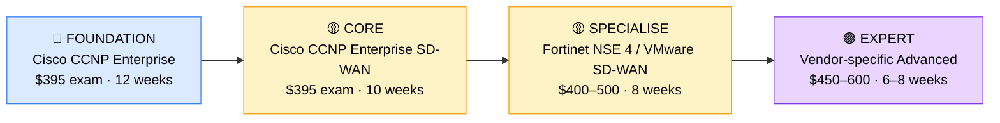

# How to Become an SD-WAN Engineer

**`CP13`** · **Networking** · _Time to hire: 18–24 months_ · _Entry cost: $1,700–$2,400 USD_

> **Path summary:** This path takes you from Network Engineer to a hired SD-WAN Engineer—specialising in software-defined wide-area networking (SD-WAN), a rapidly growing field replacing traditional MPLS/VPN networks. Requires CCNP-level networking knowledge plus vendor-specific SD-WAN certification. High demand, premium salaries.

---

## Role Overview

### What does an SD-WAN Engineer actually do?

An SD-WAN Engineer spends 60% of their time designing and deploying SD-WAN solutions that replace legacy MPLS networks. They work with platforms like Cisco Meraki, Cisco Viptela (SD-WAN), Fortinet, Arista, or Vmware SD-WAN. Unlike traditional network engineers who configure individual routers, SD-WAN engineers design centralized, cloud-first network policies: define which traffic goes where, how to handle failover, and how to optimize performance across internet links. They use graphical management consoles, REST APIs, and intent-based networking principles.

The other 40% is troubleshooting: end-to-end connectivity issues, latency problems, integration with security appliances (firewalls, IPS systems), and migration planning from old MPLS to SD-WAN. They sit at the intersection of networking and cloud—migrating enterprises away from expensive MPLS to cheaper internet-based connectivity while maintaining (or improving) performance and security.

### Demand in 2026

- **Global job postings:** 6,200+ active roles on LinkedIn as of May 2026 [(source)](https://www.linkedin.com/jobs/search/?keywords=SD-WAN%20Engineer)
- **Growth rate:** 18% YoY; SD-WAN adoption accelerating as enterprises move away from MPLS [(source)](https://www.bls.gov/ooh/computer-and-information-technology/network-and-computer-systems-administrators.htm)
- **South Africa:** Strong demand at major banks (ABSA, Nedbank, Standard Bank) undergoing WAN modernisation. Telcos (MTN, Vodacom) deploying SD-WAN for enterprise customers. Consultancies (Dimension Data, BCX) actively hiring.
- **Remote availability:** High (60–70%)—much SD-WAN work is cloud-based and can be done remotely, though migration projects require on-site work.

---

## Who Is This Path For?

### Ideal starting backgrounds

| Background | Readiness | What you already have |
|---|---|---|
| Network Engineer (2+ yrs) | ✅ Strong start | BGP, OSPF, VPN, QoS knowledge carry over directly |
| Senior Network Technician | ✅ Good start | Hands-on networking; needs CCNP knowledge |
| Network Administrator | 🟡 Good with gaps | Operational knowledge; needs deep routing/switching |
| Sysadmin | 🟡 Possible | Infrastructure understanding; needs 6 months networking foundation |
| Recent IT graduate | ❌ Not ready | Needs 1–2 years hands-on networking experience first |
| Developer with Python | 🟡 Good with gaps | Automation skills valuable; needs networking fundamentals |

### You're ready to start this path if you can:

- Explain BGP, OSPF, and when to use each; understand route filtering and convergence
- Configure VLANs, inter-VLAN routing, and basic QoS policies
- Troubleshoot connectivity issues in a multi-site WAN environment
- Understand VPN concepts (IPsec, encryption, tunnel establishment)
- Hold or be working toward Cisco CCNP Enterprise (or equivalent)

> **Not ready yet?** Start with [CCNP Enterprise path](CP08_Networking_CCNP_Enterprise.md) first. SD-WAN builds on deep CCNP knowledge.

---

## Certification Sequence

### Visual path

---

## Certification Path & Timeline

### Stage 1 — Foundation (Months 0–3)

**Goal:** Ensure CCNP-level networking fundamentals if not already certified. SD-WAN requires deep enterprise networking knowledge.

| Cert | Code | Cost (USD) | Study Time | Why it matters |
|---|---|---:|---:|---|
| Cisco CCNP Enterprise Core (if not already held) | `350-401 ENCOR` | $395 | 10–12 weeks | Covers routing, switching, QoS, VPN concepts. Foundation for SD-WAN. |

**Stage 1 note:** Most candidates for SD-WAN roles already hold CCNP. If you don't, complete this first.

**Study approach:** Use INE or CBT Nuggets for enterprise-focused training. Dedicate 12 hours/week for deep understanding of BGP, QoS, and VPN technologies.

---

### Stage 2 — SD-WAN Specialisation (Months 3–8)

**Goal:** Get the anchor SD-WAN certification—demonstrates hands-on SD-WAN expertise.

| Cert | Code | Cost (USD) | Study Time | Why it matters |
|---|---|---:|---:|---|
| Cisco CCNP Enterprise SD-WAN (300-415 ENSDWI) | `300-415` | $395 | 10–12 weeks | Cisco's SD-WAN certification. Covers Cisco Viptela, network design, migration strategies. Hiring managers expect this for SD-WAN roles. |

**Stage 2 total:** $395 USD · R7,110 ZAR · 3 months

**Study approach:** Use Cisco Learning Network and INE's SD-WAN-specific labs. Study Viptela architecture, DPI policies, and centralized management. Complete 100+ practice questions. Schedule when scoring 85%+.

**Lab requirement:** Set up a Cisco Viptela lab in GNS3 or a cloud sandbox (Cisco dCloud is free). Configure a multi-site SD-WAN fabric with failover, QoS policies, and security policies. 40+ hours hands-on minimum.

---

### Stage 3 — Vendor Specialisation (Months 8–14)

**Goal:** Master one additional SD-WAN platform beyond Cisco—differentiator in job market.

| Cert | Code | Cost (USD) | Study Time | Why it matters |
|---|---|---:|---:|---|
| VMware SD-WAN Specialist (VCP-NV or similar) | `VCP-NV` | $450 | 10 weeks | VMware SD-WAN (formerly VeloCloud) is used by 30% of enterprises. Growing demand. |
| OR Fortinet NSE 4 | `NSE4` | $400 | 8 weeks | Fortinet SD-WAN is integrated with FortiGate firewalls; strong in security-first environments. |

**Stage 3 total:** $400–450 USD · R7,200–8,100 ZAR · 6 weeks

**Study approach:** Use official vendor training materials and labs. VMware and Fortinet both offer free trial environments. Complete 50+ hands-on labs building multi-site topologies, security policies, and failover scenarios.

**Project milestone:** Design a complete SD-WAN migration strategy for a hypothetical enterprise with 50 branch offices. Include: current MPLS costs, proposed SD-WAN topology, security policy design, implementation timeline, and ROI calculation. Present it professionally with diagrams and documentation.

---

### Stage 4 — Advanced / Cloud Integration (Months 14–20, Optional)

**Goal:** Add cloud integration and automation expertise.

| Cert | Code | Cost (USD) | Study Time | Why it matters |
|---|---|---:|---:|---|
| Cisco DevNet Associate (optional, for API/automation) | `200-901` | $330 | 8 weeks | API-driven SD-WAN orchestration. Increasingly required. |
| OR AWS Networking Specialty (optional) | `AWS-NS` | $300 | 6 weeks | Integration of SD-WAN with AWS cloud services. Valuable for modern deployments. |

> **Optional at hire time:** Most people land SD-WAN Engineer roles after Stage 2 (CCNP + CCNP SD-WAN) and complete Stage 3 vendor certs while employed.

---

## Timeline & Cost Summary

| Stage | Certs | Duration | Cost (USD) | Cost (ZAR) |
|---|---|---|---:|---:|
| Stage 1 — Foundation | CCNP Enterprise | Months 0–3 | $395 | R7,110 |
| Stage 2 — SD-WAN Core | CCNP SD-WAN | Months 3–8 | $395 | R7,110 |
| Stage 3 — Vendor Spec | VMware/Fortinet | Months 8–14 | $400–450 | R7,200–8,100 |
| **Total to hireable** | | **18–20 months** | **$1,190–1,240** | **R21,420–22,320** |
| Optional Stage 4 | DevNet / AWS | Months 14–20 | $300–330 | R5,400–5,940 |

**Study hours required:** 400–500 hours total. Assumes 15–20 hours/week over 18–24 months.

---

## Salary Progression

> All figures: median base salary, not including bonuses/equity. ZAR = USD × 18 baseline (verified May 2026). Sources: Robert Half 2026, Glassdoor, PayScale, LinkedIn Salary.

| Experience Level | USD/year | ZAR/year | GBP/year | EUR/year | AUD/year |
|---|---:|---:|---:|---:|---:|
| Entry / Junior (0–2 yrs) | $80,000 | R1,440,000 | £64,000 | €75,000 | A$129,000 |
| Mid-level (2–5 yrs) | $100,000 | R1,800,000 | £80,000 | €94,000 | A$162,000 |
| Senior (5–8 yrs) | $110,000 | R1,980,000 | £88,000 | €103,000 | A$178,000 |
| Lead / Architect (8+ yrs) | $135,000 | R2,430,000 | £108,000 | €127,000 | A$219,000 |

**South Africa note:** SD-WAN Engineers at Johannesburg-based banks earn R51,000–R70,000/month (entry), scaling to R75,000–R95,000/month for mid-level. Telcos pay similarly. Remote positions for international clients push salaries to R65,000–R90,000/month for mid-level roles. Consultancies (Dimension Data, BCX) typically pay 10–15% below, but offer excellent project variety and learning.

**Salary accelerators:** CCNP + SD-WAN cert adds 20–30% premium over CCNP-only roles. VMware or Fortinet certifications add another 5–10%. DevNet/automation skills add 10% premium.

---

## First Job Strategy

### Month 0–6: Get CCNP & Start SD-WAN Specialist

1. **Complete CCNP Enterprise** (or refresh if already held) — 12 hours/week. Critical foundation.
2. **Build an SD-WAN home lab** — Use Cisco dCloud (free) or GNS3. Design a multi-site topology and document it. Time: 30 hours.
3. **Join the community** — Cisco Learning Network, r/ccnp, SD-WAN-focused Discord servers. Post your lab work; get feedback.
4. **Study SD-WAN trends** — Read Cisco, Fortinet, and VMware SD-WAN case studies. Understand why enterprises are adopting it (cost, performance, cloud integration).

### Month 6–12: Pass SD-WAN Cert & Build Migration Project

1. **Pass CCNP SD-WAN** — 15 hours/week. Use official Cisco materials and hands-on labs extensively.
2. **Build a capstone migration project** — Design a real SD-WAN migration for a 100-office enterprise. Include business case, technical topology, security policies, phased rollout, and cost analysis. 40–50 hours.
3. **Document on GitHub** — Create a public repo with your SD-WAN lab configurations, network diagrams, and deployment guides. Show you can teach others.
4. **Network with architects** — Connect with Cisco SD-WAN specialists and architects on LinkedIn. Engage with their posts. Ask to chat about their implementations.

### Month 12–18: Add Vendor Cert & Prepare for Interviews

1. **Earn a second vendor cert** — VMware or Fortinet SD-WAN. This differentiates you. 10 hours/week for 6–8 weeks.
2. **Target SD-WAN roles** — Apply to enterprises in midst of WAN transformation. Banks, telcos, and large consultancies have active SD-WAN projects.
3. **Interview prep** — Be ready to discuss: 1) SD-WAN vs. MPLS trade-offs, 2) a migration strategy you've designed, 3) security policies in SD-WAN, 4) integration with cloud (AWS/Azure).
4. **Negotiate compensation** — SD-WAN is a high-demand specialisation. Expect $80K–$110K for entry-level (with 2+ years network experience). Don't accept $70K offers.

---

## A Day in the Life

### SD-WAN Engineer at a Large Bank — Entry Level

**08:00** — Review overnight alerts. One branch's SD-WAN edge device failed over to secondary internet link. Confirm failover worked and that the site has acceptable performance on backup. Note for post-incident review.

**09:00** — SD-WAN design meeting. Presenting migration strategy for 30 branch offices from MPLS to SD-WAN. Walk through topology, security policy integration, and 3-month rollout plan. Cost savings: $500K/year.

**10:30** — Hands-on configuration. Deploy a new security policy to the SD-WAN fabric via the controller. Test with real traffic—ensure banking applications (Swift, clearing systems) route correctly and prioritise properly.

**12:00** — Lunch

**13:00** — Troubleshooting. One office reports poor VoIP quality since their SD-WAN migration. Analyze DPI logs to check if VoIP traffic is being prioritised. Discover conflict with firewall policy; collaborate with security team to fix.

**14:30** — Documentation. Update the SD-WAN runbook with new policies and add troubleshooting procedures for the team. This document is used by NOC staff.

**15:30** — Capacity planning. Review bandwidth usage across the WAN. Forecast growth and recommend edge device upgrades for 2 sites that are approaching capacity limits.

**16:30** — End of day. Update project tracking for the ongoing SD-WAN rollout. Status: 15 sites migrated, 15 remaining.

### SD-WAN Engineer at a Consultancy (Dimension Data, BCX) — Mid Level

**09:00** — Client kickoff. New customer has 200 office locations using MPLS. You're leading the SD-WAN transformation. Present the strategy, timeline, and costs. This is a $5M+ deal.

**10:30** — Technical design session. Work with the customer's network team to understand their applications, security requirements, and cloud usage. Begin designing the SD-WAN topology.

**12:00** — Lunch

**13:00** — Pilot project prep. Set up lab environment for a pilot deployment at 3 customer locations. Build edge device configurations, upload to the SD-WAN controller, prepare for customer testing.

**14:30** — Troubleshooting previous customer. Another customer's SD-WAN migration is having issues; a third-party SaaS app (Salesforce) is routing poorly. Investigate QoS policies and application-aware routing. Adjust policies to fix.

**15:30** — Knowledge transfer. Prepare training materials for the customer's IT team. Write deployment guides and operational procedures. They'll manage the network once you hand off.

**16:30** — End of day. Update project documentation. Next week: deploy pilot and gather performance metrics.

---

## Related Paths & Progressions

| From here you can move to… | Why |
|---|---|
| [Network Architect](CP11_Networking_Network_Architect.md) | SD-WAN expertise + 5+ years experience often leads to architect roles. |
| [Cloud Network Engineer](CP17_Cloud_Cloud_Engineer.md) | SD-WAN connects to cloud; broaden into full cloud networking. |
| [Network Security Engineer](CP60_Security_Network_Security_Engineer.md) | SD-WAN security policies expertise (DPI, threat prevention) leads to security roles. |
| [Network Automation Engineer](CP16_Networking_Network_Automation_Engineer.md) | SD-WAN REST APIs and orchestration lead to automation-focused roles. |

---

## South Africa Context

### Market specifics

SD-WAN adoption in South Africa is accelerating, driven by major bank transformations (ABSA, Nedbank, Standard Bank) and telco customer demands (MTN, Vodacom moving customers off MPLS). Large consultancies (Dimension Data, BCX, EOH) have dedicated SD-WAN teams and are actively hiring. Remote work availability is high—many SD-WAN design and deployment projects are managed remotely with occasional on-site installation work.

BEE/EE hiring considerations apply strongly. Large South African enterprises have preferential hiring for previously disadvantaged individuals, and credentials (CCNP + SD-WAN certs) help level the field.

### SA-specific resources

| Resource | URL | Note |
|---|---|---|
| Cisco Learning Network | [https://learningnetwork.cisco.com/](https://learningnetwork.cisco.com/) | Official Cisco community; active SA members. |
| Dimension Data Careers | [https://www.dimensiondata.com/careers](https://www.dimensiondata.com/careers) | Major SD-WAN employer in SA. |
| MTN Enterprise Solutions | [https://www.mtn.co.za/business](https://www.mtn.co.za/business) | Offers SD-WAN services; hiring engineers. |
| BCX (Business Connexion) | [https://www.bcx.co.za/](https://www.bcx.co.za/) | Major SA consultancy; SD-WAN team. |
| r/ccnp (Reddit) | [https://www.reddit.com/r/ccnp/](https://www.reddit.com/r/ccnp/) | Active global community; many SA members. |

---

## Frequently Asked Questions

**Q: Do I need CCNP before pursuing SD-WAN?**
Practically speaking, yes. SD-WAN builds on deep routing, switching, QoS, and VPN knowledge. Without CCNP-level understanding, you'll struggle with SD-WAN design and troubleshooting. Most job listings require CCNP or equivalent (3+ years network engineering).

**Q: How long does it take to become hireable as an SD-WAN Engineer?**
If you start as a Network Engineer with CCNP: 18–24 months. CCNP SD-WAN alone takes 3–4 months of study. Add 6 months for a second vendor cert and portfolio projects. If starting from Help Desk: 3–4 years (CCNA + CCNP + SD-WAN + experience).

**Q: Which vendor should I specialise in—Cisco, VMware, or Fortinet?**
Cisco dominates the market (~40% of SD-WAN deployments); start there. VMware (VeloCloud) is second (~25%); valuable if targeting cloud-native enterprises. Fortinet is strong in security-first environments (~15%). Learn Cisco first, then add one other.

**Q: Can I do this while working full-time?**
Yes. At 15–20 hours/week, CCNP takes 3 months, SD-WAN cert takes 3 months. Most people do this while working as Network Engineers or senior technicians, which actually accelerates learning by giving you real SD-WAN experience on customer networks.

**Q: Is SD-WAN going to replace traditional routing/switching jobs?**
Partially. SD-WAN is becoming the default for WAN connectivity; traditional MPLS is declining. However, enterprises still need traditional network engineers for LAN, campus networks, and data centre work. SD-WAN is a specialisation, not a replacement—it's a premium specialisation with higher salaries.

---

## Sources & Further Reading

| # | Source | URL | Used for |
|---|---|---|---|
| 1 | LinkedIn Job Search | [https://www.linkedin.com/jobs/search/?keywords=SD-WAN%20Engineer](https://www.linkedin.com/jobs/search/?keywords=SD-WAN%20Engineer) | Job postings and demand |
| 2 | Robert Half Salary Guide 2026 | [https://www.roberthalf.com/salary-guide/network-engineer](https://www.roberthalf.com/salary-guide/network-engineer) | Salary data |
| 3 | Cisco CCNP Enterprise | [https://www.cisco.com/c/en/us/training-events/training-certifications/certifications/enterprise.html](https://www.cisco.com/c/en/us/training-events/training-certifications/certifications/enterprise.html) | Exam details |
| 4 | Cisco Viptela Documentation | [https://www.cisco.com/c/en/us/support/sd-wan/index.html](https://www.cisco.com/c/en/us/support/sd-wan/index.html) | Technical reference |
| 5 | LinkedIn Salary Insights | [https://www.linkedin.com/salary/sdwan-engineer-salary/](https://www.linkedin.com/salary/sdwan-engineer-salary/) | Crowdsourced salary data |
| 6 | BLS Network Administrators | [https://www.bls.gov/ooh/computer-and-information-technology/network-and-computer-systems-administrators.htm](https://www.bls.gov/ooh/computer-and-information-technology/network-and-computer-systems-administrators.htm) | Growth projections |
| 7 | VMware SD-WAN Training | [https://www.vmware.com/products/sd-wan.html](https://www.vmware.com/products/sd-wan.html) | VMware certification path |
| 8 | Fortinet FortiGate Training | [https://www.fortinet.com/training](https://www.fortinet.com/training) | Fortinet certification path |

---

*Template version: 2026-05-02 | Maintained by IT Career Roadmap | ZAR baseline: R18/$1 USD*
*File naming: `Career_Paths/CP13_Networking_SDWAN_Engineer.md`*
