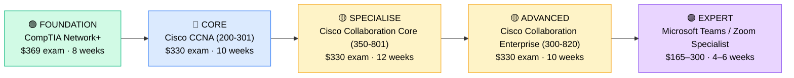

# How to Become a VoIP / Unified Communications Engineer

**`CP14`** · **Networking** · _Time to hire: 12–18 months_ · _Entry cost: $1,300–$1,950 USD_

> **Path summary:** This path takes you from Network Administrator to a hired VoIP / Unified Communications Engineer—designing, deploying, and maintaining voice systems, video conferencing platforms, and collaboration infrastructure. Growing demand as enterprises consolidate legacy PBX systems and adopt Microsoft Teams, Zoom, and cloud-based UC platforms.

---

## Role Overview

### What does a VoIP / Unified Communications Engineer actually do?

A VoIP/UC Engineer spends 50% of their time designing voice networks and collaboration infrastructure: IP PBX systems, call routing, quality of service (QoS) for voice traffic, and integration with Microsoft Teams, Cisco Webex, or Zoom. They work with VoIP equipment vendors (Cisco Unified Communications, Avaya, Mitel, or cloud platforms like Teams Direct Routing) and ensure voice quality, failover, and disaster recovery.

The other 50% is hands-on: provisioning phone numbers, configuring dial plans, troubleshooting call quality issues (jitter, latency, packet loss), integrating voicemail systems, and managing SIP trunks (connection to external phone carriers). They're part network engineer, part telephony specialist—they need to understand both IP networks and legacy phone system concepts.

### Demand in 2026

- **Global job postings:** 5,800+ active roles on LinkedIn as of May 2026 [(source)](https://www.linkedin.com/jobs/search/?keywords=VoIP%20Engineer)
- **Growth rate:** 6% YoY; cloud-based UC platforms driving migration away from on-premise systems [(source)](https://www.bls.gov/ooh/computer-and-information-technology/network-and-computer-systems-administrators.htm)
- **South Africa:** Growing demand at large enterprises, call centres, and financial institutions. Banks (Nedbank, Standard Bank, ABSA) are consolidating legacy PBX systems. Telcos (MTN, Vodacom) and BPOs (call centres) actively hiring.
- **Remote availability:** Medium (40–50%)—design and management can be remote; hardware installation and on-site troubleshooting require presence.

---

## Who Is This Path For?

### Ideal starting backgrounds

| Background | Readiness | What you already have |
|---|---|---|
| Network Administrator | ✅ Strong start | Network fundamentals, QoS concepts, VLAN knowledge |
| Network Technician | ✅ Good start | Troubleshooting experience, hardware skills |
| IT Support / Help Desk | 🟡 Good with gaps | User-facing experience; needs deep network knowledge |
| Sysadmin | 🟡 Good with gaps | Infrastructure understanding; needs network-specific training |
| Telephony Technician (legacy PBX) | ✅ Good start | Phone system knowledge; needs IP networking education |
| Recent IT graduate | 🟡 Good with gaps | Theory solid; needs hands-on labs |

### You're ready to start this path if you can:

- Explain VLAN tagging, QoS policies, and why voice traffic needs priority
- Understand basic routing and switching concepts
- Troubleshoot network connectivity issues (ping, tracert, DNS)
- Hold CompTIA Network+ or CCNA (or work toward one)
- Explain what VoIP, SIP, and RTP are and why they matter

> **Not ready yet?** Start with [CompTIA Network+ path](CP01_Foundation_Network_Plus.md) to build networking fundamentals first.

---

## Certification Sequence

### Visual path

---

## Certification Path & Timeline

### Stage 1 — Foundation (Months 0–2)

**Goal:** Establish baseline networking knowledge required for VoIP/UC roles.

| Cert | Code | Cost (USD) | Study Time | Why it matters |
|---|---|---:|---:|---|
| CompTIA Network+ | `N10-008` | $369 | 6–8 weeks | Covers TCP/IP, QoS, routing, and networking fundamentals that VoIP depends on. Industry-standard baseline. |

**Stage 1 total:** $369 USD · R6,642 ZAR · 2 months

**Study approach:** Use Professor Messer's free YouTube videos + Udemy practice exams (Jason Dion). Focus heavily on QoS, VLAN, and network troubleshooting topics. Schedule exam when scoring 80%+ on practice tests.

**Lab requirement:** Build a home lab with VirtualBox, configure VLANs and QoS, and test traffic prioritisation. 15 hours minimum.

---

### Stage 2 — Core Networking (Months 2–5)

**Goal:** Get CCNA—required by most VoIP/UC employers before specialisation.

| Cert | Code | Cost (USD) | Study Time | Why it matters |
|---|---|---:|---:|---|
| Cisco Certified Network Associate (CCNA) | `200-301` | $330 | 10–12 weeks | Covers switching, routing, VLANs, IP addressing. Essential foundation for UC engineering. |

**Stage 2 total:** $330 USD · R5,940 ZAR · 3 months

**Study approach:** Use INE or CBT Nuggets for comprehensive training. Pair with Cisco Learning Network practice exams. Focus on QoS, VLAN trunking, and inter-VLAN routing—directly relevant to VoIP.

**Project milestone:** Design a network with multiple VLANs (voice, data, video) with appropriate QoS policies. Document the design with diagrams and configuration examples.

---

### Stage 3 — VoIP / Collaboration Specialisation (Months 5–11)

**Goal:** Get Cisco Collaboration certifications—the industry standard for UC engineers.

| Cert | Code | Cost (USD) | Study Time | Why it matters |
|---|---|---:|---:|---|
| Cisco Certified Associate Collaboration Core (350-801 CLCORE) | `350-801` | $330 | 12–14 weeks | Covers Cisco Unified Communications, call routing, dial plans, QoS for voice. Core UC credential. |
| Cisco Certified Associate Collaboration Enterprise (300-820 CLCEI) | `300-820` | $330 | 10–12 weeks | Advanced UC topics: integration with enterprise systems, conferencing, contact centres. |

**Stage 3 total:** $660 USD · R11,880 ZAR · 6 months

**Study approach:** Use Cisco Learning Network, INE, and official Cisco training. These are UC-specific; study deep VoIP concepts, dial plan design, and integration patterns. Complete 100+ practice questions per cert.

**Lab requirement:** Deploy Cisco Unified Communications Manager in a lab environment (or use Cisco dCloud). Configure users, phone lines, call routing, and voicemail. Test failover and disaster recovery. 50+ hours minimum.

---

### Stage 4 — Cloud UC Platforms (Months 11–16, Optional)

**Goal:** Add expertise in modern cloud UC platforms—increasingly required.

| Cert | Code | Cost (USD) | Study Time | Why it matters |
|---|---|---:|---:|---|
| Microsoft Teams Voice (MS-721) | `MS-721` | $165 | 6–8 weeks | Microsoft Teams Direct Routing and cloud PBX. Growing demand as enterprises migrate to Teams. |
| OR Zoom Certified Associate (ZCCA) | `ZCCA` | $300 | 4–6 weeks | Zoom Phone and collaboration. Strong in startups and modern enterprises. |

**Stage 4 total:** $165–300 USD · R2,970–5,400 ZAR · 6–8 weeks

> **Optional at hire time:** Many VoIP/UC engineers land jobs after Stage 2–3 (CCNA + Cisco Collaboration certs) and learn cloud platforms (Teams, Zoom) on the job.

---

## Timeline & Cost Summary

| Stage | Certs | Duration | Cost (USD) | Cost (ZAR) |
|---|---|---|---:|---:|
| Stage 1 — Foundation | Network+ | Months 0–2 | $369 | R6,642 |
| Stage 2 — Core | CCNA | Months 2–5 | $330 | R5,940 |
| Stage 3 — Specialisation | CLCORE + CLCEI | Months 5–11 | $660 | R11,880 |
| **Total to hireable** | | **12–14 months** | **$1,359** | **R24,462** |
| Optional Stage 4 | Teams/Zoom | Months 11–16 | $165–300 | R2,970–5,400 |

**Study hours required:** 400–500 hours total. Assumes 12–15 hours/week over 12–14 months.

---

## Salary Progression

> All figures: median base salary, not including bonuses/equity. ZAR = USD × 18 baseline (verified May 2026). Sources: Robert Half 2026, Glassdoor, PayScale, LinkedIn Salary.

| Experience Level | USD/year | ZAR/year | GBP/year | EUR/year | AUD/year |
|---|---:|---:|---:|---:|---:|
| Entry / Junior (0–2 yrs) | $65,000 | R1,170,000 | £52,000 | £61,000 | A$105,000 |
| Mid-level (2–5 yrs) | $82,000 | R1,476,000 | £66,000 | €77,000 | A$133,000 |
| Senior (5–8 yrs) | $95,000 | R1,710,000 | £76,000 | €89,000 | A$154,000 |
| Lead / Architect (8+ yrs) | $115,000 | R2,070,000 | £92,000 | €108,000 | A$186,000 |

**South Africa note:** VoIP/UC Engineers at Johannesburg banks and large enterprises earn R42,000–R58,000/month (entry), scaling to R65,000–R85,000/month for mid-level roles. Call centres and BPOs (Business Process Outsourcing firms) pay similarly. Remote positions for international clients can reach R50,000–R70,000/month.

**Salary accelerators:** Cisco Collaboration certs add 15% premium. Cloud certifications (Teams, Zoom) add 10%. Contact centre (CCaaS) expertise adds 10–15%.

---

## First Job Strategy

### Month 0–3: Build Foundation

1. **Set up lab environment** — Use GNS3 or Cisco dCloud (free). Cost: $0.
2. **Study Network+** — 10 hours/week. Schedule exam for week 6–8.
3. **Join community** — r/ccna, Cisco Learning Network, UC-focused Discord/LinkedIn groups.
4. **Document learning** — Create GitHub repo with lab notes, network diagrams, and configuration examples.

### Month 3–6: Build Core Knowledge

1. **Study CCNA** — 12 hours/week. Focus on QoS, VLAN, and routing.
2. **Build project** — Design a VoIP network with multiple VLAN priorities, dial plan, and failover strategy. Document with diagrams and explanations.
3. **Network actively** — Connect with Cisco Collaboration engineers on LinkedIn. Engage with their posts.
4. **Stay current** — Read about Teams Direct Routing, Zoom Phone, and modern UC trends.

### Month 6–12: Specialise & Apply

1. **Study Cisco Collaboration** — Start with CLCORE (12–14 hours/week). Complete within 8 weeks. Then CLCEI.
2. **Hands-on labs** — Deploy Cisco Unified Communications Manager. Test call routing, failover, and integration with Teams or other platforms.
3. **Interview prep** — Be ready to discuss: 1) VoIP architecture and QoS, 2) dial plan design, 3) a UC project you've designed, 4) cloud UC platforms, 5) troubleshooting call quality issues.
4. **Apply to roles** — Target enterprises with legacy PBX systems or call centres. These have immediate UC modernisation needs.

---

## A Day in the Life

### VoIP / UC Engineer at a Large Enterprise — Entry Level

**08:00** — Review overnight tickets. One floor's phone system is having issues; users can't make outbound calls. Check the SIP trunk status and gateway logs—trunk is down. Escalate to carrier and monitor recovery.

**09:00** — Configuration session. Provisioning 50 new users on the Cisco Unified Communications system. Import user list, assign phone numbers, set up voicemail, and apply dial plan rules.

**10:30** — QoS audit. Review network performance on a branch office where users reported voice quality issues. Discover VoIP traffic isn't being prioritised correctly. Update QoS policies to ensure voice packets are marked as "EF" (Expedited Forwarding).

**12:00** — Lunch

**13:00** — Troubleshooting call. A conference room's Cisco Webex system is having issues—video lags, audio drops. Check network utilisation, bandwidth allocation, and device logs. Restart the Webex system and confirm performance.

**14:30** — Planning session. The company is evaluating Microsoft Teams Direct Routing as a cloud-PBX replacement for their on-premises Cisco Unified Communications system. You're researching costs, feature parity, and migration strategy.

**15:30** — Documentation. Update the dial plan runbook and add new users/phone numbers. This document is used by the help desk.

**16:30** — End of day. Review upcoming projects: Teams migration planning starts next month.

### VoIP / UC Engineer at a Call Centre (BPO) — Mid Level

**09:00** — Agent provisioning. New batch of 100 call centre agents hired. Provision phone numbers, set up call queues, and assign agents to campaigns via the contact centre system.

**10:30** — Upgrade project. Planning migration from Avaya phone system to Zoom Phone. Design new architecture, calculate costs, plan phased rollout across 3 contact centres.

**12:00** — Lunch

**13:00** — Performance monitoring. Review call quality metrics: average handle time, call transfer rates, dropped calls. Identify a queue with high abandoned calls; collaborate with operations to understand root cause (understaffing? routing issues?).

**14:30** — Integration work. Integrate Zoom Phone with the customer relationship management (CRM) system so agents see customer details when calls arrive (screen pop). Configure CTI (Computer Telephony Integration) settings.

**15:30** — Training. Conduct a brief training session with new QA staff on monitoring call quality and troubleshooting basic issues.

**16:30** — End of day. Update project status on Teams migration. Next week: pilot testing with 50 agents.

---

## Related Paths & Progressions

| From here you can move to… | Why |
|---|---|
| [Network Engineer (Routing & Switching)](CP10_Networking_Network_Engineer.md) | VoIP expertise + network skills lead to broader network engineering roles. |
| [Network Architect](CP11_Networking_Network_Architect.md) | UC architecture (designing large-scale systems) is a natural progression. |
| [Cloud Engineer](CP17_Cloud_Cloud_Engineer.md) | Teams/Zoom expertise opens doors to cloud engineering roles. |
| [Contact Centre Operations Manager](CP91_IT_Management_Operations_Manager.md) | VoIP/UC expertise often leads to managing call centre operations. |

---

## South Africa Context

### Market specifics

VoIP/UC Engineers are in steady demand across South Africa's financial institutions, call centres, and enterprise sector. Banks (Nedbank, Standard Bank, ABSA) are consolidating legacy PBX systems and adopting Teams or other cloud UC. Large BPOs (Business Process Outsourcing firms) and call centres depend heavily on VoIP infrastructure. Telcos (MTN, Vodacom) employ UC engineers to support enterprise customers.

Remote work is moderate—much design and configuration can be remote, but hardware installation and on-site troubleshooting may require presence. Consultancies (Dimension Data, BCX) hire UC specialists to support customers across sub-Saharan Africa.

### SA-specific resources

| Resource | URL | Note |
|---|---|---|
| Cisco Learning Network | [https://learningnetwork.cisco.com/](https://learningnetwork.cisco.com/) | Official community; active SA members. |
| Microsoft Learn (Teams Voice) | [https://learn.microsoft.com/en-us/training/](https://learn.microsoft.com/en-us/training/) | Free Teams and Voice training. |
| Dimension Data Careers | [https://www.dimensiondata.com/careers](https://www.dimensiondata.com/careers) | Major employer; UC roles available. |
| r/ccna (Reddit) | [https://www.reddit.com/r/ccna/](https://www.reddit.com/r/ccna/) | Active global community. |
| LinkedIn UC Engineering Groups | [https://www.linkedin.com/](https://www.linkedin.com/) | Search "UC Engineer South Africa." |

---

## Frequently Asked Questions

**Q: Do I need CCNA before starting UC training?**
Practically speaking, yes. UC engineering requires deep understanding of VLANs, QoS, and routing. Most employers require CCNA (or equivalent networking experience) before hiring UC engineers. Don't skip it.

**Q: How long does it take to become hireable as a VoIP/UC Engineer?**
If you have some networking background (Help Desk, Admin): 12–18 months. Network+ (2 months) + CCNA (3 months) + Collaboration certs (6 months) + portfolio projects (2 months) = 12–15 months. If starting from zero IT experience: 2–3 years.

**Q: Should I focus on Cisco, Teams, or Zoom?**
Start with Cisco Collaboration (industry standard). Then add Teams or Zoom depending on market demand in your region. In South Africa, Teams is growing rapidly (Microsoft partner relationships); Zoom is strong globally. Learn Cisco first; it gives you the foundational knowledge platforms depend on.

**Q: Is this a good career path in South Africa?**
Yes. Demand is steady, salaries are competitive, and there's a clear progression from entry-level to architect. Enterprises are moving away from legacy PBX, creating ongoing hiring demand.

**Q: What's the difference between VoIP Engineer and UC Engineer?**
VoIP = voice-only systems (traditional PBX, SIP trunks). UC = unified communications (voice + video + messaging + presence). Modern roles cover both; the certification is called "Collaboration," which encompasses UC. Terms are used interchangeably in most job postings.

---

## Sources & Further Reading

| # | Source | URL | Used for |
|---|---|---|---|
| 1 | LinkedIn Job Search | [https://www.linkedin.com/jobs/search/?keywords=VoIP%20Engineer](https://www.linkedin.com/jobs/search/?keywords=VoIP%20Engineer) | Job postings and demand |
| 2 | Robert Half Salary Guide 2026 | [https://www.roberthalf.com/salary-guide/network-engineer](https://www.roberthalf.com/salary-guide/network-engineer) | Salary data |
| 3 | Cisco Learning Network | [https://learningnetwork.cisco.com/](https://learningnetwork.cisco.com/) | Official training and community |
| 4 | Cisco Collaboration Certifications | [https://www.cisco.com/c/en/us/training-events/training-certifications/certifications/associate.html](https://www.cisco.com/c/en/us/training-events/training-certifications/certifications/associate.html) | CLCORE and CLCEI exam details |
| 5 | LinkedIn Salary Insights | [https://www.linkedin.com/salary/voip-engineer-salary/](https://www.linkedin.com/salary/voip-engineer-salary/) | Crowdsourced salary data |
| 6 | BLS Network Administrators | [https://www.bls.gov/ooh/computer-and-information-technology/network-and-computer-systems-administrators.htm](https://www.bls.gov/ooh/computer-and-information-technology/network-and-computer-systems-administrators.htm) | Growth projections |
| 7 | Microsoft Teams Voice Training | [https://learn.microsoft.com/en-us/training/](https://learn.microsoft.com/en-us/training/) | Free Teams Voice resources |
| 8 | Zoom Certification | [https://zoom.us/certification](https://zoom.us/certification) | Zoom certification path |

---

*Template version: 2026-05-02 | Maintained by IT Career Roadmap | ZAR baseline: R18/$1 USD*
*File naming: `Career_Paths/CP14_Networking_VoIP_UC_Engineer.md`*
