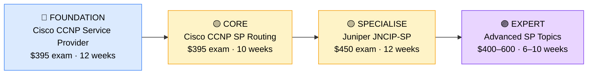

# How to Become a Service Provider Engineer (Telco/ISP)

**`CP15`** · **Networking** · _Time to hire: 18–24 months_ · _Entry cost: $1,600–$2,300 USD_

> **Path summary:** This path takes you from Network Engineer to a hired Service Provider Engineer—specialising in telecommunications, Internet Service Provider (ISP), or Mobile Carrier infrastructure. You'll design and maintain the core networks that power global connectivity. High demand, premium salaries, technical depth required.

---

## Role Overview

### What does a Service Provider Engineer actually do?

A Service Provider Engineer (SP Engineer) spends 60% of their time designing carrier-grade network infrastructure: BGP routing at massive scale, MPLS traffic engineering, carrier Ethernet, and mobile backhaul networks. They work with equipment from vendors like Cisco (ASR routers), Juniper (MX routers), Nokia, and Arista. They design networks that must handle millions of simultaneous connections with 99.999% (five-nines) uptime.

The other 40% is operational: troubleshooting routing convergence issues, capacity planning for peak traffic (e.g., Black Friday traffic spikes), managing peering relationships with other carriers, and optimising Quality of Service (QoS) across the backbone. They work on multi-year projects: building new data centre interconnects, upgrading backbone routers, or migrating from traditional MPLS to segment routing (SR).

### Demand in 2026

- **Global job postings:** 4,500+ active roles on LinkedIn as of May 2026 [(source)](https://www.linkedin.com/jobs/search/?keywords=Service%20Provider%20Engineer)
- **Growth rate:** 4% YoY; stable demand in telcos and ISPs; growing in cloud interconnect (AWS Direct Connect, Azure ExpressRoute) [(source)](https://www.bls.gov/ooh/computer-and-information-technology/network-and-computer-systems-administrators.htm)
- **South Africa:** Strong demand at MTN, Vodacom, SEACOM (undersea cable), and ISPs (Axxess, Afrihost). Large telcos are modernising backbones and hiring SP engineers. Remote work available for global carrier roles.
- **Remote availability:** High (55–65%)—backbone engineering is largely remote; some on-site network operations centre (NOC) work required.

---

## Who Is This Path For?

### Ideal starting backgrounds

| Background | Readiness | What you already have |
|---|---|---|
| Network Engineer (3+ yrs) | ✅ Strong start | BGP, QoS, large-scale networking experience |
| ISP / Carrier technician | ✅ Strong start | Carrier-specific knowledge; needs CCNP depth |
| Senior Network Administrator | 🟡 Good with gaps | Operational knowledge; needs deep routing/switching |
| Sysadmin | 🟡 Possible | Infrastructure understanding; needs SP-specific training |
| Recent IT graduate | ❌ Not ready | Needs 2–3 years hands-on network engineering |

### You're ready to start this path if you can:

- Explain BGP, OSPF, and MPLS concepts and when to use each at scale
- Configure and troubleshoot large-scale routing topologies
- Understand carrier Ethernet and multi-protocol label switching
- Have 2–3 years of enterprise or carrier network experience
- Hold or be working toward CCNP Enterprise or Service Provider

> **Not ready yet?** Start with [CCNP Enterprise or CCNP Service Provider path](CP08_Networking_CCNP_Enterprise.md) first. Gain 2–3 years of hands-on experience before specialising in SP roles.

---

## Certification Sequence

### Visual path

---

## Certification Path & Timeline

### Stage 1 — Foundation (Months 0–3)

**Goal:** Establish CCNP Service Provider foundation if not already certified.

| Cert | Code | Cost (USD) | Study Time | Why it matters |
|---|---|---:|---:|---|
| Cisco CCNP Service Provider Core (350-501 SPCOR) | `350-501` | $395 | 12–14 weeks | Covers carrier-grade routing, QoS, and network design. Foundation for SP roles. |

**Study approach:** Use INE or CBT Nuggets for SP-focused training. Study BGP at scale, MPLS, and carrier Ethernet. Dedicate 12 hours/week. Complete 100+ practice questions.

**Lab requirement:** Build a multi-autonomous system (AS) lab in GNS3 simulating a carrier network. Configure BGP peering, MPLS traffic engineering, and QoS across multiple links. 50+ hours minimum.

---

### Stage 2 — SP Specialisation (Months 3–8)

**Goal:** Deepen SP expertise with routing-focused certification.

| Cert | Code | Cost (USD) | Study Time | Why it matters |
|---|---|---:|---:|---|
| Cisco CCNP Service Provider Routing (300-510 SPRI) | `300-510` | $395 | 10–12 weeks | Advanced routing, BGP optimisation, and ISP-specific configurations. |

**Stage 2 total:** $395 USD · R7,110 ZAR · 3 months

**Study approach:** Use official Cisco materials and hands-on labs (Cisco dCloud). Focus on BGP convergence, route filtering, and carrier-grade design patterns. This cert is SP-specific and highly technical.

**Lab requirement:** Deploy a realistic carrier backbone topology: multiple carriers peering via BGP, MPLS cores, and customer separation via VRFs. Test failover and convergence. 40+ hours minimum.

---

### Stage 3 — Vendor Diversification (Months 8–14)

**Goal:** Master Juniper SP routing—Juniper is equally strong in carrier environments.

| Cert | Code | Cost (USD) | Study Time | Why it matters |
|---|---|---:|---:|---|
| Juniper Certified Network Associate Service Provider (JNCIP-SP) | `JNCIP-SP` | $450 | 12–14 weeks | Juniper routing, MPLS, carrier Ethernet. Juniper dominates in carrier/ISP markets alongside Cisco. |

**Stage 3 total:** $450 USD · R8,100 ZAR · 6 weeks

**Study approach:** Use official Juniper Learning Services and hands-on labs. Juniper CLI is different from Cisco; expect a learning curve. Complete 80+ practice questions and build real lab topologies.

**Project milestone:** Design a complete ISP backbone network: multiple points of presence (PoPs), carrier peering, customer VRF segregation, and disaster recovery. Document with network diagrams, configuration snippets, and design rationale.

---

### Stage 4 — Advanced / Segment Routing (Months 14–20, Optional)

**Goal:** Add modern SP topics: Segment Routing, intent-based networking.

| Cert | Code | Cost (USD) | Study Time | Why it matters |
|---|---|---:|---:|---|
| Cisco Advanced SP Topics / Segment Routing (vendor-specific) | `Custom` | $400–600 | 8–10 weeks | Segment Routing (SR) is the future of carrier networks. Increasingly required. |

> **Optional at hire time:** Most people land SP Engineer jobs after Stages 1–2 (CCNP SP) and learn vendor-specific platforms (Juniper, Arista) and modern protocols on the job.

---

## Timeline & Cost Summary

| Stage | Certs | Duration | Cost (USD) | Cost (ZAR) |
|---|---|---|---:|---:|
| Stage 1 — Foundation | CCNP SP Core | Months 0–3 | $395 | R7,110 |
| Stage 2 — SP Routing | CCNP SP Routing | Months 3–8 | $395 | R7,110 |
| Stage 3 — Juniper | JNCIP-SP | Months 8–14 | $450 | R8,100 |
| **Total to hireable** | | **18–20 months** | **$1,240** | **R22,320** |
| Optional Stage 4 | Advanced/SR | Months 14–20 | $400–600 | R7,200–10,800 |

**Study hours required:** 450–550 hours total. Assumes 15–20 hours/week over 18–24 months.

---

## Salary Progression

> All figures: median base salary, not including bonuses/equity. ZAR = USD × 18 baseline (verified May 2026). Sources: Robert Half 2026, Glassdoor, PayScale, LinkedIn Salary.

| Experience Level | USD/year | ZAR/year | GBP/year | EUR/year | AUD/year |
|---|---:|---:|---:|---:|---:|
| Entry / Junior (0–2 yrs) | $75,000 | R1,350,000 | £60,000 | €70,000 | A$121,000 |
| Mid-level (2–5 yrs) | $95,000 | R1,710,000 | £76,000 | €89,000 | A$154,000 |
| Senior (5–8 yrs) | $105,000 | R1,890,000 | £84,000 | €98,000 | A$170,000 |
| Lead / Architect (8+ yrs) | $130,000 | R2,340,000 | £104,000 | €122,000 | A$211,000 |

**South Africa note:** Service Provider Engineers at MTN, Vodacom, and SEACOM earn R48,000–R67,000/month (entry), scaling to R75,000–R100,000/month for mid-level. ISPs pay slightly lower. Remote positions for global carriers push mid-level salaries to R65,000–R90,000/month.

**Salary accelerators:** CCNP SP certs add 15–20% premium. Juniper JNCIP adds another 10%. Segment Routing expertise adds 10%.

---

## First Job Strategy

### Month 0–6: Build SP Foundation

1. **Set up carrier-grade lab** — Use GNS3 with Cisco IOS-XE or Juniper vMX. Simulate a multi-AS network. Cost: $0.
2. **Study CCNP SP Core** — 15 hours/week. Focus on BGP, MPLS, and carrier Ethernet.
3. **Join SP community** — Cisco Learning Network, Juniper forums, r/ccnp. Engage with SP-focused discussions.
4. **Document learning** — GitHub repo with lab topologies, BGP configurations, and MPLS design notes.

### Month 6–12: Deepen & Diversify

1. **Pass CCNP SP Core & Routing** — Complete both within 6 months. These are the anchor certs.
2. **Start Juniper study** — Parallel learning of Juniper platform. Hands-on labs on Juniper vMX.
3. **Interview prep** — Be ready to discuss: 1) BGP design and optimisation, 2) MPLS traffic engineering, 3) carrier Ethernet concepts, 4) QoS at scale, 5) a carrier network design you've built.
4. **Network with carriers** — Connect with SP engineers at MTN, Vodacom, and ISPs on LinkedIn.

### Month 12–18: Certify & Apply

1. **Complete Juniper JNCIP-SP** — 12–14 hours/week for 8–10 weeks.
2. **Build capstone design** — Design a realistic ISP backbone with 5+ PoPs, carrier peering, customer VRF segregation, and disaster recovery. Document professionally.
3. **Target carrier/ISP roles** — Apply to MTN, Vodacom, SEACOM, Axxess, Afrihost, and global carriers that hire remote.
4. **Negotiate compensation** — SP Engineer roles are specialist; expect $75K–$105K for entry with CCNP + Juniper.

---

## A Day in the Life

### Service Provider Engineer at an ISP — Entry Level

**08:00** — Check overnight alerts. One carrier peering link is flapping (going up/down). Review BGP logs and determine the issue is on the peer's side. Document and follow up with the peer via email.

**09:00** — Capacity planning meeting. Review backbone utilisation metrics. Forecast growth for the next 6 months based on subscriber increases and predict when we'll need additional carrier links.

**10:30** — Configuration session. Adding a new customer to the carrier network. Create a new VRF (Virtual Routing and Forwarding) for the customer, configure BGP, and ensure traffic is isolated from other customers.

**12:00** — Lunch

**13:00** — Troubleshooting. One customer reports degraded throughput. Analyze QoS policies and MPLS label-switched paths (LSPs). Discover a burst in traffic on a specific LSP is causing congestion. Adjust MPLS traffic engineering to redistribute load.

**14:30** — Planning. The company is preparing to upgrade backbone routers. You're modelling the new topology in GNS3 to validate QoS, BGP convergence, and failover.

**15:30** — Documentation. Update the backbone runbook with new customer configurations and peering procedures.

**16:30** — End of day. Review tomorrow's planned maintenance window.

### Service Provider Engineer at a Large Telco (MTN/Vodacom) — Mid Level

**09:00** — Architecture review. New mobile backhaul design for 5G rollout. Present the topology, QoS strategy, and cost estimates to leadership. This is a multi-year, multi-million-rand project.

**10:30** — Segment Routing (SR) evaluation. Telco is considering migrating from traditional MPLS to Segment Routing. You're leading a proof-of-concept lab. Configure SR on Juniper and Cisco routers, test failover and optimisation.

**12:00** — Lunch

**13:00** — Peering negotiation. Call with another carrier about a new peering agreement. Discuss capacity, QoS requirements, failover strategy, and BGP configuration details.

**14:30** — DevOps / Automation. Build Python scripts to automate carrier provisioning via APIs. This reduces manual configuration and accelerates customer onboarding.

**15:30** — Mentoring. Junior SP engineer is struggling with BGP convergence concepts. Whiteboard through the problem and provide guidance.

**16:30** — End of day. Update network roadmap document. Next month: begin SR proof-of-concept with vendor.

---

## Related Paths & Progressions

| From here you can move to… | Why |
|---|---|
| [Network Architect](CP11_Networking_Network_Architect.md) | SP expertise scales to architecture roles designing next-gen carrier networks. |
| [Cloud Network Engineer](CP17_Cloud_Cloud_Engineer.md) | Carrier expertise with cloud skills (AWS Direct Connect, Azure ExpressRoute) opens doors. |
| [Network Automation Engineer](CP16_Networking_Network_Automation_Engineer.md) | Carriers increasingly need automation engineers to scale infrastructure. |

---

## South Africa Context

### Market specifics

South Africa's telecom infrastructure is led by MTN and Vodacom, both actively hiring Service Provider Engineers for backbone modernisation and 5G rollout. SEACOM (undersea cable infrastructure) and ISPs (Axxess, Afrihost, Internet Solutions) also hire SP engineers. Remote work is strong—many global carriers hire remotely for backbone engineering, and South African engineers often work for international carriers.

### SA-specific resources

| Resource | URL | Note |
|---|---|---|
| Cisco Learning Network | [https://learningnetwork.cisco.com/](https://learningnetwork.cisco.com/) | Official community. |
| Juniper Learning Services | [https://learningportal.juniper.net/](https://learningportal.juniper.net/) | Official Juniper training. |
| MTN Careers | [https://careers.mtn.com/](https://careers.mtn.com/) | Major South African employer. |
| Vodacom Careers | [https://www.vodacom.co.za/careers/](https://www.vodacom.co.za/careers/) | Major South African employer. |
| SEACOM Careers | [https://www.seacom.mu/](https://www.seacom.mu/) | Undersea cable infrastructure. |

---

## Frequently Asked Questions

**Q: Do I need CCNP before becoming a Service Provider Engineer?**
Yes. SP roles require deep routing and QoS knowledge that CCNP validates. CCNP is the entry barrier for SP engineering.

**Q: How long does it take to become hireable?**
If you have 2+ years network engineering: 18–24 months (CCNP SP + Juniper + labs). If starting from Help Desk: 3–4 years.

**Q: Is Juniper required, or can I stick with Cisco?**
Both are used in carriers; you'll need both eventually. Start with Cisco (more common), then add Juniper. Many carriers use both platforms.

**Q: Is there good remote work in SP roles?**
Yes, especially in carriers hiring global teams. Backbone engineering is largely remote; NOC work has shift components.

---

## Sources & Further Reading

| # | Source | URL | Used for |
|---|---|---|---|
| 1 | LinkedIn Job Search | [https://www.linkedin.com/jobs/search/?keywords=Service%20Provider%20Engineer](https://www.linkedin.com/jobs/search/?keywords=Service%20Provider%20Engineer) | Job postings |
| 2 | Cisco CCNP Service Provider | [https://www.cisco.com/c/en/us/training-events/training-certifications/certifications/service-provider.html](https://www.cisco.com/c/en/us/training-events/training-certifications/certifications/service-provider.html) | Exam details |
| 3 | Juniper JNCIP-SP | [https://www.juniper.net/us/en/training/certification/certification-tracks/jncip.html](https://www.juniper.net/us/en/training/certification/certification-tracks/jncip.html) | Exam details |
| 4 | Robert Half Salary Guide 2026 | [https://www.roberthalf.com/salary-guide/network-engineer](https://www.roberthalf.com/salary-guide/network-engineer) | Salary data |
| 5 | LinkedIn Salary Insights | [https://www.linkedin.com/salary/service-provider-engineer-salary/](https://www.linkedin.com/salary/service-provider-engineer-salary/) | Crowdsourced data |
| 6 | BLS Network Administrators | [https://www.bls.gov/ooh/computer-and-information-technology/network-and-computer-systems-administrators.htm](https://www.bls.gov/ooh/computer-and-information-technology/network-and-computer-systems-administrators.htm) | Growth projections |
| 7 | MTN South Africa | [https://careers.mtn.com/](https://careers.mtn.com/) | SA employment context |
| 8 | Vodacom South Africa | [https://www.vodacom.co.za/careers/](https://www.vodacom.co.za/careers/) | SA employment context |

---

*Template version: 2026-05-02 | Maintained by IT Career Roadmap | ZAR baseline: R18/$1 USD*
*File naming: `Career_Paths/CP15_Networking_Service_Provider_Engineer.md`*
