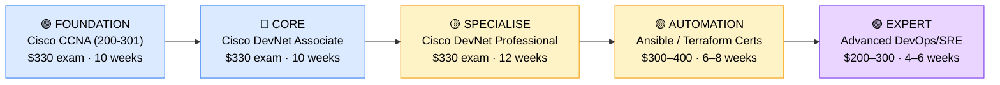

# How to Become a Network Automation Engineer

**`CP16`** · **Networking** · _Time to hire: 18–24 months_ · _Entry cost: $1,500–$2,200 USD_

> **Path summary:** This path takes you from Network Engineer to a hired Network Automation Engineer—bridging networking and software engineering. You'll automate network provisioning, monitoring, and configuration using Python, Ansible, REST APIs, and intent-based platforms. High demand, premium salaries, fastest-growing networking specialisation.

---

## Role Overview

### What does a Network Automation Engineer actually do?

A Network Automation Engineer spends 60% of their time writing code and building automation workflows: Python scripts, Ansible playbooks, Terraform infrastructure-as-code (IaC), and REST API integrations. They automate repetitive network tasks—provisioning VLANs, configuring QoS policies, rolling out firewall rules, and deploying network changes across hundreds of devices.

The other 40% is hands-on: troubleshooting automation failures, designing CI/CD pipelines for network changes, and collaborating with network teams to identify what should be automated. Unlike traditional network engineers who manually configure routers, automation engineers write code that configures thousands of devices simultaneously. This role is perfect if you like both networking and programming.

### Demand in 2026

- **Global job postings:** 7,200+ active roles on LinkedIn as of May 2026 [(source)](https://www.linkedin.com/jobs/search/?keywords=Network%20Automation%20Engineer)
- **Growth rate:** 22% YoY; fastest-growing networking specialisation driven by DevOps, cloud, and infrastructure-as-code adoption [(source)](https://www.bls.gov/ooh/computer-and-information-technology/network-and-computer-systems-administrators.htm)
- **South Africa:** Growing demand at large enterprises (banks, telcos), cloud-first startups, and consultancies. Automation is becoming table stakes for enterprise infrastructure.
- **Remote availability:** Very high (70–80%)—mostly remote; code review, pair programming, and architecture discussions are all virtual.

---

## Who Is This Path For?

### Ideal starting backgrounds

| Background | Readiness | What you already have |
|---|---|---|
| Network Engineer (2+ yrs) + programming interest | ✅ Strong start | Network knowledge + interest in coding = perfect fit |
| Developer / Software Engineer | ✅ Strong start | Programming skills; needs network fundamentals |
| Network Technician + self-taught Python | ✅ Good start | Hands-on experience; coding foundation needed |
| Sysadmin with scripting experience | 🟡 Good with gaps | Automation habits; needs networking depth |
| Network graduate / bootcamp | 🟡 Good with gaps | Networking theory; needs programming hands-on |

### You're ready to start this path if you can:

- Write basic Python scripts (loops, functions, error handling)
- Understand REST APIs and how to make HTTP requests
- Explain basic networking (VLAN, routing, DHCP, DNS)
- Have hands-on experience with network device configuration (Cisco, Juniper, etc.)
- Be comfortable learning new tools quickly

> **Not ready yet?** If you lack programming skills, start with [Python fundamentals](https://www.python.org/about/gettingstarted/) (2–3 months). If you lack networking, start with [CompTIA Network+](CP01_Foundation_Network_Plus.md) (2 months).

---

## Certification Sequence

### Visual path

---

## Certification Path & Timeline

### Stage 1 — Network Foundation (Months 0–3)

**Goal:** Ensure solid CCNA-level networking knowledge before diving into automation.

| Cert | Code | Cost (USD) | Study Time | Why it matters |
|---|---|---:|---:|---|
| Cisco Certified Network Associate (CCNA) | `200-301` | $330 | 10–12 weeks | Covers routing, switching, VLANs, and networking fundamentals. You can't automate what you don't understand. |

**Stage 1 total:** $330 USD · R5,940 ZAR · 3 months

**Study approach:** Use INE or CBT Nuggets. Fast-track if you have network experience; spend time understanding the "why" behind network concepts. Schedule exam when scoring 85%+ on practice tests.

**Lab requirement:** Build a 3-site network in GNS3 with VLANs, inter-VLAN routing, and basic QoS. 20 hours minimum.

---

### Stage 2 — DevNet Associate (Months 3–6)

**Goal:** Learn network APIs, Python for networking, and Cisco DevNet fundamentals.

| Cert | Code | Cost (USD) | Study Time | Why it matters |
|---|---|---:|---:|---|
| Cisco Certified Associate DevNet (DevNet Associate) | `200-901 DEVASC` | $330 | 10–12 weeks | Python, APIs (REST, NETCONF, YANG), automation fundamentals. The bridge between networking and programming. |

**Stage 2 total:** $330 USD · R5,940 ZAR · 3 months

**Study approach:** Use official Cisco DevNet training and hands-on labs. This is hands-on; you'll write Python code, make API calls, and automate Cisco devices. Schedule when you can confidently write Python scripts and understand REST concepts.

**Lab requirement:** Write Python scripts to automate network tasks: provision VLANs, gather device info via REST APIs, push configurations via Ansible. Build a GitHub portfolio with 5–10 small automation projects. 40+ hours minimum.

---

### Stage 3 — DevNet Professional (Months 6–11)

**Goal:** Demonstrate professional-level automation expertise.

| Cert | Code | Cost (USD) | Study Time | Why it matters |
|---|---|---:|---:|---|
| Cisco Certified Professional DevNet (DevNet Professional) | `350-901 DEVCOR` | $330 | 12–14 weeks | Advanced automation: CI/CD, containerization, infrastructure-as-code, complex Ansible playbooks. |
| PLUS Cisco Automation Engineer (300-435 ENAUTO) | `300-435` | $395 | 10–12 weeks | Network automation specialist cert. Combines DevNet + network device automation. |

**Stage 3 total:** $725 USD · R13,050 ZAR · 6 months

**Study approach:** These are professional-level certs; expect detailed study of container orchestration, CI/CD pipelines, and network automation workflows. Complete hands-on labs on actual devices (or lab environments).

**Project milestone:** Design and build an end-to-end network automation solution: source control (GitHub), CI/CD pipeline (Jenkins or GitLab CI), Ansible playbooks for multi-vendor devices, and monitoring integration. Document with architecture diagrams and runbooks.

---

### Stage 4 — Platform Specialisation (Months 11–18, Optional)

**Goal:** Master one automation platform deeply (Ansible, Terraform, or vendor-specific).

| Cert | Code | Cost (USD) | Study Time | Why it matters |
|---|---|---:|---:|---|
| Red Hat Certified Associate Ansible Engine (RHCE) | `EX407` | $400 | 8–10 weeks | Industry-standard configuration management. Employers expect Ansible expertise. |
| OR HashiCorp Certified: Terraform Associate | `H4-002` | $70 | 4–6 weeks | Infrastructure-as-code. Increasingly required for cloud-network integration. |

**Stage 4 total:** $70–400 USD · R1,260–7,200 ZAR · 6–10 weeks

> **Optional at hire time:** Many people land Network Automation Engineer roles after Stage 2–3 (DevNet Associate + Professional) and learn Ansible/Terraform on the job.

---

## Timeline & Cost Summary

| Stage | Certs | Duration | Cost (USD) | Cost (ZAR) |
|---|---|---|---:|---:|
| Stage 1 — Network Foundation | CCNA | Months 0–3 | $330 | R5,940 |
| Stage 2 — DevNet Associate | DevNet Associate | Months 3–6 | $330 | R5,940 |
| Stage 3 — Automation Depth | DevNet Pro + ENAUTO | Months 6–11 | $725 | R13,050 |
| **Total to hireable** | | **18–20 months** | **$1,385** | **R24,930** |
| Optional Stage 4 | Ansible/Terraform | Months 11–18 | $70–400 | R1,260–7,200 |

**Study hours required:** 450–550 hours total. Assumes 15–18 hours/week over 18–24 months (including hands-on coding).

---

## Salary Progression

> All figures: median base salary, not including bonuses/equity. ZAR = USD × 18 baseline (verified May 2026). Sources: Robert Half 2026, Glassdoor, PayScale, LinkedIn Salary.

| Experience Level | USD/year | ZAR/year | GBP/year | EUR/year | AUD/year |
|---|---:|---:|---:|---:|---:|
| Entry / Junior (0–2 yrs) | $85,000 | R1,530,000 | £68,000 | €80,000 | A$138,000 |
| Mid-level (2–5 yrs) | $110,000 | R1,980,000 | £88,000 | €103,000 | A$178,000 |
| Senior (5–8 yrs) | $115,000 | R2,070,000 | £92,000 | €108,000 | A$186,000 |
| Lead / Architect (8+ yrs) | $145,000 | R2,610,000 | £116,000 | €136,000 | A$235,000 |

**South Africa note:** Network Automation Engineers at Johannesburg-based enterprises earn R54,000–R74,000/month (entry), scaling to R78,000–R100,000/month for mid-level. Startups and consultancies pay at the higher end. Remote positions for international firms push mid-level salaries to R75,000–R110,000/month.

**Salary accelerators:** DevNet Pro cert adds 15–20% premium. Ansible or Terraform certs add 10%. Python proficiency demonstrates with code samples adds 5–10%.

---

## First Job Strategy

### Month 0–6: Build Network + Programming Foundation

1. **Get CCNA** — 12 hours/week. Understand routing, switching, VLANs deeply.
2. **Learn Python** — Parallel path. Complete a Python beginner course (Automate the Boring Stuff, DataCamp, or Udemy). Build simple scripts. Time: 40–50 hours.
3. **Join community** — r/learnprogramming, Cisco DevNet Discord, r/ccna. Post your projects.
4. **Start GitHub portfolio** — Create public repo with Python scripts, Ansible playbooks, and lab documentation.

### Month 6–12: Build Automation Projects

1. **Study DevNet Associate** — 12 hours/week. Deep dive into APIs, NETCONF, and network automation concepts.
2. **Build 3–5 automation projects:** 
   - VLAN provisioning automation
   - Device configuration backup via API
   - Network monitoring dashboard
   - Ansible playbook for multi-device config
   - Terraform template for AWS + network
   Time: 60–80 hours total across 6 months.
3. **Master Git and CI/CD** — Learn Git workflows, GitHub Actions, and Jenkins basics.
4. **Network with engineers** — Connect with DevNet engineers on LinkedIn. Engage with their projects.

### Month 12–18: Certify & Apply

1. **Pass DevNet Associate + Professional** — 15 hours/week. These are intense; emphasise hands-on labs.
2. **Polish GitHub portfolio** — 5–10 high-quality projects with documentation, tests, and CI/CD pipelines. This is your portfolio; employers will review it.
3. **Interview prep** — Be ready to discuss: 1) a network automation project you've built, 2) CI/CD pipelines, 3) Ansible playbooks, 4) REST API design, 5) troubleshooting automation failures.
4. **Target automation roles** — Apply to enterprises, startups, and consultancies. Network Automation Engineer is a hot role; expect quick interviews.

---

## A Day in the Life

### Network Automation Engineer at a Large Enterprise — Entry Level

**08:00** — Review CI/CD pipeline status. One automated network change failed due to device unreachable error. Investigate logs and retry manually; escalate device issue to the NOC team.

**09:00** — Code review. Peer reviewing an Ansible playbook from another automation engineer. Check for idempotency (can be run multiple times safely), error handling, and documentation. Provide feedback.

**10:30** — Development. Building a Python script to automate VRF provisioning. Write code, test in the lab, commit to GitHub, and submit pull request for review.

**12:00** — Lunch

**13:00** — Troubleshooting. An automated firewall rule deployment failed on 3 devices. Investigate why—device API version mismatch. Update the script and re-deploy successfully.

**14:30** — Meeting. Planning session with the network team. They want to automate DNS failover. Whiteboard the architecture, discuss API requirements, and outline the automation approach.

**15:30** — Lab work. Testing a new Ansible module for a multi-vendor network. Validate functionality and performance before rolling out to production.

**16:30** — End of day. Update ticket tracking. Document lessons learned from today's incidents.

### Senior Network Automation Engineer at a Cloud-Native Startup — Mid Level

**09:00** — Architecture meeting. The company is moving infrastructure to Kubernetes. You're designing the network automation layer: how to provision and manage network policies, load balancers, and DNS in Kubernetes. Present design to the team.

**10:30** — CI/CD pipeline optimization. Current deployment pipeline takes 30 minutes; goal is 10 minutes. Analyze bottlenecks and optimize. Write better parallel tests and streamline stages.

**12:00** — Lunch

**13:00** — Mentoring. Junior automation engineer is struggling with Ansible template rendering. Pair program and explain Jinja2 templating; help them complete their task.

**14:30** — Infrastructure-as-code (IaC) development. Building Terraform modules for multi-cloud network provisioning (AWS, Azure, GCP). Write modular, reusable code. Add unit tests and documentation.

**15:30** — Open source contribution. Company contributes to Ansible community. You're reviewing community contributions and merging pull requests into a network-related Ansible collection.

**16:30** — End of day. Update technical roadmap. Next quarter: introduce declarative networking (intent-based networking platforms).

---

## Related Paths & Progressions

| From here you can move to… | Why |
|---|---|
| [DevOps Engineer](CP85_DevOps_DevOps_Engineer.md) | Network automation blends into DevOps; automation + infrastructure experience leads to DevOps roles. |
| [Cloud Engineer](CP17_Cloud_Cloud_Engineer.md) | Automation + cloud integration = natural progression to cloud engineering. |
| [Site Reliability Engineer (SRE)](CP86_DevOps_Site_Reliability_Engineer.md) | Automation is core to SRE; infrastructure knowledge is valuable. |
| [Network Architect](CP11_Networking_Network_Architect.md) | After 5+ years, automation expertise + networking depth leads to architect roles. |

---

## South Africa Context

### Market specifics

Network Automation is in strong demand across South Africa's tech sector. Large enterprises (banks, telcos) need automation to scale infrastructure. Cloud-native startups and digital transformation initiatives drive demand. Consultancies (Dimension Data, BCX) hiring automation engineers to support enterprise transformations.

Remote work is very strong—most automation work is coding and code review, fully remote-friendly. Many South African engineers work remotely for international companies, earning international salaries (USD/GBP).

### SA-specific resources

| Resource | URL | Note |
|---|---|---|
| Cisco DevNet | [https://developer.cisco.com/](https://developer.cisco.com/) | Official Cisco automation platform. |
| Ansible Documentation | [https://docs.ansible.com/](https://docs.ansible.com/) | Open-source automation. |
| Terraform by HashiCorp | [https://www.terraform.io/](https://www.terraform.io/) | Infrastructure-as-code. |
| r/learnprogramming (Reddit) | [https://www.reddit.com/r/learnprogramming/](https://www.reddit.com/r/learnprogramming/) | Active global community. |
| Python.org | [https://www.python.org/](https://www.python.org/) | Official Python resources. |

---

## Frequently Asked Questions

**Q: Do I need CCNA before learning network automation?**
Yes. You need to understand what you're automating. Learn CCNA (or equivalent network knowledge) first, then move to automation. Without networking fundamentals, your scripts will be ineffective.

**Q: Can I learn programming on the side while working as a Network Engineer?**
Absolutely. This is the common path. Work full-time as a Network Engineer, spend 10–12 hours/week learning Python and automation concepts. After 12–18 months, you'll have enough skills + certifications to transition to automation roles.

**Q: How long does it take from zero?**
If you have network experience (CCNA or equivalent): 18–24 months (learn programming + DevNet certs + build portfolio). If starting from Help Desk: 3–4 years (CCNA + programming + DevNet + experience).

**Q: Should I focus on Ansible, Terraform, or Python?**
All three. Python is foundational (you'll write scripts in any role). Ansible is industry-standard for network automation. Terraform is essential for infrastructure-as-code. Learn Python first, then add Ansible and Terraform as projects demand.

**Q: Are there no-cost ways to start learning?**
Yes. Free resources: Python (python.org), Ansible (ansible.com docs), GNS3 (free tier), GitHub (free repos), Cisco DevNet sandbox labs (free). You can start with $0 investment; certifications cost money later.

---

## Sources & Further Reading

| # | Source | URL | Used for |
|---|---|---|---|
| 1 | LinkedIn Job Search | [https://www.linkedin.com/jobs/search/?keywords=Network%20Automation%20Engineer](https://www.linkedin.com/jobs/search/?keywords=Network%20Automation%20Engineer) | Job postings |
| 2 | Cisco DevNet | [https://developer.cisco.com/certification/](https://developer.cisco.com/certification/) | DevNet cert details |
| 3 | Automate the Boring Stuff | [https://automatetheboringstuff.com/](https://automatetheboringstuff.com/) | Free Python book |
| 4 | Ansible Documentation | [https://docs.ansible.com/](https://docs.ansible.com/) | Ansible guide |
| 5 | Robert Half Salary Guide 2026 | [https://www.roberthalf.com/salary-guide/network-engineer](https://www.roberthalf.com/salary-guide/network-engineer) | Salary data |
| 6 | LinkedIn Salary Insights | [https://www.linkedin.com/salary/network-automation-engineer-salary/](https://www.linkedin.com/salary/network-automation-engineer-salary/) | Crowdsourced data |
| 7 | BLS Computer Occupations | [https://www.bls.gov/ooh/computer-and-information-technology/](https://www.bls.gov/ooh/computer-and-information-technology/) | Growth projections |
| 8 | GitHub | [https://github.com/](https://github.com/) | Portfolio platform |

---

*Template version: 2026-05-02 | Maintained by IT Career Roadmap | ZAR baseline: R18/$1 USD*
*File naming: `Career_Paths/CP16_Networking_Network_Automation_Engineer.md`*
