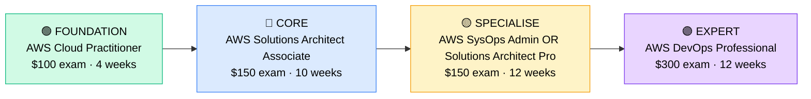

# How to Become a Cloud Engineer

**`CP17`** · **Cloud** · _Time to hire: 12–18 months_ · _Entry cost: $800–$1,400 USD_

> **Path summary:** This path takes you from System Administrator to a hired Cloud Engineer—designing, deploying, and maintaining cloud infrastructure on AWS, Azure, or Google Cloud. Strong demand, premium salaries, fastest-growing infrastructure specialisation. Start with AWS Cloud Practitioner, progress through Solutions Architect Associate, and specialise in operations, security, or container platforms.

---

## Role Overview

### What does a Cloud Engineer actually do?

A Cloud Engineer spends 50% of their time designing and deploying cloud infrastructure: creating virtual machines, databases, storage solutions, and networking. They work in web consoles (AWS Console, Azure Portal), infrastructure-as-code tools (Terraform, CloudFormation), and APIs. The other 50% is operational: monitoring performance, troubleshooting issues, patching systems, and optimising costs.

Unlike traditional Sysadmins who manage physical servers in data centres, Cloud Engineers manage "servers" that exist in AWS or Azure data centres. They think about elasticity (scaling up/down automatically), high availability (redundancy across regions), and cost optimisation (right-sizing instances, using reserved capacity). It's infrastructure, but fundamentally software-driven.

### Demand in 2026

- **Global job postings:** 15,000+ active roles on LinkedIn as of May 2026 [(source)](https://www.linkedin.com/jobs/search/?keywords=Cloud%20Engineer)
- **Growth rate:** 21% YoY; cloud adoption accelerating across all industries [(source)](https://www.bls.gov/ooh/computer-and-information-technology/computer-systems-analysts.htm)
- **South Africa:** High demand at financial institutions, retailers, and digital startups. Migration to cloud is ongoing; continuous hiring.
- **Remote availability:** Very high (75–85%)—entirely remote-friendly; infrastructure is managed via web console and APIs.

---

## Who Is This Path For?

### Ideal starting backgrounds

| Background | Readiness | What you already have |
|---|---|---|
| System Administrator | ✅ Strong start | Server management, OS knowledge, infrastructure thinking |
| Network Administrator | ✅ Good start | Network concepts; needs server/storage knowledge |
| IT Support / Help Desk | 🟡 Good with gaps | Troubleshooting mindset; needs infrastructure depth |
| Developer | ✅ Good start | Coding skills valuable; needs infrastructure knowledge |
| DevOps Engineer | ✅ Strong start | Already bridging infrastructure + automation |
| Recent IT graduate | 🟡 Good with gaps | Theory solid; needs hands-on lab work |

### You're ready to start this path if you can:

- Understand basic networking (subnets, security groups, routing)
- Explain what IaaS, PaaS, and SaaS are
- Create an AWS/Azure account and launch a simple resource (EC2 instance, App Service)
- Understand databases and storage concepts
- Be comfortable learning new platforms through documentation

> **Not ready yet?** Start with [CompTIA Network+](CP01_Foundation_Network_Plus.md) or [Linux fundamentals](https://www.linux.org/) first.

---

## Certification Sequence

### Visual path

---

## Certification Path & Timeline

### Stage 1 — Foundation (Months 0–1)

**Goal:** Establish cloud fundamentals and AWS basics.

| Cert | Code | Cost (USD) | Study Time | Why it matters |
|---|---|---:|---:|---|
| AWS Certified Cloud Practitioner | `CLF-C02` | $100 | 3–4 weeks | Cloud fundamentals, AWS services overview, basic architecture. Entry barrier for cloud roles. |

**Stage 1 total:** $100 USD · R1,800 ZAR · 4 weeks

**Study approach:** Use A Cloud Guru or Linux Academy's free tier (limited); Udemy courses by Stephane Maarek are excellent. Complete 50+ practice questions. Schedule exam when scoring 85%+.

**Lab requirement:** Create an AWS Free Tier account. Launch an EC2 instance, create an S3 bucket, configure basic security groups. 8–10 hours hands-on.

---

### Stage 2 — Core Specialisation (Months 1–4)

**Goal:** Get Solutions Architect Associate—the anchor credential for Cloud Engineer roles.

| Cert | Code | Cost (USD) | Study Time | Why it matters |
|---|---|---:|---:|---|
| AWS Certified Solutions Architect – Associate | `SAA-C03` | $150 | 10–12 weeks | Design scalable, cost-effective cloud architectures. Employers expect this for entry-level cloud roles. |

**Stage 2 total:** $150 USD · R2,700 ZAR · 3 months

**Study approach:** Use A Cloud Guru, Udemy (Maarek), or Linux Academy. Hands-on labs are critical; build real architectures in your AWS account. Complete 100+ practice questions. Schedule when scoring 90%+.

**Lab requirement:** Design and build 3 architectures: 1) a basic 3-tier web app (EC2, RDS, S3), 2) a highly available multi-region setup with failover, 3) a serverless application (Lambda, API Gateway, DynamoDB). Document with diagrams. 50+ hours total.

---

### Stage 3 — Advanced Specialisation (Months 4–10)

**Goal:** Choose your specialisation and add depth.

| Cert | Code | Cost (USD) | Study Time | Why it matters |
|---|---|---:|---:|---|
| AWS Certified SysOps Administrator – Associate | `SOA-C02` | $150 | 10–12 weeks | Operations focus: monitoring, scaling, disaster recovery. Perfect for Ops-focused roles. |
| OR AWS Certified Solutions Architect – Professional | `SAP-C02` | $300 | 14–16 weeks | Advanced architecture for complex scenarios. Path to architect roles. |

**Stage 3 total:** $150–300 USD · R2,700–5,400 ZAR · 6–8 weeks

**Study approach:** For SysOps: focus on CloudWatch, Auto Scaling, RDS failover, and disaster recovery. For SAP: study complex multi-account architectures, hybrid environments, and cost optimisation. Complete 80+ practice questions each.

**Project milestone:** Design a complete cloud infrastructure for a hypothetical enterprise: multi-region deployment, disaster recovery plan, monitoring/alerting, cost optimisation strategies. Document professionally with architecture diagrams, configuration guides, and cost estimates.

---

### Stage 4 — Specialist Focus (Months 10–15, Optional)

**Goal:** Add container or security specialisation.

| Cert | Code | Cost (USD) | Study Time | Why it matters |
|---|---|---:|---:|---|
| AWS Certified Developer – Associate (if coding focus) | `DVA-C02` | $150 | 10 weeks | Containers, serverless, APIs. Bridges cloud engineering and development. |
| OR HashiCorp Certified: Terraform Associate | `H4-002` | $70 | 4–6 weeks | Infrastructure-as-code. Essential for modern cloud teams. |

**Stage 4 total:** $70–150 USD · R1,260–2,700 ZAR · 4–10 weeks

> **Optional at hire time:** Most people land Cloud Engineer jobs after Stage 2 (Cloud Practitioner + Solutions Architect Associate) and complete Stage 3 on the job.

---

## Timeline & Cost Summary

| Stage | Certs | Duration | Cost (USD) | Cost (ZAR) |
|---|---|---|---:|---:|
| Stage 1 — Foundation | CLF-C02 | Months 0–1 | $100 | R1,800 |
| Stage 2 — Core | SAA-C03 | Months 1–4 | $150 | R2,700 |
| Stage 3 — Specialise | SOA-C02 or SAP-C02 | Months 4–10 | $150–300 | R2,700–5,400 |
| **Total to hireable** | | **12–16 months** | **$400–550** | **R7,200–9,900** |
| Optional Stage 4 | Developer / Terraform | Months 10–15 | $70–150 | R1,260–2,700 |

**Study hours required:** 300–400 hours total (including hands-on labs). Assumes 12–15 hours/week over 12–16 months.

---

## Salary Progression

> All figures: median base salary, not including bonuses/equity. ZAR = USD × 18 baseline (verified May 2026). Sources: Robert Half 2026, Glassdoor, PayScale, LinkedIn Salary.

| Experience Level | USD/year | ZAR/year | GBP/year | EUR/year | AUD/year |
|---|---:|---:|---:|---:|---:|
| Entry / Junior (0–2 yrs) | $75,000 | R1,350,000 | £60,000 | €70,000 | A$121,000 |
| Mid-level (2–5 yrs) | $95,000 | R1,710,000 | £76,000 | €89,000 | A$154,000 |
| Senior (5–8 yrs) | $105,000 | R1,890,000 | £84,000 | €98,000 | A$170,000 |
| Lead / Architect (8+ yrs) | $135,000 | R2,430,000 | £108,000 | €127,000 | A$219,000 |

**South Africa note:** Cloud Engineers at Johannesburg-based enterprises earn R48,000–R67,000/month (entry), scaling to R70,000–R95,000/month for mid-level. Digital startups pay higher end. Remote positions for international firms push mid-level to R75,000–R110,000/month.

**Salary accelerators:** Multiple cloud certs (AWS + Azure + GCP) add 20–30% premium. Container expertise (Kubernetes, Docker) adds 15%. DevOps skills add 10%.

---

## First Job Strategy

### Month 0–3: Build Foundation

1. **Set up AWS Free Tier account** — Cost: $0. Explore services: EC2, S3, RDS, Lambda.
2. **Study Cloud Practitioner** — 6 hours/week. Schedule exam for week 3–4.
3. **Build first lab** — Launch an EC2 instance, create S3 bucket, configure security groups. Document with screenshots. Time: 10 hours.
4. **Join community** — r/aws, AWS forums, A Cloud Guru community.

### Month 3–6: Build Solutions Architect Knowledge

1. **Study Solutions Architect Associate** — 12 hours/week. Focus on designing scalable, highly available systems.
2. **Build 3 architecture projects:**
   - Simple 3-tier web app (EC2, RDS, S3)
   - Highly available architecture (Multi-AZ, Auto Scaling, failover)
   - Serverless application (Lambda, DynamoDB, API Gateway)
   Time: 40–50 hours across 3 months.
3. **Document everything** — GitHub repo with architecture diagrams, deployment guides, cost estimates.
4. **Blog or LinkedIn posts** — Write 2–3 posts about what you've learned. Demonstrate knowledge publicly.

### Month 6–12: Specialise & Apply

1. **Pass Solutions Architect Associate** — Must-have credential.
2. **Choose specialisation** — Operations (SysOps), Architecture (SAP), or Development focus. Study accordingly.
3. **Interview prep** — Be ready to discuss: 1) a cloud architecture you've designed, 2) disaster recovery strategies, 3) cost optimisation approaches, 4) multi-region deployment, 5) security best practices.
4. **Apply to roles** — Cloud Engineer jobs are plentiful. Target enterprises in cloud migration, startups, or consultancies. Negotiate $75K–$95K for entry-level with certs + labs.

---

## A Day in the Life

### Cloud Engineer at a Large Retail Enterprise — Entry Level

**08:00** — Review overnight CloudWatch alarms. One Lambda function is timing out; check logs and discover a database query is slow. Optimise the query and redeploy.

**09:00** — Meeting with infrastructure team. Planning migration of legacy application to AWS. You're designing the target architecture: EC2 instances, RDS database, S3 storage, CloudFront CDN.

**10:30** — Configuration session. Set up Auto Scaling for web servers—configure min/max instances, scaling policies based on CPU and request count. Test scaling behaviour.

**12:00** — Lunch

**13:00** — Troubleshooting. A batch process failed on EC2 instance. Check logs, diagnose disk space issue, clean up, and restart. Document the root cause and prevention strategy.

**14:30** — Cost optimisation. Review AWS spend from previous month. Identify expensive resources and right-size them. Use Reserved Instances for predictable workloads. Save 30% monthly.

**15:30** — Documentation. Update the infrastructure playbook with new Auto Scaling configuration and troubleshooting procedures.

**16:30** — End of day. Update project tracking on migration timeline.

### Senior Cloud Engineer at a Digital Startup — Mid Level

**09:00** — Architecture design meeting. Company is building a real-time analytics platform. Design the cloud infrastructure: Kinesis data streams, Lambda processing, Redshift data warehouse, and QuickSight dashboards.

**10:30** — Infrastructure-as-code development. Build Terraform modules to provision and manage all infrastructure. Version in Git; set up CI/CD pipeline for infrastructure changes.

**12:00** — Lunch

**13:00** — Disaster recovery planning. Simulate a region failure; test failover to backup region. Document recovery procedures and test regularly (quarterly).

**14:30** — Security audit. Review IAM policies; ensure principle of least privilege. Audit CloudTrail logs for suspicious activity. Implement additional security controls (encryption, VPC Flow Logs).

**15:30** — Mentoring. Junior engineer is deploying their first serverless application. Pair with them; review their Lambda function, API Gateway config, and DynamoDB setup.

**16:30** — End of day. Update technical roadmap. Next quarter: implement Kubernetes (EKS) for containerised workloads.

---

## Related Paths & Progressions

| From here you can move to… | Why |
|---|---|
| [Cloud Architect](CP18_Cloud_Cloud_Architect.md) | After 3–5 years cloud experience, progress to architect roles. |
| [Cloud Security Engineer](CP19_Cloud_Cloud_Security_Engineer.md) | Cloud expertise + security focus leads to security roles. |
| [DevOps Engineer](CP85_DevOps_DevOps_Engineer.md) | Cloud + automation = DevOps career path. |
| [FinOps Engineer](CP20_Cloud_FinOps_Engineer.md) | Cloud + cost optimisation expertise → FinOps specialist. |

---

## South Africa Context

### Market specifics

South African enterprises are actively migrating to cloud. Banks, retailers, and digital startups drive demand. AWS is most common; Azure growing (Microsoft partnerships). Remote work is very strong—entirely virtual; South African Cloud Engineers often work for international companies earning international salaries.

### SA-specific resources

| Resource | URL | Note |
|---|---|---|
| AWS Training | [https://aws.amazon.com/training/](https://aws.amazon.com/training/) | Official AWS courses. |
| A Cloud Guru | [https://www.acloudguru.com/](https://www.acloudguru.com/) | Excellent platform. |
| r/aws (Reddit) | [https://www.reddit.com/r/aws/](https://www.reddit.com/r/aws/) | Active community. |
| Dimension Data Careers | [https://www.dimensiondata.com/careers](https://www.dimensiondata.com/careers) | Major cloud employer. |
| Linux Academy | [https://www.linuxacademy.com/](https://www.linuxacademy.com/) | Cloud + Linux training. |

---

## Frequently Asked Questions

**Q: Do I need to learn Linux/Unix?**
Strongly recommended. Most cloud infrastructure runs Linux. Comfort with Linux command line, package management, and system administration will make you a better Cloud Engineer. Learn basics in parallel with cloud certs.

**Q: Should I learn AWS, Azure, or Google Cloud?**
Start with AWS (60%+ market share). Add Azure if targeting enterprises (Microsoft partnerships). Google Cloud is growing but smaller. Learn one deeply first; other platforms become easier.

**Q: How long from zero to hired?**
If starting from Sysadmin: 12–18 months (Cloud Practitioner + SAA-C03 + labs + portfolio). If starting from Help Desk: 18–24 months.

**Q: Can I do this while working full-time?**
Yes. Many people study cloud nights/weekends while working as Sysadmins. 10–12 hours/week = 12–18 months to hire.

**Q: Is Cloud Practitioner worth it, or should I skip to SAA?**
Don't skip. Cloud Practitioner (4 weeks) gives you fundamentals and AWS terminology. SAA assumes this knowledge. Do both.

---

## Sources & Further Reading

| # | Source | URL | Used for |
|---|---|---|---|
| 1 | LinkedIn Job Search | [https://www.linkedin.com/jobs/search/?keywords=Cloud%20Engineer](https://www.linkedin.com/jobs/search/?keywords=Cloud%20Engineer) | Job postings |
| 2 | AWS Certification | [https://aws.amazon.com/certification/](https://aws.amazon.com/certification/) | Official exam details |
| 3 | A Cloud Guru | [https://www.acloudguru.com/](https://www.acloudguru.com/) | Training platform |
| 4 | Robert Half Salary Guide 2026 | [https://www.roberthalf.com/salary-guide/cloud-engineer](https://www.roberthalf.com/salary-guide/cloud-engineer) | Salary data |
| 5 | LinkedIn Salary Insights | [https://www.linkedin.com/salary/cloud-engineer-salary/](https://www.linkedin.com/salary/cloud-engineer-salary/) | Crowdsourced data |
| 6 | BLS Computer Occupations | [https://www.bls.gov/ooh/computer-and-information-technology/computer-systems-analysts.htm](https://www.bls.gov/ooh/computer-and-information-technology/computer-systems-analysts.htm) | Growth projections |
| 7 | AWS Free Tier | [https://aws.amazon.com/free/](https://aws.amazon.com/free/) | Free lab environment |
| 8 | Stephane Maarek Udemy Courses | [https://www.udemy.com/user/stephane-maarek/](https://www.udemy.com/user/stephane-maarek/) | High-quality courses |

---

*Template version: 2026-05-02 | Maintained by IT Career Roadmap | ZAR baseline: R18/$1 USD*
*File naming: `Career_Paths/CP17_Cloud_Cloud_Engineer.md`*
