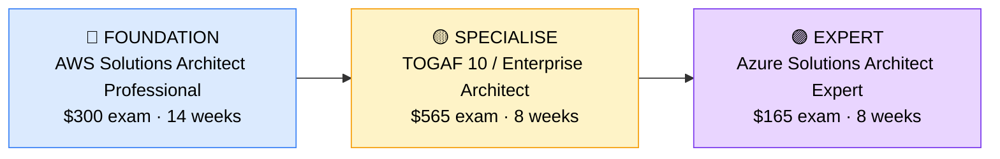

# How to Become a Cloud Architect (Solutions Architect)

**`CP18`** · **Cloud** · _Time to hire: Variable (3–5 years cloud experience required)_ · _Entry cost: $900–$1,500 USD_

> **Path summary:** This path takes you from Cloud Engineer to a hired Cloud Architect—designing complex, enterprise-scale cloud solutions. Unlike engineers who implement, architects design and advise. You'll work with business stakeholders to translate requirements into scalable, cost-effective, secure cloud architectures. Requires substantial hands-on experience first. Premium salaries, strategic impact.

---

## Role Overview

### What does a Cloud Architect actually do?

A Cloud Architect spends 70% of their time designing cloud solutions: working with business stakeholders to understand requirements, creating detailed architecture diagrams, defining security policies, and designing disaster recovery strategies. They use architectural frameworks (AWS Well-Architected Framework, Azure Cloud Adoption Framework, TOGAF) and make multi-million-dollar technology decisions (which databases, which services, how to handle scaling, security posture).

The other 30% is hands-on validation: building proofs of concept (PoCs) in the cloud to prove designs work before enterprise rollout, reviewing implementations by engineering teams, and troubleshooting production issues that require architectural changes. They sit at the intersection of business, technology, and strategy.

### Demand in 2026

- **Global job postings:** 8,500+ active roles on LinkedIn as of May 2026 [(source)](https://www.linkedin.com/jobs/search/?keywords=Cloud%20Architect)
- **Growth rate:** 12% YoY; enterprise cloud adoption drives steady demand [(source)](https://www.bls.gov/ooh/computer-and-information-technology/computer-systems-analysts.htm)
- **South Africa:** High demand at large banks, insurance companies, and consultancies. Enterprise cloud strategies are ongoing.
- **Remote availability:** High (60–70%)—design work is remote; some on-site strategy meetings required.

---

## Who Is This Path For?

### Ideal starting backgrounds

| Background | Readiness | What you already have |
|---|---|---|
| Cloud Engineer (3+ yrs) | ✅ Ready to start | Deep hands-on experience; needs design methodology |
| Solutions Designer | ✅ Ready to start | Design skills; may need implementation depth |
| Enterprise Architect | 🟡 Possible | Architecture thinking; needs cloud-specific knowledge |
| DevOps Engineer (5+ yrs) | 🟡 Good with gaps | Automation expertise; needs broader cloud design |
| Sysadmin / Network Admin | ❌ Not ready | Needs 3–5 years cloud engineering experience first |

### You're ready to start this path if you can:

- Design multi-region, highly available cloud applications from scratch
- Explain cost optimisation strategies and implement them in production
- Design security architectures (IAM, encryption, compliance)
- Have led 3–5 major cloud infrastructure projects
- Understand business drivers (cost, compliance, performance) and translate to architecture
- Hold AWS Solutions Architect Professional or equivalent

> **Not ready yet?** You need 3–5 years of hands-on Cloud Engineer experience first. Start with [Cloud Engineer path](CP17_Cloud_Cloud_Engineer.md) and gain production experience before attempting architect roles.

---

## Certification Sequence

### Visual path

---

## Certification & Experience Path

### Stage 1 — Professional Architect Certification (Months 0–4)

**Goal:** Achieve AWS Solutions Architect Professional—demonstrates enterprise-level architecture expertise.

| Cert | Code | Cost (USD) | Study Time | Why it matters |
|---|---|---:|---:|---|
| AWS Certified Solutions Architect – Professional | `SAP-C02` | $300 | 14–16 weeks | Complex multi-account architectures, hybrid environments, cost optimisation, compliance. Prerequisite for architect roles. |

**Stage 1 total:** $300 USD · R5,400 ZAR · 4 months

**Study approach:** This is professional-level. Use A Cloud Guru, Linux Academy, or Whizlabs. Study complex scenarios: multi-account strategies, disaster recovery, compliance frameworks. Complete 150+ practice questions. Schedule when scoring 95%+.

**Lab requirement:** Design and build 3 complex architectures: 1) multi-region disaster recovery with failover, 2) multi-account setup with shared services, 3) hybrid cloud (on-premises + AWS). 60+ hours total.

---

### Stage 2 — Enterprise Architecture Framework (Months 4–8)

**Goal:** Learn enterprise architecture methodology.

| Cert | Code | Cost (USD) | Study Time | Why it matters |
|---|---|---:|---:|---|
| TOGAF 10 Certification | `TOGAF-C10` | $565 | 8–10 weeks | Enterprise architecture framework. Used in large organisations; separates architects from engineers. |

**Stage 2 total:** $565 USD · R10,170 ZAR · 8 weeks

**Study approach:** Use official TOGAF study guides. Understand the architecture development method (ADM) and how to link technical design to business outcomes. Complete practice exams.

**Project milestone:** Design a complete enterprise cloud strategy for a hypothetical Fortune 500 company: current state assessment, target state architecture, transition roadmap, risk mitigation, and business case. Present professionally.

---

### Stage 3 — Multi-Cloud Specialisation (Months 8–14, Optional)

**Goal:** Master second cloud platform (Azure or GCP).

| Cert | Code | Cost (USD) | Study Time | Why it matters |
|---|---|---:|---:|---|
| Azure Solutions Architect Expert (AZ-305) | `AZ-305` | $165 | 10–12 weeks | Enterprise Azure architectures. Many enterprises use multi-cloud; this differentiates you. |
| OR Google Cloud Professional Cloud Architect | `PCA` | $200 | 10 weeks | Google Cloud expertise. Growing in data/AI-intensive companies. |

**Stage 3 total:** $165–200 USD · R2,970–3,600 ZAR · 10–12 weeks

> **Optional at hire time:** Most people land Cloud Architect roles after Stage 1–2 (AWS SAP + TOGAF) and learn second clouds on the job.

---

## Timeline & Cost Summary

| Stage | Certs | Duration | Cost (USD) | Cost (ZAR) |
|---|---|---|---:|---:|
| Stage 1 — Pro Architect | AWS SAP-C02 | Months 0–4 | $300 | R5,400 |
| Stage 2 — Enterprise Design | TOGAF 10 | Months 4–8 | $565 | R10,170 |
| **Total to hireable** | | **8–12 months** | **$865** | **R15,570** |
| Optional Stage 3 | Azure/GCP | Months 8–14 | $165–200 | R2,970–3,600 |

**Study hours required:** 300–400 hours. Assumes 18–20 hours/week over 8–12 months. (This is in addition to your 3–5 years hands-on experience.)

---

## Salary Progression

> All figures: median base salary, not including bonuses/equity. ZAR = USD × 18 baseline (verified May 2026). Sources: Robert Half 2026, Glassdoor, PayScale, LinkedIn Salary.

| Experience Level | USD/year | ZAR/year | GBP/year | EUR/year | AUD/year |
|---|---:|---:|---:|---:|---:|
| Mid-level Cloud Engineer (2–5 yrs) | $95,000 | R1,710,000 | £76,000 | €89,000 | A$154,000 |
| Senior Cloud Engineer (5–8 yrs) | $110,000 | R1,980,000 | £88,000 | €103,000 | A$178,000 |
| Entry Cloud Architect (8–10 yrs) | $140,000 | R2,520,000 | £112,000 | €131,000 | A$227,000 |
| Lead / Principal Architect (10+ yrs) | $180,000 | R3,240,000 | £144,000 | €169,000 | A$292,000 |

**South Africa note:** Cloud Architects at Johannesburg-based banks earn R77,000–R115,000/month (entry), scaling to R130,000–R160,000/month for lead roles. Consultancies (Dimension Data, BCX) pay similarly. Remote positions for international clients push architect salaries to R110,000–R160,000/month.

**Salary accelerators:** AWS SAP cert adds 15–20% premium over SA-level roles. TOGAF adds 10%. Multi-cloud (AWS + Azure) adds 15%. Industry expertise (banking, healthcare) adds 10–15%.

---

## First Job Strategy

### Phase 1: Years 0–3 (Cloud Engineer Foundation)

**Note:** You must have 3–5 years of hands-on Cloud Engineer experience before pursuing architect roles. This phase builds that foundation.

1. **Work as Cloud Engineer** — Take on increasingly complex projects. Lead initiatives; own architectural decisions for your projects.
2. **Build design portfolio** — Document 5–10 significant architectures you've designed/implemented: infrastructure diagrams, security policies, cost analyses, lessons learned.
3. **Mentor junior engineers** — Teaching others solidifies your knowledge and develops leadership skills architects need.
4. **Learn business** — Understand the business drivers for your projects: why this architecture? What's the ROI? How does it align with company strategy?

### Phase 2: Years 3–5 (Architect Transition)

1. **Study AWS SAP** — 16 hours/week for 10–12 weeks. Complex scenarios, enterprise design patterns.
2. **Pass AWS SAP exam** — This is the credential that opens architect roles.
3. **Volunteer for design roles** — Move into solutions designer or architect positions at your current job (or new role).
4. **Study TOGAF** — 10 hours/week for 8 weeks. Learn enterprise methodology.
5. **Build capstone design** — Create a large-scale cloud transformation strategy for an enterprise. Present to leadership.

### Phase 3: Years 5+ (Architect Roles)

1. **Apply to architect positions** — You're now qualified: 5+ years experience + AWS SAP + TOGAF.
2. **Target large enterprises or consultancies** — Banks, insurance, large corporates need architects. Consultancies (Dimension Data, BCX, Deloitte) hire architects for client engagements.
3. **Negotiate architect compensation** — Architect roles start at $140K+. Don't undervalue yourself.
4. **Continue learning** — Add Azure/GCP, industry certifications, or leadership training.

---

## A Day in the Life

### Cloud Architect at a Large Bank — Early Career

**09:00** — Architecture design meeting. New digital banking product; you're designing the cloud infrastructure. Present a detailed design: microservices on EKS, multi-region failover, encryption at rest/in-transit, compliance considerations (PCI-DSS, regulations).

**10:30** — Whiteboarding with the team. Discuss trade-offs: should we use managed RDS or DynamoDB? Which choice optimises for cost vs. performance? Agree on approach.

**12:00** — Lunch

**13:00** — Proof of concept (PoC) build. Hands-on: build a prototype of the proposed architecture to validate concepts before full production rollout. This takes 2–3 weeks; you're guiding the team.

**14:30** — Review implementations. Engineering team is building the architecture you designed. Review their work; ensure they're following the design, best practices, and compliance requirements.

**15:30** — Security/compliance review. Sit with security architects to ensure the design meets compliance (data residency, encryption, access controls). Update design based on feedback.

**16:30** — End of day. Update architecture documentation and stakeholder dashboards on project progress.

### Principal Cloud Architect at a Consultancy (Dimension Data, BCX) — Lead Level

**09:00** — Client strategy meeting. Major bank is planning 5-year cloud transformation (moving 500 applications from on-premises to cloud). You're presenting the target architecture, phased migration strategy, cost estimates, and business case. $50M+ program.

**10:30** — Technical due diligence. Review competing cloud platforms (AWS vs. Azure) for a new customer. Recommend based on their workloads, skills, and business strategy.

**12:00** — Lunch

**13:00** — Mentoring. Train 3 junior architects in design methodology and enterprise architecture patterns. Review their architecture designs; provide feedback.

**14:30** — Innovation exploration. Evaluating emerging technologies (serverless, containers, AI/ML) and how to integrate them into customer architectures. Write a technical brief for the team.

**15:30** — Business case development. Calculate ROI for a proposed cloud transformation. Compare costs: on-premises vs. cloud, including personnel, licenses, infrastructure. Present business value to customer.

**16:30** — End of day. Update proposal for a major new customer engagement.

---

## Related Paths & Progressions

| From here you can move to… | Why |
|---|---|
| [Chief Technology Officer (CTO)](CP90_IT_Management_CTO.md) | Cloud architects often progress to CTO roles; strategy and leadership skills transfer. |
| [Enterprise Solutions Architect](CP89_IT_Management_Solutions_Architect.md) | Broaden from cloud to full enterprise architecture; natural progression. |
| [Cloud Security Architect](CP70_Security_Security_Architect.md) | Cloud architecture + security deep-dive → security architecture. |
| [Principal Engineer](CP88_IT_Management_Principal_Engineer.md) | Technical leadership and deep expertise → principal engineer roles. |

---

## South Africa Context

### Market specifics

Cloud Architects are in high demand at South African financial institutions (Nedbank, Standard Bank, ABSA) undergoing digital transformation. Insurance companies, retailers, and large enterprises all need architects. Consultancies (Dimension Data, BCX, EOH, Deloitte) employ large architect teams supporting enterprise transformations.

Remote work is strong; many South African architects work remotely for international consulting firms, earning international salaries. Multi-cloud expertise (AWS + Azure) is highly valued.

BEE/EE considerations apply; credentials (AWS SAP, TOGAF) help level the field.

### SA-specific resources

| Resource | URL | Note |
|---|---|---|
| AWS Training | [https://aws.amazon.com/training/](https://aws.amazon.com/training/) | Official AWS courses. |
| TOGAF Study Materials | [https://www.opengroup.org/togaf](https://www.opengroup.org/togaf) | Official TOGAF resources. |
| Dimension Data Careers | [https://www.dimensiondata.com/careers](https://www.dimensiondata.com/careers) | Major architect employer. |
| r/aws (Reddit) | [https://www.reddit.com/r/aws/](https://www.reddit.com/r/aws/) | Active community. |
| LinkedIn Architecture Groups | [https://www.linkedin.com/](https://www.linkedin.com/) | Search "Cloud Architect South Africa." |

---

## Frequently Asked Questions

**Q: Do I need AWS SAP, or can I start as architect with just SAA-C03?**
AWS SAP is practically required for architect roles. SAA-C03 qualifies you for engineer roles; SAP qualifies you for architect roles. The difference is significant—SAP covers complex multi-account, hybrid, and enterprise scenarios that architects must know.

**Q: How long does it take from Cloud Engineer to Architect?**
Realistically, 3–5 years of hands-on Cloud Engineer experience, followed by 4–6 months of architect certification study. The experience is non-negotiable; certifications just validate what you've learned.

**Q: Is TOGAF necessary for a cloud architect?**
In large enterprises and consultancies, yes. For small companies or startups, maybe not. TOGAF teaches you how to think about architecture enterprise-wide; it's valuable for high-level strategy work. Highly recommended.

**Q: What's the difference between Cloud Architect and Cloud Engineer?**
Engineers implement; Architects design. Engineers manage day-to-day operations and tactical improvements. Architects think about multi-year strategies, business alignment, and strategic technology decisions. Architects need engineer experience first.

**Q: Can I jump from developer to Cloud Architect?**
Not directly. You need hands-on infrastructure experience (as a Cloud Engineer) first. Many developers become Cloud Engineers, then architects; that path works.

---

## Sources & Further Reading

| # | Source | URL | Used for |
|---|---|---|---|
| 1 | LinkedIn Job Search | [https://www.linkedin.com/jobs/search/?keywords=Cloud%20Architect](https://www.linkedin.com/jobs/search/?keywords=Cloud%20Architect) | Job postings |
| 2 | AWS SAP Exam | [https://aws.amazon.com/certification/certified-solutions-architect-professional/](https://aws.amazon.com/certification/certified-solutions-architect-professional/) | Exam details |
| 3 | TOGAF 10 | [https://www.opengroup.org/togaf](https://www.opengroup.org/togaf) | Architecture framework |
| 4 | Robert Half Salary Guide 2026 | [https://www.roberthalf.com/salary-guide/solutions-architect](https://www.roberthalf.com/salary-guide/solutions-architect) | Salary data |
| 5 | LinkedIn Salary Insights | [https://www.linkedin.com/salary/cloud-architect-salary/](https://www.linkedin.com/salary/cloud-architect-salary/) | Crowdsourced data |
| 6 | BLS Computer Systems Analysts | [https://www.bls.gov/ooh/computer-and-information-technology/computer-systems-analysts.htm](https://www.bls.gov/ooh/computer-and-information-technology/computer-systems-analysts.htm) | Growth projections |
| 7 | AWS Well-Architected Framework | [https://aws.amazon.com/architecture/well-architected/](https://aws.amazon.com/architecture/well-architected/) | Design reference |
| 8 | Azure Well-Architected Framework | [https://learn.microsoft.com/en-us/azure/architecture/](https://learn.microsoft.com/en-us/azure/architecture/) | Azure design reference |

---

*Template version: 2026-05-02 | Maintained by IT Career Roadmap | ZAR baseline: R18/$1 USD*
*File naming: `Career_Paths/CP18_Cloud_Cloud_Architect.md`*
