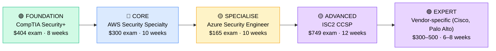

# How to Become a Cloud Security Engineer

**`CP19`** · **Cloud** · _Time to hire: 18–24 months_ · _Entry cost: $1,400–$2,100 USD_

> **Path summary:** This path takes you from IT Security Analyst or Sysadmin to a hired Cloud Security Engineer—specialising in security of cloud infrastructure (AWS, Azure, GCP). You'll design security architectures, implement access controls, encrypt data, manage compliance, and protect cloud environments from threats. High demand, premium salaries, rapidly growing specialisation.

---

## Role Overview

### What does a Cloud Security Engineer actually do?

A Cloud Security Engineer spends 60% of their time designing security controls: Identity and Access Management (IAM) policies, encryption strategies, network security (security groups, network ACLs), data protection, and compliance frameworks (SOC 2, PCI-DSS, HIPAA, ISO 27001). They work across the entire cloud stack: infrastructure, databases, applications, and data.

The other 40% is operational: threat detection and response, security audits, vulnerability assessments, penetration testing, and incident response. They collaborate with compliance teams, architects, and engineers to embed security into cloud designs from the start (shift-left security). This role bridges security and cloud engineering.

### Demand in 2026

- **Global job postings:** 6,800+ active roles on LinkedIn as of May 2026 [(source)](https://www.linkedin.com/jobs/search/?keywords=Cloud%20Security%20Engineer)
- **Growth rate:** 19% YoY; enterprise cloud adoption drives strong security demand [(source)](https://www.bls.gov/ooh/computer-and-information-technology/information-security-analysts.htm)
- **South Africa:** Very strong demand at financial institutions, healthcare, and large enterprises. Compliance and data protection regulations (POPIA, banking rules) drive hiring.
- **Remote availability:** High (65–75%)—security architecture and policy work is remote-friendly; some on-site incident response required.

---

## Who Is This Path For?

### Ideal starting backgrounds

| Background | Readiness | What you already have |
|---|---|---|
| IT Security Analyst / SOC analyst | ✅ Strong start | Security fundamentals; needs cloud depth |
| Cloud Engineer + security interest | ✅ Strong start | Cloud knowledge; needs security specialisation |
| System Administrator | 🟡 Good with gaps | Infrastructure knowledge; needs security training |
| Network Administrator | 🟡 Good with gaps | Network security concepts; needs cloud + application security |
| Recent security graduate / bootcamp | 🟡 Good with gaps | Security theory; needs cloud hands-on experience |
| Penetration tester | 🟡 Good with gaps | Offensive security; needs defensive cloud security knowledge |

### You're ready to start this path if you can:

- Explain IAM (Identity and Access Management) and least-privilege access concepts
- Understand encryption (symmetric, asymmetric, key management)
- Know what SOC 2, PCI-DSS, and HIPAA require at a high level
- Have foundational networking and systems knowledge
- Be interested in learning cloud platforms and security services
- Have or be working toward CompTIA Security+ or equivalent

> **Not ready yet?** Start with [CompTIA Security+](CP50_Security_Security_Plus.md) first. You need solid security fundamentals before cloud specialisation.

---

## Certification Sequence

### Visual path

---

## Certification Path & Timeline

### Stage 1 — Foundation (Months 0–2)

**Goal:** Establish security fundamentals if not already certified.

| Cert | Code | Cost (USD) | Study Time | Why it matters |
|---|---|---:|---:|---|
| CompTIA Security+ | `SY0-701` | $404 | 8–10 weeks | Covers cryptography, access control, threat management, compliance. Foundational for all security roles. |

**Stage 1 total:** $404 USD · R7,272 ZAR · 2–3 months

**Study approach:** Use Professor Messer's free videos + Udemy practice exams. Focus on encryption, IAM, and compliance sections—directly relevant to cloud security. Complete 100+ practice questions.

**Lab requirement:** Set up a home lab: create users/groups, implement file permissions, use encryption tools (VeraCrypt, BitLocker). 15–20 hours.

---

### Stage 2 — Cloud Security Specialisation (Months 2–6)

**Goal:** Get AWS Security Specialty—the anchor credential for Cloud Security Engineer roles.

| Cert | Code | Cost (USD) | Study Time | Why it matters |
|---|---|---:|---:|---|
| AWS Certified Security – Specialty | `SCS-C03` | $300 | 10–12 weeks | AWS security services (IAM, KMS, VPC, CloudTrail, GuardDuty, etc.). Required by most cloud security roles. |

**Stage 2 total:** $300 USD · R5,400 ZAR · 3 months

**Study approach:** Use A Cloud Guru, Udemy, or Linux Academy. Deep dive into AWS security services: IAM policies, encryption, network security, compliance auditing. Complete 100+ practice questions. Schedule when scoring 90%+.

**Lab requirement:** Build 5 security labs in AWS: 1) IAM policy design, 2) VPC with security groups and NACLs, 3) encryption with KMS, 4) CloudTrail audit logging, 5) WAF rules. 40+ hours total.

---

### Stage 3 — Multi-Cloud & Advanced (Months 6–12)

**Goal:** Add Azure security and advanced cloud security knowledge.

| Cert | Code | Cost (USD) | Study Time | Why it matters |
|---|---|---:|---:|---|
| Microsoft Azure Security Engineer (AZ-500) | `AZ-500` | $165 | 10–12 weeks | Azure security services. Many enterprises use multi-cloud; this differentiates you. |
| ISC2 Certified Cloud Security Professional (CCSP) | `CCSP` | $749 | 12–14 weeks | Advanced cloud security framework. Demonstrates professional-level expertise. |

**Stage 3 total:** $914 USD · R16,452 ZAR · 8–10 weeks (concurrent study possible)

**Study approach:** AZ-500 covers Azure security services (Azure AD, Azure Key Vault, etc.). CCSP is comprehensive; study architectural frameworks, governance, and compliance. Complete 80+ practice questions per cert.

**Project milestone:** Design a complete security architecture for a hypothetical enterprise multi-cloud environment: IAM policies, encryption strategy, network segmentation, compliance controls, threat detection, and incident response procedures. Document professionally.

---

### Stage 4 — Specialised Focus (Months 12–18, Optional)

**Goal:** Master advanced security topics or vendor-specific platforms.

| Cert | Code | Cost (USD) | Study Time | Why it matters |
|---|---|---:|---:|---|
| Cisco Certified Associate CyberOps (CCNA CyberOps) | `200-201` | $330 | 10 weeks | Threat detection and response. Valuable if targeting SOC/incident response roles. |
| OR Palo Alto Networks Certified Associate (PCNSA) | `PCNSA` | $395 | 8 weeks | Firewall and cloud security. Strong in security-first enterprises. |

**Stage 4 total:** $330–395 USD · R5,940–7,110 ZAR · 8–10 weeks

> **Optional at hire time:** Many Cloud Security Engineers land roles after Stage 2–3 (AWS Security + Azure) and complete advanced certs on the job.

---

## Timeline & Cost Summary

| Stage | Certs | Duration | Cost (USD) | Cost (ZAR) |
|---|---|---|---:|---:|
| Stage 1 — Foundation | Security+ | Months 0–2 | $404 | R7,272 |
| Stage 2 — Cloud Security | AWS Security Specialty | Months 2–6 | $300 | R5,400 |
| Stage 3 — Multi-Cloud | Azure (AZ-500) | Months 6–12 | $165 | R2,970 |
| **Total to hireable** | | **18–20 months** | **$869** | **R15,642** |
| Optional Advanced | CCSP / Vendor certs | Months 12–18 | $330–749 | R5,940–13,482 |

**Study hours required:** 400–500 hours total. Assumes 12–15 hours/week over 18–24 months.

---

## Salary Progression

> All figures: median base salary, not including bonuses/equity. ZAR = USD × 18 baseline (verified May 2026). Sources: Robert Half 2026, Glassdoor, PayScale, LinkedIn Salary.

| Experience Level | USD/year | ZAR/year | GBP/year | EUR/year | AUD/year |
|---|---:|---:|---:|---:|---:|
| Entry / Junior (0–2 yrs) | $95,000 | R1,710,000 | £76,000 | €89,000 | A$154,000 |
| Mid-level (2–5 yrs) | $115,000 | R2,070,000 | £92,000 | €108,000 | A$186,000 |
| Senior (5–8 yrs) | $130,000 | R2,340,000 | £104,000 | €122,000 | A$211,000 |
| Lead / Principal (8+ yrs) | $160,000 | R2,880,000 | £128,000 | €150,000 | A$259,000 |

**South Africa note:** Cloud Security Engineers at Johannesburg-based banks and enterprises earn R61,000–R83,000/month (entry), scaling to R85,000–R110,000/month for mid-level. Financial sector pays premium for security expertise. Remote positions for international firms push mid-level to R85,000–R125,000/month.

**Salary accelerators:** AWS Security Specialty cert adds 15–20% premium. CCSP adds 15%. Azure/GCP security certs add 10% each. Industry expertise (banking, healthcare) adds 15–20%.

---

## First Job Strategy

### Month 0–3: Build Security Foundation

1. **Study Security+** — 10 hours/week. Understand encryption, IAM, compliance fundamentals.
2. **Set up AWS Free Tier account** — Explore security services: IAM, KMS, VPC.
3. **Build first security lab** — Create IAM users/groups with least-privilege policies. Document. Time: 10 hours.
4. **Join security community** — r/cybersecurity, SANS OnDemand, AWS security forums.
5. **Document learning** — GitHub repo with security configurations, policy templates, and explanations.

### Month 3–9: Build Cloud Security Knowledge

1. **Study AWS Security Specialty** — 12 hours/week. Deep dive into AWS security services.
2. **Build 4–5 security labs:**
   - IAM policy design (role-based access control)
   - VPC with security groups and network ACLs
   - Encryption with KMS (data at rest)
   - CloudTrail and VPC Flow Logs (audit/monitoring)
   - WAF (Web Application Firewall) rules
   Time: 50–60 hours across 6 months.
3. **Study Azure security** — Parallel path. Start when AWS Security specialty is solid.
4. **Engage with security community** — Write 2–3 blog posts on cloud security topics. Demonstrate expertise publicly.

### Month 9–18: Certify & Apply

1. **Pass AWS Security Specialty + Azure (AZ-500)** — These are required credentials.
2. **Build capstone security project** — Design a complete security architecture for a multi-cloud enterprise. Include: IAM design, encryption strategy, compliance controls, threat detection, incident response.
3. **Interview prep** — Be ready to discuss: 1) IAM and least-privilege design, 2) encryption strategies, 3) security incident response, 4) compliance framework (SOC 2, PCI-DSS), 5) a security project you've designed.
4. **Apply to roles** — Cloud Security Engineer jobs are plentiful. Target enterprises, financial institutions, healthcare, and consultancies. Negotiate $95K–$130K for entry-level with certs + labs.

---

## A Day in the Life

### Cloud Security Engineer at a Large Bank — Entry Level

**08:00** — Review overnight security alerts. GuardDuty detected unusual API activity from an EC2 instance. Investigate CloudTrail logs; determine it's legitimate activity but from an unexpected user. Audit IAM permissions and tighten policy.

**09:00** — Security design review. New microservices application being deployed. Review the security architecture: network segmentation, encryption, IAM roles. Recommend additional controls for data at rest and in-transit.

**10:30** — Compliance audit. PCI-DSS compliance review for payment processing systems. Check encryption, access logs, and security group rules. Document findings and create remediation plan.

**12:00** — Lunch

**13:00** — Configuration management. Deploy updated IAM policies across all AWS accounts using Infrastructure-as-Code (Terraform). Test in dev environment first; promote to production.

**14:30** — Incident response. Help troubleshoot a security incident in a production environment. Coordinate with the incident response team; review logs and determine scope of compromise.

**15:30** — Documentation. Update security runbook with new threat detection rules and incident response procedures.

**16:30** — End of day. Escalate a critical vulnerability to the security team for remediation planning.

### Senior Cloud Security Engineer at a Consultancy (Dimension Data, BCX) — Mid Level

**09:00** — Client security architecture meeting. Major enterprise is planning cloud migration. You're designing the security architecture: multi-account setup, IAM governance, encryption strategy, compliance controls, threat detection, and incident response.

**10:30** — Proof of concept (PoC). Build a security controls PoC in AWS to demonstrate encryption, logging, and threat detection capabilities. Get customer feedback before full deployment.

**12:00** — Lunch

**13:00** — Governance and compliance work. Develop security policies and controls matrix for customer: align with NIST CSF, ISO 27001, or customer-specific requirements. Document in governance playbook.

**14:30** — Threat intelligence briefing. Review latest cloud security threats and vulnerabilities. Present relevant risks to customer and recommend controls. Update threat model.

**15:30** — Mentoring. Junior security engineer is designing their first cloud security architecture. Review their design; provide feedback on IAM policies, encryption decisions, and compliance controls.

**16:30** — End of day. Update project status and next steps for customer engagement.

---

## Related Paths & Progressions

| From here you can move to… | Why |
|---|---|
| [Security Architect](CP70_Security_Security_Architect.md) | Cloud security expertise + architecture thinking → security architect roles. |
| [Cloud Architect](CP18_Cloud_Cloud_Architect.md) | Cloud expertise + security focus → cloud architect roles with security specialisation. |
| [SOC Manager / Incident Response Lead](CP72_Security_SOC_Manager.md) | Cloud security + incident response expertise → SOC leadership. |
| [Chief Information Security Officer (CISO)](CP91_IT_Management_CISO.md) | Deep security expertise + business understanding → CISO track. |

---

## South Africa Context

### Market specifics

South African financial institutions (banks, insurance), healthcare, and large enterprises all need cloud security expertise. Compliance regulations (POPIA, banking rules, BEE requirements) drive strong demand. Consultancies (Dimension Data, BCX, Deloitte) employ large security teams.

Remote work is strong; many South African cloud security engineers work for international firms. Multi-cloud expertise (AWS + Azure) is highly valued.

BEE/EE considerations apply; credentials help level the field.

### SA-specific resources

| Resource | URL | Note |
|---|---|---|
| AWS Security | [https://aws.amazon.com/security/](https://aws.amazon.com/security/) | Official AWS security documentation. |
| Azure Security | [https://learn.microsoft.com/en-us/azure/security/](https://learn.microsoft.com/en-us/azure/security/) | Official Azure security documentation. |
| CompTIA Security+ | [https://www.comptia.org/certifications/security](https://www.comptia.org/certifications/security) | Official study materials. |
| r/cybersecurity (Reddit) | [https://www.reddit.com/r/cybersecurity/](https://www.reddit.com/r/cybersecurity/) | Active community. |
| ISC2 CCSP | [https://www.isc2.org/Certifications/CCSP](https://www.isc2.org/Certifications/CCSP) | Official CCSP details. |

---

## Frequently Asked Questions

**Q: Do I need Security+ before AWS Security Specialty?**
Strongly recommended. Security+ teaches cryptography, compliance, and security fundamentals that AWS Security Specialty assumes. AWS Security Specialty assumes you know these concepts.

**Q: How long does it take from zero to hired?**
If you have some IT background: 18–24 months (Security+ + AWS Security + Azure + labs). If starting from Help Desk: 2–3 years.

**Q: Is CCSP worth it for a Cloud Security Engineer?**
Yes, but not required for entry-level roles. AWS Security Specialty is required for hire; CCSP is professional-level (valuable after 2–3 years experience). Get hired first with AWS Security, then pursue CCSP.

**Q: Should I focus on AWS, Azure, or GCP security?**
Start with AWS (60%+ market share). Add Azure (enterprise partnerships). GCP is growing but smaller. AWS + Azure expertise is highly valuable.

**Q: Can I do this while working full-time?**
Yes. Most cloud security engineers study nights/weekends while working in IT support, SOC, or admin roles. 12–15 hours/week = 18–24 months to hire.

---

## Sources & Further Reading

| # | Source | URL | Used for |
|---|---|---|---|
| 1 | LinkedIn Job Search | [https://www.linkedin.com/jobs/search/?keywords=Cloud%20Security%20Engineer](https://www.linkedin.com/jobs/search/?keywords=Cloud%20Security%20Engineer) | Job postings |
| 2 | AWS Security Specialty | [https://aws.amazon.com/certification/certified-security-specialty/](https://aws.amazon.com/certification/certified-security-specialty/) | Exam details |
| 3 | CompTIA Security+ | [https://www.comptia.org/certifications/security](https://www.comptia.org/certifications/security) | Exam details |
| 4 | Robert Half Salary Guide 2026 | [https://www.roberthalf.com/salary-guide/security-engineer](https://www.roberthalf.com/salary-guide/security-engineer) | Salary data |
| 5 | LinkedIn Salary Insights | [https://www.linkedin.com/salary/cloud-security-engineer-salary/](https://www.linkedin.com/salary/cloud-security-engineer-salary/) | Crowdsourced data |
| 6 | BLS Information Security | [https://www.bls.gov/ooh/computer-and-information-technology/information-security-analysts.htm](https://www.bls.gov/ooh/computer-and-information-technology/information-security-analysts.htm) | Growth projections |
| 7 | AWS Security Services | [https://aws.amazon.com/security/](https://aws.amazon.com/security/) | Technical reference |
| 8 | ISC2 CCSP | [https://www.isc2.org/Certifications/CCSP](https://www.isc2.org/Certifications/CCSP) | Advanced certification |

---

*Template version: 2026-05-02 | Maintained by IT Career Roadmap | ZAR baseline: R18/$1 USD*
*File naming: `Career_Paths/CP19_Cloud_Cloud_Security_Engineer.md`*
