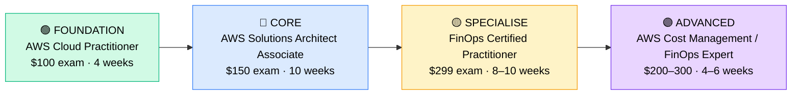

# How to Become a FinOps Engineer / Cloud Cost Optimisation Specialist

**`CP20`** · **Cloud** · _Time to hire: 12–18 months_ · _Entry cost: $600–$1,200 USD_

> **Path summary:** This path takes you from Cloud Engineer or Finance Analyst to a hired FinOps Engineer—specialising in cloud cost optimisation and financial management of cloud infrastructure. You'll analyse cloud spending, identify cost-saving opportunities, recommend optimisations, and ensure enterprises get ROI from cloud investments. Emerging specialisation with premium salaries and high demand.

---

## Role Overview

### What does a FinOps Engineer actually do?

A FinOps Engineer spends 50% of their time analysing cloud costs and usage: building dashboards, reporting spend by department/project, identifying waste, and recommending optimisations (right-sizing instances, using reserved capacity, shutting down unused resources). They work with cloud cost platforms (AWS Cost Explorer, Azure Cost Management, Cloudability, CloudHealth) and extract insights from raw billing data.

The other 50% is collaborative: working with engineering teams to implement optimisations, educating teams about cloud costs, and designing chargebacks/showbacks (billing models that make teams aware of what they're spending). FinOps sits at the intersection of technology, finance, and operations—a growing discipline as enterprises realise cloud costs can spiral without governance.

### Demand in 2026

- **Global job postings:** 3,200+ active roles on LinkedIn as of May 2026 [(source)](https://www.linkedin.com/jobs/search/?keywords=FinOps%20Engineer)
- **Growth rate:** 35% YoY; rapid growth as enterprises tackle cloud cost sprawl [(source)](https://www.finops.org/)
- **South Africa:** Growing demand at large enterprises, especially financial institutions managing multi-cloud budgets. FinOps is emerging but accelerating.
- **Remote availability:** Very high (80–85%)—entirely data and reporting driven; fully remote-friendly.

---

## Who Is This Path For?

### Ideal starting backgrounds

| Background | Readiness | What you already have |
|---|---|---|
| Cloud Engineer | ✅ Strong start | Deep cloud knowledge; needs cost/finance perspective |
| Finance / Cost Analyst | ✅ Strong start | Financial thinking; needs cloud platform knowledge |
| Business Analyst | 🟡 Good with gaps | Process thinking; needs cloud + financial depth |
| Data Analyst | 🟡 Good with gaps | Data analysis skills; needs cloud cost domain knowledge |
| System Administrator | 🟡 Good with gaps | Infrastructure knowledge; needs cloud + financial training |
| Recent IT graduate | 🟡 Good with gaps | Theory solid; needs hands-on cloud + cost analysis |

### You're ready to start this path if you can:

- Understand cloud service models (IaaS, PaaS, SaaS) and pricing models
- Read and interpret AWS/Azure billing data
- Explain concepts like reserved instances, spot instances, and on-demand pricing
- Be comfortable with spreadsheets and data analysis
- Understand basic cloud services (compute, storage, networking, databases)
- Have or be working toward AWS Cloud Practitioner

> **Not ready yet?** Start with [AWS Cloud Practitioner path](CP17_Cloud_Cloud_Engineer.md) or [Finance fundamentals](https://www.investopedia.com/). FinOps requires cloud + finance knowledge.

---

## Certification Sequence

### Visual path

---

## Certification Path & Timeline

### Stage 1 — Cloud Foundation (Months 0–2)

**Goal:** Establish cloud fundamentals and AWS basics.

| Cert | Code | Cost (USD) | Study Time | Why it matters |
|---|---|---:|---:|---|
| AWS Certified Cloud Practitioner | `CLF-C02` | $100 | 3–4 weeks | Cloud fundamentals, AWS services, basic cost concepts. Entry barrier. |

**Stage 1 total:** $100 USD · R1,800 ZAR · 4 weeks

**Study approach:** Use A Cloud Guru or Linux Academy free tier. Focus on understanding AWS services and pricing models. Complete 50+ practice questions. Schedule exam when scoring 85%+.

**Lab requirement:** Create AWS Free Tier account. Explore cost management tools: Cost Explorer, Budgets. Create your first cost report. 6–8 hours.

---

### Stage 2 — Cloud Architecture (Months 2–5)

**Goal:** Get Solutions Architect Associate to understand cloud architecture and service options (cost varies by architecture choices).

| Cert | Code | Cost (USD) | Study Time | Why it matters |
|---|---|---:|---:|---|
| AWS Certified Solutions Architect – Associate | `SAA-C03` | $150 | 10–12 weeks | Design scalable systems. Understanding architecture is critical for cost optimisation (better architecture = better cost). |

**Stage 2 total:** $150 USD · R2,700 ZAR · 3 months

**Study approach:** Use A Cloud Guru or Udemy. Focus heavily on service pricing and cost implications (e.g., data transfer costs, RDS vs. DynamoDB trade-offs). Complete 100+ practice questions.

**Lab requirement:** Design 3 cost-effective architectures: 1) a web app with minimal cost, 2) a highly available system optimised for cost, 3) a disaster recovery setup with cost considerations. 30+ hours.

---

### Stage 3 — FinOps Specialisation (Months 5–10)

**Goal:** Get FinOps Foundation Certification—the industry standard for FinOps professionals.

| Cert | Code | Cost (USD) | Study Time | Why it matters |
|---|---|---:|---:|---|
| FinOps Certified Practitioner (FOCP) | `FOCP` | $299 | 8–10 weeks | FinOps framework, cost analysis, optimisation strategies, governance. Validates FinOps expertise. Required by most FinOps roles. |

**Stage 3 total:** $299 USD · R5,382 ZAR · 2–3 months

**Study approach:** Use FinOps.org official study materials and Linux Academy FinOps course. Study the FinOps framework: inform (visibility), optimize (cost reduction), operate (governance). Complete 100+ practice questions. Schedule when scoring 90%+.

**Lab requirement:** Conduct a real or simulated cloud cost analysis: extract 12 months of billing data, build cost dashboards, identify optimisation opportunities (right-sizing, reserved instances, storage optimisation), calculate savings potential. 30+ hours.

---

### Stage 4 — Advanced / Specialist (Months 10–15, Optional)

**Goal:** Master advanced cost management or specialise in specific platforms.

| Cert | Code | Cost (USD) | Study Time | Why it matters |
|---|---|---:|---:|---|
| AWS Cost Management (vendor-specific) | `Custom` | $0–200 | 4–6 weeks | Advanced AWS cost features: compute optimizer, trusted advisor, cost allocation. |
| OR Azure Cost Management Certification | `Custom` | $0–200 | 4–6 weeks | Azure cost management and governance. Valuable if targeting Azure-heavy enterprises. |

**Stage 4 total:** $0–200 USD · R0–3,600 ZAR · 4–6 weeks

> **Optional at hire time:** Many FinOps Engineers land jobs after Stage 2–3 (Cloud Practitioner + SAA-C03 + FinOps Certified) and specialise further on the job.

---

## Timeline & Cost Summary

| Stage | Certs | Duration | Cost (USD) | Cost (ZAR) |
|---|---|---|---:|---:|
| Stage 1 — Foundation | CLF-C02 | Months 0–2 | $100 | R1,800 |
| Stage 2 — Architecture | SAA-C03 | Months 2–5 | $150 | R2,700 |
| Stage 3 — FinOps Specialist | FOCP | Months 5–10 | $299 | R5,382 |
| **Total to hireable** | | **12–15 months** | **$549** | **R9,882** |
| Optional Stage 4 | Vendor-specific | Months 10–15 | $0–200 | R0–3,600 |

**Study hours required:** 250–350 hours total. Assumes 12–15 hours/week over 12–15 months.

---

## Salary Progression

> All figures: median base salary, not including bonuses/equity. ZAR = USD × 18 baseline (verified May 2026). Sources: Robert Half 2026, Glassdoor, PayScale, LinkedIn Salary.

| Experience Level | USD/year | ZAR/year | GBP/year | EUR/year | AUD/year |
|---|---:|---:|---:|---:|---:|
| Entry / Junior (0–2 yrs) | $85,000 | R1,530,000 | £68,000 | €80,000 | A$138,000 |
| Mid-level (2–5 yrs) | $105,000 | R1,890,000 | £84,000 | €98,000 | A$170,000 |
| Senior (5–8 yrs) | $115,000 | R2,070,000 | £92,000 | €108,000 | A$186,000 |
| Lead / Principal (8+ yrs) | $145,000 | R2,610,000 | £116,000 | €136,000 | A$235,000 |

**South Africa note:** FinOps Engineers at Johannesburg-based large enterprises earn R54,000–R74,000/month (entry), scaling to R75,000–R95,000/month for mid-level. Consultancies pay similarly. Remote positions for international firms push salaries to R75,000–R110,000/month.

**Salary accelerators:** FinOps Certified Practitioner cert adds 15–20% premium. AWS + Azure dual certs add 15%. Cost analytics and reporting skills (demonstrated via portfolio) add 10%.

---

## First Job Strategy

### Month 0–3: Build Cloud Foundation

1. **Set up AWS Free Tier account** — Cost: $0. Explore services and cost tools.
2. **Study Cloud Practitioner** — 6 hours/week. Learn cloud services and basic pricing. Schedule exam for week 3–4.
3. **Begin cost analysis practice** — Download AWS billing data (even if free tier). Build simple cost reports in Excel/Google Sheets. Time: 8–10 hours.
4. **Join community** — r/finops, FinOps.org community, LinkedIn FinOps groups.
5. **Document learning** — GitHub repo with cost analysis templates, dashboards, and insights.

### Month 3–8: Build Architecture & Cost Knowledge

1. **Study Solutions Architect Associate** — 12 hours/week. Understand how architecture choices affect cost.
2. **Conduct 2–3 real cost analyses:**
   - Analyse your own AWS Free Tier usage; optimise costs
   - If employed: analyse company cloud spending (anonymised); find optimisation opportunities
   - Build case study: cost comparison of different architectures
   Time: 30–40 hours across 6 months.
3. **Create cost dashboards** — Use AWS Cost Explorer, Excel, or Power BI to create professional cost reports. Document methodology.
4. **Study FinOps framework** — Read FinOps.org materials; understand inform → optimize → operate cycle.

### Month 8–12: Certify & Apply

1. **Pass Solutions Architect Associate** — Must-have to understand cloud cost drivers.
2. **Study and pass FinOps Certified Practitioner** — 10 hours/week for 8 weeks. This is the anchor credential.
3. **Build capstone cost analysis project** — Conduct a deep analysis of enterprise cloud spending: identify cost drivers, find optimisation opportunities (right-sizing, reserved instances, storage, data transfer), calculate potential savings. Present professionally.
4. **Interview prep** — Be ready to discuss: 1) cloud cost drivers and optimisation strategies, 2) a cost analysis you've conducted, 3) reserved instances vs. on-demand trade-offs, 4) chargeback/showback strategies, 5) FinOps governance.
5. **Apply to FinOps roles** — Emerging field; roles are growing rapidly. Target large enterprises, consultancies, and cloud service partners. Negotiate $85K–$115K for entry-level with certs + portfolio.

---

## A Day in the Life

### FinOps Engineer at a Large Financial Enterprise — Entry Level

**08:00** — Review previous week's cloud costs. One AWS account spiked 40% month-over-month. Investigate: identify unused EC2 instances and oversized RDS database. Create recommendations for the engineering team.

**09:00** — Meeting with Cloud Infrastructure team. Present optimisation opportunities: right-sizing recommendations save $50K/month; reserved instance recommendations save another $30K/month. Negotiate timeline for implementation.

**10:30** — Dashboard update. Create a departmental cost report: breakdown by department, cost per service, trends. Share with finance and engineering stakeholders.

**12:00** — Lunch

**13:00** — Cost allocation project. Working on implementing cost allocation tags across all cloud resources. This allows billing to be accurately distributed to departments. Update tagging strategy and automation.

**14:30** — Forecasting. Based on current trends, forecast cloud costs for next 6 months. Provide budget recommendations to finance.

**15:30** — Documentation. Update the FinOps playbook: cost optimisation procedures, cost analysis templates, and governance policies.

**16:30** — End of day. Prepare weekly cost report for leadership showing spend, trends, and optimisation impact.

### Senior FinOps Engineer at a Cloud-Native Startup / Consultancy — Mid Level

**09:00** — Cost governance meeting. Implementing FinOps best practices across the organisation. Define cost policies: budgets per department, approval workflows for expensive resources, cost optimization KPIs.

**10:30** — Client engagement. Major customer is being charged $500K/month on cloud; they want to optimise. You're conducting a comprehensive cost analysis: identify expensive services, right-sizing opportunities, reserved instance recommendations, data transfer optimisations. Present findings and a roadmap to 30% cost reduction.

**12:00** — Lunch

**13:00** — Advanced analytics. Build a machine learning model to predict cloud costs and anomalies. Use historical data to forecast and identify unusual spending patterns.

**14:30** — Tool evaluation. Company is evaluating FinOps platforms (Cloudability, CloudHealth, Apptio). You're leading the evaluation: run cost analysis against each tool, assess reporting capabilities, recommend best fit.

**15:30** — Cross-functional collaboration. Work with engineering, finance, and procurement to design a comprehensive cost management strategy: budgeting, chargeback, governance, optimisation roadmap.

**16:30** — End of day. Update cost dashboard for executive team. Quarterly business review of cloud spend ROI coming up.

---

## Related Paths & Progressions

| From here you can move to… | Why |
|---|---|
| [Cloud Architect](CP18_Cloud_Cloud_Architect.md) | FinOps expertise + cloud architecture knowledge → architect roles with cost optimisation focus. |
| [Cloud Engineer (Senior)](CP17_Cloud_Cloud_Engineer.md) | FinOps can transition to engineering roles; cost management skills are valuable. |
| [Financial Operations Manager](CP92_IT_Management_Finance_Ops_Manager.md) | FinOps + business acumen → finance operations leadership. |
| [Business Analyst / Strategic Advisor](CP95_IT_Management_Business_Analyst.md) | FinOps demonstrates business value translation; transition to broader advisory roles. |

---

## South Africa Context

### Market specifics

FinOps is an emerging field in South Africa, but adoption is accelerating. Large financial institutions, retail chains, and digital enterprises are focusing on cloud cost management. Consultancies (Dimension Data, BCX, Deloitte) are hiring FinOps specialists to support clients. Remote work is very strong—data analysis and reporting are fully remote.

### SA-specific resources

| Resource | URL | Note |
|---|---|---|
| FinOps.org | [https://www.finops.org/](https://www.finops.org/) | Official FinOps community and certification. |
| AWS Cost Management | [https://aws.amazon.com/cost-management/](https://aws.amazon.com/cost-management/) | Official AWS cost tools documentation. |
| Azure Cost Management | [https://learn.microsoft.com/en-us/azure/cost-management-billing/](https://learn.microsoft.com/en-us/azure/cost-management-billing/) | Official Azure cost tools. |
| r/finops (Reddit) | [https://www.reddit.com/r/finops/](https://www.reddit.com/r/finops/) | Active community. |
| LinkedIn FinOps Groups | [https://www.linkedin.com/](https://www.linkedin.com/) | Search "FinOps South Africa." |

---

## Frequently Asked Questions

**Q: Do I need to be a Cloud Engineer to become a FinOps Engineer?**
No, but cloud knowledge is essential. You can come from finance background if you learn cloud fundamentals. Either path works: Cloud Engineer → FinOps or Finance Analyst → Cloud + FinOps.

**Q: How long does it take to become hireable as a FinOps Engineer?**
If you have Cloud Engineer experience: 6–12 months (Cloud Practitioner + SAA-C03 + FinOps cert). If starting from finance background: 12–18 months. If starting from zero: 18–24 months.

**Q: Is FinOps a new role?**
Yes, it's emerging. Many companies are still creating these roles as they realise cloud costs need active management. Growth is rapid (35% YoY); this is a good time to enter the field.

**Q: Can I learn FinOps while working as a Cloud Engineer?**
Yes, absolutely. Many Cloud Engineers upskill into FinOps 2–3 years into their career. You have direct access to cost data and optimisation opportunities at your job.

**Q: Is there really good career growth in FinOps?**
Yes. As the field matures, FinOps is becoming core to enterprise cloud strategy. Senior FinOps engineers are moving into cost management leadership roles. The salary progression is strong.

**Q: What's the difference between FinOps and Cloud Cost Optimization?**
FinOps is a discipline/methodology (framework for managing cloud costs). Cloud Cost Optimization is a specific practice within FinOps (the "optimize" phase). FinOps is broader—it includes governance, budgeting, and accountability.

---

## Sources & Further Reading

| # | Source | URL | Used for |
|---|---|---|---|
| 1 | LinkedIn Job Search | [https://www.linkedin.com/jobs/search/?keywords=FinOps%20Engineer](https://www.linkedin.com/jobs/search/?keywords=FinOps%20Engineer) | Job postings |
| 2 | FinOps Foundation | [https://www.finops.org/certification/](https://www.finops.org/certification/) | FOCP exam details |
| 3 | AWS Cloud Practitioner | [https://aws.amazon.com/certification/certified-cloud-practitioner/](https://aws.amazon.com/certification/certified-cloud-practitioner/) | Exam details |
| 4 | AWS Cost Management | [https://aws.amazon.com/cost-management/](https://aws.amazon.com/cost-management/) | Cost tools documentation |
| 5 | Robert Half Salary Guide 2026 | [https://www.roberthalf.com/salary-guide/cloud-engineer](https://www.roberthalf.com/salary-guide/cloud-engineer) | Salary data |
| 6 | LinkedIn Salary Insights | [https://www.linkedin.com/salary/finops-engineer-salary/](https://www.linkedin.com/salary/finops-engineer-salary/) | Crowdsourced data |
| 7 | BLS Cloud Computing Growth | [https://www.bls.gov/ooh/computer-and-information-technology/computer-systems-analysts.htm](https://www.bls.gov/ooh/computer-and-information-technology/computer-systems-analysts.htm) | Growth projections |
| 8 | A Cloud Guru | [https://www.acloudguru.com/](https://www.acloudguru.com/) | Training platform |

---

*Template version: 2026-05-02 | Maintained by IT Career Roadmap | ZAR baseline: R18/$1 USD*
*File naming: `Career_Paths/CP20_Cloud_FinOps_Engineer.md`*
