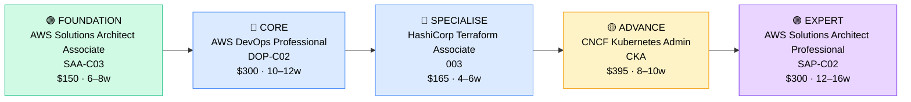

# How to Become a Cloud DevOps Engineer

**`CP21`** · **Cloud** · _Time to hire: 15–24 months_ · _Entry cost: $2,400–$3,200 USD_

> **Path summary:** This path takes you from a systems admin or junior cloud engineer to a hired Cloud DevOps Engineer role using AWS, Azure, Terraform, and Kubernetes, in 15–24 months. DevOps is in extreme demand globally and in South Africa — this is a high-ROI certification path.

---

## Role Overview

### What does a Cloud DevOps Engineer actually do?

A Cloud DevOps Engineer sits at the intersection of infrastructure, automation, and software delivery. You spend your day writing Infrastructure-as-Code (IaC) scripts in Terraform or CloudFormation, building CI/CD pipelines in Jenkins or GitHub Actions, and automating deployment processes. You're troubleshooting container orchestration issues in Kubernetes, monitoring system performance via CloudWatch or Prometheus, and collaborating with developers to speed up their release cycles. You're not writing business logic, but you are writing code — lots of shell scripts, Python automation, and YAML configuration. You solve problems like "how do we deploy 50 microservices safely?" and "why did production go down at 2 AM?"

DevOps Engineers typically work in medium to large organizations with complex infrastructure needs — cloud-native startups, financial services, e-commerce, telcos, and government agencies. Teams vary from 2–3 people in smaller companies to entire "platform engineering" teams at enterprises. Most roles are remote-friendly or hybrid; on-call duties are common (expect to rotate 1–2 weeks per month), and you'll be on Slack during incidents. Travel is rare unless you're supporting multiple global offices.

### Demand in 2026

- **Global job postings:** 185,000+ active DevOps/SRE roles on LinkedIn as of May 2026 [(source)](https://www.linkedin.com/jobs/search/?keywords=devops%20engineer)
- **Growth rate:** 18% YoY / BLS projects 13% growth through 2032 in cloud/infrastructure roles [(source)](https://www.bls.gov/ooh/computer-and-information-technology/network-and-computer-systems-administrators.htm)
- **South Africa:** Strong demand at Nedbank, Standard Bank, ABSA, MTN, Vodacom, Dimension Data, BCX, and EOH. Banks in particular are moving workloads to AWS and Azure aggressively — Q1 2026 saw 40+ DevOps roles posted by major SA financial institutions.
- **Remote availability:** 72% of global DevOps roles are remote or hybrid; 65%+ in South Africa allow remote work for SA-based engineers.

---

## Who Is This Path For?

### Ideal starting backgrounds

| Background | Readiness | What you already have |
|---|---|---|
| Sysadmin / Server admin | ✅ Strong start | Infrastructure thinking, automation mindset, shell scripting basics |
| Junior Cloud Engineer (AWS/Azure) | ✅ Strong start | Cloud platform knowledge, some IaC exposure |
| Network technician | ✅ Good start | TCP/IP, DNS, load balancing concepts |
| Developer / Software Engineer | ✅ Strong start | Git, scripting, YAML, CI/CD pipeline thinking |
| IT Support / Help Desk | 🟡 Good with gaps | Troubleshooting skills, but needs infrastructure depth first |
| Recent IT graduate | 🟡 Good with gaps | Theory solid; needs 6–12 months hands-on lab work |
| Complete career changer | 🔴 Difficult | Needs 6+ months of Linux/cloud foundation first |

### You're ready to start this path if you can:
- Navigate a Linux terminal confidently (ls, cd, grep, chmod, systemctl, ssh)
- Explain what containerization is and have used Docker at least once
- Set up and launch resources in AWS (EC2, RDS, S3) or Azure (VMs, databases)
- Write simple bash or Python scripts to automate a task

> **Not ready yet?** Start with [Cloud Foundation (R01)](../Roadmaps/R01_Cloud_Foundation.md) first to build Linux and cloud basics.

---

## Certification Sequence

### Visual path

---

### Stage 1 — Foundation (Months 0–8)

**Goal:** Prove you can operate AWS at scale and understand core cloud services, which every DevOps role requires.

| Cert | Code | Cost (USD) | Study Time | Why it matters |
|---|---|---:|---:|---|
| AWS Solutions Architect Associate | `SAA-C03` | $150 | 6–8 weeks | Employers expect this as a baseline. Covers VPC, EC2, RDS, S3, load balancing — fundamentals for infrastructure code. |

**Stage 1 total:** $150 USD · R2,700 ZAR · 6–8 weeks

**Study approach:** Use A Cloud Guru or Pluralsight (both have AWS SAA courses). Combine with Adrian Cantrill's deep-dive course on Udemy ($12–15). Do 40 practice questions daily in the final 3 weeks. Score 75%+ on 3 consecutive practice exams before booking the real exam. Schedule the exam during a low-work week — no distractions.

**Lab requirement:** Build a home lab in AWS Free Tier. Launch an EC2 instance, create a VPC with public and private subnets, set up an RDS database, and connect an application to it. Document this in a GitHub repo with clear instructions so you can rebuild it in 1 hour.

---

### Stage 2 — Core Specialisation (Months 8–20)

**Goal:** Become a certified AWS DevOps specialist. This is the anchor cert that hiring managers search for on entry-level CVs.

| Cert | Code | Cost (USD) | Study Time | Why it matters |
|---|---|---:|---:|---|
| AWS Certified DevOps Engineer – Professional | `DOP-C02` | $300 | 10–12 weeks | The job title cert. Covers CI/CD, infrastructure automation, monitoring, security. Hiring managers specifically look for DOP-C02. |
| HashiCorp Certified: Terraform Associate | `003` | $165 | 4–6 weeks | Infrastructure-as-Code is core DevOps skill. Terraform is the market standard. Every job posting mentions it. |

**Stage 2 total:** $465 USD · R8,370 ZAR · 14–18 weeks (overlapping study)

**Study approach:** 

- **DOP-C02:** Use Jon Bonso's Udemy DevOps course + practice exam package ($15). Also recommended: Linux Academy's DevOps course. Read the AWS CI/CD documentation (CodePipeline, CodeBuild, CodeDeploy) in detail — exam questions are specific. Expect 150–200 practice questions. Score 70%+ on 2 official AWS practice exams before booking.

- **Terraform Associate:** Use HashiCorp Learn (free) + Bonso's practice exam ($10). This is simpler than DOP-C02 and can be scheduled 4 weeks after starting DOP-C02 prep.

**Project milestone:** Deploy a multi-environment infrastructure using Terraform on AWS. Create development and production VPCs, EC2 instances with auto-scaling groups, an RDS database, and an S3 bucket with lifecycle policies. Write a CI/CD pipeline in GitHub Actions that automatically applies Terraform code on merge to main branch. Document this as a portfolio GitHub repo — this becomes your "DevOps in action" project.

---

### Stage 3 — Advanced Specialisation (Months 20–30)

**Goal:** Become Kubernetes-literate. Kubernetes skills command a 12–18% salary premium in 2026 DevOps job postings.

| Cert | Code | Cost (USD) | Study Time | Why it matters |
|---|---|---:|---:|---|
| CNCF Certified Kubernetes Administrator | `CKA` | $395 | 8–10 weeks | Container orchestration is now standard DevOps. CKA proves you can design, deploy, and manage Kubernetes clusters. High difficulty but high ROI. |

**Stage 3 total:** $395 USD · R7,110 ZAR · 8–10 weeks

**Study approach:** The CKA is primarily hands-on — you get a terminal in an exam environment and must execute tasks. Use KodeKloud's Kubernetes course (in-depth, highly recommended). Also study Kubernetes the Hard Way (free online guide). Practice with `kubectl` for 50+ hours. Use Killer.sh for final exam simulation (included in exam cost). Expect 2–3 attempts if you're new to Kubernetes.

**Lab requirement:** Spin up a 3-node Kubernetes cluster using kubeadm on EC2 or locally with Kind. Deploy a multi-tier application (web front-end, API backend, database) as Kubernetes pods. Write YAML manifests for Deployments, Services, ConfigMaps, and Secrets. Practice scaling, rolling updates, and debugging failed pods.

> **Optional at hire time:** Many people land their first Cloud DevOps Engineer job after Stage 2 (SAA + DOP + Terraform) and complete the CKA while employed. This is valid and common — Kubernetes is a 3–6 month on-the-job learning curve.

---

### Stage 4 — Expert / Leadership (18–36 months+)

**Goal:** Architect-level credentials. Pursue after 2–3 years of DevOps experience.

| Cert | Code | Cost (USD) | Study Time | Why it matters |
|---|---|---:|---:|---|
| AWS Solutions Architect – Professional | `SAP-C02` | $300 | 12–16 weeks | Moves you into architecture and strategy roles. Shows you can design large-scale, cost-optimized infrastructure for enterprises. |

> These certifications require real-world experience to pass — don't rush them. 18+ months of hands-on DevOps work before attempting SAP-C02. Experience → cert is the correct order.

---

## Timeline & Cost Summary

| Stage | Certs | Duration | Cost (USD) | Cost (ZAR) |
|---|---|---|---:|---:|
| Stage 1 — Foundation | SAA-C03 | Months 0–8 | $150 | R2,700 |
| Stage 2 — Core | DOP-C02, Terraform 003 | Months 8–20 | $465 | R8,370 |
| Stage 3 — Advanced | CKA | Months 20–30 | $395 | R7,110 |
| **Total to hireable** | **SAA-C03 + DOP-C02 + Terraform 003** | **15–20 months** | **$615** | **R11,070** |

**Study hours required:** ~600–800 hours total (Stage 1–2). Assumes 15–20 hours/week = 15–20 months. Full-time study: 3–4 months. Part-time while working: 6–9 months.

---

## Salary Progression

> All figures: median base salary, not including bonuses/equity. ZAR = USD × 18 baseline (verified May 2026). Sources: Robert Half 2026, Glassdoor, PayScale, LinkedIn Salary.

| Experience Level | USD/year | ZAR/year | ZAR/month |
|---|---:|---:|---:|
| Entry / Junior (0–2 yrs) | $90,000–$110,000 | R1,620,000–R1,980,000 | R135,000–R165,000 |
| Mid-level (2–5 yrs) | $125,000–$155,000 | R2,250,000–R2,790,000 | R187,500–R232,500 |
| Senior (5–8 yrs) | $160,000–$200,000 | R2,880,000–R3,600,000 | R240,000–R300,000 |
| Lead / Staff (8+ yrs) | $220,000–$280,000 | R3,960,000–R5,040,000 | R330,000–R420,000 |

**South Africa note:** Entry-level Cloud DevOps Engineers at Johannesburg-based banks (Nedbank, ABSA, Standard Bank) earn R120,000–R160,000/month (2026). Remote work for international tech companies pushes mid-level roles to R180,000–R280,000/month. Dimension Data, BCX, and EOH contract DevOps roles typically start at R110,000–R145,000/month.

**Salary accelerators:** AWS certs, Terraform proficiency, Kubernetes skills, and FinOps Foundation cert all command 8–15% premiums in SA job listings as of Q1 2026. Experience with GitLab/GitHub Actions CI/CD pipelines adds another 5–10% premium.

---

## First Job Strategy

### Month 0–3: Build the Foundation

1. **Set up your lab** — AWS Free Tier (free for 12 months; requires credit card but no charges if you stay within limits). Cost: $0. Alternative: GCP Free Tier or Azure sandbox.
2. **Begin SAA-C03** — Use A Cloud Guru or Adrian Cantrill's Udemy course ($12). Dedicate 15 hours/week.
3. **Join the community** — r/devops, r/aws, DevOps Slack communities (Cloud Native Computing Foundation Slack, AWS Community Discord). Follow DevOps engineers on LinkedIn and engage with their posts.
4. **Start documenting** — Create a GitHub profile. Build your first infrastructure repo: a simple VPC + EC2 + RDS setup. Write clear README files explaining your architecture.

### Month 3–6: Build Your Portfolio

- **Project 1:** Deploy a static website to S3 with CloudFront CDN and Route 53 DNS. Add versioning and lifecycle policies. Estimated time: 6–8 hours. This proves S3 mastery.

- **Project 2:** Automate EC2 provisioning with Terraform. Create a reusable module for a web server with auto-scaling. Deploy to 3 environments (dev, staging, prod) using Terraform workspaces. Estimated time: 12–15 hours. This is your "IaC portfolio piece."

- **Project 3:** Build a simple CI/CD pipeline using GitHub Actions. Trigger on code commit, run tests (even dummy tests), and deploy to staging automatically. Estimated time: 8–10 hours.

- **Project 4:** Create a Docker container for a simple Node.js or Python web app. Push to DockerHub. Document the Dockerfile and usage. Estimated time: 4–6 hours. Containers are foundational to DevOps.

### Month 6–15: Study for DOP-C02 & Terraform, Build More Complexity

- **Months 6–12:** Study DOP-C02 in depth. You now have AWS fundamentals, so focus on CI/CD, monitoring (CloudWatch, X-Ray), infrastructure automation, and compliance.

- **Month 9–12:** Complete Terraform Associate in parallel. Start converting your manual AWS projects into Terraform code.

- **Portfolio escalation:** Create a multi-tier application infrastructure in Terraform with environments. Deploy a real application (WordPress, a REST API, a database-backed web app) to AWS using your IaC. Document the deployment process.

### Month 12–24: Apply and Iterate

- **CV positioning:** Once you pass DOP-C02, title yourself on LinkedIn and your CV as "Cloud DevOps Engineer (AWS)" or "DevOps Engineer (AWS, Terraform)." Don't use "Junior" — it anchors salary expectations. Use "Entry-level" in cover letters if needed, but CV should reflect certs, not experience level.

- **Target companies:** Start with MSPs (managed service providers), cloud consulting firms, and large IT services companies (Dimension Data, BCX, EOH in SA). These hire entry-level DevOps. Mid-size tech companies often want 1–2 years. Banks and enterprises usually want 2+ years. Start with MSPs, get 1 year experience, then move to enterprise.

- **Interview prep:** Be ready to discuss:
  1. A complete infrastructure project you built and deployed (walk through the architecture, tools, and decisions)
  2. CI/CD pipeline design: "How would you deploy code 10 times a day safely?"
  3. Terraform modules: structure, reusability, state management
  4. Kubernetes basics (at least container concepts)
  5. Monitoring and alerting strategy for a microservices app

- **Salary negotiation:** Entry-level DevOps in SA negotiates to R150,000–R180,000/month if you have DOP-C02 + Terraform. Don't accept first offers. Benchmark against the salary table above. Remote roles for international companies start higher (R200,000+/month).

---

## A Day in the Life

### Cloud DevOps Engineer at a Financial Services Enterprise (Nedbank, ABSA) — Junior Level

**08:00** — Review overnight CloudWatch alarms. One Lambda function timed out during the nightly data pipeline — check the logs, identify that a dependency service was slow, and file a ticket with the database team.

**09:00** — Daily standup: report on 2 infrastructure projects in progress (migrating legacy servers to EC2, and setting up automated backups for RDS). Discuss blockers.

**10:00** — A developer asks for help debugging a deployment issue. The application won't start in staging. SSH into the EC2 instance, check systemd logs, find a configuration mismatch, and update the infrastructure code to prevent this in the future.

**11:30** — Work on a Terraform module for database backups. Write the HCL code, test locally with `terraform plan`, and submit a pull request for review.

**12:30** — Lunch.

**13:30** — Code review for a CI/CD pipeline PR from another engineer. Discuss security (ensuring secrets aren't logged), and suggest improvements for error handling.

**15:00** — Incident: a production web server crashed. Dig through logs, understand the root cause (disk full), fix it, and write an automation script to clean up old logs automatically. Document the incident.

**16:30** — Document your work in a wiki. Update the deployment runbook with the new backup process. Prepare for tomorrow's incident review meeting.

---

### Cloud DevOps Engineer at a Cloud-Native Startup (Tech/SaaS) — Mid-Level

**09:00** — Async standup. Review PRs and infrastructure change requests from overnight. One pull request adds a new microservice; review the Kubernetes manifests for resource limits, security, and configuration correctness.

**10:00** — Architecture meeting with the engineering team. Discuss how to scale the system for 10x user growth. Propose adding a CDN, auto-scaling policies, and database read replicas. Whiteboard the design.

**11:30** — Implement the CDN setup using Terraform. Create modules for CloudFront, update DNS, and test locally before deploying to staging.

**13:00** — Lunch.

**14:00** — Deploy a new version of the application to Kubernetes. Use Helm for templating, run through the CI/CD pipeline checks, and monitor the rolling update in real time. Everything succeeds.

**15:00** — On-call rotation: respond to a critical alert (database latency spike). Investigate metrics in Prometheus/Grafana, identify a slow query, and escalate to the data team. Set up a temporary workaround while they optimize.

**16:30** — Plan the next iteration of infrastructure improvements. Document decisions in ADRs (Architecture Decision Records).

**17:00** — End of day.

---

## Related Paths & Progressions

| From here you can move to… | Why |
|---|---|
| [Cloud Solutions Architect (CP22)](CP22_Cloud_Multi_Cloud_Architect.md) | You already know cloud infrastructure deeply; architecture adds strategic and cost-optimization thinking. |
| [Cloud Data Engineer (CP23)](CP23_Cloud_Cloud_Data_Engineer.md) | DevOps skills (automation, infrastructure) apply directly; add data pipeline expertise. |
| [Security Engineer (CP27)](CP27_Security_Security_Engineer.md) | Security + DevOps = "DevSecOps" — high demand, higher pay. Many move here after 2 years. |
| [SRE (Site Reliability Engineer)](../Roadmaps/R08_SRE_Roadmap.md) | Natural progression — DevOps → SRE adds reliability engineering and observability depth. |

---

## South Africa Context

### Market specifics

South Africa's DevOps job market is booming. Banks are the primary driver: Nedbank, ABSA, Standard Bank, and Investec all have large infrastructure transformation initiatives, moving on-premises systems to AWS and Azure. Telcos (MTN, Vodacom) are also heavy investors in DevOps automation. Consulting firms like Dimension Data, BCX, EOH, and Deloitte contract DevOps roles at premium rates (they charge clients R400–600/hour; engineers earn a portion of this).

Remote work is normal in this field — 65%+ of South African DevOps roles allow remote work. Many engineers in Cape Town, Johannesburg, and Durban work directly for US or UK tech companies remotely, earning international salaries (often 40–60% higher than SA corporate rates). This is highly competitive but achievable with strong certifications and a portfolio.

The BEE/EE environment in South Africa is a factor: previously disadvantaged individuals have better hiring odds in corporate roles, especially in the banking sector. However, certifications (AWS, Terraform, CKA) are color-blind credentials that help level the field for all candidates.

### SA-specific resources

| Resource | URL | Note |
|---|---|---|
| LinkedIn Jobs (South Africa) | [jobs.linkedin.com](https://jobs.linkedin.com) | Filter by "DevOps Engineer," location "South Africa." Check "remote" for international opportunities. |
| Dimension Data Careers | [dimensiondata.com/careers](https://www.dimensiondata.com/careers) | Actively hiring DevOps contractors. High rates, 6–12 month contracts. |
| BCX Careers | [bcx.co.za](https://www.bcx.co.za) | Johannesburg-based, large DevOps team. Entry-level roles available. |
| Coursera (SA Pricing) | [coursera.org](https://www.coursera.org) | AWS and cloud courses available. South African students get discounted rates on some programs. |
| JOZI DevOps Meetup | [meetup.com/jozi-devops](https://www.meetup.com/jozi-devops) | Monthly in-person meetups (Johannesburg). Network with SA DevOps professionals. |
| AWS User Group (SA) | [aws.amazon.com/usergroups/](https://aws.amazon.com/usergroups/) | Find local AWS communities in Cape Town, Johannesburg, Durban. |

---

## Frequently Asked Questions

**Q: Do I need a degree to become a Cloud DevOps Engineer?**

No. Certifications and portfolio projects matter far more than a degree in this field. Many successful DevOps engineers in SA have diplomas or no formal IT qualification — they proved themselves through certifications and GitHub projects. A degree can help you pass initial resume filters at very large enterprises, but it's not required.

**Q: How long does it realistically take from zero?**

If you're starting from absolute zero IT knowledge: 18–24 months. If you're a systems admin or developer: 12–18 months. If you're already AWS certified: 6–12 months to add DOP + Terraform + basic Kubernetes.

**Q: Which cert should I do first?**

AWS Solutions Architect Associate (SAA-C03). It's the foundation. Every job posting assumes you know basic AWS before specializing in DevOps.

**Q: Can I do this path while working full-time?**

Yes. At 15–20 hours/week (3–4 hours on 4–5 evenings), Stage 1 takes 8–10 weeks instead of 6 weeks. Stage 2 takes 18–24 weeks instead of 14 weeks. Total: 20–30 months part-time vs. 15–20 months full-time. Doable, but requires discipline. Many people use weekends for lab work and weekday evenings for studying.

**Q: Is Kubernetes (CKA) essential to land a first job?**

No. Land your first DevOps role with SAA-C03 + DOP-C02 + Terraform. Learn Kubernetes on the job (most companies will train you). CKA is valuable after 1 year of experience or if you target Kubernetes-heavy companies (tech startups, cloud-native teams).

**Q: What's the difference between DevOps Engineer and SRE (Site Reliability Engineer)?**

DevOps focuses on automation, CI/CD, and infrastructure code. SRE adds reliability engineering, observability, and incident response discipline. In practice, many companies use the titles interchangeably. SRE roles typically require 2–3 years of DevOps experience first.

**Q: Should I learn Azure or GCP instead of AWS?**

AWS first. 65% of job postings mention AWS, 25% mention Azure, 10% GCP (as of Q1 2026). Once you know AWS deeply, adding Azure (AZ-400) or GCP (Cloud Engineer Associate) takes 4–6 weeks. Many companies use multi-cloud, so flexibility is valuable.

---

## Sources & Further Reading

| # | Source | URL | Used for |
|---|---|---|---|
| 1 | LinkedIn Jobs (Global) | [linkedin.com/jobs/](https://www.linkedin.com/jobs/search/?keywords=devops%20engineer) | DevOps job posting volume and trend data |
| 2 | Bureau of Labor Statistics | [bls.gov/ooh](https://www.bls.gov/ooh/computer-and-information-technology/) | Employment growth projections for IT roles |
| 3 | AWS DevOps Professional | [aws.amazon.com/certification](https://aws.amazon.com/certification/certified-devops-professional/) | Official cert details, exam guide, cost |
| 4 | Robert Half 2026 Salary Guide | [roberthalf.com/salary-guide](https://www.roberthalf.com/) | Salary data for IT roles, including DevOps |
| 5 | HashiCorp Terraform Cert | [hashicorp.com/certification](https://www.hashicorp.com/certification/terraform-associate) | Terraform Associate exam details |
| 6 | CNCF Kubernetes | [cncf.io](https://www.cncf.io/certification/cka/) | CKA exam details and preparation resources |
| 7 | PayScale Salary Research | [payscale.com](https://www.payscale.com/research/US/Job=DevOps_Engineer/Salary) | Real-time DevOps salary data by region |
| 8 | SA Job Market (Indeed ZA) | [indeed.co.za](https://za.indeed.com/) | South African DevOps role postings and local salary benchmarks |

---

*Template version: 2026-05-02 | Maintained by IT Career Roadmap | ZAR baseline: R18/$1 USD*
*File naming: `Career_Paths/CP21_Cloud_Cloud_DevOps_Engineer.md`*
