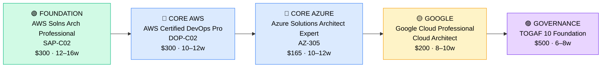

# How to Become a Multi-Cloud Architect

**`CP22`** · **Cloud** · _Time to hire: 24–36 months_ · _Entry cost: $3,100–$4,200 USD_

> **Path summary:** This is NOT an entry-level role. This path takes you from a Cloud DevOps Engineer or single-cloud Solutions Architect to a hired Multi-Cloud Architect role across AWS, Azure, and Google Cloud, designing enterprise-scale infrastructure for organizations managing multiple cloud platforms. Requires 5+ years cloud experience first.

---

## Role Overview

### What does a Multi-Cloud Architect actually do?

A Multi-Cloud Architect is a senior technical leader who designs infrastructure strategies across two or more cloud providers. You spend your time in architecture reviews, decision-making meetings, and whiteboarding complex infrastructure solutions. You're not writing code, but you're writing architecture decision records (ADRs), creating cost models, and defining governance frameworks. You're answering questions like "Should we build on AWS or Azure?" "How do we move this workload between clouds?" "What's our vendor lock-in risk, and how do we mitigate it?" You're mentoring junior engineers, leading cloud strategy for enterprises, and advising C-level executives on multi-cloud direction.

Most Multi-Cloud Architects work at large enterprises with complex infrastructure needs, consulting firms (Deloitte, Accenture, PwC), or cloud-native companies managing multiple platforms. Teams are typically smaller (2–5 architects) overseeing infrastructure for 50–200+ engineers. Remote work is standard at this level. Travel is common (client site visits, architecture workshops). You're rarely on-call directly, but you're responsible for escalations and major incidents.

### Demand in 2026

- **Global job postings:** 42,000+ "Multi-Cloud Architect" or "Cloud Solutions Architect (multi-cloud)" roles on LinkedIn as of May 2026 [(source)](https://www.linkedin.com/jobs/search/?keywords=multi-cloud%20architect)
- **Growth rate:** 22% YoY / BLS projects 16% growth through 2032 in enterprise architecture roles [(source)](https://www.bls.gov/ooh/computer-and-information-technology/)
- **South Africa:** Growing demand at Deloitte, PwC, KPMG, Accenture, Standard Bank, and Nedbank. Most SA multi-cloud roles are at consulting firms working with multinational clients. In-house multi-cloud architects are still rare in SA (estimated 150–200 roles in Q1 2026).
- **Remote availability:** 58% of global multi-cloud architect roles are remote or hybrid; SA-based architects can work for UK/US consulting firms remotely.

---

## Who Is This Path For?

### Prerequisites (Non-Negotiable)

This path is **only** for people with 5+ years of hands-on cloud experience. This is a senior role.

| Background | Readiness | Path Start |
|---|---|---|
| Cloud DevOps Engineer (5+ years) | ✅ Ideal | Start here; add architect certifications and strategy thinking |
| Cloud Solutions Architect – Single Cloud (AWS/Azure/GCP, 5+ yrs) | ✅ Ideal | Add second/third cloud certifications; learn multi-cloud governance |
| Cloud Security Architect (5+ years) | ✅ Strong fit | Add cloud architect certs; expand to infrastructure beyond security |
| Enterprise Architect (5+ years IT experience, new to cloud) | ✅ Strong fit | Fastest path; add cloud certifications and hands-on cloud time |
| Senior Sysadmin or Infrastructure Manager (10+ years) | 🟡 Possible | Requires intensive cloud bootcamp; 18+ months to readiness |
| Software Architect moving to infrastructure | 🟡 Possible | Learn cloud operations first; 3–4 years hands-on before architect role |
| Junior Cloud Engineer / Support | 🔴 Not ready | Gain 4–5 years of on-the-job experience first |

### You're ready to start this path if you can:
- Design a high-availability, multi-region infrastructure in at least two cloud platforms (AWS + Azure, or AWS + GCP)
- Explain why you'd choose AWS over Azure for a specific workload (and vice versa) with technical justification
- Discuss FinOps, cost optimization, and vendor lock-in strategies with confidence
- Have designed and deployed 5+ production systems of increasing complexity
- Understand TOGAF or equivalent enterprise architecture frameworks

> **Not ready yet?** Spend 3–5 years as a Cloud DevOps Engineer or Solutions Architect first. This is not a shortcut path.

---

## Certification Sequence

### Visual path

---

### Stage 1 — AWS Deep Architecture (Months 0–16)

**Goal:** Become an AWS Certified Solutions Architect at Professional level (SAP-C02). This is the first prerequisite for multi-cloud work.

| Cert | Code | Cost (USD) | Study Time | Why it matters |
|---|---|---:|---:|---|
| AWS Certified Solutions Architect – Professional | `SAP-C02` | $300 | 12–16 weeks | Proves deep AWS architecture knowledge. Required baseline for multi-cloud architects. |

**Stage 1 total:** $300 USD · R5,400 ZAR · 12–16 weeks

**Study approach:** This is a hard exam. You need 2–3 years of AWS experience minimum to pass (many people fail on first attempt). Use Jon Bonso's Udemy course (highly recommended for SAP-C02 depth), combined with Neal Davis's free notes on GitHub. Study architectural patterns: multi-tier applications, event-driven architectures, microservices, disaster recovery, cost optimization. Read AWS whitepapers on Well-Architected Framework. Do 200+ practice questions. Score 75%+ on 2 official AWS practice exams before booking.

**Lab requirement:** Design and document a complete enterprise architecture on AWS for a realistic scenario (e.g., a multi-region e-commerce platform, or a healthcare data processing system). Include VPCs, auto-scaling, databases, disaster recovery, monitoring. Create architecture diagrams (use draw.io or Lucidchart). This becomes part of your portfolio.

---

### Stage 2 — Azure & DevOps Specialisation (Months 14–28)

**Goal:** Get certified on Azure and understand DevOps at the architect level. Establish expertise in at least two clouds.

| Cert | Code | Cost (USD) | Study Time | Why it matters |
|---|---|---:|---:|---|
| AWS Certified DevOps Engineer – Professional | `DOP-C02` | $300 | 10–12 weeks | DevOps is critical for multi-cloud work (CI/CD, IaC, automation). Bridges AWS and infrastructure automation. |
| Microsoft Azure Solutions Architect Expert | `AZ-305` | $165 | 10–12 weeks | Proves Azure architecture knowledge. Combined with AWS SAP, positions you as a true multi-cloud architect. |

**Stage 2 total:** $465 USD · R8,370 ZAR · 20–24 weeks (overlapping study)

**Study approach:**

- **DOP-C02:** Use the same resources as the DevOps path. Focus on infrastructure automation, CI/CD patterns, monitoring at scale. This is foundational for multi-cloud operations.

- **AZ-305:** Use Microsoft Learn (official, free) combined with Scott Duffy's Udemy course or A Cloud Guru. Study Azure architecture patterns (App Service, AKS, Functions, Data Lake). Compare Azure solutions to AWS equivalents (EC2 vs. App Service, RDS vs. Azure Database, S3 vs. Blob Storage). Practice 150+ questions. Target 70%+ on practice exams.

**Project milestone:** Design a hybrid multi-cloud scenario. Create an architecture where workloads span AWS and Azure. Example: web tier on AWS, data tier on Azure, with cross-cloud networking and data replication. Document in architectural diagrams, decision records, and cost models.

---

### Stage 3 — Google Cloud Expansion (Months 26–36)

**Goal:** Add Google Cloud expertise. Now you have architect-level knowledge across all three major clouds.

| Cert | Code | Cost (USD) | Study Time | Why it matters |
|---|---|---:|---:|---|
| Google Cloud Professional Cloud Architect | `GCP-PCA` | $200 | 8–10 weeks | Completes the "big three" cloud platforms. Shows comprehensive multi-cloud competency. |

**Stage 3 total:** $200 USD · R3,600 ZAR · 8–10 weeks

**Study approach:** Use Google Cloud Learn (official, free) + A Cloud Guru or Coursera. Study GCP-specific services (Compute Engine, App Engine, Cloud Run, BigQuery, Bigtable). Compare to AWS and Azure equivalents. GCP is often fastest to learn because patterns are clearer; focus on differentiation (BigQuery, Dataflow, Vertex AI). Do 100+ practice questions. Target 70%+ on practice exams.

**Lab requirement:** Build a complete GCP infrastructure project. Multi-region setup, managed services, microservices with Cloud Run or GKE. Document how you'd migrate this workload to AWS or Azure.

---

### Stage 4 — Enterprise Architecture & Governance (Months 34–42)

**Goal:** Learn enterprise architecture frameworks. Add TOGAF or equivalent to position yourself as a true architect (not just a cloud engineer with certs).

| Cert | Code | Cost (USD) | Study Time | Why it matters |
|---|---|---:|---:|---|
| TOGAF 10 Foundation | `TOGAF-10` | $500 | 6–8 weeks | Enterprise architecture framework. Teaches governance, strategy, and cross-enterprise patterns. Critical for C-level advisory roles. |

**Stage 4 total:** $500 USD · R9,000 ZAR · 6–8 weeks

> These certifications require real-world experience to pass — you'll have 10+ years by this point. Experience → cert is the correct order.

---

## Timeline & Cost Summary

| Stage | Certs | Duration | Cost (USD) | Cost (ZAR) |
|---|---|---|---:|---:|
| Stage 1 — AWS Deep Architecture | SAP-C02 | Months 0–16 | $300 | R5,400 |
| Stage 2 — Azure & DevOps | DOP-C02, AZ-305 | Months 14–28 | $465 | R8,370 |
| Stage 3 — Google Cloud | GCP-PCA | Months 26–36 | $200 | R3,600 |
| Stage 4 — Enterprise Architecture | TOGAF-10 | Months 34–42 | $500 | R9,000 |
| **Total to senior architect** | **SAP-C02 + AZ-305 + GCP-PCA + TOGAF-10** | **36–42 months** | **$1,465** | **R26,370** |

**Study hours required:** ~500–700 hours over 36 months (part-time while working in a senior architect role). This is not a full-time learning period; you're in an architect position earning $140K–$200K while studying for advanced certs.

---

## Salary Progression

> All figures: median base salary, not including bonuses/equity. ZAR = USD × 18 baseline (verified May 2026). Sources: Robert Half 2026, Glassdoor, PayScale, LinkedIn Salary.

| Experience Level | USD/year | ZAR/year | ZAR/month |
|---|---:|---:|---:|
| Senior Cloud Architect (5–8 yrs) | $140,000–$170,000 | R2,520,000–R3,060,000 | R210,000–R255,000 |
| Principal/Multi-Cloud Architect (8–12 yrs) | $180,000–$230,000 | R3,240,000–R4,140,000 | R270,000–R345,000 |
| Distinguished Architect / VP Engineering (12+ yrs) | $240,000–$320,000 | R4,320,000–R5,760,000 | R360,000–R480,000 |

**South Africa note:** Multi-cloud architects at Deloitte, PwC, and KPMG in Johannesburg earn R280,000–R400,000/month (2026). Remote positions for international consulting firms pay R350,000–R600,000/month. In-house roles at Standard Bank or Nedbank: R250,000–R350,000/month.

**Salary accelerators:** TOGAF certification, 10+ years experience, public speaking (conferences), and published architecture patterns all push compensation up. Many architects at this level negotiate equity or consulting arrangements (higher take-home).

---

## First Job Strategy (Multi-Cloud Architect Positioning)

### Year 0–2: Establish AWS Expertise

Build deep expertise in one cloud (typically AWS). Target architect-level roles. Complete SAP-C02 certification.

### Year 2–4: Add Second Cloud Expertise

While working as an AWS architect, learn Azure. Complete AZ-305. Start taking on projects that span multiple clouds. Position yourself in interviews as "exploring multi-cloud strategy."

### Year 4–6: Multi-Cloud Positioning

Complete Google Cloud certification. Now you have credible multi-cloud expertise. Start targeting "Multi-Cloud Architect" or "Principal Architect" roles. Your CV should say "Designed and deployed systems across AWS, Azure, and Google Cloud."

### Year 6+: Leadership & Governance

Pursue TOGAF or similar framework cert. Move into advisory roles, consulting, or principal architect positions. Consider thought leadership: speak at conferences, publish architecture patterns, build personal brand.

---

## A Day in the Life

### Multi-Cloud Architect at a Consulting Firm (Deloitte, PwC) — Senior Level

**09:00** — Pre-call preparation. Review a client's multi-cloud strategy document. They're planning to migrate from on-premises to AWS and Azure. Prepare a technical assessment of their current infrastructure, identify risks, and outline a 3-year cloud migration roadmap.

**10:00** — Client workshop (via Zoom, 2 hours). Present the proposed multi-cloud strategy. Discuss vendor selection rationale (why AWS for web tier, Azure for data/analytics). Answer questions about lock-in, cost, and governance. Record the decision points.

**12:30** — Lunch.

**13:30** — Architecture review meeting with internal team. Discuss a design for a healthcare client moving to multi-cloud. Debate whether to use Azure for HIPAA compliance or AWS with third-party compliance layers. Make a recommendation.

**15:00** — Document the architecture decision in an ADR. Create detailed diagrams (draw.io) showing the proposed infrastructure, data flows, and disaster recovery across clouds.

**16:00** — Mentoring session with a junior architect. Review their first AWS Solutions Architect exam study plan. Discuss career progression.

**16:30** — Prepare a proposal for a new client engagement. Estimate hours needed for the engagement, technical resources, and cost.

**17:30** — End of day.

---

### Multi-Cloud Architect at a Large Enterprise (Bank) — Principal Level

**08:00** — Executive steering committee meeting. Discuss the enterprise cloud strategy for the next 3 years. Present cost analysis of multi-cloud vs. single-cloud. Recommend a phased approach: AWS for new projects, Azure for legacy migration, Google Cloud for AI/ML.

**09:30** — Architecture board review. A team submitted a design for a new data analytics platform. They chose single-cloud (AWS). Question whether they should leverage Azure for Data Lake, or keep it all on AWS. Approve with minor revisions.

**10:30** — One-on-one with a director of engineering. Discuss career path for architects in the organization. Recommend that high-potential engineers pursue multi-cloud certs.

**11:30** — Working session on FinOps. Review cloud spending across AWS and Azure. Identify optimization opportunities (reserved instances, spot instances, unused services). Work with finance to set chargeback models across clouds.

**12:30** — Lunch (on-site cafeteria).

**13:30** — Architecture clinic. Open office hours for engineers to ask architecture questions. A developer asks about the best way to synchronize data between AWS and Azure. Provide guidance.

**15:00** — Write a governance policy for multi-cloud security. Define which services are approved, which are forbidden, and which require approval. Route for compliance sign-off.

**16:00** — Prepare for a speaking engagement at a cloud conference next month. Draft slides on "Multi-Cloud Strategy for Enterprises."

**17:00** — End of day.

---

## Related Paths & Progressions

| From here you can move to… | Why |
|---|---|
| [Chief Technology Officer (CTO)](../Roadmaps/R12_CTO_Roadmap.md) | Natural progression from architect. Add business/strategy skills. |
| [Cloud Security Architect (CP29)](CP29_Security_Cloud_Security_Architect.md) | Shift focus to security architecture (same technical foundation). |
| [Enterprise Architect / TOGAF Master](../Roadmaps/R11_Enterprise_Architecture.md) | Expand beyond cloud to full enterprise architecture. |
| [VP of Engineering / Engineering Manager](../Roadmaps/R13_Engineering_Manager.md) | Move from technical track to people management. |

---

## South Africa Context

### Market specifics

Multi-cloud architecture is still emerging in South Africa. Most SA companies are in the early stages of cloud adoption (single-cloud, usually AWS). However, consulting firms like Deloitte, PwC, KPMG, Accenture, and IBM are actively hiring multi-cloud architects to serve multinational clients. These roles are typically based in Johannesburg (financial hub) and often involve travel to client sites (London, New York, Sydney).

Remote work is the default at consulting firms — many SA-based architects work for UK or US consulting practices remotely, earning international salaries. This is the highest-paying segment of SA IT (R350K–R600K/month for senior architects).

In-house multi-cloud roles are rarer. Banks (Nedbank, Standard Bank, ABSA, Investec) are beginning to adopt multi-cloud strategies for risk mitigation and vendor flexibility. Telcos (MTN, Vodacom) are also exploring multi-cloud. Estimate 150–200 in-house multi-cloud architect roles in SA as of Q1 2026, mostly at large banks and consulting firms.

BEE/EE is a factor at this level. Previously disadvantaged individuals with multi-cloud credentials are highly sought after by large corporations and consulting firms, especially for client-facing architect roles.

### SA-specific resources

| Resource | URL | Note |
|---|---|---|
| Deloitte South Africa Careers | [deloitte.com/za/careers](https://www.deloitte.com/za/careers) | Cloud and solutions architecture roles. Multi-cloud projects frequent. |
| PwC South Africa Careers | [pwc.com/za/careers](https://www.pwc.com/za/careers) | Consulting + technology roles. Many multi-cloud engagements. |
| KPMG South Africa | [kpmg.com/za/careers](https://www.kpmg.com/za/careers) | Cloud advisory and architecture practice. |
| Accenture South Africa | [accenture.com/za-en/careers](https://www.accenture.com/za-en/careers) | Cloud and infrastructure consulting. Multinational client base. |
| AWS User Group South Africa | [meetup.com/aws-sa](https://www.meetup.com/aws-south-africa/) | Monthly meetups in Johannesburg, Cape Town, Durban. Networking with architects. |
| LinkedIn (South Africa) | [linkedin.com/jobs](https://www.linkedin.com/jobs) | Filter for "Multi-Cloud Architect" + location South Africa. Check consulting firms first. |

---

## Frequently Asked Questions

**Q: Do I really need 5+ years of experience to start this path?**

Yes. This is not an entry-level role. You must have 5+ years of hands-on cloud experience (infrastructure, DevOps, or solutions architecture). Without it, the architect certs are premature and won't land you a job. Build single-cloud expertise first.

**Q: Should I get all three cloud certs (AWS SAP, Azure AZ-305, GCP) before applying?**

No. Get AWS SAP-C02 + Azure AZ-305, then start applying for multi-cloud architect roles. You can complete GCP in your first 6–12 months on the job. Most employers will fund continued certification.

**Q: Is TOGAF 10 required for a multi-cloud architect role?**

No. But it significantly improves your positioning for enterprise architect roles and C-level advisory positions. Many multi-cloud architects skip TOGAF and move directly into principal or VP positions. It's optional but valuable.

**Q: How much does a multi-cloud architect earn in South Africa?**

Entry-level (Senior Architect, 5–8 years): R210K–R255K/month (in-house). Consulting firms: R280K–R400K/month. Remote consulting (UK/US): R350K–R600K/month. Senior (Principal, 8+ years): R270K–R480K/month.

**Q: Can I move from a junior cloud role directly to multi-cloud architect?**

No. You need 5+ years first. Spend time as a Cloud DevOps Engineer (2 years), then Solutions Architect (3 years), then apply for multi-cloud architect. Shortcuts don't work at this level.

**Q: What's the difference between a Cloud Solutions Architect and a Multi-Cloud Architect?**

Cloud Solutions Architect typically specializes in one platform (AWS or Azure). Multi-Cloud Architect designs across multiple platforms and focuses on strategic questions (which cloud for which workload, vendor lock-in, cost optimization across clouds). Multi-cloud is more senior.

---

## Sources & Further Reading

| # | Source | URL | Used for |
|---|---|---|---|
| 1 | LinkedIn Jobs (Global) | [linkedin.com/jobs](https://www.linkedin.com/jobs/search/?keywords=multi-cloud%20architect) | Multi-cloud architect job postings and salary data |
| 2 | AWS Certified Solutions Architect – Professional | [aws.amazon.com/certification](https://aws.amazon.com/certification/certified-solutions-architect-professional/) | SAP-C02 exam details, study guide |
| 3 | Microsoft Azure Solutions Architect Expert | [microsoft.com/learning](https://learn.microsoft.com/en-us/certifications/azure-solutions-architect-expert/) | AZ-305 exam details, official Microsoft Learn path |
| 4 | Google Cloud Professional Cloud Architect | [cloud.google.com/certification](https://cloud.google.com/certification/cloud-architect) | GCP-PCA exam details, study resources |
| 5 | TOGAF 10 Certification | [opengroup.org/togaf](https://www.opengroup.org/togaf) | TOGAF 10 details, enterprise architecture framework |
| 6 | Robert Half 2026 Salary Guide | [roberthalf.com/salary-guide](https://www.roberthalf.com/) | IT architect salary data, multi-cloud premium |
| 7 | Deloitte Consulting | [deloitte.com](https://www.deloitte.com/) | Consulting firm hiring, multi-cloud projects |
| 8 | PayScale Architect Salary | [payscale.com](https://www.payscale.com/research/US/Job=Solutions_Architect/Salary) | Real-time architect compensation data |

---

*Template version: 2026-05-02 | Maintained by IT Career Roadmap | ZAR baseline: R18/$1 USD*
*File naming: `Career_Paths/CP22_Cloud_Multi_Cloud_Architect.md`*
