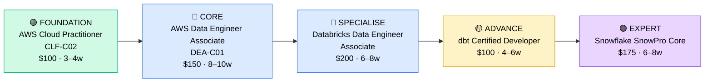

# How to Become a Cloud Data Engineer

**`CP23`** · **Cloud** · _Time to hire: 18–24 months_ · _Entry cost: $2,800–$3,800 USD_

> **Path summary:** This path takes you from a data analyst, junior developer, or ETL developer to a hired Cloud Data Engineer role, building scalable data pipelines on AWS, Azure, and Snowflake. If you enjoy working with data, this is a high-demand, well-paid specialization.

---

## Role Overview

### What does a Cloud Data Engineer actually do?

A Cloud Data Engineer builds and maintains data pipelines — the infrastructure that moves data from sources (databases, APIs, logs) to data warehouses and data lakes. You spend your time writing Python or Scala code to transform data, designing ETL (extract-transform-load) workflows, optimizing query performance, and ensuring data quality. You're not doing data science (building ML models), but you're solving problems like "How do we ingest 5TB of data per day?" and "Why did this pipeline fail at 2 AM?" You use tools like Spark, Airflow, dbt, Snowflake, and AWS services (Glue, S3, Lambda) daily.

Cloud Data Engineers work in data-heavy organizations: financial services, e-commerce, adtech, healthcare, and big tech. Teams typically have 3–8 data engineers, plus data analysts and data scientists downstream. Most roles are remote-friendly or hybrid. Some on-call duties (pipelines that fail at night), but less than DevOps. Travel is rare.

### Demand in 2026

- **Global job postings:** 98,000+ active "Data Engineer" roles on LinkedIn as of May 2026 [(source)](https://www.linkedin.com/jobs/search/?keywords=cloud%20data%20engineer)
- **Growth rate:** 21% YoY / BLS projects 36% growth through 2032 in data occupations [(source)](https://www.bls.gov/ooh/computer-and-information-technology/database-administrators-and-architects.htm)
- **South Africa:** Growing demand at financial services (Nedbank, Standard Bank, ABSA), insurance companies, and e-commerce platforms. MTN and Vodacom are building data platforms. Consulting firms (Deloitte, PwC, KPMG) also hire cloud data engineers.
- **Remote availability:** 68% of global data engineer roles are remote or hybrid; 60%+ in South Africa allow remote work.

---

## Who Is This Path For?

### Ideal starting backgrounds

| Background | Readiness | What you already have |
|---|---|---|
| Data Analyst | ✅ Strong start | SQL, data thinking, business context |
| Developer / Programmer | ✅ Strong start | Code fundamentals, logic, debugging skills |
| ETL Developer | ✅ Strong start | Pipeline understanding, tool knowledge (Informatica, Talend) |
| Database Administrator | ✅ Good start | Database design, indexing, performance tuning |
| Junior Data Scientist | ✅ Good start | Python, statistics, ML context |
| IT Support / Help Desk | 🟡 Good with gaps | Troubleshooting skills, but needs data + coding foundation |
| Recent IT graduate | 🟡 Good with gaps | Theory solid; needs hands-on data engineering time |
| Complete career changer | 🔴 Difficult | Needs 4–6 months of Python + SQL foundation first |

### You're ready to start this path if you can:
- Write SQL queries (SELECT, JOIN, GROUP BY, subqueries) fluently
- Write Python or Java code (loops, functions, error handling)
- Understand what a data pipeline is and why it matters
- Have used a cloud platform (AWS, Azure, or GCP) at least once

> **Not ready yet?** Start with [Data Foundation (R06)](../Roadmaps/R06_Data_Foundation.md) to learn SQL and Python basics.

---

## Certification Sequence

### Visual path

---

### Stage 1 — Cloud Foundations (Months 0–4)

**Goal:** Establish baseline cloud knowledge. AWS Cloud Practitioner is entry-level but sets expectations.

| Cert | Code | Cost (USD) | Study Time | Why it matters |
|---|---|---:|---:|---|
| AWS Cloud Practitioner | `CLF-C02` | $100 | 3–4 weeks | Baseline cloud knowledge. Quick cert, builds confidence. Many skip this if already familiar with AWS. |

**Stage 1 total:** $100 USD · R1,800 ZAR · 3–4 weeks

**Study approach:** Use Udemy courses (Andrew Brown or ExamPro, $10–12) or A Cloud Guru. Focus on understanding S3, Lambda, Glue, and RDS. This is simpler than solutions architect; mainly vocabulary and service awareness. Do 20–30 practice questions daily in the final week. Target 70%+ on practice exams.

**Lab requirement:** Launch an S3 bucket, upload data, and run a simple Lambda function on a schedule. Understand the basics of cloud resource management.

---

### Stage 2 — Core Data Engineering (Months 4–20)

**Goal:** Become an AWS Certified Data Engineer. This is the anchor cert for entry-level data engineer roles.

| Cert | Code | Cost (USD) | Study Time | Why it matters |
|---|---|---:|---:|---|
| AWS Certified Data Engineer – Associate | `DEA-C01` | $150 | 8–10 weeks | Job title cert. Covers Glue, Athena, Lambda, S3, and data pipeline patterns. Entry-level data engineers are expected to have this. |
| Databricks Certified Associate Data Engineer | Databricks Cert | $200 | 6–8 weeks | Spark expertise. Databricks is increasingly popular in cloud data stacks (especially after Databricks acquired Mosaic Intelligence). Valuable paired with AWS. |

**Stage 2 total:** $350 USD · R6,300 ZAR · 14–18 weeks (overlapping study)

**Study approach:**

- **DEA-C01:** Use Jon Bonso's Udemy course or A Cloud Guru. Study AWS Glue (ETL service), Athena (SQL queries on S3), Lambda (serverless compute), and data catalog services. Read AWS documentation on data engineering patterns. Do 100+ practice questions. Score 70%+ on 2 official AWS practice exams.

- **Databricks Cert:** Use Databricks Academy (official, free). Learn PySpark, Delta Lake, and Databricks notebook workflows. Do hands-on labs in the Databricks Community Edition (free). Databricks provides practice exams.

**Project milestone:** Build a complete ETL pipeline in AWS. Ingest data from a public API or S3 source. Transform it using AWS Glue (or Lambda + Python). Load it into a data lake (S3) or data warehouse. Write Spark jobs in Databricks. Create a simple analytics query on the result. Document in GitHub with code and architecture diagrams.

---

### Stage 3 — Data Transformation & Modern Stack (Months 18–28)

**Goal:** Master modern data transformation tools (dbt) and data warehouse platforms (Snowflake). These are industry standards.

| Cert | Code | Cost (USD) | Study Time | Why it matters |
|---|---|---:|---:|---|
| dbt Certified Developer | `dbt Cert` | $100 | 4–6 weeks | dbt (data build tool) is now standard in data engineering. Transforms raw data into analytics-ready datasets using SQL. Very popular in 2026. |
| Snowflake SnowPro Core | `SnowPro Core` | $175 | 6–8 weeks | Snowflake is the dominant cloud data warehouse (competes with BigQuery, Redshift). Cer proves you can design, manage, and query Snowflake. |

**Stage 3 total:** $275 USD · R4,950 ZAR · 10–14 weeks (overlapping study)

**Study approach:**

- **dbt Cert:** Use dbt Learn (official, free). Build data models, create tests, and generate documentation. Practice using dbt with Snowflake or BigQuery. The certification is practical (hands-on); expect to write dbt code.

- **SnowPro Core:** Use Snowflake University (official) or A Cloud Guru. Learn Snowflake architecture, data loading, querying, security, and performance tuning. Do 100+ practice questions. Target 70%+ on practice exams.

**Lab requirement:** Design a data warehouse in Snowflake. Load real data (e.g., Snowflake's sample datasets). Write dbt models to create analytics tables. Run queries and document performance. This becomes a portfolio project.

> **Optional at hire time:** Many people land their first Cloud Data Engineer job after Stage 2 (DEA-C01 + Databricks) and complete dbt + Snowflake on the job. This is common — data warehouses are learned in context.

---

### Stage 4 — Advanced Specialization (18–36 months+)

**Goal:** Expert-level data engineering. Pursue after 2+ years of experience.

| Cert | Code | Cost (USD) | Study Time | Why it matters |
|---|---|---:|---:|---|
| AWS Data Analytics Specialty | `DAS-C01` | $150 | 12–14 weeks | Advanced AWS data services (QuickSight, Kinesis, Lake Formation). Builds on DEA-C01. Salary +10–15%. |

> These require real-world experience — don't attempt before 2 years on the job.

---

## Timeline & Cost Summary

| Stage | Certs | Duration | Cost (USD) | Cost (ZAR) |
|---|---|---|---:|---:|
| Stage 1 — Cloud Foundations | CLF-C02 | Months 0–4 | $100 | R1,800 |
| Stage 2 — Core Data Engineering | DEA-C01, Databricks | Months 4–20 | $350 | R6,300 |
| Stage 3 — Data Transformation & Warehouse | dbt, SnowPro | Months 18–28 | $275 | R4,950 |
| **Total to hireable** | **DEA-C01 + Databricks + dbt + SnowPro** | **18–24 months** | **$725** | **R13,050** |

**Study hours required:** ~400–600 hours over 18–24 months. Assumes 15–18 hours/week = 18–24 months. Full-time study: 3–4 months.

---

## Salary Progression

> All figures: median base salary, not including bonuses/equity. ZAR = USD × 18 baseline (verified May 2026).

| Experience Level | USD/year | ZAR/year | ZAR/month |
|---|---:|---:|---:|
| Entry / Junior (0–2 yrs) | $95,000–$110,000 | R1,710,000–R1,980,000 | R142,500–R165,000 |
| Mid-level (2–5 yrs) | $120,000–$150,000 | R2,160,000–R2,700,000 | R180,000–R225,000 |
| Senior (5–8 yrs) | $155,000–$190,000 | R2,790,000–R3,420,000 | R232,500–R285,000 |
| Lead / Staff (8+ yrs) | $210,000–$260,000 | R3,780,000–R4,680,000 | R315,000–R390,000 |

**South Africa note:** Entry-level Cloud Data Engineers at Johannesburg financial firms earn R130,000–R170,000/month. Remote roles for international tech companies: R180,000–R280,000/month. With Snowflake + dbt expertise, salaries rise to R200,000–R300,000/month.

**Salary accelerators:** Snowflake certification, Spark/Scala expertise, and Airflow/orchestration skills all command 10–15% premiums in 2026.

---

## First Job Strategy

### Month 0–3: Build Foundations

1. **Set up your lab** — AWS Free Tier (12 months, free). Alternative: Databricks Community Edition (free forever, but limited compute).
2. **Begin CLF-C02 + DEA-C01** — Start with Udemy courses. 15–18 hours/week.
3. **Join the community** — r/dataengineering, dbt Slack community, Databricks forums.
4. **Start documenting** — GitHub repo. First project: simple ETL using Python + S3.

### Month 3–8: Portfolio Building

- **Project 1:** Ingest data from a public API (e.g., weather API, stock data) into S3. Transform with Python. Load to Athena for analysis. Estimated time: 10 hours.

- **Project 2:** Create an ETL pipeline using AWS Glue. Build a similar setup to a real data warehouse (raw → silver → gold layers). 15 hours.

- **Project 3:** Build a simple Spark job in Databricks. Transform a public dataset (e.g., NYC taxi rides, Kaggle dataset) and query results. 12 hours.

- **Project 4:** Set up a data warehouse schema in Snowflake (free trial). Load sample data, write queries, document. 8 hours.

### Month 8–18: Deep Study & Portfolio Expansion

- Study DEA-C01 in depth.
- Complete Databricks certification labs.
- Build a complete data pipeline: ingest → transform → load → query. Document well.

### Month 18–24: Apply & Iterate

- **CV positioning:** "Cloud Data Engineer (AWS, Snowflake)" or "Data Engineer (ETL, SQL, Python)" — don't use "junior" on CV. Use "entry-level" in cover letters.

- **Target companies:** Start with consulting firms (Deloitte, PwC, KPMG), financial services, and data-heavy startups. MSPs less relevant for data roles.

- **Interview prep:** Be ready to discuss:
  1. A complete ETL pipeline you built
  2. SQL optimization (indexing, query plans)
  3. Spark concepts (RDDs, DataFrames, partitioning)
  4. Data warehouse schema design (star schema, normalization)
  5. How you'd handle pipeline failures

- **Salary negotiation:** Entry-level data engineers in SA negotiate to R160,000–R200,000/month. Remote: R220,000+/month. Don't accept first offers.

---

## A Day in the Life

### Cloud Data Engineer at a Financial Services Firm — Junior Level

**08:00** — Review overnight pipeline runs. One ETL job timed out. Check AWS Glue logs, identify that the source API was slow, and adjust timeout values.

**09:00** — Standup: report on 2 projects (building a data mart for the finance team, optimizing a slow query).

**10:00** — Pair programming with a senior engineer. They review your dbt models. Discuss data quality tests and documentation.

**11:30** — Work on an ETL pipeline. Write Python code to ingest new data, transform it, and load to Snowflake. Test locally first, then push to staging.

**12:30** — Lunch.

**13:30** — Code review. Examine another engineer's Spark job. Suggest optimizations (partitioning, caching).

**15:00** — Analytics team requests a new data source. Design a pipeline to ingest it. Estimate effort and commit timeline.

**16:00** — Documentation. Update the data dictionary and pipeline runbook.

**17:00** — End of day.

---

### Cloud Data Engineer at a Tech Company — Mid-Level

**09:00** — Async standup. Review PRs from overnight. One PR adds a new data source; review for quality, performance, and maintainability.

**10:00** — Architecture discussion. Team is designing a new data warehouse for real-time analytics. Propose using a Lakehouse pattern (Delta Lake + Spark) vs. traditional warehouse. Whiteboard the pros/cons.

**11:00** — Implement the lakehouse design. Write Spark jobs, dbt models, and data quality tests.

**13:00** — Lunch.

**14:00** — Optimize a slow query. Query is taking 5 minutes; investigate query plan, identify missing index, add it. Query now runs in 10 seconds.

**15:00** — On-call rotation: respond to a data quality alert (duplicate records in a table). Debug the pipeline, identify the root cause, and fix it.

**16:00** — Mentor a junior engineer on dbt best practices.

**17:00** — End of day.

---

## Related Paths & Progressions

| From here you can move to… | Why |
|---|---|
| [Data Analyst (Career) ](../Roadmaps/R06_Data_Analyst.md) | You already know data pipelines; add analytics and visualization. |
| [Data Scientist](../Roadmaps/R07_Data_Scientist.md) | Your data engineering skills carry over; add ML and statistics. |
| [Cloud Solutions Architect (CP21)](CP21_Cloud_Cloud_DevOps_Engineer.md) | Move from data pipelines to cloud infrastructure strategy. |

---

## South Africa Context

### Market specifics

Cloud data engineering is growing rapidly in South Africa. Banks (Nedbank, Standard Bank, ABSA, Investec) are building modern data platforms. Insurance and fintech companies (Discovery, Capitec, Sanlam) are investing heavily. E-commerce platforms (Takealot, Superbalist) and telecom (MTN, Vodacom) also hire data engineers.

Remote work is very common — many SA data engineers work for US/UK tech companies remotely, earning 40–60% more than in-house roles. The barrier to entry is certifications + a portfolio; geography doesn't matter.

### SA-specific resources

| Resource | URL | Note |
|---|---|---|
| LinkedIn Jobs (South Africa) | [linkedin.com/jobs](https://www.linkedin.com/jobs) | Filter for "Data Engineer" + "South Africa." Many remote opportunities. |
| dbt Community (South Africa) | [dbt.com/community](https://www.dbt.com/community) | Join dbt Slack; find SA data engineers. |
| Databricks (SA) | [databricks.com](https://www.databricks.com/) | Community Edition (free); participate in online workshops. |
| Coursera (SA Pricing) | [coursera.org](https://www.coursera.org/) | Data engineering courses available; SA student discounts. |

---

## Frequently Asked Questions

**Q: Do I need to know Python to become a Cloud Data Engineer?**

Yes. You'll use Python (or Scala/Java) daily. Strong SQL is also required. If you don't know Python, spend 4–6 weeks learning before starting this path.

**Q: Is dbt essential?**

Not for your first job, but highly valuable. Most teams use dbt by 2026. Learning it on the job is possible, but having dbt skills on your CV makes you 15–20% more competitive.

**Q: Should I focus on AWS or Snowflake first?**

Both. AWS (specifically Glue, Athena, Lambda) handles data ingestion. Snowflake is the data warehouse. You need both in 2026. Learn AWS first (it's broader); add Snowflake after your first job.

**Q: How long does it take to land a first Cloud Data Engineer job?**

18–24 months from zero (if you know Python/SQL) to hired. If you're a data analyst or developer: 12–18 months.

**Q: Can I do this while working full-time?**

Yes. 15–18 hours/week = 18–24 months part-time. Many people study evenings and weekends.

---

## Sources & Further Reading

| # | Source | URL | Used for |
|---|---|---|---|
| 1 | LinkedIn Jobs | [linkedin.com/jobs](https://www.linkedin.com/jobs/search/?keywords=cloud%20data%20engineer) | Data engineer job postings and demand |
| 2 | AWS Data Engineer Associate | [aws.amazon.com/certification](https://aws.amazon.com/certification/certified-data-engineer-associate/) | DEA-C01 exam details |
| 3 | Databricks Certification | [databricks.com/learn/certification](https://www.databricks.com/learn/certification) | Databricks Data Engineer cert |
| 4 | dbt Certification | [dbt.com/certifications](https://www.dbt.com/certifications) | dbt Developer certification details |
| 5 | Snowflake SnowPro | [snowflake.com/certification](https://www.snowflake.com/en/certification/) | Snowflake cert details and study resources |
| 6 | Robert Half 2026 Salary Guide | [roberthalf.com](https://www.roberthalf.com/) | Data engineer salary benchmarks |
| 7 | PayScale Data Engineer | [payscale.com](https://www.payscale.com/research/US/Job=Data_Engineer/Salary) | Real-time salary data |

---

*Template version: 2026-05-02 | Maintained by IT Career Roadmap | ZAR baseline: R18/$1 USD*
*File naming: `Career_Paths/CP23_Cloud_Cloud_Data_Engineer.md`*
