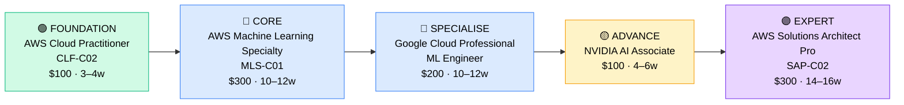

# How to Become a Cloud AI/ML Engineer

**`CP24`** · **Cloud** · _Time to hire: 18–30 months_ · _Entry cost: $2,600–$3,800 USD_

> **Path summary:** This path takes you from a software developer, data analyst, or junior data scientist to a hired Cloud AI/ML Engineer role, building production ML systems on AWS, Google Cloud, and NVIDIA. This is a high-demand, high-pay specialization requiring strong programming + ML theory.

---

## Role Overview

### What does a Cloud AI/ML Engineer actually do?

A Cloud AI/ML Engineer builds production machine learning systems. You're not running experiments in Jupyter notebooks (that's data scientists); instead, you're taking ML models from research and productionizing them at scale. You write Python code to prepare training data, build ML pipelines, tune models, and deploy them to production. You manage model training infrastructure (GPUs, distributed training), implement monitoring for model drift, and ensure models perform reliably in production. You solve problems like "How do we retrain this model daily without downtime?" and "Why did this model's predictions degrade last week?"

Cloud AI/ML Engineers work in tech companies, startups, financial services, and large enterprises investing in AI. Teams typically have 2–10 ML engineers, plus data scientists and data engineers. Most roles are remote-friendly. Some on-call duties (model retraining failures), but less than DevOps. Travel rare.

### Demand in 2026

- **Global job postings:** 156,000+ active "Machine Learning Engineer" roles on LinkedIn as of May 2026 [(source)](https://www.linkedin.com/jobs/search/?keywords=ML%20engineer)
- **Growth rate:** 36% YoY / Projected highest growth among all IT roles through 2032 [(source)](https://www.bls.gov/ooh/)
- **South Africa:** Growing demand at banks, fintech (Capitec, Takealot), consulting firms, and tech startups. Limited supply of qualified ML engineers — this is a gap market in SA.
- **Remote availability:** 74% of global ML engineer roles are remote or hybrid; 70%+ in South Africa allow remote work.

---

## Who Is This Path For?

### Ideal starting backgrounds

| Background | Readiness | What you already have |
|---|---|---|
| Software Developer / Engineer | ✅ Strong start | Programming, software best practices, deployment experience |
| Data Scientist | ✅ Strong start | ML theory, statistics, model training experience |
| Data Engineer | ✅ Good start | Data pipelines, infrastructure thinking, but needs ML theory |
| Data Analyst (with Python) | ✅ Good start | Data knowledge; needs programming depth and ML theory |
| Junior ML Researcher | ✅ Strong start | ML theory; needs production engineering skills |
| Physics/Math graduate (with programming) | ✅ Good start | Math/theory foundation; needs programming and cloud experience |
| IT Support / Help Desk | 🔴 Not ready | Needs 6+ months of Python + ML foundation first |
| Complete career changer | 🔴 Very difficult | Needs strong math background + 12+ months of programming + ML study |

### You're ready to start this path if you can:
- Write Python code fluently (classes, decorators, testing, error handling)
- Explain basic ML concepts (supervised vs. unsupervised, training/validation/test split, overfitting)
- Have trained at least one ML model (even a simple one) using scikit-learn or similar
- Understand cloud platform basics (AWS, Azure, or GCP) — have launched a service

> **Not ready yet?** Start with [Programming Foundation (R02)](../Roadmaps/R02_Programming.md) and [ML Foundation (R08)](../Roadmaps/R08_ML_Foundation.md) first.

---

## Certification Sequence

### Visual path

---

### Stage 1 — Cloud & ML Foundations (Months 0–4)

**Goal:** Establish cloud basics and validate ML knowledge at foundational level.

| Cert | Code | Cost (USD) | Study Time | Why it matters |
|---|---|---:|---:|---|
| AWS Cloud Practitioner | `CLF-C02` | $100 | 3–4 weeks | Cloud vocabulary and services overview. Quick cert, builds confidence. |

**Stage 1 total:** $100 USD · R1,800 ZAR · 3–4 weeks

**Study approach:** Use Udemy courses. Focus on understanding SageMaker (AWS's ML service), Lambda, and RDS. 10–12 hours/week. Score 70%+ on practice exams.

**Lab requirement:** Launch an AWS account, explore SageMaker, and run a simple pre-built ML example (e.g., using SageMaker's built-in algorithms on sample data).

---

### Stage 2 — Core ML Engineering (Months 4–20)

**Goal:** Become certified in ML on AWS. This is the anchor cert for production ML engineering.

| Cert | Code | Cost (USD) | Study Time | Why it matters |
|---|---|---:|---:|---|
| AWS Certified Machine Learning – Specialty | `MLS-C01` | $300 | 10–12 weeks | Job title cert. Covers SageMaker, model training, tuning, deployment, and monitoring. Essential for AWS ML engineer roles. |
| Google Cloud Professional ML Engineer | `GCP-ML` | $200 | 10–12 weeks | GCP ML expertise. Google's Vertex AI is increasingly competitive with SageMaker. Having both AWS + GCP ML skills is valuable. |

**Stage 2 total:** $500 USD · R9,000 ZAR · 20–24 weeks (overlapping study)

**Study approach:**

- **MLS-C01:** Use Jon Bonso's Udemy course or A Cloud Guru. Study SageMaker deeply: data preparation, algorithm selection, hyperparameter tuning, automated ML (AutoML). Understand feature stores, model registries, and A/B testing. Do 150+ practice questions. Score 75%+ on 2 official AWS practice exams.

- **GCP ML Engineer:** Use Google Cloud Learn (official, free) + Coursera courses. Study Vertex AI, BigQuery ML, and TensorFlow integration. Compare to AWS. Do 100+ practice questions. Target 70%+.

**Project milestone:** Build a complete ML pipeline on AWS SageMaker. Prepare data (in S3), train a model (XGBoost or TensorFlow), tune hyperparameters, evaluate on validation set, and deploy to a SageMaker endpoint. Write Python code to call the deployed model. Implement monitoring for model performance. Document in GitHub.

---

### Stage 3 — Advanced ML & GPU Acceleration (Months 18–28)

**Goal:** Master ML infrastructure and hardware optimization. NVIDIA certification shows you understand GPU computing and optimization.

| Cert | Code | Cost (USD) | Study Time | Why it matters |
|---|---|---:|---:|---|
| NVIDIA Certified Associate - AI | `NVIDIA AI Assoc` | $100 | 4–6 weeks | GPU computing, CUDA, and AI optimization. NVIDIA certifications are highly respected in ML circles. |

**Stage 3 total:** $100 USD · R1,800 ZAR · 4–6 weeks

**Study approach:** Use NVIDIA's official training (free + paid options). Learn CUDA basics, GPU memory management, and optimization for deep learning. Labs are hands-on with NVIDIA GPUs.

**Lab requirement:** Implement a deep learning model (CNN or RNN) using PyTorch or TensorFlow on GPU hardware. Profile the code, optimize for throughput, and document performance improvements.

> **Optional at hire time:** Many people land their first ML Engineer job after Stage 2 (AWS MLS-C01 + GCP ML) and complete NVIDIA on the job or self-study. This is common — GPU optimization is often learned in context.

---

### Stage 4 — Advanced Architecture (18–36 months+)

**Goal:** Architect-level ML systems. Pursue after 2–3 years of production ML experience.

| Cert | Code | Cost (USD) | Study Time | Why it matters |
|---|---|---:|---:|---|
| AWS Solutions Architect – Professional | `SAP-C02` | $300 | 14–16 weeks | Enterprise ML architecture. Moves you into ML platform/architecture roles. |

> Requires real-world experience — don't attempt before 2 years on the job.

---

## Timeline & Cost Summary

| Stage | Certs | Duration | Cost (USD) | Cost (ZAR) |
|---|---|---|---:|---:|
| Stage 1 — Cloud Foundations | CLF-C02 | Months 0–4 | $100 | R1,800 |
| Stage 2 — Core ML Engineering | MLS-C01, GCP-ML | Months 4–20 | $500 | R9,000 |
| Stage 3 — Advanced ML & GPU | NVIDIA AI Assoc | Months 18–28 | $100 | R1,800 |
| **Total to hireable** | **MLS-C01 + GCP-ML + NVIDIA** | **18–24 months** | **$700** | **R12,600** |

**Study hours required:** ~600–900 hours over 18–24 months (heavy math/ML theory + programming + cloud platform learning). Assumes 18–24 hours/week = 18–24 months. Full-time: 4–5 months. Part-time: 6–9 months is ambitious (this path is more demanding than most).

---

## Salary Progression

> All figures: median base salary, not including bonuses/stock/equity (ML roles often have significant equity packages). ZAR = USD × 18 baseline (verified May 2026).

| Experience Level | USD/year | ZAR/year | ZAR/month |
|---|---:|---:|---:|
| Entry / Junior (0–2 yrs) | $100,000–$125,000 | R1,800,000–R2,250,000 | R150,000–R187,500 |
| Mid-level (2–5 yrs) | $140,000–$180,000 | R2,520,000–R3,240,000 | R210,000–R270,000 |
| Senior (5–8 yrs) | $200,000–$260,000 | R3,600,000–R4,680,000 | R300,000–R390,000 |
| Lead / Staff (8+ yrs) | $280,000–$400,000 | R5,040,000–R7,200,000 | R420,000–R600,000 |

**South Africa note:** Entry-level ML Engineers at fintech/banks in Johannesburg earn R180,000–R240,000/month. Remote roles for international tech companies: R250,000–R400,000/month. With deep learning expertise (PyTorch, transformers), salaries push R280,000–R450,000/month.

**Salary accelerators:** Deep learning expertise, LLM/transformer knowledge, computer vision skills, and NVIDIA certification all command 15–25% premiums. Startup equity packages can 2–3x base salary.

---

## First Job Strategy

### Month 0–3: Build Foundations

1. **Set up your lab** — AWS Free Tier (12 months), Google Colab (free GPU), or Kaggle Notebooks (free GPU).
2. **Begin CLF-C02 + MLS-C01** — Udemy courses. 18–20 hours/week.
3. **Join the community** — r/MachineLearning, r/learnmachinelearning, Fast.ai forums, Kaggle community.
4. **Start documenting** — GitHub repo. First project: ML model using scikit-learn or TensorFlow.

### Month 3–8: Deep Learning & Portfolio

- **Project 1:** Train an image classification model using a pre-trained CNN (ResNet, EfficientNet). Use a public dataset (CIFAR-10, ImageNet subset). Deploy to SageMaker. Estimated time: 12 hours.

- **Project 2:** Build an NLP model (text classification or sentiment analysis) using BERT or similar. Fine-tune on a custom dataset. Deploy as an API. 15 hours.

- **Project 3:** Create an end-to-end ML pipeline: data preparation (pandas, scikit-learn) → feature engineering → model training → evaluation → deployment to SageMaker. 20 hours.

- **Project 4:** Participate in a Kaggle competition. Build an ML model, submit predictions. Document your approach. 15–20 hours.

### Month 8–18: Deep Study & Advanced Topics

- Complete MLS-C01 in depth.
- Study GCP ML (Vertex AI, BigQuery ML).
- Build ML projects with production considerations: versioning, monitoring, A/B testing.

### Month 18–24: Apply & Iterate

- **CV positioning:** "ML Engineer (AWS SageMaker, TensorFlow)" or "Machine Learning Engineer (Python, PyTorch)" — don't use "junior" on CV. Show projects, not just certs.

- **Target companies:** Start with ML-focused startups, tech companies with ML teams, fintech, and consulting firms. Also check Kaggle job board.

- **Interview prep:** Be ready to discuss:
  1. A complete ML project you built (data → model → deployment)
  2. How you'd approach a new ML problem (problem framing, data collection, baseline)
  3. Python, pandas, scikit-learn, TensorFlow/PyTorch fluency
  4. Hyperparameter tuning strategies (grid search, Bayesian optimization)
  5. Model evaluation metrics and why you chose them

- **Salary negotiation:** Entry-level ML Engineers in SA negotiate to R200,000–R280,000/month. Remote: R300,000+/month. ML roles pay significantly more than general software engineering.

---

## A Day in the Life

### Cloud ML Engineer at a Fintech Company — Junior Level

**08:00** — Review ML training job logs from overnight. A model training job failed due to GPU memory issues. Investigate, adjust batch size, and resubmit.

**09:00** — Standup: report on 2 projects (building a fraud detection model, and refactoring the feature pipeline for performance).

**10:00** — Pair programming with a senior ML engineer. They review your data preparation code. Discuss data quality issues and how to handle them.

**11:30** — Work on feature engineering. Write pandas code to create new features for the fraud model. Think about feature interactions and statistical significance.

**12:30** — Lunch.

**13:30** — Train a model on prepared data. Tune hyperparameters using SageMaker's automatic hyperparameter tuning. Evaluate on validation set.

**15:00** — Code review. Examine another engineer's PyTorch code for a classification task. Suggest improvements for model architecture.

**16:00** — Documentation. Write a runbook for the fraud model: how it's trained, evaluated, and deployed.

**17:00** — End of day.

---

### Cloud ML Engineer at a Tech Company — Mid-Level

**09:00** — Async standup. Review PRs from overnight. One PR improves model inference latency; review the optimizations.

**10:00** — Architecture discussion. Team is redesigning the ML platform. Discuss how to handle model versioning, A/B testing, and rollbacks. Whiteboard the design.

**11:00** — Implement a feature store integration. Engineers need quick access to pre-computed features. Build the infrastructure and APIs.

**13:00** — Lunch.

**14:00** — Respond to a model drift alert (model performance degraded in production). Analyze recent data, identify distribution shift, and trigger retraining.

**15:00** — Mentor a junior ML engineer on production ML best practices: model monitoring, data validation, and incident response.

**16:00** — Write an ML Ops improvement proposal. Suggest automating model retraining and evaluation.

**17:00** — End of day.

---

## Related Paths & Progressions

| From here you can move to… | Why |
|---|---|
| [Data Scientist](../Roadmaps/R07_Data_Scientist.md) | Shift from engineering to research; focus on novel models. |
| [Cloud Solutions Architect (CP21)](CP21_Cloud_Cloud_DevOps_Engineer.md) | Apply ML expertise to broader cloud infrastructure roles. |
| [AI/ML Product Manager](../Roadmaps/R14_Product_Manager.md) | Move from building to managing ML products. |

---

## South Africa Context

### Market specifics

South Africa has significant demand for ML engineers but very limited supply. Banks (Nedbank, Standard Bank, ABSA) are investing in fraud detection, credit risk, and algorithmic trading. Fintech (Capitec, 22Seven, Luno) is hiring aggressively. E-commerce (Takealot, Superbalist) uses ML for recommendations. Consulting firms (Deloitte, PwC, Accenture) hire ML engineers for client projects.

Remote work is very common — many SA ML engineers work for US/UK tech companies remotely, earning 2–3x SA corporate salaries. The barrier is strong certifications + portfolio projects.

ML is male-dominated globally, but SA companies are actively seeking diversity. Women and previously disadvantaged individuals with ML credentials are highly sought after.

### SA-specific resources

| Resource | URL | Note |
|---|---|---|
| LinkedIn Jobs (South Africa) | [linkedin.com/jobs](https://www.linkedin.com/jobs) | Filter "ML Engineer" + "South Africa." Many remote roles. |
| Kaggle Competitions | [kaggle.com/competitions](https://www.kaggle.com/competitions) | Build portfolio, network with SA ML practitioners. |
| Fast.ai | [fast.ai](https://www.fast.ai/) | Free deep learning courses; used by many South African ML engineers. |
| Coursera (SA) | [coursera.org](https://www.coursera.org/) | ML/AI courses; SA student discounts available. |

---

## Frequently Asked Questions

**Q: Do I need a math degree to become an ML Engineer?**

No, but strong math (calculus, linear algebra, statistics) helps significantly. Self-taught ML engineers with strong programming + self-studied math can succeed. Many completed Andrew Ng's ML course or similar before entering the field.

**Q: Is it easier to start as a Data Scientist or ML Engineer?**

Data Scientist is typically easier to enter (fewer production engineering skills required). ML Engineer pays more but requires stronger software engineering. If you have strong programming, go ML Engineer. If stronger in statistics, start as Data Scientist and transition.

**Q: Should I focus on TensorFlow or PyTorch?**

PyTorch is more popular in 2026 for research and new models. TensorFlow is more common in production at larger enterprises. Learn both (they're similar). Start with PyTorch if learning fresh.

**Q: How important is GPU experience?**

Very. Modern ML requires GPUs for training. You should have hands-on experience with GPU computing, CUDA optimization, and distributed training before your first job. Cloud GPUs (AWS P3, Google TPU, Azure GPU) are what you'll use.

**Q: Can I do this path while working as a software engineer?**

Yes, but it's demanding. 20–24 hours/week for 24 months is realistic. You need time for coding projects, math study, and cloud hands-on time. Many people transition from software engineer → ML engineer using off-hours study.

---

## Sources & Further Reading

| # | Source | URL | Used for |
|---|---|---|---|
| 1 | LinkedIn Jobs | [linkedin.com/jobs](https://www.linkedin.com/jobs/search/?keywords=ML%20engineer) | ML engineer job postings and demand |
| 2 | AWS Machine Learning Specialty | [aws.amazon.com/certification](https://aws.amazon.com/certification/certified-machine-learning-specialty/) | MLS-C01 exam details |
| 3 | Google Cloud ML Engineer | [cloud.google.com/certification](https://cloud.google.com/certification/machine-learning-engineer) | GCP ML cert details |
| 4 | NVIDIA AI Certification | [nvidia.com/training](https://www.nvidia.com/training/) | NVIDIA cert and training |
| 5 | Fast.ai Deep Learning | [fast.ai](https://www.fast.ai/) | Free deep learning courses (highly recommended) |
| 6 | Kaggle | [kaggle.com](https://www.kaggle.com/) | ML competitions and datasets for portfolio |
| 7 | Robert Half 2026 Salary Guide | [roberthalf.com](https://www.roberthalf.com/) | ML engineer salary benchmarks |
| 8 | PayScale ML Engineer | [payscale.com](https://www.payscale.com/research/US/Job=Machine_Learning_Engineer/Salary) | Real-time salary data |

---

*Template version: 2026-05-02 | Maintained by IT Career Roadmap | ZAR baseline: R18/$1 USD*
*File naming: `Career_Paths/CP24_Cloud_AI_ML_Engineer.md`*
