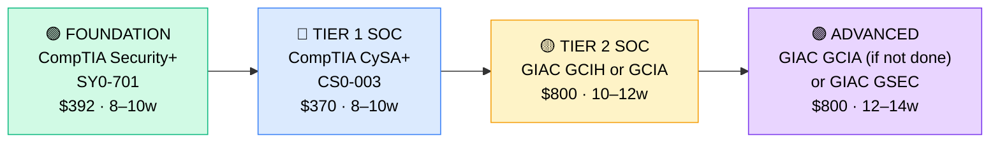

# How to Become a Security Analyst (SOC) – Tier 1/2

**`CP25`** · **Security** · _Time to hire: 6–12 months_ · _Entry cost: $1,200–$1,700 USD_

> **Path summary:** This is the most entry-level security role in the industry. This path takes you from IT support to a hired SOC (Security Operations Center) Analyst role in 6–12 months. Very high demand, entry-level friendly, and the first step on any security career ladder. Once hired, you work toward Tier 2, then can pivot to penetration testing, threat hunting, or security engineering.

---

## Role Overview

### What does a SOC Analyst actually do?

A SOC Analyst monitors security alerts and responds to incidents. You sit in front of a dashboard (SIEM like Splunk, Elastic, or Microsoft Sentinel), watching for suspicious activity. When an alert fires (unusual login, malware detection, data exfiltration attempt), you triage it: Is it real? Is it urgent? You investigate logs, run forensics, escalate to senior analysts or incident response, and document findings. You're not hacking or defending networks (that's other roles), but you're the first line of defense.

Most work happens in Security Operations Centers (SOCs) at large enterprises, banks, consulting firms, and MSPs. Teams vary from 5–100+ analysts, often 24/7/365 coverage (shift work common). The work is reactive (responding to alerts) but can be intense during incidents. On-call rotations are common. Remote work is increasingly available (2026 trend), especially for Tier 1.

### Demand in 2026

- **Global job postings:** 152,000+ "Security Operations Analyst" or "SOC Analyst" roles on LinkedIn as of May 2026 [(source)](https://www.linkedin.com/jobs/search/?keywords=SOC%20analyst)
- **Growth rate:** 19% YoY / BLS projects 13% growth through 2032 [(source)](https://www.bls.gov/ooh/computer-and-information-technology/information-security-analysts.htm)
- **South Africa:** Extremely high demand. All major banks (Nedbank, Standard Bank, ABSA, FNB), insurance companies, and government agencies are hiring SOC analysts. Shortage of certified candidates. Q1 2026 saw 80+ open SOC roles in SA.
- **Remote availability:** 52% of global SOC roles are remote or hybrid; growing to 60%+ in South Africa.

---

## Who Is This Path For?

### Ideal starting backgrounds

| Background | Readiness | What you already have |
|---|---|---|
| IT Support / Help Desk | ✅ Ideal | Troubleshooting mindset, customer handling, basic security awareness |
| Junior System Administrator | ✅ Ideal | Infrastructure knowledge, Windows/Linux basics, log reading |
| Network technician | ✅ Good start | Network protocols, traffic analysis, routing/switching |
| Recent IT graduate | ✅ Good start | Theory solid; needs hands-on certification time |
| IT teacher / Trainer | ✅ Good start | Communication skills (valuable for incident documentation) |
| Military/Government IT | ✅ Strong start | Security clearance, compliance knowledge |
| Complete career changer (with IT basics) | 🟡 Possible | Needs 2–4 weeks of security fundamentals first |

### You're ready to start this path if you can:
- Explain what a firewall does and how it works
- Understand basic network protocols (TCP/IP, DNS, HTTP)
- Be comfortable using Windows and Linux command-line tools
- Demonstrate foundational cybersecurity awareness (no clicking suspicious links, strong passwords, etc.)

> **Not ready yet?** Start with [IT Foundation (R00)](../Roadmaps/R00_IT_Foundation.md) first.

---

## Certification Sequence

### Visual path

---

### Stage 1 — Foundation (Months 0–10)

**Goal:** CompTIA Security+ certification. Baseline security knowledge, expected by all employers for SOC roles.

| Cert | Code | Cost (USD) | Study Time | Why it matters |
|---|---|---:|---:|---|
| CompTIA Security+ | `SY0-701` | $392 | 8–10 weeks | Industry standard baseline. Required for SOC Tier 1 jobs. Covers cryptography, network security, threat management, compliance. |

**Stage 1 total:** $392 USD · R7,056 ZAR · 8–10 weeks

**Study approach:** Use Professor Messer (free YouTube course) or Jason Dion's Udemy Security+ course ($15). Read the CompTIA Security+ study guide. Do 50+ practice questions daily in final 2 weeks. Score 80%+ on 2 official CompTIA practice exams before booking. This cert is achievable for IT support staff; don't underestimate it, but don't fear it.

**Lab requirement:** Set up a home lab with virtual machines. Practice network security (firewalls, VLANs), access control (ACLs, RBAC), and encryption concepts. Deploy a simple firewall (pfSense or similar, free).

---

### Stage 2 — SOC Analyst Specialisation (Months 8–18)

**Goal:** CompTIA CySA+ (Cybersecurity Analyst). This is the SOC-specific cert that hiring managers want.

| Cert | Code | Cost (USD) | Study Time | Why it matters |
|---|---|---:|---:|---|
| CompTIA Cybersecurity Analyst+ | `CS0-003` | $370 | 8–10 weeks | SOC analyst certification. Covers threat analysis, vulnerability management, incident response, and SIEM tools. This is the job title cert. |

**Stage 2 total:** $370 USD · R6,660 ZAR · 8–10 weeks

**Study approach:** Use Jon Bonso's Udemy CySA+ course ($15) or A Cloud Guru. Focus on threat intelligence, vulnerability analysis, and incident response procedures. Study SIEM concepts (Splunk, ELK Stack, Azure Sentinel). Do 100+ practice questions. Score 75%+ on 2 official practice exams. This cert is harder than Security+; allocate 10–12 weeks if part-time.

**Lab requirement:** Set up a free SIEM lab. Use Elastic (free) or Splunk Free Tier. Ingest sample logs, create alerts, and practice investigating suspicious activities. Document incident response steps.

---

### Stage 3 — Tier 2 / Incident Response (Months 16–28)

**Goal:** GIAC certifications (GCIH or GCIA). Tier 2 SOC analysts and incident responders typically have GIAC certs.

| Cert | Code | Cost (USD) | Study Time | Why it matters |
|---|---|---:|---:|---|
| GIAC Certified Incident Handler | `GCIH` | $800 | 10–12 weeks | Incident response specialty. Recognized by government/DoD. Higher pay than Tier 1. |
| GIAC Certified Intrusion Analyst | `GCIA` | $800 | 10–12 weeks | Threat analysis and detection. Alternative to GCIH; both are valid Tier 2 paths. |

**Stage 3 total:** $800 USD · R14,400 ZAR · 10–12 weeks (after Stage 2)

> **Optional at hire time:** Many people land their first SOC Tier 1 job after Stage 1–2 (Security+ + CySA+) and complete GIAC while employed. This is normal — employers often fund GIAC training. You can skip this stage initially and pursue it on the job.

---

## Timeline & Cost Summary

| Stage | Certs | Duration | Cost (USD) | Cost (ZAR) |
|---|---|---|---:|---:|
| Stage 1 — Foundation | SY0-701 | Months 0–10 | $392 | R7,056 |
| Stage 2 — SOC Specialist | CS0-003 | Months 8–18 | $370 | R6,660 |
| **Total to hireable Tier 1** | **SY0-701 + CS0-003** | **6–12 months** | **$762** | **R13,716** |
| Stage 3 — Tier 2 (optional) | GCIH or GCIA | Months 16–28 | $800 | R14,400 |
| **Total to hireable Tier 2** | | **16–28 months** | **$1,562** | **R28,116** |

**Study hours required:** ~350–450 hours to Tier 1; ~600–800 to Tier 2. Assumes 15–20 hours/week. Full-time: 2–3 months to Tier 1, 4–5 months to Tier 2.

---

## Salary Progression

> All figures: median base salary, not including bonuses. ZAR = USD × 18 baseline (verified May 2026). Sources: Robert Half 2026, Glassdoor, PayScale.

| Experience Level | USD/year | ZAR/year | ZAR/month |
|---|---:|---:|---:|
| Entry / Tier 1 (0–2 yrs) | $55,000–$70,000 | R990,000–R1,260,000 | R82,500–R105,000 |
| Tier 2 (2–4 yrs) | $75,000–$95,000 | R1,350,000–R1,710,000 | R112,500–R142,500 |
| Senior / Threat Hunter (4–6 yrs) | $100,000–$130,000 | R1,800,000–R2,340,000 | R150,000–R195,000 |
| Lead / IR Manager (6+ yrs) | $140,000–$180,000 | R2,520,000–R3,240,000 | R210,000–R270,000 |

**South Africa note:** Entry-level SOC Tier 1 analysts at Johannesburg banks earn R100,000–R140,000/month (2026). Tier 2 with incident response: R140,000–R180,000/month. Government/Defense: R120,000–R170,000/month (with security clearance premiums). Remote consulting roles: R160,000–R240,000/month.

**Salary accelerators:** GIAC certifications (GCIH, GCIA), AWS Security Specialty, and 24/7 SOC experience all command 10–20% premiums. Incident response experience raises pay fastest.

---

## First Job Strategy

### Month 0–2: Build the Foundation

1. **Set up your lab** — VirtualBox (free) or Hyper-V. Cost: $0.
2. **Begin Security+** — Professor Messer + practice questions. 15 hours/week.
3. **Join the community** — r/CompTIA, r/cybersecurity, SecurityTok on TikTok (yes, really — lots of security practitioners there).
4. **Get a security clearance started** — If pursuing government/defense roles, begin clearance process now (long lead time).

### Month 2–6: Deep Study & Lab Work

- Complete Security+ and CySA+ certifications.
- Build practical SIEM experience (Splunk, Elastic).
- Practice incident response scenarios.

### Month 6–12: Apply & Iterate

- **CV positioning:** "Security Operations Analyst" or "SOC Analyst (Tier 1)" once you hold both certs. List specific tools (Splunk, Splunk, ELK, Azure Sentinel) if you have hands-on time.

- **Target companies:** MSPs, IT consulting firms, banks, and large enterprises all hire SOC analysts. Government/Defense is higher-paying but slower hiring process. Start with MSPs — they hire entry-level, train aggressively, and pay well.

- **Interview prep:** Be ready to discuss:
  1. How you'd investigate a security alert (walk through an example)
  2. Incident response process (NIST framework)
  3. SIEM concepts and tools you've used
  4. Network security basics (TCP/IP, DNS, firewalls)
  5. Your understanding of threat types (malware, phishing, lateral movement)

- **Salary negotiation:** Entry-level SOC analysts in SA negotiate to R110,000–R140,000/month. Don't accept first offers. Benchmark against the salary table.

---

## A Day in the Life

### SOC Analyst Tier 1 at a Bank — Junior Level

**10:00** — Shift starts (some SOCs rotate shifts; this one uses 8:30–17:00 mostly). Review the overnight alert queue. 45 alerts came in; triage them. Most are false positives. A few look interesting: unusual login from new IP, multiple failed RDP attempts.

**10:30** — Investigate the unusual login. Check the user's login history, geolocation, device fingerprint. Looks like the employee connected from a hotel (they're traveling). Document as low risk.

**11:00** — Multiple failed RDP attempts. Check the source IPs — all from the same subnet (likely a forgotten script or brute-force attempt). Coordinate with the network team to block the source IPs temporarily.

**12:00** — Lunch.

**13:00** — A phishing email alert. An employee clicked a suspicious link. Check the email content, the link destination, device activity post-click. Install wasn't successful; low risk. Document and close.

**14:00** — Pair programming with a Tier 2 analyst. They review your alert investigation. Discuss better ways to correlate events and spot patterns.

**15:00** — Alert for a system file modification. Investigate — is it legitimate? Check the change log, file hashes, system logs. Turns out it was a scheduled patch. Document as resolved.

**16:00** — Write incident summaries for 3 alerts investigated today. Update the incident tracking system.

**16:30** — Handoff to the night shift. Summarize any open investigations.

---

### SOC Analyst Tier 2 — Incident Response Focus

**09:00** — Major alert: possible ransomware detected on a server. Tier 1 escalated. You take over. Begin full incident response:
  - Isolate the affected server (coordinate with IT)
  - Collect forensic evidence (memory dump, disk image)
  - Analyze for indicators of compromise (IOCs)
  - Check for lateral movement

**11:00** — Escalate to the Incident Response team. They'll handle full response. You support and document.

**13:00** — Lunch.

**14:00** — Threat intelligence review. Read latest CVE bulletins, threat reports. Update SIEM signatures based on new threats.

**15:00** — Tuning SIEM rules. One rule generated too many false positives yesterday. Adjust the threshold.

**16:00** — Post-incident review. Discuss what happened, how we'll prevent it, what we'll monitor for.

**17:00** — End of day.

---

## Related Paths & Progressions

| From here you can move to… | Why |
|---|---|
| [Penetration Tester (CP26)](CP26_Security_Penetration_Tester.md) | Learn offensive skills; both certs (Security+, PenTest+) overlap. |
| [Threat Hunter / Analyst (advanced)](../Roadmaps/R10_Threat_Hunter.md) | Shift from reactive (SOC) to proactive (hunting). |
| [Security Engineer (CP27)](CP27_Security_Security_Engineer.md) | Move from operations to infrastructure security. |
| [Incident Response Manager](../Roadmaps/R09_Incident_Response.md) | Progress to managing IR teams. |

---

## South Africa Context

### Market specifics

South Africa has enormous demand for SOC analysts and severe shortage of qualified candidates. Every major bank (Nedbank, Standard Bank, ABSA, FNB, Investec) runs 24/7 SOCs with open positions. Insurance, government, telecom (MTN, Vodacom), and large enterprises all hire. Consulting firms (Deloitte, PwC, KPMG, Accenture) staff SOCs as managed services for clients.

Pay in SA is competitive: R100K–R140K/month for Tier 1 is standard (2026). With government/defense clearance, it rises to R130K–R180K/month. MSPs pay R90K–R130K/month but often fund GIAC training, which accelerates career growth.

Remote work is emerging: 40–50% of new SOC roles in Q1 2026 allow some remote work, especially for Tier 2+. On-call from home is increasingly accepted.

### SA-specific resources

| Resource | URL | Note |
|---|---|---|
| Nedbank Careers | [nedbank.co.za/careers](https://www.nedbank.co.za) | Large SOC in Johannesburg. Entry-level and experienced roles. |
| Standard Bank Careers | [standardbank.co.za/careers](https://www.standardbank.co.za) | Major SOC hiring in Johannesburg. |
| Deloitte South Africa | [deloitte.com/za](https://www.deloitte.com/za) | Managed security services. MSP-style roles. |
| CompTIA Exam Centers (SA) | [comptia.org](https://www.comptia.org) | Find local test centers in Johannesburg, Cape Town, Durban. |
| LinkedIn Jobs (SA) | [linkedin.com/jobs](https://www.linkedin.com/jobs) | Filter "SOC Analyst" + "South Africa." 80+ roles in Q1 2026. |
| SA IT Security Community | [meetup.com](https://www.meetup.com/) | Search for security meetups in your city. Large groups in Johannesburg. |

---

## Frequently Asked Questions

**Q: Do I need IT experience to become a SOC analyst?**

Not required, but strongly preferred. Help desk, sysadmin, or network tech experience gives you 50–100% faster hiring. Without IT background, you'll spend 3–4 months self-studying networking and Windows/Linux basics before starting Security+.

**Q: How hard is CompTIA Security+?**

Moderate difficulty. If you have IT background: 6–8 weeks to pass. No IT background: 10–12 weeks. Pass rate is 60–70% on first attempt (lower than CompTIA Network+ but higher than A+). Study for 15–20 hours/week and you'll pass.

**Q: What's the difference between Tier 1 and Tier 2 SOC analysts?**

Tier 1: Triage and investigation (first line). Tier 2: Escalation and complex analysis. Tier 1 requires Security+ + CySA+. Tier 2 requires GIAC (GCIH or GCIA). Tier 1 pay: R82K–R105K/month. Tier 2: R112K–R142K/month.

**Q: Is SOC analyst work 24/7 shift work?**

Often, yes. Many SOCs operate 24/7/365. You'll likely work shifts (days, nights, weekends). Some SOCs are business hours only. Ask during interviews about shift schedules. Many modern companies are moving to hybrid/flex schedules, especially post-2020.

**Q: Can I get a SOC job without certs?**

Unlikely. ~95% of SOC job postings require Security+ (or equivalent). CySA+ is expected for most hires in 2026. You could potentially get hired with equivalent military training or government security background, but certs are the standard path.

**Q: Is SOC analyst work boring?**

Not usually. Early career: yes, lots of alert triage and routine. Mid-career: variety increases — threat analysis, hunting, tool tuning. Senior: strategic and architectural. The work becomes more interesting as you progress.

---

## Sources & Further Reading

| # | Source | URL | Used for |
|---|---|---|---|
| 1 | LinkedIn Jobs | [linkedin.com/jobs](https://www.linkedin.com/jobs/search/?keywords=SOC%20analyst) | SOC analyst job posting volume and trends |
| 2 | CompTIA Security+ | [comptia.org/security](https://www.comptia.org/certifications/security) | Security+ exam details, study resources |
| 3 | CompTIA CySA+ | [comptia.org/cysa](https://www.comptia.org/certifications/cybersecurity-analyst) | CySA+ exam details |
| 4 | GIAC Certifications | [giac.org](https://www.giac.org/) | GCIH and GCIA exam details |
| 5 | Robert Half 2026 Salary Guide | [roberthalf.com](https://www.roberthalf.com/) | SOC analyst salary data by region |
| 6 | Glassdoor SOC Analyst | [glassdoor.com](https://www.glassdoor.com/Salaries/soc-analyst-salary-SRCH_KO0,11.htm) | Real salary reviews from professionals |
| 7 | Indeed South Africa | [indeed.co.za](https://za.indeed.com/) | SA-specific job postings and salary data |
| 8 | Professor Messer Security+ | [professormesser.com](https://www.professormesser.com/security-plus/) | Free Security+ study videos |

---

*Template version: 2026-05-02 | Maintained by IT Career Roadmap | ZAR baseline: R18/$1 USD*
*File naming: `Career_Paths/CP25_Security_SOC_Analyst.md`*
