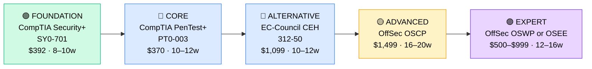

# How to Become a Penetration Tester / Ethical Hacker

**`CP26`** · **Security** · _Time to hire: 12–24 months_ · _Entry cost: $2,600–$3,500 USD_

> **Path summary:** This path takes you from a security analyst or systems admin to a hired Penetration Tester role, testing security by "breaking in" to systems (ethically). High demand, well-paid, requires both certifications AND demonstrable hands-on lab skills. This is not a pure cert path — you must build a portfolio of practice penetration tests.

---

## Role Overview

### What does a Penetration Tester actually do?

A Penetration Tester (or "Pen Tester") simulates cyberattacks against organizations' systems to find vulnerabilities before real attackers do. You're given a scope (e.g., "test this web application") and a timeline (usually 2–4 weeks), and you systematically attempt to break into the system. You use tools like Burp Suite, Metasploit, and custom scripts to exploit vulnerabilities. You document findings and provide remediation recommendations. You're not breaking the law — it's all with written permission. You're a "hacker for good."

Most pen testers work in consulting firms (Deloitte, PwC, KPMG, specialized security firms), or as in-house security testers at large enterprises. Teams vary from 2–3 testers at small firms to 50+ at large consulting houses. Work is project-based: engagements last 2–4 weeks, then you move to the next client. Most roles are semi-remote (flex between office and home). Travel is common (client site visits). You're on-call for urgent pentest requests but not 24/7/365.

### Demand in 2026

- **Global job postings:** 87,000+ "Penetration Tester" or "Ethical Hacker" roles on LinkedIn as of May 2026 [(source)](https://www.linkedin.com/jobs/search/?keywords=penetration%20tester)
- **Growth rate:** 15% YoY / Demand growing as regulations require security testing [(source)](https://www.bls.gov/ooh/computer-and-information-technology/information-security-analysts.htm)
- **South Africa:** Strong demand at banks, government, consulting firms, and large enterprises. Q1 2026 saw 25+ open penetration tester roles in SA. Supply is extremely tight — good pen testers are recruited aggressively.
- **Remote availability:** 45% of global pen tester roles are remote or hybrid; 35–40% in South Africa allow remote/flex work.

---

## Who Is This Path For?

### Ideal starting backgrounds

| Background | Readiness | What you already have |
|---|---|---|
| Security Analyst / SOC Analyst | ✅ Ideal | Security knowledge, incident response exposure, attack mindset |
| Network Administrator | ✅ Good start | Network architecture, routing/switching, packet analysis |
| Sysadmin / Server Admin | ✅ Good start | Infrastructure knowledge, Windows/Linux deep skills |
| Developer / Software Engineer | ✅ Good start | Code understanding, app architecture, debugging |
| Network Penetration Tester in training | ✅ Ideal | Direct path; just need certifications |
| IT Support / Help Desk | 🟡 Good with gaps | Troubleshooting skills, but needs network and security depth |
| Recent IT graduate | 🟡 Good with gaps | Theory solid; needs 6–12 months hands-on hacking lab time |
| Complete career changer | 🔴 Difficult | Needs 6+ months of networking + Linux/coding foundation first |

### You're ready to start this path if you can:
- Understand TCP/IP, DNS, HTTP/HTTPS, and basic network architecture
- Navigate Linux command-line fluently (bash, grep, find, chmod)
- Read and understand code (not necessarily write it fluently)
- Have demonstrated hands-on security testing on a lab (HackTheBox, TryHackMe, DVWA)

> **Not ready yet?** Start with [Networking Foundation (R04)](../Roadmaps/R04_Networking.md) and [Security Foundation (R09)](../Roadmaps/R09_Security_Foundation.md) first.

---

## Certification Sequence

### Visual path

---

### Stage 1 — Foundation (Months 0–10)

**Goal:** CompTIA Security+ certification. Baseline security knowledge required by most employers.

| Cert | Code | Cost (USD) | Study Time | Why it matters |
|---|---|---:|---:|---|
| CompTIA Security+ | `SY0-701` | $392 | 8–10 weeks | Industry baseline. Covers cryptography, network security, threat management, compliance. Required for gov/defense contracts. |

**Stage 1 total:** $392 USD · R7,056 ZAR · 8–10 weeks

**Study approach:** Use Professor Messer (free) or Jason Dion's Udemy course ($15). Do 50+ practice questions daily in final 2 weeks. Score 80%+ on practice exams. This is mandatory for most pen tester roles.

**Lab requirement:** Set up a home lab with virtual machines (VirtualBox, free). Practice networking, access control, and encryption. Deploy a vulnerable web application (DVWA, WebGoat) and exploit it.

---

### Stage 2 — Penetration Testing Specialisation (Months 8–20)

**Goal:** Get certified as a penetration tester. Choose one path: CompTIA PenTest+ (recommended, industry standard) OR EC-Council CEH (popular internationally, especially in Asia/Middle East).

| Cert | Code | Cost (USD) | Study Time | Why it matters |
|---|---|---:|---:|---|
| CompTIA Pentest+ | `PT0-003` | $370 | 10–12 weeks | Industry-standard pen tester cert. Covers planning, reconnaissance, exploitation, and reporting. Highly respected by employers. |
| EC-Council Certified Ethical Hacker | `312-50` | $1,099 | 10–12 weeks | Global recognition, especially outside US/UK. More offensive-focused than PenTest+. Prearranged exams (harder to schedule). |

**Stage 2 total:** $370–$1,099 USD · R6,660–R19,782 ZAR · 10–12 weeks

**Study approach:**

- **PenTest+ (recommended):** Jon Bonso's Udemy course ($15) or A Cloud Guru. Focus on reconnaissance, scanning, enumeration, exploitation, and post-exploitation. Study common vulnerabilities (OWASP Top 10). Do 100+ practice questions. Score 75%+ on official exams.

- **CEH (alternative):** EC-Council's course materials. More comprehensive but less focused on actual pen testing. Study all modules: reconnaissance, scanning, enumeration, exploitation, and reporting.

**Project milestone:** Complete 5–10 hands-on penetration tests in a lab environment (HackTheBox, TryHackMe, or DVWA). Document each test: reconnaissance → exploitation → post-exploitation → reporting. Build a portfolio of 3–5 well-documented tests with detailed findings and remediation recommendations.

---

### Stage 3 — Advanced Penetration Testing (Months 18–38)

**Goal:** OffSec OSCP (Offensive Security Certified Professional). The gold standard for pen testers. Extremely difficult but highly respected. OSCP holders are 20–30% more expensive (and in-demand) than those without it.

| Cert | Code | Cost (USD) | Study Time | Why it matters |
|---|---|---:|---:|---|
| OffSec OSCP | `OSCP` | $1,499 | 16–20 weeks | "The gold standard" of pen test certs. Purely hands-on (30 hours of hacking, then written exam). Extremely difficult (40–50% pass rate). But hiring managers specifically ask for OSCP. |

**Stage 3 total:** $1,499 USD · R26,982 ZAR · 16–20 weeks

**Study approach:** OffSec's Penetration Testing with Kali Linux (PWK) course is included with OSCP. You get 30 days of lab access (extensible). Study the course materials, complete the lab exercises, and practice on 50+ vulnerable VMs in the lab. The exam: 24 hours to penetrate and document findings in 3–4 target systems. Document everything; write-up determines pass/fail. Expect 1–3 attempts for most people.

**Lab requirement:** Dedicate 16–20 weeks. This is serious time investment. Do it while unemployed, or negotiate part-time work during OSCP study. Many people do OSCP on evenings/weekends over 6–9 months, but it's brutal at that pace.

> **Path note:** Many people become hireable pen testers after Stage 2 (Security+ + PenTest+) and pursue OSCP while employed or contract. OSCP is valuable for career progression (to senior roles, architecture), but not always required for entry-level roles.

---

## Timeline & Cost Summary

| Stage | Certs | Duration | Cost (USD) | Cost (ZAR) |
|---|---|---|---:|---:|
| Stage 1 — Foundation | SY0-701 | Months 0–10 | $392 | R7,056 |
| Stage 2 — Penetration Testing | PT0-003 or CEH | Months 8–20 | $370–$1,099 | R6,660–R19,782 |
| **Total to hireable entry-level** | **SY0-701 + PT0-003** | **12–20 months** | **$762** | **R13,716** |
| Stage 3 — Advanced (optional at hire) | OSCP | Months 20–40 | $1,499 | R26,982 |
| **Total to senior pen tester** | | **24–40 months** | **$2,261** | **R40,698** |

**Study hours required:** ~600–900 hours to entry-level (Stage 1–2). ~1,200–1,500 hours to OSCP. Assumes 18–24 hours/week. Full-time: 4–6 months to entry-level, 8–12 months to OSCP.

---

## Salary Progression

> All figures: median base salary, not including bonuses. ZAR = USD × 18 baseline (verified May 2026).

| Experience Level | USD/year | ZAR/year | ZAR/month |
|---|---:|---:|---:|
| Entry / Junior (0–2 yrs) | $70,000–$85,000 | R1,260,000–R1,530,000 | R105,000–R127,500 |
| Mid-level (2–5 yrs) | $90,000–$120,000 | R1,620,000–R2,160,000 | R135,000–R180,000 |
| Senior (5–8 yrs) | $130,000–$170,000 | R2,340,000–R3,060,000 | R195,000–R255,000 |
| Lead / Principal (8+ yrs) | $190,000–$280,000 | R3,420,000–R5,040,000 | R285,000–R420,000 |

**South Africa note:** Entry-level pen testers at Johannesburg consulting firms earn R120,000–R160,000/month. With OSCP: R160,000–R220,000/month. Government/Defense contracts: R140,000–R200,000/month. International remote roles: R200,000–R350,000/month.

**Salary accelerators:** OSCP certification, experience with application penetration testing, AWS/cloud security testing, and threat intelligence all command 15–25% premiums.

---

## First Job Strategy

### Month 0–3: Build Foundations

1. **Set up your lab** — VirtualBox (free), Kali Linux (free), vulnerable apps (DVWA, WebGoat, free).
2. **Begin Security+** — Professor Messer. 15 hours/week.
3. **Start hands-on hacking** — HackTheBox or TryHackMe (free tier available). Solve 10+ challenges.
4. **Join the community** — r/Sec, r/HackTheBox, OWASP communities.

### Month 3–8: Portfolio Building & Lab Work

- **Project 1:** Complete 10 HackTheBox machines. Document writeups for 5 of them (this is your portfolio).
- **Project 2:** Perform a simulated penetration test on a vulnerable web app (DVWA, WebGoat, or Juice Shop). Document: reconnaissance → exploitation → post-exploitation → findings + recommendations.
- **Project 3:** Exploit an OWASP Top 10 vulnerability. Document how and provide remediation.
- **Project 4:** Participate in a Capture The Flag (CTF) competition (HackTheBox, TryHackMe, or local CTF event). Document your solutions.

### Month 8–16: Deep Study & Advanced Labs

- Complete Security+ and PenTest+ certifications.
- Complete 20+ more HackTheBox/TryHackMe machines.
- Build a portfolio of 3–5 documented penetration tests.

### Month 16–24: Apply & Iterate

- **CV positioning:** "Penetration Tester" or "Ethical Hacker (PenTest+)" once certified. Don't use "junior" on CV; use in cover letters. Feature lab work: "Completed 50+ penetration tests in lab environments, documented in portfolio."

- **Target companies:** Consulting firms (Deloitte, PwC, KPMG, specialized security firms like Mandiant, CrowdStrike, TrustedSec). Government/Defense contractors. Large enterprises with dedicated security testing teams.

- **Interview prep:** Be ready to discuss:
  1. A complete penetration test you conducted (walk through your methodology)
  2. Tools: Burp Suite, Metasploit, Kali Linux (be hands-on ready)
  3. Exploitation techniques (SQL injection, XSS, RCE, privilege escalation)
  4. Post-exploitation and lateral movement
  5. Reporting: how you document findings and communicate risk

- **Salary negotiation:** Entry-level pen testers in SA negotiate to R140,000–R180,000/month (2026). Don't accept first offers. PenTest+ is strongly valued; OSCP commands 20%+ premium.

---

## A Day in the Life

### Penetration Tester at a Consulting Firm — Junior Level

**09:00** — Kick-off meeting with a client. You're testing their web application for vulnerabilities over the next 2 weeks. Scope: web app, mobile app, API. Rules of engagement, escalation procedures, sensitive data handling.

**10:30** — Reconnaissance begins. Map the application: endpoints, technologies, authentication mechanisms. Use Burp Suite to intercept traffic. Document everything.

**12:00** — Lunch.

**13:00** — Scanning and enumeration. Identify potential vulnerabilities using automated tools (Burp, Nessus) and manual techniques. Generate a list of interesting targets.

**15:00** — Exploitation. Test the most promising vulnerability (e.g., SQL injection, broken authentication, or insecure deserialization). If successful, demonstrate impact.

**16:30** — Post-exploitation. Lateral movement, data exfiltration scenarios. Document everything for the report.

**17:00** — End of day. Document findings, update notes.

---

### Penetration Tester at a Large Enterprise — Senior Level

**08:30** — Review comprehensive penetration test plan for a major client. Discuss with the team: scope, approach, timeline, resource allocation.

**10:00** — Execute phase 1 of a network penetration test. Reconnaissance and vulnerability scanning on the client's external infrastructure. Identify potential entry points.

**12:00** — Lunch.

**13:00** — Team collaboration. A junior tester found an interesting vulnerability; you help exploit it and determine business impact.

**15:00** — Threat modeling workshop with the client's security team. Discuss attack scenarios, risk mitigation.

**16:00** — Report writing. Summarize findings, business impact, remediation recommendations. Create executive summary and technical deep-dives.

**17:00** — End of day. Review for quality; prepare for client presentation tomorrow.

---

## Related Paths & Progressions

| From here you can move to… | Why |
|---|---|
| [Threat Analyst / Hunter (advanced)](../Roadmaps/R10_Threat_Hunter.md) | Shift from testing to hunting for actual threats. |
| [Incident Response Specialist](../Roadmaps/R09_Incident_Response.md) | Apply hacking knowledge to respond to breaches. |
| [Security Architect (CP27)](CP27_Security_Security_Engineer.md) | Move from testing to designing secure systems. |
| [Red Team Lead / Operator](../Roadmaps/R11_Red_Team.md) | Advanced offense; simulate nation-state adversaries. |

---

## South Africa Context

### Market specifics

Penetration testers are in high demand but short supply in South Africa. Consulting firms (Deloitte, PwC, KPMG, Accenture, specialized firms) actively recruit pen testers for client engagements. Banks, insurance, government agencies also hire in-house pen testers. Q1 2026 saw 25+ open roles — but supply of qualified testers is estimated at only 150–200 in the entire country.

Pay is competitive: R120K–R160K/month for entry-level, rising to R200K–R350K/month for senior testers with OSCP. International remote roles (working for UK/US firms) pay 40–80% more.

### SA-specific resources

| Resource | URL | Note |
|---|---|---|
| Deloitte South Africa | [deloitte.com/za](https://www.deloitte.com/za) | Cybersecurity consulting; active hiring for pen testers. |
| PwC South Africa | [pwc.com/za](https://www.pwc.com/za) | Cyber security services; regular pen tester recruitment. |
| LinkedIn Jobs (SA) | [linkedin.com/jobs](https://www.linkedin.com/jobs) | Filter "Penetration Tester" + "South Africa." 20–30 roles available. |
| HackTheBox | [hackthebox.com](https://www.hackthebox.com/) | Lab environment; used by SA pen testers for portfolio building. |
| TryHackMe | [tryhackme.com](https://www.tryhackme.com/) | Hands-on hacking platform; free tier. |
| OWASP South Africa | [owasp.org](https://www.owasp.org/) | Local OWASP chapter; meet pen testers and security professionals. |

---

## Frequently Asked Questions

**Q: Do I need a law degree or security clearance to become a pen tester?**

No. You don't need either (though government contracts often require security clearance, which is a separate process). All you need is certifications + portfolio + demonstrated skills.

**Q: Is PenTest+ harder than Security+?**

Yes, significantly. Security+ is vocabulary + concepts. PenTest+ is application + hands-on methodology. Expect PenTest+ to take 1.5–2x longer than Security+.

**Q: Should I do CEH or PenTest+?**

PenTest+ (CompTIA) is recommended for 2026. It's more vendor-neutral, industry-standard in US/UK, and focused on actual penetration testing methodology. CEH is valid but more suited for international consulting or specific regions. Start with PenTest+.

**Q: Is OSCP really necessary?**

Not for entry-level jobs. Many pen testers land their first role with just Security+ + PenTest+. OSCP becomes essential for senior roles (5+ years experience), or if you want to move into specialized areas (advanced exploitation, red team). Do OSCP after 1–2 years of pen testing experience.

**Q: Can I get a pen tester job without a portfolio?**

Very difficult. Employers want to see that you can actually hack (not just pass exams). Build a portfolio of 3–5 documented penetration tests (from lab environments). GitHub repo with writeups is excellent.

**Q: How much Python do I need to know?**

Moderate level. You'll write exploits and tools occasionally. Fluent Python + Bash is valuable. However, many pen testers use existing tools (Metasploit, Burp, etc.) without writing custom code. Python is a significant plus but not absolute requirement for entry-level.

---

## Sources & Further Reading

| # | Source | URL | Used for |
|---|---|---|---|
| 1 | LinkedIn Jobs | [linkedin.com/jobs](https://www.linkedin.com/jobs/search/?keywords=penetration%20tester) | Pen tester job postings and demand |
| 2 | CompTIA PenTest+ | [comptia.org/pentest](https://www.comptia.org/certifications/pentest) | PT0-003 exam details |
| 3 | EC-Council CEH | [ec-council.org/ceh](https://www.ec-council.org/certifications/certified-ethical-hacker-ceh/) | CEH exam details |
| 4 | OffSec OSCP | [offsec.com/oscp](https://www.offsec.com/courses/pen-200/) | OSCP details, PWK course |
| 5 | HackTheBox | [hackthebox.com](https://www.hackthebox.com/) | Hands-on penetration testing lab |
| 6 | TryHackMe | [tryhackme.com](https://www.tryhackme.com/) | Guided penetration testing training |
| 7 | Robert Half 2026 Salary Guide | [roberthalf.com](https://www.roberthalf.com/) | Pen tester salary data |
| 8 | OWASP Top 10 | [owasp.org/top10](https://owasp.org/www-project-top-ten/) | Web application vulnerabilities |

---

*Template version: 2026-05-02 | Maintained by IT Career Roadmap | ZAR baseline: R18/$1 USD*
*File naming: `Career_Paths/CP26_Security_Penetration_Tester.md`*
