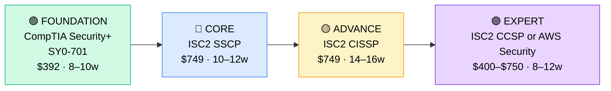

# How to Become a Security Engineer

**`CP27`** · **Security** · _Time to hire: 18–24 months_ · _Entry cost: $1,800–$2,500 USD_

> **Path summary:** This path takes you from a sysadmin or security analyst to a hired Security Engineer role, designing and implementing security infrastructure. Unlike SOC analysts (reactive) or pen testers (offensive), you build defensive systems: firewalls, IAM, encryption, network segmentation. This is a fundamental security specialization with strong demand and good pay.

---

## Role Overview

### What does a Security Engineer actually do?

A Security Engineer designs, builds, and maintains security infrastructure. You're not responding to incidents (that's SOC), and you're not hacking (that's pen testers). Instead, you're implementing zero-trust architecture, configuring firewalls and VPNs, managing identity and access management (IAM), deploying encryption, and hardening systems. You write security requirements, conduct security reviews of infrastructure changes, and build automation to enforce security policies. You solve problems like "How do we prevent lateral movement in our network?" and "What's our backup encryption strategy?"

Security Engineers work in every industry: finance, healthcare, tech, government, manufacturing. Teams typically have 3–10 engineers, reporting to a CISO or VP Security. Some teams are product-focused (e.g., security for a SaaS product), others infrastructure-focused. Work is proactive and architectural (not incident-driven). Most roles are office or hybrid. On-call is lighter than SOC or DevOps. Travel rare.

### Demand in 2026

- **Global job postings:** 121,000+ "Security Engineer" roles on LinkedIn as of May 2026 [(source)](https://www.linkedin.com/jobs/search/?keywords=security%20engineer)
- **Growth rate:** 16% YoY / Highest growth in security specializations [(source)](https://www.bls.gov/ooh/computer-and-information-technology/information-security-analysts.htm)
- **South Africa:** Strong demand at banks, fintech, government, and large enterprises. Q1 2026 had 35+ open security engineer positions in SA. Supply is tight but less extreme than penetration testers.
- **Remote availability:** 48% of global security engineer roles are remote or hybrid; 40%+ in South Africa.

---

## Who Is This Path For?

### Ideal starting backgrounds

| Background | Readiness | What you already have |
|---|---|---|
| Systems Administrator | ✅ Ideal | Infrastructure thinking, hardening experience, automation skills |
| Network Engineer | ✅ Ideal | Network architecture, protocols, firewall knowledge |
| Security Analyst / SOC analyst | ✅ Good start | Security knowledge; needs infrastructure/architecture depth |
| Cloud Architect | ✅ Good start | Design thinking; needs security-specific knowledge |
| Developer / DevOps Engineer | ✅ Good start | Code understanding, automation; needs security theory |
| IT Support / Help Desk | 🟡 Good with gaps | Troubleshooting skills; needs infrastructure and security depth |
| Recent IT graduate | 🟡 Good with gaps | Theory solid; needs 6–12 months hands-on experience |
| Complete career changer | 🔴 Difficult | Needs 6+ months of sysadmin/network foundation first |

### You're ready to start this path if you can:
- Understand network architecture, firewalls, and routing concepts
- Configure a system for hardening (SSH, permissions, firewall rules)
- Explain authentication vs. authorization
- Have implemented or configured at least one security technology (VPN, SSL certificate, firewall rule, IAM)

> **Not ready yet?** Start with [Networking Foundation (R04)](../Roadmaps/R04_Networking.md) and [Security Foundation (R09)](../Roadmaps/R09_Security_Foundation.md) first.

---

## Certification Sequence

### Visual path

---

### Stage 1 — Foundation (Months 0–10)

**Goal:** CompTIA Security+ certification. Baseline for all security roles.

| Cert | Code | Cost (USD) | Study Time | Why it matters |
|---|---|---:|---:|---|
| CompTIA Security+ | `SY0-701` | $392 | 8–10 weeks | Industry baseline. Vocabulary and foundational concepts for all security work. |

**Stage 1 total:** $392 USD · R7,056 ZAR · 8–10 weeks

**Study approach:** Professor Messer (free) + practice questions. 15 hours/week. Score 80%+. This is the entry point.

**Lab requirement:** Build a home lab. Configure a firewall, VPN, hardened systems. Practice implementing security policies.

---

### Stage 2 — Core Security Engineering (Months 8–20)

**Goal:** ISC2 SSCP (Systems Security Certified Practitioner). This is the security engineer's cert — more hands-on than Security+, more systems-focused than CISSP.

| Cert | Code | Cost (USD) | Study Time | Why it matters |
|---|---|---:|---:|---|
| ISC2 SSCP | `SSCP` | $749 | 10–12 weeks | Security engineer's core cert. Covers access controls, cryptography, infrastructure security, and incident response from an engineering (not analyst) perspective. Requires 1 year of relevant experience (you may already have this). |

**Stage 2 total:** $749 USD · R13,482 ZAR · 10–12 weeks

**Study approach:** Use ISC2 Official Study Guide (book, $60) + Cybrary or A Cloud Guru courses. Focus on access controls, cryptography, and infrastructure hardening. Do 150+ practice questions. Score 75%+ on official practice exams.

**Lab requirement:** Design and build a secure infrastructure. Deploy firewalls, VPN, IAM system, encryption at rest/in transit. Document your design rationale.

> **Exam eligibility:** SSCP requires 1 year of relevant security work experience. If you're transitioning from sysadmin/network, you likely qualify. If not, you may need to work 1 year in a security-adjacent role first.

---

### Stage 3 — Senior Security Architect (Months 18–34)

**Goal:** ISC2 CISSP (Certified Information Systems Security Professional). This is the senior architect cert — opens doors to principal and C-level roles. **Requires 5+ years of hands-on security experience.**

| Cert | Code | Cost (USD) | Study Time | Why it matters |
|---|---|---:|---:|---|
| ISC2 CISSP | `CISSP` | $749 | 14–16 weeks | Gold standard for security architects and leaders. Requires 5 years experience (or 4 years + advanced degree). Opens principal engineer, VP security, CISO paths. |

**Stage 3 total:** $749 USD · R13,482 ZAR · 14–16 weeks

> **Do NOT attempt before 5+ years of hands-on security experience.** This is a career progression cert, not an entry-level milestone.

---

## Timeline & Cost Summary

| Stage | Certs | Duration | Cost (USD) | Cost (ZAR) |
|---|---|---|---:|---:|
| Stage 1 — Foundation | SY0-701 | Months 0–10 | $392 | R7,056 |
| Stage 2 — Core Engineering | SSCP | Months 8–20 | $749 | R13,482 |
| **Total to hireable** | **SY0-701 + SSCP** | **18–20 months** | **$1,141** | **R20,538** |
| Stage 3 — Senior Architect (5+ yrs later) | CISSP | Months 60–76 | $749 | R13,482 |
| **Total to principal engineer** | | **60–76 months (5+ years)** | **$1,890** | **R34,020** |

**Study hours required:** ~450–600 hours to entry-level (Stage 1–2). Assumes 15–18 hours/week = 18–20 months. Full-time: 3–4 months.

---

## Salary Progression

> All figures: median base salary, not including bonuses. ZAR = USD × 18 baseline (verified May 2026).

| Experience Level | USD/year | ZAR/year | ZAR/month |
|---|---:|---:|---:|
| Entry / Junior (0–2 yrs) | $80,000–$100,000 | R1,440,000–R1,800,000 | R120,000–R150,000 |
| Mid-level (2–5 yrs) | $110,000–$140,000 | R1,980,000–R2,520,000 | R165,000–R210,000 |
| Senior (5–8 yrs) | $150,000–$190,000 | R2,700,000–R3,420,000 | R225,000–R285,000 |
| Lead / Principal (8+ yrs) | $210,000–$280,000 | R3,780,000–R5,040,000 | R315,000–R420,000 |

**South Africa note:** Entry-level security engineers at banks earn R140,000–R180,000/month. Mid-level (with SSCP): R180,000–R240,000/month. Senior (with CISSP): R280,000–R400,000/month. Remote/international roles: 40–60% higher.

**Salary accelerators:** SSCP, CISSP, cloud security (AWS Security Specialty), and specific domain expertise (zero-trust, IAM, cryptography) all command 10–20% premiums.

---

## First Job Strategy

### Month 0–3: Foundation Work

1. **Set up your lab** — VirtualBox (free), Proxmox (free), or cloud sandbox (AWS/Azure free tier). Practice infrastructure hardening by configuring secure networks. Cost: $0. This lab is your portfolio — document what you build.
2. **Begin Security+** — Professor Messer (free YouTube videos) + practice questions. 15 hours/week. Review each security domain: cryptography, network security, identity management, risk management. Take detailed notes for future reference.
3. **Learn a security tool** — Start with pfsense (open-source firewall, free), WireGuard (VPN, free), or set up an identity provider like Keycloak (free). Get hands-on experience, not just theory. Building experience with real tools now makes you more hireable.
4. **Join the community** — r/SecurityEngineering, r/cybersecurity, ISC2 community forums. Follow security engineers on LinkedIn and engage with their posts. Networking early helps: some of your future colleagues or mentors will be in these communities today.

### Month 3–10: Deepen Security Knowledge

- Complete Security+ certification.
- Build a home lab demonstrating security controls: firewall configuration, VPN setup, access control lists (ACLs), encryption.
- Study network segmentation, defense-in-depth concepts.

### Month 10–18: SSCP & Advanced Skills

- Begin SSCP study.
- Work on infrastructure security projects (in your current role or lab).
- Build portfolio of 2–3 security infrastructure designs.

### Month 18–24: Apply & Iterate

- **CV positioning:** "Security Engineer (IAM, Infrastructure)" or "SecEng (Cloud, Zero-Trust)" once SSCP-eligible. Highlight infrastructure projects and completed labs.

- **Target companies:** Banks, enterprises with security-focused teams, consulting firms, and SaaS companies. Security engineering is needed everywhere. Prioritize companies undergoing digital transformation, cloud migration, or zero-trust implementation — these actively hire security engineers to redesign infrastructure. MSPs and managed security service providers (MSSPs) also hire security engineers and offer rapid career growth.

- **Interview prep:** Be ready to discuss:
  1. A complete security infrastructure design you created (walk through your architecture, tools, and security decisions)
  2. Zero-trust architecture concepts and why it matters
  3. Identity and access management (IAM) policy design and enforcement
  4. Encryption implementation (at rest, in transit, key management strategies)
  5. Network segmentation and firewall rule design strategies
  6. Monitoring and alerting for security events
  7. Hands-on experience with security tools (pfSense, Okta, AWS Security tools, Azure Security Center, Splunk)

- **Salary negotiation:** Entry-level security engineers in SA negotiate to R160,000–R200,000/month. Don't accept first offers. With SSCP certification, expect R180,000–R240,000/month. Security engineers with cloud specialization (AWS, Azure) command 15–20% premiums. Incident response experience and zero-trust expertise add another 10–15% premium.

---

## A Day in the Life

### Security Engineer at a Bank — Junior Level

**09:00** — Architecture review meeting. A new microservices platform is being deployed. Review the security design: authentication, encryption, network access. Suggest improvements.

**10:00** — Implement an identity provider (Okta, Azure AD) for a new department. Configure SSO, MFA policies, and access controls.

**12:00** — Lunch.

**13:00** — Security audit. Review a system's security posture: firewall rules, authentication methods, encryption status. Document findings and remediation steps.

**14:30** — Implement network segmentation. Design VLANs for different business units. Configure firewall rules to enforce the design. Test.

**16:00** — Code review. A developer submitted infrastructure-as-code (Terraform) for a new system. Review security: does it follow encryption policies? Are secrets handled properly?

**16:30** — Documentation. Write a security architecture guide for the new system.

**17:00** — End of day.

---

### Security Engineer at a SaaS Company — Mid-Level

**09:00** — Security architecture planning. The company is expanding to European markets (GDPR). Design encryption, data residency, audit logging to comply.

**10:00** — Zero-trust implementation kickoff. Present the design to engineering and operations teams. Explain how it improves security while maintaining usability.

**11:00** — Implement an access management system. Write Terraform code to deploy infrastructure. Integrate with SSO and MFA services.

**12:30** — Lunch.

**13:30** — Security incident response (supporting). A team detected potential unauthorized access. Help investigate: did the attacker get past our controls? What needs to be fixed?

**15:00** — Mentoring. Review a junior engineer's security infrastructure design. Provide feedback.

**16:00** — Threat modeling workshop. Discuss attack scenarios for a new product feature. Design defenses.

**17:00** — End of day.

---

## Related Paths & Progressions

| From here you can move to… | Why |
|---|---|
| [Cloud Security Architect (CP29)](CP29_Security_Cloud_Security_Architect.md) | Specialize in cloud security. Same foundation; add cloud expertise. |
| [CISO / Chief Information Security Officer (CP28)](CP28_Security_CISO.md) | Progress to leadership. Security engineer is typical path to CISO. |
| [Incident Response Lead](../Roadmaps/R09_Incident_Response.md) | Shift from building to responding. |

---

## South Africa Context

### Market specifics

Security engineers are in strong demand at all major SA employers. Banks (Nedbank, Standard Bank, ABSA) have dedicated security engineering teams building zero-trust architectures and implementing regulatory controls. Fintech companies (Capitec, 22Seven, Luno) invest heavily in security as a competitive advantage and risk mitigation. Government agencies and large enterprises (MTN, Vodacom, Eskom, Sasol) all hire security engineers to harden critical infrastructure. Consulting firms (Deloitte, PwC, KPMG, Accenture) have security engineering practices serving multinational clients.

The demand is driven by digital transformation initiatives, cloud migration (particularly to AWS and Azure), and regulatory requirements (POPIA, GDPR for EU-serving companies, industry-specific regulations). Most banks and fintech firms are modernizing infrastructure from on-premises to cloud, creating urgent demand for security engineers who understand both legacy and modern security architectures.

Pay is competitive and rising: R140K–R180K/month for entry-level security engineers, R200K–R300K/month for mid-level, R320K–R480K/month for senior architects. Remote/international roles (UK/US companies hiring SA-based engineers): 40–60% higher than in-house SA rates, often R300K–R600K/month depending on seniority.

The market is tight — most security engineers are already employed and are recruited by headhunters. Getting into this field early (with SSCP cert) positions you for rapid advancement and premium compensation.

### SA-specific resources

| Resource | URL | Note |
|---|---|---|
| ISC2 (ISC)² | [isc2.org](https://www.isc2.org/) | SSCP and CISSP certifications; find local exam centers |
| Nedbank Careers | [nedbank.co.za](https://www.nedbank.co.za/) | Major employer of security engineers in SA |
| Standard Bank | [standardbank.co.za](https://www.standardbank.co.za/) | Security engineering roles posted regularly |
| Deloitte South Africa | [deloitte.com/za](https://www.deloitte.com/za) | Cybersecurity consulting and engineering services |
| LinkedIn Jobs (SA) | [linkedin.com/jobs](https://www.linkedin.com/jobs) | Filter "Security Engineer" + "South Africa" |

---

## Frequently Asked Questions

**Q: Do I need to be a sysadmin or network engineer first?**

Strongly recommended. Security engineering builds on infrastructure knowledge. Coming from help desk: 2–3 years as sysadmin/network first. Coming from sysadmin/network: ready to start this path.

**Q: Is SSCP required before CISSP?**

No, but recommended. You can jump directly to CISSP after 5 years of experience. However, SSCP is easier to pass first and provides foundational knowledge for CISSP.

**Q: What's the difference between Security Engineer and Security Analyst?**

Analyst (SOC): Responds to alerts and incidents (reactive). Engineer: Designs and builds security systems (proactive). Engineers need broader infrastructure knowledge; analysts need incident response focus.

**Q: Should I specialize in cloud security?**

Yes, eventually. But build general security engineering fundamentals first. Cloud security (AWS, Azure, GCP certifications) add 12–18 months to the path. Learn general principles first. Most organizations today are hybrid or multi-cloud, so cloud security specialization significantly increases your earning potential and job options. However, mastering firewall, IAM, encryption, and network segmentation fundamentals first ensures you can apply those principles to any cloud platform.

**Q: What's the difference between a Security Engineer and a DevSecOps Engineer?**

Security Engineer focuses on designing defensive infrastructure and controls (firewalls, IAM, encryption). DevSecOps Engineer integrates security into the development and deployment pipeline (SAST/DAST scanning, secure container images, runtime security). Both are valuable; DevSecOps is more development-focused. Security Engineers can transition to DevSecOps by learning CI/CD and application security.

**Q: How do I stay current with security threats?**

Read industry sources daily: KrebsOnSecurity.com, The Hacker News, SecurityWeek, Ars Technica security section. Follow CVE announcements (National Vulnerability Database). Join professional communities (Reddit r/SecurityEngineering, ISC2 forums). Attend security conferences (Black Hat, DefCon, regional security conferences). Most importantly, experiment: set up a home lab, test new exploits and defenses, and document what you learn.

**Q: How long does it take to get CISSP-eligible (5 years)?**

Patience is key. Work your way up: Security+ → SSCP as entry-level engineer, then 5 years of hands-on work. After 5 years, CISSP opens principal engineer and VP roles. Worth the wait.

---

## Sources & Further Reading

| # | Source | URL | Used for |
|---|---|---|---|
| 1 | LinkedIn Jobs | [linkedin.com/jobs](https://www.linkedin.com/jobs/search/?keywords=security%20engineer) | Security engineer job postings |
| 2 | ISC2 SSCP | [isc2.org/sscp](https://www.isc2.org/Certifications/SSCP) | SSCP exam details, study resources |
| 3 | ISC2 CISSP | [isc2.org/cissp](https://www.isc2.org/Certifications/CISSP) | CISSP exam details, requirements |
| 4 | Robert Half 2026 Salary Guide | [roberthalf.com](https://www.roberthalf.com/) | Security engineer salary data |
| 5 | CompTIA Security+ | [comptia.org/security](https://www.comptia.org/certifications/security) | Security+ exam details |
| 6 | PayScale Security Engineer | [payscale.com](https://www.payscale.com/research/US/Job=Security_Engineer/Salary) | Real-time salary data |

---

*Template version: 2026-05-02 | Maintained by IT Career Roadmap | ZAR baseline: R18/$1 USD*
*File naming: `Career_Paths/CP27_Security_Security_Engineer.md`*
