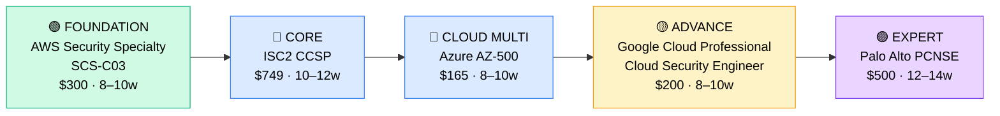

# How to Become a Cloud Security Architect

**`CP29`** · **Security** · _Time to hire: 24–36 months_ · _Entry cost: $2,700–$3,800 USD_

> **Path summary:** This path takes you from a Security Engineer or Cloud Architect to a hired Cloud Security Architect role, specializing in designing secure cloud infrastructure. Requires 5+ years of security experience + 3+ years of cloud experience. High demand, well-paid specialization that bridges security and cloud.

---

## Role Overview

### What does a Cloud Security Architect actually do?

A Cloud Security Architect designs security solutions for cloud platforms (AWS, Azure, GCP). You're designing zero-trust architectures, implementing identity and access management (IAM) in the cloud, encryption strategies, data protection, compliance automation, and threat detection. You're not building and maintaining infrastructure yourself (that's Security Engineers); instead, you're defining how organizations should architect secure cloud systems. You work with architects, engineers, and DevOps teams to integrate security into the design from the ground up. You solve problems like "How do we apply least-privilege access across 500 cloud accounts?" and "What's the best way to encrypt data in transit and at rest in a multi-cloud environment?"

Cloud Security Architects work in consulting firms, large enterprises, and cloud-native companies. Teams typically have 3–10 architects (security + cloud). Work is design-focused and strategic. You're less on-call than operations roles but responsible for major architectural decisions that affect security across the organization. Most roles are remote or hybrid. Travel is moderate (consulting roles more than enterprise).

### Demand in 2026

- **Global job postings:** 68,000+ "Cloud Security Architect" roles on LinkedIn as of May 2026 [(source)](https://www.linkedin.com/jobs/search/?keywords=cloud%20security%20architect)
- **Growth rate:** 24% YoY / Rapid as organizations migrate to cloud [(source)](https://www.bls.gov/ooh/)
- **South Africa:** Growing demand at banks (cloud transformation), consulting firms, and large enterprises. Q1 2026 had 18+ open cloud security architect positions in SA.
- **Remote availability:** 58% of global cloud security architect roles are remote or hybrid; 50%+ in South Africa.

---

## Who Is This Path For?

### Prerequisites

This path requires BOTH security expertise AND cloud expertise. You need:
- 5+ years of hands-on security experience (not just certs)
- 3+ years of hands-on cloud experience (AWS, Azure, or GCP)
- Architecture or design mindset (not just operations)

| Background | Readiness | Path |
|---|---|---|
| Security Engineer (5+ yrs) + Cloud training | ✅ Ideal | Add cloud certs (AWS Security Specialty, Azure AZ-500); learn cloud architecture |
| Cloud Architect (3+ yrs) + Security training | ✅ Ideal | Add security certs (CCSP, ISC2 CISSP); deepen security knowledge |
| Cloud DevOps Engineer (5+ yrs) | ✅ Good fit | Add security certs and architecture thinking |
| Security Architect (5+ yrs, single cloud) | ✅ Strong fit | Add other cloud platforms and cloud-specific security depth |
| General IT Manager | 🟡 Difficult | Needs 5+ years building cloud security expertise first |
| Entry-level security or cloud person | 🔴 Not ready | Gain 5+ years in either domain first |

### You're ready to start this path if you can:
- Design a secure infrastructure on at least one cloud platform (AWS, Azure, or GCP)
- Explain cloud-specific security concerns: account isolation, shared responsibility model, cloud IAM
- Have 5+ years of security work (any domain: operations, engineering, compliance)
- Have 3+ years of cloud platform experience
- Understand compliance in cloud environments (HIPAA, PCI-DSS, GDPR in cloud)

> **Not ready yet?** Spend 3–5 years as a Security Engineer OR Cloud Architect, then return to this path.

---

## Certification Sequence

### Visual path

---

### Stage 1 — AWS Cloud Security (Months 0–10)

**Goal:** AWS Security Specialty certification. Establish AWS cloud security expertise.

| Cert | Code | Cost (USD) | Study Time | Why it matters |
|---|---|---:|---:|---|
| AWS Certified Security – Specialty | `SCS-C03` | $300 | 8–10 weeks | AWS-specific security cert. Covers VPC security, IAM, encryption, incident response in AWS. Essential baseline. |

**Stage 1 total:** $300 USD · R5,400 ZAR · 8–10 weeks

**Study approach:** Use Jon Bonso's Udemy course ($15) or A Cloud Guru. Focus on AWS security services: IAM, KMS, Secrets Manager, GuardDuty, Config, Security Hub. Understand shared responsibility model, compliance in AWS. Do 150+ practice questions. Score 75%+ on official practice exams.

**Lab requirement:** Design and build a secure AWS infrastructure. Multi-account setup, IAM policies, encryption strategies, logging and monitoring with CloudTrail and CloudWatch. Document security architecture decisions.

---

### Stage 2 — Cloud Security & Multi-Cloud Expansion (Months 8–22)

**Goal:** ISC2 CCSP (Certified Cloud Security Professional) + start multi-cloud expertise.

| Cert | Code | Cost (USD) | Study Time | Why it matters |
|---|---|---:|---:|---|
| ISC2 CCSP | `CCSP` | $749 | 10–12 weeks | Cloud security across platforms. Covers cloud architecture, data security, operations, legal/compliance. More vendor-neutral than AWS. |
| Microsoft Azure Security Engineer | `AZ-500` | $165 | 8–10 weeks | Azure security expertise. Complements AWS; shows multi-cloud competency. |

**Stage 2 total:** $914 USD · R16,452 ZAR · 18–22 weeks (overlapping study)

**Study approach:**

- **CCSP:** Use ISC2 Official Study Guide + Cybrary or A Cloud Guru courses. Study cloud architecture, shared responsibility, data security, cloud operations, compliance. Do 180+ practice questions. Target 75%+. Requires 5 years security + 3 years cloud experience (which you have).

- **Azure AZ-500:** Use Microsoft Learn (official, free) + A Cloud Guru or Pluralsight. Focus on Azure-specific security: Azure AD, Azure Defender, Key Vault, Security Center. Compare to AWS equivalents. Do 100+ practice questions. Target 70%+.

**Lab requirement:** Design a multi-cloud secure architecture (AWS + Azure). Implement identity management, encryption, logging, and compliance controls across both platforms. Document architecture decisions and tradeoffs.

---

### Stage 3 — Advanced Multi-Cloud & Specialization (Months 20–34)

**Goal:** Expand to Google Cloud and add advanced cloud security specialization.

| Cert | Code | Cost (USD) | Study Time | Why it matters |
|---|---|---:|---:|---|
| Google Cloud Professional Cloud Security Engineer | `GCP-CSE` | $200 | 8–10 weeks | Google Cloud security expertise. Completes "big three" clouds. GCP is strong in data security and compliance. |
| Palo Alto PCNSE (Optional) | `PCNSE` | $500 | 12–14 weeks | Next-Gen Firewall expertise. Valuable for network security focus. Optional but enhances marketability. |

**Stage 3 total:** $200–$700 USD · R3,600–R12,600 ZAR · 8–24 weeks

**Lab requirement:** Build a 3-cloud secure infrastructure (AWS, Azure, GCP). Demonstrate consistent security posture across clouds. Document why certain controls are cloud-specific vs. universal.

> **Optional at hire time:** Many cloud security architects land jobs after Stage 2 (AWS SCS-C03 + CCSP + AZ-500) and add GCP/Palo Alto on the job.

---

## Timeline & Cost Summary

| Stage | Certs | Duration | Cost (USD) | Cost (ZAR) |
|---|---|---|---:|---:|
| Stage 1 — AWS Security | SCS-C03 | Months 0–10 | $300 | R5,400 |
| Stage 2 — Cloud Security & Azure | CCSP, AZ-500 | Months 8–22 | $914 | R16,452 |
| **Total to hireable** | **SCS-C03 + CCSP + AZ-500** | **22–24 months** | **$1,214** | **R21,852** |
| Stage 3 — Multi-Cloud (optional) | GCP-CSE or PCNSE | Months 20–34 | $200–$700 | R3,600–R12,600 |
| **Total to senior architect** | | **32–36 months** | **$1,414–$1,914** | **R25,452–R34,452** |

**Study hours required:** ~600–900 hours over 22–24 months to hireable. Assumes 18–22 hours/week. Full-time: 4–6 months.

---

## Salary Progression

> All figures: median base salary, not including bonuses. ZAR = USD × 18 baseline (verified May 2026).

| Experience Level | USD/year | ZAR/year | ZAR/month |
|---|---:|---:|---:|
| Entry / Junior (0–2 yrs cloud security) | $120,000–$145,000 | R2,160,000–R2,610,000 | R180,000–R217,500 |
| Mid-level (2–5 yrs cloud security) | $150,000–$180,000 | R2,700,000–R3,240,000 | R225,000–R270,000 |
| Senior / Principal (5–8 yrs) | $195,000–$240,000 | R3,510,000–R4,320,000 | R292,500–R360,000 |
| Lead / Distinguished Architect (8+ yrs) | $250,000–$320,000 | R4,500,000–R5,760,000 | R375,000–R480,000 |

**South Africa note:** Entry-level cloud security architects at Johannesburg banks earn R220,000–R280,000/month. Mid-level (with CCSP + multi-cloud): R280,000–R360,000/month. Senior (with principal title): R350,000–R480,000/month. International remote: 50–80% higher.

**Salary accelerators:** Multi-cloud expertise (3+ clouds), CCSP certification, 8+ years total security experience, and compliance specialization (HIPAA, PCI, GDPR) all command 15–25% premiums.

---

## First Job Strategy

### Month 0–6: Build Cloud Security Expertise

1. **Set up your lab** — AWS Free Tier + Azure Sandbox + Google Cloud Free Tier. Cost: $0 (for trials).
2. **Begin AWS SCS-C03 study** — A Cloud Guru or Udemy. 18–20 hours/week.
3. **Deep-dive into cloud security** — Read AWS, Azure, and GCP security whitepapers.
4. **Join the community** — r/CloudSecurity, r/aws-security, Cloud Security Alliance community.

### Month 6–14: Multi-Cloud & CCSP

- Complete AWS SCS-C03 certification.
- Begin CCSP study (requires security + cloud experience, which you have).
- Build a multi-cloud secure infrastructure lab.

### Month 14–24: Azure + Portfolio

- Complete CCSP certification.
- Add Azure AZ-500 certification.
- Build a portfolio project: design a secure, compliant, multi-cloud infrastructure for a realistic scenario (e.g., e-commerce platform, financial services, healthcare).

### Month 24–36: Apply & Iterate

- **CV positioning:** "Cloud Security Architect (AWS, Azure, GCP)" or "Cloud Security Engineer (Multi-Cloud)" with CCSP + SCS-C03. Feature architecture projects.

- **Target companies:** Consulting firms (Deloitte, PwC, KPMG), financial institutions, cloud-native startups, and large enterprises with multi-cloud strategies.

- **Interview prep:** Be ready to discuss:
  1. A complete multi-cloud secure architecture you designed
  2. Cloud-specific security concerns (shared responsibility, account isolation, encryption in cloud)
  3. Compliance in cloud (HIPAA, PCI, GDPR implementation in AWS/Azure/GCP)
  4. IAM across multiple clouds
  5. Incident response in cloud environments

- **Salary negotiation:** Cloud security architects in SA negotiate to R260,000–R340,000/month (2026). Don't accept first offers. CCSP + multi-cloud expertise commands premium.

---

## A Day in the Life

### Cloud Security Architect at a Consulting Firm — Junior Level

**09:00** — Client kickoff meeting. You're designing a secure cloud infrastructure (AWS + Azure) for a financial services client. Understand business requirements, compliance needs (HIPAA, PCI-DSS), and security posture targets.

**10:30** — Architecture design session. Whiteboard a secure infrastructure design: VPCs, subnets, IAM policies, encryption strategy, logging/monitoring, disaster recovery.

**12:00** — Lunch.

**13:00** — Document the design. Create architecture diagrams (draw.io, Lucidchart). Write design decisions and rationale. Prepare for client review.

**14:30** — Code review. A security engineer is implementing your design in Terraform. Review for security and best practices.

**15:30** — Compliance mapping. Map the design to compliance requirements (HIPAA, PCI-DSS). Identify gaps and mitigation strategies.

**16:30** — Prepare presentation. Summarize architecture for client sign-off tomorrow.

**17:00** — End of day.

---

### Cloud Security Architect at an Enterprise — Mid-Level

**08:30** — Cloud security strategy meeting. Your company is migrating 100+ applications to multi-cloud (AWS + Azure). Discuss security controls that will apply across all clouds.

**10:00** — Architecture review. A team submitted a design for a new SaaS application. Review security: encryption, IAM, data residency, compliance. Approve with recommendations.

**11:00** — Incident response (supporting). A team detected suspicious activity in an AWS account. Help investigate and determine if the cloud architecture contributed to the vulnerability.

**12:30** — Lunch.

**13:30** — Threat modeling workshop. New product feature needs security assessment. Discuss attack scenarios and design mitigations.

**15:00** — Policy development. Write a cloud security policy for zero-trust access. Define which IAM patterns are approved, which are forbidden.

**16:00** — Mentoring. Review a junior architect's design. Provide feedback on security decisions.

**17:00** — End of day.

---

## Related Paths & Progressions

| From here you can move to… | Why |
|---|---|
| [Cloud Solutions Architect (CP22)](CP22_Cloud_Multi_Cloud_Architect.md) | Add business/infrastructure strategy to security focus. |
| [CISO (CP28)](CP28_Security_CISO.md) | Progress to security leadership roles (5+ years in this role first). |
| [Security Engineer (CP27)](CP27_Security_Security_Engineer.md) | Move from cloud to broader infrastructure security. |

---

## South Africa Context

### Market specifics

Cloud security architects are in high demand in South Africa as banks and enterprises accelerate cloud migration. Major employers:
- **Banks:** Nedbank, Standard Bank, ABSA, FNB (cloud transformation initiatives)
- **Consulting:** Deloitte, PwC, KPMG (cloud security consulting services)
- **Fintech:** Capitec, 22Seven (cloud-native security)
- **Enterprises:** Eskom, Sasol (cloud adoption)

Q1 2026 saw 18+ open cloud security architect positions in SA. Supply is tight — most architects are already employed and recruited by headhunters.

Pay: R220K–R280K/month for entry-level, R300K–R400K/month for mid-level, R400K–R600K/month for senior. Remote/international: 50–80% higher.

### SA-specific Resources

| Resource | URL | Note |
|---|---|---|
| AWS Certification (SA) | [aws.amazon.com/certification](https://aws.amazon.com/certification/) | SCS-C03 exam registration and study resources |
| ISC2 CCSP | [isc2.org/ccsp](https://www.isc2.org/Certifications/CCSP) | CCSP exam details and requirements |
| Azure Certifications (SA) | [microsoft.com/learning](https://learn.microsoft.com/en-us/certifications/) | AZ-500 exam registration |
| Deloitte SA Cloud | [deloitte.com/za](https://www.deloitte.com/za) | Cloud security consulting; hiring opportunities |
| LinkedIn Jobs (SA) | [linkedin.com/jobs](https://www.linkedin.com/jobs) | Cloud security architect roles in South Africa |

---

## Frequently Asked Questions

**Q: Do I need both security AND cloud experience?**

Yes. You need at least 5 years security + 3 years cloud. Can't skip either. If you're strong in one but weak in the other, spend 2–3 years building the weaker skillset first.

**Q: Should I specialize in one cloud (AWS) or do multi-cloud?**

Multi-cloud is more valuable in 2026. Most large enterprises use 2–3 clouds. However, start with AWS (most common) or Azure (if focusing on financial services). Add the second cloud after your first job.

**Q: Is CCSP required?**

Not absolute, but highly valuable. Most cloud security architect job postings prefer CCSP. You could land jobs with just AWS SCS-C03 + Azure AZ-500, but CCSP significantly improves your positioning.

**Q: Can I transition from pure security to cloud security architecture?**

Yes. If you're a Security Engineer (5+ years), take 1–2 years to gain cloud hands-on experience (AWS/Azure), then pursue cloud security architect roles. Building AWS/Azure expertise first, then adding security certs, is one valid path.

**Q: What's the hardest part of this role?**

Balancing security with business enablement. Security architects often slow deployment; cloud security architects must design controls that are secure AND don't block innovation. This tension is the daily challenge.

---

## Sources & Further Reading

| # | Source | URL | Used for |
|---|---|---|---|
| 1 | LinkedIn Jobs | [linkedin.com/jobs](https://www.linkedin.com/jobs/search/?keywords=cloud%20security%20architect) | Cloud security architect job postings |
| 2 | AWS Security Specialty | [aws.amazon.com/certification](https://aws.amazon.com/certification/certified-security-specialty/) | SCS-C03 exam details |
| 3 | ISC2 CCSP | [isc2.org/ccsp](https://www.isc2.org/Certifications/CCSP) | CCSP exam details and requirements |
| 4 | Azure AZ-500 | [microsoft.com/learning](https://learn.microsoft.com/en-us/certifications/azure-security-engineer/) | AZ-500 exam details |
| 5 | Google Cloud Security | [cloud.google.com/certification](https://cloud.google.com/certification) | Cloud security certifications |
| 6 | Robert Half 2026 Salary Guide | [roberthalf.com](https://www.roberthalf.com/) | Cloud security architect salary data |
| 7 | Cloud Security Alliance | [cloudsecurityalliance.org](https://cloudsecurityalliance.org/) | Cloud security resources and community |

---

*Template version: 2026-05-02 | Maintained by IT Career Roadmap | ZAR baseline: R18/$1 USD*
*File naming: `Career_Paths/CP29_Security_Cloud_Security_Architect.md`*
