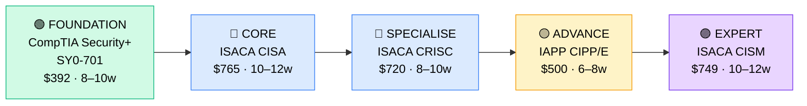

# How to Become a GRC Analyst (Governance, Risk & Compliance)

**`CP30`** · **Security** · _Time to hire: 12–18 months_ · _Entry cost: $1,800–$2,600 USD_

> **Path summary:** This path takes you from a compliance analyst, auditor, or quality assurance professional to a hired GRC (Governance, Risk & Compliance) Analyst role. GRC is the fastest-growing security specialty due to regulatory pressure (GDPR, HIPAA, PCI-DSS). If you like process, policy, and documentation more than hands-on technical work, this is your path. Strong demand, good pay, relatively entry-level friendly.

---

## Role Overview

### What does a GRC Analyst actually do?

A GRC Analyst ensures organizations comply with laws, regulations, and internal policies. You work across three domains: **Governance** (policies, procedures, oversight), **Risk** (identifying threats, assessing impact), and **Compliance** (auditing, evidence collection, remediation). You spend time writing policies, preparing for audits (HIPAA, PCI-DSS, GDPR, SOC 2), documenting controls, and tracking remediation. You work with IT, business units, and auditors to ensure the organization meets regulatory requirements. You solve problems like "How do we prove we comply with GDPR?" and "What controls do we need to pass a SOC 2 audit?"

Most GRC Analysts work in regulated industries: finance, healthcare, insurance, government. Teams typically have 3–10 GRC professionals. Work is document-heavy and process-focused (not technical hands-on). Most roles are office or hybrid. On-call duties are rare. Travel is light (internal audits, regulator meetings). Work can be repetitive and deadline-driven (audits have fixed dates).

### Demand in 2026

- **Global job postings:** 142,000+ "GRC Analyst," "Compliance Analyst," or "Risk Analyst" roles on LinkedIn as of May 2026 [(source)](https://www.linkedin.com/jobs/search/?keywords=GRC%20analyst)
- **Growth rate:** 19% YoY / Fastest-growing security specialty due to regulatory expansion [(source)](https://www.bls.gov/ooh/business-and-financial-operations/compliance-officers.htm)
- **South Africa:** Extremely high demand due to GDPR (if serving EU clients), POPIA (Protection of Personal Information Act), and industry-specific regulations (COIDA, FSCA, SAHPRA). Q1 2026 saw 45+ open GRC/compliance roles in SA.
- **Remote availability:** 62% of global GRC roles are remote or hybrid; 55%+ in South Africa allow remote work.

---

## Who Is This Path For?

### Ideal starting backgrounds

| Background | Readiness | What you already have |
|---|---|---|
| Compliance Analyst | ✅ Ideal | Regulatory knowledge, audit experience, documentation skills |
| IT Auditor / Internal Auditor | ✅ Ideal | Audit methodology, control assessment, process thinking |
| Quality Assurance / QA Lead | ✅ Good start | Process documentation, testing mindset, quality thinking |
| Risk Analyst | ✅ Good start | Risk framework knowledge, threat assessment |
| IT Support / Systems Admin | 🟡 Good with gaps | Technical background helps; needs compliance/policy depth |
| Project Manager | 🟡 Good with gaps | Process and documentation skills; needs regulatory knowledge |
| Recent business or legal graduate | 🟡 Good with gaps | Writing and analytical skills; needs IT/security knowledge |
| Complete career changer | 🟡 Possible | Needs 2–3 months of compliance framework study first |

### You're ready to start this path if you can:
- Understand what compliance frameworks are (GDPR, ISO 27001, SOC 2, PCI-DSS)
- Have experience writing or reviewing policies and procedures
- Be comfortable with documentation, spreadsheets, and process mapping
- Understand basic risk concepts (likelihood, impact, mitigation)

> **Not ready yet?** Read about compliance frameworks (NIST, ISO, GDPR) online. Take a free audit/compliance course on Coursera or Udacity.

---

## Certification Sequence

### Visual path

---

### Stage 1 — Foundation (Months 0–10)

**Goal:** CompTIA Security+ certification. Baseline security knowledge that GRC analysts need.

| Cert | Code | Cost (USD) | Study Time | Why it matters |
|---|---|---:|---:|---|
| CompTIA Security+ | `SY0-701` | $392 | 8–10 weeks | Baseline security knowledge. GRC analysts need to understand security, not just compliance. |

**Stage 1 total:** $392 USD · R7,056 ZAR · 8–10 weeks

**Study approach:** Professor Messer (free) + practice questions. 15 hours/week. Focus on compliance sections: legal/regulatory, data security, incident management. Score 80%+ on practice exams.

**Lab requirement:** Read a full compliance framework (e.g., NIST Cybersecurity Framework or ISO 27001). Understand how security controls map to compliance requirements.

---

### Stage 2 — GRC Core Specialisation (Months 8–20)

**Goal:** ISACA CISA (Certified Information Systems Auditor). This is the anchor cert for GRC professionals.

| Cert | Code | Cost (USD) | Study Time | Why it matters |
|---|---|---:|---:|---|
| ISACA CISA | `CISA` | $765 | 10–12 weeks | Gold standard for IS auditors and GRC professionals. Covers audit methodology, control assessment, compliance. Required by most employers. |
| ISACA CRISC | `CRISC` | $720 | 8–10 weeks | Risk certification. Complements CISA. Together they position you as a comprehensive GRC professional. |

**Stage 2 total:** $1,485 USD · R26,730 ZAR · 18–22 weeks (overlapping study)

**Study approach:**

- **CISA:** Use ISACA's official review manual (book, ~$100). Combine with Cybrary or A Cloud Guru courses. Focus on audit methodology, IT governance, and control frameworks. Do 200+ practice questions. Score 75%+ on official practice exams. Exam is long (4 hours) and comprehensive.

- **CRISC:** Use ISACA's CRISC manual + courses. Focus on risk identification, analysis, and mitigation. Do 150+ practice questions. Target 70%+.

**Lab requirement:** Conduct a simulated compliance audit. Pick a compliance framework (GDPR, ISO 27001, or NIST). Assess a hypothetical organization, identify control gaps, and write audit findings/recommendations.

> **Exam eligibility:** CISA requires 5 years of IS audit/control/security experience (or equivalent combination). If you don't have this, you might take the exam but can't earn the cert until you do. If transitioning from compliance analyst/quality/IT, you may already qualify.

---

### Stage 3 — Privacy & Specialisation (Months 16–28)

**Goal:** IAPP CIPP/E (if privacy focus) or deepen risk expertise. Expand beyond IT auditing to broader compliance.

| Cert | Code | Cost (USD) | Study Time | Why it matters |
|---|---|---:|---:|---|
| IAPP CIPP/E | `CIPP/E` | $500 | 6–8 weeks | Privacy focus (GDPR, CCPA). "E" = European. Valuable if your org handles EU customer data (increasingly common). |
| ISACA CISM | `CISM` | $749 | 10–12 weeks | Information Security Manager. More strategic than CISA. Focuses on governance, risk, compliance at management level. |

**Stage 3 total:** $500–$749 USD · R9,000–R13,482 ZAR · 6–12 weeks

> **Optional at hire time:** Land your first GRC analyst job after Stage 2 (Security+ + CISA + CRISC) and add privacy certs (CIPP/E) on the job or in your first year. This is normal.

---

## Timeline & Cost Summary

| Stage | Certs | Duration | Cost (USD) | Cost (ZAR) |
|---|---|---|---:|---:|
| Stage 1 — Foundation | SY0-701 | Months 0–10 | $392 | R7,056 |
| Stage 2 — GRC Core | CISA, CRISC | Months 8–20 | $1,485 | R26,730 |
| **Total to hireable** | **SY0-701 + CISA + CRISC** | **12–18 months** | **$1,877** | **R33,786** |
| Stage 3 — Privacy (optional) | CIPP/E or CISM | Months 18–28 | $500–$749 | R9,000–R13,482 |
| **Total to senior GRC** | | **18–28 months** | **$2,377–$2,626** | **R42,786–R47,268** |

**Study hours required:** ~500–700 hours to entry-level (Stage 1–2). Assumes 15–20 hours/week = 12–18 months. Full-time: 3–4 months.

---

## Salary Progression

> All figures: median base salary, not including bonuses. ZAR = USD × 18 baseline (verified May 2026).

| Experience Level | USD/year | ZAR/year | ZAR/month |
|---|---:|---:|---:|
| Entry / Junior (0–2 yrs) | $65,000–$80,000 | R1,170,000–R1,440,000 | R97,500–R120,000 |
| Mid-level (2–5 yrs) | $85,000–$110,000 | R1,530,000–R1,980,000 | R127,500–R165,000 |
| Senior / Manager (5–8 yrs) | $120,000–$155,000 | R2,160,000–R2,790,000 | R180,000–R232,500 |
| Lead / Director (8+ yrs) | $170,000–$230,000 | R3,060,000–R4,140,000 | R255,000–R345,000 |

**South Africa note:** Entry-level GRC analysts at Johannesburg banks earn R110,000–R150,000/month (2026). Mid-level (with CISA + CRISC): R150,000–R200,000/month. Senior (with CISM or privacy focus): R210,000–R280,000/month. Consulting firms pay 10–20% higher.

**Salary accelerators:** CISA + CRISC (double cert), CIPP/E (privacy), multi-framework expertise (GDPR, ISO, HIPAA), and 5+ years experience all command 10–15% premiums.

---

## First Job Strategy

### Month 0–3: Build Foundation

1. **Set up your study** — Free online courses (Coursera, Udacity) on compliance frameworks. Cost: $0.
2. **Begin Security+** — Professor Messer + practice questions. 15 hours/week.
3. **Read compliance frameworks** — Download NIST, ISO 27001, GDPR documents and read them (free, public).
4. **Join the community** — r/compliance, r/GRC, ISACA online community forums.

### Month 3–10: Deep Foundation & Audit Knowledge

- Complete Security+ certification.
- Study CISA exam material. Focus on audit methodology.
- Volunteer for compliance/audit work in your current job (if available).

### Month 10–18: CISA & CRISC Study

- Complete CISA certification.
- Begin CRISC study.
- Build a portfolio: simulated audits, compliance assessments, risk analyses.

### Month 18–24: Apply & Iterate

- **CV positioning:** "GRC Analyst (CISA, CRISC)" or "Compliance Analyst (Auditing, Risk)" once certified. Don't use "junior" on CV.

- **Target companies:** Banks, insurance, healthcare, fintech, and government agencies all have large GRC teams. Also consult firms (Deloitte, PwC, KPMG) have compliance consulting practices.

- **Interview prep:** Be ready to discuss:
  1. An audit you performed or participated in
  2. Compliance framework knowledge (GDPR, ISO 27001, NIST, SOC 2)
  3. Control assessment methodology
  4. How you'd approach a compliance project (planning, evidence gathering, reporting)
  5. Risk assessment and prioritization

- **Salary negotiation:** Entry-level GRC analysts in SA negotiate to R120,000–R160,000/month. Don't accept first offers.

---

## A Day in the Life

### GRC Analyst at a Bank — Junior Level

**09:00** — Kick-off meeting for an upcoming SOC 2 audit. Understand scope and timeline (3 months). Plan evidence gathering.

**10:00** — Control assessment. Review a policy (data access controls) and assess whether it's being followed. Interview IT staff, review logs, and document findings.

**12:00** — Lunch.

**13:00** — Compliance documentation. Update the audit trail for 10 IT controls. Collect evidence (screenshots, logs, signed attestations).

**14:30** — Audit ticket triage. Review open audit findings from last year's assessment. Which have been remediated? Which are still open? Update status.

**15:30** — Draft audit findings. Write 2 findings for controls that need work. Describe control gaps, risk, and remediation steps.

**16:30** — Prepare audit evidence package. Organize documentation for the external auditor.

**17:00** — End of day.

---

### GRC Analyst at an Insurance Company — Mid-Level

**08:30** — GDPR compliance project kickoff. The company is expanding to EU markets. Design a GDPR compliance program (data inventory, privacy policies, DPA templates, consent management).

**10:00** — Risk assessment workshop. New product line is launching. Assess regulatory risks (privacy, data security, consumer protection). Prioritize mitigations.

**12:00** — Lunch.

**13:00** — Vendor risk assessment. A third-party data processor is being onboarded. Assess their security/compliance posture. Review their SOC 2 report and contracts.

**14:30** — Compliance training development. Draft a mandatory compliance module for all employees. Topics: data handling, conflict of interest, regulatory requirements.

**15:30** — Audit prep. External auditors are visiting next month. Prepare documentation packages for 15 critical controls.

**16:30** — Mentoring. Review a junior analyst's audit findings. Provide feedback on structure and risk communication.

**17:00** — End of day.

---

## Related Paths & Progressions

| From here you can move to… | Why |
|---|---|
| [GRC Manager / Compliance Director](../Roadmaps/R15_Compliance_Manager.md) | Progress to managing a GRC team. |
| [Security Engineer (CP27)](CP27_Security_Security_Engineer.md) | Shift from compliance to security engineering/controls. |
| [Risk Manager / Chief Risk Officer](../Roadmaps/R16_Risk_Management.md) | Expand to enterprise risk management. |

---

## South Africa Context

### Market specifics

GRC is booming in South Africa due to regulatory pressure. Major drivers:
- **POPIA** (Protection of Personal Information Act) — SA's data protection law, similar to GDPR
- **GDPR** — if serving EU customers (common for fintech, e-commerce, SaaS)
- **Industry-specific:** FSCA (Financial Services), SAHPRA (Health), COIDA (Labor)
- **International:** Audits from UK, US regulators for multinational companies

Major employers:
- **Banks:** Nedbank, Standard Bank, ABSA, FNB (large compliance teams)
- **Insurance:** Discovery, Old Mutual, Sanlam
- **Financial Services:** Capitec, Satrix, Investec
- **Consulting:** Deloitte, PwC, KPMG (compliance consulting practices)

Q1 2026 saw 45+ open GRC/compliance roles in SA — highest demand of any security specialty. Supply is tight.

Pay: R110K–R150K/month for entry-level, R180K–R240K/month for mid-level, R250K–R350K/month for senior managers.

### SA-specific Resources

| Resource | URL | Note |
|---|---|---|
| ISACA (CISA, CRISC, CISM) | [isaca.org](https://www.isaca.org/) | Find exam centers in SA; register for certs |
| IAPP (CIPP/E, privacy) | [iapp.org](https://www.iapp.org/) | Privacy certifications; South African chapters |
| POPIA Compliance Guide | [justice.gov.za](https://www.justice.gov.za/) | South African data protection law; required reading |
| Deloitte SA Compliance | [deloitte.com/za](https://www.deloitte.com/za) | Compliance consulting; hiring opportunities |
| LinkedIn Jobs (SA) | [linkedin.com/jobs](https://www.linkedin.com/jobs) | GRC analyst roles in South Africa; 45+ roles Q1 2026 |
| South African ISACA Chapter | [isaca.org/chapters](https://www.isaca.org/chapters) | Local networking and training |

---

## Frequently Asked Questions

**Q: Is GRC for non-technical people?**

Yes, absolutely. GRC is less technical than security engineering or SOC work. You need to *understand* technology, but you don't need to *build* it. If you prefer documentation, process, and policy over hands-on technical work, GRC is ideal.

**Q: Do I need to know GDPR/POPIA/compliance before starting?**

No. You can learn frameworks on the job. However, spending 2–4 weeks reading a framework (GDPR, NIST, ISO 27001) before starting this path helps tremendously.

**Q: What's the difference between CISA and CRISC?**

CISA = Information Systems Auditor (focus: auditing, controls, testing). CRISC = Risk certification (focus: identifying, analyzing, mitigating risk). Together they form a comprehensive GRC foundation. Many people do both.

**Q: Can I do GRC while working full-time?**

Yes, and easier than most security paths. 15–18 hours/week for 12–18 months is doable. Many GRC analysts study evenings/weekends.

**Q: Is GRC boring?**

Some find it repetitive (checklists, evidence gathering, documentation). Others love it (creating order, solving compliance puzzles, working with regulations). It depends on your preference. If you like process and policy, you'll enjoy it. If you prefer hands-on technical work, you'll find it tedious.

**Q: Should I get CISA first or CRISC first?**

CISA first. It's the foundation. CRISC builds on it. Many companies require CISA before CRISC.

---

## Sources & Further Reading

| # | Source | URL | Used for |
|---|---|---|---|
| 1 | LinkedIn Jobs | [linkedin.com/jobs](https://www.linkedin.com/jobs/search/?keywords=GRC%20analyst) | GRC analyst job postings and demand |
| 2 | ISACA CISA | [isaca.org/cisa](https://www.isaca.org/credentialing/cisa) | CISA exam details and requirements |
| 3 | ISACA CRISC | [isaca.org/crisc](https://www.isaca.org/credentialing/crisc) | CRISC exam details |
| 4 | ISACA CISM | [isaca.org/cism](https://www.isaca.org/credentialing/cism) | CISM exam (management-level) |
| 5 | IAPP CIPP/E | [iapp.org/cipp](https://www.iapp.org/certifications/) | Privacy certification; GDPR/data protection focus |
| 6 | GDPR (EU Law) | [gdpr-info.eu](https://gdpr-info.eu/) | GDPR text (required reading for compliance professionals) |
| 7 | POPIA (SA Law) | [justice.gov.za](https://www.justice.gov.za/) | South African data protection law |
| 8 | Robert Half 2026 Salary Guide | [roberthalf.com](https://www.roberthalf.com/) | GRC/compliance analyst salary data |

---

*Template version: 2026-05-02 | Maintained by IT Career Roadmap | ZAR baseline: R18/$1 USD*
*File naming: `Career_Paths/CP30_Security_GRC_Analyst.md`*
