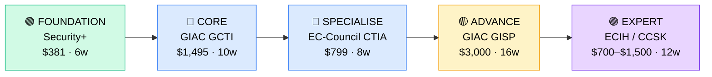

# How to Become a Threat Intelligence Analyst

**`CP31`** · **Security** · _Time to hire: 12–18 months_ · _Entry cost: $1,200–$1,800 USD_

> **Path summary:** This path takes you from a SOC analyst or IT support background to a hired Threat Intelligence Analyst role using industry-standard threat intelligence methodologies and defensive security frameworks, in 12–18 months. You'll learn to collect, analyse, and operationalise intelligence on cyber threats to protect organisations globally.

---

## Role Overview

### What does a Threat Intelligence Analyst actually do?

A Threat Intelligence Analyst sits between the frontlines (SOC, incident response teams) and strategic security leadership, turning raw threat data into actionable insights. You spend your day ingesting threat feeds (IP blocklists, malware signatures, vulnerability announcements), running them through OSINT tools like Shodan, VirusTotal, and internal SIEM platforms, correlating attack patterns, and writing reports that tell the story of "who's attacking us, why, and what we can do about it." Your work directly informs firewall rules, endpoint detection strategies, and executive risk briefings. You might spend 3 hours analysing a newly discovered malware sample, 2 hours responding to Slack messages asking "is this IP malicious?", and 1 hour refining your organisation's threat model. Tools you use daily: Mitre ATT&CK framework, STIX/TAXII protocols, threat intelligence platforms (TIP) like EclecticIQ or Anomali, YARA rules, and command-line utilities like curl, grep, and jq.

Threat intelligence teams sit in large enterprises, government agencies, managed security service providers (MSSPs), and cyber threat intelligence firms. A typical team is 3–12 people: you collaborate with SOC analysts who need tactical intelligence, architects who need strategic assessments, and incident responders who need indicators of compromise (IoCs) in real time. Remote work is common—70%+ of threat intelligence roles globally are hybrid or fully remote. You're not on-call as heavily as SOC analysts, but critical events (zero-days, major breaches) can pull you in outside normal hours.

### Demand in 2026

- **Global job postings:** 8,500+ active threat intelligence roles on LinkedIn as of May 2026. [(source)](https://www.linkedin.com/jobs/search/?keywords=threat+intelligence+analyst)
- **Growth rate:** 13% YoY / BLS projects 17% growth in information security analyst roles through 2032. [(source)](https://www.bls.gov/ooh/computer-and-information-technology/information-security-analysts.htm)
- **South Africa:** Strong demand at major banks (Standard Bank, Nedbank, ABSA), telcos (MTN, Vodacom), and government security agencies. Dimension Data, BCX, and EOH all list threat intelligence roles quarterly. Remote threat intel roles for UK/US companies are increasingly advertised to SA residents.
- **Remote availability:** High (70%+). Most intelligence analysis can be done anywhere; many roles are fully remote with distributed team across EMEA/APAC.

---

## Who Is This Path For?

### Ideal starting backgrounds

| Background | Readiness | What you already have |
|---|---|---|
| SOC Analyst (L1/L2) | ✅ Excellent start | Familiarity with alerts, malware, threat context, SIEM tools |
| IT Support / Help Desk | 🟡 Good with gaps | Troubleshooting mindset; needs security fundamentals |
| Network technician | 🟡 Good with gaps | TCP/IP, network visibility; needs threat knowledge |
| Information Security Analyst | ✅ Excellent start | Policy, controls, risk; needs tactical threat knowledge |
| Linux/Windows sysadmin | 🟡 Good with gaps | OS knowledge carries over; needs security context |
| Developer / Programmer | 🟡 Good with gaps | Code analysis helps; needs security threat focus |
| Complete career changer | 🔴 Needs foundation | Start with CompTIA Security+ first; 6+ months prep |

### You're ready to start this path if you can:
- Explain the MITRE ATT&CK framework and name 3 tactics (e.g., reconnaissance, credential access, lateral movement)
- Understand basic indicators of compromise (file hash, IP address, domain name, email address)
- Navigate the command line (Linux or Windows) and use tools like curl, grep, and dig for domain/IP lookups
- Read and understand a security advisory or threat report from sources like CISA or Check Point

> **Not ready yet?** Start with [CompTIA Security+ (CP06_Security_CompTIA_Security_Plus.md)](../Roadmaps/CP06_Security_CompTIA_Security_Plus.md) first—it gives you the baseline threat knowledge this path assumes.

---

## Certification Sequence

### Visual path

---

### Stage 1 — Foundation (Months 0–3)

**Goal:** Prove you have foundational security knowledge and understand the threat landscape before specialising in threat intelligence.

| Cert | Code | Cost (USD) | Study Time | Why it matters |
|---|---|---:|---:|---|
| CompTIA Security+ | `SY0-601` | $381 | 6–8 weeks | Baseline security knowledge. Employers expect this. Covers threat models, risk management, and security operations. |

**Stage 1 total:** $381 USD · R6,858 ZAR · 2–3 months

**Study approach:** Use Professor Messer's free Security+ course (YouTube) paired with Jason Dion's Udemy practice exams. Spend 40 minutes daily on video lectures (weeks 1–4), then shift to 90 minutes daily on practice questions (weeks 5–6). Target: 80%+ on three consecutive practice exams before scheduling the real exam. Join the r/CompTIA Discord for peer support and exam tips.

**Lab requirement:** Build a home lab using VirtualBox (free) with Windows Server and Ubuntu VMs. Run basic network sniffing with Wireshark and get comfortable with Windows Event Viewer. Complete at least 20 hours of hands-on practise.

---

### Stage 2 — Core Specialisation (Months 3–9)

**Goal:** Get the anchor threat intelligence certifications that hiring managers expect on CVs. GIAC GCTI and EC-Council CTIA are the industry-recognised entry gates.

| Cert | Code | Cost (USD) | Study Time | Why it matters |
|---|---|---:|---:|---|
| GIAC Certified Cyber Threat Intelligence (GCTI) | `GCTI` | $1,495 | 10–12 weeks | The gold-standard threat intelligence credential. Covers threat analysis, indicators of compromise, STIX/TAXII, and intelligence operations. Globally recognised. |
| EC-Council Certified Threat Intelligence Analyst (CTIA) | `CTIA` | $799 | 8–10 weeks | Practical, vendor-agnostic threat intel foundations. Covers threat modelling, dark web research, and malware analysis basics. Lower cost than GIAC but equally respected in Asia-Pacific and emerging markets. |

**Stage 2 total:** $2,294 USD · R41,292 ZAR · 5–6 months

**Study approach:** 
- **GIAC GCTI:** Enrol in SANS OnDemand course SEC511 (Cyber Threat Intelligence) or use third-party providers like Cybrary or the GIAC study guide. Expect 100+ hours. Use STIX/TAXII labs on open-source platforms like Hive Community or MISP (Malware Information Sharing Platform). Schedule the exam only when you're scoring 85%+ on full-length practice tests.
- **EC-Council CTIA:** Use EC-Council's official courseware. Hands-on labs are built-in. Study 10–12 hours per week. Focus on the dark web research and threat actor profiling sections—these are practical interview topics.

**Project milestone:** 
Build a **threat intelligence collection pipeline**: Set up a Splunk Free instance or open-source ELK stack and ingest three threat feeds (AlienVault OTX, Shodan API, CISA advisories). Document how you'd operationalise findings into a SIEM rule. Create a GitHub repo with your lab setup and a 2–3 page threat report on a real-world threat (e.g., Emotet, Lazarus Group activity). This becomes a portfolio piece that proves you can move from raw data to intelligence.

---

### Stage 3 — Advanced Specialisation (Months 9–15)

**Goal:** Differentiate yourself by adding depth in threat actor research, malware analysis, or strategic intelligence—move from analyst to senior analyst level.

| Cert | Code | Cost (USD) | Study Time | Why it matters |
|---|---|---:|---:|---|
| GIAC Intelligence and Strategic Planning (GISP) | `GISP` | $3,000 | 14–16 weeks | Strategic threat intelligence for leadership. Differentiates you for senior roles and threat management positions. Requires GIAC certification as prerequisite. |
| Certified Forensic Analyst (CFA) or EC-Council Certified Counter Cyber Terrorism Professional (C4) | `CFA` or `C4` | $900–$1,500 | 10–12 weeks | Deep dive into attribution and threat actor profiling. CFA is better for forensic link to malware analysis. C4 is better for government/defence sector work. |

**Stage 3 total:** $3,000–$4,500 USD · R54,000–R81,000 ZAR · 3–4 months (often done while employed)

> **Optional at hire time:** Many people land their first Threat Intelligence Analyst job after Stage 2 (GCTI + CTIA) and complete Stage 3 certifications while employed. This is valid and increasingly common—your employer often pays for advanced certs.

---

### Stage 4 — Expert / Leadership (18–36 months+)

**Goal:** Senior analyst or intelligence manager credentials. Tackle after 2–3 years of hands-on experience.

| Cert | Code | Cost (USD) | Study Time | Why it matters |
|---|---|---:|---:|---|
| GIAC Intrusion Analyst (GCIA) | `GCIA` | $3,000 | 18–20 weeks | Expert-level incident response and attack analysis. Opens doors to senior analyst and management roles. Requires significant hands-on experience. |
| ECIH or CCSK (for cloud-native threat intel) | `ECIH` or `CCSK` | $700–$1,500 | 12–14 weeks | ECIH for advanced incident handling. CCSK for cloud threat intelligence (increasingly common). Both require 3+ years experience. |

> These certifications require real-world experience to pass—don't rush them. 2+ years of hands-on threat analysis → then pursue these certs.

---

## Timeline & Cost Summary

| Stage | Certs | Duration | Cost (USD) | Cost (ZAR) |
|---|---|---|---:|---:|
| Stage 1 — Foundation | Security+ | Months 0–3 | $381 | R6,858 |
| Stage 2 — Core | GCTI + CTIA | Months 3–9 | $2,294 | R41,292 |
| Stage 3 — Advanced | GISP or CFA | Months 9–15 | $3,000–$4,500 | R54,000–R81,000 |
| **Total to hireable (Stage 1–2)** | **Security+ + GCTI + CTIA** | **12–15 months** | **$3,075** | **R55,350** |

**Study hours required:** ~350–450 hours total (Stage 1–2). Assumes 25 hours/week study = 14–18 weeks.

---

## Salary Progression

> All figures: median base salary, not including bonuses/equity. ZAR = USD × 18 baseline (verified May 2026). Sources: Robert Half 2026 Salary Guide, PayScale, LinkedIn Salary, Glassdoor.

| Experience Level | USD/year | ZAR/year | GBP/year | EUR/year | AUD/year |
|---|---:|---:|---:|---:|---:|
| Entry / Junior (0–2 yrs) | $70,000 | R1,260,000 | £55,000 | €62,000 | A$105,000 |
| Mid-level (2–5 yrs) | $95,000 | R1,710,000 | £75,000 | €85,000 | A$142,000 |
| Senior (5–8 yrs) | $125,000 | R2,250,000 | £98,000 | €110,000 | A$187,000 |
| Lead / Manager (8+ yrs) | $150,000–$170,000 | R2,700,000–R3,060,000 | £118,000–£134,000 | €132,000–€150,000 | A$225,000–A$255,000 |

**South Africa note:** Entry-level threat intelligence analysts at Johannesburg-based banks (Nedbank, Standard Bank) earn R45,000–R65,000/month (approximately $2,500–$3,600/month USD). Mid-level analysts command R70,000–R100,000/month. Remote work for international clients (UK/US threat intel firms, Microsoft, Google) can yield R80,000–R150,000/month for senior SA-based analysts. Government security agencies (SSA, SARS) typically pay lower (R40,000–R60,000/month) but offer job security and growth.

**Salary accelerators:** GIAC GCTI certification alone commands a 15–20% salary premium over non-certified peers in SA listings (Q1 2026). Published threat intelligence reports, MITRE ATT&CK proficiency, and Python/Go skills push salaries up 10–15% more. Remote work multiplier is significant—a SA analyst working for a US threat intel consultancy can earn 2–3x local enterprise salary.

---

## First Job Strategy

### Month 0–3: Build the Foundation

1. **Set up your threat intel lab** — Use Splunk Free (cloud-hosted, no credit card for 500MB/day) and VirusTotal API (free). Cost: $0/month.
2. **Start Security+** — Use Professor Messer (free YouTube) + Jason Dion's Udemy course ($15). Schedule exam for week 8.
3. **Join threat intel communities** — Reddit: r/cybersecurity, r/Malware. Discord: SANS Cyber Aces, ThreatQuotient community. LinkedIn: follow Talos, CISA, and Microsoft Threat Analysis Center for daily intelligence updates.
4. **Start documenting** — Create a GitHub profile and a blog (Medium or Hashnode). Post a weekly threat research summary (10 minutes spent, 5 minutes documented). E.g., "Emotet Botnet Resurgence—3 New IoCs".

### Month 3–6: Build Your Portfolio

1. **Project 1: Threat Feed Aggregation (4–6 hours)** — Set up a home SIEM (Splunk Free or Wazuh) and ingest three public threat feeds: AlienVault OTX, Shodan API, CISA daily alerts. Document a screenshot and your reasoning for using each feed. Push to GitHub.

2. **Project 2: Malware Hash Analysis (6–8 hours)** — Download a sample from VirusTotal (any recent trojan, SHA-256 hash). Run it through VirusTotal, abuse.ch, and hybrid-analysis.com. Write a 1-page analysis report: file hash, detection ratio, capabilities, MITRE TTPs, and 3–5 indicators of compromise. Include the report in your portfolio.

3. **Project 3: Threat Actor Profile (8–10 hours)** — Choose a known threat group (Lazarus, APT28, Emotet operators). Research using public sources (Google, Shodan, CISA advisories, Bleeping Computer archive). Build a one-page profile: group name, aliases, motivation, known targets, TTPs (MITRE ATT&CK mapping), and defence recommendations. This demonstrates strategic thinking.

4. **Project 4: Incident Timeline & IoCs (6–8 hours)** — Take a real breach (pick from Krebs on Security or CISA). Extract all public IoCs (IPs, domains, file hashes, email addresses). Build a timeline in a spreadsheet and a summary threat report. This is exactly what employers ask you to do on day one.

### Month 6–12: Apply and Iterate

- **CV positioning:** List yourself as "Threat Intelligence Analyst (GCTI + CTIA)" once you hold both certs. If you're still studying, list as "Security Analyst—Threat Intelligence Track". Don't use "Junior"—employers respect your specialisation.
- **Target companies:** Start with MSPs and security consulting firms (Dimension Data Security, EOH Managed Services, BCX). They hire entry-level analysts. Then move to enterprise banks (Nedbank, ABSA, Standard Bank—Johannesburg offices and remote). Large tech (Microsoft, Google, Amazon) have competitive threat intel programs but expect 1–2 years SOC experience first.
- **Interview prep:** Be ready to discuss: 1) Your malware analysis project and what you learned; 2) A recent threat actor you researched; 3) How you'd operationalise a threat report into a firewall rule; 4) The difference between tactical and strategic intelligence; 5) A specific MITRE ATT&CK technique and how you'd detect it in a SIEM.
- **Salary negotiation:** Threat Intel roles in SA often advertise at R45k–R55k/month. Do not accept that. Based on your stage 2 certs and portfolio, negotiate for R60k–R75k/month entry-level. International remote roles (UK/US companies) are often R80k–R120k/month for entry-level—actively apply to those.

---

## A Day in the Life

### Threat Intelligence Analyst at a Major Bank (Standard Bank, Johannesburg) — Junior Level

**08:00** — Arrive. Review overnight threat alerts in Splunk. One new domain (malware.xyz) was flagged by AlienVault OTX as used in a Qbot campaign. Check: have we seen it? (No.) Is it in our DNS logs? (No—good.) Run it through Shodan, VirusTotal, DomainTools. Document findings in Slack #threat-intel channel.

**09:15** — Standup with the SOC and incident response teams. Share 3 new IoCs from overnight. The SOC ops lead asks: "Is this IP safe?" (43.123.45.67 from a suspicious outbound connection). You check your threat feeds. AbuseIPDB flags it as a known C2 server. You recommend blocking in the WAF and escalate to incident response. They open a ticket.

**10:30** — Work on your assigned task: analyse a new malware sample uploaded by a peer who found it in an email attachment. Download it (sandboxed, obviously) from your internal malware repository. Run it through VirusTotal, hybrid-analysis, and Cuckoo Sandbox. Take notes on its behaviour: C2 communication, persistence mechanism, capability. Map it to MITRE ATT&CK (e.g., T1547.001 Boot or Logon Autostart Execution). Write a preliminary one-page analysis.

**12:00** — Lunch.

**13:00** — Write up the malware analysis into a proper threat report (3–4 pages). Include executive summary, technical analysis, IoCs (hashes, domains, IPs), MITRE TTPs, detection signatures (YARA rule if you can write one), and defence recommendations. Share in Confluence for the team to review and add to the knowledge base.

**15:00** — Work on your ongoing project: building a threat actor profile on Lazarus Group. Update your tracking spreadsheet with new campaigns from Q2 2026. Compare to previous known campaigns. What's changed? Are they targeting South African entities? (Yes—financial sector.) Compile into a slide deck for a briefing next week.

**16:30** — Check the #threat-intel Slack channel for any urgent requests. A developer is asking if a library they want to use has known vulnerabilities. You check its GitHub CVE history. It has none critical. Clear it. Wrap up any open tasks, update your timesheet, and close down.

### Threat Intelligence Analyst at a Cloud-Native Security Startup (Remote, EMEA-based) — Mid-Level

**09:00** — Async standup: you post a summary of your previous day's work to Slack. Overnight, the platform detected 47 new malware samples. You've prioritised them: 3 are new variants of Emotet (high priority), 12 are PlugX variants (medium), 32 are benign or false positives (ignore). You've already created IoC feeds and shared them with customers via your TIP integration.

**10:00** — 1:1 with your manager. You're proposing a research project: "Mapping North Korean threat actors' infrastructure evolution in 2026". She approves and gives you 30% of your week for it.

**10:30** — Work on the Lazarus Group research. Scrape OSINT data from Shodan, certificate transparency logs, DNS records, and public breach databases. Build a network graph of infrastructure. Write Python scripts to automate the collection (you've been upskilling). This is strategic threat intelligence—the kind that informs product roadmaps and customer briefings.

**12:00** — Lunch + a quick customer call. One of your key customers (a financial services firm) is asking: "What's your read on the recent APT-28 activity?" You brief them on recent campaigns, targeting, and defence recommendations. This is customer-facing intelligence work—it's how you accelerate your career from analyst to thought leader.

**13:30** — Write up your Lazarus research into a white paper (5–7 pages). You'll present this at a security conference next month. Your startup values research contributions.

**15:00** — Contribute to an open-source threat intelligence tool (MISP plugin) your company maintains. Your change: improve the filtering logic for IoC data types. You submit a pull request, peer-review another analyst's code.

**16:00** — Wrap up. Check Slack for any urgent intel requests. None. Close down and enjoy your evening (perks of remote work—you saved 90 minutes on commute).

---

## Related Paths & Progressions

| From here you can move to… | Why |
|---|---|
| [Security Incident Response Manager (CP32_Security_DFIR_Analyst.md)](CP32_Security_DFIR_Analyst.md) | Threat intel informs IR—move to incident response after 2–3 years to deepen technical response skills. |
| [Security Architect (upcoming path)](../Roadmaps/) | Threat intel expertise translates to architectural decisions. Many threat intel leads become security architects. |
| [SOC Manager / Security Operations Lead (upcoming path)](../Roadmaps/) | Natural progression: move into management after building a strong analyst foundation. |
| [AppSec / Secure Development (CP33_Security_AppSec_Engineer.md)](CP33_Security_AppSec_Engineer.md) | Threat intelligence of supply chain attacks and secure coding vulnerabilities informs AppSec roles. |

---

## South Africa Context

### Market specifics

Threat intelligence is in high demand across South African financial services, telcos, and government. Nedbank, Standard Bank, ABSA, and FirstRand all have dedicated threat intel teams (15–30 people each) based in Johannesburg. MTN and Vodacom are actively hiring threat analysts to defend against nation-state and cybercriminal activity targeting African telecom infrastructure. Government agencies like the SSA (State Security Agency) and SARS (Special Revenue Service) have small but growing threat intel units. Beyond tier-1, firms like Dimension Data (now part of NTT), BCX (Broadcom), and EOH Managed Services hire threat intel analysts for regional MSSP operations covering Sub-Saharan Africa.

Remote work is a game-changer for SA talent. Threat intelligence is one of the few cybersecurity roles where a Cape Town-based analyst can credibly work full-time for a London or New York threat intel firm, often earning 2–3x local enterprise salary. Firms like Flashpoint, Mandiant (Google), Recorded Future, and CrowdStrike actively recruit SA analysts for EMEA coverage.

BEE/EE considerations: South African companies have equity targets. Threat intelligence roles—especially at banks and government—often have preferential hiring for previously disadvantaged individuals. Certs like GCTI and CTIA help level the field by proving competence independently of educational background. Many SA companies offer bursaries or cert-sponsorship for team members from targeted demographics.

### SA-specific resources

| Resource | URL | Note |
|---|---|---|
| Nedbank & ABSA Careers | [careers.nedbank.co.za](https://careers.nedbank.co.za) / [absa.co.za/careers](https://absa.co.za/careers) | Post threat intel roles quarterly; typically require GCTI or equivalent. |
| EOH Managed Services (MSP) | [eoh.co.za](https://eoh.co.za) | Hires entry-level threat analysts for African MSSP operations. |
| Dimension Data (NTT) Security | [dimensiondata.com/solutions/security](https://dimensiondata.com/solutions/security) | EMEA-spanning threat intel centre in Johannesburg. Open to entry-level hires. |
| South African Cyber Security Association (SACSA) | [sacsa.org.za](https://sacsa.org.za) | Professional body; job board, events, networking. |
| Gartner Magic Quadrant SA Reports | LinkedIn, Gartner subscription | Identifies top security vendors operating in SA—often hiring analysts. |

---

## Frequently Asked Questions

**Q: Do I need to start as a SOC Analyst first?**

Not strictly, but it's the most common path. A SOC analyst (L2+) with 1–2 years experience has seen real alerts, understands detection logic, and knows what threat intel is actually used for. This makes the transition to threat analyst natural. If you're coming from IT support or sysadmin, you can skip SOC and jump straight to threat intel if you have strong GIAC GCTI prep and a solid portfolio (malware analysis, threat actor research). It's rarer but doable. Many threat intel teams hire directly from security degree programs if you have lab experience and a project to show.

**Q: How long does it realistically take from zero?**

12–18 months if you're disciplined. Here's the honest breakdown: Security+ (3 months) + GCTI (3 months) + CTIA (2 months) + portfolio projects and job search (2–3 months) = 12–15 months. If you're studying part-time while working, add 4–6 months. If you have gaps in security fundamentals, add another 3 months for prerequisite learning.

**Q: Which cert should I do first?**

Definitely **CompTIA Security+** first. It gives you the shared vocabulary (threat models, risk, controls, cryptography) that both GCTI and CTIA assume. Employers also expect to see it on your CV. After Security+, choose between GCTI and CTIA based on your preference: GCTI is more strategic and US-centric; CTIA is more practical and hands-on. Most people do both for the 12–18 month path.

**Q: Can I do this path while working full-time?**

Yes, but it's tight. At 15–20 hours/week study, Stage 1–2 takes 5–6 months instead of 3. Your schedule: mornings before work (1 hour), 2–3 evenings per week (3–4 hours), weekend labs (4–6 hours). The real pressure point: exam scheduling. Each cert exam is a 3-hour proctored event; you need to take 3 of them (Security+, GCTI, CTIA). Block them 4–6 weeks apart and commit hard to those windows. Many people do Security+ while employed, then take a 2–3 month study break or reduce hours for GCTI. Employers are often willing to sponsor certs, especially GIAC ones—ask.

**Q: Is GIAC GCTI worth it over EC-Council CTIA?**

Both are recognised, but GCTI is the "gold standard" globally. GCTI is higher cost ($1,495 vs. $799), requires more study time, but opens more doors in Tier-1 enterprises and government roles. CTIA is faster and cheaper—great for getting hired quickly at MSPs or regional firms. In SA, GCTI is slightly more valued at banks and large enterprises. Ideal: do both (GCTI + CTIA together in Stage 2). If you can only do one due to budget, do GCTI—it's the cert that defines "entry-level threat analyst."

**Q: What languages or tools do I actually need to know?**

Python is increasingly expected (80% of threat intel roles list it as nice-to-have). You don't need to be an expert—just able to write simple scripts to parse JSON, pull data from APIs, or process IoC lists. Bash/Linux command line is essential (grep, cut, sort, jq). YARA rule writing is a plus but learnable on the job. The bigger skills are analytical: how to source open-source intelligence (Shodan, DNS queries, SSL certificate transparency), how to think about threat actor motivations, and how to read a technical security advisory and extract operational intelligence from it.

---

## Sources & Further Reading

| # | Source | URL | Used for |
|---|---|---|---|
| 1 | LinkedIn Jobs | [linkedin.com/jobs/search/?keywords=threat+intelligence+analyst](https://www.linkedin.com/jobs/search/?keywords=threat+intelligence+analyst) | Job postings and demand data, May 2026 |
| 2 | BLS Occupational Outlook | [bls.gov/ooh/computer-and-information-technology/information-security-analysts.htm](https://www.bls.gov/ooh/computer-and-information-technology/information-security-analysts.htm) | Growth projections and role descriptions |
| 3 | GIAC GCTI Cert Details | [giac.org/certifications/certified-threat-intelligence-professional-gcti](https://www.giac.org/certifications/certified-threat-intelligence-professional-gcti) | Certification content, requirements, and validity period |
| 4 | EC-Council CTIA | [eccouncil.org/programs/certified-threat-intelligence-analyst-ctia/](https://www.eccouncil.org/programs/certified-threat-intelligence-analyst-ctia/) | CTIA content and exam structure |
| 5 | Robert Half 2026 Salary Guide | [roberthalf.com/salary-guide](https://www.roberthalf.com/salary-guide) | Market salaries for security roles in US, UK, APAC, EU |
| 6 | PayScale ZA Salary Data | [payscale.com/research/ZA/](https://www.payscale.com/research/ZA/) | South Africa salary benchmarks |
| 7 | MITRE ATT&CK Framework | [attack.mitre.org](https://attack.mitre.org) | Threat actor tactics and techniques reference—core to threat intel |
| 8 | CISA Advisories | [cisa.gov/advisories](https://www.cisa.gov/advisories) | Daily threat intelligence feeds and incident context |

---

*Career path guide for threat intelligence analysts | Last updated 2026-05-02 | ZAR baseline: R18/$1 USD*
*For updates and job leads, see [IT Career Roadmap](https://itcareerroadmap.com)*
