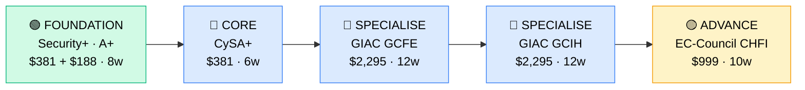

# How to Become a DFIR Analyst

**`CP32`** · **Security** · _Time to hire: 12–24 months_ · _Entry cost: $2,200–$3,500 USD_

> **Path summary:** This path takes you from a SOC analyst or IT support background to a hired DFIR (Digital Forensics & Incident Response) Analyst role using hands-on incident investigation and forensic tools, in 12–24 months. You'll learn to investigate breaches, recover evidence, and respond to active threats in real time.

---

## Role Overview

### What does a DFIR Analyst actually do?

A DFIR Analyst is an investigator and first responder. When a company detects a breach or suspicious activity, you're called in to answer: "What happened? When? Who did it? What did they touch?" You spend your days collecting memory dumps and hard drive images from compromised systems, parsing log files (Windows Event Viewer, syslog, web server logs), using tools like Volatility (memory analysis), EnCase (forensic imaging), and Splunk to reconstruct an attack timeline. You might spend 4 hours triaging a ransomware infection, 3 hours writing an incident report, and 1 hour briefing the CISO and legal team on findings and chain-of-custody compliance. Your work directly informs law enforcement reports (if breach involves cybercrime), C-suite risk assessments, and incident response playbook updates. Tools you use daily: Volatility, FTK, EnCase, Autopsy, Splunk, grep/awk for log parsing, Python for forensic scripting, and command-line utilities for memory/disk analysis.

DFIR teams sit in large enterprises, managed security service providers (MSSPs), government agencies, and dedicated incident response firms. A typical IR team is 5–20 people: you're the technical investigator working with incident managers (who coordinate the response), threat intel analysts (who provide actor context), and legal/compliance teams (who ensure proper handling). DFIR work is on-call heavy—you could be paged at 2 AM for a live breach. Most DFIR roles are remote or hybrid; the technical work can be done from anywhere, but you're expected to be available 24/7 during an incident. Stress can be high, but the work is incredibly rewarding—you're solving real crimes.

### Demand in 2026

- **Global job postings:** 6,800+ active DFIR and incident response roles on LinkedIn as of May 2026. [(source)](https://www.linkedin.com/jobs/search/?keywords=dfir+analyst&locationId=&geoId=101112)
- **Growth rate:** 15% YoY / BLS projects 13% growth through 2032 as breaches increase. [(source)](https://www.bls.gov/ooh/computer-and-information-technology/information-security-analysts.htm)
- **South Africa:** Growing demand at major banks (Standard Bank, ABSA, Nedbank), insurance companies (Discovery, Old Mutual), and telcos (MTN, Vodacom). Government agencies (SSA, SARS) are expanding incident response capabilities. Dimension Data, BCX, and EOH have regional IR teams serving African clients.
- **Remote availability:** High (60%+). Response coordination can be remote; forensic lab work can be done from anywhere with secure access to evidence.

---

## Who Is This Path For?

### Ideal starting backgrounds

| Background | Readiness | What you already have |
|---|---|---|
| SOC Analyst (L2/L3) | ✅ Excellent start | Alert triage experience, SIEM familiarity, threat context |
| Incident Response Coordinator | ✅ Excellent start | Process knowledge, team coordination; needs technical depth |
| Windows/Linux Sysadmin | 🟡 Good with gaps | OS internals carry over; needs security and forensics focus |
| IT Support / Help Desk | 🟡 Good with gaps | Troubleshooting mindset; needs security fundamentals |
| Law Enforcement / Military Forensics | 🟡 Good with gaps | Investigation mindset and chain-of-custody; needs IT skills |
| Developer / Programmer | 🟡 Good with gaps | Scripting skills help; needs security and OS deep dive |
| Complete career changer | 🔴 Needs foundation | Start with CompTIA Security+ and A+ first; 6+ months prep |

### You're ready to start this path if you can:
- Explain the Windows boot process and understand Windows Registry hives (HKLM, HKCU, HKEY_USERS)
- Understand Linux filesystems (ext4, permissions) and explain what /proc and /sys contain
- Navigate a command line and use tools like grep, find, strings, and hexdump
- Read and interpret a Windows Event Log or Linux syslog entry

> **Not ready yet?** Start with [CompTIA Security+ (CP06)](../Roadmaps/CP06_Security_CompTIA_Security_Plus.md) and [CompTIA A+ (CP01)](../Roadmaps/CP01_IT_Fundamentals_CompTIA_A_Plus.md) first.

---

## Certification Sequence

### Visual path

---

### Stage 1 — Foundation (Months 0–4)

**Goal:** Prove baseline IT knowledge and foundational security understanding before specialising in forensics and incident response.

| Cert | Code | Cost (USD) | Study Time | Why it matters |
|---|---|---:|---:|---|
| CompTIA A+ | `220-1101 + 220-1102` | $188 | 8–10 weeks | OS fundamentals: Windows, Linux, storage, networking. Forensics requires deep OS knowledge. |
| CompTIA Security+ | `SY0-601` | $381 | 6–8 weeks | Baseline security: threat models, risk, incident response fundamentals, cryptography. |

**Stage 1 total:** $569 USD · R10,242 ZAR · 4 months

**Study approach:** Tackle A+ first (8 weeks), then Security+ (6–8 weeks). Use Professor Messer's free courses paired with Jason Dion's Udemy exams. For A+, focus heavily on Windows Registry, hard drive structure (MBR, GPT), and Linux filesystem hierarchy—these are critical for forensics. Spend 50% of your study time on hands-on labs: build VMs, practise navigating filesystems from command line, inspect Event Logs manually.

**Lab requirement:** Build a home lab with VirtualBox. Create Windows Server and Ubuntu VMs. Practise: delete files and recover them with Recuva, inspect Master Boot Records, parse Windows Event Logs using Event Viewer, and explore Linux inodes and filesystem structure. Minimum 30 hours hands-on.

---

### Stage 2 — Core Specialisation (Months 4–10)

**Goal:** Get the anchor DFIR certifications: CySA+ (security analyst foundation) and begin deep-dive forensics/IR certs.

| Cert | Code | Cost (USD) | Study Time | Why it matters |
|---|---|---:|---:|---|
| CompTIA CySA+ | `CS0-003` | $381 | 6–8 weeks | Incident detection and response processes. The bridge cert between Security+ and GIAC GCIH. |
| GIAC Certified Forensic Examiner (GCFE) | `GCFE` | $2,295 | 12–16 weeks | Industry-leading forensics credential. Covers disk imaging, file recovery, evidence handling, chain of custody. |

**Stage 2 total:** $2,676 USD · R48,168 ZAR · 5–6 months

**Study approach:** 
- **CySA+:** Use CompTIA or third-party study materials. Focus on threat intelligence, detection techniques, incident response processes. Splunk is helpful for labs. Schedule exam when scoring 80%+ on practice tests (4–5 weeks of study).
- **GCFE:** Enrol in SANS SEC508 (Forensic Essentials) OnDemand or use third-party GIAC prep materials. This is a serious cert—expect 100+ hours. You MUST do hands-on labs: image hard drives, recover deleted files, parse Windows Registry, analyse memory dumps using Volatility. Use NIST documents and forensic white papers as reference. Schedule exam only when you can correctly answer 85%+ of practice questions.

**Project milestone:** 
Build a **complete forensic investigation case study**: Download a digital forensics CTF challenge (e.g., from HackTheBox Forensics, DigitalCorpora, or NIST). Complete the full investigation: image a filesystem, recover deleted files, find evidence of malware, reconstruct user actions from logs, and write a formal forensic report (3–5 pages) with findings, evidence chain of custody, and conclusions. This becomes a powerful portfolio piece and interview talking point.

---

### Stage 3 — Advanced Specialisation (Months 10–18)

**Goal:** Add incident response depth (GCIH) and optionally forensic breadth (CHFI). Move from "forensic examiner" to "incident responder."

| Cert | Code | Cost (USD) | Study Time | Why it matters |
|---|---|---:|---:|---|
| GIAC Certified Incident Handler (GCIH) | `GCIH` | $2,295 | 12–14 weeks | Incident response process: detection, containment, eradication, recovery. Pairs with GCFE to create full DFIR expert. |
| EC-Council Certified Hacker Forensic Investigator (CHFI) | `CHFI` | $999 | 10–12 weeks | Practical forensics and hacking techniques. More hands-on than GIAC; good if you want faster path. |

**Stage 3 total:** $3,294 USD · R59,292 ZAR · 5–6 months

> **Typical path:** GCFE + GCIH (both GIAC) is the gold standard. If budget is tight, do GCFE (forensics is foundational) and add GCIH later. CHFI is a good alternative to GCIH if you prefer EC-Council structure and want faster completion.

---

### Stage 4 — Expert / Leadership (18–36 months+)

**Goal:** Senior-level or management credentials. Tackle after 2–3 years of hands-on incident response.

| Cert | Code | Cost (USD) | Study Time | Why it matters |
|---|---|---:|---:|---|
| GIAC GCIA (Intrusion Analyst) or GIAC GWIA (Web Intrusion Analyst) | `GCIA` or `GWIA` | $3,000 each | 18–20 weeks | Deep attack analysis and advanced response techniques. Positions you for senior analyst or IR lead roles. |
| Offensive Security Certified Professional (OSCP) | `OSCP` | $999 | 30+ weeks | Advanced penetration testing and attack knowledge. Elevates you toward IR leadership and threat-aware architecture roles. |

> These require significant hands-on experience. Pursue after 2–3 years in DFIR roles.

---

## Timeline & Cost Summary

| Stage | Certs | Duration | Cost (USD) | Cost (ZAR) |
|---|---|---|---:|---:|
| Stage 1 — Foundation | A+ + Security+ | Months 0–4 | $569 | R10,242 |
| Stage 2 — Core | CySA+ + GCFE | Months 4–10 | $2,676 | R48,168 |
| Stage 3 — Advanced | GCIH (or CHFI) | Months 10–18 | $2,295–$999 | R41,310–R17,982 |
| **Total to hireable (Stage 1–2)** | **A+ + Sec+ + CySA+ + GCFE** | **12–15 months** | **$3,245** | R58,410 |

**Study hours required:** ~450–600 hours total (Stage 1–3). Assumes 25–30 hours/week = 18–24 weeks.

---

## Salary Progression

> All figures: median base salary, not including bonuses/equity. ZAR = USD × 18 baseline (verified May 2026). Sources: Robert Half 2026, Glassdoor, PayScale, LinkedIn Salary.

| Experience Level | USD/year | ZAR/year | GBP/year | EUR/year | AUD/year |
|---|---:|---:|---:|---:|---:|
| Entry / Junior (0–2 yrs) | $70,000 | R1,260,000 | £55,000 | €62,000 | A$105,000 |
| Mid-level (2–5 yrs) | $100,000 | R1,800,000 | £78,000 | €88,000 | A$150,000 |
| Senior (5–8 yrs) | $130,000 | R2,340,000 | £102,000 | €115,000 | A$195,000 |
| Lead / Manager (8+ yrs) | $160,000–$180,000 | R2,880,000–R3,240,000 | £126,000–£141,000 | €141,000–€159,000 | A$240,000–A$270,000 |

**South Africa note:** Entry-level DFIR analysts at Johannesburg-based banks earn R45,000–R70,000/month. Mid-level (3–5 years) command R80,000–R120,000/month. Remote work for international incident response firms (Mandiant/Google, Crowdstrike, Rapid7) can yield R100,000–R180,000/month for SA-based senior analysts. Government agencies (SSA) typically pay lower (R40,000–R65,000/month) but offer job security. DFIR roles are among the highest-paid in cybersecurity in SA due to skill scarcity.

**Salary accelerators:** GIAC GCFE certification commands 15–25% premium over non-certified peers in SA job listings. Active incident response experience (breaches handled) is heavily weighted in salary negotiations. Python/Go scripting skills add 10–15%. Remote work with international clients multiplies salary 2–3x.

---

## First Job Strategy

### Month 0–4: Build the Foundation

1. **Set up your forensics lab** — Download Autopsy (free), NIST Digital Corpora samples, and VirtualBox. Cost: $0.
2. **Start CompTIA A+** — Professor Messer + Jason Dion. Focus hard on Windows and Linux OS internals.
3. **Begin hands-on forensics** — Download a DFIR CTF (e.g., HackTheBox Forensics, DigitalCorpora). Complete one simple challenge (file carving, log analysis). Document your process in a blog post.
4. **Join the IR community** — Reddit: r/cybersecurity, r/Malware. Discord: SANS Cyber Aces. Twitter: follow DFIR handlers, Mandiant, incident response firms.

### Month 4–9: Build Your Portfolio

1. **Project 1: Hard Drive Forensic Investigation (10–12 hours)** — Download a practice forensic image from NIST or HackTheBox. Complete a full investigation: image the drive, search for deleted files, recover them, identify malware, build an evidence timeline. Write a formal forensic report (3–4 pages) with findings, chain of custody, and conclusions. Push to GitHub.

2. **Project 2: Memory Forensics (Volatility) (8–10 hours)** — Download a memory dump from HackTheBox Malware or TryHackMe. Use Volatility to extract: running processes, network connections, open files, and injected code. Identify the malware, extract its code, and write a technical analysis. Include your Volatility commands and findings.

3. **Project 3: Log Analysis & Timeline (8–10 hours)** — Obtain a sample log collection from a simulated breach (TryHackMe or Splunk tutorials). Parse Windows Event Logs, web server logs, and firewall logs. Build a timeline of events. Identify the attack chain. Write an incident timeline report.

4. **Project 4: Malware Reverse Engineering Lite (6–8 hours)** — Download a benign malware sample (from a lab source, never live). Analyse it without executing: strings analysis, static analysis, disassembly with IDA Free. Document its capabilities and indicators of compromise. This demonstrates forensic thinking.

### Month 9–15: Apply and Iterate

- **CV positioning:** List yourself as "DFIR Analyst (GCFE + GCIH)" once certified. Before then: "Security Analyst—Incident Response Track". Emphasize incident response experience and forensic projects.
- **Target companies:** Start with MSPs (Dimension Data, EOH Managed Services, BCX) and regional IR consultancies. They hire entry-level DFIR analysts. Then move to Tier-1 banks (Nedbank, ABSA, Standard Bank). Tech companies and fintechs are competitive but possible after 1–2 years.
- **Interview prep:** Be ready to discuss: 1) Your forensic investigation project and key findings; 2) Windows Registry and how you'd identify persistence mechanisms; 3) Memory forensics and what Volatility told you; 4) An incident timeline you reconstructed; 5) Chain of custody and evidence handling; 6) The difference between forensic analysis and incident response.
- **Salary negotiation:** DFIR roles in SA advertise at R50k–R65k/month entry-level. With GCFE + GCIH, negotiate for R70k–R90k/month. International remote roles (UK/US IR firms) are often R100k–R150k/month for entry-level—actively apply to those.

---

## A Day in the Life

### DFIR Analyst at a Major Bank (Nedbank, Johannesburg) — Junior Level

**08:00** — Arrive. Check the incident queue. A phishing email got past email security. 47 employees clicked a link; some entered credentials. It's been 6 hours since discovery. Your task: forensically investigate the compromised machines, find if malware was installed, and determine scope.

**09:00** — Standup with IR team. Your lead assigns you three Windows machines to image and analyse. You'll use EnCase to create forensic images. You confirm chain-of-custody procedure: log the device, sign off before and after, maintain evidence log.

**10:00** — Begin imaging the first machine using EnCase. It'll take 45 minutes. While it runs, you document the process (photos of device, serial numbers, physical state). You prepare your lab workstation for analysis.

**11:00** — First image done. Mount it in Autopsy (read-only). Start analysis: look for recently modified files, executable files in unusual directories, suspicious DLLs or Registry keys. Check for persistence mechanisms (scheduled tasks, startup folders, Registry Run keys). Find one: a malicious DLL was installed in \Windows\System32\drivers.

**12:00** — Lunch.

**13:00** — Finish analysis of three machines. Two had malware (the same DLL), one was clean. Extract the malicious DLL for threat intel team to analyse. Calculate the timeline: initial click was 06:15, DLL installed 06:22, persistence set at 06:25. Your second goal: get this machine offline before the malware can beacon out. Alert the SOC.

**15:00** — Write your initial forensic report: machines compromised, malware family identified, scope (2 of 3 machines), timeline, recommendations (isolation, password resets, endpoint clean). This goes to the incident manager and C-suite.

**16:30** — Attend debrief. Incident manager briefs you on findings from other analysts and next steps (forensic analysis of email server, threat intel on malware family, security awareness training for employees). You'll help with the forensic analysis of mail logs tomorrow.

### DFIR Analyst at a Cloud-Native Security Firm (Remote, EMEA-based) — Mid-Level

**09:00** — On-call rotation starts. No active incidents yet. You review logs from last week's breach: a customer was hit with ransomware. You're preparing a post-incident report and recovery guide for that customer.

**10:00** — Alert: new customer has detected suspicious activity. An attacker is moving laterally in their network. Your firm is engaged. You join the Slack war room and are assigned to lead forensic investigation of the compromised server.

**10:30** — Conduct incident triage with the customer's IT team via Zoom. Get details: which server, when was activity first noticed, what access does the attacker have? The attacker accessed the web server at 08:15 this morning via a known vulnerability (Log4j). They've been there for 6 hours. Scope is unclear. You initiate: immediate isolation of the server, forensic image request, and threat intel on similar attacks.

**12:00** — Image arrives. You load it into your forensic workstation (Autopsy + Volatility). Find: a webshell uploaded to /var/www, persistence via cron job, and data exfiltration attempts (log files copied to attacker C2). Start memory analysis: extract the shell's PID, find injected processes, extract network connections.

**13:00** — Lunch + quick customer call. Brief them on preliminary findings: scope (one web server compromised), attacker capabilities (shell, data access), timeline (8 hours of access), and next steps (full log analysis, threat intel on attacker infrastructure).

**14:00** — Deep-dive analysis. Use Python to parse logs, build a timeline, and extract all attacker commands from the webshell logs. Document everything for your final report.

**16:00** — Draft the forensic report: 8–10 pages, formal tone, all findings, evidence, chain of custody, and recommendations for recovery and hardening. Your customer will use this for their legal and insurance teams.

**17:00** — Wrap-up. The incident is still active (attacker may have backup access). You brief your manager and hand off to the night shift incident handler. You're off-call until tomorrow—but you know you could be paged if things escalate.

---

## Related Paths & Progressions

| From here you can move to… | Why |
|---|---|
| [Threat Intelligence Analyst (CP31_Security_Threat_Intelligence_Analyst.md)](CP31_Security_Threat_Intelligence_Analyst.md) | DFIR findings feed threat intel—move here for strategic analysis. |
| [Security Architect (upcoming path)](../Roadmaps/) | DFIR experience informs architectural decisions on controls and detection. Natural progression to design roles. |
| [Incident Response Manager (upcoming path)](../Roadmaps/) | Lead DFIR teams after 3–5 years. Many DFIR analysts become IR managers. |
| [Penetration Tester (upcoming path)](../Roadmaps/) | Understand attacker tradecraft from DFIR work → move to offensive security. |

---

## South Africa Context

### Market specifics

DFIR is one of the most in-demand roles in South African cybersecurity due to the surge in ransomware, supply chain attacks, and regulatory requirements (POPIA, NCA). Every major bank (Nedbank, ABSA, Standard Bank, FirstRand) has an incident response team. Insurance companies like Discovery and Old Mutual are expanding IR capability. Government agencies (SARS, SSA) have small but growing IR units. Telcos (MTN, Vodacom) and large retailers are actively hiring.

The DFIR market in SA is competitive but achievable. Unlike threat intelligence, DFIR roles often go to candidates with strong technical backgrounds—sysadmins, SOC analysts, and developers. The barrier to entry is certification (GIAC GCFE/GCIH) and hands-on portfolio projects. Cost is higher ($2,200–$3,500 for Stage 1–2), but the salary uplift is significant (R70k–R90k entry-level for certified analysts vs. R45k–R55k for non-certified).

Remote work opportunities are excellent. DFIR work is largely technical and can be done from anywhere. UK and US incident response firms (Mandiant, Crowdstrike, Rapid7) actively recruit SA analysts for EMEA coverage. A SA analyst with GIAC GCFE and 1–2 years experience can land a remote role with a London firm earning 2–3x local enterprise salary.

BEE/EE: Banks and large enterprises have equity hiring initiatives. DFIR certs help level the field. Many companies sponsor cert costs for candidates from targeted demographics.

### SA-specific resources

| Resource | URL | Note |
|---|---|---|
| Nedbank & ABSA Careers | [careers.nedbank.co.za](https://careers.nedbank.co.za) / [absa.co.za/careers](https://absa.co.za/careers) | Post DFIR roles quarterly. Often require GCFE or GCIH. |
| Dimension Data Security / NTT | [dimensiondata.com/solutions/security](https://dimensiondata.com/solutions/security) | EMEA-spanning IR centre in Johannesburg. Entry-level to senior roles. |
| BCX (Broadcom) | [bcx.co.za](https://bcx.co.za) | Managed IR services for SA enterprises. Hires DFIR analysts. |
| EOH Managed Services | [eoh.co.za](https://eoh.co.za) | Regional MSSP with incident response practice. Entry-level friendly. |
| SACSA (South African Cyber Security Association) | [sacsa.org.za](https://sacsa.org.za) | Professional body; job board, events, IR working group. |
| Splunk User Group SA | [splunk.com/en_us/about-us/community.html](https://www.splunk.com/en_us/about-us/community.html) | Local user group meetings, SIEM and log analysis networking. |

---

## Frequently Asked Questions

**Q: Do I really need GIAC GCFE and GCIH? Can I skip one?**

GCFE (forensics) is non-negotiable. It's the foundational DFIR credential. GCIH (incident response) is highly valued but can come after hire. Many people get GCFE, land a DFIR job, and complete GCIH while working (employer often sponsors it). EC-Council CHFI is a faster/cheaper alternative to both, but GIAC is more respected by Tier-1 enterprises and government agencies. Ideal: do GCFE first (it's foundational), then GCIH or CHFI.

**Q: Isn't this path too expensive compared to cloud or DevOps?**

Yes, DFIR certs are pricey ($2,295 per GIAC cert). But DFIR salaries are higher ($70k–$150k entry-level globally; R70k–R120k in SA) and grow faster than cloud roles. The investment pays off within 2–3 years. If budget is a blocker, start with CompTIA Security+ + A+, land a SOC analyst role (R35k–R50k/month), and let your employer sponsor GIAC certs after 1 year.

**Q: Can I do this path while working in SOC?**

Absolutely. Many DFIR analysts come from L2/L3 SOC roles. At 15–20 hours/week study, Stages 1–2 take 5–7 months while employed. The tight part: GIAC exams (3-hour events). Schedule them 6–8 weeks apart. Many employers sponsor certs after you commit to a promotion track.

**Q: How long does it take to get good at incident response in the real world?**

6–12 months on the job. You'll work 50+ incidents in that time. Each teaches you something. By month 12, you'll be triaging serious breaches independently. By year 2, you'll be leading IR engagements. DFIR is one of those skills where experience compounds rapidly.

**Q: What's the difference between DFIR and SOC work?**

SOC is reactive monitoring—you're watching alerts and responding to automated detections. DFIR is forensic investigation—you're answering "what happened?" after a breach is confirmed. SOC is lower-stress but lower-pay. DFIR is high-stress, high-stakes, and higher-pay. Many SOC analysts transition to DFIR after 2–3 years.

---

## Sources & Further Reading

| # | Source | URL | Used for |
|---|---|---|---|
| 1 | LinkedIn Jobs | [linkedin.com/jobs/search/?keywords=dfir+analyst](https://www.linkedin.com/jobs/search/?keywords=dfir+analyst) | Job postings and demand, May 2026 |
| 2 | BLS Occupational Outlook | [bls.gov/ooh/computer-and-information-technology/information-security-analysts.htm](https://www.bls.gov/ooh/computer-and-information-technology/information-security-analysts.htm) | Growth projections and role descriptions |
| 3 | GIAC GCFE Cert | [giac.org/certifications/certified-forensics-examiner-gcfe](https://www.giac.org/certifications/certified-forensics-examiner-gcfe) | Certification content, cost, requirements |
| 4 | GIAC GCIH Cert | [giac.org/certifications/certified-incident-handler-gcih](https://www.giac.org/certifications/certified-incident-handler-gcih) | Incident handler certification details |
| 5 | EC-Council CHFI | [eccouncil.org/programs/certified-hacker-forensic-investigator/](https://www.eccouncil.org/programs/certified-hacker-forensic-investigator/) | Alternative forensic investigator cert |
| 6 | NIST Digital Corpora | [digitalcorpora.org](https://digitalcorpora.org) | Free forensic datasets for practice |
| 7 | Autopsy Forensics Platform | [autopsy.com](https://www.autopsy.com) | Open-source digital forensics tool |
| 8 | Robert Half 2026 Salary Guide | [roberthalf.com/salary-guide](https://www.roberthalf.com/salary-guide) | Market salaries for security roles |

---

*Career path guide for DFIR analysts | Last updated 2026-05-02 | ZAR baseline: R18/$1 USD*
*For updates and job leads, see [IT Career Roadmap](https://itcareerroadmap.com)*
