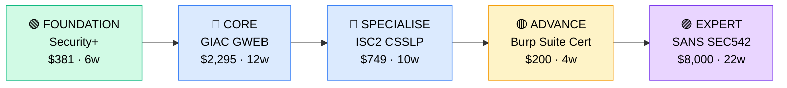

# How to Become an Application Security Engineer

**`CP33`** · **Security** · _Time to hire: 18–24 months_ · _Entry cost: $1,600–$2,400 USD_

> **Path summary:** This path takes you from a developer or security analyst background to a hired Application Security Engineer role using secure coding, web penetration testing, and secure SDLC practices, in 18–24 months. You'll embed security into the software development process.

---

## Role Overview

### What does an Application Security Engineer actually do?

An AppSec Engineer is a hybrid role: part security expert, part software engineer. You sit between the development team and the security organisation, embedding threat-aware thinking into every line of code. You spend your days: reviewing code for vulnerabilities (SQL injection, XSS, authentication bypass), designing secure APIs and data flows, running SAST tools (static analysis) and DAST tools (dynamic testing) on applications, and training developers on secure coding practices. You might spend 3 hours doing a security code review on a new payment module, 2 hours configuring a WAF (web application firewall) rule to block injection attacks, and 1 hour mentoring junior developers on OWASP Top 10. Tools you use daily: Burp Suite (web testing), SonarQube (code analysis), Fortify (static analysis), IDE security plugins, and command-line utilities for API testing. You also write threat models, security requirements, and vulnerability reports.

AppSec teams are in tech companies, fintechs, e-commerce, and enterprises. A typical AppSec team is 3–10 people depending on organisation size. You collaborate closely with developers (your primary audience), architects (who need to understand threat models), and incident response (who need rapid patching when vulnerabilities are found). AppSec roles are typically not on-call heavy, but critical vulnerabilities can pull you in. Most roles are hybrid or fully remote. The work is intellectually rewarding—you're preventing breaches before they happen, not responding after.

### Demand in 2026

- **Global job postings:** 5,200+ active AppSec engineer roles on LinkedIn as of May 2026. [(source)](https://www.linkedin.com/jobs/search/?keywords=application+security+engineer)
- **Growth rate:** 18% YoY / BLS projects 13% growth through 2032. AppSec is rapidly replacing traditional security. [(source)](https://www.bls.gov/ooh/computer-and-information-technology/information-security-analysts.htm)
- **South Africa:** Growing demand at fintech companies (PayFast, Yodlee, Asorion), banks (Nedbank, ABSA), e-commerce (Takealot, Superbalist), and cloud providers (Allocloud). Many SA fintechs are rapid-growth startups needing AppSec now.
- **Remote availability:** Very high (80%+). Code review, testing, and threat modelling are location-agnostic. Many AppSec roles are fully remote.

---

## Who Is This Path For?

### Ideal starting backgrounds

| Background | Readiness | What you already have |
|---|---|---|
| Software Developer (Python, Java, C#, Go) | ✅ Excellent start | Coding skills, framework knowledge, understanding of application architecture |
| Security Analyst (SOC, threat intel) | 🟡 Good with gaps | Security mindset and threat knowledge; needs development skills and hands-on coding |
| QA / Test Automation Engineer | 🟡 Good with gaps | Testing mindset and automation; needs secure coding and threat knowledge |
| DevOps / Infrastructure Engineer | 🟡 Good with gaps | Automation skills carry over; needs web application security depth |
| Penetration Tester | ✅ Good start | Web testing tools and vulnerability knowledge; needs secure coding perspective |
| IT Support / Help Desk | 🔴 Needs foundation | Start with coding fundamentals first (6–9 months Python/Java). Too large a gap. |

### You're ready to start this path if you can:
- Write a function in Python, Java, or C# that takes user input and writes to a database
- Explain SQL injection, XSS, and CSRF—and how to prevent each one
- Use Burp Suite's basic scanning and understand what the scan report means
- Read an API specification (REST or GraphQL) and identify potential security flaws

> **Not ready yet?** Start with [OWASP Top 10 foundations](../Roadmaps/) and a coding language (Python, Java) first.

---

## Certification Sequence

### Visual path

---

### Stage 1 — Foundation (Months 0–3)

**Goal:** Baseline security knowledge and understanding of OWASP Top 10 vulnerabilities before specialising in application security.

| Cert | Code | Cost (USD) | Study Time | Why it matters |
|---|---|---:|---:|---|
| CompTIA Security+ | `SY0-601` | $381 | 6–8 weeks | Baseline security, threat models, risk management, and security operations. |

**Stage 1 total:** $381 USD · R6,858 ZAR · 2–3 months

**Study approach:** Use Professor Messer's free course + Jason Dion's Udemy exams. Pair with OWASP Top 10 reading (free resource). Spend 60% time on general security, 40% on application security concepts. Target 80%+ on practice exams before scheduling.

**Lab requirement:** Build a simple vulnerable web app in Python Flask or Node.js with intentional vulnerabilities (SQL injection, XSS, CSRF). Test it with Burp Suite (free Community version). Complete at least 15 hours of hands-on practice.

---

### Stage 2 — Core Specialisation (Months 3–15)

**Goal:** Get the anchor AppSec certifications: GIAC GWEB (web pentesting) and ISC2 CSSLP (secure development).

| Cert | Code | Cost (USD) | Study Time | Why it matters |
|---|---|---:|---:|---|
| GIAC Web Application Penetration Tester (GWEB) | `GWEB` | $2,295 | 12–14 weeks | Industry-standard web security certification. Covers OWASP Top 10, web app testing, and vulnerability assessment. |
| ISC2 Certified Secure Software Lifecycle Professional (CSSLP) | `CSSLP` | $749 | 10–12 weeks | Secure development practices. Differentiates you from pentesters—you understand SDLC, threat modeling, and secure coding. |

**Stage 2 total:** $3,044 USD · R54,792 ZAR · 5–6 months

**Study approach:** 
- **GIAC GWEB:** Enrol in SANS SEC542 (Web App Penetration Testing) OnDemand or third-party GIAC prep. Requires 80+ hours of study and hands-on labs using Burp Suite. Set up vulnerable applications (DVWA, WebGoat) and test them thoroughly. Schedule exam when scoring 85%+ on practice tests.
- **ISC2 CSSLP:** Use official ISC2 study guide or third-party materials. Focus on SDLC phases, threat modeling (STRIDE, attack trees), secure coding principles, and vulnerability management. Less hands-on than GWEB but requires deep conceptual understanding.

**Project milestone:** 
Build a **secure web application design**: Pick a real-world problem (e.g., a simple online marketplace). Design the application from scratch with security-first thinking: 1) Threat model using STRIDE; 2) Secure architecture (authentication, authorization, data handling); 3) OWASP Top 10 mitigation for each risk; 4) Code review checklist for developers. Document in a 5–7 page design document. This is interview gold.

---

### Stage 3 — Advanced Specialisation (Months 15–20)

**Goal:** Deep technical specialisation in specific AppSec tools or advanced secure coding.

| Cert | Code | Cost (USD) | Study Time | Why it matters |
|---|---|---:|---:|---|
| Burp Suite Certified Practitioner | `BSCP` | $200 | 4–5 weeks | Proves hands-on mastery of the most-used web testing tool. Very practical and directly applicable. |
| PortSwigger Web Security Academy | (free) | $0 | 8–12 weeks | Free advanced web security training. Labs are exceptional. Many AppSec engineers use this instead of formal cert. |

**Stage 3 total:** $200 USD · R3,600 ZAR · 2–3 months

> **Optional at hire time:** Many AppSec engineers get hired after Stage 2 (GWEB + CSSLP) and learn tools (Burp, SonarQube) on the job. Formal certifications for tools are nice-to-have, not mandatory.

---

### Stage 4 — Expert / Leadership (24–36 months+)

**Goal:** Advanced or leadership credentials. Tackle after 2–3 years of hands-on AppSec work.

| Cert | Code | Cost (USD) | Study Time | Why it matters |
|---|---|---:|---:|---|
| SANS SEC542 (if not done earlier) or GIAC GPEN (Penetration Tester) | `SEC542` or `GPEN` | $8,000 / $3,000 | 22 weeks / 16 weeks | Expert-level: advanced web security and penetration testing. Positions you for senior AppSec architect roles. |
| Offensive Security OSWE (Offensive Security Web Expert) | `OSWE` | $999 | 30+ weeks | Advanced web exploitation and secure coding. Very hands-on. Top credential in the industry. |

> These require significant practical experience. Pursue after 2–3 years in AppSec roles.

---

## Timeline & Cost Summary

| Stage | Certs | Duration | Cost (USD) | Cost (ZAR) |
|---|---|---|---:|---:|
| Stage 1 — Foundation | Security+ | Months 0–3 | $381 | R6,858 |
| Stage 2 — Core | GWEB + CSSLP | Months 3–15 | $3,044 | R54,792 |
| Stage 3 — Advanced | BSCP | Months 15–20 | $200 | R3,600 |
| **Total to hireable (Stage 1–2)** | **Security+ + GWEB + CSSLP** | **18–20 months** | **$3,425** | **R61,650** |

**Study hours required:** ~400–500 hours total (Stage 1–2). Assumes 20–25 hours/week = 16–25 weeks. AppSec requires significant hands-on lab time (40% of total).

---

## Salary Progression

> All figures: median base salary, not including bonuses/equity. ZAR = USD × 18 baseline (verified May 2026). Sources: Robert Half 2026, Glassdoor, PayScale, LinkedIn Salary.

| Experience Level | USD/year | ZAR/year | GBP/year | EUR/year | AUD/year |
|---|---:|---:|---:|---:|---:|
| Entry / Junior (0–2 yrs) | $85,000 | R1,530,000 | £67,000 | €75,000 | A$128,000 |
| Mid-level (2–5 yrs) | $115,000 | R2,070,000 | £90,000 | €102,000 | A$172,000 |
| Senior (5–8 yrs) | $145,000 | R2,610,000 | £114,000 | €128,000 | A$217,000 |
| Lead / Architect (8+ yrs) | $170,000–$200,000 | R3,060,000–R3,600,000 | £133,000–£157,000 | €150,000–€176,000 | A$255,000–A$300,000 |

**South Africa note:** Entry-level AppSec engineers at Johannesburg-based banks and fintechs earn R54,000–R80,000/month. Mid-level (3–5 years) command R85,000–R130,000/month. Remote work for international tech companies (Google, Microsoft, Amazon) yields R100,000–R180,000/month for SA-based engineers. Startup roles often pay lower (R50k–R70k/month) but offer equity and growth.

**Salary accelerators:** GIAC GWEB + CSSLP commands 15–20% premium over non-certified peers. Published security research and GitHub contributions (vulnerability fixes, open-source AppSec tools) add 10–15%. Python/Java coding proficiency and Burp Suite expertise command premium pay.

---

## First Job Strategy

### Month 0–3: Build the Foundation

1. **Set up your AppSec lab** — Download Burp Suite Community (free), DVWA, and WebGoat. Cost: $0.
2. **Start Security+** — Professor Messer + Jason Dion. Pair with OWASP Top 10 reading.
3. **Build vulnerable code** — Create a Python Flask or Node.js app with 5–6 intentional vulnerabilities. Test it with Burp. Document findings.
4. **Join AppSec community** — Reddit: r/cybersecurity, r/learnprogramming. Discord: OWASP. Twitter: follow AppSec researchers.

### Month 3–12: Build Your Portfolio

1. **Project 1: OWASP Top 10 Code Review (8–10 hours)** — Find an open-source GitHub project. Conduct a security code review against OWASP Top 10. Write a report: vulnerabilities found, CVSS scores, remediation. Submit to GitHub as a PR or create a blog post.

2. **Project 2: Web App Penetration Test (10–12 hours)** — Set up DVWA or WebGoat. Complete a full penetration test: reconnaissance, vulnerability identification, exploitation, and remediation. Write a formal pentest report (3–4 pages) with findings and fixes.

3. **Project 3: Threat Model for a Real App (8–10 hours)** — Pick a real-world application or design your own. Use STRIDE or PASTA to create a threat model. Identify threats, map to OWASP Top 10, and propose mitigations. Document in a 4–5 page design document.

4. **Project 4: Secure API Design (6–8 hours)** — Design a REST API for a banking app. Apply OWASP API Security Top 10. Document security controls: authentication, rate limiting, input validation, output encoding. Include code samples.

### Month 12–18: Apply and Iterate

- **CV positioning:** List yourself as "Application Security Engineer" once you hold GWEB + CSSLP or have strong portfolio projects. Before certs, list as "Security Analyst—AppSec Track" or "Junior AppSec Engineer".
- **Target companies:** Start with startups and fintechs (faster hiring, growth mindset). Payfast, Yodlee, Asorion (SA fintechs) actively hire. Then move to banks (Nedbank, ABSA) and tech (Google, Microsoft). Big 4 consulting (Deloitte, PwC) hire AppSec engineers for client engagements.
- **Interview prep:** Be ready to discuss: 1) Your penetration test project and vulnerabilities found; 2) OWASP Top 10 and how you'd mitigate each; 3) Your threat model and key risks; 4) Secure coding practices in your preferred language; 5) A real vulnerability you've seen and how you'd prevent it.
- **Salary negotiation:** AppSec roles in SA start at R54k–R70k/month. With GWEB + CSSLP, negotiate for R75k–R100k/month. International remote roles are R100k–R160k/month for entry-level—actively target those.

---

## A Day in the Life

### AppSec Engineer at a Fintech (Johannesburg startup) — Junior Level

**09:00** — Standup with the engineering team. Today's task: review a new payment module that goes live tomorrow. You'll do a 2-hour security code review.

**09:30** — Begin code review. Focus on: input validation (user funds amounts), authentication (only owner can pay), authorization (no privilege escalation), database queries (SQL injection prevention), and error handling (no sensitive data leakage). Find one SQL injection risk in the query builder. Document it.

**11:30** — Write a security review comment in the GitHub PR. Explain the risk, severity (medium), and the fix (use parameterized queries). The developer acknowledges and fixes it in 15 minutes. Approve the PR.

**12:00** — Lunch.

**13:00** — Work on your ongoing project: creating a threat model for the company's API. Use STRIDE framework. Identify spoofing risks (token forgery), tampering risks (request manipulation), and information disclosure risks (sensitive data in logs). Document in Confluence.

**14:30** — Run Burp Suite scan on the staging environment (new payment API). Find two issues: weak HTTP security headers and missing rate limiting. Log in Jira and discuss priorities with the team lead.

**16:00** — Work on security training: prepare slides for the engineering team on secure API design (5–6 slides covering authentication, input validation, error handling). Present to the team next week.

**17:00** — Wrap up. Close out open review comments, update Jira tickets, and plan tomorrow's work.

### AppSec Engineer at a Major Bank (Remote, EMEA) — Mid-Level

**09:00** — Async standup. Overnight, the SAST tool (SonarQube) flagged 12 new issues across 3 applications: 2 critical, 6 high, 4 medium. You've triaged them and assigned to development teams.

**10:00** — 1:1 with your manager. You're proposing a new secure coding training program for the bank's 200+ developers. She approves and gives you 20% of your week for Q2.

**10:30** — Work on threat modeling for a new loan origination system. Meet with the architecture and product teams. You lead a 1-hour STRIDE workshop, identifying threats at each step of the loan flow. Document in a shared design doc.

**12:00** — Lunch + a quick Slack discussion. A developer asks: "Is this authentication library safe?" You review the GitHub repo, check for known CVEs, and advise them. It's safe; they proceed.

**13:00** — Write your secure coding training curriculum: 6 modules, each 30 minutes. Focus on real vulnerabilities you've seen in the bank's codebase (injection, XSS, CSRF). Include code examples and fixes.

**14:30** — Run a Burp Suite scan on a legacy app scheduled for modernisation. Find 8 vulnerabilities. Create a remediation roadmap (prioritised by risk and effort) and share with the team.

**16:00** — Contribute to the open-source OWASP project your company maintains. Review a PR, add a test case for a new input validator. Push your changes.

**17:00** — Wrap up. Check Slack for any urgent security questions. None today. Close out Jira tickets and plan next week.

---

## Related Paths & Progressions

| From here you can move to… | Why |
|---|---|
| [Penetration Tester (upcoming path)](../Roadmaps/) | AppSec informs offensive testing—move here for hands-on attack simulation. |
| [Security Architect (upcoming path)](../Roadmaps/) | AppSec expertise translates to architectural decisions. Natural progression. |
| [Product Security Manager (upcoming path)](../Roadmaps/) | Lead AppSec teams after 3–5 years. Many AppSec engineers move into management. |
| [Cloud Security Engineer (upcoming path)](../Roadmaps/) | Apply AppSec principles to cloud-native architectures (containers, serverless). |

---

## South Africa Context

### Market specifics

AppSec is rapidly growing in SA as companies shift left (embed security early). Johannesburg-based fintechs (PayFast, Asorion, Yodlee, Luno) are aggressive AppSec hirers—they move fast and can't afford breaches. Banks (Nedbank, ABSA, Standard Bank) are modernising their development practices and hiring AppSec engineers to secure new microservices and APIs. Takealot (e-commerce) and Superbalist have AppSec teams. Government agencies and large enterprises are following.

The AppSec market in SA rewards developers who've pivoted to security. If you have 2–3 years of software engineering experience, transitioning to AppSec is highly valued—you understand SDLC deeply, something pure security people don't. Certs (GWEB, CSSLP) help, but hands-on projects and code reviews matter more.

Remote work is excellent for AppSec. Many SA engineers work fully remote for UK/US tech companies, earning 2–3x local enterprise salary. Google, Microsoft, Amazon, GitHub, and Stripe all have remote AppSec opportunities.

### SA-specific resources

| Resource | URL | Note |
|---|---|---|
| Payfast, Asorion, Yodlee Careers | [careers pages] | Fast-growing SA fintechs actively hiring AppSec engineers. |
| Nedbank & ABSA Careers | [careers.nedbank.co.za](https://careers.nedbank.co.za) | Posting AppSec roles quarterly as they modernise. |
| OWASP South Africa Chapter | [owasp.org/www-chapter-south-africa/](https://owasp.org/www-chapter-south-africa/) | Local community, meetups, resources. |
| PortSwigger Web Security Academy | [portswigger.net/web-security](https://portswigger.net/web-security) | Free comprehensive training; endorsed by security professionals. |
| HackerOne / Bugcrowd | [hackerone.com](https://www.hackerone.com) / [bugcrowd.com](https://www.bugcrowd.com) | Participate in bug bounty programs to build portfolio and earn side income. |

---

## Frequently Asked Questions

**Q: Do I need to be a strong developer to become an AppSec engineer?**

Strongly helps but not required. If you're coming from a developer background, you're at an advantage—you understand SDLC and code. If you're from security (SOC, pentest), you'll need to learn a programming language (Python or Java) first—maybe 2–3 months of focused learning. Both paths are viable.

**Q: Which cert should I prioritise: GWEB or CSSLP?**

Ideal: do both (Stage 2). If you must choose one: GWEB first (more hands-on, immediately applicable). CSSLP is more conceptual and valuable for advancing to architect or management roles. Many people do GWEB, get hired, then do CSSLP while working (employer often sponsors it).

**Q: Can I do this without formal certs, just with portfolio projects?**

Yes. Many startups hire AppSec engineers on portfolio alone (web app pentest reports, threat models, secure code reviews on GitHub). Formal certs help break into enterprise (banks, government). If you're aiming for startup/fintech, strong portfolio can substitute for certs. If you want bank or big tech, certs open doors faster.

**Q: How different is AppSec from traditional penetration testing?**

Very. Pentesters find vulnerabilities after code is written (reactive). AppSec engineers prevent vulnerabilities during design and development (proactive). Pentesters are more attacker-focused; AppSec is more developer-focused. AppSec is higher-paid and increasingly in-demand. Many pentesters transition to AppSec.

**Q: What's the learning curve for tools like Burp Suite or SonarQube?**

Burp Suite: 2–4 weeks to be proficient. SonarQube: 1–2 weeks to operate, but understanding what the issues mean (secure coding) takes longer. Tools are learnable; threat thinking is the real skill.

---

## Sources & Further Reading

| # | Source | URL | Used for |
|---|---|---|---|
| 1 | LinkedIn Jobs | [linkedin.com/jobs/search/?keywords=application+security+engineer](https://www.linkedin.com/jobs/search/?keywords=application+security+engineer) | Job postings and demand, May 2026 |
| 2 | BLS Occupational Outlook | [bls.gov/ooh/computer-and-information-technology/information-security-analysts.htm](https://www.bls.gov/ooh/computer-and-information-technology/information-security-analysts.htm) | Growth projections |
| 3 | ISC2 CSSLP | [isc2.org/Certifications/CSSLP](https://www.isc2.org/Certifications/CSSLP) | Certification details and requirements |
| 4 | GIAC GWEB | [giac.org/certifications/giac-web-application-penetration-tester-gweb](https://www.giac.org/certifications/giac-web-application-penetration-tester-gweb) | Web application penetration testing cert |
| 5 | OWASP Top 10 | [owasp.org/www-project-top-ten/](https://owasp.org/www-project-top-ten/) | Web application vulnerabilities reference |
| 6 | PortSwigger Web Security Academy | [portswigger.net/web-security](https://portswigger.net/web-security) | Free comprehensive web security training |
| 7 | Robert Half 2026 Salary Guide | [roberthalf.com/salary-guide](https://www.roberthalf.com/salary-guide) | Market salaries for security roles |
| 8 | PayScale ZA Data | [payscale.com/research/ZA/](https://www.payscale.com/research/ZA/) | South Africa salary benchmarks |

---

*Career path guide for AppSec engineers | Last updated 2026-05-02 | ZAR baseline: R18/$1 USD*
*For updates and job leads, see [IT Career Roadmap](https://itcareerroadmap.com)*
