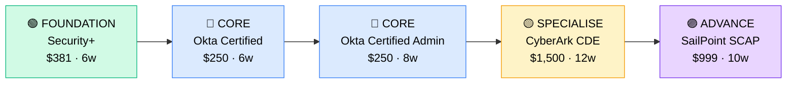

# How to Become an IAM Engineer

**`CP34`** · **Security** · _Time to hire: 12–18 months_ · _Entry cost: $1,400–$2,200 USD_

> **Path summary:** This path takes you from a sysadmin or help desk background to a hired IAM Engineer role using industry-leading identity platforms (Okta, CyberArk, SailPoint), in 12–18 months. You'll manage who accesses what across the enterprise.

---

## Role Overview

### What does an IAM Engineer actually do?

An IAM Engineer controls access to systems and data—the gatekeeper role. You spend your days: designing authentication and authorisation policies (who logs in, what they can access), managing identity platforms like Okta (user federation, SSO), provisioning/deprovisioning users, enforcing multi-factor authentication, auditing access logs, and responding to access requests. You might spend 3 hours designing a zero-trust network access policy for a new employee, 2 hours investigating an unauthorised access attempt, and 1 hour training a department on password best practices. Tools you use daily: Okta, CyberArk, SailPoint, Active Directory, LDAP, and API-based identity management platforms. You also write access control policies, documentation, and compliance reports (SOC 2, ISO 27001).

IAM teams sit in enterprises (especially finance, government, healthcare), cloud providers, and managed security service providers. A typical IAM team is 2–8 people. You collaborate with sysadmins (who implement your policies), security architects (who design access models), and compliance teams (who audit you). IAM work is not on-call heavy but critical—a botched user provisioning can lock out a department. Most roles are hybrid or onsite; some work is hands-on and requires access to physical infrastructure or domain controllers. The work is intellectually rewarding—you're balancing security (tight controls) with usability (employees can work).

### Demand in 2026

- **Global job postings:** 4,200+ active IAM engineer roles on LinkedIn as of May 2026. [(source)](https://www.linkedin.com/jobs/search/?keywords=identity+access+management+engineer)
- **Growth rate:** 12% YoY / Expected to grow 18% through 2032 as enterprises adopt zero-trust. [(source)](https://www.linkedin.com/jobs/)
- **South Africa:** Strong demand at banks (Standard Bank, Nedbank, ABSA, FirstRand), insurance (Discovery, Old Mutual), government agencies (SARS, SSA), and large enterprises. Many SA companies are migrating to cloud (Azure, Google Workspace) and need IAM engineers.
- **Remote availability:** Medium-high (60%+). Much work can be remote, but some hands-on infrastructure work requires onsite access.

---

## Who Is This Path For?

### Ideal starting backgrounds

| Background | Readiness | What you already have |
|---|---|---|
| Windows / Linux Sysadmin | ✅ Excellent start | AD knowledge, user management, access control thinking |
| Network Technician | 🟡 Good with gaps | Networking basics; needs identity platform knowledge |
| Help Desk / Desktop Support | 🟡 Good with gaps | User interaction skills; needs deep technical depth |
| IT Security Analyst | ✅ Good start | Security mindset, policy knowledge; needs hands-on IAM |
| Cloud Administrator (Azure, GCP) | ✅ Excellent start | Cloud identity (Entra ID, GCP Identity) highly relevant |
| Software Developer | 🟡 Good with gaps | API thinking helps; needs IAM concepts and tool knowledge |
| Complete career changer | 🔴 Needs foundation | Start with sysadmin fundamentals or CompTIA Security+ first |

### You're ready to start this path if you can:
- Explain how Active Directory authentication and Group Policy work
- Understand the difference between authentication (who you are) and authorisation (what you can access)
- Navigate Active Directory Users and Computers or entra.microsoft.com
- Explain OAuth 2.0 and SAML in simple terms

> **Not ready yet?** Start with [CompTIA Security+ (CP06)](../Roadmaps/CP06_Security_CompTIA_Security_Plus.md) and Windows/Linux sysadmin fundamentals first.

---

## Certification Sequence

### Visual path

---

### Stage 1 — Foundation (Months 0–3)

**Goal:** Baseline security knowledge and understanding of authentication/authorisation concepts before specialising in IAM platforms.

| Cert | Code | Cost (USD) | Study Time | Why it matters |
|---|---|---:|---:|---|
| CompTIA Security+ | `SY0-601` | $381 | 6–8 weeks | Baseline security, access control, authentication/authorisation, cryptography. |

**Stage 1 total:** $381 USD · R6,858 ZAR · 2–3 months

**Study approach:** Use Professor Messer (free) + Jason Dion (Udemy). Focus 60% on security, 40% on access control and authentication concepts. Target 80%+ on practice exams. Lab requirement: set up Active Directory in VirtualBox, create users and groups, configure GPOs for password policies. Minimum 15 hours hands-on.

---

### Stage 2 — Core Specialisation (Months 3–11)

**Goal:** Get hands-on with industry-leading IAM platform (Okta). Both Okta Certified Professional and Administrator certifications.

| Cert | Code | Cost (USD) | Study Time | Why it matters |
|---|---|---:|---:|---|
| Okta Certified Professional | `OCP` | $250 | 6–8 weeks | Entry-level Okta certification. Covers platform basics, user lifecycle, authentication/authorisation. |
| Okta Certified Administrator | `OCA` | $250 | 8–10 weeks | Advanced Okta administration. Covers security policies, multi-factor auth, integrations, API. |

**Stage 2 total:** $500 USD · R9,000 ZAR · 4–5 months

**Study approach:** 
- **Okta Certified Professional:** Use Okta's official training and labs (free trial instances). Focus on user provisioning, authentication flows (OAuth, SAML), and API basics. Complete all Okta hands-on labs. Schedule exam when scoring 85%+ on practice tests.
- **Okta Certified Administrator:** Deepen knowledge of security policies, multi-factor authentication, lifecycle management, and API integrations. Build a lab project: integrate Okta with multiple applications (Google Workspace, Salesforce, GitHub). Schedule exam after hands-on completion.

**Project milestone:** 
Build an **IAM architecture design**: Design a single sign-on (SSO) system for a fictional enterprise (1,000 users across 3 locations). Use Okta as the identity provider. Include: user lifecycle management, multi-factor authentication policy, integration with 5–6 apps (Google Workspace, Salesforce, Jira, etc.), access control policies, and security best practices. Document in a 5–7 page design document with diagrams. This is a portfolio piece and interview talking point.

---

### Stage 3 — Advanced Specialisation (Months 11–17)

**Goal:** Add depth in enterprise IAM platforms: either CyberArk (privileged access management) or SailPoint (access governance).

| Cert | Code | Cost (USD) | Study Time | Why it matters |
|---|---|---:|---:|---|
| CyberArk Certified Defender Expert (CDE) or CyberArk Certified PAM Consultant (CPC) | `CDE` or `CPC` | $1,500 | 12–14 weeks | Privileged access management (PAM). Protects admin accounts and secrets. Critical in enterprise security. |
| SailPoint IdentityNow Architect (SCAP) | `SCAP` | $999 | 10–12 weeks | Access governance and identity analytics. Manages access across the enterprise. Alternative to CyberArk. |

**Stage 3 total:** $1,500–$999 USD · R27,000–R17,982 ZAR · 3–4 months

> **Typical path:** Okta (Stage 2) + CyberArk (Stage 3) is common—together they cover authentication (Okta) and privileged access (CyberArk). SailPoint is an alternative for governance-focused roles.

---

### Stage 4 — Expert / Leadership (18–36 months+)

**Goal:** Senior-level or architect credentials. Tackle after 2–3 years of hands-on IAM work.

| Cert | Code | Cost (USD) | Study Time | Why it matters |
|---|---|---:|---:|---|
| Microsoft Entra ID Architect Expert (Azure AD) | `AZ-104 + AZ-305` | $462 | 12–14 weeks | For cloud-native IAM (Azure). Positions you for cloud security architect roles. |
| AWS Identity Services Architect | (emerging) | $300–$500 | 10–12 weeks | For AWS-centric enterprises. Growing credential as AWS IAM becomes critical. |

> These require significant hands-on cloud experience. Pursue after 2–3 years in IAM roles.

---

## Timeline & Cost Summary

| Stage | Certs | Duration | Cost (USD) | Cost (ZAR) |
|---|---|---|---:|---:|
| Stage 1 — Foundation | Security+ | Months 0–3 | $381 | R6,858 |
| Stage 2 — Core | Okta Cert + Okta Admin | Months 3–11 | $500 | R9,000 |
| Stage 3 — Advanced | CyberArk CDE or SailPoint | Months 11–17 | $1,500–$999 | R27,000–R17,982 |
| **Total to hireable (Stage 1–2)** | **Security+ + Okta Certs** | **11–14 months** | **$881** | **R15,858** |

**Study hours required:** ~300–400 hours total (Stage 1–2). Assumes 20–25 hours/week = 12–20 weeks.

---

## Salary Progression

> All figures: median base salary, not including bonuses/equity. ZAR = USD × 18 baseline (verified May 2026). Sources: Robert Half 2026, Glassdoor, LinkedIn Salary.

| Experience Level | USD/year | ZAR/year | GBP/year | EUR/year | AUD/year |
|---|---:|---:|---:|---:|---:|
| Entry / Junior (0–2 yrs) | $80,000 | R1,440,000 | £63,000 | €71,000 | A$120,000 |
| Mid-level (2–5 yrs) | $110,000 | R1,980,000 | £87,000 | €98,000 | A$165,000 |
| Senior (5–8 yrs) | $140,000 | R2,520,000 | £110,000 | €124,000 | A$210,000 |
| Lead / Architect (8+ yrs) | $160,000–$185,000 | R2,880,000–R3,330,000 | £126,000–£145,000 | €141,000–€164,000 | A$240,000–A$278,000 |

**South Africa note:** Entry-level IAM engineers at Johannesburg-based banks earn R51,000–R75,000/month. Mid-level (3–5 years) command R80,000–R125,000/month. Remote work for international companies yields R100,000–R180,000/month. Government agencies (SARS, SSA) typically pay lower (R45,000–R70,000/month) but offer stability and benefits.

**Salary accelerators:** Okta certification + CyberArk certification commands 15–20% premium. Active cloud platform experience (Azure Entra ID, AWS IAM) adds 10–15%. Published thought leadership on IAM and zero-trust adds credibility and premium pay.

---

## First Job Strategy

### Month 0–3: Build the Foundation

1. **Set up your IAM lab** — Download Active Directory (Windows Server 2022) and set up in VirtualBox. Add Okta free tier. Cost: $0.
2. **Start Security+** — Professor Messer + Jason Dion. Focus on access control and authentication.
3. **Build AD expertise** — Create users, groups, GPOs. Understand user lifecycle management.
4. **Join IAM community** — Reddit: r/sysadmin, r/cybersecurity. Discord: SANS Cyber Aces. LinkedIn: follow Okta, CyberArk thought leaders.

### Month 3–9: Build Your Portfolio

1. **Project 1: SSO Architecture Design (8–10 hours)** — Design a single sign-on system for a fictional company (1,000 users, 3 locations, 10 apps). Use Okta. Document architecture, user lifecycle, MFA policy, app integration steps. Create a design diagram.

2. **Project 2: Active Directory Lab (10–12 hours)** — Build a realistic AD environment: multiple users, groups, OUs, GPOs. Implement password policies, MFA (using Windows Hello or Azure MFA), and audit policies. Document your setup.

3. **Project 3: Identity Governance Design (6–8 hours)** — Design an access request and approval workflow. Outline: how employees request access, approval chain, provisioning automation, access reviews quarterly. Document in a process diagram.

4. **Project 4: Zero-Trust Identity Policy (8–10 hours)** — Design a zero-trust identity policy for a company. Include: multi-factor authentication everywhere, access based on device posture, least privilege access, continuous monitoring. Document policy in a 3–4 page design.

### Month 9–15: Apply and Iterate

- **CV positioning:** List yourself as "IAM Engineer (Okta Certified Professional + Administrator)" once certified. Before certs, list as "Identity & Access Management Specialist" or "IT Security Administrator".
- **Target companies:** Start with large enterprises (banks, government, insurance). Okta adoption is highest at Tier-1 organisations. MSPs are good entry point too. Fintech (smaller, faster-moving) may hire but prefer experienced talent.
- **Interview prep:** Be ready to discuss: 1) Your SSO architecture design; 2) Active Directory Group Policy and security best practices; 3) Multi-factor authentication policy you'd design; 4) User provisioning and deprovisioning process; 5) A security incident involving IAM and how you'd prevent it; 6) OAuth 2.0 vs. SAML.
- **Salary negotiation:** IAM roles in SA advertise at R51k–R65k/month entry-level. With Okta certs, negotiate for R70k–R90k/month. International remote roles (UK/US tech companies using Okta) are R100k–R150k/month—actively target those.

---

## A Day in the Life

### IAM Engineer at a Major Bank (Nedbank, Johannesburg) — Junior Level

**08:00** — Arrive. Review access requests in Okta. 23 new hire on-boarding requests: finance, IT, operations. You'll provision them today. Check the standard access groups for each department (finance gets QuickBooks + general office apps, etc.).

**09:00** — Begin provisioning. Bulk upload 23 users to Okta (CSV file). Okta auto-provisions them to Google Workspace, Jira, Salesforce, and the internal portal. Confirm all provisioning completed. Send welcome emails with MFA setup instructions.

**10:30** — Work on access reviews. Quarterly review of manager access: ensure managers only have access needed for their role. Download from Okta, send to departments for review and sign-off. Document approvals.

**12:00** — Lunch.

**13:00** — Investigate an anomaly: a user tried to log in from 5 different countries in 1 hour (bot attack or account compromise). Trigger user to re-authenticate with stronger MFA. Confirm with the user it was them (it wasn't—account compromised). Force password reset, review recent login history, alert SOC of potential breach.

**15:00** — Document the incident and tighten MFA policy: all executives now require biometric MFA (not just SMS code). Communicate new policy to users.

**16:30** — Respond to a department head asking for custom access (not in standard groups). Review the request, document in Jira, check with the security architect if it meets least privilege principle. Approve and provision.

**17:00** — Wrap up. Close out Okta tickets, prepare for tomorrow.

### IAM Engineer at a Global Tech Company (Remote, EMEA-based) — Mid-Level

**09:00** — Async standup. Overnight, the company onboarded 50 new contractors via bulk import. Okta provisioning ran smoothly. You review the logs: 49 successful, 1 failed (email format issue—you'll fix it manually).

**10:00** — Work on zero-trust architecture. The company is rolling out a zero-trust identity model company-wide. You're designing the identity components: continuous risk assessment, adaptive MFA (stronger for sensitive apps), and device posture checks (only company devices access HR/finance). Meet with architects and compliance to refine.

**12:00** — Lunch + a quick consultation call with a department. They want to integrate a new SaaS tool with Okta. You review the vendor's OAuth/SAML support, assess security, and draft an integration plan (2–3 hours of work).

**13:00** — Build the integration in the lab: configure OAuth flow between Okta and the new app. Test user provisioning and deprovisioning. Works cleanly.

**14:30** — Document the integration process and create a playbook for future SaaS onboarding (will save time next time).

**16:00** — Review CyberArk platform (parallel responsibility). A new admin added 5 privileged accounts for database access. Ensure all comply with least privilege and are properly audited. Review in CyberArk vault.

**17:00** — Wrap up. Check for urgent access requests or incidents. None. Plan for next week: zero-trust rollout phase 2.

---

## Related Paths & Progressions

| From here you can move to… | Why |
|---|---|
| [Security Architect (upcoming path)](../Roadmaps/) | IAM expertise informs enterprise security architecture. Natural progression. |
| [Cloud Security Engineer (upcoming path)](../Roadmaps/) | IAM is a cloud security pillar. Easy transition to cloud-native security. |
| [Compliance & GRC Manager (upcoming path)](../Roadmaps/) | IAM expertise supports compliance audits (SOC 2, ISO 27001, POPIA). |
| [Security Operations Manager (upcoming path)](../Roadmaps/) | Lead IAM teams after 3–5 years. Many IAM engineers move into management. |

---

## South Africa Context

### Market specifics

IAM demand in SA is strong, especially at banks and government. Every major bank (Nedbank, ABSA, Standard Bank) has an IAM team managing 50,000+ employees and contractor access. Government agencies (SARS, SSA) are modernising identity infrastructure. Insurance companies (Discovery, Old Mutual) and large retailers are investing in IAM as they move to cloud (Google Workspace, Microsoft 365).

The IAM talent market in SA is less saturated than cloud or networking, creating opportunity for new entrants. Okta adoption is rapid—most enterprises are migrating from on-premises Active Directory to cloud-first models. This creates immediate demand for Okta-certified engineers.

Remote work is available but not dominant. Much IAM work involves hands-on access to domain controllers, VPNs, and infrastructure (cannot be done from home). However, 30–40% of IAM work is remote-friendly: platform configuration, user management, documentation, design.

BEE/EE: Large enterprises have equity initiatives. IAM certs help candidates from all backgrounds compete fairly.

### SA-specific resources

| Resource | URL | Note |
|---|---|---|
| Nedbank & ABSA Careers | [careers.nedbank.co.za](https://careers.nedbank.co.za) / [absa.co.za/careers](https://absa.co.za/careers) | Post IAM roles regularly. Growth area. |
| Dimension Data / NTT Security | [dimensiondata.com/solutions/security](https://dimensiondata.com/solutions/security) | EMEA IAM practice with SA base. |
| Google Workspace & Azure Directories | [workspace.google.com](https://workspace.google.com) / [microsoft.com/en-za/microsoft-365](https://microsoft.com/en-za/microsoft-365) | Growing adoption in SA drives IAM demand. |
| Okta Customer Success Community | [community.okta.com](https://community.okta.com) | Peer support, best practices, local case studies. |
| CompTIA Security+ Study Groups | [reddit.com/r/CompTIA](https://reddit.com/r/CompTIA) | Entry-level foundation community. |

---

## Frequently Asked Questions

**Q: Do I need to start as a sysadmin first?**

Not strictly, but it helps. If you have sysadmin or IT support experience, you understand user management and access control—IAM is a natural progression. If you're coming from security (SOC, analyst), you can jump to IAM directly, but you'll need to learn Active Directory deeply (3–4 months hands-on). Either path works.

**Q: Which platform should I learn first: Okta, CyberArk, or SailPoint?**

Start with **Okta** (Stage 2). It's the most broadly adopted, easiest to learn, and most likely to get you hired quickly. CyberArk (PAM) is excellent but more specialised—typically hired after you know Okta. SailPoint (governance) is slower to learn and smaller market. Most people: Okta → CyberArk path.

**Q: How much hands-on Active Directory do I need to know?**

Deep knowledge. You need to understand: user objects, groups, Group Policy, password policies, delegation, trusts, and replication. Spend 30–40 hours in a lab building and managing realistic AD environments. This is non-negotiable—every enterprise uses AD somewhere.

**Q: What if my company doesn't use Okta—can I still use the certs?**

Yes. Okta certs teach you cloud identity fundamentals (OAuth, SAML, user lifecycle) that transfer to Azure AD (Microsoft Entra ID), Google Workspace, and other platforms. However, Okta itself is the most in-demand platform in the market, and having the cert opens more doors globally.

**Q: Is IAM work repetitive?**

It can be if you're purely doing user provisioning. But strategic IAM work (designing access policies, implementing zero-trust, security architecture) is intellectually challenging and well-paid. Early career is more repetitive; as you advance, you move to architecture and strategy.

---

## Sources & Further Reading

| # | Source | URL | Used for |
|---|---|---|---|
| 1 | LinkedIn Jobs | [linkedin.com/jobs/search/?keywords=identity+access+management+engineer](https://www.linkedin.com/jobs/search/?keywords=identity+access+management+engineer) | Job postings, May 2026 |
| 2 | Okta Certification | [okta.com/certifications/](https://www.okta.com/certifications/) | Certification details, requirements, exam info |
| 3 | CyberArk Training | [cyberark.com/training/](https://www.cyberark.com/training/) | PAM platform and certification paths |
| 4 | SailPoint Training | [sailpoint.com/training/](https://www.sailpoint.com/training/) | Access governance and architect certifications |
| 5 | Microsoft Entra ID (Azure AD) | [microsoft.com/en-us/security/business/identity-access/microsoft-entra-id](https://www.microsoft.com/en-us/security/business/identity-access/microsoft-entra-id) | Cloud identity platform—alternative to Okta |
| 6 | Robert Half 2026 Salary Guide | [roberthalf.com/salary-guide](https://www.roberthalf.com/salary-guide) | Market salaries for security roles |
| 7 | Zero Trust Architecture (NIST) | [nist.gov/publications/zero-trust-architecture](https://www.nist.gov/publications/zero-trust-architecture) | Modern IAM thinking and frameworks |
| 8 | PayScale ZA Data | [payscale.com/research/ZA/](https://www.payscale.com/research/ZA/) | South Africa salary benchmarks |

---

*Career path guide for IAM engineers | Last updated 2026-05-02 | ZAR baseline: R18/$1 USD*
*For updates and job leads, see [IT Career Roadmap](https://itcareerroadmap.com)*
