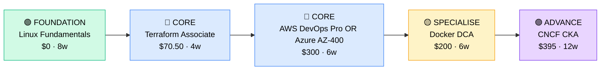

# How to Become a DevOps Engineer

**`CP35`** · **DevOps / Platform** · _Time to hire: 15–24 months_ · _Entry cost: $1,000–$1,700 USD_

> **Path summary:** This path takes you from a sysadmin or junior developer background to a hired DevOps Engineer role using infrastructure automation (Terraform), cloud platforms (AWS/Azure), containerisation (Docker), and CI/CD tools, in 15–24 months. You'll bridge development and operations.

---

## Role Overview

### What does a DevOps Engineer actually do?

A DevOps Engineer is the bridge between developers who write code and operations teams who run systems. You spend your days: writing infrastructure-as-code (Terraform) to provision servers, designing CI/CD pipelines (GitHub Actions, GitLab CI, Jenkins) to automate testing and deployment, managing containerised applications (Docker, Kubernetes), monitoring systems (Prometheus, Grafana), and responding to deployment issues. You might spend 3 hours writing a Terraform module to set up a load-balanced application environment, 2 hours debugging a failed CI/CD pipeline, and 1 hour optimising cloud costs. Tools you use daily: Terraform, Docker, Kubernetes, AWS/Azure CLI, Git, Jenkins or GitHub Actions, Prometheus, and ELK stack.

DevOps teams sit in tech companies, cloud-native startups, fintechs, and enterprises modernising their infrastructure. A typical DevOps team is 3–10 people. You collaborate with developers (your primary users), infrastructure engineers (who handle networking and security), and product teams (who need fast deployments). DevOps work is on-call—you're responsible for production systems. However, well-designed systems have less on-call burden. Most roles are remote or hybrid; infrastructure work scales well to remote teams. The work is intellectually rewarding—you're solving scalability and reliability challenges.

### Demand in 2026

- **Global job postings:** 9,200+ active DevOps engineer roles on LinkedIn as of May 2026. [(source)](https://www.linkedin.com/jobs/search/?keywords=devops+engineer)
- **Growth rate:** 16% YoY / Rapid adoption of cloud and containerisation drives demand. [(source)](https://www.linkedin.com/jobs/)
- **South Africa:** Strong demand at fintechs (PayFast, Yodlee), e-commerce (Takealot), cloud providers (Allocloud, Aerocommerce), and banks modernising infrastructure. Major consulting firms (Deloitte, PwC, Accenture) hire DevOps engineers for client engagements.
- **Remote availability:** Very high (75%+). Infrastructure code and deployment pipelines are location-agnostic.

---

## Who Is This Path For?

### Ideal starting backgrounds

| Background | Readiness | What you already have |
|---|---|---|
| Systems Administrator | ✅ Excellent start | Infrastructure knowledge, Linux/Windows expertise, automation thinking |
| Junior Software Developer | ✅ Excellent start | Coding skills, Git knowledge, understanding of application lifecycle |
| Build / Release Engineer | ✅ Excellent start | CI/CD pipeline experience, deployment knowledge |
| Network Technician | 🟡 Good with gaps | Networking basics; needs infrastructure automation and coding |
| Cloud Administrator (AWS/Azure) | ✅ Excellent start | Cloud platform knowledge; needs CI/CD and automation depth |
| IT Support / Help Desk | 🟡 Good with gaps | Troubleshooting mindset; needs deep technical depth |
| Complete career changer | 🔴 Needs foundation | Start with Linux/sysadmin and Python basics first; 6–9 months prep |

### You're ready to start this path if you can:
- Navigate Linux command line and write a simple Bash script
- Explain what containerisation is and why it matters
- Write basic Python or Go to automate simple tasks
- Understand Git workflow: commit, push, pull request
- Explain the value of infrastructure-as-code (Terraform)

> **Not ready yet?** Start with Linux fundamentals and a programming language (Python, Go) first.

---

## Certification Sequence

### Visual path

---

### Stage 1 — Foundation (Months 0–5)

**Goal:** Establish strong Linux fundamentals and cloud platform basics before specialising in DevOps tools.

| Cert | Code | Cost (USD) | Study Time | Why it matters |
|---|---|---:|---:|---|
| Linux Fundamentals (no formal cert) + AWS/Azure Free Tier Exploration | (self-paced) | $0 | 8–10 weeks | Linux command line and basic cloud platform knowledge. Essential foundation. |

**Stage 1 total:** $0 USD · R0 ZAR · 5 months

**Study approach:** Use free resources: Linux Academy (now Linux Foundation), freeCodeCamp YouTube Linux course, AWS/Azure free tier tutorials. Focus on: Linux filesystem, permissions, processes, networking, and basic cloud concepts (VPCs, subnets, instances). Build a home lab: launch a free EC2 instance or Azure VM, configure it, deploy a simple app manually. Minimum 50 hours hands-on.

**Lab requirement:** Set up a Linux VM in AWS Free Tier. Become comfortable with EC2, security groups, and SSH. Deploy a simple web application (Node.js or Python Flask) and access it from the internet. This validates your foundational knowledge.

---

### Stage 2 — Core Specialisation (Months 5–18)

**Goal:** Get the anchor DevOps certifications: Terraform Associate and AWS DevOps Professional (or Azure AZ-400).

| Cert | Code | Cost (USD) | Study Time | Why it matters |
|---|---|---:|---:|---|
| HashiCorp Terraform Associate (003) | `003` | $70.50 | 4–6 weeks | Infrastructure-as-code fundamentals. Terraform is the industry standard. Every DevOps job expects this. |
| AWS Certified DevOps Engineer – Professional (DOP-C02) OR Azure DevOps Engineer Expert (AZ-400) | `DOP-C02` or `AZ-400` | $300 each | 6–8 weeks | Cloud platform DevOps mastery. Choose based on your target companies' cloud preference. |

**Stage 2 total:** $370.50–$642.50 USD · R6,669–R11,565 ZAR · 5–6 months

**Study approach:** 
- **Terraform Associate:** Use Terraform documentation (excellent) and A Cloud Guru / Udemy courses. Build 5–6 Terraform projects of increasing complexity: basic EC2, multi-tier app, modules, state management. Schedule exam when you can pass practice tests 80%+ and can write Terraform code from memory.
- **AWS DOP-C02 or Azure AZ-400:** Use official cloud provider training, A Cloud Guru, or Udemy. For AWS, focus on: CodePipeline, CodeBuild, CodeDeploy, Lambda, CloudFormation. For Azure, focus on: Azure Pipelines, Azure DevOps, Infrastructure as Code. Build CI/CD pipelines in the cloud. Deploy real applications end-to-end.

**Project milestone:** 
Build a **complete CI/CD pipeline**: Code repository (GitHub) → Automated tests (unit, integration) → Build artifact (Docker image) → Deploy to staging (AWS or Azure) → Manual approval → Deploy to production. Use Terraform to provision infrastructure, GitHub Actions or Azure Pipelines for CI/CD. Document the entire workflow. This is your strongest portfolio piece.

---

### Stage 3 — Advanced Specialisation (Months 18–24)

**Goal:** Add containerisation and orchestration depth: Docker and Kubernetes basics.

| Cert | Code | Cost (USD) | Study Time | Why it matters |
|---|---|---:|---:|---|
| Docker Certified Associate (DCA) | `DCA` | $200 | 6–8 weeks | Container fundamentals. Every modern DevOps role uses Docker. |
| CNCF Certified Kubernetes Administrator (CKA) | `CKA` | $395 | 12–14 weeks | Kubernetes orchestration. Industry standard for container orchestration. Optional at hire time but valuable. |

**Stage 3 total:** $595 USD · R10,710 ZAR · 4–5 months

> **Optional at hire time:** Many DevOps engineers get hired after Stage 2 (Terraform + AWS DOP) and learn Docker/Kubernetes on the job. However, having CKA differentiates you significantly.

---

### Stage 4 — Expert / Leadership (24–36 months+)

**Goal:** Advanced cloud architecture or Kubernetes expertise. Tackle after 2–3 years of hands-on DevOps work.

| Cert | Code | Cost (USD) | Study Time | Why it matters |
|---|---|---:|---:|---|
| AWS Solutions Architect – Professional (SAP) or Azure Solutions Architect Expert | `SAP` or `AZ-305` | $300 each | 12–14 weeks | Architecture-level cloud expertise. Positions you for senior DevOps or cloud architect roles. |
| CNCF Certified Kubernetes Application Developer (CKAD) or CKS | `CKAD` or `CKS` | $395 each | 10–12 weeks | Advanced Kubernetes. For specialists in container platforms. |

> These require 2–3 years of hands-on experience. Pursue after becoming comfortable in a DevOps role.

---

## Timeline & Cost Summary

| Stage | Certs | Duration | Cost (USD) | Cost (ZAR) |
|---|---|---|---:|---:|
| Stage 1 — Foundation | Linux + Cloud Basics | Months 0–5 | $0 | R0 |
| Stage 2 — Core | Terraform + AWS DOP (or Azure AZ-400) | Months 5–18 | $370.50–$642.50 | R6,669–R11,565 |
| Stage 3 — Advanced | Docker DCA + CKA | Months 18–24 | $595 | R10,710 |
| **Total to hireable (Stage 1–2)** | **Linux + Terraform + AWS DOP/Azure** | **15–20 months** | **$370.50–$642.50** | **R6,669–R11,565** |

**Study hours required:** ~500–700 hours total (Stage 1–3). Assumes 25 hours/week = 20–28 weeks.

---

## Salary Progression

> All figures: median base salary, not including bonuses/equity. ZAR = USD × 18 baseline (verified May 2026). Sources: Robert Half 2026, Glassdoor, PayScale, LinkedIn Salary.

| Experience Level | USD/year | ZAR/year | GBP/year | EUR/year | AUD/year |
|---|---:|---:|---:|---:|---:|
| Entry / Junior (0–2 yrs) | $85,000 | R1,530,000 | £67,000 | €75,000 | A$128,000 |
| Mid-level (2–5 yrs) | $120,000 | R2,160,000 | £94,000 | €106,000 | A$180,000 |
| Senior (5–8 yrs) | $155,000 | R2,790,000 | £122,000 | €137,000 | A$233,000 |
| Lead / Staff (8+ yrs) | $180,000–$220,000 | R3,240,000–R3,960,000 | £141,000–£173,000 | €159,000–€196,000 | A$270,000–A$330,000 |

**South Africa note:** Entry-level DevOps engineers at Johannesburg-based companies earn R54,000–R80,000/month. Mid-level (3–5 years) command R85,000–R130,000/month. Remote work for international tech companies (Google, Amazon, Microsoft) yields R120,000–R200,000/month. Startups often pay lower (R50k–R75k/month) but offer equity and learning.

**Salary accelerators:** AWS DOP + Terraform + Docker commands 15–20% premium over non-certified peers. CKA adds another 10–15%. Open-source contributions (Terraform modules, Kubernetes helpers on GitHub) boost credibility and pay. Cloud cost optimisation expertise is increasingly valued.

---

## First Job Strategy

### Month 0–5: Build the Foundation

1. **Set up your DevOps lab** — AWS Free Tier account (cost: $0 for first year, then ~$10/month after). Launch EC2 instances, experiment with RDS, VPC.
2. **Learn Linux** — Use Linux Academy or freeCodeCamp. Target: comfortable with CLI, scripting, permissions, networking. 30–40 hours.
3. **Explore cloud** — Spend time in AWS/Azure consoles. Create and destroy resources. Understand what each service does.
4. **Join DevOps community** — Reddit: r/devops, r/aws. Discord: DevOps/cloud communities. GitHub: follow Terraform and Kubernetes projects.

### Month 5–12: Build Your Portfolio

1. **Project 1: Terraform Multi-Tier Application (12–14 hours)** — Write Terraform code to provision a realistic application: VPC, subnets, security groups, load balancer, auto-scaling EC2s, RDS database. Include modules and state management. Push to GitHub. Document with README.

2. **Project 2: CI/CD Pipeline (10–12 hours)** — Set up GitHub Actions or Azure Pipelines. Create pipeline: code commit → unit tests → build Docker image → push to Docker Hub → deploy to AWS/Azure. Include automated tests and deployments.

3. **Project 3: Docker Containerisation (8–10 hours)** — Take an existing web app (Python Flask, Node.js). Containerise it: write Dockerfile, optimise image size, push to Docker Hub, run in AWS ECS or Azure ACI. Document the process.

4. **Project 4: Infrastructure Monitoring (6–8 hours)** — Set up basic monitoring: CloudWatch (AWS) or Azure Monitor. Create dashboards for CPU, memory, network. Set up alarms for anomalies. Document in a blog post.

### Month 12–18: Apply and Iterate

- **CV positioning:** List yourself as "DevOps Engineer" once you have Terraform + AWS/Azure certs. Before certs, list as "Infrastructure Automation Engineer" or "Cloud Systems Administrator".
- **Target companies:** Start with startups and cloud-native companies (faster hiring, growth mindset). Then move to established tech and fintechs. Large enterprises (banks, government) usually want 1–2 years experience before hiring.
- **Interview prep:** Be ready to discuss: 1) Your Terraform project and architectural decisions; 2) Your CI/CD pipeline and tools; 3) Containerisation with Docker; 4) Cloud cost optimisation; 5) Monitoring and alerting strategies; 6) A production incident and how you'd prevent it.
- **Salary negotiation:** DevOps roles in SA advertise at R54k–R75k/month entry-level. With Terraform + AWS DOP, negotiate for R80k–R110k/month. International remote roles are R120k–R180k/month—actively target those.

---

## A Day in the Life

### DevOps Engineer at a Fintech Startup (Johannesburg) — Junior Level

**09:00** — Standup with development and DevOps team. Today's priority: deploy a new payment module to production. You've already set up the staging environment yesterday.

**09:30** — Review the CI/CD pipeline status. Code was committed at 08:00, tests passed (2 hours), Docker image built and pushed (30 minutes). Now waiting for manual approval before production deployment. You coordinate with the dev lead: ready to go? Yes. You approve the pipeline.

**10:00** — Monitor the deployment. Pipeline deploys to production: 5 minutes for DNS switch, 3 minutes for load balancer warmup. All checks pass. You confirm with ops: system is stable. Good.

**10:30** — Work on your assigned task: optimise the CI/CD pipeline. Currently takes 45 minutes from commit to deployment. You find the bottleneck: unit tests are running sequentially. You parallelise them. New time: 30 minutes. Commit change to pipeline.

**12:00** — Lunch.

**13:00** — Work on infrastructure-as-code: review a PR from a junior engineer writing new Terraform. Catch a mistake: security group allows ingress on port 22 from 0.0.0.0 (world can SSH). Request change. They fix it immediately.

**14:00** — Monitor production systems. CloudWatch shows elevated CPU on two instances. Investigate: spike in traffic (legitimate, from a marketing campaign). Auto-scaling policy kicks in: adds 2 more instances. CPU drops back to normal. Document this event—it's a learning opportunity.

**15:30** — Work on documentation: write a runbook for the new payment deployment (steps, rollback procedures, contacts). This helps on-call engineers if issues arise.

**16:30** — Wrap up. Check Jira for urgent issues. None. Close out tasks and plan tomorrow.

### DevOps Engineer at a Major Tech Company (Remote, EMEA) — Mid-Level

**09:00** — Async standup. Overnight, the platform team deployed a new Kubernetes upgrade. You review the logs: all clusters upgraded successfully, zero downtime. Excellent.

**10:00** — 1:1 with your manager. You're proposing a cost optimisation project: identify unused resources and rightssize instances. She approves and gives you 30% of your week for Q2.

**10:30** — Work on cost analysis. You find: 15 unused AWS instances, several oversized RDS databases, and unused elastic IPs. Create a report with recommendations and potential savings (R2.5M/year—significant).

**12:00** — Lunch + quick consultation. A team asks: "Can we deploy our app on Kubernetes?" You review their application, assess readiness, and draft a migration plan (3–6 months of work).

**13:00** — Work on the Kubernetes infrastructure. Design a multi-region setup for disaster recovery. Document architecture and implement with Terraform.

**15:00** — Review Terraform modules with the team. Ensure they follow best practices: modularity, variable naming, documentation. Approve and merge PRs.

**16:30** — Work on cost optimisation implementation. Terminate unused resources, right-size databases, remove unused elastic IPs. Track savings in a spreadsheet. Target: R2.5M/year saving achieved.

**17:30** — Wrap up. Check for on-call alerts (none). Plan next week.

---

## Related Paths & Progressions

| From here you can move to… | Why |
|---|---|
| [SRE / Platform Engineer (CP36_DevOps_SRE_Platform_Engineer.md)](CP36_DevOps_SRE_Platform_Engineer.md) | DevOps + deep software engineering = SRE. Natural progression. |
| [Cloud Architect (upcoming path)](../Roadmaps/) | DevOps expertise informs cloud architecture. Common progression to senior roles. |
| [Kubernetes / Container Engineer (CP38_DevOps_Kubernetes_Container_Engineer.md)](CP38_DevOps_Kubernetes_Container_Engineer.md) | Specialise deeper in Kubernetes. Many DevOps engineers become Kubernetes specialists. |
| [Infrastructure as Code Engineer (CP39_DevOps_IaC_Engineer.md)](CP39_DevOps_IaC_Engineer.md) | Deepen Terraform/Pulumi expertise. Some DevOps engineers specialise in IaC architecture. |

---

## South Africa Context

### Market specifics

DevOps is in high demand across SA's tech ecosystem. Fintechs (PayFast, Yodlee, Asorion) are scaling fast and need DevOps engineers to build reliable infrastructure. E-commerce (Takealot, Superbalist) is modernising CI/CD and containerisation. Banks are moving to cloud and need DevOps talent. Cloud providers (Allocloud, Aerocommerce) hire actively.

The DevOps market in SA is competitive but achievable. Companies prefer candidates with hands-on AWS/Azure experience and Terraform proficiency. Having GitHub projects demonstrating your work (Terraform modules, deployment scripts) is highly valued.

Remote work is excellent for DevOps. Infrastructure code can be written anywhere. Many SA DevOps engineers work fully remote for UK/US tech companies earning 2–3x local enterprise salary. Google, Amazon, Microsoft, and GitHub all have remote DevOps opportunities.

### SA-specific resources

| Resource | URL | Note |
|---|---|---|
| Takealot & Superbalist Careers | [careers.takealot.com](https://careers.takealot.com) / [superbalist.com/careers](https://superbalist.com/careers) | SA e-commerce giants actively hiring DevOps. |
| PayFast, Yodlee Careers | [careers pages] | Fast-growing SA fintechs. Heavy DevOps hiring. |
| AWS Training | [aws.amazon.com/training/](https://aws.amazon.com/training/) | Free and paid cloud training. AWS has SA presence. |
| Linux Foundation DevOps | [linuxfoundation.org/training/](https://www.linuxfoundation.org/training/) | Certified training for Kubernetes (CKA) and Linux. |
| SA DevOps Community | [meetup.com](https://meetup.com) / LinkedIn | Local meetup groups in Johannesburg, Cape Town. |

---

## Frequently Asked Questions

**Q: Should I learn AWS or Azure first?**

**AWS** if you want the broadest job market (AWS has 35%+ market share globally, higher in SA/EMEA). **Azure** if your target companies use Microsoft (banks often do). Ideal: learn AWS first (more roles), then Azure for breadth. Concepts transfer: both have VPCs, compute, databases, pipelines.

**Q: Can I become a DevOps engineer without a sysadmin background?**

Yes. If you're a developer, you understand code and CI/CD pipelines—great entry point. If you're from IT support, you understand troubleshooting—good foundation but need to learn cloud and automation. Either path works; expect 2–3 months to fill the gap.

**Q: Do I really need all these certs?**

Terraform Associate is essential. AWS DOP or Azure AZ-400 is highly valuable (opens doors). Docker DCA and CKA are nice-to-have but not required to get hired. Many DevOps engineers get hired after Terraform + AWS DOP, then learn Docker/Kubernetes on the job (employer often sponsors training).

**Q: Is DevOps work on-call heavy?**

Yes, typically. Most on-call rotations are 1 week per month. Well-designed systems have fewer pages. Startups and young teams are noisier (more pages). Mature companies have better runbooks and automation (fewer pages). If on-call concerns you, ask during interviews: "What's the on-call load and alert volume?"

**Q: What's the difference between DevOps and SRE?**

DevOps: automation, CI/CD, infrastructure. SRE: reliability, observability, incident response. DevOps is broad; SRE is deep. After 2–3 years in DevOps, you can specialise into SRE or stay broad. Both are well-paid.

---

## Sources & Further Reading

| # | Source | URL | Used for |
|---|---|---|---|
| 1 | LinkedIn Jobs | [linkedin.com/jobs/search/?keywords=devops+engineer](https://www.linkedin.com/jobs/search/?keywords=devops+engineer) | Job postings, May 2026 |
| 2 | Terraform Associate Exam | [hashicorp.com/certification/terraform-associate](https://www.hashicorp.com/certification/terraform-associate) | Certification details and exam info |
| 3 | AWS DevOps Professional | [aws.amazon.com/certification/certified-devops-engineer-professional/](https://aws.amazon.com/certification/certified-devops-engineer-professional/) | Cloud certification details |
| 4 | Azure DevOps Engineer | [learn.microsoft.com/en-us/certifications/azure-devops-engineer-expert/](https://learn.microsoft.com/en-us/certifications/azure-devops-engineer-expert/) | Microsoft Azure DevOps cert |
| 5 | Docker Certification | [docker.com/certification/](https://www.docker.com/certification/) | Container certification |
| 6 | CNCF CKA | [cncf.io/certification/cka/](https://www.cncf.io/certification/cka/) | Kubernetes certification |
| 7 | Terraform Documentation | [terraform.io/docs](https://www.terraform.io/docs) | Official IaC tool documentation |
| 8 | Robert Half 2026 Salary Guide | [roberthalf.com/salary-guide](https://www.roberthalf.com/salary-guide) | Market salaries for DevOps roles |

---

*Career path guide for DevOps engineers | Last updated 2026-05-02 | ZAR baseline: R18/$1 USD*
*For updates and job leads, see [IT Career Roadmap](https://itcareerroadmap.com)*
