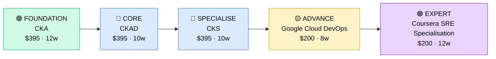

# How to Become a Site Reliability Engineer (SRE) / Platform Engineer

**`CP36`** · **DevOps / Platform** · _Time to hire: 18–24 months_ · _Entry cost: $1,400–$2,100 USD_

> **Path summary:** This path takes you from a DevOps engineer or software engineer background to a hired SRE/Platform Engineer role using deep Kubernetes, observability, and reliability practices, in 18–24 months. You'll design systems that don't fail.

---

## Role Overview

### What does an SRE / Platform Engineer actually do?

An SRE is a software engineer who works on infrastructure reliability and observability. You spend your days: writing code to automate operational tasks (Python, Go), designing systems that are resilient and scalable, implementing observability (metrics, logs, traces), responding to production incidents, and driving reliability improvements. Platform engineers build the underlying infrastructure platforms that developers use. You might spend 3 hours writing a Kubernetes operator to automate database backups, 2 hours analysing a production outage using logs and metrics, and 1 hour mentoring junior engineers on observability best practices. Tools you use daily: Kubernetes, Prometheus, Grafana, ELK/Datadog, Terraform, and significant amounts of Python/Go.

SRE teams sit in tech companies, cloud providers, fintechs, and large enterprises. Typical SRE teams are 5–15 people serving 50–500+ engineers. You collaborate closely with product engineers (your primary users), data engineers, and infrastructure teams. SRE work is on-call—you're responsible for system reliability. However, good automation and design reduce on-call pain. Most roles are hybrid or remote. The work is intellectually demanding—you're solving complex reliability problems and mentoring engineers.

### Demand in 2026

- **Global job postings:** 3,400+ active SRE and platform engineer roles on LinkedIn as of May 2026. [(source)](https://www.linkedin.com/jobs/search/?keywords=site+reliability+engineer+sre)
- **Growth rate:** 18% YoY / Fast-growing specialisation as companies prioritise reliability. [(source)](https://www.linkedin.com/jobs/)
- **South Africa:** Growing demand at tech companies (Takealot), fintechs (PayFast, Yodlee), and cloud-native startups. Government and banks are beginning to hire SREs as they modernise infrastructure.
- **Remote availability:** Very high (80%+). Observability and system design are location-agnostic.

---

## Who Is This Path For?

### Ideal starting backgrounds

| Background | Readiness | What you already have |
|---|---|---|
| DevOps Engineer (2+ years) | ✅ Excellent start | Infrastructure and automation expertise; needs software engineering depth |
| Software Engineer (systems focus) | ✅ Excellent start | Coding and design skills; needs infrastructure and observability |
| Platform Engineer | ✅ Excellent start | Platform thinking and design; needs SRE methodology and observability |
| Backend Engineer | 🟡 Good with gaps | Coding skills strong; needs infrastructure, Kubernetes, and observability knowledge |
| Systems Administrator (5+ years) | 🟡 Good with gaps | Infrastructure knowledge deep; needs software engineering and Kubernetes |
| Junior DevOps Engineer | 🔴 Needs experience | Start with 2–3 years as DevOps engineer before transitioning to SRE |

### You're ready to start this path if you can:
- Explain the difference between monitoring (metrics) and observability (metrics + logs + traces)
- Write a Python or Go script to automate an operational task
- Explain Kubernetes architecture (control plane, nodes, pods, services)
- Design a system that can tolerate failure of 1/3 of infrastructure

> **Not ready yet?** Spend 2–3 years as a DevOps engineer first. SRE builds on DevOps foundation.

---

## Certification Sequence

### Visual path

---

### Stage 1 — Foundation (Months 0–6)

**Goal:** Deep Kubernetes mastery and certification before specialising in observability and reliability.

| Cert | Code | Cost (USD) | Study Time | Why it matters |
|---|---|---:|---:|---|
| CNCF Certified Kubernetes Administrator (CKA) | `CKA` | $395 | 12–14 weeks | Kubernetes administration. Foundation for SRE platform work. Every SRE needs this. |

**Stage 1 total:** $395 USD · R7,110 ZAR · 3–4 months

**Study approach:** Use Linux Foundation Kubernetes for Developers (LFD259) or third-party CKA prep courses. Hands-on labs are critical: use KodeKloud, Udemy, or Linux Academy. Focus on: cluster administration, RBAC, etcd backup/recovery, networking, storage, troubleshooting. Expect 80+ hours. Lab requirement: deploy a multi-node Kubernetes cluster (minikube or kubeadm), run real workloads, troubleshoot failures.

---

### Stage 2 — Core Specialisation (Months 6–16)

**Goal:** Advanced Kubernetes certification (CKAD, CKS) and observability/SRE practices.

| Cert | Code | Cost (USD) | Study Time | Why it matters |
|---|---|---:|---:|---|
| CNCF Certified Kubernetes Application Developer (CKAD) | `CKAD` | $395 | 10–12 weeks | Application development on Kubernetes. Required to guide developers. |
| CNCF Certified Kubernetes Security Specialist (CKS) | `CKS` | $395 | 10–12 weeks | Kubernetes security. Critical for production systems. SREs must understand security. |

**Stage 2 total:** $790 USD · R14,220 ZAR · 5–6 months

**Study approach:** 
- **CKAD:** Focus on: pod design, configuration, deployments, services, observability, and troubleshooting. Very practical, hands-on exam.
- **CKS:** Focus on: cluster hardening, image security, runtime security, and policies. Requires CKA prerequisite (you'll have it).

**Project milestone:** 
Build a **complete observability stack**: Deploy Prometheus (metrics), Grafana (visualization), ELK (logs), and Jaeger (traces) in Kubernetes. Instrument a multi-tier application to send metrics, logs, and traces. Create dashboards and alerts in Grafana. Write a runbook that uses observability to troubleshoot a failure. This demonstrates SRE thinking.

---

### Stage 3 — Advanced Specialisation (Months 16–22)

**Goal:** Cloud-platform SRE practices and incident response mastery.

| Cert | Code | Cost (USD) | Study Time | Why it matters |
|---|---|---:|---:|---|
| Google Cloud Professional DevOps Engineer OR AWS Certified DevOps Engineer – Professional | `GCP DevOps` or `AWS DOP-C02` | $200 | 8–10 weeks | Cloud-native SRE practices. Choose platform of your target companies. |

**Stage 3 total:** $200 USD · R3,600 ZAR · 2–3 months

> **Optional but valuable:** Many SREs skip formal cloud certs and learn on the job. However, having the cert opens doors to cloud-native companies.

---

### Stage 4 — Expert / Leadership (24–36 months+)

**Goal:** SRE specialisation and advanced reliability practices. Tackle after 3+ years of hands-on SRE work.

| Cert | Code | Cost (USD) | Study Time | Why it matters |
|---|---|---:|---:|---|
| Coursera Google SRE Specialisation | (Coursera) | $200 | 12–16 weeks | Comprehensive SRE curriculum taught by Google SREs. Industry-leading content. |

> This is a course (not a single cert) covering SRE fundamentals, monitoring, incident response, and automation.

---

## Timeline & Cost Summary

| Stage | Certs | Duration | Cost (USD) | Cost (ZAR) |
|---|---|---|---:|---:|
| Stage 1 — Foundation | CKA | Months 0–6 | $395 | R7,110 |
| Stage 2 — Core | CKAD + CKS | Months 6–16 | $790 | R14,220 |
| Stage 3 — Advanced | Google Cloud DevOps or AWS DOP | Months 16–22 | $200 | R3,600 |
| **Total to hireable (Stage 1–2)** | **CKA + CKAD + CKS** | **18–20 months** | **$1,185** | **R21,330** |

**Study hours required:** ~600–800 hours total (Stage 1–3). Assumes 25–30 hours/week = 20–32 weeks.

---

## Salary Progression

> All figures: median base salary, not including bonuses/equity. ZAR = USD × 18 baseline (verified May 2026). Sources: Robert Half 2026, Glassdoor, LinkedIn Salary.

| Experience Level | USD/year | ZAR/year | GBP/year | EUR/year | AUD/year |
|---|---:|---:|---:|---:|---:|
| Entry / Junior (0–2 yrs) | $95,000 | R1,710,000 | £74,000 | €84,000 | A$143,000 |
| Mid-level (2–5 yrs) | $135,000 | R2,430,000 | £106,000 | €119,000 | A$203,000 |
| Senior (5–8 yrs) | $170,000 | R3,060,000 | £134,000 | €150,000 | A$255,000 |
| Lead / Staff (8+ yrs) | $200,000–$250,000 | R3,600,000–R4,500,000 | £157,000–£196,000 | €176,000–€220,000 | A$300,000–A$375,000 |

**South Africa note:** Entry-level SREs at tech companies earn R61,000–R90,000/month. Mid-level (3–5 years) command R100,000–R160,000/month. Remote work for international tech (Google, Amazon, Stripe) yields R140,000–R220,000/month for SA-based engineers. Startups pay lower but offer growth and equity.

**Salary accelerators:** All three Kubernetes certs (CKA + CKAD + CKS) command 15–25% premium. Published SRE practices, incident postmortems, and observability expertise add credibility. Open-source contributions (Kubernetes operators, monitoring tools) boost pay significantly.

---

## First Job Strategy

### Month 0–6: Build the Foundation

1. **Set up your Kubernetes lab** — Use Minikube, Kind, or cloud-based Kubernetes (AWS EKS, GCP GKE free tier). Deploy real applications.
2. **Focus on CKA** — Dedicate 12–14 weeks to mastering Kubernetes administration. Deep hands-on practice.
3. **Start observability** — Deploy Prometheus and Grafana in your lab. Instrument applications. Learn to read metrics.
4. **Join SRE community** — Reddit: r/devops, r/sre. Discord: Kubernetes, SRE communities. Follow SRE blogs (Google, Stripe, Uber).

### Month 6–15: Build Your Portfolio

1. **Project 1: Multi-Tier Application Deployment (10–12 hours)** — Deploy a realistic app (microservices, databases, message queues) in Kubernetes. Use YAML manifests and Helm charts. Include security (RBAC, network policies). Document on GitHub.

2. **Project 2: Observability Stack (12–14 hours)** — Deploy Prometheus, Grafana, ELK (or Datadog). Instrument your application. Create dashboards for key metrics (latency, error rate, throughput). Write alerts for anomalies.

3. **Project 3: Incident Simulation & Response (8–10 hours)** — Simulate failures in your Kubernetes cluster (pod crash, node failure, disk full). Use observability tools to diagnose. Write a formal incident postmortem. This demonstrates SRE thinking.

4. **Project 4: Automation Script (6–8 hours)** — Write a Python or Go script to automate an operational task (e.g., cluster health checks, auto-scaling policy, cost optimisation). This shows software engineering thinking.

### Month 15–22: Apply and Iterate

- **CV positioning:** List yourself as "SRE Engineer" or "Platform Engineer" once you have CKA + CKAD + CKS. Before that, list as "Senior DevOps Engineer" or "DevOps Engineer (SRE Track)".
- **Target companies:** Start with tech companies and cloud-native startups. They understand SRE roles. Then move to banks and enterprises modernising infrastructure. Avoid companies that don't understand SRE (they may call the role "DevOps" when it's actually SRE).
- **Interview prep:** Be ready to discuss: 1) A production incident and how you responded; 2) How you'd design for resilience; 3) Your observability architecture; 4) Kubernetes architecture and troubleshooting; 5) Incident postmortem and lessons learned; 6) Automation you've written; 7) On-call experience and alert fatigue.
- **Salary negotiation:** SRE roles in SA start at R61k–R90k/month. With CKA + CKAD + CKS, negotiate for R95k–R130k/month. International remote roles are R140k–R220k/month—actively target those. SRE salaries grow fast; by year 3, you'll likely be at R130k–R180k/month.

---

## A Day in the Life

### SRE Engineer at a Fintech (Johannesburg) — Junior Level

**08:00** — Arrive. Check on-call alerts from overnight. One alert: elevated error rate in the payments service (3.2% vs. 0.5% baseline). Investigate using observability tools: Prometheus metrics show a spike in database query latency. Trace logs in ELK to the root cause: a new query from a feature deployment yesterday. Alert the on-call developer. They roll back the feature. Error rate drops. Good catch.

**09:00** — Standup with engineering and SRE teams. Brief on overnight incident and resolution. Discuss: should we have caught this before production? How can we improve? Add to tomorrow's postmortem.

**10:00** — Work on your assigned task: implement automated cluster scaling policy. Write Terraform to define auto-scaling rules (scale up if CPU > 70%, scale down if CPU < 20%). Deploy to staging. Test by generating load.

**12:00** — Lunch.

**13:00** — Review Kubernetes manifests from the development team. Check for best practices: resource requests/limits set? Health checks configured? Network policies in place? Request changes where needed.

**14:30** — Work on observability improvements. Current alert noise: false positives on database latency alerts. Tune thresholds using historical data from Prometheus. Reduce alert count by 40%.

**15:30** — Postmortem on this morning's incident. Write a formal postmortem: timeline, root cause (missing safeguard for new query), actions to prevent (code review checklist update), and follow-up tasks. Share with team.

**17:00** — Wrap up. Handoff to the next on-call engineer. Close out Jira tickets.

### SRE Engineer at a Major Tech Company (Remote, EMEA) — Mid-Level

**09:00** — Async standup. Overnight, the platform team rolled out a new storage backend to 10% of traffic (canary deployment). Observability team (you, plus 2 others) monitored closely: latency +2% (expected, new backend is optimised), error rate flat, throughput +5% (good). Continue canary to 50% of traffic.

**10:00** — Lead a design review: a team is building a new microservice. You review: how are they handling failures (circuit breakers, retries)? What are their SLOs (service level objectives)? Are they instrumenting for observability? Request changes to SLO targets and add observability checkpoints.

**12:00** — Lunch + consultation call with a team. They're experiencing high tail latency (p99 is 500ms vs. p50 of 50ms). You help analyse traces in Jaeger. Find: one downstream service has outliers. Drill into logs. Root cause: specific query pattern hits a slow database index. You recommend a fix (add index, or change query). They implement.

**13:00** — Work on a new observability tool: building a custom metric for "canary deployment success" (compares baseline error rates with canary error rates). Write Python code to calculate and push to Prometheus. Set up Grafana dashboard.

**14:30** — Mentor a junior SRE on incident response. Walk through a historical postmortem. Teach: how to use observability tools to diagnose, how to think about root causes, and how to prevent recurrence.

**16:00** — Work on automation: write a Kubernetes operator to manage certificate rotation (TLS certs expire; operator auto-renews them). Saves manual work and reduces cert expiry incidents.

**17:00** — Wrap up. Check on-call alerts (none). Plan next week: prepare training on Kubernetes networking for non-SRE engineers.

---

## Related Paths & Progressions

| From here you can move to… | Why |
|---|---|
| [Cloud Architect (upcoming path)](../Roadmaps/) | SRE expertise informs architecture. Natural progression to design roles. |
| [Security Architect (upcoming path)](../Roadmaps/) | SRE + security thinking = security architect. Many SREs move into security. |
| [Engineering Manager (upcoming path)](../Roadmaps/) | Lead SRE teams after 4–5 years. Many SREs become engineering managers. |
| [Staff Engineer (upcoming path)](../Roadmaps/) | SRE + mentoring + system design = staff-level IC role. High-impact senior work. |

---

## South Africa Context

### Market specifics

SRE is an emerging specialisation in SA. Tech companies (Takealot, PayFast) understand SRE and are hiring. Most SA companies outside tech call the role "DevOps" when they really mean SRE. However, the distinction is growing as companies mature.

The SRE market in SA is less saturated than DevOps, creating opportunity for specialists. Companies that hire SREs pay premiums (understanding SRE requires sophistication). Remote work is excellent for SREs—tech companies globally hire SA-based SREs.

### SA-specific resources

| Resource | URL | Note |
|---|---|---|
| Takealot Careers | [careers.takealot.com](https://careers.takealot.com) | Leading SA e-commerce. Actively hiring SREs and platform engineers. |
| Google Cloud Training | [google.com/cloudskills](https://www.google.com/cloudskills) | Free GCP training. Google owns SRE methodology. |
| Linux Foundation Kubernetes | [linuxfoundation.org/training/kubernetes-training/](https://www.linuxfoundation.org/training/kubernetes-training/) | Official CKA/CKAD/CKS training. |
| SRE Book (Google) | [sre.google/books/](https://sre.google/books/) | Free books on SRE practices. Industry standard. |
| Kubernetes Community | [kubernetes.io/community/](https://kubernetes.io/community/) | Kubernetes community and local events. |

---

## Frequently Asked Questions

**Q: How much DevOps experience do I need before becoming an SRE?**

2–3 years minimum. SRE builds on DevOps foundation. You need to understand infrastructure, automation, and cloud platforms deeply before specialising in reliability and observability. Some people with strong software engineering backgrounds can transition faster (1–2 years), but most need the DevOps foundation.

**Q: Do I need all three Kubernetes certs (CKA, CKAD, CKS)?**

Ideally yes. CKA is mandatory. CKAD and CKS are valuable. Many SREs get hired with just CKA, then pursue CKAD/CKS while working (employer often sponsors). If budget is tight, prioritise CKA (cluster admin) → CKAD (app dev) → CKS (security).

**Q: Is SRE work still on-call heavy?**

Yes, but well-designed systems and good automation reduce on-call burden. A mature SRE team with excellent observability and runbooks can have 1 week per month on-call with few pages. A junior SRE team or immature systems: more on-call pain. Ask during interviews: "What's your on-call load and automation maturity?"

**Q: What's the difference between SRE and DevOps?**

DevOps: automation, CI/CD, infrastructure provisioning. SRE: reliability, observability, incident response, automation for operational tasks. DevOps is broad; SRE is deep + software engineering. Think: DevOps builds the infrastructure; SRE runs and improves it.

**Q: Can I do this path without a strong programming background?**

Harder but possible. SRE expects you to write code (Python, Go) to automate operational tasks. If you're not comfortable coding, spend 2–3 months learning a language (Python recommended) before pursuing SRE certs. However, the best SREs are strong software engineers.

---

## Sources & Further Reading

| # | Source | URL | Used for |
|---|---|---|---|
| 1 | LinkedIn Jobs | [linkedin.com/jobs/search/?keywords=site+reliability+engineer+sre](https://www.linkedin.com/jobs/search/?keywords=site+reliability+engineer+sre) | Job postings, May 2026 |
| 2 | CNCF CKA | [cncf.io/certification/cka/](https://www.cncf.io/certification/cka/) | Kubernetes Administrator certification |
| 3 | CNCF CKAD | [cncf.io/certification/ckad/](https://www.cncf.io/certification/ckad/) | Kubernetes Application Developer cert |
| 4 | CNCF CKS | [cncf.io/certification/cks/](https://www.cncf.io/certification/cks/) | Kubernetes Security Specialist cert |
| 5 | Google Cloud DevOps | [cloud.google.com/certification/cloud-platform](https://cloud.google.com/certification/cloud-platform) | Cloud platform DevOps certification |
| 6 | SRE Book | [sre.google/books/](https://sre.google/books/) | Official Google SRE methodology and practices |
| 7 | Kubernetes Documentation | [kubernetes.io/docs/](https://kubernetes.io/docs/) | Official Kubernetes reference |
| 8 | Robert Half 2026 Salary Guide | [roberthalf.com/salary-guide](https://www.roberthalf.com/salary-guide) | Market salaries for DevOps/SRE roles |

---

*Career path guide for SRE / Platform engineers | Last updated 2026-05-02 | ZAR baseline: R18/$1 USD*
*For updates and job leads, see [IT Career Roadmap](https://itcareerroadmap.com)*
