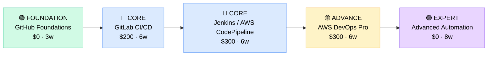

# How to Become a CI/CD Engineer

**`CP37`** · **DevOps / Platform** · _Time to hire: 12–18 months_ · _Entry cost: $600–$1,200 USD_

> **Path summary:** This path takes you from a developer or QA background to a hired CI/CD Engineer role using continuous integration and continuous deployment tools (GitHub Actions, GitLab CI, Jenkins), in 12–18 months. You'll automate the software delivery pipeline.

---

## Role Overview

### What does a CI/CD Engineer actually do?

A CI/CD Engineer designs and maintains automated software delivery pipelines. You spend your days: setting up CI/CD tools (Jenkins, GitHub Actions, GitLab CI), writing pipeline definitions (YAML), integrating automated testing, managing artifact repositories, and troubleshooting failed deployments. You might spend 3 hours designing a multi-stage pipeline (build → unit tests → integration tests → staging → production), 2 hours integrating a new tool into the pipeline, and 1 hour debugging why a deployment failed. Tools you use daily: Git (GitHub, GitLab), Jenkins or GitHub Actions, Docker, artifact repositories (Artifactory, Nexus), and infrastructure-as-code tools like Terraform.

CI/CD teams sit in tech companies, fintechs, and enterprises modernising development practices. Typical teams are 2–6 people serving 20–200+ developers. You collaborate closely with developers (your primary users), DevOps engineers (who manage infrastructure), and QA teams (who define test requirements). CI/CD work is less on-call heavy than full DevOps, but broken pipelines block engineers—you're responsive. Most roles are remote-friendly; pipeline work scales well. The work is intellectually rewarding—you're removing bottlenecks and accelerating delivery.

### Demand in 2026

- **Global job postings:** 4,100+ active CI/CD engineer roles on LinkedIn as of May 2026. [(source)](https://www.linkedin.com/jobs/search/?keywords=ci+cd+engineer)
- **Growth rate:** 15% YoY / Every company moving to cloud/Agile needs CI/CD. [(source)](https://www.linkedin.com/jobs/)
- **South Africa:** Growing demand at tech companies, fintechs, and enterprises modernising development. GitHub Actions and GitLab adoption is accelerating.
- **Remote availability:** Very high (80%+). Pipeline work is location-agnostic.

---

## Who Is This Path For?

### Ideal starting backgrounds

| Background | Readiness | What you already have |
|---|---|---|
| Software Developer | ✅ Excellent start | Git knowledge, testing concepts, deployment experience |
| QA Automation Engineer | ✅ Excellent start | Testing expertise, scripting skills, quality thinking |
| Build Engineer / Release Manager | ✅ Excellent start | Pipeline understanding, deployment processes |
| Junior DevOps Engineer | 🟡 Good with gaps | Infrastructure knowledge; needs CI/CD tool depth |
| Systems Administrator | 🟡 Good with gaps | Infrastructure basics; needs coding and Git |
| Complete career changer | 🔴 Needs foundation | Start with Git and a scripting language (Python, Bash) first |

### You're ready to start this path if you can:
- Use Git: clone, commit, push, pull request, merge
- Understand basic testing: unit tests, integration tests
- Write a Bash or Python script to automate a task
- Explain what a Docker image is and why it matters
- Understand YAML syntax (pipelines are written in YAML)

> **Not ready yet?** Start with Git fundamentals and a programming language first.

---

## Certification Sequence

### Visual path

---

### Stage 1 — Foundation (Months 0–3)

**Goal:** Master Git and GitHub fundamentals before specialising in CI/CD tools.

| Cert | Code | Cost (USD) | Study Time | Why it matters |
|---|---|---:|---:|---|
| GitHub Foundations (free from GitHub) | (free) | $0 | 3–4 weeks | Git basics, GitHub platform. Essential foundation for any CI/CD work. |

**Stage 1 total:** $0 USD · R0 ZAR · 3 months

**Study approach:** Use GitHub's own training (free) and Git documentation. Labs: clone a repo, make branches, commit, push, create PRs, merge. Spend 25 hours hands-on. Then move to GitHub Actions basics (free labs on GitHub Learning Lab).

---

### Stage 2 — Core Specialisation (Months 3–12)

**Goal:** Get hands-on with the most popular CI/CD platforms: GitHub Actions (modern, free) and AWS CodePipeline or Jenkins.

| Cert | Code | Cost (USD) | Study Time | Why it matters |
|---|---|---:|---:|---|
| GitHub Actions (GitHub Foundations includes basics; advanced through labs) | (free) | $0 | 4–6 weeks | Modern, cloud-native CI/CD. Used by 60%+ of companies moving to GitHub. |
| GitLab Certified CI/CD Associate | `CCA` | $200 | 6–8 weeks | Alternative to GitHub Actions. Strong in enterprises using GitLab. |
| AWS Certified DevOps Engineer – Professional (DOP-C02) | `DOP-C02` | $300 | 6–8 weeks | Cloud platform CI/CD mastery. If targeting AWS companies. |

**Stage 2 total:** $300–$500 USD · R5,400–R9,000 ZAR · 4–6 months

**Study approach:** 
- **GitHub Actions:** Use GitHub's labs (free). Build workflows: test on commit, build on push, deploy on tag. Hands-on: 30+ hours.
- **GitLab CI/CD Associate:** Use GitLab training. Focus on .gitlab-ci.yml syntax, stages, jobs, artifacts, and deployments.
- **AWS DOP-C02:** Use AWS training. Focus on CodePipeline, CodeBuild, CodeDeploy, and integration with other services.

**Project milestone:** 
Build a **multi-stage CI/CD pipeline** for a real application: code commit → unit tests → build artifact (Docker image) → deploy to staging → smoke tests → deploy to production. Use GitHub Actions or GitLab CI. Document the pipeline, including failure handling and rollback procedures.

---

### Stage 3 — Advanced Specialisation (Months 12–18)

**Goal:** Deepen in specific platform or add breadth with multiple tools.

| Cert | Code | Cost (USD) | Study Time | Why it matters |
|---|---|---:|---:|---|
| Jenkins Community Certification (open badge, not formal cert) | (community) | $0 | 4–6 weeks | Jenkins is still widely used. Certification less formal but valuable hands-on knowledge. |
| GitOps (ArgoCD / Flux) fundamentals (community resources) | (community) | $0 | 4–6 weeks | Emerging practice: use Git as source of truth for deployments. High-demand skill. |

**Stage 3 total:** $0 USD · R0 ZAR · 2–3 months

> **Optional at hire time:** Many CI/CD engineers get hired after Stage 2 (GitHub Actions + AWS DOP or GitLab) and learn advanced tools on the job.

---

### Stage 4 — Expert / Leadership (18–36 months+)

**Goal:** Advanced automation architecture or specialisation. Tackle after 2–3 years in CI/CD roles.

| Cert | Code | Cost (USD) | Study Time | Why it matters |
|---|---|---:|---:|---|
| AWS Solutions Architect – Professional or Kubernetes + GitOps expertise | $300 / (community) | $300 | 12–14 weeks | Architecture-level expertise. Positions you for senior or architect roles. |

> Pursue after 2–3 years of hands-on CI/CD experience.

---

## Timeline & Cost Summary

| Stage | Certs | Duration | Cost (USD) | Cost (ZAR) |
|---|---|---|---:|---:|
| Stage 1 — Foundation | GitHub Foundations | Months 0–3 | $0 | R0 |
| Stage 2 — Core | GitHub Actions + GitLab CI or AWS DOP | Months 3–12 | $200–$300 | R3,600–R5,400 |
| Stage 3 — Advanced | Jenkins + GitOps | Months 12–18 | $0 | R0 |
| **Total to hireable (Stage 1–2)** | **GitHub + GitLab/AWS** | **12–15 months** | **$200–$300** | **R3,600–R5,400** |

**Study hours required:** ~300–400 hours total (Stage 1–3). Assumes 20–25 hours/week = 12–20 weeks.

---

## Salary Progression

> All figures: median base salary, not including bonuses/equity. ZAR = USD × 18 baseline (verified May 2026). Sources: Robert Half 2026, Glassdoor, LinkedIn Salary.

| Experience Level | USD/year | ZAR/year | GBP/year | EUR/year | AUD/year |
|---|---:|---:|---:|---:|---:|
| Entry / Junior (0–2 yrs) | $75,000 | R1,350,000 | £59,000 | €67,000 | A$112,500 |
| Mid-level (2–5 yrs) | $105,000 | R1,890,000 | £82,000 | €93,000 | A$157,500 |
| Senior (5–8 yrs) | $135,000 | R2,430,000 | £106,000 | €119,000 | A$202,500 |
| Lead (8+ yrs) | $160,000–$190,000 | R2,880,000–R3,420,000 | £126,000–£149,000 | €141,000–€169,000 | A$240,000–A$285,000 |

**South Africa note:** Entry-level CI/CD engineers earn R48,000–R70,000/month. Mid-level command R75,000–R120,000/month. Remote work for international tech (GitHub, GitLab, AWS) yields R100,000–R180,000/month. Startups pay lower (R45k–R65k) but offer growth.

**Salary accelerators:** AWS DOP certification + GitHub/GitLab expertise commands 15–20% premium. GitOps specialisation (ArgoCD, Flux) adds 10–15% as it's emerging and in-demand. Published pipeline automation frameworks boost credibility.

---

## First Job Strategy

### Month 0–3: Build the Foundation

1. **Set up your lab** — GitHub account (free). Create a sample project. Learn Git workflows. Cost: $0.
2. **Master GitHub** — Use GitHub's own training labs (free). Spend 20 hours on Git fundamentals.
3. **Explore GitHub Actions** — Build simple workflows: run tests on commit, build on push. 15 hours hands-on.
4. **Join CI/CD community** — Reddit: r/devops, r/github. Discord: DevOps communities. GitHub Discussions.

### Month 3–9: Build Your Portfolio

1. **Project 1: Multi-Stage Pipeline (10–12 hours)** — Build a realistic pipeline: code → unit tests → build Docker image → deploy to staging → run smoke tests → deploy to production. Use GitHub Actions. Include rollback and failure handling. Document on GitHub.

2. **Project 2: Jenkins or GitLab Pipeline (8–10 hours)** — Repeat project 1 using Jenkins or GitLab CI instead of GitHub Actions. Document similarities and differences.

3. **Project 3: Artifact Management (6–8 hours)** — Set up an artifact repository (Docker Hub, Artifactory free tier). Integrate with your pipeline. Push built artifacts. Document versioning strategy.

4. **Project 4: Deployment Strategy (8–10 hours)** — Design and document a deployment strategy: blue-green, canary, or rolling. Implement in your pipeline. This shows advanced thinking.

### Month 9–15: Apply and Iterate

- **CV positioning:** List yourself as "CI/CD Engineer" or "Build & Release Engineer" once you have portfolio projects. Before then, list as "DevOps Engineer (CI/CD Focus)" or "Build Automation Engineer".
- **Target companies:** Start with startups and tech companies (they move fast, need CI/CD). Then enterprises modernising (banks, government). MSPs are good entry point. Avoid companies with legacy waterfall—they don't value CI/CD.
- **Interview prep:** Be ready to discuss: 1) Your multi-stage pipeline and design decisions; 2) Failure handling and rollback strategies; 3) Tool comparison (GitHub Actions vs. GitLab CI vs. Jenkins); 4) Artifact management; 5) Deployment strategies; 6) A failed deployment and how you'd prevent it; 7) Your favourite CI/CD tool and why.
- **Salary negotiation:** CI/CD roles in SA advertise at R48k–R65k/month entry-level. With certifications + portfolio, negotiate for R70k–R95k/month. International remote roles are R100k–R160k/month—actively target those.

---

## A Day in the Life

### CI/CD Engineer at a Fintech (Johannesburg) — Junior Level

**09:00** — Standup with engineering and DevOps teams. A feature is ready to deploy. You'll shepherd it through the CI/CD pipeline.

**09:30** — Developer pushes code to GitHub. Pipeline triggers automatically: runs unit tests (3 minutes), builds Docker image (5 minutes), pushes to registry (2 minutes). All green. Great start.

**10:00** — Deploy to staging environment. Pipeline runs integration tests (10 minutes). All pass. Feature is ready for manual testing by QA.

**11:00** — QA team tests the feature in staging. They sign off. Time to deploy to production.

**12:00** — Lunch.

**13:00** — Prepare production deployment. Review the pipeline, check health checks, prepare rollback plan (just in case). Coordinate with the on-call engineer.

**13:30** — Execute production deployment. Pipeline deploys gradually: 10% of traffic → monitor for errors → 50% → monitor → 100%. Monitoring shows no issues. Deployment complete in 30 minutes.

**14:00** — Post-deployment validation. Run smoke tests manually. Check logs for errors. Confirm with product: feature is live and working.

**14:30** — Work on your ongoing project: improve the pipeline. Currently, deployments are manual approval. You're automating it: if tests pass in staging AND no errors for 1 hour AND team signs off in Slack, auto-deploy to production.

**16:00** — Document your automation. Create a runbook for the team on the new workflow.

**17:00** — Wrap up. Check pipeline status (all green). Close out Jira tickets.

### CI/CD Engineer at a Tech Company (Remote, EMEA) — Mid-Level

**09:00** — Async standup. Overnight, a developer had a failed deployment due to a missing environment variable in the pipeline. You've already fixed it and pushed a safeguard: validate all required variables at pipeline start.

**10:00** — Lead a design review: a team wants to integrate a new testing framework into the pipeline. You review: will it integrate with GitHub Actions? How long will it add to pipeline time? What's the false positive rate? Request changes.

**12:00** — Lunch + quick consultation. A team is deploying multiple times per day but worried about stability. You review their deployment strategy (currently blue-green). Recommend canary deployments instead: lower risk, faster feedback. Offer to help implement.

**13:00** — Implement canary deployment framework. Write a Kubernetes deployment that gradually shifts traffic from old to new version. Integrate with the pipeline. Test it.

**14:30** — Work on artifact management. Company is growing fast; Docker registry is filling up. Design a cleanup policy: keep last 10 images, delete old ones. Automate with Python script in the pipeline.

**16:00** — Mentor a junior CI/CD engineer. Walk through a pipeline failure from yesterday. Teach: how to read logs, where to find errors, how to test locally before pushing. Good learning opportunity.

**17:00** — Wrap up. Check pipeline status. No failures. Plan for next week.

---

## Related Paths & Progressions

| From here you can move to… | Why |
|---|---|
| [DevOps Engineer (CP35_DevOps_DevOps_Engineer.md)](CP35_DevOps_DevOps_Engineer.md) | CI/CD work + infrastructure knowledge = full DevOps. Natural progression. |
| [SRE / Platform Engineer (CP36_DevOps_SRE_Platform_Engineer.md)](CP36_DevOps_SRE_Platform_Engineer.md) | CI/CD + reliability thinking = SRE. Many CI/CD engineers become SREs. |
| [Release Manager / Engineering Manager (upcoming path)](../Roadmaps/) | Lead CI/CD teams after 3–5 years. Many move to management. |
| [Infrastructure as Code Engineer (CP39_DevOps_IaC_Engineer.md)](CP39_DevOps_IaC_Engineer.md) | CI/CD + infrastructure automation = IaC specialist. Complementary skill. |

---

## South Africa Context

### Market specifics

CI/CD demand in SA is growing. Tech companies (Takealot) and fintechs are implementing CI/CD aggressively. Banks are modernising and adopting Agile, which requires CI/CD. GitHub and GitLab adoption is accelerating.

The CI/CD market in SA is less saturated than DevOps, offering opportunity for specialists. Most roles are available at companies building modern platforms (startups, fintechs, tech companies). Legacy enterprises lag in CI/CD adoption.

Remote work is excellent for CI/CD. Many SA engineers work fully remote for international tech companies using GitHub Actions or GitLab CI.

### SA-specific resources

| Resource | URL | Note |
|---|---|---|
| Takealot Careers | [careers.takealot.com](https://careers.takealot.com) | Leading SA tech company. Heavy CI/CD adoption. |
| GitHub Docs & Training | [github.com/skills](https://github.com/skills) | Free GitHub-hosted training. Excellent resource. |
| GitLab Training | [training.gitlab.com](https://training.gitlab.com/) | Free and paid GitLab CI/CD training. |
| AWS Training | [aws.amazon.com/training/](https://aws.amazon.com/training/) | CodePipeline and DevOps training. |
| Jenkins Community | [jenkins.io](https://www.jenkins.io/) | Open-source. Community-driven. Strong ecosystem. |

---

## Frequently Asked Questions

**Q: Do I need to learn Jenkins if GitHub Actions exists?**

Not required, but valuable. GitHub Actions is modern and cloud-native; Jenkins is legacy but still widely used (50%+ of enterprises). Learning both shows flexibility. If starting fresh, prioritise GitHub Actions (more jobs, simpler) → Jenkins later if needed.

**Q: What's the easiest CI/CD tool to learn first?**

**GitHub Actions** if you're using GitHub. **GitLab CI** if using GitLab. Both are YAML-based, easier than Jenkins. Learn the basics of one, then others transfer quickly.

**Q: Can I become a CI/CD engineer without extensive DevOps knowledge?**

Yes. CI/CD is specialised and distinct from full DevOps. You can learn CI/CD pipelines, tool integration, and testing automation without deep infrastructure knowledge. However, knowing Docker and basic cloud concepts helps.

**Q: What's the difference between CI/CD engineer and DevOps engineer?**

CI/CD focuses on the software delivery pipeline: code commit → test → build → deploy. DevOps includes CI/CD plus infrastructure, monitoring, and reliability. CI/CD is narrower and more specialised. Both are valuable; CI/CD roles are often easier to enter.

**Q: Is CI/CD work different from DevOps on-call?**

Yes, CI/CD is less on-call heavy. If a pipeline fails, engineers can't deploy—high urgency but not a production outage. DevOps on-call includes production incidents (downtime, performance, security). CI/CD is lower stress.

---

## Sources & Further Reading

| # | Source | URL | Used for |
|---|---|---|---|
| 1 | LinkedIn Jobs | [linkedin.com/jobs/search/?keywords=ci+cd+engineer](https://www.linkedin.com/jobs/search/?keywords=ci+cd+engineer) | Job postings, May 2026 |
| 2 | GitHub Skills | [github.com/skills/](https://github.com/skills/) | Free GitHub training and labs |
| 3 | GitHub Actions Docs | [docs.github.com/en/actions](https://docs.github.com/en/actions) | Official GitHub Actions reference |
| 4 | GitLab CI/CD | [docs.gitlab.com/ee/ci/](https://docs.gitlab.com/ee/ci/) | Official GitLab CI documentation |
| 5 | Jenkins Documentation | [jenkins.io/doc/](https://www.jenkins.io/doc/) | Jenkins reference and tutorials |
| 6 | AWS CodePipeline | [aws.amazon.com/codepipeline/](https://aws.amazon.com/codepipeline/) | AWS CI/CD service |
| 7 | AWS Certified DevOps | [aws.amazon.com/certification/certified-devops-engineer-professional/](https://aws.amazon.com/certification/certified-devops-engineer-professional/) | Cloud certification |
| 8 | Robert Half 2026 Salary Guide | [roberthalf.com/salary-guide](https://www.roberthalf.com/salary-guide) | Market salaries for DevOps roles |

---

*Career path guide for CI/CD engineers | Last updated 2026-05-02 | ZAR baseline: R18/$1 USD*
*For updates and job leads, see [IT Career Roadmap](https://itcareerroadmap.com)*
