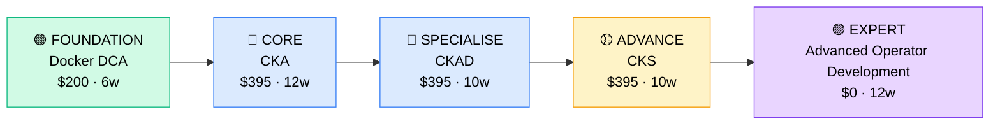

# How to Become a Kubernetes / Container Engineer

**`CP38`** · **DevOps / Platform** · _Time to hire: 12–18 months_ · _Entry cost: $1,200–$1,900 USD_

> **Path summary:** This path takes you from a DevOps or cloud administrator background to a hired Kubernetes / Container Engineer role using container technologies (Docker) and Kubernetes orchestration, in 12–18 months. You'll master modern containerised infrastructure.

---

## Role Overview

### What does a Kubernetes / Container Engineer actually do?

A Kubernetes Engineer designs, deploys, and maintains containerised applications at scale using Kubernetes. You spend your days: designing Kubernetes clusters and networking architectures, writing YAML manifests and Helm charts, managing container images (Docker), implementing storage and persistent volumes, setting up RBAC (role-based access control), monitoring cluster health, and troubleshooting failing workloads. You might spend 3 hours designing a multi-zone Kubernetes cluster with auto-scaling, 2 hours debugging a pod that won't start (image pull errors, resource limits), and 1 hour mentoring developers on Kubernetes best practices. Tools you use daily: Kubernetes, Docker, Helm, kubectl, container registries (Docker Hub, ECR), and monitoring tools (Prometheus, Datadog).

Kubernetes teams sit in tech companies, cloud-native startups, fintechs, and enterprises modernising infrastructure. Typical teams are 2–10 people managing 10–1000+ containerised applications. You collaborate closely with developers (who deploy apps), DevOps engineers (who manage clusters), and security teams (who enforce policies). Kubernetes work is on-call—you're responsible for cluster reliability. However, well-designed clusters have fewer issues. Most roles are remote-friendly; Kubernetes administration scales to distributed teams. The work is technically challenging and rewarding—you're running the modern infrastructure backbone.

### Demand in 2026

- **Global job postings:** 5,800+ active Kubernetes engineer roles on LinkedIn as of May 2026. [(source)](https://www.linkedin.com/jobs/search/?keywords=kubernetes+engineer)
- **Growth rate:** 16% YoY / Container and Kubernetes adoption is accelerating across all industries. [(source)](https://www.linkedin.com/jobs/)
- **South Africa:** Growing demand at tech companies (Takealot, Allocloud), fintechs (PayFast), cloud-native startups, and enterprises modernising. Government agencies and banks are adopting Kubernetes.
- **Remote availability:** Very high (75%+). Cluster administration is location-agnostic.

---

## Who Is This Path For?

### Ideal starting backgrounds

| Background | Readiness | What you already have |
|---|---|---|
| DevOps Engineer | ✅ Excellent start | Infrastructure knowledge, automation skills, cloud familiarity |
| Cloud Administrator (AWS/Azure) | ✅ Excellent start | Cloud platform knowledge; needs Kubernetes and containers |
| Systems Administrator (5+ years) | 🟡 Good with gaps | Infrastructure expertise; needs containers and Kubernetes learning |
| Backend Developer (Java, Python, Go) | 🟡 Good with gaps | Application knowledge; needs infrastructure and Kubernetes depth |
| Docker specialist | 🟡 Good with gaps | Container fundamentals; needs Kubernetes orchestration |
| Complete career changer | 🔴 Needs foundation | Start with Docker and basic cloud concepts first (3–4 months) |

### You're ready to start this path if you can:
- Explain what Docker is and why containers are useful
- Run a Docker container locally and access it
- Understand Kubernetes core concepts: pods, services, deployments
- Navigate kubectl command line and read YAML manifests
- Explain how Kubernetes schedules and runs containers

> **Not ready yet?** Start with Docker fundamentals and Kubernetes basics first.

---

## Certification Sequence

### Visual path

---

### Stage 1 — Foundation (Months 0–4)

**Goal:** Master Docker containerisation before specialising in Kubernetes orchestration.

| Cert | Code | Cost (USD) | Study Time | Why it matters |
|---|---|---:|---:|---|
| Docker Certified Associate (DCA) | `DCA` | $200 | 6–8 weeks | Container fundamentals. Every Kubernetes engineer must understand Docker deeply. |

**Stage 1 total:** $200 USD · R3,600 ZAR · 4 months

**Study approach:** Use Docker's official documentation and hands-on labs. Focus on: Docker images (building, optimising), containers (running, networking), registries (pushing/pulling), and container networking. Build 10+ Docker images. Optimize for size and security. Expect 50+ hours hands-on.

---

### Stage 2 — Core Specialisation (Months 4–14)

**Goal:** Get industry-standard Kubernetes certifications: CKA (cluster admin) and CKAD (application developer).

| Cert | Code | Cost (USD) | Study Time | Why it matters |
|---|---|---:|---:|---|
| CNCF Certified Kubernetes Administrator (CKA) | `CKA` | $395 | 12–14 weeks | Kubernetes administration. The anchor credential for Kubernetes engineers. Required by most employers. |
| CNCF Certified Kubernetes Application Developer (CKAD) | `CKAD` | $395 | 10–12 weeks | Kubernetes from a developer's perspective. Builds empathy for how developers use Kubernetes. |

**Stage 2 total:** $790 USD · R14,220 ZAR · 5–6 months

**Study approach:** 
- **CKA:** Use Linux Foundation LFD259 course or third-party CKA prep. Hands-on labs: deploy clusters, manage etcd, configure networking, troubleshoot failures. Expect 80+ hours.
- **CKAD:** Focus on: pod design, configuration, deployments, services, and application troubleshooting. Practical exam; prepare by writing YAML manifests manually. Expect 70+ hours.

**Project milestone:** 
Build a **production-like Kubernetes environment**: Deploy a multi-tier application (frontend, backend, database) in Kubernetes. Use Helm charts for templating, implement storage (persistent volumes), set up monitoring (Prometheus), configure RBAC and network policies, and implement auto-scaling. Document architecture and deployment procedures.

---

### Stage 3 — Advanced Specialisation (Months 14–18)

**Goal:** Add security depth (CKS) and advanced Kubernetes patterns.

| Cert | Code | Cost (USD) | Study Time | Why it matters |
|---|---|---:|---:|---|
| CNCF Certified Kubernetes Security Specialist (CKS) | `CKS` | $395 | 10–12 weeks | Kubernetes security hardening. Critical for production deployments. Differentiates you from junior Kubernetes engineers. |

**Stage 3 total:** $395 USD · R7,110 ZAR · 2–3 months

> **Optional at hire time:** Many Kubernetes engineers get hired after Stage 2 (DCA + CKA + CKAD) and pursue CKS while working. However, having all three Kubernetes certs is highly valued.

---

### Stage 4 — Expert / Leadership (18–36 months+)

**Goal:** Advanced operator development or Kubernetes architecture. Tackle after 2–3 years of hands-on Kubernetes work.

| Cert | Code | Cost (USD) | Study Time | Why it matters |
|---|---|---:|---:|---|
| Kubernetes Operator development (community, no formal cert) | (community) | $0 | 12–14 weeks | Automate complex applications in Kubernetes. High-value specialisation. |
| Cloud-Native Architecture (CNCF courses) | (community) | $0–$200 | 8–12 weeks | Design cloud-native systems. Positions you for architect roles. |

> These are advanced. Pursue after 2–3 years of hands-on Kubernetes experience.

---

## Timeline & Cost Summary

| Stage | Certs | Duration | Cost (USD) | Cost (ZAR) |
|---|---|---|---:|---:|
| Stage 1 — Foundation | Docker DCA | Months 0–4 | $200 | R3,600 |
| Stage 2 — Core | CKA + CKAD | Months 4–14 | $790 | R14,220 |
| Stage 3 — Advanced | CKS | Months 14–18 | $395 | R7,110 |
| **Total to hireable (Stage 1–2)** | **Docker + CKA + CKAD** | **12–16 months** | **$990** | **R17,820** |

**Study hours required:** ~600–800 hours total (Stage 1–3). Assumes 25–30 hours/week = 20–32 weeks.

---

## Salary Progression

> All figures: median base salary, not including bonuses/equity. ZAR = USD × 18 baseline (verified May 2026). Sources: Robert Half 2026, Glassdoor, LinkedIn Salary.

| Experience Level | USD/year | ZAR/year | GBP/year | EUR/year | AUD/year |
|---|---:|---:|---:|---:|---:|
| Entry / Junior (0–2 yrs) | $90,000 | R1,620,000 | £71,000 | €80,000 | A$135,000 |
| Mid-level (2–5 yrs) | $125,000 | R2,250,000 | £98,000 | €110,000 | A$187,500 |
| Senior (5–8 yrs) | $160,000 | R2,880,000 | £126,000 | €141,000 | A$240,000 |
| Lead / Architect (8+ yrs) | $190,000–$230,000 | R3,420,000–R4,140,000 | £149,000–£181,000 | €168,000–€204,000 | A$285,000–A$345,000 |

**South Africa note:** Entry-level Kubernetes engineers at Johannesburg-based companies earn R58,000–R85,000/month. Mid-level (3–5 years) command R90,000–R140,000/month. Remote work for international tech yields R130,000–R200,000/month. Startups pay lower (R50k–R75k) but offer growth.

**Salary accelerators:** All three Kubernetes certs (CKA + CKAD + CKS) command 15–25% premium. Kubernetes operator development expertise adds 10–15%. Published Kubernetes best practices and open-source contributions boost credibility significantly.

---

## First Job Strategy

### Month 0–4: Build the Foundation

1. **Set up your container lab** — Docker Desktop (free). Build 20+ Docker images. Optimise for size and security. Cost: $0.
2. **Master Docker** — Use Docker documentation and hands-on labs. Spend 50+ hours building containers.
3. **Start Kubernetes basics** — Use minikube or Kind to run a local Kubernetes cluster. Deploy simple applications.
4. **Join container/Kubernetes community** — Reddit: r/kubernetes, r/devops. Discord: Kubernetes, CNCF communities.

### Month 4–12: Build Your Portfolio

1. **Project 1: Multi-Tier Application in Kubernetes (12–14 hours)** — Deploy a realistic multi-tier app (frontend, API, database) in Kubernetes. Use manifests and Helm charts. Include storage, ConfigMaps, and secrets. Document on GitHub.

2. **Project 2: Kubernetes Security Implementation (10–12 hours)** — Implement: RBAC (role-based access control), network policies, pod security policies, image scanning. Document security architecture. This demonstrates security awareness.

3. **Project 3: Monitoring & Observability (10–12 hours)** — Deploy Prometheus and Grafana in your Kubernetes cluster. Instrument applications. Create dashboards for performance metrics. Set up alerts.

4. **Project 4: Kubernetes Operator (8–10 hours)** — Build a simple Kubernetes operator (using Kopf, a Python framework) to automate a common task (e.g., database backup). This shows advanced Kubernetes knowledge.

### Month 12–18: Apply and Iterate

- **CV positioning:** List yourself as "Kubernetes Engineer" or "Container Engineer" once you have CKA + CKAD. Before that, list as "DevOps Engineer (Kubernetes Focus)" or "Cloud Engineer".
- **Target companies:** Start with tech companies and cloud-native startups (they use Kubernetes heavily). Then enterprises modernising infrastructure. Avoid companies not using containers—they won't value Kubernetes expertise.
- **Interview prep:** Be ready to discuss: 1) Your multi-tier Kubernetes application and architecture; 2) Kubernetes networking and service discovery; 3) Storage (persistent volumes, StatefulSets); 4) RBAC and security; 5) Troubleshooting (pod won't start, service not accessible); 6) Monitoring and observability; 7) Your Kubernetes operator project; 8) Scaling strategies (HPA, VPA).
- **Salary negotiation:** Kubernetes roles in SA advertise at R58k–R75k/month entry-level. With DCA + CKA + CKAD, negotiate for R85k–R120k/month. International remote roles are R130k–R190k/month—actively target those.

---

## A Day in the Life

### Kubernetes Engineer at a Fintech (Johannesburg) — Junior Level

**08:00** — Arrive. Check cluster health. One node is not ready (disk pressure). Investigate: /var filesystem is 95% full. Check what's consuming space: old container logs. Clean them up. Node recovers.

**09:00** — Standup with engineering and platform teams. A team wants to deploy a new service. You'll help them create Kubernetes manifests and deploy to staging.

**10:00** — Review their application and requirements. Create a Kubernetes deployment manifest with: proper resource requests/limits, health checks (liveness/readiness probes), and environment variables. They review and adjust. Looks good.

**11:00** — Deploy to staging Kubernetes cluster. Pipeline runs: build Docker image → push to registry → deploy to staging. Monitor rollout: all pods running, health checks passing.

**12:00** — Lunch.

**13:00** — Work on your assigned task: implement network policies for a microservices application. Create policies to restrict traffic between pods (only necessary services can communicate). Test by blocking unallowed connections.

**14:30** — A developer asks: "Why is my pod not starting?" Investigate using kubectl logs and describe pod. Find the issue: image pull failure (typo in image name in the manifest). Fix and redeploy.

**15:30** — Work on cluster maintenance. Update Kubernetes to a new minor version. Planning: cordon nodes one by one, drain workloads, upgrade kubelet, drain again, uncordon. Execute carefully.

**17:00** — Wrap up. Check cluster status (all healthy). Close out tasks.

### Kubernetes Engineer at a Tech Company (Remote, EMEA) — Mid-Level

**09:00** — Async standup. Overnight, the platform team rolled out a new CNI (Container Network Interface) plugin to 20% of the cluster. You've been monitoring: network latency +1% (expected during transition), packet loss 0% (good). Continue rollout to 50%.

**10:00** — 1:1 with your manager. You're proposing a Kubernetes operator to automate database backups. She approves—this will reduce manual work significantly.

**10:30** — Start building the database backup operator. Use Kopf (Python framework for operators). Define: trigger on a CRD (Custom Resource Definition) for backup requests, run backup job, store status in Kubernetes.

**12:00** — Lunch + consultation. A team is facing high CPU usage in their stateful application. Review their deployment: they're not using StatefulSets properly (pod identity not stable, causing reconnections). Recommend redesign. Offer to help.

**13:00** — Implement the redesign. Convert to StatefulSets with a headless service. This gives each pod a stable identity and DNS name. Test with load.

**14:30** — Continue operator development. Test backup functionality. Ensure status is properly stored in Kubernetes (not lost on pod restart).

**15:30** — Mentor a junior Kubernetes engineer. Review their network policy implementation. Check: is traffic properly restricted? Are they allowing necessary communication? Request improvements.

**16:30** — Wrap up. Operator is almost done. Push to GitHub for code review. Check cluster status (all healthy). Plan next week.

---

## Related Paths & Progressions

| From here you can move to… | Why |
|---|---|
| [SRE / Platform Engineer (CP36_DevOps_SRE_Platform_Engineer.md)](CP36_DevOps_SRE_Platform_Engineer.md) | Kubernetes expertise + reliability thinking = SRE. Natural progression. |
| [DevOps Engineer (CP35_DevOps_DevOps_Engineer.md)](CP35_DevOps_DevOps_Engineer.md) | Broaden from Kubernetes specialist to full DevOps. Wider skill set. |
| [Cloud Architect (upcoming path)](../Roadmaps/) | Kubernetes expertise informs cloud architecture. Many K8s specialists become architects. |
| [Security Architect (upcoming path)](../Roadmaps/) | Kubernetes + security = security architect. Growing specialisation. |

---

## South Africa Context

### Market specifics

Kubernetes demand in SA is growing rapidly. Tech companies (Takealot, Allocloud), fintechs (PayFast), and cloud-native startups are adopting Kubernetes. Banks and government agencies are beginning Kubernetes adoption as they modernise infrastructure.

The Kubernetes specialist market in SA is less saturated than general DevOps, offering advantage for specialists. Companies that hire Kubernetes engineers pay premiums for deep expertise.

Remote work is excellent for Kubernetes. Infrastructure administration is location-agnostic. Many SA Kubernetes engineers work fully remote for international tech companies earning 2–3x local enterprise salary.

### SA-specific resources

| Resource | URL | Note |
|---|---|---|
| Takealot & Allocloud Careers | [careers.takealot.com](https://careers.takealot.com) / [allocloud.com/careers](https://allocloud.com/careers) | Leading SA tech companies using Kubernetes. Active hiring. |
| Linux Foundation Kubernetes | [linuxfoundation.org/training/kubernetes-training/](https://www.linuxfoundation.org/training/kubernetes-training/) | Official CKA/CKAD/CKS training. |
| CNCF Community | [cncf.io/community/](https://www.cncf.io/community/) | Cloud Native Computing Foundation community and events. |
| Kubernetes Documentation | [kubernetes.io/docs/](https://kubernetes.io/docs/) | Official Kubernetes reference—excellent for learning. |
| Docker Training | [docker.com/training/](https://www.docker.com/training/) | Official Docker certification and training. |

---

## Frequently Asked Questions

**Q: Should I do Docker DCA before Kubernetes certs?**

Yes, DCA first. Docker is the foundation. You can't properly manage containers in Kubernetes without understanding Docker deeply. DCA also teaches image building, optimization, and security—all critical for Kubernetes.

**Q: Do I need all three Kubernetes certs (CKA, CKAD, CKS)?**

Ideally yes. CKA is mandatory (cluster administration). CKAD and CKS are valuable. Many Kubernetes engineers get hired with CKA + CKAD, then pursue CKS while working (employer often sponsors). If budget is tight: CKA (cluster admin) → CKAD (app dev) → CKS (security).

**Q: Can I become a Kubernetes engineer without DevOps experience?**

Harder but possible. If you're from cloud administration or software engineering, you can learn Kubernetes directly. However, DevOps experience (infrastructure, CI/CD, automation) provides valuable context. Either way, hands-on practice is essential.

**Q: What's the difference between a Kubernetes engineer and a DevOps engineer?**

DevOps: broader (CI/CD, infrastructure, monitoring). Kubernetes engineer: specialised in Kubernetes and containers. DevOps often manages infrastructure that runs Kubernetes. Many companies treat them as complementary roles. A DevOps engineer should know Kubernetes; a Kubernetes specialist may not know CI/CD deeply.

**Q: Is Kubernetes work on-call heavy?**

Yes, typically. Kubernetes cluster reliability is critical. Most on-call rotations are 1 week per month. Well-designed clusters with good monitoring have fewer pages. Startups and immature clusters are noisier (more pages). Ask during interviews: "What's your on-call load?"

---

## Sources & Further Reading

| # | Source | URL | Used for |
|---|---|---|---|
| 1 | LinkedIn Jobs | [linkedin.com/jobs/search/?keywords=kubernetes+engineer](https://www.linkedin.com/jobs/search/?keywords=kubernetes+engineer) | Job postings, May 2026 |
| 2 | Docker Certification | [docker.com/certification/](https://www.docker.com/certification/) | Docker DCA certification details |
| 3 | CNCF CKA | [cncf.io/certification/cka/](https://www.cncf.io/certification/cka/) | Kubernetes Administrator certification |
| 4 | CNCF CKAD | [cncf.io/certification/ckad/](https://www.cncf.io/certification/ckad/) | Kubernetes Application Developer cert |
| 5 | CNCF CKS | [cncf.io/certification/cks/](https://www.cncf.io/certification/cks/) | Kubernetes Security Specialist cert |
| 6 | Kubernetes Documentation | [kubernetes.io/docs/](https://kubernetes.io/docs/) | Official Kubernetes reference—excellent resource |
| 7 | Docker Documentation | [docs.docker.com/](https://docs.docker.com/) | Official Docker reference |
| 8 | Robert Half 2026 Salary Guide | [roberthalf.com/salary-guide](https://www.roberthalf.com/salary-guide) | Market salaries for DevOps/Kubernetes roles |

---

*Career path guide for Kubernetes / Container engineers | Last updated 2026-05-02 | ZAR baseline: R18/$1 USD*
*For updates and job leads, see [IT Career Roadmap](https://itcareerroadmap.com)*
