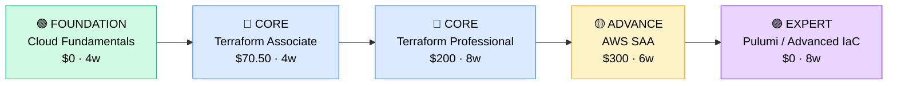

# How to Become an Infrastructure as Code Engineer

**`CP39`** · **DevOps / Platform** · _Time to hire: 12–18 months_ · _Entry cost: $700–$1,400 USD_

> **Path summary:** This path takes you from a systems administrator or DevOps background to a hired Infrastructure as Code Engineer role using Terraform, Pulumi, and cloud platforms, in 12–18 months. You'll codify your infrastructure.

---

## Role Overview

### What does an IaC Engineer actually do?

An IaC Engineer designs and maintains infrastructure as code—treating infrastructure like software. You spend your days: writing Terraform modules to provision cloud resources (networks, databases, servers), managing infrastructure state and versioning in Git, designing reusable infrastructure components, reviewing IaC code for consistency and security, and documenting infrastructure-as-documentation. You might spend 3 hours writing a Terraform module for a multi-tier application, 2 hours reviewing a colleague's infrastructure changes, and 1 hour optimising infrastructure costs. Tools you use daily: Terraform, version control (Git), cloud CLIs (aws, gcloud, az), and infrastructure testing tools (Terratest, Checkov).

IaC teams sit in tech companies, cloud providers, fintech, and enterprises modernising infrastructure. Typical teams are 2–6 people managing infrastructure provisioning for 50–500+ developers. You collaborate with DevOps engineers (who run the infrastructure), developers (who consume it), and architects (who design it). IaC work is not on-call heavy; failed infrastructure changes affect future deployments more than live systems. Most roles are remote-friendly; infrastructure code is location-agnostic. The work is intellectually rewarding—you're building the foundation for reliable, scalable infrastructure.

### Demand in 2026

- **Global job postings:** 3,400+ active IaC engineer roles on LinkedIn as of May 2026. [(source)](https://www.linkedin.com/jobs/search/?keywords=infrastructure+as+code+engineer)
- **Growth rate:** 14% YoY / Every cloud-native company uses IaC; it's becoming table stakes. [(source)](https://www.linkedin.com/jobs/)
- **South Africa:** Growing demand at tech companies, fintechs, and enterprises moving to cloud. Terraform adoption in SA is accelerating.
- **Remote availability:** Very high (85%+). Infrastructure code is purely remote-friendly.

---

## Who Is This Path For?

### Ideal starting backgrounds

| Background | Readiness | What you already have |
|---|---|---|
| DevOps Engineer | ✅ Excellent start | Infrastructure understanding, automation mindset, cloud knowledge |
| Systems Administrator | 🟡 Good with gaps | Infrastructure expertise; needs cloud platform and IaC tool knowledge |
| Cloud Administrator (AWS/Azure/GCP) | ✅ Excellent start | Cloud platform expertise; needs IaC tool learning |
| Software Engineer (systems focus) | 🟡 Good with gaps | Code/version control skills; needs infrastructure and cloud knowledge |
| Network Engineer | 🟡 Good with gaps | Networking fundamentals; needs cloud and IaC depth |
| Complete career changer | 🔴 Needs foundation | Start with cloud fundamentals and a scripting language first (4–6 months) |

### You're ready to start this path if you can:
- Explain what infrastructure-as-code is and why it matters
- Write a simple Python or Bash script to automate a task
- Navigate a cloud platform console (AWS, Azure, or GCP)
- Understand Git workflow: commit, push, pull request
- Explain the difference between mutable and immutable infrastructure

> **Not ready yet?** Start with cloud fundamentals and a scripting language first.

---

## Certification Sequence

### Visual path

---

### Stage 1 — Foundation (Months 0–3)

**Goal:** Understand cloud fundamentals and Terraform basics before specialising in IaC architecture.

| Cert | Code | Cost (USD) | Study Time | Why it matters |
|---|---|---:|---:|---|
| Cloud Fundamentals (self-paced, no formal cert) | (free) | $0 | 4–6 weeks | Cloud concepts: VPCs, subnets, security, cost. Terraform assumes cloud knowledge. |
| HashiCorp Terraform Associate (003) | `003` | $70.50 | 4–6 weeks | Entry-level Terraform certification. Covers state, modules, and core IaC concepts. |

**Stage 1 total:** $70.50 USD · R1,269 ZAR · 3 months

**Study approach:** Use Terraform's official documentation (excellent) and A Cloud Guru / freeCodeCamp YouTube courses. Labs: build 10+ Terraform modules of increasing complexity using AWS or Azure. Focus on: state management, modules, variables, and outputs. Minimum 40 hours hands-on.

---

### Stage 2 — Core Specialisation (Months 3–13)

**Goal:** Get professional-level Terraform skills and cloud architecture understanding.

| Cert | Code | Cost (USD) | Study Time | Why it matters |
|---|---|---:|---:|---|
| HashiCorp Terraform Professional (Advanced) | (advanced) | $200 | 8–10 weeks | Advanced Terraform: modules, testing (Terratest), remote state, backends, and best practices. |
| AWS Certified Solutions Architect – Associate (SAA) | `SAA-C03` | $300 | 6–8 weeks | Cloud architecture fundamentals. Complements Terraform with architecture thinking. Alternative: Azure AZ-104 or GCP Cloud Associate. |

**Stage 2 total:** $500 USD · R9,000 ZAR · 5–6 months

**Study approach:** 
- **Terraform Professional:** Use HashiCorp's Advanced course or third-party materials. Focus on: modules design, state management best practices, testing with Terratest, and CI/CD integration. Build production-quality modules.
- **AWS SAA:** Use A Cloud Guru, Linux Academy, or AWS training. Focus on: architecture patterns, high availability, security, and cost optimisation. These concepts inform infrastructure design.

**Project milestone:** 
Build a **reusable infrastructure module library**: Create 5–6 Terraform modules for common patterns (VPC with NAT, RDS database, load-balanced app, etc.). Each module should be: well-tested (Terratest), documented, and ready for reuse. Push to GitHub. This becomes your portfolio piece and is immediately valuable in jobs.

---

### Stage 3 — Advanced Specialisation (Months 13–18)

**Goal:** Add breadth with other IaC tools or deepen in specific cloud platform.

| Cert | Code | Cost (USD) | Study Time | Why it matters |
|---|---|---:|---:|---|
| Pulumi Certified Associate (or other IaC tools) | (emerging) | $0–$200 | 6–8 weeks | Modern IaC using programming languages (Python, Go, TypeScript). Growing alternative to Terraform. |
| CloudFormation (AWS) or ARM Templates (Azure) | (no formal cert) | $0 | 4–6 weeks | Cloud-native IaC tools. Useful if targeting specific cloud providers. |

**Stage 3 total:** $0–$200 USD · R0–R3,600 ZAR · 2–3 months

> **Optional at hire time:** Many IaC engineers get hired after Stage 2 (Terraform Associate + Professional + AWS SAA) and learn additional tools while working.

---

### Stage 4 — Expert / Leadership (18–36 months+)

**Goal:** Architecture-level expertise or specialisation in platform engineering. Tackle after 2–3 years of hands-on IaC work.

| Cert | Code | Cost (USD) | Study Time | Why it matters |
|---|---|---:|---:|---|
| AWS Solutions Architect – Professional (SAP) or cloud architect equivalent | `SAP` | $300 | 12–14 weeks | Expert-level cloud architecture. Positions you for architecture or principal engineer roles. |
| Platform Engineering (community courses) | (community) | $0 | 8–12 weeks | Design internal platforms using IaC. High-value specialisation. |

> Pursue after 2–3 years of hands-on IaC experience.

---

## Timeline & Cost Summary

| Stage | Certs | Duration | Cost (USD) | Cost (ZAR) |
|---|---|---|---:|---:|
| Stage 1 — Foundation | Terraform Associate | Months 0–3 | $70.50 | R1,269 |
| Stage 2 — Core | Terraform Pro + AWS SAA | Months 3–13 | $500 | R9,000 |
| Stage 3 — Advanced | Pulumi or CloudFormation | Months 13–18 | $0–$200 | R0–R3,600 |
| **Total to hireable (Stage 1–2)** | **Terraform Assoc + Prof + AWS SAA** | **12–15 months** | **$570.50** | **R10,269** |

**Study hours required:** ~400–500 hours total (Stage 1–2). Assumes 25–30 hours/week = 13–20 weeks.

---

## Salary Progression

> All figures: median base salary, not including bonuses/equity. ZAR = USD × 18 baseline (verified May 2026). Sources: Robert Half 2026, Glassdoor, LinkedIn Salary.

| Experience Level | USD/year | ZAR/year | GBP/year | EUR/year | AUD/year |
|---|---:|---:|---:|---:|---:|
| Entry / Junior (0–2 yrs) | $80,000 | R1,440,000 | £63,000 | €71,000 | A$120,000 |
| Mid-level (2–5 yrs) | $115,000 | R2,070,000 | £90,000 | €102,000 | A$172,500 |
| Senior (5–8 yrs) | $145,000 | R2,610,000 | £114,000 | €128,000 | A$217,500 |
| Lead / Architect (8+ yrs) | $170,000–$210,000 | R3,060,000–R3,780,000 | £133,000–£165,000 | €150,000–€186,000 | A$255,000–A$315,000 |

**South Africa note:** Entry-level IaC engineers at Johannesburg-based companies earn R51,000–R75,000/month. Mid-level (3–5 years) command R80,000–R130,000/month. Remote work for international tech yields R110,000–R190,000/month. Startups pay lower (R45k–R70k) but offer growth.

**Salary accelerators:** Terraform Associate + Professional certifications command 15–20% premium. Published Terraform modules (open-source contributions) boost credibility and pay. AWS solutions architect expertise adds 10–15%.

---

## First Job Strategy

### Month 0–3: Build the Foundation

1. **Set up your IaC lab** — AWS Free Tier account (cost: $0 for first year). Explore Terraform with simple examples. Cost: $0.
2. **Learn Terraform basics** — Use official documentation. Build 5–6 simple modules (VPC, EC2, RDS). 30+ hours hands-on.
3. **Learn Git workflow** — Commit infrastructure changes, use branches, create PRs. Treat infrastructure like code.
4. **Join IaC community** — Reddit: r/devops, r/terraform. Discord: HashiCorp Terraform. GitHub: follow Terraform projects.

### Month 3–11: Build Your Portfolio

1. **Project 1: Reusable Module Library (14–16 hours)** — Create 5–6 production-quality Terraform modules: VPC networking, RDS database, ALB load balancer, S3 bucket storage, Lambda function. Each module should have: variables, outputs, README, and example usage. Push to GitHub.

2. **Project 2: Multi-Environment Infrastructure (12–14 hours)** — Design Terraform code for multiple environments (dev, staging, production). Use workspaces or separate directories. Show how to manage environment-specific values. Document the pattern.

3. **Project 3: Infrastructure Testing (10–12 hours)** — Write Terratest tests for your modules. Test: resource creation, naming conventions, security group rules. This demonstrates infrastructure quality thinking.

4. **Project 4: Complete Application Infrastructure (10–12 hours)** — Design and provision a complete application infrastructure: VPC, databases, application servers, load balancer, CDN, monitoring, backups—all with Terraform. Document the architecture and deployment procedure.

### Month 11–18: Apply and Iterate

- **CV positioning:** List yourself as "Infrastructure as Code Engineer" once you have certs + portfolio. Before then, list as "DevOps Engineer (IaC Focus)" or "Cloud Automation Engineer".
- **Target companies:** Start with startups and tech companies (they use Terraform extensively). Then enterprises modernising infrastructure. Avoid companies still using ClickOps (manual console clicks).
- **Interview prep:** Be ready to discuss: 1) Your module library and design decisions; 2) State management best practices; 3) Module reusability and testing; 4) Infrastructure as documentation; 5) Environment management (dev/staging/prod); 6) Deployment strategies; 7) Cost optimisation through IaC.
- **Salary negotiation:** IaC roles in SA advertise at R51k–R70k/month entry-level. With Terraform + AWS SAA, negotiate for R75k–R105k/month. International remote roles are R110k–R180k/month—actively target those.

---

## A Day in the Life

### IaC Engineer at a Fintech (Johannesburg) — Junior Level

**09:00** — Standup with engineering and platform teams. A new microservice is ready for infrastructure. You'll design and provision it with Terraform.

**09:30** — Review the service requirements with the engineering team: needs a VPC, RDS database, load balancer, auto-scaling for 5–100 instances. Design the architecture. You'll use existing modules from your library for reusability.

**10:30** — Write Terraform code for the new service: reference VPC module, RDS module, ALB module. Customize for this service. Add variables for environment-specific values (instance type, database size, etc.).

**12:00** — Lunch.

**13:00** — Review your Terraform code with a senior engineer. Check: is it modular? Does it follow team conventions? Are variables well-documented? Make requested improvements.

**14:00** — Write Terratest tests for the code. Test: VPC created correctly, RDS database accessible, load balancer routing traffic.

**15:00** — Deploy to staging with Terraform. Plan: review resources to be created. Apply: provision everything. Validate: everything created successfully, services accessible.

**15:30** — Walk through the deployment with the engineering team. Show them how to update infrastructure (edit variables, run Terraform plan/apply). Empower them to self-serve for future changes.

**16:30** — Document the infrastructure in Confluence. Diagram the architecture. Explain key components. This is infrastructure-as-documentation.

**17:00** — Wrap up. Code is ready for production deployment tomorrow.

### IaC Engineer at a Tech Company (Remote, EMEA) — Mid-Level

**09:00** — Async standup. Overnight, you pushed a new set of infrastructure modules to GitHub: multi-region setup for disaster recovery. The team reviewed—looks good, merged.

**10:00** — Design review: a team wants to use your modules for a new application. You walk them through the modules, answer questions, and help them customise for their use case.

**11:00** — Work on cost optimisation. Analyse monthly Terraform-managed infrastructure costs. Find opportunities: unused resources, oversized instances, unused elastic IPs. Document recommendations. Expected savings: $50k/month.

**12:00** — Lunch + consultation call. A team deployed infrastructure manually (not using Terraform). Help them import existing resources into Terraform state using `terraform import`. This brings them under IaC management.

**13:00** — Work on testing infrastructure. Implement Terratest suite for your module library. Add tests for common scenarios: scaling up, database failover, traffic routing.

**14:30** — Mentor a junior IaC engineer. Review their Terraform code. Teach: module design principles, state management best practices, how to avoid common mistakes (hardcoding values, not using variables).

**16:00** — Work on internal platform. Evaluate Pulumi (Python-based IaC) as an alternative to Terraform for teams that prefer code over YAML. Prototype a module in Pulumi. Compare with Terraform equivalent.

**17:00** — Wrap up. Update your cost optimisation report—savings now at $65k/month. Plan next week.

---

## Related Paths & Progressions

| From here you can move to… | Why |
|---|---|
| [DevOps Engineer (CP35_DevOps_DevOps_Engineer.md)](CP35_DevOps_DevOps_Engineer.md) | IaC expertise + CI/CD and monitoring = full DevOps. Natural progression. |
| [Cloud Architect (upcoming path)](../Roadmaps/) | IaC architecture expertise informs cloud architecture roles. Many IaC specialists become architects. |
| [Security Engineer (upcoming path)](../Roadmaps/) | IaC + security policies = secure infrastructure design. Growing specialisation. |
| [Platform Engineer (upcoming path)](../Roadmaps/) | IaC as foundation for internal platform engineering. High-value specialisation. |

---

## South Africa Context

### Market specifics

IaC demand in SA is growing as companies move to cloud. Terraform adoption is accelerating. Tech companies, fintechs, and cloud-native startups actively hire IaC specialists. Banks and large enterprises are modernising and adopting IaC.

The IaC specialist market in SA is less saturated than general DevOps, offering advantage for specialists. Companies that hire IaC engineers value deep expertise.

Remote work is excellent for IaC. Infrastructure code is purely location-agnostic. Many SA IaC engineers work fully remote for international tech companies earning 2–3x local enterprise salary.

### SA-specific resources

| Resource | URL | Note |
|---|---|---|
| Takealot & Allocloud | [careers.takealot.com](https://careers.takealot.com) / [allocloud.com](https://allocloud.com) | Tech companies actively hiring IaC specialists. |
| HashiCorp Training | [hashicorp.com/training/](https://www.hashicorp.com/training/) | Official Terraform training and certification. |
| AWS Training | [aws.amazon.com/training/](https://aws.amazon.com/training/) | Free and paid AWS training. Solutions Architect material. |
| Terraform Documentation | [terraform.io/docs](https://www.terraform.io/docs) | Official Terraform reference—excellent. |
| Gruntwork (IaC Best Practices) | [gruntwork.io](https://www.gruntwork.io) | Company teaching IaC best practices. Free blog content. |

---

## Frequently Asked Questions

**Q: Should I learn Terraform or Pulumi?**

Start with **Terraform**. It's the industry standard (70%+ market share). Pulumi is growing but less demanded. Learn Terraform first (get hired), then learn Pulumi while working if your company uses it. Most IaC jobs list Terraform.

**Q: Can I become an IaC engineer without DevOps background?**

Yes. If you're from systems administration or cloud administration, you can learn Terraform directly. However, DevOps background (understanding CI/CD, deployment, infrastructure) provides valuable context. Either way, hands-on Terraform practice is essential.

**Q: Do I need AWS SAA certification?**

Helps but not mandatory. Many IaC engineers skip formal cert and learn cloud architecture on the job. However, SAA covers important architecture patterns that inform infrastructure design. Recommended for career growth.

**Q: Is IaC work on-call heavy?**

No, much less than DevOps or infrastructure operations. Failed infrastructure changes affect future deployments, not live systems (unless infrastructure crashes). If you want to avoid on-call, IaC is a good choice compared to other DevOps roles.

**Q: What languages should I know?**

Python or Go recommended. Many IaC tools (Pulumi, testing frameworks) use them. However, Terraform itself is HCL (HashiCorp Configuration Language), not a programming language—you can be excellent at Terraform without deep Python skills. That said, Python/Go helps with advanced automation and testing.

---

## Sources & Further Reading

| # | Source | URL | Used for |
|---|---|---|---|
| 1 | LinkedIn Jobs | [linkedin.com/jobs/search/?keywords=infrastructure+as+code+engineer](https://www.linkedin.com/jobs/search/?keywords=infrastructure+as+code+engineer) | Job postings, May 2026 |
| 2 | Terraform Associate | [hashicorp.com/certification/terraform-associate](https://www.hashicorp.com/certification/terraform-associate) | Terraform entry-level certification |
| 3 | Terraform Docs | [terraform.io/docs](https://www.terraform.io/docs) | Official Terraform reference—essential |
| 4 | AWS Solutions Architect | [aws.amazon.com/certification/certified-solutions-architect-associate/](https://aws.amazon.com/certification/certified-solutions-architect-associate/) | AWS cloud architecture cert |
| 5 | Pulumi IaC | [pulumi.com](https://www.pulumi.com) | Modern IaC using programming languages |
| 6 | Terratest (Infrastructure Testing) | [terratest.gruntwork.io](https://terratest.gruntwork.io) | Terraform testing framework |
| 7 | Gruntwork Blog | [gruntwork.io/blog/](https://gruntwork.io/blog/) | IaC best practices and patterns |
| 8 | Robert Half 2026 Salary Guide | [roberthalf.com/salary-guide](https://www.roberthalf.com/salary-guide) | Market salaries for DevOps/IaC roles |

---

*Career path guide for Infrastructure as Code engineers | Last updated 2026-05-02 | ZAR baseline: R18/$1 USD*
*For updates and job leads, see [IT Career Roadmap](https://itcareerroadmap.com)*
