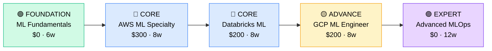

# How to Become an MLOps Engineer

**`CP40`** · **DevOps / Platform** · _Time to hire: 24–36 months_ · _Entry cost: $1,500–$2,500 USD_

> **Path summary:** This path takes you from a DevOps engineer or data engineer background to a hired MLOps Engineer role using machine learning platforms (AWS SageMaker, Databricks, GCP Vertex AI), model deployment, and ML pipelines, in 24–36 months. You'll operationalise machine learning.

---

## Role Overview

### What does an MLOps Engineer actually do?

An MLOps Engineer bridges machine learning and operations—ensuring ML models are trained, validated, deployed, and monitored in production. You spend your days: building ML pipelines (data ingestion → training → validation → deployment), managing model versioning and registries, designing feature stores, implementing monitoring for model performance (not just system metrics), automating retraining when model accuracy drifts, and troubleshooting production ML issues. You might spend 4 hours designing an end-to-end ML pipeline in Kubeflow, 2 hours debugging why model predictions degraded after data distribution shift, and 1 hour optimising training cost. Tools you use daily: Kubernetes, TensorFlow/PyTorch, MLflow, Airflow, cloud ML services (SageMaker, Vertex AI, Databricks), and monitoring tools (Prometheus, custom dashboards).

MLOps teams sit in tech companies, fintechs, data-driven startups, and enterprises with mature ML practices. Typical teams are 3–8 people supporting 10–100+ data scientists. You collaborate closely with data scientists (who build models), data engineers (who prepare data), and DevOps engineers (who manage infrastructure). MLOps work is on-call; production models driving business decisions require reliability. Most roles are hybrid; some infrastructure work requires infrastructure access. The work is intellectually demanding—you're solving novel problems at the intersection of ML and systems.

### Demand in 2026

- **Global job postings:** 2,800+ active MLOps engineer roles on LinkedIn as of May 2026. [(source)](https://www.linkedin.com/jobs/search/?keywords=mlops+engineer)
- **Growth rate:** 22% YoY / ML is entering production everywhere; MLOps is becoming essential. Fastest-growing DevOps specialisation. [(source)](https://www.linkedin.com/jobs/)
- **South Africa:** Emerging demand at tech companies, fintechs (using ML for fraud detection), and data-driven companies. Less demand than traditional DevOps but rapidly growing.
- **Remote availability:** Very high (80%+). ML infrastructure is mostly cloud-based and remote-friendly.

---

## Who Is This Path For?

### Ideal starting backgrounds

| Background | Readiness | What you already have |
|---|---|---|
| DevOps Engineer (2+ years) | ✅ Excellent start | Infrastructure, automation, CI/CD knowledge. Needs ML knowledge. |
| Data Engineer | ✅ Excellent start | Data pipelines, big data tools. Needs ML and deployment knowledge. |
| Machine Learning Engineer | ✅ Good start | ML model knowledge. Needs operations, deployment, and monitoring depth. |
| Software Engineer (Python focus) | 🟡 Good with gaps | Coding skills strong; needs ML, operations, and infrastructure knowledge. |
| Cloud Architect | 🟡 Good with gaps | Cloud expertise; needs ML-specific tools and ML pipeline knowledge. |
| Data Scientist transitioning to ops | 🟡 Good with gaps | ML knowledge; needs DevOps, infrastructure, and software engineering depth. |

### You're ready to start this path if you can:
- Explain what a machine learning pipeline is and its stages
- Write Python code to train a simple ML model using scikit-learn or TensorFlow
- Understand DevOps concepts: CI/CD, containerisation, infrastructure-as-code
- Explain model drift and how to detect it
- Understand basic Kubernetes and Docker

> **Not ready yet?** If you're a data scientist without DevOps knowledge, start with DevOps fundamentals. If you're a DevOps engineer without ML knowledge, start with ML fundamentals (3–6 months each).

---

## Certification Sequence

### Visual path

---

### Stage 1 — Foundation (Months 0–6)

**Goal:** Understand ML fundamentals and DevOps concepts before specialising in MLOps.

| Cert | Code | Cost (USD) | Study Time | Why it matters |
|---|---|---:|---:|---|
| ML Fundamentals (no formal cert; use free resources) | (free) | $0 | 6–8 weeks | Machine learning concepts: supervised/unsupervised learning, model evaluation, overfitting, hyperparameter tuning. MLOps assumes ML knowledge. |

**Stage 1 total:** $0 USD · R0 ZAR · 6 months

**Study approach:** Use free resources: Coursera ML by Andrew Ng (free audit), fast.ai, Google Developers ML Course, Kaggle Learn. Build 5–6 ML projects on Kaggle. Focus on: classification, regression, evaluation metrics, and cross-validation. Minimum 100 hours.

---

### Stage 2 — Core Specialisation (Months 6–22)

**Goal:** Get ML platform certifications on major clouds: AWS SageMaker, Databricks, and GCP Vertex AI.

| Cert | Code | Cost (USD) | Study Time | Why it matters |
|---|---|---:|---:|---|
| AWS Certified Machine Learning – Specialty (MLS-C01) | `MLS-C01` | $300 | 8–10 weeks | AWS ML platform mastery. SageMaker is the most common MLOps platform globally. |
| Databricks Certified ML Professional | (emerging) | $200 | 8–10 weeks | Databricks is rapidly growing. Expertise in Databricks (Spark + MLflow) highly valued. |
| Google Cloud Professional ML Engineer | `GCPE` | $200 | 8–10 weeks | GCP Vertex AI and ML platform. Growth opportunity; less common but valued. |

**Stage 2 total:** $700 USD · R12,600 ZAR · 5–6 months

**Study approach:** 
- **AWS MLS:** Use A Cloud Guru, Linux Academy, or AWS training. Focus on: SageMaker (training, hosting, pipelines), model deployment, and monitoring. Build end-to-end models in SageMaker.
- **Databricks ML:** Use Databricks training. Focus on: MLflow for experiment tracking and model registry, distributed training, and ML pipelines.
- **GCP ML Engineer:** Use Google Cloud training. Focus on: Vertex AI, AutoML, and ML pipeline orchestration.

**Project milestone:** 
Build a **complete MLOps pipeline**: data ingestion → feature engineering → model training (with hyperparameter tuning) → model validation → deployment to production → monitoring with retraining trigger. Implement in either AWS SageMaker or Databricks. Include: versioning, A/B testing, and automated retraining. Document the entire workflow.

---

### Stage 3 — Advanced Specialisation (Months 22–30)

**Goal:** Deep expertise in specific ML platform or adjacent tools (feature stores, model monitoring, orchestration).

| Cert | Code | Cost (USD) | Study Time | Why it matters |
|---|---|---:|---:|---|
| KubeFlow / Airflow for ML Orchestration (community, no formal cert) | (community) | $0 | 8–10 weeks | ML pipeline orchestration. Growing standard for complex ML workflows. |
| Feature Store / MLflow Model Registry (community) | (community) | $0 | 6–8 weeks | Critical MLOps components. Feature stores enable efficient ML. |

**Stage 3 total:** $0 USD · R0 ZAR · 2–3 months

> **Optional at hire time:** Many MLOps engineers get hired after Stage 2 and specialise in specific tools while working.

---

### Stage 4 — Expert / Leadership (30–48 months+)

**Goal:** MLOps architecture and leadership. Tackle after 3–5 years of hands-on MLOps work.

| Cert | Code | Cost (USD) | Study Time | Why it matters |
|---|---|---:|---:|---|
| Advanced MLOps Architecture (community courses, no formal cert) | (community) | $0 | 12–16 weeks | Design ML platforms at scale. Positions you for senior/architect roles. |

> Pursue after 3–5 years of hands-on MLOps experience.

---

## Timeline & Cost Summary

| Stage | Certs | Duration | Cost (USD) | Cost (ZAR) |
|---|---|---|---:|---:|
| Stage 1 — Foundation | ML Fundamentals | Months 0–6 | $0 | R0 |
| Stage 2 — Core | AWS ML + Databricks + GCP ML | Months 6–22 | $700 | R12,600 |
| Stage 3 — Advanced | Orchestration + Feature Stores | Months 22–30 | $0 | R0 |
| **Total to hireable (Stage 1–2)** | **ML + AWS MLS + Databricks** | **24–30 months** | **$500** | **R9,000** |

**Study hours required:** ~900–1,200 hours total (Stage 1–3). Assumes 20–25 hours/week = 36–60 weeks.

---

## Salary Progression

> All figures: median base salary, not including bonuses/equity. ZAR = USD × 18 baseline (verified May 2026). Sources: Robert Half 2026, Glassdoor, LinkedIn Salary.

| Experience Level | USD/year | ZAR/year | GBP/year | EUR/year | AUD/year |
|---|---:|---:|---:|---:|---:|
| Entry / Junior (0–2 yrs) | $100,000 | R1,800,000 | £78,000 | €88,000 | A$150,000 |
| Mid-level (2–5 yrs) | $140,000 | R2,520,000 | £110,000 | €124,000 | A$210,000 |
| Senior (5–8 yrs) | $180,000 | R3,240,000 | £141,000 | €159,000 | A$270,000 |
| Lead / Staff (8+ yrs) | $220,000–$280,000 | R3,960,000–R5,040,000 | £173,000–£220,000 | €195,000–€248,000 | A$330,000–A$420,000 |

**South Africa note:** Entry-level MLOps engineers at Johannesburg-based companies earn R64,000–R95,000/month. Mid-level (3–5 years) command R110,000–R170,000/month. Remote work for international tech (Google, Amazon, Meta) yields R150,000–R250,000/month—MLOps salaries are among the highest in tech. Startups using ML aggressively pay R90k–R140k/month.

**Salary accelerators:** AWS ML Specialty + Databricks certifications command 15–25% premium. Published ML infrastructure designs, open-source MLOps tools, and Kaggle competition wins boost credibility. Advanced expertise in feature stores, model monitoring, and automation drive highest salaries.

---

## First Job Strategy

### Month 0–6: Build the Foundation

1. **Start ML fundamentals** — Coursera ML by Andrew Ng (free audit). Build 5–6 ML projects on Kaggle. 100+ hours.
2. **Learn DevOps basics** — If you're not from DevOps: Docker, Kubernetes basics, CI/CD concepts.
3. **Combine: Build an ML project with deployment** — Use Docker + simple CI/CD for ML model.
4. **Join ML/MLOps community** — Reddit: r/MachineLearning, r/MLOps. Discord: MLOps communities. Kaggle for competitions.

### Month 6–20: Build Your Portfolio

1. **Project 1: Complete ML Pipeline in SageMaker or Databricks (14–16 hours)** — End-to-end: data ingestion → feature engineering → training (with hyperparameter tuning) → validation → deployment → monitoring. Document all steps. Include versioning and retraining triggers.

2. **Project 2: Feature Store Implementation (10–12 hours)** — Build a feature store using Feast or Databricks Feature Store. Demonstrate: feature versioning, feature serving, and feature reuse across models.

3. **Project 3: Model Monitoring & Retraining (10–12 hours)** — Implement monitoring for model performance (not just system metrics). Detect model drift. Trigger automated retraining. Document the monitoring strategy.

4. **Project 4: A/B Testing Framework (8–10 hours)** — Design and implement A/B testing for ML models. Show: traffic splitting, metrics collection, and statistical significance testing. Document the framework.

### Month 20–28: Apply and Iterate

- **CV positioning:** List yourself as "MLOps Engineer" once you have AWS ML Specialty + Databricks cert + portfolio. Before certs, list as "ML Engineer (MLOps Focus)" or "Data Engineer (ML Ops Track)".
- **Target companies:** Start with startups using ML aggressively (fintech for fraud detection, e-commerce for recommendations). Then tech companies. Avoid companies without mature ML practices—they won't value MLOps expertise.
- **Interview prep:** Be ready to discuss: 1) Your end-to-end ML pipeline and architecture decisions; 2) Feature stores and feature engineering at scale; 3) Model monitoring and drift detection; 4) Deployment strategies (canary, blue-green, shadow); 5) A/B testing framework; 6) A production ML incident and how you'd prevent it; 7) Cost optimisation for training/inference.
- **Salary negotiation:** MLOps roles in SA advertise at R64k–R85k/month entry-level (if they understand MLOps; many list as "data engineer" or "DevOps"). With AWS ML + Databricks, negotiate for R100k–R140k/month. International remote roles are R150k–R250k/month—actively target those. MLOps is one of the highest-paid specialisations.

---

## A Day in the Life

### MLOps Engineer at a Fintech (Johannesburg) — Junior Level

**08:00** — Check ML pipeline status. Overnight, a weekly retraining job ran on fraud detection model. Check: model accuracy (99.2%, good), feature quality (all within expected ranges), and training time (2.1 hours, acceptable). Model is ready for deployment to production.

**09:00** — Standup with ML team. Brief on overnight retraining and model performance. Data scientists have requested a new feature (transaction amount category). You'll add it to the feature store.

**10:00** — Implement the new feature in the feature store. Define: computation logic, versioning, and validation. Test with historical data to ensure correctness.

**11:00** — Monitor production model serving. Check: inference latency (45ms average, good), throughput (5,000 predictions/hour, expected), error rate (0.1%, acceptable). All healthy.

**12:00** — Lunch.

**13:00** — Work on your assigned task: improve model retraining efficiency. Currently, retraining from scratch takes 2.1 hours. Investigate: can you use transfer learning or checkpoint loading to speed up? Design an optimisation.

**15:00** — Test the optimisation in staging. New retraining time: 47 minutes (77% faster). Excellent. Document the improvement.

**15:30** — Update the retraining pipeline to use the optimisation. Deploy to production pipeline (with manual approval before first run).

**16:30** — Document the feature store schema and model monitoring metrics for the team.

**17:00** — Wrap up. Check all systems healthy. Plan tomorrow.

### MLOps Engineer at a Tech Company (Remote, EMEA) — Mid-Level

**09:00** — Async standup. Overnight, a model training job failed (data quality issue: missing values in feature feed). You've already diagnosed and restarted with data validation checks added.

**10:00** — 1:1 with your manager. You're proposing a feature store architecture redesign to support multi-team feature sharing. She approves—this will accelerate model development company-wide.

**10:30** — Design the new feature store: shared infrastructure, governance for data quality, feature lineage tracking, and cost allocation. Document architecture.

**12:00** — Lunch + consultation call with a data science team. They want to deploy a new recommendation model. You review the model: accuracy looks good, but inference latency is 500ms (too slow for real-time). Recommend model optimisation (quantisation, distillation). Offer to help implement.

**13:00** — Work on the recommendation model optimisation. Apply knowledge distillation: train a smaller student model using the larger teacher model's predictions. Result: 50ms latency (10x speedup), 99.5% accuracy (acceptable loss).

**14:30** — Design a monitoring dashboard for the recommendation model. Include: accuracy, latency, throughput, inference cost, and user satisfaction (A/B test results).

**15:30** — Work on A/B testing infrastructure. Implement a framework for running experiments: traffic splitting, metric collection, and statistical significance testing. This enables safe model rollouts.

**16:30** — Mentor a junior MLOps engineer. Review their feature store implementation. Check: schema design, data quality validation, and documentation. Suggest improvements.

**17:00** — Wrap up. Monitor all ML systems (no issues). Plan next week: start feature store architecture migration project.

---

## Related Paths & Progressions

| From here you can move to… | Why |
|---|---|
| [Cloud Architect (upcoming path)](../Roadmaps/) | MLOps expertise informs ML platform architecture. Natural progression to design roles. |
| [Data Architect (upcoming path)](../Roadmaps/) | MLOps + deep data knowledge = data architecture. Combines ML pipelines with data infrastructure. |
| [Engineering Manager / ML Manager (upcoming path)](../Roadmaps/) | Lead MLOps teams after 4–5 years. Many MLOps engineers become managers. |
| [ML Research Engineer (upcoming path)](../Roadmaps/) | MLOps + cutting-edge ML research = research engineering. Path for publication-focused work. |

---

## South Africa Context

### Market specifics

MLOps demand in SA is emerging. Tech companies (Takealot), fintechs using fraud detection ML, and data-driven startups are beginning to hire. Government and large enterprises have limited ML adoption, so limited MLOps demand.

The MLOps market in SA is tiny but growing fast—one of the fastest-growing specialisations globally. Companies doing MLOps are typically well-funded and pay premiums. Remote work opportunities are excellent: tech companies globally aggressively hire SA-based MLOps engineers.

MLOps requires dual expertise (ML + DevOps), making it harder to find talent. This creates opportunity for career changers willing to invest 24–36 months.

### SA-specific resources

| Resource | URL | Note |
|---|---|---|
| Takealot Careers | [careers.takealot.com](https://careers.takealot.com) | Leading SA tech. Some ML/MLOps roles emerging. |
| Coursera ML by Andrew Ng | [coursera.org](https://www.coursera.org) | Free audit option. Best ML fundamentals course. |
| AWS Training | [aws.amazon.com/training/](https://aws.amazon.com/training/) | ML and SageMaker training. Free tier available. |
| Databricks Training | [databricks.com/learn/](https://databricks.com/learn/) | MLflow and Databricks platform training. |
| MLOps.community | [mlops.community](https://mlops.community) | Global MLOps community. Excellent resource. |

---

## Frequently Asked Questions

**Q: Do I need to be a strong data scientist to become an MLOps engineer?**

Not required. You need to understand ML concepts (training, validation, model evaluation), but you don't need to publish papers or compete on Kaggle. Many successful MLOps engineers come from DevOps backgrounds and learn ML on the job. Data engineer or DevOps background is more valuable than deep ML.

**Q: Is MLOps harder than traditional DevOps?**

Different, not necessarily harder. You need both DevOps skills (infrastructure, automation, monitoring) and ML knowledge (model evaluation, feature engineering, retraining). The combination is intellectually demanding. If you're not interested in both, MLOps might not be for you.

**Q: How long does it really take to get a first MLOps job?**

24–36 months if starting from zero. Timeline: 6 months ML fundamentals + 6 months DevOps fundamentals + 12 months MLOps specialisation + 6 months job search/portfolio. If you already have DevOps background: 12–18 months. If you already have ML background: 12–18 months.

**Q: Which cloud platform should I focus on for MLOps?**

**AWS** has the largest market share (SageMaker). If targeting global companies, start with AWS. **GCP** (Vertex AI) is simpler and more integrated. **Databricks** is rapidly growing and excellent for data engineering + ML. Ideal: learn AWS first, then Databricks or GCP.

**Q: What's the difference between an MLOps engineer and a data engineer?**

Data engineer: focuses on data infrastructure, pipelines, and quality. MLOps engineer: focuses on ML pipelines, model deployment, and operations. Data engineers build the data layer; MLOps engineers use it to serve ML models. Both are essential and complementary.

---

## Sources & Further Reading

| # | Source | URL | Used for |
|---|---|---|---|
| 1 | LinkedIn Jobs | [linkedin.com/jobs/search/?keywords=mlops+engineer](https://www.linkedin.com/jobs/search/?keywords=mlops+engineer) | Job postings, May 2026 |
| 2 | Coursera ML | [coursera.org/learn/machine-learning](https://www.coursera.org/learn/machine-learning) | Andrew Ng ML fundamentals (free audit available) |
| 3 | AWS ML Specialty | [aws.amazon.com/certification/certified-machine-learning-specialty/](https://aws.amazon.com/certification/certified-machine-learning-specialty/) | AWS ML certification |
| 4 | Databricks Academy | [academy.databricks.com](https://academy.databricks.com) | Databricks and MLflow training |
| 5 | Google Cloud ML Engineer | [cloud.google.com/certification/machine-learning-engineer](https://cloud.google.com/certification/machine-learning-engineer) | GCP ML certification |
| 6 | MLOps.community | [mlops.community](https://mlops.community) | MLOps best practices and community |
| 7 | Made With ML | [madewithml.com](https://madewithml.com) | MLOps course by Goku Mohandas (free) |
| 8 | Robert Half 2026 Salary Guide | [roberthalf.com/salary-guide](https://www.roberthalf.com/salary-guide) | Market salaries for ML/data roles |

---

*Career path guide for MLOps engineers | Last updated 2026-05-02 | ZAR baseline: R18/$1 USD*
*For updates and job leads, see [IT Career Roadmap](https://itcareerroadmap.com)*
