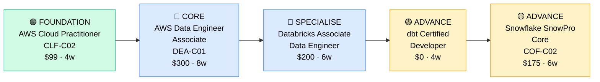

# How to Become a Data Engineer

**`CP41`** · **Data & AI** · _Time to hire: 15–24 months_ · _Entry cost: $1,200–$1,800 USD_

> **Path summary:** This path takes you from IT support or junior developer to a hired Data Engineer using AWS, Databricks, Snowflake, and dbt, in 15–24 months. You'll build ETL pipelines, optimize data warehouses, and solve real-world data problems that power business decisions.

---

## Role Overview

### What does a Data Engineer actually do?

A Data Engineer sits at the intersection of software development and data analysis. Your day involves writing Python and SQL scripts to extract data from APIs, databases, and logs; transforming that messy raw data into clean, queryable datasets; and loading it into data warehouses like Snowflake or Redshift. You're building the pipes that allow analysts and scientists to actually do their jobs. You might spend a morning debugging a failing ETL job, the afternoon optimizing slow queries on a billion-row table, and the evening designing a new data model for a product team. Tools vary—you'll touch AWS, Apache Spark, dbt, Kafka, and Git constantly.

Data Engineers typically work on teams of 3–10, though in startups you might be the lone data person initially. The role is remote-friendly at 70%+ of companies globally. Oncall presence varies by company: startups running critical data pipelines often have on-call rotations; enterprise data teams less so. You'll collaborate closely with analysts (who consume your data), data scientists (who need clean feature sets), and product teams (who need dashboards updated). This is not a lonely role—communication and documentation matter as much as your SQL skills.

### Demand in 2026

- **Global job postings:** 28,000+ active Data Engineer roles on LinkedIn as of May 2026 [(source)](https://www.linkedin.com/jobs/search/?keywords=Data%20Engineer)
- **Growth rate:** 15% YoY / BLS projects data roles growing 21% through 2032 [(source)](https://www.bls.gov/ooh/computer-and-information-technology/database-administrators-and-architects.htm)
- **South Africa:** Strong demand at financial services (Nedbank, Standard Bank, ABSA), telcos (MTN, Vodacom, Telkom), and emerging FinTech. Discovery, Capitec, and major consulting firms (Deloitte, EY, BCX) all hiring as of Q1 2026.
- **Remote availability:** 72% of global roles are remote or hybrid. South African engineers routinely work for UK/US data teams.

---

## Who Is This Path For?

### Ideal starting backgrounds

| Background | Readiness | What you already have |
|---|---|---|
| Developer / Programmer | ✅ Strong start | Python/Java fundamentals, git workflows, testing mindset |
| Database Administrator | ✅ Strong start | SQL expertise, schema design, query optimization |
| IT Support / Help Desk | 🟡 Possible | Troubleshooting mindset; needs Python + SQL ramp-up |
| Analytics background | 🟡 Possible | Business context; needs Python + engineering practices |
| Recent CS graduate | ✅ Strong start | Theory solid; needs 2–3 months hands-on labs |
| Complete career changer | 🟡 Possible | Need 3–6 months foundation (Python + SQL basics) |
| Data Analyst | ✅ Strong start | SQL and analytics mindset; upskill on engineering practices |

### You're ready to start this path if you can:
- Write and debug Python scripts (functions, error handling, basic data structures)
- Query a SQL database (SELECT, JOINs, GROUP BY, basic window functions)
- Work with Git (clone, commit, push, pull requests)
- Understand basic cloud infrastructure (VPCs, IAM, storage services)

> **Not ready yet?** Start with [Data Foundations (R09)](../Roadmaps/R09_Data_Foundations.md) first—4–8 weeks of Python + SQL basics.

---

## Certification Sequence

### Visual path

---

### Stage 1 — Foundation (Months 0–2)

**Goal:** Prove you understand cloud services and basic data concepts before diving into specialized data engineering.

| Cert | Code | Cost (USD) | Study Time | Why it matters |
|---|---|---:|---:|---|
| AWS Certified Cloud Practitioner | `CLF-C02` | $99 | 3–4 weeks | Entry point to AWS ecosystem; 70% of data jobs use AWS |
| Python Basics (Codecademy / DataCamp) | — | $0–$40 (free option) | 2–3 weeks | You'll write Python daily; get syntax and libraries right |

**Stage 1 total:** $99–$139 USD · R1,782–R2,502 ZAR · 2 months

**Study approach:** Use [ACloud.Guru's Cloud Practitioner course](https://acloud.guru/) (well-structured, $35/mo), supplement with [TutorialsDojo practice exams](https://tutorialsdojo.com/). For Python, [Python for Everybody](https://www.py4e.com/) is free and excellent. Do 50 practice questions daily in week 3–4. Schedule exam when scoring 75%+ consistently.

**Lab requirement:** Set up a free AWS account (no credit card required for Free Tier). Launch an EC2 instance, create an S3 bucket, explore IAM. Spend 6–8 hours hands-on. Build a simple Python script that reads a CSV, transforms it, and writes it back.

---

### Stage 2 — Core Specialisation (Months 2–10)

**Goal:** Land your first Data Engineer role by getting the anchor AWS cert and building real ETL pipelines.

| Cert | Code | Cost (USD) | Study Time | Why it matters |
|---|---|---:|---:|---|
| AWS Certified Data Engineer Associate | `DEA-C01` | $300 | 7–8 weeks | The job market entry-level credential; 80%+ of postings mention AWS |
| Databricks Certified Associate Data Engineer | — | $200 | 5–6 weeks | Databricks/Spark is industry standard for large-scale ETL; differentiates you |

**Stage 2 total:** $500 USD · R9,000 ZAR · 6–8 months

**Study approach:** Use [Stephane Maarek's AWS Data Engineer course](https://www.udemy.com/course/aws-certified-data-engineer/) on Udemy ($15 sale price) paired with [TutorialsDojo practice exams](https://tutorialsdojo.com/aws-certified-data-engineer-associate/). For Databricks, use the official [Databricks Academy](https://academy.databricks.com/). The DEA-C01 covers data lakes, ETL, analytics, and data warehouses—all critical. Plan 10 hours/week study + 4 hours/week hands-on labs.

**Project milestone:** Build a 3-stage ETL pipeline. Stage 1: Extract CSV/JSON data from a public API (e.g., Kaggle dataset, OpenWeather). Stage 2: Transform using Python/Spark—clean nulls, deduplicate, aggregate. Stage 3: Load into a Snowflake trial account (free 30 days). Document the entire pipeline in a GitHub repo with a README. This is your portfolio piece.

---

### Stage 3 — Advanced Specialisation (Months 10–18)

**Goal:** Differentiate yourself as a production-ready engineer by mastering modern data stack tools—dbt and Snowflake.

| Cert | Code | Cost (USD) | Study Time | Why it matters |
|---|---|---:|---:|---|
| dbt Certified Developer | — | $0 | 4–5 weeks | dbt is the de facto standard for analytics engineering; free to learn, high ROI |
| Snowflake SnowPro Core | `COF-C02` | $175 | 5–6 weeks | Snowflake dominates enterprise data warehousing; second anchor cert |

**Stage 3 total:** $175 USD · R3,150 ZAR · 6–8 months

**Study approach:** dbt learning is free via [dbt Learn](https://learn.getdbt.com/) and their excellent [documentation](https://docs.getdbt.com/). Build real dbt models—refactor your Stage 2 project using dbt. For Snowflake, use [Snowflake University](https://university.snowflake.com/) and [Nick Singh's course](https://www.udemy.com/course/snowflake-masterclass/) (€12 on sale). The SnowPro Core exam tests hands-on Snowflake proficiency—queries, functions, performance.

**Project milestone:** Refactor your Stage 2 ETL as a dbt project. Create staging models, intermediate models, and fact tables. Add documentation and tests. Connect to Snowflake. Set up dbt Cloud (free tier). Deploy to production. Show that you understand the modern analytics stack.

> **Optional at hire time:** Many people land their first Data Engineer job after Stage 2 (AWS cert + one project) and complete Stage 3 while employed. This is valid and common—employers expect on-the-job learning.

---

### Stage 4 — Expert / Leadership (18–36 months+)

**Goal:** Senior-level credentials for architects and technical leads. Pursue after 2–3 years hands-on.

| Cert | Code | Cost (USD) | Study Time | Why it matters |
|---|---|---:|---:|---|
| Databricks Certified Data Engineer Professional | — | $300 | 8–10 weeks | Advanced Spark, production patterns; requires 2+ years experience |
| AWS Data Engineer Professional | `DEN-C02` | $300 | 8–10 weeks | Architect-level; large-scale pipelines, cost optimization, governance |

> These require real-world experience to pass—don't rush them. 2–3 years of production work → then cert is the correct sequence.

---

## Timeline & Cost Summary

| Stage | Certs | Duration | Cost (USD) | Cost (ZAR) |
|---|---|---|---:|---:|
| Stage 1 — Foundation | CLF-C02 | Months 0–2 | $99 | R1,782 |
| Stage 2 — Core | DEA-C01, Databricks Associate | Months 2–10 | $500 | R9,000 |
| Stage 3 — Advanced | dbt + COF-C02 | Months 10–18 | $175 | R3,150 |
| **Total to hireable** | | **15–18 months** | **$774** | **R13,932** |

**Study hours required:** ~400–500 hours total (Stage 1–3). Assumes 12 hours/week = 18 months.

---

## Salary Progression

> All figures: median base salary, not including bonuses/equity. ZAR = USD × 18. Sources: Robert Half 2026, Glassdoor, LinkedIn Salary, PayScale.

| Experience Level | USD/year | ZAR/month | GBP/year | EUR/year | AUD/year |
|---|---:|---:|---:|---:|---:|
| Entry / Junior (0–2 yrs) | $85,000–$120,000 | R54,000–R77,000 | £66,000–£93,000 | €79,000–€112,000 | A$125,000–A$175,000 |
| Mid-level (2–5 yrs) | $120,000–$155,000 | R77,000–R99,000 | £93,000–€120,000 | €112,000–€145,000 | A$175,000–A$228,000 |
| Senior (5–8 yrs) | $155,000–$195,000 | R99,000–R124,000 | €120,000–€151,000 | €145,000–€183,000 | A$228,000–A$287,000 |
| Lead / Architect (8+ yrs) | $195,000–$250,000 | R124,000–R159,000 | £151,000–£193,000 | €183,000–€236,000 | A$287,000–A$368,000 |

**South Africa note:** Entry-level Data Engineers at Johannesburg-based banks (Nedbank, ABSA) earn R45,000–R65,000/month (R540k–R780k/year). Cape Town tech companies and Durban FinTech offer R50k–R80k/month. Remote roles for international clients push this to R70,000–R110,000/month for mid-level. Discovery and Capitec both hired aggressively in 2025–2026.

**Salary accelerators:** AWS certifications (especially DEA-C01), Python proficiency, Spark optimization skills, and dbt expertise all command 10–15% premiums in SA job listings. FinTech and InsurTech roles pay 20% higher than traditional enterprises as of Q1 2026.

---

## First Job Strategy

### Month 0–3: Build the Foundation

1. **Set up your AWS lab** — Create a free AWS account. Launch EC2, S3, RDS (free tier eligible). Cost: $0.
2. **Begin AWS Cloud Practitioner cert** — Use [ACloud.Guru](https://acloud.guru/) + [TutorialsDojo practice exams](https://tutorialsdojo.com/). Schedule exam for week 4.
3. **Learn Python fundamentals** — [Python for Everybody](https://www.py4e.com/) or [Codecademy](https://www.codecademy.com/). Build 5 small scripts: CSV parsing, API calls, data transformation.
4. **Join communities** — r/dataengineering, [Analytics Engineering Slack](https://www.analyticsengineering.club/), AWS Community Discord.
5. **Start documenting** — GitHub profile with your Python scripts and AWS lab screenshots. LinkedIn posts: weekly learning updates (1–2 per week).

### Month 3–6: Build Your Portfolio

- **Project 1: CSV-to-Database ETL** — Write a Python script that reads 1M+ rows from a public CSV (Kaggle), cleans it (handle nulls, duplicates, type conversions), and writes to a PostgreSQL database. Estimated time: 8–10 hours. Host on GitHub with full documentation.
- **Project 2: API-to-Data Lake** — Extract data from a public REST API (e.g., OpenWeather, GitHub API, Stripe sandbox), automate with Python + Airflow (free), store in S3. Add scheduling logic. Estimated time: 12–15 hours.
- **Project 3: Spark Data Processing** — Use Databricks Community Edition (free) to process a 100M+ row dataset using Spark SQL and DataFrames. Show aggregations, joins, and performance optimization. Document the query plan. Estimated time: 10–12 hours.

### Month 6–12: Apply and Iterate

- **CV positioning:** List as "Data Engineer (AWS/Spark)" once you hold AWS CLF-C02 and have 2+ portfolio projects. Don't use "Junior"—hiring managers look for foundational skills, not titles.
- **Target companies:** MSPs and IT consulting firms (BCX, Dimension Data, Deloitte) hire entry-level. Start there. Cloud-native startups and major banks (Nedbank, ABSA, Discovery) often want 1–2 years. Agencies and FinTech are hiring.
- **Interview prep:** Be ready to discuss 1) Your ETL pipeline design decisions, 2) SQL performance optimization (index strategies), 3) Python data handling (Pandas, Spark), 4) Your AWS services knowledge, 5) Data modeling principles.
- **Salary negotiation:** Don't accept first offers. South Africa entry-level roles list R40k–R55k/month but negotiate. Use the salary table above as your benchmark. Remote international roles often pay 30–50% more.

---

## A Day in the Life

### Data Engineer at a Johannesburg Bank (Nedbank/ABSA) — Junior Level

**08:00** — Arrive, check Slack. One ETL job failed overnight—a CSV file upload was delayed. Review CloudWatch logs and the Airflow DAG. Restart the job manually; it succeeds.

**09:00** — Daily standup. You report progress on your current project: building a new data pipeline for the fraud detection team. They need transaction data aggregated by customer every 5 minutes.

**10:00** — Start writing SQL to prototype the aggregation logic. Query the transaction table (8 billion rows), test a GROUP BY with window functions. Optimization: add a covering index. Test runtime: 45 seconds now (was 3 minutes).

**11:30** — Code review with a mid-level engineer on your Python ETL script. Feedback: add error handling for network timeouts, log more debugging info, and add unit tests. You revise.

**12:30** — Lunch.

**13:30** — Meeting with the analytics team. They want a new data warehouse table for their dashboard. You take requirements, sketch an ERD (entity-relationship diagram), and propose a schema. They approve.

**15:00** — Implement the new table. Write dbt models, add tests (column uniqueness, not-null checks), document the business logic.

**16:30** — Push code to GitHub, create a pull request. Queue it for merge after tomorrow's tests pass. Update Jira ticket. End of day.

### Data Engineer at a Cape Town FinTech Startup — Mid Level

**09:00** — Async standup via Slack (team is distributed: Cape Town, London, Singapore). You've been tasked with migrating the ETL from AWS Lambda to Databricks Spark—cost was exploding at scale.

**09:30** — Code design session. You're refactoring a Python Lambda function (3,000 lines, monolithic) into modular Spark jobs. Sketch architecture: staging layer, transformation layer, marts. Get buy-in from the data science team.

**11:00** — Implement the first Spark job in Databricks. Rewrite the monolithic function as 5 small transformation functions. Test with 10% of production data. Performance: 10x faster.

**12:30** — Lunch (and quick Slack message to the UK team before they leave for the day).

**14:00** — Performance troubleshooting. A downstream dashboard is slow. Examine the data mart—the table isn't partitioned. Add partition pruning. Query time: 8 seconds → 2 seconds. Slack the analytics team the good news.

**15:30** — dbt documentation work. Update model descriptions, add tests for new columns, generate fresh docs site. Push to GitHub.

**16:30** — Pair programming with a junior engineer on their first ETL. Code review their Python script, help debug a Spark join bug (cartesian product from a missing join condition). Teaching moment.

**17:30** — Wrap up. All jobs running green. End of day.

---

## Related Paths & Progressions

| From here you can move to… | Why |
|---|---|
| [Analytics Engineer (CP43)](CP43_Data_Analytics_Engineer.md) | You already know the data pipeline; add BI + analytics skills for a hybrid role |
| [Data Architect (CP44)](CP44_Data_Data_Architect.md) | After 5+ years of hands-on, design systems instead of building them |
| [ML Engineer (CP45)](CP45_Data_ML_Engineer.md) | Learn feature engineering, model deployment; apply your pipeline skills to ML workflows |
| [AI Engineer (CP46)](CP46_Data_AI_Engineer.md) | Pivot into LLM fine-tuning, RAG pipelines, prompt engineering; newer, high-demand role |

---

## South Africa Context

### Market specifics

Data Engineers are in high demand across South African financial services, telecommunications, and emerging tech. Nedbank, Standard Bank, and ABSA all have active data engineering teams in Johannesburg and are recruiting heavily post-2024. Capitec has grown its data practice 40%+ annually. MTN and Vodacom are building modern data stacks for billing and customer analytics. Emerging FinTechs like PayFast, Luno, and 22seven hire data engineers for fraud detection and customer analytics.

Remote work is increasingly normal. Many South African engineers work for US and UK-based fintech and data companies at significantly higher salaries (R70k–R100k+/month for mid-level). Companies like Stripe, Databricks, and Notion hire remotely from South Africa. However, onsite/hybrid roles at major banks and consulting firms (Deloitte, EY, PwC, BCX) are abundant in Johannesburg, Durban, and Cape Town.

BEE/EE considerations are significant in banking and government. Holding AWS, Databricks, or Snowflake certs helps you stand out and level the competitive field, especially in government contracts and state-owned enterprises (SARS, Eskom, PRASA) which have diversity targets.

### SA-specific resources

| Resource | URL | Note |
|---|---|---|
| Johannesburg Data Engineers Meetup | [Meetup.com/Johannesburg-Data-Engineers](https://www.meetup.com/johannesburg-data-engineers/) | Monthly meetups; networking |
| Cape Town Tech Job Board | [Jobslisted.com](https://jobslisted.com/) | Local job postings, many remote |
| Nedbank Careers | [Nedbank.co.za/Careers](https://www.nedbank.co.za/careers) | Direct applications; many data roles |
| BCX (Altron) Data Services | [BCX.co.za](https://www.bcx.co.za/) | Consulting; data pipeline projects |
| Databricks Partners SA | [Databricks Community](https://www.databricks.com/community) | Local user groups and events |
| Data Engineering Slack (SA chapter) | [Analytics Engineering Club](https://www.analyticsengineering.club/) | Active South Africa data engineers |

---

## Frequently Asked Questions

**Q: Do I need a degree to become a Data Engineer?**

No. Many successful South African data engineers started in IT support, programming, or business analysis. University gives theory but not job-ready skills. Certs + portfolio projects matter more. However, a CS or engineering degree does help you understand systems thinking and software practices faster.

**Q: How long does it realistically take from zero?**

15–24 months. If you have Python and SQL already, 12–15 months. If you're starting from scratch (no programming), add 3–6 months. This assumes 10–15 hours/week of study + hands-on lab work.

**Q: Which cert should I do first?**

AWS Cloud Practitioner (CLF-C02). It's the lowest barrier to entry, teaches you AWS (used everywhere), and takes only 3–4 weeks. Then jump to AWS Data Engineer Associate (DEA-C01), which is the real hire-able cert.

**Q: Can I do this path while working full-time?**

Yes. At 12 hours/week (2 hours, 6 days), Stage 1–2 takes 5–6 months instead of 3. Stage 3 adds another 6–8 weeks. Most people study evenings and weekends. Weekday office work + weeknight study is tough but doable.

**Q: Is the AWS Data Engineer Associate cert worth it for this role?**

Yes, absolutely. 80%+ of job postings mention AWS. The DEA-C01 is the entry-level bar. It covers data lakes, ETL, analytics services, and data warehouses—everything you'll use daily.

**Q: Should I learn Spark first or SQL first?**

SQL first. You need SQL to query data, debug pipelines, and interact with databases. Spark is built on SQL concepts. Get SQL to 70% proficiency, then layer Spark and Python on top.

---

## Sources & Further Reading

| # | Source | URL | Used for |
|---|---|---|---|
| 1 | LinkedIn Jobs (Data Engineer) | [linkedin.com/jobs](https://www.linkedin.com/jobs/search/?keywords=Data%20Engineer) | Job posting volume and trend data |
| 2 | Robert Half 2026 Salary Guide | [roberthalf.com/salary-guide](https://www.roberthalf.com/salary-guide) | Salary ranges USD/year |
| 3 | AWS Certified Data Engineer Associate | [aws.amazon.com/certification/certified-data-engineer/](https://aws.amazon.com/certification/certified-data-engineer/) | Cert details, exam guide |
| 4 | Glassdoor Data Engineer Salary | [glassdoor.com](https://www.glassdoor.com/Salaries/data-engineer-salary-SRCH_KO0,13.htm) | South Africa and regional salary data |
| 5 | BLS Computer and IT Jobs | [bls.gov/ooh/computer-and-information-technology/](https://www.bls.gov/ooh/computer-and-information-technology/database-administrators-and-architects.htm) | Growth projections to 2032 |
| 6 | Databricks Academy | [academy.databricks.com](https://academy.databricks.com/) | Databricks cert and course content |
| 7 | dbt Learn | [learn.getdbt.com](https://learn.getdbt.com/) | dbt certification path |
| 8 | PayScale SA Salary Data | [paysa.com](https://www.paysa.com/) | South Africa-specific compensation |

---

*Template version: 2026-05-02 | Maintained by IT Career Roadmap | ZAR baseline: R18/$1 USD*
*File naming: Career_Paths/CP41_Data_Data_Engineer.md*
