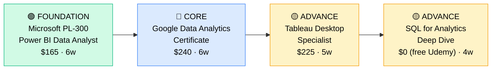

# How to Become a Data Analyst

**`CP42`** · **Data & AI** · _Time to hire: 6–12 months_ · _Entry cost: $800–$1,200 USD_

> **Path summary:** This path takes you from business analyst, finance, or marketing background to a hired Data Analyst using Power BI, Tableau, and SQL, in 6–12 months. It's the most accessible entry into data roles—high demand, lower barrier to entry, and excellent salary growth potential.

---

## Role Overview

### What does a Data Analyst actually do?

A Data Analyst sits between business teams and data systems, translating questions into insights. Your day involves writing SQL queries to extract data from databases, cleaning and aggregating it in Excel or Python, and building dashboards in Power BI or Tableau that executives actually use. You might spend a morning investigating why sales dropped last week, the afternoon building a dashboard showing sales by region and product, and the evening presenting findings to the VP of Sales. You're not building pipelines or training models—you're answering business questions quickly and communicating findings clearly. Tools: SQL, Excel, Power BI/Tableau, Python (increasingly), Looker, Google Sheets.

Data Analysts work on teams of 2–15 depending on company size. Startups might have one analyst wearing many hats; enterprises have dedicated analytics teams. The role is highly remote-friendly (75%+ globally). You'll rarely be on-call. Communication is critical—you spend as much time in meetings explaining dashboards as you do building them. You collaborate with product teams, finance, marketing, operations. This is a people-facing role.

### Demand in 2026

- **Global job postings:** 35,000+ active Data Analyst roles on LinkedIn as of May 2026 [(source)](https://www.linkedin.com/jobs/search/?keywords=Data%20Analyst)
- **Growth rate:** 12% YoY / BLS projects data analysts growing 23% through 2032 [(source)](https://www.bls.gov/ooh/computer-and-information-technology/database-administrators-and-architects.htm)
- **South Africa:** Exceptional demand. Every bank, insurer, and large retail chain (Shoprite, Pick n Pay, Takealot) has analytics teams. Government agencies (SARS, Eskom) hiring heavily. This is the most accessible data role in SA.
- **Remote availability:** 78% of global roles are fully remote or hybrid. South African analysts routinely work for UK/US companies at 2–3x local salaries.

---

## Who Is This Path For?

### Ideal starting backgrounds

| Background | Readiness | What you already have |
|---|---|---|
| Finance / Accounting | ✅ Strong start | Business domain knowledge, Excel expertise |
| Marketing / Product | ✅ Strong start | Analytics mindset, KPI focus, storytelling |
| IT Support | 🟡 Possible | Technical fundamentals; needs SQL + BI ramp-up |
| Operations / Supply Chain | ✅ Strong start | Process thinking, data-driven decision-making |
| Recent graduate (any field) | 🟡 Possible | Can learn fast; needs hands-on experience |
| Developer / Programmer | ✅ Strong start | SQL and scripting skills; add BI tools |
| Complete career changer | ✅ Possible | Fastest entry to data; only 3–4 months needed |

### You're ready to start this path if you can:
- Write basic Excel formulas (VLOOKUP, SUM, IF statements)
- Understand basic business metrics (revenue, margin, KPIs)
- Work with CSV or spreadsheet files
- Read a simple SQL SELECT query (even if you can't write one yet)

> **Not ready yet?** [Start with SQL for Analysts (free DataCamp course)](https://www.datacamp.com/) — 2–3 weeks.

---

## Certification Sequence

### Visual path

---

### Stage 1 — Foundation (Months 0–2)

**Goal:** Master SQL and Excel fundamentals—the non-negotiable baseline for all data analysts.

| Cert | Code | Cost (USD) | Study Time | Why it matters |
|---|---|---:|---:|---|
| Microsoft PL-300 (Power BI Data Analyst) | `PL-300` | $165 | 5–6 weeks | 60%+ of job postings mention Power BI; Microsoft is ubiquitous in enterprises |
| SQL Fundamentals (DataCamp/Mode) | — | $0–$40 | 3–4 weeks | Every analyst writes SQL daily; non-negotiable skill |

**Stage 1 total:** $165 USD · R2,970 ZAR · 2 months

**Study approach:** For Power BI, use [Stephanie Clayton's Power BI course on Udemy](https://www.udemy.com/course/microsoft-power-bi-up-and-running-with-power-bi-desktop/) ($15 sale price) paired with the official [Microsoft Learn path](https://learn.microsoft.com/en-us/training/paths/power-bi-fundamentals/). For SQL, use [Mode Analytics SQL Tutorial](https://mode.com/sql-tutorial/) (free, excellent) or [DataCamp SQL for Data Analysis](https://www.datacamp.com/) (subscription). The PL-300 exam tests Power BI Desktop design, DAX formulas, and report optimization—all practical skills you'll use immediately.

**Lab requirement:** Download Power BI Desktop (free). Complete 10 guided projects from Coursera or Udemy courses. Build a sample report from a public dataset (e.g., Kaggle, GitHub). Write 50+ SQL queries on mode.com. Track time: 30 hours hands-on minimum.

---

### Stage 2 — Core Specialisation (Months 2–6)

**Goal:** Get hired by showing you can build dashboards and communicate insights.

| Cert | Code | Cost (USD) | Study Time | Why it matters |
|---|---|---:|---:|---|
| Google Data Analytics Certificate | — | $240 | 5–6 weeks | Google credential, covers analytics end-to-end, globally recognized |
| Tableau Desktop Specialist | — | $225 | 4–5 weeks | Tableau is used by 75% of enterprises; strong second visualization tool |

**Stage 2 total:** $465 USD · R8,370 ZAR · 4–6 months

**Study approach:** The [Google Data Analytics Certificate on Coursera](https://www.coursera.org/professional-certificates/google-data-analytics) is an excellent, affordable path—covers SQL, Sheets, Tableau basics, case studies, portfolio building. Takes 4–6 months at casual pace. For Tableau, use [Tableau Public training videos](https://public.tableau.com/s/resources) (free) + [Udemy Tableau course](https://www.udemy.com/course/learning-tableau-10/) ($15 sale price). The Tableau Specialist exam is practical—build and publish a visualization. Both certs are strong on resumes.

**Project milestone:** Build a portfolio of 3 dashboards. 1) Sales dashboard (revenue, growth, by region). 2) HR analytics (headcount, retention, hiring pipeline). 3) Custom dashboard from Kaggle data (your choice). Host on Tableau Public or Power BI Cloud. Document business context for each. Link on your LinkedIn and GitHub.

---

### Stage 3 — Advanced Specialisation (Months 6–11)

**Goal:** Differentiate with Python/R and advanced SQL—move from "can build dashboards" to "can answer complex business questions."

| Cert | Code | Cost (USD) | Study Time | Why it matters |
|---|---|---:|---:|---|
| Python for Data Analysis (DataCamp / Udemy) | — | $0–$40 | 4–5 weeks | Python skills command 15% salary premium; increasingly expected |
| Advanced SQL (Window Functions, CTEs) | — | $0 (free) | 3–4 weeks | Real-world queries require advanced SQL; separates good from great analysts |

**Stage 3 total:** $40 USD · R720 ZAR · 4–5 months

**Study approach:** [Python for Data Analysis on DataCamp](https://www.datacamp.com/) or [Jose Portilla's Udemy course](https://www.udemy.com/course/python-for-data-analysis-2021/) ($15). Focus on Pandas, data cleaning, basic visualization. For SQL, use [Mode Analytics SQL Window Functions](https://mode.com/sql-tutorial/sql-window-functions/) (free, excellent) and [LeetCode SQL problems](https://leetcode.com/discuss/study-guide/1733447/sql-study-guide) to drill advanced patterns. This stage is lighter on formal certs, heavy on practical skills.

> **Optional at hire time:** Many Data Analysts land jobs after Stage 2 (PL-300 + Tableau + portfolio) and learn Python on the job. This is extremely common and valid.

---

## Timeline & Cost Summary

| Stage | Certs | Duration | Cost (USD) | Cost (ZAR) |
|---|---|---|---:|---:|
| Stage 1 — Foundation | PL-300, SQL Basics | Months 0–2 | $165 | R2,970 |
| Stage 2 — Core | Google Analytics, Tableau Specialist | Months 2–6 | $465 | R8,370 |
| Stage 3 — Advanced | Python + Advanced SQL | Months 6–11 | $40 | R720 |
| **Total to hireable** | | **6–10 months** | **$670** | **R12,060** |

**Study hours required:** ~250–300 hours total (Stage 1–3). Assumes 10 hours/week = 6–10 months.

---

## Salary Progression

> All figures: median base salary, not including bonuses/equity. ZAR = USD × 18. Sources: Robert Half 2026, Glassdoor, LinkedIn Salary, PayScale.

| Experience Level | USD/year | ZAR/month | GBP/year | EUR/year | AUD/year |
|---|---:|---:|---:|---:|---:|
| Entry / Junior (0–2 yrs) | $55,000–$80,000 | R35,000–R51,000 | £43,000–£62,000 | €51,000–€74,000 | A$81,000–A$118,000 |
| Mid-level (2–5 yrs) | $80,000–$110,000 | R51,000–R70,000 | £62,000–£85,000 | €74,000–€102,000 | A$118,000–A$162,000 |
| Senior (5–8 yrs) | $110,000–$145,000 | R70,000–R92,000 | €85,000–€112,000 | €102,000–€134,000 | A$162,000–A$214,000 |
| Lead / Manager (8+ yrs) | $145,000–$180,000 | R92,000–R115,000 | £112,000–£139,000 | €134,000–€168,000 | A$214,000–A$265,000 |

**South Africa note:** Entry-level Data Analysts at Johannesburg/Durban banks earn R32,000–R48,000/month (R384k–R576k/year). Cape Town tech roles offer R38k–R55k/month. Retail analytics (Shoprite, Pick n Pay, Takealot) pay R35k–R50k/month. Remote roles for international clients: R55k–R85k/month for entry, R80k–R120k/month for mid-level. High demand across government (SARS, Eskom) and InsurTech.

**Salary accelerators:** Python proficiency, Tableau expertise, DAX (Power BI), and advanced SQL all command 10–20% premiums. FinTech and InsurTech roles pay 25% higher than traditional enterprises. Remote/international roles add 50%+ premium.

---

## First Job Strategy

### Month 0–3: Build the Foundation

1. **Set up your toolkit** — Download Power BI Desktop (free), create Tableau Public account (free), set up DataCamp or Mode for SQL practice. Cost: $0.
2. **Begin Power BI PL-300** — Use [Stephanie Clayton's course](https://www.udemy.com/course/microsoft-power-bi-up-and-running-with-power-bi-desktop/) ($15) + official Microsoft Learn modules. Schedule exam for end of month 2.
3. **Learn SQL in parallel** — [Mode Analytics SQL Tutorial](https://mode.com/sql-tutorial/) (free). Write one query per day. Track in a GitHub repo.
4. **Join communities** — r/dataanalyst, [Data Analytics Slack community](https://analyticsengineering.club/), local Johannesburg/Cape Town analytics meetups on Meetup.com.
5. **Start documenting** — LinkedIn: post weekly learning updates (charts you've made, SQL queries you've learned, insights from datasets). GitHub: push Power BI export files and SQL scripts.

### Month 3–6: Build Your Portfolio

- **Project 1: Sales Dashboard** — Download a sales CSV (Kaggle). Load into Power BI. Create a dashboard showing revenue by month, region, product. Add KPIs, slicers, conditional formatting. Host on Power BI Cloud (free trial). Estimated time: 8 hours.
- **Project 2: HR Analytics** — Find or create a dataset with employee data. Build a Tableau dashboard showing headcount trends, turnover, salary bands. Show department breakdowns. Publish to Tableau Public. Estimated time: 6 hours.
- **Project 3: SQL Investigation** — Take a public dataset (SQL Murder Mystery, or Kaggle). Write 10+ SQL queries answering business questions. Show joins, GROUP BY, window functions. Document on GitHub. Estimated time: 8 hours.

### Month 6–12: Apply and Iterate

- **CV positioning:** List as "Data Analyst" once you hold PL-300. Don't use "Junior"—many entry-level roles skip this title. Highlight Power BI, SQL, and Tableau skills prominently.
- **Target companies:** Every South African company hires analysts. Start with: banks (Nedbank, ABSA, Standard Bank), retailers (Shoprite, Pick n Pay, Takealot), insurance (Sanlam, Discovery), telcos (MTN, Vodacom), and consulting (Deloitte, EY, PWC). Also: government (SARS, Eskom), NGOs, and startups.
- **Interview prep:** Be ready to discuss 1) A dashboard you built (what was the business question?), 2) A complex SQL query you wrote, 3) How you cleaned messy data, 4) A time you found an insight that changed a decision, 5) Your Power BI DAX knowledge.
- **Salary negotiation:** First offers are often low (R32k–R45k). Negotiate. Use the salary table above. Emphasize your portfolio and certs. Remote/international clients should target R60k+.

---

## A Day in the Life

### Data Analyst at Standard Bank (Johannesburg) — Junior Level

**08:00** — Arrive, check email. Finance team asked for a weekly revenue report by product—needed by 10am. Pull SQL query from your template library, run against the data warehouse, export to Excel.

**08:45** — Build the Power BI dashboard. Add a chart showing revenue trend, a table by product. Format nicely. Publish to the team's Power BI workspace.

**09:15** — Email report to the CFO. Highlight: revenue is up 8% week-over-week, driven by product X.

**10:00** — Standup with the analytics team. You're assigned to investigate a spike in customer support tickets. Hypothesis: new product feature caused confusion.

**10:30** — Write SQL query to analyze support tickets by product and date. Find the spike correlates with feature launch. Document findings.

**11:30** — Chat with the product team. Their lead confirms the spike was expected, they're monitoring. You add a note to your analysis and file it for future reference.

**12:00** — Lunch.

**13:00** — Mentoring session with your manager. She shows you a DAX formula you asked about. You practice implementing it in a test Power BI file.

**14:30** — Work on the Tableau Public project from your portfolio. Add a new dashboard showing customer segments. Spend 2 hours on design and polish.

**16:30** — Code review on a SQL script with a peer. Feedback: add more comments, optimize a slow join. You revise.

**17:00** — End of day. Push code to GitHub. Update Jira. Plan tomorrow: start learning Python.

### Data Analyst at a Cape Town InsurTech Startup — Mid Level

**09:00** — Async standup. You're working on a project to forecast claim volumes. Slack message: built the first dashboard showing claims by category and month.

**09:30** — Pull data for the last 3 years of claims. Write SQL to aggregate by week, region, claim type. Export 50k rows to CSV.

**10:00** — Load into Python (Pandas). Clean the data: handle nulls, outliers, seasonal patterns. Build a simple moving average forecast. Plot in Matplotlib.

**11:30** — Review with the insurance product lead. She asks: "Can you break this down by claim size?" You promise to add that by Friday.

**12:00** — Lunch (distributed team—you're one of 2 analysts for the whole company).

**13:00** — Build an updated Tableau dashboard with forecasts and claim size segments. Add interactivity: date range slicer, category filters. Test it with 3 different scenarios.

**14:30** — Pair programming with the data engineer on your team. She's building a new ETL pipeline; you discuss what metrics and dimensions you'll need for future dashboards.

**15:30** — Write documentation for your forecast. Assumptions, methodology, caveats. Post on Notion so the whole team can reference it.

**16:30** — Respond to questions from operations team about a historical claims report. Quick query, find the answer, send it over.

**17:00** — Wrap up. All dashboards refreshed and green. End of day.

---

## Related Paths & Progressions

| From here you can move to… | Why |
|---|---|
| [Analytics Engineer (CP43)](CP43_Data_Analytics_Engineer.md) | Learn engineering practices and dbt; move from analysis to analytics infrastructure |
| [BI Developer (CP48)](CP48_Data_BI_Developer.md) | Formalize your Power BI/Tableau skills; build more complex enterprise dashboards |
| [Data Engineer (CP41)](CP41_Data_Data_Engineer.md) | Learn Python and data pipelines; understand the data infrastructure deeper |
| [Data Scientist (CP47)](CP47_Data_Data_Scientist.md) | Add statistics and ML; move from descriptive to predictive analytics |

---

## South Africa Context

### Market specifics

Data Analysts are the most in-demand data role in South Africa. Every major bank (Nedbank, ABSA, FNB, Standard Bank), retailer (Shoprite, Pick n Pay, Takealot), insurer (Sanlam, Discovery, Old Mutual), and telco (MTN, Vodacom, Telkom) has analytics teams. Government agencies (SARS, Eskom, Department of Health) are also aggressive hirers. Remote work is extremely common—75% of analyst roles are now hybrid or fully remote, and many South African analysts work for US/UK companies at significantly higher salaries (R60k–R100k/month for mid-level vs. R45k–R70k local).

Power BI is dominant in South African enterprises due to Microsoft integration. Tableau is strong in tech-forward companies and startups. SQL skills are universal. Python adoption is growing but still secondary to Power BI/Tableau.

BEE/EE is a consideration, especially in banking and government. Certs help you compete. The analyst role is one of the most accessible entry points to tech careers for career changers and previously disadvantaged individuals.

### SA-specific resources

| Resource | URL | Note |
|---|---|---|
| Data Analytics Jobs SA | [LinkedIn.com/jobs (filter SA)](https://www.linkedin.com/jobs/search/?location=South%20Africa&keywords=Data%20Analyst) | 500+ active postings |
| Takealot Careers (Analytics) | [takealot.com/careers](https://www.takealot.com/careers) | Growing tech team, data roles |
| Johannesburg Analytics Meetup | [meetup.com/johannesburg-analytics](https://www.meetup.com/johannesburg-analytics/) | Monthly meetups, networking |
| Deloitte South Africa | [deloitte.com/za/careers](https://www.deloitte.com/za/) | Consulting analytics roles |
| Power BI Community (SA) | [Microsoft Community](https://community.powerbi.com/) | User group, tips, SA-specific insights |
| Coursera Power BI (Discount) | [coursera.org](https://www.coursera.org/) | Often 50% off for SA learners |

---

## Frequently Asked Questions

**Q: Do I need a degree to become a Data Analyst?**

No. This is the most accessible data role. Many successful South African analysts come from finance, marketing, operations, or no tech background at all. A degree helps but isn't required. Certs and portfolio matter more.

**Q: How long does it realistically take from zero?**

6–12 months. If you have SQL or Excel already, 4–6 months. This is the fastest entry into data roles. At 10 hours/week, Stage 1–2 takes 3–4 months (you can be hired after Stage 2). Most people are job-ready in 6–9 months.

**Q: Which cert should I do first?**

Microsoft PL-300 (Power BI). It's the most in-demand tool globally and in South Africa. Start here, then Google Analytics, then Tableau. Power BI is the entry door.

**Q: Can I do this path while working full-time?**

Yes, absolutely. This is the most compatible path with full-time work. Many people study 8–10 hours/week evenings and get hired in 8–10 months. You can also learn while in an entry-level job and upskill.

**Q: Is the PL-300 cert worth the $165?**

Yes. 60%+ of analyst job postings mention Power BI. The cert is broadly recognized globally and in South Africa. It's worth the investment.

**Q: Should I learn Power BI or Tableau first?**

Power BI first. It's more widely used in enterprises (Microsoft integration) and the job market. Tableau is valuable second but not essential to hire. Power BI + Tableau together makes you very hireable.

---

## Sources & Further Reading

| # | Source | URL | Used for |
|---|---|---|---|
| 1 | LinkedIn Jobs (Data Analyst) | [linkedin.com/jobs](https://www.linkedin.com/jobs/search/?keywords=Data%20Analyst) | Job posting volume and trends |
| 2 | Robert Half 2026 Salary Guide | [roberthalf.com/salary-guide](https://www.roberthalf.com/salary-guide) | Salary ranges USD and by region |
| 3 | Microsoft PL-300 Certification | [microsoft.com/learning](https://www.microsoft.com/en-us/learning/certification/power-bi-data-analyst.aspx) | Cert details and exam guide |
| 4 | Glassdoor Data Analyst Salary | [glassdoor.com](https://www.glassdoor.com/Salaries/data-analyst-salary-SRCH_KO0,12.htm) | Regional salary data |
| 5 | Google Data Analytics Certificate | [coursera.org](https://www.coursera.org/professional-certificates/google-data-analytics) | Course and cert details |
| 6 | Tableau Desktop Specialist Exam | [tableau.com](https://www.tableau.com/en-gb/learn/certification) | Exam details and prep |
| 7 | BLS Database Admin & Analysts | [bls.gov/ooh](https://www.bls.gov/ooh/computer-and-information-technology/database-administrators-and-architects.htm) | Growth projections to 2032 |
| 8 | Mode Analytics SQL Tutorial | [mode.com/sql-tutorial](https://mode.com/sql-tutorial/) | Free SQL learning resource |

---

*Template version: 2026-05-02 | Maintained by IT Career Roadmap | ZAR baseline: R18/$1 USD*
*File naming: Career_Paths/CP42_Data_Data_Analyst.md*
