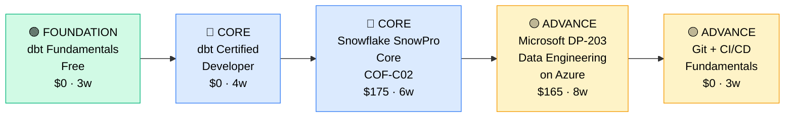

# How to Become an Analytics Engineer

**`CP43`** · **Data & AI** · _Time to hire: 12–18 months_ · _Entry cost: $900–$1,500 USD_

> **Path summary:** This path takes you from data analyst or analytics developer to a hired Analytics Engineer—the hybrid role combining data engineering, business intelligence, and software engineering disciplines. Build scalable analytics infrastructure using dbt, Snowflake, and modern data stacks, in 12–18 months.

---

## Role Overview

### What does an Analytics Engineer actually do?

An Analytics Engineer is a unicorn: part data engineer, part analytics, part software engineer. You build the bridge between raw data and analytical insights. Your day involves writing Python/SQL to optimize data pipelines; designing dbt projects that transform raw data into clean, modeled datasets; and ensuring your analytics infrastructure scales without breaking. Unlike data analysts who answer business questions, analytics engineers build the tools analysts use. Unlike data engineers who focus on scale and infrastructure, analytics engineers care about analytical use cases and business logic. You're writing code that's tested, documented, and version-controlled. Tools: dbt, Snowflake, Python, Git, Airflow, cloud platforms.

Analytics Engineers typically work on teams of 3–8 analytics engineers, often embedded with analytics and data engineering squads. The role is highly remote-friendly (80%+). You'll rarely be on-call, though monitoring dashboards and alerting on data quality issues matters. You collaborate closely with analysts (who consume your data models), data engineers (who build the raw data pipes), and product teams (who need analytics features). This is a technical role with strong communication requirements.

### Demand in 2026

- **Global job postings:** 12,000+ active Analytics Engineer roles on LinkedIn as of May 2026 [(source)](https://www.linkedin.com/jobs/search/?keywords=Analytics%20Engineer)
- **Growth rate:** 28% YoY / one of the fastest-growing data roles [(source)](https://www.linkedin.com/pulse/analytics-engineers-are-fastest-growing-data-role-2025/)
- **South Africa:** Strong but emerging demand. Financial services (Nedbank, ABSA), FinTech (Capitec, Luno, PayFast), and major retailers (Takealot, Shoprite) all hiring analytics engineers by 2025. Still a niche role but growing fast.
- **Remote availability:** 85% of roles are remote or hybrid. Most South African analytics engineers work for international companies.

---

## Who Is This Path For?

### Ideal starting backgrounds

| Background | Readiness | What you already have |
|---|---|---|
| Data Analyst | ✅ Strong start | SQL and analytics mindset; add engineering disciplines |
| Data Engineer | ✅ Strong start | Engineering practices; add analytics domain knowledge |
| BI Developer / Developer | ✅ Strong start | Software engineering; add SQL and analytics |
| Recent CS graduate | ✅ Strong start | Theory solid; needs 2–3 months data domain focus |
| Analytics Developer | ✅ Strong start | Analytics tools; level up with engineering practices |
| Complete career changer | 🟡 Possible | Need 4–6 months SQL and Python foundation first |

### You're ready to start this path if you can:
- Write intermediate SQL (JOINs, subqueries, window functions, CTEs)
- Understand data modeling concepts (facts, dimensions, slowly changing dimensions)
- Write Python scripts (functions, error handling, testing)
- Use Git (clone, commit, push, pull requests)
- Understand analytics domain (KPIs, business metrics, dashboarding)

> **Not ready yet?** Start with [Data Analyst path (CP42)](CP42_Data_Data_Analyst.md) or [Data Engineer Foundation (CP41 Stage 1–2)](CP41_Data_Data_Engineer.md) first.

---

## Certification Sequence

### Visual path

---

### Stage 1 — Foundation (Months 0–3)

**Goal:** Learn the analytics engineering paradigm: version control, testing, and documentation applied to analytics.

| Cert | Code | Cost (USD) | Study Time | Why it matters |
|---|---|---:|---:|---|
| dbt Fundamentals | — | $0 | 2–3 weeks | dbt is the de facto analytics engineering tool; free learning, high ROI |
| Git for Data Scientists (free) | — | $0 | 1–2 weeks | Version control and collaboration; non-negotiable for modern analytics |

**Stage 1 total:** $0 USD · R0 ZAR · 3–4 weeks

**Study approach:** Use the [dbt Learn platform](https://learn.getdbt.com/) (free, excellent, step-by-step). Complete the "dbt Fundamentals" course and build your first dbt project. For Git, use [Git for Data Scientists](https://www.datacamp.com/) or [Pro Git book](https://git-scm.com/book/en/v2) (free online). The goal here is understanding dbt philosophy: separate, test, and document data transformations.

**Lab requirement:** Create a dbt project from scratch using a sample dataset (Jaffle Shop is the official example). Build 5 models: 2 staging, 2 intermediate, 1 mart. Add tests and documentation to each. Push to GitHub. Spend 20 hours hands-on.

---

### Stage 2 — Core Specialisation (Months 3–12)

**Goal:** Anchor credentials in Snowflake and advanced dbt. Be hireable as an analytics engineer.

| Cert | Code | Cost (USD) | Study Time | Why it matters |
|---|---|---:|---:|---|
| dbt Certified Developer | — | $0 | 4–5 weeks | Industry standard; shows you can build production dbt projects |
| Snowflake SnowPro Core | `COF-C02` | $175 | 6–7 weeks | Snowflake dominates enterprise analytics; crucial data warehouse knowledge |

**Stage 2 total:** $175 USD · R3,150 ZAR · 8–10 months

**Study approach:** For dbt certification, complete [dbt Learn advanced modules](https://learn.getdbt.com/) and build a real-world project (take a Kaggle dataset, model it with dbt, add documentation and tests). For Snowflake, use [Snowflake University](https://university.snowflake.com/) (free) and [Udemy Snowflake course](https://www.udemy.com/course/snowflake-masterclass/) ($15 sale price). The SnowPro exam is practical—hands-on SQL and Snowflake features.

**Project milestone:** Refactor an existing analytics codebase into dbt (or build from scratch). Create a 5+ model dbt project. Add dbt tests (row counts, uniqueness, referential integrity). Set up dbt Cloud (free tier). Connect to Snowflake. Create a CI/CD workflow where PRs trigger dbt test runs. Document the entire project. This is your portfolio piece—it shows production readiness.

---

### Stage 3 — Advanced Specialisation (Months 10–18)

**Goal:** Expand beyond Snowflake to other cloud platforms and add data engineering depth.

| Cert | Code | Cost (USD) | Study Time | Why it matters |
|---|---|---:|---:|---|
| Microsoft DP-203 (Data Engineering on Azure) | `DP-203` | $165 | 8–10 weeks | Azure is heavily used by enterprises; adds platform flexibility |
| Git + CI/CD for Analytics (free) | — | $0 | 2–3 weeks | Production-level dbt deployments use CI/CD; critical for scaling |

**Stage 3 total:** $165 USD · R2,970 ZAR · 6–8 months

**Study approach:** For DP-203, use [Microsoft Learn DP-203 path](https://learn.microsoft.com/en-us/training/paths/data-engineer/) (free) and [ACloud.guru Azure course](https://acloud.guru/) ($35/mo). This cert teaches Synapse, data lakes, and pipelines—broadens your platform knowledge. For CI/CD, use [dbt + CI/CD docs](https://docs.getdbt.com/guides/orchestration/airflow-to-dbt-cloud/1-jaffle-shop-start) and practice with GitHub Actions.

> **Optional at hire time:** Many people land their first analytics engineer job after Stage 2 (dbt cert + Snowflake + portfolio) and learn Azure/CI/CD on the job. This is common and valid.

---

## Timeline & Cost Summary

| Stage | Certs | Duration | Cost (USD) | Cost (ZAR) |
|---|---|---|---:|---:|
| Stage 1 — Foundation | dbt Fundamentals, Git | Months 0–3 | $0 | R0 |
| Stage 2 — Core | dbt Certified, SnowPro Core | Months 3–12 | $175 | R3,150 |
| Stage 3 — Advanced | DP-203, CI/CD | Months 10–18 | $165 | R2,970 |
| **Total to hireable** | | **12–15 months** | **$340** | **R6,120** |

**Study hours required:** ~350–400 hours total (Stage 1–3). Assumes 12 hours/week = 15 months.

---

## Salary Progression

> All figures: median base salary, not including bonuses/equity. ZAR = USD × 18. Sources: Robert Half 2026, LinkedIn Salary, Levels.fyi.

| Experience Level | USD/year | ZAR/month | GBP/year | EUR/year | AUD/year |
|---|---:|---:|---:|---:|---:|
| Entry / Junior (0–2 yrs) | $80,000–$115,000 | R51,000–R74,000 | £62,000–£89,000 | €74,000–€106,000 | A$118,000–A$169,000 |
| Mid-level (2–5 yrs) | $115,000–$155,000 | R74,000–R99,000 | £89,000–€120,000 | €106,000–€145,000 | A$169,000–A$228,000 |
| Senior (5–8 yrs) | $155,000–$200,000 | R99,000–R128,000 | £120,000–€155,000 | €145,000–€188,000 | A$228,000–A$295,000 |
| Lead / Architect (8+ yrs) | $200,000–$260,000 | R128,000–R166,000 | £155,000–€202,000 | €188,000–€244,000 | A$295,000–A$383,000 |

**South Africa note:** Analytics Engineers are still a niche role in SA, but emerging demand is strong. Entry-level AE at Johannesburg FinTech (Capitec, Luno) earn R65,000–R90,000/month. Remote roles for international companies command R80,000–R130,000/month for entry-level, R120,000–R180,000/month for mid-level. The role pays significantly more than data analysts due to rarity and technical depth.

**Salary accelerators:** dbt expertise, Snowflake certification, Python proficiency, CI/CD pipeline experience, and cross-platform knowledge (Snowflake + Azure + AWS) all command 15–25% premiums.

---

## First Job Strategy

### Month 0–3: Build the Foundation

1. **Set up your dbt project** — Use [dbt Cloud free tier](https://www.getdbt.com/). Clone the [Jaffle Shop example](https://github.com/dbt-labs/jaffle_shop). Run it locally. Cost: $0.
2. **Learn dbt deeply** — Complete [dbt Learn](https://learn.getdbt.com/). Build 2–3 practice dbt projects.
3. **Master Git workflows** — Use [Pro Git book](https://git-scm.com/book/en/v2) and practice: cloning, branching, committing, pull requests.
4. **Join the community** — [Analytics Engineering Slack](https://www.analyticsengineering.club/), r/analytics, [dbt Community Slack](https://www.getdbt.com/community/).
5. **Document your learning** — GitHub: push your dbt projects and Git practice. LinkedIn: weekly posts about what you're learning.

### Month 3–6: Build Your Portfolio

- **Project 1: Retail Analytics dbt Project** — Download a retail dataset (Kaggle: e-commerce, store sales). Build a dbt project with 8+ models: staging (raw tables), intermediate (business logic), marts (analytics tables). Add 15+ tests. Document all. Estimated time: 20 hours.
- **Project 2: Snowflake-Hosted Mart** — Take your dbt project from Project 1. Create a Snowflake free trial account. Load your source data, run your dbt project against it. Create a clean analytics mart. Document the Snowflake setup. Estimated time: 8 hours.
- **Project 3: CI/CD Pipeline** — Set up GitHub Actions to run your dbt project tests on every PR. Configure dbt Cloud to deploy on merge. Document the workflow. Estimated time: 6 hours.

### Month 6–12: Apply and Iterate

- **CV positioning:** List as "Analytics Engineer" once you have dbt certification + Snowflake SnowPro + 2+ portfolio projects. Highlight dbt, Snowflake, SQL, Python.
- **Target companies:** FinTech and InsurTech startups (Capitec, Luno, PayFast, Hollard). Cloud-native companies (Takealot). Consulting firms (Deloitte, EY, BCX). Remote roles for international companies (major companies in UK/US hire SA engineers).
- **Interview prep:** Be ready to discuss 1) Your dbt project architecture and decisions, 2) Data modeling approaches (facts vs. dimensions), 3) dbt testing strategy, 4) How you optimize slow SQL, 5) Your Git workflow and CI/CD understanding.
- **Salary negotiation:** Analytics engineers are paid well due to rarity. Entry-level roles in SA offer R65k–R90k/month; remote international roles R85k–R130k/month. Negotiate. Highlight your dbt expertise and portfolio.

---

## A Day in the Life

### Analytics Engineer at Capitec (Johannesburg) — Junior Level

**08:00** — Arrive, check dbt Cloud. All overnight jobs succeeded. Green status across the board.

**08:30** — Standup with the analytics team. You're assigned a new task: model the new "early withdrawal" product feature for the data warehouse.

**09:00** — Design phase. Meet with the product team. Understand the business logic. Sketch an ERD: the fact table should track early withdrawal events; dimension tables for customers, accounts. Get approval.

**10:00** — Implement in dbt. Create staging models for the raw tables. Add transformation logic. Write tests: null checks, uniqueness on surrogate keys, referential integrity.

**11:30** — Code review with a senior analyst. Feedback: add a deduplication logic I missed, improve the variable naming, add a dbt macro for reusable logic. You revise.

**13:00** — Lunch.

**14:00** — Test runs pass. Merge your PR to main. dbt Cloud deploys automatically.

**14:30** — Chat with the analytics team. They immediately start using the new table for dashboards. A question: "Can you add a column for the withdrawal reason?" You scope the work—2 hours. Plan for next sprint.

**15:30** — Documentation work. Update the dbt project README. Add column descriptions to the new model. Publish updated docs.

**16:30** — Pair programming with a junior teammate. Help them understand dbt staging models and testing patterns. Teaching moment.

**17:00** — End of day. All systems green. End of day.

### Analytics Engineer at a London/Cape Town FinTech (Remote) — Mid Level

**09:00** — Async standup via Slack. You're leading the migration of legacy ETL scripts to dbt + Snowflake. Timeline: 8 weeks.

**09:30** — Code review session. Three PRs from the team. You check dbt model logic, test coverage, documentation. Approve two, request changes on one (missing FK tests).

**10:30** — Design session with the data engineering team. Discuss: should we use Snowflake's native pipeline or dbt Cloud + Airflow for orchestration? You present pros/cons. Decide: dbt Cloud + Airflow for flexibility.

**11:30** — Implement a macro for your team. Create a dbt macro for common transformations (null handling, type conversions). Test it. Push to repo.

**12:30** — Lunch (and async message to the UK team before they finish their day).

**13:30** — Troubleshooting. A downstream dashboard is showing odd data. You trace the issue to a slowly changing dimension (SCD) in your mart that has duplicates. Fix the dbt logic, add tests to prevent recurrence.

**15:00** — Documentation and knowledge sharing. Record a 10-minute video explaining the migration plan for new team members. Post on Slack.

**15:30** — Performance optimization. A Snowflake query is timing out. You refactor the dbt model, add clustering, materialize as table instead of view. Query time: 45 seconds → 3 seconds.

**16:30** — Mentor a junior engineer on dbt best practices. Code review their first dbt model. Positive feedback + constructive suggestions.

**17:30** — Wrap up. All systems running. End of day.

---

## Related Paths & Progressions

| From here you can move to… | Why |
|---|---|
| [Data Engineer (CP41)](CP41_Data_Data_Engineer.md) | Deepen infrastructure and ETL skills; move from analytics to data platforms |
| [Data Architect (CP44)](CP44_Data_Data_Architect.md) | After 5+ years, design entire data systems instead of just analytics layers |
| [BI Developer (CP48)](CP48_Data_BI_Developer.md) | Formalize your BI/visualization skills; move from data modeling to dashboards |
| [ML Engineer (CP45)](CP45_Data_ML_Engineer.md) | Add feature engineering and ML ops; apply your dbt skills to ML workflows |

---

## South Africa Context

### Market specifics

Analytics Engineer is an emerging role in South Africa, primarily in FinTech and tech-forward companies. Capitec, Luno, and PayFast are actively hiring. Takealot and Shoprite have modernized their analytics stacks and need AEs. Remote work is the norm for this role—most SA analytics engineers work for international companies in the UK, US, or Europe at 2–3x local salaries.

dbt is rapidly becoming the standard in the South African data community. The Analytics Engineering Slack community includes active South African members. Snowflake is the data warehouse of choice, though BigQuery and Redshift are also used.

The role is still niche, which means less competition but also fewer local hiring options. Remote-first job search is recommended. The combination of dbt expertise, Snowflake knowledge, and strong software engineering practices makes you globally competitive.

### SA-specific resources

| Resource | URL | Note |
|---|---|---|
| Analytics Engineering Slack (SA) | [analyticsengineering.club](https://www.analyticsengineering.club/) | Active community; South Africa members |
| dbt Learn (Free) | [learn.getdbt.com](https://learn.getdbt.com/) | Official dbt training, free |
| Capitec Careers | [capitec.co.za/careers](https://www.capitec.co.za/careers) | Growing analytics engineering team |
| Luno Careers | [luno.com/careers](https://www.luno.com/careers) | FinTech analytics roles |
| Johannesburg Tech Jobs | [linkedin.com/jobs](https://www.linkedin.com/jobs/search/?location=South%20Africa&keywords=Analytics%20Engineer) | Job board, 50+ postings |
| Snowflake University | [university.snowflake.com](https://university.snowflake.com/) | Free Snowflake training |

---

## Frequently Asked Questions

**Q: Do I need a degree to become an Analytics Engineer?**

No. Most analytics engineers come from data analyst or software engineering backgrounds, not formal degrees. What matters: dbt expertise, SQL, Python, and software engineering disciplines. Build a strong portfolio—certs + GitHub projects.

**Q: How long does it realistically take from zero?**

If you're a data analyst or developer already: 10–14 months. If starting from complete scratch: 18–24 months. This is not a beginner role—you need SQL, analytics, and/or engineering foundation first.

**Q: Which cert should I do first?**

dbt Fundamentals (free). It's the foundation of analytics engineering. Then dbt Certified Developer, then Snowflake SnowPro Core.

**Q: Can I do this path while working full-time?**

Yes, but it's intensive. 15 hours/week means Stage 1–2 takes 8–10 months. Many people upskill from analyst to AE while employed—this is ideal because you learn on real data.

**Q: Is the dbt cert worth pursuing?**

Yes. It's the anchor credential for analytics engineers. It's also free to sit (you pay only if you want a digital badge), so there's minimal risk. The certification shows you understand dbt best practices, testing, documentation, and production patterns.

**Q: What's the difference between Analytics Engineer and Data Engineer?**

Data Engineers build scalable pipes for petabyte-scale data. Analytics Engineers build the analytics layer—clean, tested, documented data for analysis. DEs care about infrastructure; AEs care about business logic and analyst experience. Both need SQL and engineering discipline but apply them differently.

---

## Sources & Further Reading

| # | Source | URL | Used for |
|---|---|---|---|
| 1 | LinkedIn Jobs (Analytics Engineer) | [linkedin.com/jobs](https://www.linkedin.com/jobs/search/?keywords=Analytics%20Engineer) | Job posting volume and trends |
| 2 | dbt Learn (Free Platform) | [learn.getdbt.com](https://learn.getdbt.com/) | Official dbt training and certification |
| 3 | Snowflake SnowPro Core | [snowflake.com/certification](https://www.snowflake.com/en/certification/) | Cert details and exam guide |
| 4 | Robert Half 2026 Salary Guide | [roberthalf.com](https://www.roberthalf.com/salary-guide) | Salary ranges and market data |
| 5 | Analytics Engineering Slack | [analyticsengineering.club](https://www.analyticsengineering.club/) | Community and learning |
| 6 | Snowflake University | [university.snowflake.com](https://university.snowflake.com/) | Free Snowflake training |
| 7 | Microsoft DP-203 Learning Path | [learn.microsoft.com](https://learn.microsoft.com/en-us/training/paths/data-engineer/) | Azure data engineering cert prep |
| 8 | Levels.fyi Analytics Engineer | [levels.fyi](https://www.levels.fyi/jobs/analytics-engineer) | Salary transparency |

---

*Template version: 2026-05-02 | Maintained by IT Career Roadmap | ZAR baseline: R18/$1 USD*
*File naming: Career_Paths/CP43_Data_Analytics_Engineer.md*
