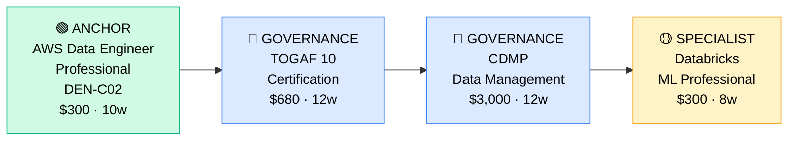

# How to Become a Data Architect

**`CP44`** · **Data & AI** · _This is a senior role_ · _Entry cost: $1,500–$2,200 USD (after foundational certs)_

> **Path summary:** This path is for senior data engineers (5+ years hands-on) who want to transition to design and strategy. As a Data Architect, you design entire data ecosystems: data lakes, warehouses, governance frameworks, and analytics platforms. You're no longer writing pipelines—you're deciding how they should work across the organization.

---

## Role Overview

### What does a Data Architect actually do?

A Data Architect designs data systems at the enterprise scale. You spend your days in meetings with stakeholders, drawing architecture diagrams, evaluating tools, and setting standards that the entire data team follows. A morning might involve designing a multi-cloud data strategy for a bank; an afternoon designing a data governance framework for compliance; an evening researching the latest data warehouse offerings. You're not coding pipelines anymore (though you might prototype designs in code). You're thinking about: How do we scale this to 10 petabytes? How do we ensure data quality across 20 teams? What's our disaster recovery strategy? Tools: Visio/Lucidchart, SQL, Python (optional), cloud platforms, Kubernetes, data governance platforms.

Data Architects work on teams of 1–3 architects in most organizations. You report to a Chief Data Officer or VP Engineering. The role is highly strategic and political—you need to convince teams to adopt your standards. Remote work is available but not as common as analyst roles; many architects are hybrid (meetings require presence). You're on-call for major incidents. You collaborate with CTOs, data engineers, analysts, and business stakeholders constantly. Communication and leadership matter as much as technical depth.

### Demand in 2026

- **Global job postings:** 8,000+ active Data Architect roles on LinkedIn as of May 2026 [(source)](https://www.linkedin.com/jobs/search/?keywords=Data%20Architect)
- **Growth rate:** 18% YoY / Strong demand in enterprises undergoing digital transformation [(source)](https://www.bls.gov/ooh/computer-and-information-technology/database-administrators-and-architects.htm)
- **South Africa:** Moderate demand. Nedbank, ABSA, Standard Bank, and Discovery all have Chief Data Officers and architects. Telcos (MTN, Vodacom) are investing in modern data platforms. Demand is lower than for engineers but roles pay significantly more.
- **Remote availability:** 40–50% of roles are remote; most are hybrid or onsite due to strategic nature.

---

## Who Is This Path For?

### Ideal starting backgrounds

| Background | Readiness | What you already have |
|---|---|---|
| Senior Data Engineer (5+ yrs) | ✅ Perfect start | Deep technical knowledge; add strategy and governance |
| Data Pipeline Lead / Principal | ✅ Perfect start | Team leadership; add architecture frameworks |
| Solutions Architect | ✅ Strong start | Design thinking; needs data domain expertise |
| Analytics Director | 🟡 Possible | Business context; needs deep technical knowledge |
| Senior DBA | 🟡 Possible | Database expertise; needs modern data stack knowledge |
| Cloud Architect | 🟡 Possible | Architecture mindset; needs data-specific depth |

### You're ready to start this path if you can:
- Design a data lake architecture from scratch
- Understand data governance, quality, security, and compliance at scale
- Lead technical decisions for teams (not just execute)
- Design multi-cloud or hybrid architectures
- Know data modeling, warehouse design, and ETL patterns deeply

> **This is a senior role.** You need 5–8 years of hands-on data engineering or related experience before pursuing architect credentials.

---

## Certification Sequence

### Visual path

---

### Stage 1 — Anchor Professional Cert (Months 0–3)

**Goal:** Prove expert-level data engineering knowledge before moving to architecture.

| Cert | Code | Cost (USD) | Study Time | Why it matters |
|---|---|---:|---:|---|
| AWS Certified Data Engineer Professional | `DEN-C02` | $300 | 10–12 weeks | Architect-level AWS knowledge; tests design patterns at scale |
| Databricks Data Engineer Professional | — | $300 | 8–10 weeks | Advanced Spark and data engineering patterns; shows expertise |

**Stage 1 total:** $600 USD · R10,800 ZAR · 10–12 weeks

**Study approach:** These are advanced certs. Use [Stephane Maarek's DEN-C02 course](https://www.udemy.com/course/aws-certified-data-engineer-professional-deep-dive/) ($20) paired with [Adrian Cantrill's course](https://learn.cantrill.io/) (premium but thorough). For Databricks, use [Databricks Academy](https://academy.databricks.com/) and build advanced Spark projects. Both exams require 3–5 years production experience and test design patterns, cost optimization, governance, and security at scale.

**Lab requirement:** Design and document a data architecture for a hypothetical enterprise scenario (e.g., "Design a multi-region data lake for a bank processing 100TB/day across 30 countries"). Include data flow, security, governance, disaster recovery. Use AWS or Databricks. This is your starting portfolio.

---

### Stage 2 — Governance & Enterprise Architecture (Months 3–15)

**Goal:** Learn enterprise architecture frameworks and data governance standards that architects must master.

| Cert | Code | Cost (USD) | Study Time | Why it matters |
|---|---|---:|---:|---|
| TOGAF 10 Certification (Level 2) | — | $680 | 12–14 weeks | Enterprise architecture framework; 70%+ of architects hold TOGAF |
| CDMP (Certified Data Management Professional) | — | $3,000 | 12–16 weeks | Comprehensive data governance, quality, security; DAMA gold standard |

**Stage 2 total:** $3,680 USD · R66,240 ZAR · 12–14 months

**Study approach:** TOGAF is designed for architects and teaches EA frameworks (ADM—Architecture Development Method). Use [TOGAF training courses](https://www.togaf.info/) (official) or [Udemy TOGAF course](https://www.udemy.com/course/togaf-9-complete-course/) ($20). The exam tests your ability to apply architectural thinking to real scenarios. CDMP is the governance standard—use [DAMA-DMBOK](https://www.dama.org/dmbok) (the book) and [CDMP training providers](https://www.dama.org/training). CDMP is rigorous and expensive but essential for architects designing governance.

**Project milestone:** Design a complete data governance framework for a hypothetical organization. Include: data quality standards, metadata management, security policies, data lineage approach, compliance (GDPR, POPIA), and ethics guidelines. Document in a 20+ page architecture document. Present to peers for feedback. This shows you can think like an architect.

---

### Stage 3 — Specialized Knowledge (Months 12–24)

**Goal:** Deepen in specialized areas (cloud platforms, machine learning infrastructure, etc.).

| Cert | Code | Cost (USD) | Study Time | Why it matters |
|---|---|---:|---:|---|
| Microsoft Azure Data & Analytics Architect | `DP-203` / `DP-500` | $330 | 10–12 weeks | Multi-cloud knowledge; many enterprises use Azure |
| Google Cloud Professional Data Engineer | — | $200 | 8–10 weeks | GCP knowledge; differentiates you in cloud-agnostic roles |

**Stage 3 total:** $530 USD · R9,540 ZAR · 10–12 months

> These specialized certs are optional at hire time but strengthen your resume. Many architects pursue them after 2–3 years in the role.

---

## Timeline & Cost Summary

| Stage | Certs | Duration | Cost (USD) | Cost (ZAR) |
|---|---|---|---:|---:|
| Stage 1 — Anchor | DEN-C02, Databricks Pro | Months 0–3 | $600 | R10,800 |
| Stage 2 — Governance | TOGAF, CDMP | Months 3–15 | $3,680 | R66,240 |
| Stage 3 — Specialist | Azure/GCP Architects | Months 12–24 | $530 | R9,540 |
| **Total to senior role** | | **12–18 months** | **$4,810** | **R86,580** |

**Study hours required:** ~400–500 hours. This is a part-time pursuit while working full-time as a senior engineer.

---

## Salary Progression

> All figures: median base salary, not including bonuses/equity. ZAR = USD × 18. Sources: Robert Half 2026, Glassdoor, PayScale, Levels.fyi.

| Experience Level | USD/year | ZAR/month | GBP/year | EUR/year | AUD/year |
|---|---:|---:|---:|---:|---:|
| Senior Engineer (5–8 yrs) | $120,000–$160,000 | R77,000–R102,000 | £93,000–€124,000 | €112,000–€150,000 | A$175,000–A$235,000 |
| Data Architect (8–12 yrs) | $160,000–$210,000 | R102,000–R134,000 | €124,000–€162,000 | €150,000–€197,000 | A$235,000–A$309,000 |
| Principal Architect (12+ yrs) | $210,000–$280,000 | R134,000–R179,000 | €162,000–€216,000 | €197,000–€264,000 | A$309,000–A$412,000 |
| Chief Data Officer (CDO track) | $250,000–$400,000+ | R179,000–R256,000+ | €216,000–€360,000+ | €264,000–€480,000+ | A$412,000–A$588,000+ |

**South Africa note:** Senior Data Engineers at major banks (Nedbank, ABSA, Standard Bank) earn R100,000–R145,000/month (R1.2M–R1.74M/year). Data Architects at these same banks earn R120,000–R180,000/month (R1.44M–R2.16M/year). Remote architect roles for international companies: R140,000–R220,000/month. Principal architects at Discovery or large consulting firms: R160,000–R250,000/month. CDO roles at major enterprises exceed R200,000/month.

**Salary accelerators:** TOGAF and CDMP certifications, multi-cloud expertise, governance and compliance knowledge, and proven team leadership all command 15–30% premiums. CDO track adds 40%+ over architect baseline.

---

## First Job Strategy

### Month 0–6: Build Your Theoretical Foundation

1. **Pursue DEN-C02 or DP-203** — If AWS-focused company, DEN-C02. If Azure/multi-cloud, DP-203. Invest 3 months.
2. **Dive into TOGAF** — Start the TOGAF 10 Part 1 course. This teaches architectural thinking systematically. 4–6 months.
3. **Read architecture books** — "Building Evolutionary Architectures" by Ford & Parsons, "Fundamentals of Data Engineering" by Reis & Housley. These shape your thinking.
4. **Lead architecture discussions** — At your current job, start influencing architecture decisions. Propose data lake designs, governance frameworks. Get visibility.

### Month 6–12: Build Your Portfolio

- **Project 1: Multi-Cloud Data Strategy** — Design a data architecture for a company operating in 3 clouds (AWS, Azure, GCP). Document: data flows, governance, security, cost optimization, disaster recovery. Create 10+ architecture diagrams. Estimated time: 30 hours.
- **Project 2: Data Governance Framework** — Design a governance framework for a hypothetical organization (or your current employer, anonymized). Include: data quality standards, metadata management, compliance, ethics, security policies. 20+ page document. Estimated time: 20 hours.
- **Project 3: Disaster Recovery & BCDR Plan** — Design a business continuity and disaster recovery (BCDR) plan for a data platform processing mission-critical data. Include RTO/RPO targets, failover mechanisms, testing. Estimated time: 15 hours.

### Month 12–18: Pursue Formal Credentials

- **TOGAF Certification** — Complete the course, sit the exam. This is the architect's credential.
- **CDMP Certification** — If governance is your specialty, pursue this. It's a significant investment (time and money) but essential for governance-focused architects.
- **Internal promotion** — By now, position yourself for an architect or principal engineer role at your company. Use your portfolio and certs as evidence of readiness.

---

## A Day in the Life

### Data Architect at Nedbank (Johannesburg) — 8 Years Experience

**08:00** — Arrive. Attend the Data Strategy steering committee meeting (quarterly). Present a multi-cloud strategy proposal: move some workloads from on-premises to AWS, others to Azure for regulatory isolation. Costs, risks, timeline. The executive team debates; you answer technical questions.

**10:00** — One-on-one with the Principal Data Engineer. Review her design for a new real-time fraud detection pipeline. Feedback: the architecture looks sound, but scaling to 10k events/sec might be tight. Suggest adding a message queue (Kafka) instead of direct integration. She revises the design.

**11:00** — Meet with the Data Governance Office. They're designing a data lineage system. You advise on tools (Collibra, Alation, open-source OpenMetadata). Discuss integration with dbt and Snowflake.

**12:00** — Lunch.

**13:00** — Whiteboarding session with your data engineering team. Design a new data lake for customer analytics. Draw the architecture: raw zone, cleansed zone, analytics zone. Discuss data retention, tiering, security. Get the team's input before finalizing.

**14:30** — Review a vendor proposal. A startup is pitching a data catalog tool. Evaluate: Does it fit our GDPR/POPIA governance needs? Cost/benefit? Integration with our stack? Make a recommendation.

**15:30** — Work on your TOGAF Part 2 study. You're preparing for the Level 2 exam. Review the ADM (Architecture Development Method) framework.

**16:30** — Document a new data architecture standard for the organization. This becomes a reference for all new data initiatives. 10 pages. Post on the internal wiki.

**17:00** — End of day. Plan for tomorrow: data security architecture review for a critical new project.

### Data Architect at a London Fintech (Remote/Cape Town) — 10 Years Experience

**08:00** — Async standup. You're reviewing a proposal from a remote team in Singapore: they want to build a new real-time payments analytics platform. You've already reviewed the initial architecture doc; today you have a live call with them.

**10:00** — Sync meeting with Singapore team. Live architecture review. They've proposed a Kafka-Flink-ClickHouse stack. You push back: "Have you considered Kafka-Spark streaming? We already have Spark expertise." Discussion, whiteboarding, consensus: hybrid approach—Kafka for ingestion, Flink for real-time, ClickHouse for OLAP queries.

**11:30** — Document the decision in a Architecture Decision Record (ADR). Store in the company's ADR repository. This becomes a reference for future teams.

**12:00** — Lunch.

**13:00** — Talk to the UK-based CEO. She's concerned about data costs. Show her a cost analysis: the current multi-cloud strategy is spending $8M/year, but optimization could cut 25%. Propose a cost optimization initiative (Reserved Instances, Spot, data tiering).

**14:30** — Work on your CDMP coursework. Read the DAMA-DMBOK chapter on data governance. Apply learnings to your organization's governance policies.

**15:30** — Code review (architect does this too). Review a dbt project from the analytics team. The model structure is good, but they're missing some data quality tests. Suggest additions.

**16:30** — Work on documentation. Update the company's architecture standards wiki with the new decision. Ensure all teams can reference it.

**17:30** — End of day. Send async notes to the team. Tomorrow: data security architecture review with the Chief Information Security Officer.

---

## Related Paths & Progressions

| From here you can move to… | Why |
|---|---|
| Chief Data Officer (CDO) | After architect experience, step into strategic CDO role managing data strategy, teams, and roadmap |
| Chief Technology Officer (CTO) | Data architecture is excellent foundation for broader CTO role |
| Consulting Partner | Use architect expertise to advise enterprises on data strategy |
| Board-level Advisor | Many architects eventually advise startups and enterprises on data strategy |

---

## South Africa Context

### Market specifics

Data Architects are a niche, highly valued role in South Africa. Nedbank, ABSA, Standard Bank, and FNB all have Chief Data Officers and architect teams designing modern data platforms. Discovery and Sanlam are building advanced analytics infrastructure. MTN and Vodacom are upgrading data stacks post-2024. Government entities (SARS, Eskom, Department of Health) are investing in data modernization but move slowly.

The role requires both deep technical knowledge and strategic thinking. Most South African architects report to CDOs and are heavily involved in board-level data strategy decisions. Remote work is increasing but less common than for engineers—many architects are hybrid or onsite for leadership visibility. International opportunities are substantial—many UK/US companies hire South African architects at significantly higher salaries (£120k–£200k+ = R2.16M–R3.6M+/year).

BEE/EE is relevant. Architects have high visibility and leadership positions. Achieving architect level as a previously disadvantaged individual is rewarded in many organizations.

### SA-specific resources

| Resource | URL | Note |
|---|---|---|
| Nedbank Careers (Architects) | [nedbank.co.za/careers](https://www.nedbank.co.za/careers) | Regular architect postings |
| ABSA Careers | [absa.co.za/careers](https://www.absa.co.za/careers) | Major data initiatives |
| Data Architecture Meetup (JNB) | [meetup.com/johannesburg-data-architecture](https://www.meetup.com/johannesburg-data-architecture/) | Networking, monthly |
| TOGAF Training Providers (SA) | [togaf.info](https://www.togaf.info/) | Find local TOGAF instructors |
| Deloitte Consulting (SA) | [deloitte.com/za](https://www.deloitte.com/za/) | Architecture consulting roles |
| Discovery Group | [discovery.co.za/careers](https://www.discovery.co.za/careers) | Growing data engineering team |

---

## Frequently Asked Questions

**Q: Do I need a degree to become a Data Architect?**

A degree helps but isn't required. You need 5–8 years of hands-on data engineering. A strong portfolio beats a degree at this level. However, many architects do hold CS or engineering degrees.

**Q: What's the difference between Data Architect and Solutions Architect?**

Solutions Architects design customer-facing solutions; Data Architects design internal data platforms. Both require architecture thinking but apply it differently. Data Architect is more specialized and technical.

**Q: When should I pursue TOGAF?**

After 5+ years as a senior engineer. TOGAF teaches architectural frameworks and thinking—don't rush it. It's most valuable once you have deep domain experience to apply it to.

**Q: Is CDMP worth the time and money?**

Yes, if governance is your passion. It's the gold standard for data governance and data management professionals. It's expensive and time-consuming but globally recognized. If you're architecture-focused rather than governance-focused, it's optional.

**Q: Can I become an architect without a senior engineering background?**

Unlikely. Architecture requires deep knowledge of what actually works. You need years of hands-on to earn the credibility to design systems. The path is: engineer → senior engineer → architect, not jump from analyst to architect.

**Q: What's the CDO track?**

Chief Data Officer. Some architects move into strategic CDO roles managing data strategy, teams, and board-level decisions. This requires 8–12 years of architect experience plus business acumen.

---

## Sources & Further Reading

| # | Source | URL | Used for |
|---|---|---|---|
| 1 | LinkedIn Jobs (Data Architect) | [linkedin.com/jobs](https://www.linkedin.com/jobs/search/?keywords=Data%20Architect) | Job market data |
| 2 | AWS DEN-C02 Exam Guide | [aws.amazon.com/certification](https://aws.amazon.com/certification/certified-data-engineer-professional/) | Architect-level AWS exam |
| 3 | TOGAF 10 Certification | [togaf.info](https://www.togaf.info/) | Enterprise architecture framework |
| 4 | DAMA-DMBOK (Data Governance) | [dama.org](https://www.dama.org/dmbok) | Data governance standards |
| 5 | Robert Half 2026 Salary Guide | [roberthalf.com](https://www.roberthalf.com/salary-guide) | Salary benchmarks |
| 6 | Fundamentals of Data Engineering | [fundamentalsofdataengineering.com](https://www.fundamentalsofdataengineering.com/) | Architecture patterns book |
| 7 | Databricks Data Engineer Professional | [databricks.com/certification](https://www.databricks.com/learn/certification) | Advanced Spark/Databricks |
| 8 | Levels.fyi Data Architect | [levels.fyi](https://www.levels.fyi/jobs/data-architect) | Salary transparency |

---

*Template version: 2026-05-02 | Maintained by IT Career Roadmap | ZAR baseline: R18/$1 USD*
*File naming: Career_Paths/CP44_Data_Data_Architect.md*
