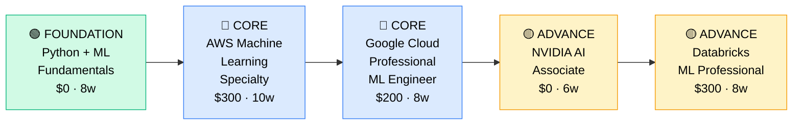

# How to Become a Machine Learning Engineer

**`CP45`** · **Data & AI** · _Time to hire: 24–36 months_ · _Entry cost: $1,500–$2,200 USD_

> **Path summary:** This path takes you from data engineer, software engineer, or data scientist to a hired Machine Learning Engineer building production ML systems. You'll learn model training, feature engineering, ML ops, deployment, and monitoring—turning research into business value, in 24–36 months.

---

## Role Overview

### What does an ML Engineer actually do?

An ML Engineer owns the full ML lifecycle: from problem definition through model training, evaluation, deployment, and monitoring in production. Your day might involve collaborating with data scientists on a new recommendation model, writing Python to engineer features from raw data, deploying that model using MLflow and Docker, setting up monitoring to catch model drift, and debugging why accuracy dropped after a data pipeline change. You're balancing research (model performance) with engineering (scalability, reliability, cost). Tools: Python (scikit-learn, TensorFlow, PyTorch), SQL, Git, Docker, Kubernetes, MLflow, cloud platforms (AWS/GCP/Azure), Airflow.

ML Engineers work on teams of 2–10, often embedded with data science teams. The role is remote-friendly (65%+). You may be on-call for production incidents—models that break are serious. You collaborate with data scientists (who design models), data engineers (who build pipelines), and product teams (who use predictions). This is a technical role requiring deep Python and systems thinking.

### Demand in 2026

- **Global job postings:** 18,000+ active ML Engineer roles on LinkedIn as of May 2026 [(source)](https://www.linkedin.com/jobs/search/?keywords=Machine%20Learning%20Engineer)
- **Growth rate:** 32% YoY / Fastest-growing data role [(source)](https://www.bls.gov/ooh/computer-and-information-technology/)
- **South Africa:** Emerging demand. Nedbank, Standard Bank, Capitec are building ML models for fraud detection and credit risk. Takealot and Shoprite using ML for recommendations. Still less mature than UK/US but growing.
- **Remote availability:** 72% of global roles are remote/hybrid. South African engineers often work for international AI companies.

---

## Who Is This Path For?

### Ideal starting backgrounds

| Background | Readiness | What you already have |
|---|---|---|
| Data Engineer | ✅ Strong start | Data fundamentals, pipelines; add ML/Python depth |
| Software Engineer | ✅ Strong start | Engineering practices, systems thinking; add ML/Python |
| Data Scientist | ✅ Strong start | ML knowledge, statistics; add engineering discipline |
| Recent CS/Math graduate | 🟡 Good with gaps | Theory solid; needs 1–2 years experience first |
| Data Analyst | 🟡 Possible | Analytics mindset; needs significant Python/ML ramp-up |
| Complete career changer | 🟡 Possible | Need 6–12 months Python + ML foundation first |

### You're ready to start this path if you can:
- Write production Python (classes, testing, error handling, logging)
- Understand ML fundamentals (supervised vs. unsupervised, overfitting, cross-validation)
- Build and evaluate simple ML models (scikit-learn, basic neural networks)
- Query databases with SQL
- Use Git and understand CI/CD basics

> **Not ready yet?** Start with [ML Foundations](https://www.coursera.org/professional-certificates/machine-learning-engineering-for-production-mle) or [Data Engineer path (CP41)](CP41_Data_Data_Engineer.md) first.

---

## Certification Sequence

### Visual path

---

### Stage 1 — Foundation (Months 0–4)

**Goal:** Master ML fundamentals in Python. This is non-negotiable before moving to production systems.

| Cert | Code | Cost (USD) | Study Time | Why it matters |
|---|---|---:|---:|---|
| ML Fundamentals (Andrew Ng's ML course) | — | $0–$40 | 6–8 weeks | Gold standard for ML basics; teaches the right mental models |
| Python for Data Science (DataCamp/Coursera) | — | $0–$40 | 4–6 weeks | Production-grade Python; essential for ML engineering |

**Stage 1 total:** $40 USD · R720 ZAR · 4–6 months

**Study approach:** Use [Andrew Ng's ML course on Coursera](https://www.coursera.org/learn/machine-learning) (free to audit) or [Stanford's CS229](https://cs229.stanford.edu/) (free online). This teaches the fundamentals: supervised learning, neural networks, debugging ML systems—the mental models you'll use forever. Pair with hands-on: [Fast.ai's Practical Deep Learning](https://www.fast.ai/) (free, code-first) or [Kaggle Learn](https://www.kaggle.com/learn) (free, interactive).

**Lab requirement:** Build 5 end-to-end ML projects using scikit-learn and Pandas. Each should include: data loading, exploration, feature engineering, model training, evaluation, and error analysis. Post to GitHub. Track 50+ hours hands-on.

---

### Stage 2 — Core Specialisation (Months 4–18)

**Goal:** Get AWS and GCP ML certifications. Prove you can build production ML systems on cloud platforms.

| Cert | Code | Cost (USD) | Study Time | Why it matters |
|---|---|---:|---:|---|
| AWS Certified Machine Learning Specialty | `MLS-C01` | $300 | 10–12 weeks | Most employers use AWS for ML; this cert proves SageMaker expertise |
| Google Cloud Professional ML Engineer | — | $200 | 8–10 weeks | GCP's ML/AI tools; differentiates you, strong on Vertex AI |

**Stage 2 total:** $500 USD · R9,000 ZAR · 10–12 months

**Study approach:** For AWS MLS-C01, use [Stephane Maarek's course](https://www.udemy.com/course/aws-machine-learning/) ($20) paired with [TutorialsDojo practice exams](https://tutorialsdojo.com/). The exam covers SageMaker (training, hosting, pipelines), data prep, and ML ops. For GCP, use [Google Cloud Training](https://cloud.google.com/training) (free) and [Udemy GCP ML course](https://www.udemy.com/course/gcp-machine-learning-engineer/) ($20). Hands-on labs are critical—use AWS Free Tier and GCP free credits heavily.

**Project milestone:** Build and deploy an end-to-end ML system on AWS SageMaker (or GCP Vertex AI). Include: data pipeline, feature engineering, model training with hyperparameter tuning, evaluation, and REST API deployment. Set up monitoring to detect model drift. Document in GitHub. This is your production ML portfolio piece.

---

### Stage 3 — Advanced Specialisation (Months 12–24)

**Goal:** Deepen ML ops and specialization (neural networks, Databricks, etc.).

| Cert | Code | Cost (USD) | Study Time | Why it matters |
|---|---|---:|---:|---|
| NVIDIA AI Associate | — | $0 | 5–7 weeks | GPU computing for ML; NVIDIA tools increasingly used |
| Databricks Certified ML Professional | — | $300 | 8–10 weeks | Large-scale ML on Spark; production patterns |
| MLOps Fundamentals | — | $0–$40 | 4–6 weeks | Model monitoring, deployment, retraining; increasingly critical |

**Stage 3 total:** $340 USD · R6,120 ZAR · 8–10 months

**Study approach:** NVIDIA AI Associate is free—use [NVIDIA Deep Learning Institute](https://www.nvidia.com/en-us/training/) courses. For Databricks ML, use [Databricks Academy](https://academy.databricks.com/). For MLOps, use [MLOps.community](https://mlops.community/) (free resources) or [Udemy MLOps course](https://www.udemy.com/course/machine-learning-ops-mlops-pipeline-with-python/) ($20).

> **Optional at hire time:** Many ML engineers land jobs after Stage 2 (AWS + GCP certs + portfolio) and deepen in MLOps/specialized areas on the job.

---

## Timeline & Cost Summary

| Stage | Certs | Duration | Cost (USD) | Cost (ZAR) |
|---|---|---|---:|---:|
| Stage 1 — Foundation | ML Basics + Python | Months 0–4 | $40 | R720 |
| Stage 2 — Core | AWS MLS-C01, GCP ML Engineer | Months 4–18 | $500 | R9,000 |
| Stage 3 — Advanced | NVIDIA, Databricks ML, MLOps | Months 12–24 | $340 | R6,120 |
| **Total to hireable** | | **24–30 months** | **$880** | **R15,840** |

**Study hours required:** ~500–600 hours total. Assumes 12–15 hours/week = 30 months. This path is intense; many combine study with full-time work.

---

## Salary Progression

> All figures: median base salary, not including bonuses/equity. ZAR = USD × 18. Sources: Robert Half 2026, Levels.fyi, LinkedIn Salary.

| Experience Level | USD/year | ZAR/month | GBP/year | EUR/year | AUD/year |
|---|---:|---:|---:|---:|---:|
| Entry / Junior (0–2 yrs) | $100,000–$145,000 | R64,000–R93,000 | £77,000–€112,000 | €93,000–€134,000 | A$147,000–A$213,000 |
| Mid-level (2–5 yrs) | $145,000–$195,000 | R93,000–R124,000 | €112,000–€151,000 | €134,000–€183,000 | A$213,000–A$287,000 |
| Senior (5–8 yrs) | $195,000–$260,000 | R124,000–R166,000 | £151,000–€202,000 | €183,000–€244,000 | A$287,000–A$383,000 |
| Lead / Principal (8+ yrs) | $260,000–$350,000+ | R166,000–R224,000+ | €202,000–€272,000+ | €244,000–€328,000+ | A$383,000–A$515,000+ |

**South Africa note:** ML Engineers are rare in SA; most work remotely for international companies. Entry-level remote roles: R80,000–R120,000/month. Mid-level: R130,000–R180,000/month. Senior: R160,000–R250,000/month. Johannesburg-based roles at banks/FinTech: R70,000–R100,000/month for entry (lower than remote). Remote is strongly recommended for SA ML engineers.

**Salary accelerators:** AWS + GCP certs, Databricks expertise, Python proficiency, MLOps knowledge, and GPU/deep learning experience all command 15–25% premiums.

---

## First Job Strategy

### Month 0–6: Build the ML Foundation

1. **Take Andrew Ng's ML course** — [Coursera ML course](https://www.coursera.org/learn/machine-learning) or [CS229](https://cs229.stanford.edu/). This is the reference. 6–8 weeks.
2. **Master Python for ML** — [Fast.ai](https://www.fast.ai/) or [Kaggle Learn](https://www.kaggle.com/learn). Code-first, practical approach.
3. **Build 5 ML projects** — Use scikit-learn and Pandas. Regression, classification, clustering. Post to GitHub. 30+ hours hands-on.
4. **Join communities** — r/MachineLearning, [MLOps.community Slack](https://mlops.community/), local ML meetups.
5. **Contribute to open source** — Find ML libraries on GitHub (scikit-learn, XGBoost, Hugging Face). Contribute small features or bug fixes. Builds credibility.

### Month 6–12: Build Your ML Engineering Portfolio

- **Project 1: End-to-End Classification Pipeline** — Build a Titanic/Iris prediction system. Include: data exploration, feature engineering, model training (try 5+ algorithms), hyperparameter tuning, cross-validation, evaluation. Estimated time: 15 hours.
- **Project 2: Cloud ML Deployment** — Take Project 1, deploy to AWS SageMaker or GCP Vertex AI. Create a REST API. Set up monitoring for predictions. Estimated time: 12 hours.
- **Project 3: NLP or Time Series** — Pick a domain (sentiment analysis, stock prediction, etc.). Build an end-to-end ML system. Include feature engineering, model training, deployment. Estimated time: 20 hours.

### Month 12–24: Pursue Certifications & Apply

- **AWS MLS-C01:** Prepare 4–6 months. Use [Stephane Maarek's course](https://www.udemy.com/course/aws-machine-learning/) + hands-on labs.
- **GCP ML Engineer:** Prepare 3–4 months. Use [Google Cloud training](https://cloud.google.com/training).
- **CV positioning:** List as "ML Engineer" once you hold AWS MLS-C01. Highlight Python, cloud platforms, and portfolio projects.
- **Target companies:** Tech companies, FinTech, InsurTech, E-commerce (Takealot), analytics platforms. Remote/international roles highly available.
- **Interview prep:** Be ready to discuss 1) Your ML projects end-to-end, 2) Feature engineering approaches, 3) Model evaluation metrics, 4) Hyperparameter tuning, 5) Debugging ML systems, 6) ML ops/monitoring.

---

## A Day in the Life

### ML Engineer at Capitec (Johannesburg) — Junior Level

**08:00** — Standup with the ML team. You're working on a credit risk model. Data scientist trained a new XGBoost model; you're responsible for deploying it.

**09:00** — Review the model artifact. Check evaluation metrics, feature importance, and potential bias. Metrics look good. Write a deployment plan: test in staging, set up monitoring for prediction latency and distribution drift.

**10:00** — Set up a Docker container for model serving. Use Flask to wrap the model. Add logging and error handling. Test locally with sample data.

**11:30** — Deploy to AWS SageMaker endpoint. Set up CloudWatch monitoring. Configure alarms for model inference latency and error rates.

**13:00** — Lunch.

**14:00** — Work on feature engineering. The fraud detection team wants a new feature: "days since account creation." Write Python code to engineer this from raw data. Add it to the feature store.

**15:00** — Code review with a senior engineer. Feedback: add more logging, handle edge cases (accounts with missing creation dates), and add unit tests. You revise.

**16:00** — Help a data scientist debug a training issue. The model performance dropped after retraining. Investigate: the data distribution changed. Discuss potential causes and retraining strategy.

**17:00** — End of day. All systems green. Push code to GitHub. Plan tomorrow: start on GCP ML certification.

### ML Engineer at a London AI startup (Remote/Cape Town) — Mid Level

**09:00** — Async standup. You're leading the MLOps initiative—setting up CI/CD for ML models, automated retraining, and monitoring.

**09:30** — Code review. The data science team trained a new recommendation model. You check the model artifact, evaluation, and training pipeline code. Good, but missing automated retraining triggers. Suggest using MLflow + Airflow.

**10:30** — Meet with the data scientist who trained the model. Design the monitoring strategy: model accuracy on holdout test, prediction distribution monitoring, inference latency. Document in a design doc.

**11:30** — Implement model monitoring. Use Evidently AI (open source) to track prediction drift. Set up alerts if drift exceeds 5%.

**12:30** — Lunch.

**13:30** — Set up automated retraining pipeline using Airflow. Model retrains weekly on new data if drift is detected. Include validation: new model must beat production baseline before deployment.

**15:00** — Document the entire MLOps architecture. Create a runbook for the team. Include: how to deploy new models, monitor for drift, rollback if needed.

**16:00** — Pair programming with a junior ML engineer. They're learning to set up model serving. Review their Docker config, help optimize for latency.

**17:00** — Respond to a production incident. A model's inference latency spiked. Investigate: the input feature distribution changed unexpectedly. Increase model endpoint capacity. Post-mortem scheduled for tomorrow.

**17:30** — End of day. Start on Databricks ML certification tomorrow.

---

## Related Paths & Progressions

| From here you can move to… | Why |
|---|---|
| [Data Engineer (CP41)](CP41_Data_Data_Engineer.md) | Deepen data infrastructure; build pipelines at scale |
| [AI Engineer (CP46)](CP46_Data_AI_Engineer.md) | Pivot to LLMs and generative AI; hot new specialization |
| [Data Scientist (CP47)](CP47_Data_Data_Scientist.md) | Move toward research and model design rather than production engineering |
| [ML Architect / Principal ML Engineer] | After 5+ years, design ML systems and strategies |

---

## South Africa Context

### Market specifics

ML Engineers are a niche but rapidly growing role in South Africa. Nedbank, Standard Bank, and Capitec all have ML teams for fraud detection, credit risk, and customer analytics. Takealot uses ML for recommendations and supply chain optimization. FinTech companies (Luno, PayFast) are hiring ML engineers for risk and compliance.

Most South African ML engineers work remotely for UK/US companies at significantly higher salaries (£60k–£100k+ = R1.08M–R1.8M+/year vs. R840k–R1.2M locally). The skillset is globally valuable, and remote-first job search is strongly recommended.

ML engineering is still less established in SA than data engineering or analytics, so demand is lower but roles are high-paying and growth is fast. Government and large enterprises (Eskom, Transnet) are beginning to invest in ML but move slowly.

### SA-specific resources

| Resource | URL | Note |
|---|---|---|
| Johannesburg ML Engineers Meetup | [meetup.com/johannesburg-ml](https://www.meetup.com/johannesburg-machine-learning/) | Monthly meetups, networking |
| Capitec Careers (ML/AI) | [capitec.co.za/careers](https://www.capitec.co.za/careers) | Active ML hiring |
| Luno Careers | [luno.com/careers](https://www.luno.com/careers) | FinTech ML roles |
| Takealot Careers (ML) | [takealot.com/careers](https://www.takealot.com/careers) | E-commerce ML jobs |
| AWS South Africa Community | [aws.amazon.com/developer/community](https://aws.amazon.com/developer/community/) | User groups, events |
| Kaggle Competitions | [kaggle.com/competitions](https://www.kaggle.com/competitions) | Portfolio building |
| LinkedIn ML Engineer Jobs (SA) | [linkedin.com/jobs](https://www.linkedin.com/jobs/search/?location=South%20Africa&keywords=Machine%20Learning%20Engineer) | Job board, 30+ postings |

---

## Frequently Asked Questions

**Q: Do I need a PhD to become an ML Engineer?**

No. Most ML engineers have a bachelor's degree (CS, math, physics) or are self-taught. A PhD is not required. Hands-on experience and certs matter more.

**Q: Should I start with ML or data engineering?**

Either. Data engineer path is broader; ML engineer is specialized. If unsure, start with data engineering (CP41), then pivot to ML. Or start with ML fundamentals (Andrew Ng's course) to test fit.

**Q: How long does it really take from zero?**

24–36 months if starting with no data/ML background. If you're a software engineer already, 18–24 months. If you're a data scientist, 12–18 months. This is not a fast path—expect significant study and project work.

**Q: Is AWS MLS-C01 worth it for this role?**

Yes. 70%+ of job postings mention AWS for ML. The MLS-C01 exam is tough but proves you understand SageMaker and cloud ML systems. Essential credential.

**Q: What's the difference between ML Engineer and Data Scientist?**

Data Scientists focus on model design, experimentation, and research. ML Engineers focus on production—deployment, monitoring, scalability. Both need ML knowledge but apply it differently. ML Engineer = software engineer + ML. Data Scientist = researcher + statistics.

**Q: Can I do this path while working full-time?**

Yes, but it's challenging. Expect 15–20 hours/week of study + projects. Most people combine working as a software engineer or data engineer with ML study, then transition to ML engineer role.

---

## Sources & Further Reading

| # | Source | URL | Used for |
|---|---|---|---|
| 1 | LinkedIn Jobs (ML Engineer) | [linkedin.com/jobs](https://www.linkedin.com/jobs/search/?keywords=Machine%20Learning%20Engineer) | Job market trends |
| 2 | AWS ML Specialty Exam | [aws.amazon.com/certification](https://aws.amazon.com/certification/certified-machine-learning-specialty/) | Cert details and exam guide |
| 3 | Andrew Ng ML Course | [coursera.org/learn/machine-learning](https://www.coursera.org/learn/machine-learning) | ML fundamentals |
| 4 | Fast.ai Practical Deep Learning | [fast.ai](https://www.fast.ai/) | Code-first ML learning |
| 5 | Google Cloud ML Engineer | [cloud.google.com/training](https://cloud.google.com/training) | GCP ML/AI cert path |
| 6 | Kaggle Learn | [kaggle.com/learn](https://www.kaggle.com/learn) | Interactive ML lessons |
| 7 | Robert Half 2026 Salary Guide | [roberthalf.com](https://www.roberthalf.com/salary-guide) | Salary benchmarks |
| 8 | Levels.fyi ML Engineer | [levels.fyi](https://www.levels.fyi/jobs/machine-learning-engineer) | Salary transparency |

---

*Template version: 2026-05-02 | Maintained by IT Career Roadmap | ZAR baseline: R18/$1 USD*
*File naming: Career_Paths/CP45_Data_ML_Engineer.md*
