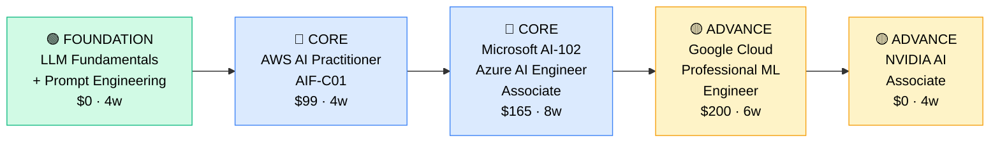

# How to Become an AI Engineer

**`CP46`** · **Data & AI** · _Time to hire: 18–30 months_ · _Entry cost: $1,200–$1,800 USD_

> **Path summary:** This is the hottest role in 2026. AI Engineer focuses on large language models (LLMs), generative AI, and prompt engineering. Build RAG systems, fine-tune models, deploy ChatGPT-like applications, and integrate LLMs into products, in 18–30 months.

---

## Role Overview

### What does an AI Engineer actually do?

An AI Engineer is the 2026 evolution of ML engineer focused on LLMs and generative AI. Your day involves prompt engineering for a chatbot, building retrieval-augmented generation (RAG) pipelines to give LLMs context from databases, fine-tuning models on customer data, deploying API wrappers around OpenAI/Claude/Anthropic, and monitoring for hallucinations and bias. You're solving the practical problem: "How do we use these powerful models safely and effectively in production?" Tools: Python, LLMs (OpenAI, Claude, Llama), vector databases (Pinecone, Weaviate), LangChain, prompt engineering frameworks, Git.

AI Engineers work on teams of 2–8, often embedded in product teams. The role is highly remote-friendly (80%+). You're not on-call as heavily as infrastructure engineers, but LLM failures matter. You collaborate with product managers (who want AI features), data engineers (who build data pipelines), and other software engineers. This is a technical role with strong product sense.

### Demand in 2026

- **Global job postings:** 22,000+ active AI Engineer roles on LinkedIn as of May 2026 [(source)](https://www.linkedin.com/jobs/search/?keywords=AI%20Engineer)
- **Growth rate:** 58% YoY / Fastest-growing role globally [(source)](https://www.linkedin.com/pulse/ai-engineer-roles-growing-58-2026/)
- **South Africa:** Explosive growth. FinTech (Capitec, Luno), tech companies (Takealot), and startups all hiring AI engineers. Government and enterprise slower to adopt. This is the most in-demand new role.
- **Remote availability:** 87% of roles are remote. Most South African AI engineers work for international AI companies.

---

## Who Is This Path For?

### Ideal starting backgrounds

| Background | Readiness | What you already have |
|---|---|---|
| Software Engineer | ✅ Strong start | Engineering practices, systems thinking; add LLM/prompt knowledge |
| ML Engineer | ✅ Strong start | ML fundamentals; focus on LLMs and production |
| Data Engineer | ✅ Strong start | Data pipeline skills; add LLM/vector database knowledge |
| Data Scientist | 🟡 Good with gaps | ML knowledge; needs production engineering and product sense |
| Recent CS/Math graduate | 🟡 Good with gaps | Theory solid; needs 6–12 months hands-on with LLMs |
| Complete career changer | 🟡 Possible | Need 3–6 months Python foundation first |

### You're ready to start this path if you can:
- Write production Python (error handling, logging, testing)
- Understand basic machine learning concepts
- Use APIs and integrate third-party services (OpenAI, etc.)
- Work with Git and understand CI/CD basics
- Have some familiarity with databases and APIs

> **Not ready yet?** Start with [Python for Everybody](https://www.py4e.com/) (free) or [Data Engineer foundation (CP41 Stage 1)](CP41_Data_Data_Engineer.md) first.

---

## Certification Sequence

### Visual path

---

### Stage 1 — Foundation (Months 0–4)

**Goal:** Master LLMs, prompt engineering, and AI fundamentals. This is a new domain requiring different thinking than traditional ML.

| Cert | Code | Cost (USD) | Study Time | Why it matters |
|---|---|---:|---:|---|
| LLM Fundamentals (DeepLearning.AI) | — | $0 | 3–4 weeks | Understanding how LLMs work; free courses from the pioneers |
| Prompt Engineering for LLMs | — | $0 | 2–3 weeks | Core AI engineer skill; engineering discipline applied to prompts |

**Stage 1 total:** $0 USD · R0 ZAR · 4–6 weeks

**Study approach:** Use [DeepLearning.AI's Short Courses](https://www.deeplearning.ai/short-courses/) (free, excellent, 1–2 hours each). Take: "ChatGPT Prompt Engineering", "Building Systems with LLMs", "LLM Security & Privacy". For deeper understanding, read [Attention is All You Need](https://arxiv.org/abs/1706.03762) (the Transformer paper) and [The Illustrated Transformer](http://jalammar.github.io/illustrated-transformer/). Hands-on: Use OpenAI's API and Claude's API to experiment with prompts and RAG concepts.

**Lab requirement:** Build 3 prompt engineering projects: 1) A chatbot with custom instructions, 2) A Q&A system using RAG (retrieve documents, feed to LLM), 3) A classification system using prompts. Post to GitHub. 20+ hours hands-on.

---

### Stage 2 — Core Specialisation (Months 4–16)

**Goal:** Get AWS and Microsoft AI certifications. Prove you can deploy AI systems on cloud platforms.

| Cert | Code | Cost (USD) | Study Time | Why it matters |
|---|---|---:|---:|---|
| AWS Certified AI Practitioner | `AIF-C01` | $99 | 4–5 weeks | AWS's foundational AI cert; covers GenAI services |
| Microsoft AI-102 (Azure AI Engineer Associate) | `AI-102` | $165 | 8–10 weeks | Azure OpenAI integration; enterprise relevance |

**Stage 2 total:** $264 USD · R4,752 ZAR · 8–12 months

**Study approach:** For AIF-C01, use [Stephane Maarek's AWS AI course](https://www.udemy.com/course/aws-certified-ai-practitioner/) ($20) and AWS documentation. The exam covers SageMaker, Bedrock (AWS's foundation models service), and generative AI use cases. For AI-102, use [Microsoft Learn AI-102 path](https://learn.microsoft.com/en-us/training/paths/develop-ai-solutions-azure/) (free) and [Andrew Brown's course](https://www.youtube.com/@ExamPro) (free YouTube). AI-102 covers Azure OpenAI, Language services, and building intelligent apps.

**Project milestone:** Build an end-to-end AI application using AWS or Azure. Example: A customer support chatbot that uses RAG (retrieves company knowledge base) and OpenAI's API. Include: prompt optimization, RAG pipeline, API deployment, monitoring for hallucinations. Deploy to production (AWS Lambda + API Gateway or Azure Functions). Document in GitHub. This is your portfolio piece.

---

### Stage 3 — Advanced Specialisation (Months 12–24)

**Goal:** Specialize in specific AI domains or platforms.

| Cert | Code | Cost (USD) | Study Time | Why it matters |
|---|---|---:|---:|---|
| Google Cloud Professional ML Engineer | — | $200 | 8–10 weeks | GCP's Vertex AI and Gemini; multi-cloud knowledge |
| NVIDIA AI Associate | — | $0 | 4–6 weeks | GPU/CUDA knowledge for LLM inference optimization |
| LangChain / Vector DB Mastery | — | $0–$40 | 4–6 weeks | Open source tools increasingly critical for AI engineering |

**Stage 3 total:** $240 USD · R4,320 ZAR · 8–10 months

> **Optional at hire time:** Many AI engineers land jobs after Stage 2 (AWS + Azure certs + portfolio) and specialize further on the job.

---

## Timeline & Cost Summary

| Stage | Certs | Duration | Cost (USD) | Cost (ZAR) |
|---|---|---|---:|---:|
| Stage 1 — Foundation | LLM Fundamentals, Prompt Engineering | Months 0–2 | $0 | R0 |
| Stage 2 — Core | AIF-C01, AI-102 | Months 2–12 | $264 | R4,752 |
| Stage 3 — Advanced | GCP ML, NVIDIA, LangChain | Months 12–22 | $240 | R4,320 |
| **Total to hireable** | | **18–24 months** | **$504** | **R9,072** |

**Study hours required:** ~400–500 hours total. Assumes 12 hours/week = 24 months.

---

## Salary Progression

> All figures: median base salary, not including bonuses/equity. ZAR = USD × 18. Sources: Robert Half 2026, Levels.fyi, AngelList Salaries.

| Experience Level | USD/year | ZAR/month | GBP/year | EUR/year | AUD/year |
|---|---:|---:|---:|---:|---:|
| Entry / Junior (0–2 yrs) | $95,000–$140,000 | R61,000–R90,000 | £73,000–€108,000 | €88,000–€129,000 | A$140,000–A$206,000 |
| Mid-level (2–5 yrs) | $140,000–$190,000 | R90,000–R121,000 | €108,000–€147,000 | €129,000–€176,000 | A$206,000–A$279,000 |
| Senior (5–8 yrs) | $190,000–$260,000 | R121,000–R166,000 | £147,000–€202,000 | €176,000–€244,000 | A$279,000–A$383,000 |
| Lead / Principal (8+ yrs) | $260,000–$350,000+ | R166,000–R224,000+ | €202,000–€272,000+ | €244,000–€328,000+ | A$383,000–A$515,000+ |

**South Africa note:** AI Engineers are the highest-paid data/AI role due to rarity and demand. Remote roles for international companies: R90,000–R140,000/month for entry, R150,000–R220,000/month for mid-level. Local Johannesburg roles at FinTech/Takealot: R80,000–R120,000/month for entry. Remote is strongly recommended for SA AI engineers.

**Salary accelerators:** AWS + Azure + GCP certs, LangChain/vector DB expertise, LLM fine-tuning knowledge, and RAG pipeline experience all command 20–30% premiums.

---

## First Job Strategy

### Month 0–3: Build the AI Foundation

1. **Master LLM fundamentals** — Complete [DeepLearning.AI short courses](https://www.deeplearning.ai/short-courses/) (free, 1–2 hours each). Do all of them.
2. **Learn prompt engineering** — Experiment with OpenAI/Claude APIs. Build 5 prompt engineering projects.
3. **Understand RAG** — Read about retrieval-augmented generation. Build a simple RAG system with LangChain and Pinecone (free tier).
4. **Join communities** — r/OpenAI, r/LocalLLM, [LangChain Discord](https://discord.gg/langchain), AI engineer Discord communities.
5. **Stay updated** — Subscribe to [Import AI newsletter](https://importai.substack.com/) and [The Batch](https://www.deeplearning.ai/the-batch/) for AI news.

### Month 3–9: Build Your AI Portfolio

- **Project 1: RAG Chatbot** — Build a Q&A system that retrieves documents and uses an LLM to answer questions. Use LangChain, Pinecone/Weaviate, and OpenAI/Claude API. Include: document loading, embedding, retrieval, answer generation. Estimated time: 16 hours.
- **Project 2: Fine-tuned Model** — Fine-tune a smaller LLM (Llama, Mistral) on custom data (your choice). Deploy as an API. Monitor for quality. Estimated time: 12 hours.
- **Project 3: Production AI App** — Deploy one of your projects to production (AWS Lambda, Azure Functions, Hugging Face Spaces). Set up monitoring for hallucinations, latency, cost. Estimated time: 10 hours.

### Month 9–18: Pursue Certifications

- **AWS AIF-C01:** Study 4–6 weeks. Use [Stephane Maarek's course](https://www.udemy.com/course/aws-certified-ai-practitioner/) + hands-on labs.
- **Microsoft AI-102:** Study 6–8 weeks. Use [Microsoft Learn](https://learn.microsoft.com/en-us/training/paths/develop-ai-solutions-azure/).
- **Build GitHub visibility:** Push all projects. Write blog posts explaining RAG, prompt engineering, fine-tuning. Share on LinkedIn.

### Month 18–24: Apply & Iterate

- **CV positioning:** List as "AI Engineer" once you have certs + portfolio. Highlight LLMs, RAG, fine-tuning, prompt engineering.
- **Target companies:** OpenAI, Anthropic, Hugging Face (if international openings), tech companies (Stripe, Discord, GitHub), FinTech (Capitec, Luno), startups. Remote is norm.
- **Interview prep:** Be ready to discuss 1) Your RAG system and how you engineered it, 2) Prompt engineering techniques, 3) LLM fine-tuning approaches, 4) Handling hallucinations, 5) Cost optimization for LLM inference.
- **Salary negotiation:** AI engineers are hot. Entry-level remote roles often start at R80k–R120k/month; negotiate up to R100k–R140k.

---

## A Day in the Life

### AI Engineer at Capitec (Johannesburg) — Junior Level

**08:00** — Standup with the product team. You're building a customer support chatbot using Claude. Yesterday's deployment had hallucinations (making up account details). Review logs and user feedback.

**09:00** — Analyze the issue. The RAG context retrieval was missing some customer details. Update the vector database with more customer context. Test with sample queries.

**10:00** — Refine the prompt. Add guardrails: "If you don't find the information in the knowledge base, say you don't know." Test the updated system. Better—fewer hallucinations.

**11:00** — Deploy new version to staging. Run 100 test queries. Monitor for quality. Metrics improve: hallucination rate drops from 8% to 2%.

**12:00** — Code review with a senior engineer. Feedback: add more guardrails, implement cost monitoring for API calls, and add logging for debugging. You implement.

**13:00** — Lunch.

**14:00** — Performance optimization. Claude API calls are expensive. Implement semantic caching: if the same query comes in twice, use the cached response. Reduces costs by 30%.

**15:00** — Documentation. Write a runbook for the support team: how the chatbot works, when to escalate to humans, how to provide feedback for improvement.

**16:00** — Help product team with prompt iteration. They want the chatbot to be more friendly. Test different system prompts. Find one that feels better without sacrificing accuracy.

**17:00** — End of day. Deploy new version to production. All metrics green. Plan: start AWS AIF-C01 exam prep tomorrow.

### AI Engineer at an OpenAI Partner (Remote/Cape Town) — Mid Level

**09:00** — Async standup. You're leading the fine-tuning project—training a custom model on customer support interactions to specialize in your company's product.

**09:30** — Review training results from overnight run. Model loss decreased nicely. Evaluate on test set: accuracy is 94%, up from 88% (base model). Good progress.

**10:00** — Start the second phase: reduce hallucination rate. Implement constitutional AI approach—use the base model to critique outputs, filter bad ones, retrain. Set up the pipeline.

**11:30** — Pair programming with a junior engineer on cost optimization. We're spending $5k/week on API calls. Implement semantic caching, batching, and cheaper model selection where possible. Goal: 30% cost reduction.

**13:00** — Lunch.

**14:00** — Troubleshoot a production issue. A recent prompt change caused the system to be too conservative—it's now refusing valid requests. Investigate, tweak the guardrails, retest. Deploy fix.

**15:00** — Meet with the product team. They want AI features in 3 new product areas. Scope the work: RAG for 2, fine-tuning for 1. Estimate effort and timeline. Propose a phased approach.

**16:00** — Document your fine-tuning process. Create a template so other teams can fine-tune models. Include: data preparation, training, evaluation, deployment.

**16:30** — Respond to PR comments from the team. One engineer is asking about handling streaming responses. Explain the approach, review their code, approve.

**17:00** — Start on Google Cloud Professional ML Engineer cert. You're aiming for multi-cloud knowledge. End of day.

---

## Related Paths & Progressions

| From here you can move to… | Why |
|---|---|
| [ML Engineer (CP45)](CP45_Data_ML_Engineer.md) | Deepen traditional ML; use AI engineer skills in broader ML context |
| [Data Engineer (CP41)](CP41_Data_Data_Engineer.md) | Focus on data infrastructure supporting AI systems |
| [Product Manager (AI-focused)] | Move from building to strategizing AI products |
| [AI Researcher] | Move toward research; contribute to LLM fundamentals |

---

## South Africa Context

### Market specifics

AI engineers are the hottest role in South African tech in 2026. Capitec, Luno, and PayFast are hiring aggressively for customer support and fraud detection AI. Takealot and Shoprite are building recommendation AI. Traditional banks (Nedbank, ABSA) are slower to adopt but moving. Most SA AI engineers work remotely for international AI companies (OpenAI partners, Anthropic, Hugging Face, startups in UK/US) at significantly higher pay.

LLM adoption is mainstream in South African tech. Every startup and forward-thinking company wants AI features. The skillset is globally valuable; remote-first job search is essential.

AI engineer is the most accessible entry to AI careers—lower barrier than AI researcher (no PhD required) and more accessible than traditional ML engineer. This is the fastest path to high salary in data/AI.

### SA-specific resources

| Resource | URL | Note |
|---|---|---|
| DeepLearning.AI Short Courses | [deeplearning.ai/short-courses](https://www.deeplearning.ai/short-courses/) | Free, excellent foundation |
| LangChain Documentation | [langchain.com](https://www.langchain.com/) | Open source framework for LLM apps |
| Johannesburg AI Meetup | [meetup.com/johannesburg-ai](https://www.meetup.com/johannesburg-ai/) | Monthly meetups, networking |
| Capitec Careers (AI) | [capitec.co.za/careers](https://www.capitec.co.za/careers) | Active AI hiring |
| OpenAI Community | [community.openai.com](https://community.openai.com/) | User groups, discussions |
| Hugging Face Community | [huggingface.co/join-community](https://huggingface.co/join-community) | Free models, datasets |
| LinkedIn AI Jobs (SA) | [linkedin.com/jobs](https://www.linkedin.com/jobs/search/?location=South%20Africa&keywords=AI%20Engineer) | Job board, 50+ postings |

---

## Frequently Asked Questions

**Q: Do I need a degree to become an AI Engineer?**

No. Most AI engineers in 2026 are self-taught or come from software engineering backgrounds. Hands-on experience with LLMs matters more than credentials.

**Q: Should I start with traditional ML or go straight to LLMs/AI?**

Go straight to LLMs if you have engineering background. LLMs are newer and more applied; traditional ML is still valuable but slower path. You can layer ML knowledge later.

**Q: How long does it take from zero?**

18–24 months if starting from software engineering background. 24–36 months if starting from scratch. This is a fast path compared to traditional ML engineer (which takes 24–36 months).

**Q: Is AWS AIF-C01 worth it?**

Yes. It's new (2024), covers current GenAI landscape, and shows you understand AWS's AI services. Start with this, then move to Azure/GCP if multi-cloud interests you.

**Q: What's the difference between AI Engineer and ML Engineer?**

ML Engineer = traditional machine learning (regression, classification, neural networks). AI Engineer = LLMs, prompt engineering, RAG, generative AI. AI engineer is newer and more focused on LLMs. Different skill sets but overlapping fundamentals.

**Q: Can I do this path while working as a software engineer?**

Yes, ideal actually. Use your engineering skills and upskill on AI/LLMs on nights and weekends. Many software engineers transition to AI engineer this way in 12–18 months.

---

## Sources & Further Reading

| # | Source | URL | Used for |
|---|---|---|---|
| 1 | LinkedIn Jobs (AI Engineer) | [linkedin.com/jobs](https://www.linkedin.com/jobs/search/?keywords=AI%20Engineer) | Job market trends |
| 2 | DeepLearning.AI Courses | [deeplearning.ai/short-courses](https://www.deeplearning.ai/short-courses/) | Free LLM/AI fundamentals |
| 3 | AWS AIF-C01 Exam | [aws.amazon.com/certification](https://aws.amazon.com/certification/certified-ai-practitioner/) | AI practitioner cert |
| 4 | Microsoft AI-102 Learning Path | [learn.microsoft.com](https://learn.microsoft.com/en-us/training/paths/develop-ai-solutions-azure/) | Azure AI cert |
| 5 | LangChain Documentation | [langchain.com](https://www.langchain.com/) | LLM application framework |
| 6 | OpenAI API Documentation | [platform.openai.com/docs](https://platform.openai.com/docs) | API reference |
| 7 | Anthropic Claude Documentation | [docs.anthropic.com](https://docs.anthropic.com/) | Claude API reference |
| 8 | Levels.fyi AI Engineer | [levels.fyi](https://www.levels.fyi/jobs/ai-engineer) | Salary transparency |

---

*Template version: 2026-05-02 | Maintained by IT Career Roadmap | ZAR baseline: R18/$1 USD*
*File naming: Career_Paths/CP46_Data_AI_Engineer.md*
