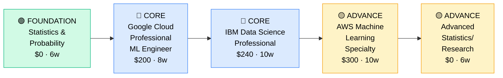

# How to Become a Data Scientist

**`CP47`** · **Data & AI** · _Time to hire: 24–36 months_ · _Entry cost: $1,200–$1,800 USD_

> **Path summary:** This path takes you from analyst, engineer, or graduate to a hired Data Scientist conducting advanced analytics, building predictive models, and translating complex analyses into business insights, in 24–36 months. Data Science is research-focused compared to ML engineering.

---

## Role Overview

### What does a Data Scientist actually do?

A Data Scientist is half researcher, half analyst. You spend your days exploring data to uncover patterns and insights, building statistical models to make predictions, and communicating findings to non-technical stakeholders. A week might involve analyzing customer churn to identify risk factors, building a predictive model, presenting findings to the VP of Sales, then deploying the model (or handing to an ML engineer). You're answering "What could happen?" and "Why did it happen?" rather than just "What happened?" Tools: Python (Pandas, NumPy, scikit-learn, statsmodels), SQL, R (sometimes), Jupyter, visualization libraries, Git, cloud platforms.

Data Scientists work on teams of 2–10, often embedded in business units. The role is remote-friendly (70%+). You're rarely on-call. You collaborate with analysts (who use your insights), engineers (who deploy your models), and business stakeholders. This is a technical role requiring statistical thinking and strong communication.

### Demand in 2026

- **Global job postings:** 25,000+ active Data Scientist roles on LinkedIn as of May 2026 [(source)](https://www.linkedin.com/jobs/search/?keywords=Data%20Scientist)
- **Growth rate:** 14% YoY / Strong demand but plateauing compared to ML engineer [(source)](https://www.bls.gov/ooh/computer-and-information-technology/)
- **South Africa:** Moderate demand. Banks (Nedbank, ABSA) and FinTech have data science teams. Less specialized roles than analysts or engineers but better-paid.
- **Remote availability:** 75% of roles are remote/hybrid.

---

## Who Is This Path For?

### Ideal starting backgrounds

| Background | Readiness | What you already have |
|---|---|---|
| Data Analyst | ✅ Strong start | SQL and analytics; add statistical rigor and Python |
| ML Engineer | ✅ Strong start | ML fundamentals; add statistical thinking and domain context |
| Software Engineer | 🟡 Good with gaps | Engineering practices; needs deep stats and domain knowledge |
| Statistician / Mathematician | ✅ Strong start | Statistics expertise; add Python, SQL, product context |
| Recent MS/PhD (Stats, Math, Physics) | ✅ Strong start | Deep theory; needs 6–12 months product/business context |
| Business Analyst | 🟡 Possible | Domain knowledge; needs statistical and technical ramp-up |

### You're ready to start this path if you can:
- Write Python scripts (data manipulation, statistics, visualization)
- Understand statistical concepts (hypothesis testing, distributions, correlation)
- Build basic predictive models (regression, classification)
- Query databases with SQL
- Communicate findings to non-technical audiences

> **Not ready yet?** Start with [Data Analyst path (CP42)](CP42_Data_Data_Analyst.md) or [Statistics Fundamentals](https://www.coursera.org/learn/basic-statistics) first.

---

## Certification Sequence

### Visual path

---

### Stage 1 — Foundation (Months 0–4)

**Goal:** Master statistics and Python. These are the non-negotiable fundamentals for data scientists.

| Cert | Code | Cost (USD) | Study Time | Why it matters |
|---|---|---:|---:|---|
| Statistics & Probability (Coursera/Khan Academy) | — | $0 | 4–6 weeks | Foundation for all statistical modeling; free excellent resources |
| Python for Data Science (NumPy, Pandas, Matplotlib) | — | $0–$40 | 4–6 weeks | Production-grade Python for data manipulation |

**Stage 1 total:** $40 USD · R720 ZAR · 4–6 months

**Study approach:** Use [Khan Academy Statistics course](https://www.khanacademy.org/math/statistics-probability) (free, excellent, foundational) or [StatQuest with Josh Starmer](https://www.youtube.com/@statquest) (free YouTube, clear explanations). For Python, use [DataCamp Python track](https://www.datacamp.com/) (subscription) or [Fast.ai's Practical Deep Learning](https://www.fast.ai/) (free, code-first). Focus on: hypothesis testing, distributions, correlation, regression fundamentals.

**Lab requirement:** Build 5 statistical analysis projects. Each should include: hypothesis testing, exploratory data analysis, visualization, and interpretation. Use real datasets (Kaggle, UCI). Post to GitHub. 40+ hours hands-on.

---

### Stage 2 — Core Specialisation (Months 4–18)

**Goal:** Get certifications proving data science and ML expertise.

| Cert | Code | Cost (USD) | Study Time | Why it matters |
|---|---|---:|---:|---|
| Google Cloud Professional ML Engineer | — | $200 | 8–10 weeks | Advanced ML; GCP's ML platform coverage |
| IBM Data Science Professional Certificate | — | $240 | 10–12 weeks | End-to-end data science; covers the full lifecycle |

**Stage 2 total:** $440 USD · R7,920 ZAR · 12–16 months

**Study approach:** For Google ML Engineer, use [Google Cloud Training](https://cloud.google.com/training) (free) and [Udemy course](https://www.udemy.com/course/gcp-machine-learning-engineer/) ($20). For IBM, use [Coursera Data Science Professional Certificate](https://www.coursera.org/professional-certificates/ibm-data-science) (accessible for $40/month or audit free). The IBM cert covers: data collection, cleaning, exploration, modeling, evaluation, and communication. Comprehensive pathway.

**Project milestone:** Build an end-to-end data science project solving a real business problem. Include: problem definition, exploratory analysis, statistical tests, predictive modeling, evaluation, and business recommendations. Deploy the model (or document deployment strategy). Present findings as if to a business stakeholder. Post to GitHub with a comprehensive README. This is your portfolio piece.

---

### Stage 3 — Advanced Specialisation (Months 12–24)

**Goal:** Deepen in specialized areas (causal inference, advanced statistics, domain expertise).

| Cert | Code | Cost (USD) | Study Time | Why it matters |
|---|---|---:|---:|---|
| AWS Machine Learning Specialty | `MLS-C01` | $300 | 10–12 weeks | Production ML systems; engineering depth |
| Advanced Statistics / Causal Inference (free) | — | $0 | 6–8 weeks | Rigorous statistical thinking; separates good from excellent |

**Stage 3 total:** $300 USD · R5,400 ZAR · 10–12 months

**Study approach:** For AWS MLS-C01, use [Stephane Maarek's course](https://www.udemy.com/course/aws-machine-learning/) ($20). For advanced stats, read [Causal Inference: The Mixtape](https://mixtape.scunning.com/) (free online book) and [Judea Pearl's Causal Inference](https://bayes.cs.ucla.edu/jp_home.html) (book, not free). These teach modern causal thinking—essential for data scientists doing serious analysis.

> **Optional at hire time:** Many data scientists land jobs after Stage 2 (GCP + IBM certs + portfolio) and deepen further on the job.

---

## Timeline & Cost Summary

| Stage | Certs | Duration | Cost (USD) | Cost (ZAR) |
|---|---|---|---:|---:|
| Stage 1 — Foundation | Statistics, Python | Months 0–4 | $40 | R720 |
| Stage 2 — Core | GCP ML Engineer, IBM Data Science | Months 4–18 | $440 | R7,920 |
| Stage 3 — Advanced | AWS MLS-C01, Advanced Stats | Months 12–24 | $300 | R5,400 |
| **Total to hireable** | | **24–30 months** | **$780** | **R14,040** |

**Study hours required:** ~400–500 hours. Assumes 12 hours/week = 30 months.

---

## Salary Progression

> All figures: median base salary, not including bonuses/equity. ZAR = USD × 18. Sources: Robert Half 2026, Glassdoor, LinkedIn Salary, Levels.fyi.

| Experience Level | USD/year | ZAR/month | GBP/year | EUR/year | AUD/year |
|---|---:|---:|---:|---:|---:|
| Entry / Junior (0–2 yrs) | $90,000–$130,000 | R58,000–R83,000 | £70,000–€101,000 | €84,000–€121,000 | A$132,000–A$191,000 |
| Mid-level (2–5 yrs) | $130,000–$175,000 | R83,000–R112,000 | €101,000–€135,000 | €121,000–€164,000 | A$191,000–A$257,000 |
| Senior (5–8 yrs) | $175,000–$230,000 | R112,000–R147,000 | €135,000–€178,000 | €164,000–€216,000 | A$257,000–A$338,000 |
| Lead / Manager (8+ yrs) | $230,000–$300,000+ | R147,000–R192,000+ | €178,000–€232,000+ | €216,000–€288,000+ | A$338,000–A$441,000+ |

**South Africa note:** Data Scientists at Johannesburg banks (Nedbank, ABSA) earn R80,000–R120,000/month. Remote roles for international companies: R100,000–R160,000/month for entry, R140,000–R200,000/month for mid-level. Less common in SA than analyst roles; more specialized and research-focused.

**Salary accelerators:** Advanced statistics knowledge, causal inference expertise, domain-specific knowledge (FinTech, healthcare), and proven impact on business metrics all command 15–25% premiums.

---

## First Job Strategy

### Month 0–6: Build Your Statistical Foundation

1. **Master statistics** — [Khan Academy Statistics](https://www.khanacademy.org/math/statistics-probability) (free, foundational) or [Stanford Stats courses](https://www.coursera.org/learn/statistics). 8–10 weeks.
2. **Learn Python for data science** — [DataCamp Python track](https://www.datacamp.com/) or [Fast.ai](https://www.fast.ai/). Focus on Pandas, NumPy, Matplotlib, scikit-learn.
3. **Build statistical projects** — Analyze datasets, run hypothesis tests, create visualizations. Post to GitHub.
4. **Join communities** — r/datascience, [Statistics Stack Exchange](https://stats.stackexchange.com/), local meetups.
5. **Read the classics** — "Statistical Rethinking" by Richard McElreath, "Trustworthy Data" by Lisa Gebhardt.

### Month 6–12: Build Your Data Science Portfolio

- **Project 1: Statistical Analysis & Hypothesis Testing** — Take a dataset, formulate 5 hypotheses, conduct hypothesis tests, visualize findings. Write a report explaining methodology and conclusions. Estimated time: 12 hours.
- **Project 2: Predictive Modeling** — Build a classification or regression model. Include: data exploration, feature engineering, model selection (compare 5+ algorithms), cross-validation, evaluation. Estimated time: 15 hours.
- **Project 3: Causal Analysis** — Design an experiment or quasi-experiment to isolate causal effects. Implement causal inference techniques. Document methodology. Estimated time: 12 hours.

### Month 12–24: Pursue Certifications

- **GCP Professional ML Engineer:** Study 8–10 weeks.
- **IBM Data Science Professional Certificate:** Study 10–12 weeks (can overlap with GCP).
- **Build visibility:** Write blog posts on your analysis approaches. Share on Medium and LinkedIn.

### Month 24–30: Apply & Iterate

- **CV positioning:** List as "Data Scientist" once you have GCP cert + IBM cert + strong portfolio. Emphasize statistical rigor and business impact.
- **Target companies:** Financial services (banks, insurance), FinTech, healthcare, e-commerce (Takealot), startups. Remote available.
- **Interview prep:** Be ready to discuss 1) A complex analysis you conducted, 2) Hypothesis testing approaches, 3) Your modeling process, 4) Handling biased data, 5) Communicating uncertainty to non-technical audiences.
- **Salary negotiation:** Data scientist roles pay well. Entry-level roles offer R80k–R120k/month locally; remote international roles R100k–R160k/month. Negotiate based on portfolio strength.

---

## A Day in the Life

### Data Scientist at Nedbank (Johannesburg) — Junior Level

**08:00** — Standup with the analytics team. You're analyzing customer credit default risk. Previous model needs updating with recent data.

**09:00** — Explore new data. Load the latest customer/loan records. Check distributions, missing values, outliers. Data looks clean; good quality this quarter.

**10:00** — Run exploratory data analysis. Create visualizations: default rate by loan amount, region, customer age. Spot a trend: rural loans have higher default rate. Hypothesis: limited access to communication/payment options.

**11:00** — Conduct hypothesis test. Is rural default rate significantly higher than urban? Run a chi-square test. p-value < 0.05. Statistically significant.

**12:00** — Lunch.

**13:00** — Start model retraining. Use scikit-learn. Try 5 algorithms: logistic regression, random forest, gradient boosting, SVM, neural network. Compare metrics. Gradient boosting performs best.

**14:30** — Evaluate the model. Cross-validation, ROC curve, confusion matrix, feature importance. Model is good but slightly overfit to recent data. Add regularization.

**15:30** — Document findings. Create a report: analysis approach, data summary, statistical tests, modeling methodology, results, recommendations. Include visualizations.

**16:30** — Code review on your analysis notebook. Senior scientist checks your statistical approach. Feedback: add a check for Simpson's paradox, consider interaction effects. You implement.

**17:00** — End of day. Schedule a meeting to present findings to risk team tomorrow.

### Data Scientist at Capitec (Johannesburg) — Mid Level

**08:00** — Standup. You're designing an experiment: testing a new product feature against the control group. Responsible for study design, statistical power, and analysis plan.

**09:00** — Design the experiment. Sketch the approach: randomized controlled trial, sample size calculation (need 10k per group for 80% power), key metrics (signup rate, activation rate, churn).

**10:00** — Write the statistical analysis plan. Document: hypotheses, metrics, success criteria, multiple comparisons correction, timeline. Get approval from the legal/ethics team.

**11:00** — Data quality check. Review logs from the experiment. Randomization looks correct; no major data issues. Sample sizes on track.

**12:00** — Lunch.

**13:00** — Interim analysis. We're 70% through the experiment. Run preliminary tests. Treatment group shows 8% higher signup rate. Early signal, but not yet significant (confidence intervals overlap). Continue experiment.

**14:30** — Work on a follow-up analysis. Previous experiment showed that feature increased retention. Now investigating: which customer segments benefit most? Segment the data (by age, region, income) and run analysis separately. Create visualizations.

**15:30** — Pair with an engineer on model deployment. Your previous churn prediction model needs to be productionized. Review the model package, discuss inference latency and monitoring. Hand off to the ML engineer.

**16:30** — Mentor a junior data scientist. Code review their analysis. Feedback: add more robustness checks, consider edge cases, clarify your conclusions. Good learning moment.

**17:00** — End of day. Wrap up documentation. Plan: finish experiment analysis tomorrow.

---

## Related Paths & Progressions

| From here you can move to… | Why |
|---|---|
| [ML Engineer (CP45)](CP45_Data_ML_Engineer.md) | Deepen engineering skills; move from research to production |
| [Analytics Engineer (CP43)](CP43_Data_Analytics_Engineer.md) | Focus on analytics infrastructure rather than research |
| [AI Engineer (CP46)](CP46_Data_AI_Engineer.md) | Pivot to LLMs and generative AI research |
| Data Science Manager / Lead | After 5+ years, manage teams and strategy |

---

## South Africa Context

### Market specifics

Data Scientists are respected roles in South African financial services and FinTech, but less common than data analysts or engineers. Nedbank, ABSA, and Standard Bank have data science teams. Capitec invests heavily in data science for credit risk. Most SA data scientists are industry-specific (banking, insurance, FinTech) rather than generalists.

Remote work is available but less norm than for analysts. Most data scientist roles are hybrid or onsite. International remote opportunities are good—SA data scientists work for global tech companies, especially with research focus.

The role requires deeper technical credentials than analyst roles (certs + strong portfolio matter). Most successful SA data scientists have a master's degree or strong self-taught background.

### SA-specific resources

| Resource | URL | Note |
|---|---|---|
| Johannesburg Data Science Meetup | [meetup.com/johannesburg-data-science](https://www.meetup.com/johannesburg-data-science/) | Monthly meetups, networking |
| Nedbank Careers (Data Science) | [nedbank.co.za/careers](https://www.nedbank.co.za/careers) | Regular DS postings |
| Capitec Careers | [capitec.co.za/careers](https://www.capitec.co.za/careers) | Active data science team |
| IBM Data Science Certificate | [coursera.org](https://www.coursera.org/professional-certificates/ibm-data-science) | Industry-recognized cert |
| Khan Academy Statistics | [khanacademy.org/math/statistics-probability](https://www.khanacademy.org/math/statistics-probability) | Free foundational stats |
| StatQuest with Josh Starmer | [youtube.com/@statquest](https://www.youtube.com/@statquest) | Free, excellent explanations |
| LinkedIn Data Scientist Jobs (SA) | [linkedin.com/jobs](https://www.linkedin.com/jobs/search/?location=South%20Africa&keywords=Data%20Scientist) | Job board, 30+ postings |

---

## Frequently Asked Questions

**Q: Do I need a master's degree to become a Data Scientist?**

Not strictly, but many SA employers prefer it. A strong self-taught background with certs + portfolio can compensate. A master's in stats, math, or data science helps significantly.

**Q: Is data scientist different from ML engineer?**

Yes. Data Scientists focus on research, statistics, insights. ML Engineers focus on production systems, deployment, scalability. Data Scientists often hand off models to ML Engineers. Different specializations.

**Q: How long does it take from zero?**

24–36 months from complete zero. If you have statistical background: 12–18 months. If you're coming from analyst role: 18–24 months. This is not a fast path.

**Q: Should I get a master's degree?**

Optional but valuable. A master's in statistics, data science, or math accelerates the path by 12 months and improves job prospects. Self-taught + strong portfolio is viable but requires more effort.

**Q: Is the IBM Data Science Certificate worth it?**

Yes. It's comprehensive, covers the full data science lifecycle, and is widely recognized. At $40–$240 (depending on how you access), it's affordable.

**Q: What's the difference between Data Scientist and Data Analyst?**

Analysts answer questions about what happened and what's happening. Scientists predict what will happen and why. Scientists use more advanced statistical methods and do more exploratory research. Analysts focus on dashboards and reporting.

---

## Sources & Further Reading

| # | Source | URL | Used for |
|---|---|---|---|
| 1 | LinkedIn Jobs (Data Scientist) | [linkedin.com/jobs](https://www.linkedin.com/jobs/search/?keywords=Data%20Scientist) | Job market data |
| 2 | Khan Academy Statistics | [khanacademy.org](https://www.khanacademy.org/math/statistics-probability) | Free statistics foundation |
| 3 | IBM Data Science Certificate | [coursera.org](https://www.coursera.org/professional-certificates/ibm-data-science) | Professional cert |
| 4 | Google Cloud ML Engineer | [cloud.google.com/training](https://cloud.google.com/training) | ML/cloud platform |
| 5 | AWS ML Specialty | [aws.amazon.com/certification](https://aws.amazon.com/certification/certified-machine-learning-specialty/) | Production ML systems |
| 6 | Statistical Rethinking | [xcelab.net/rm/statistical-rethinking/](https://xcelab.net/rm/statistical-rethinking/) | Bayesian statistics book |
| 7 | Causal Inference: The Mixtape | [mixtape.scunning.com](https://mixtape.scunning.com/) | Free causal inference book |
| 8 | Levels.fyi Data Scientist | [levels.fyi](https://www.levels.fyi/jobs/data-scientist) | Salary transparency |

---

*Template version: 2026-05-02 | Maintained by IT Career Roadmap | ZAR baseline: R18/$1 USD*
*File naming: Career_Paths/CP47_Data_Data_Scientist.md*
