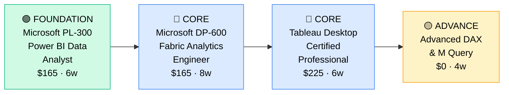

# How to Become a BI Developer

**`CP48`** · **Data & AI** · _Time to hire: 9–15 months_ · _Entry cost: $600–$900 USD_

> **Path summary:** This path takes you from data analyst or developer to a hired BI Developer building enterprise dashboards, data models, and analytics solutions. You'll master Power BI and Tableau at a professional level, in 9–15 months. Faster entry than data engineer, higher specialization than analyst.

---

## Role Overview

### What does a BI Developer actually do?

A BI Developer builds and maintains the analytics infrastructure that business users consume. Your day involves designing data models that power dashboards, optimizing DAX formulas in Power BI, creating Tableau visualizations that tell stories, and collaborating with analysts and business teams on requirements. Unlike an analyst who answers questions, you build the tools analysts use. Unlike a data engineer who builds pipes, you focus on analytical use cases and user experience. Tools: Power BI, Tableau, SQL, DAX/M query language, data modeling, cloud platforms.

BI Developers work on teams of 2–8, often part of analytics or BI teams. The role is remote-friendly (75%+). You're rarely on-call but monitor dashboards for data quality issues. You collaborate with analysts, business users, data engineers, and sometimes product teams. This is a technical role with strong focus on usability and storytelling.

### Demand in 2026

- **Global job postings:** 16,000+ active BI Developer roles on LinkedIn as of May 2026 [(source)](https://www.linkedin.com/jobs/search/?keywords=BI%20Developer)
- **Growth rate:** 11% YoY / Steady demand as enterprises mature analytics [(source)](https://www.bls.gov/ooh/computer-and-information-technology/)
- **South Africa:** Strong demand. Every bank, retailer, and large enterprise needs BI developers to maintain dashboards. Higher demand than data engineer but lower salary ceiling.
- **Remote availability:** 78% of roles are remote/hybrid.

---

## Who Is This Path For?

### Ideal starting backgrounds

| Background | Readiness | What you already have |
|---|---|---|
| Data Analyst | ✅ Strong start | Analytics domain, SQL, visualization mindset; deepen BI tools |
| Developer | ✅ Strong start | Engineering discipline, problem-solving; add BI/analytics knowledge |
| SQL Developer | ✅ Strong start | Database and SQL expertise; add visualization and BI |
| Data Engineer | ✅ Strong start | Data fundamentals; pivot toward analytics focus |
| IT Support / Help Desk | 🟡 Good with gaps | Technical mindset; need SQL + BI tools ramp-up |
| Complete career changer | 🟡 Possible | Need 3–4 months SQL foundation first |

### You're ready to start this path if you can:
- Write intermediate SQL (JOINs, GROUP BY, subqueries, CTEs)
- Understand data modeling basics (facts, dimensions, relationships)
- Create basic visualizations (charts, tables, filters)
- Use Power BI or Tableau at an intermediate level
- Understand business metrics and KPIs

> **Not ready yet?** Start with [Data Analyst path (CP42)](CP42_Data_Data_Analyst.md) or [SQL Fundamentals](https://mode.com/sql-tutorial/) first.

---

## Certification Sequence

### Visual path

---

### Stage 1 — Foundation (Months 0–2)

**Goal:** Master Power BI and SQL fundamentals. These are the entry baseline.

| Cert | Code | Cost (USD) | Study Time | Why it matters |
|---|---|---:|---:|---|
| Microsoft PL-300 (Power BI Data Analyst) | `PL-300` | $165 | 5–6 weeks | Entry-level Power BI; 70% of BI jobs mention it |
| SQL for BI (Mode/DataCamp) | — | $0–$40 | 3–4 weeks | Solid SQL is foundation for BI; optimization matters |

**Stage 1 total:** $205 USD · R3,690 ZAR · 2 months

**Study approach:** For PL-300, use [Stephanie Clayton's Udemy course](https://www.udemy.com/course/microsoft-power-bi-up-and-running-with-power-bi-desktop/) ($15) + [Microsoft Learn](https://learn.microsoft.com/en-us/training/paths/power-bi-fundamentals/). The exam tests Power BI Desktop, DAX basics, and report design. For SQL, use [Mode Analytics](https://mode.com/sql-tutorial/) (free, excellent) or [DataCamp](https://www.datacamp.com/) (subscription). Focus on optimization and performance.

**Lab requirement:** Build 10 Power BI reports from public datasets. Include: data modeling, DAX measures, visualizations, slicers, interactivity. Push to Power BI Cloud. Document business logic for each. 25+ hours hands-on.

---

### Stage 2 — Core Specialisation (Months 2–10)

**Goal:** Get Microsoft Fabric cert and Tableau cert. Prove proficiency in modern analytics platforms.

| Cert | Code | Cost (USD) | Study Time | Why it matters |
|---|---|---:|---:|---|
| Microsoft DP-600 (Fabric Analytics Engineer) | `DP-600` | $165 | 8–10 weeks | Newer, modern analytics stack; covers Fabric, Synapse |
| Tableau Desktop Certified Professional | — | $225 | 5–7 weeks | Tableau is 25% of BI tool market; strong second credential |

**Stage 2 total:** $390 USD · R7,020 ZAR · 6–8 months

**Study approach:** For DP-600, use [Microsoft Learn DP-600 path](https://learn.microsoft.com/en-us/training/paths/analytics-engineer-fabric/) (free) and [Udemy course](https://www.udemy.com/course/microsoft-fabric-analytics-engineer/) ($15). Fabric is newer but represents Microsoft's modern direction. For Tableau, use [Tableau Public training](https://public.tableau.com/s/resources) (free videos) and [Udemy Tableau Certified Professional](https://www.udemy.com/course/learning-tableau-10/) ($15). The Tableau exam is practical—build and publish a visualization.

**Project milestone:** Build a complete BI solution. Include: 1) Data model (star schema, relationships, measures), 2) 5+ interconnected dashboards (different business use cases), 3) Row-level security or filters, 4) Documentation and metadata. Deploy to Power BI Cloud or Tableau Cloud. This shows production-ready thinking.

---

### Stage 3 — Advanced Specialisation (Months 8–15)

**Goal:** Deepen DAX/M query language and specialization (performance tuning, governance, etc.).

| Cert | Code | Cost (USD) | Study Time | Why it matters |
|---|---|---:|---:|---|
| Advanced DAX & M Language (DataCamp/Udemy) | — | $0–$40 | 4–6 weeks | Production BI requires deep DAX; separates good from excellent |
| Data Governance / BI Governance (free resources) | — | $0 | 3–4 weeks | Enterprise BI requires governance; increasingly critical |

**Stage 3 total:** $40 USD · R720 ZAR · 4–6 months

**Study approach:** For advanced DAX, use [SQLBI's DAX course](https://www.sqlbi.com/) (premium but thorough) or [Udemy DAX mastery](https://www.udemy.com/course/dax-power-bi-mastery-advanced-formulas/) ($15). DAX is powerful and complex—mastery separates entry-level from mid-level BI developers. For governance, read Microsoft's BI governance guides (free) and understand concepts like: centralized vs. decentralized models, data quality, user access, cost management.

> **Optional at hire time:** Many BI developers land jobs after Stage 2 (PL-300 + DP-600 + Tableau + portfolio) and deepen in Stage 3 on the job.

---

## Timeline & Cost Summary

| Stage | Certs | Duration | Cost (USD) | Cost (ZAR) |
|---|---|---|---:|---:|
| Stage 1 — Foundation | PL-300, SQL Basics | Months 0–2 | $205 | R3,690 |
| Stage 2 — Core | DP-600, Tableau Certified | Months 2–10 | $390 | R7,020 |
| Stage 3 — Advanced | Advanced DAX, Governance | Months 8–15 | $40 | R720 |
| **Total to hireable** | | **9–12 months** | **$635** | **R11,430** |

**Study hours required:** ~300–350 hours total. Assumes 10 hours/week = 12 months.

---

## Salary Progression

> All figures: median base salary, not including bonuses/equity. ZAR = USD × 18. Sources: Robert Half 2026, Glassdoor, LinkedIn Salary.

| Experience Level | USD/year | ZAR/month | GBP/year | EUR/year | AUD/year |
|---|---:|---:|---:|---:|---:|
| Entry / Junior (0–2 yrs) | $65,000–$95,000 | R42,000–R61,000 | £50,000–€74,000 | €60,000–€88,000 | A$96,000–A$140,000 |
| Mid-level (2–5 yrs) | $95,000–$130,000 | R61,000–R83,000 | €74,000–€101,000 | €88,000–€121,000 | A$140,000–A$191,000 |
| Senior (5–8 yrs) | $130,000–$170,000 | R83,000–R109,000 | £101,000–€132,000 | €121,000–€159,000 | A$191,000–A$250,000 |
| Lead / Architect (8+ yrs) | $170,000–$220,000 | R109,000–R141,000 | €132,000–€171,000 | €159,000–€207,000 | A$250,000–A$324,000 |

**South Africa note:** BI Developers at Johannesburg banks (Nedbank, ABSA) earn R50,000–R75,000/month for entry, R75,000–R110,000/month for mid-level. Remote roles for international companies: R65,000–R100,000/month for entry, R90,000–R140,000/month for mid-level. BI is more mature in SA than data engineering; wider job availability.

**Salary accelerators:** Tableau expertise, advanced DAX, governance knowledge, and multi-tool proficiency (Power BI + Tableau + Looker) all command 10–20% premiums.

---

## First Job Strategy

### Month 0–3: Build the Foundation

1. **Learn Power BI deeply** — [Stephanie Clayton's course](https://www.udemy.com/course/microsoft-power-bi-up-and-running-with-power-bi-desktop/) ($15) + hands-on labs. 6 weeks.
2. **Strengthen SQL** — [Mode Analytics](https://mode.com/sql-tutorial/) (free). Drill on window functions, CTEs, performance optimization.
3. **Build 10 Power BI reports** — From Kaggle datasets. Focus on different business domains: sales, HR, finance, operations.
4. **Join communities** — r/PowerBI, [Power BI Community](https://community.powerbi.com/), local BI meetups.
5. **Document your work** — GitHub: push Power BI metadata/documentation. LinkedIn: share what you're learning.

### Month 3–6: Build Your BI Portfolio

- **Project 1: Enterprise Sales Dashboard** — Create a multi-level dashboard: sales by region, product, sales rep. Include: drill-down capability, KPIs, trends, forecasts. Use DAX for measures. Estimated time: 10 hours.
- **Project 2: HR Analytics Solution** — Build an HR dashboard: headcount, turnover, salary bands, hiring pipeline. Include: department filtering, role comparisons, trend analysis. Estimated time: 8 hours.
- **Project 3: Financial/Budget Dashboard** — Create a budget vs. actual dashboard. Include: variance analysis, drill-down to line items, forecast updates. Document the data model. Estimated time: 8 hours.

### Month 6–9: Pursue Certifications

- **DP-600:** Study 6–8 weeks. Use [Microsoft Learn](https://learn.microsoft.com/en-us/training/paths/analytics-engineer-fabric/).
- **Tableau Specialist:** Study 5–6 weeks. Use [Tableau training videos](https://public.tableau.com/s/resources) + hands-on.
- **CV positioning:** List as "BI Developer" once you hold PL-300 + 2–3 portfolio projects.

### Month 9–15: Apply & Iterate

- **Target companies:** Every enterprise hires BI developers. Banks, retailers (Shoprite, Pick n Pay, Takealot), insurance, telcos, consulting. Also: government, NGOs.
- **Interview prep:** Be ready to discuss 1) Your dashboard architecture, 2) Data modeling decisions, 3) DAX optimization, 4) Performance tuning, 5) User experience and usability.
- **Salary negotiation:** BI developer roles in SA are well-established. Entry-level offers R40k–R60k/month; negotiate to R50k–R75k. Remote roles pay 30% more.

---

## A Day in the Life

### BI Developer at Nedbank (Johannesburg) — Junior Level

**08:00** — Arrive. Check overnight dashboard refreshes. One Synapse job ran slowly; investigate. Query is missing an index on a join column. Escalate to the data engineering team.

**09:00** — Standup with the analytics team. You're working on a credit risk dashboard for the risk management team.

**10:00** — Design meeting with risk team. Understand their requirements: they need to monitor credit exposure by industry, region, and loan size. Sketch the data model: fact table (loans), dimension tables (industry, region, loan products).

**11:00** — Check with data engineers. Verify that the raw data is available. Yes, in Synapse. Get credentials.

**12:00** — Start building the data model. Create a star schema in Power BI Synapse connector. Add relationships between fact and dimension tables. Create key measures: total exposure, average LTV (loan-to-value), default risk percentage.

**13:00** — Lunch.

**14:00** — Build the dashboard. Create 4 visualizations: exposure by industry, exposure by region, exposure by loan size, risk metrics. Add slicers for dynamic filtering.

**15:30** — Test with the risk team. They want to see exposure by a specific industry and region. Works smoothly.

**16:00** — Code review with a senior BI developer. Feedback: add a slicer for product type, improve the color scheme for accessibility, and document your DAX measures. You revise.

**16:45** — Deploy to Power BI Cloud. Set up automatic refresh (daily). Configure row-level security so each region manager sees only their data.

**17:30** — End of day. Document the dashboard and data model. Push to GitHub.

### BI Developer at Takealot (Cape Town) — Mid Level

**08:00** — Async standup. You're leading a Tableau migration project. Moving from legacy reporting tool to Tableau. Three dashboards migrated; two to go.

**09:00** — Review Tableau development environment. Two legacy dashboards are ready for migration. Understand the business logic, data sources, and KPIs.

**10:00** — Migrate Dashboard 1. Export the old data model, translate to Tableau prep. Create calculated fields (DAX equivalent in Tableau). Build visualizations. Test with business users.

**11:30** — Stakeholder meeting. Show the migrated dashboard. They like it but want one more metric: "units sold per category this year vs. last year." Quick change—add a table calculation.

**13:00** — Lunch.

**14:00** — Continue migration of Dashboard 2. This one has complex interactivity. Convert to Tableau filters and actions.

**15:00** — Performance optimization. The underlying data source is large (100M rows). Implement data extracts and aggregated tables to speed up load times.

**16:00** — Documentation. Create a runbook for the business team: how to use Tableau, how to refresh data, how to request new reports. Post on the internal wiki.

**16:30** — Mentor a junior BI developer. Code review their Power BI dashboard. Feedback: add more documentation, consider using aggregated tables for performance. Good learning.

**17:00** — End of day. Wrap-up. Plan: finish final dashboard migrations tomorrow.

---

## Related Paths & Progressions

| From here you can move to… | Why |
|---|---|
| [Data Analyst (CP42)](CP42_Data_Data_Analyst.md) | Shift toward business analysis and insight generation |
| [Analytics Engineer (CP43)](CP43_Data_Analytics_Engineer.md) | Deepen data infrastructure; add dbt + engineering practices |
| [Data Architect (CP44)](CP44_Data_Data_Architect.md) | After 5+ years, design enterprise BI systems |
| BI Manager / Lead | Lead BI teams and strategy |

---

## South Africa Context

### Market specifics

BI Developer is a well-established role in South African enterprises. Every major bank, retailer, and large company maintains BI dashboards and hires BI developers. Power BI is dominant due to Microsoft integration; Tableau is strong in tech-forward companies. Demand is consistent and job availability is high—more mature market than data engineering.

Remote work is available but less norm than for data analysts. Most BI roles are hybrid or onsite; many involve meetings with business stakeholders. However, remote work for international companies is increasingly available.

BI Developer is faster to hire than data engineer (9–15 months vs. 15–24) and has broader job availability. Good entry point to data careers with solid salary growth.

### SA-specific resources

| Resource | URL | Note |
|---|---|---|
| Johannesburg BI Developers Meetup | [meetup.com/johannesburg-bi-developers](https://www.meetup.com/johannesburg-bi-developers/) | Monthly meetups, networking |
| Microsoft Power BI Community | [community.powerbi.com](https://community.powerbi.com/) | Free resources, user groups |
| Tableau Community (SA) | [tableau.com/community](https://www.tableau.com/en-gb/community) | User groups, forums |
| Nedbank Careers (BI) | [nedbank.co.za/careers](https://www.nedbank.co.za/careers) | Regular BI postings |
| Takealot Careers (Analytics/BI) | [takealot.com/careers](https://www.takealot.com/careers) | E-commerce BI roles |
| Coursera BI Courses | [coursera.org](https://www.coursera.org/courses?query=business%20intelligence) | Affordable courses |
| LinkedIn BI Developer Jobs (SA) | [linkedin.com/jobs](https://www.linkedin.com/jobs/search/?location=South%20Africa&keywords=BI%20Developer) | Job board, 100+ postings |

---

## Frequently Asked Questions

**Q: Do I need a degree to become a BI Developer?**

No. Many successful BI developers come from non-degree backgrounds. Certs and portfolio matter more. However, a degree in IT, business, or analytics helps.

**Q: Should I learn Power BI or Tableau first?**

Power BI first. It's more widely used in enterprises (especially post-acquisition by Microsoft), has larger job market, and has strong certification path. Tableau is valuable second. Many BI developers know both.

**Q: How long does it take from zero?**

9–15 months if you have some data background (SQL, analytics). 12–18 months from complete scratch. This is one of the fastest paths to a data role.

**Q: Is DP-600 harder than PL-300?**

DP-600 is more advanced and covers newer Fabric stack. If you're new, start with PL-300. After 6 months, pursue DP-600.

**Q: Can I do this while working full-time?**

Yes, absolutely. BI skills are learnable evenings and weekends. Many people upskill from analyst to BI developer while employed (6–12 months part-time study).

**Q: Is Tableau worth learning if I know Power BI?**

Yes. Many enterprises use both or are migrating between them. Tableau knowledge differentiates you and opens more job options. Add it in Stage 3.

---

## Sources & Further Reading

| # | Source | URL | Used for |
|---|---|---|---|
| 1 | LinkedIn Jobs (BI Developer) | [linkedin.com/jobs](https://www.linkedin.com/jobs/search/?keywords=BI%20Developer) | Job market data |
| 2 | Microsoft PL-300 Certification | [microsoft.com/learning](https://www.microsoft.com/en-us/learning/certification/power-bi-data-analyst.aspx) | Cert details |
| 3 | Microsoft DP-600 Certification | [learn.microsoft.com](https://learn.microsoft.com/en-us/training/paths/analytics-engineer-fabric/) | Fabric/modern BI |
| 4 | Tableau Desktop Certified | [tableau.com/certification](https://www.tableau.com/en-gb/learn/certification) | Tableau cert path |
| 5 | Robert Half 2026 Salary Guide | [roberthalf.com](https://www.roberthalf.com/salary-guide) | Salary benchmarks |
| 6 | Mode Analytics SQL Tutorial | [mode.com/sql-tutorial](https://mode.com/sql-tutorial/) | Free SQL learning |
| 7 | Power BI Best Practices | [learn.microsoft.com/en-us/power-bi/](https://learn.microsoft.com/en-us/power-bi/) | Official Microsoft guides |
| 8 | SQLBI DAX Resources | [sqlbi.com](https://www.sqlbi.com/) | Advanced DAX learning |

---

*Template version: 2026-05-02 | Maintained by IT Career Roadmap | ZAR baseline: R18/$1 USD*
*File naming: Career_Paths/CP48_Data_BI_Developer.md*
