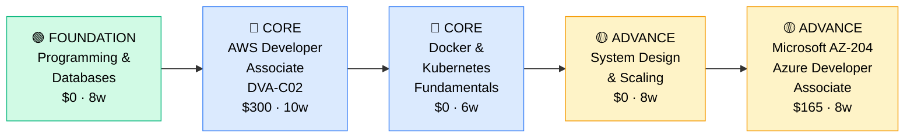

# How to Become a Backend Developer

**`CP49`** · **Software Engineering** · _Time to hire: 12–24 months_ · _Entry cost: $800–$1,200 USD_

> **Path summary:** This path takes you from junior developer or graduate to a hired Backend Developer building APIs, databases, and server-side systems using Python, Java, Node.js, or Go. You'll master cloud deployment, microservices, and distributed systems, in 12–24 months.

---

## Role Overview

### What does a Backend Developer actually do?

A Backend Developer builds the server-side logic that powers applications. Your day involves writing APIs that mobile and web frontends call, designing database schemas that scale, debugging performance issues, and deploying code to production. You're writing server code in Python, Java, Node.js, or Go. You think about: How do we handle 10,000 requests per second? How do we ensure data consistency? How do we scale the database? Tools: Python/Java/Node.js/Go, SQL/NoSQL databases, REST APIs, Docker, Kubernetes, AWS/GCP/Azure, Git, testing frameworks.

Backend Developers work on teams of 5–20, often in cross-functional squads with frontend developers, QA, and product. The role is remote-friendly (70%+). You may be on-call for production issues—when the API is slow or crashes, you're paged. You collaborate with frontend developers (who consume your APIs), DevOps engineers (who deploy your code), and data engineers (who build data pipelines). This is a technical role requiring systems thinking and problem-solving.

### Demand in 2026

- **Global job postings:** 45,000+ active Backend Developer roles on LinkedIn as of May 2026 [(source)](https://www.linkedin.com/jobs/search/?keywords=Backend%20Developer)
- **Growth rate:** 8% YoY / Stable, mature demand [(source)](https://www.bls.gov/ooh/computer-and-information-technology/)
- **South Africa:** Strong demand. Every tech company, fintech (Capitec, Luno), and enterprise (banks, retailers) needs backend engineers. High demand, good salaries.
- **Remote availability:** 76% of roles are remote/hybrid. South African backend developers work globally.

---

## Who Is This Path For?

### Ideal starting backgrounds

| Background | Readiness | What you already have |
|---|---|---|
| Recent CS graduate | ✅ Strong start | Theory solid; needs 1–2 months hands-on framework experience |
| Junior Software Engineer | ✅ Strong start | Coding fundamentals; add backend specialization |
| Frontend Developer | ✅ Strong start | Web fundamentals; learn backend frameworks and databases |
| Self-taught Programmer | ✅ Strong start | Self-learning mindset; fill gaps with structured learning |
| IT Support / Help Desk | 🟡 Possible | Technical mindset; need 3–4 months programming foundation |
| Bootcamp Graduate | ✅ Strong start | Coding fundamentals; add backend specialization |

### You're ready to start this path if you can:
- Write Python/Java/JavaScript code with functions, classes, and error handling
- Understand database basics (tables, relationships, queries)
- Use Git and command line comfortably
- Understand HTTP and REST API basics
- Deploy code to a server (AWS, Heroku, or similar)

> **Not ready yet?** Start with [Programming Fundamentals](https://www.codecademy.com/) (8–12 weeks) or [CS50](https://cs50.harvard.edu/) (free) first.

---

## Certification Sequence

### Visual path

---

### Stage 1 — Foundation (Months 0–3)

**Goal:** Master a backend language and SQL. Build basic REST APIs.

| Cert | Code | Cost (USD) | Study Time | Why it matters |
|---|---|---:|---:|---|
| Python or Java Programming + Web Framework | — | $0–$40 | 6–8 weeks | Choose one language; learn Django, Flask (Python) or Spring Boot (Java) |
| SQL & Databases (PostgreSQL/MySQL) | — | $0 | 4–5 weeks | Core skill; all backend work touches databases |

**Stage 1 total:** $40 USD · R720 ZAR · 3–4 months

**Study approach:** Choose a language and framework. For Python: use [Django for Beginners](https://djangoforbeginners.com/) (book, $39 but excellent) or [Udemy Django course](https://www.udemy.com/course/the-ultimate-django-series-part-1/) ($15). For Java: use [Spring Boot in Action](https://www.manning.com/books/spring-boot-in-action) or [Udemy Spring Boot course](https://www.udemy.com/course/spring-boot-microservices-complete-guide/) ($15). For SQL, use [Mode Analytics](https://mode.com/sql-tutorial/) (free) or [PostgreSQL tutorials](https://www.postgresql.org/docs/current/tutorial.html) (free). Build hands-on projects at this stage.

**Lab requirement:** Build 3 backend projects: 1) Simple CRUD API (users, posts), 2) API with authentication, 3) API with complex queries. Use PostgreSQL for data storage. Deploy to Heroku or AWS. Post to GitHub. 40+ hours hands-on.

---

### Stage 2 — Core Specialisation (Months 3–15)

**Goal:** Get AWS and container certifications. Prove you can deploy production systems.

| Cert | Code | Cost (USD) | Study Time | Why it matters |
|---|---|---:|---:|---|
| AWS Certified Developer Associate | `DVA-C02` | $300 | 10–12 weeks | Entry-level AWS cert; covers EC2, Lambda, RDS, S3, Databases |
| Docker & Kubernetes Fundamentals | — | $0 | 5–6 weeks | Container orchestration is industry standard; free resources |

**Stage 2 total:** $300 USD · R5,400 ZAR · 8–12 months

**Study approach:** For DVA-C02, use [Stephane Maarek's AWS Developer course](https://www.udemy.com/course/aws-certified-developer-associate-dva-c02/) ($20) and [TutorialsDojo practice exams](https://tutorialsdojo.com/). The exam covers AWS services a developer uses daily: Lambda, EC2, RDS, S3, API Gateway, DynamoDB. For Docker/Kubernetes, use [Docker & Kubernetes Official Courses](https://www.docker.com/resources/) (free) or [Udemy Docker course](https://www.udemy.com/course/docker-kubernetes-complete-guide/) ($15). Hands-on is critical—use Docker and deploy to AWS ECS or Kubernetes.

**Project milestone:** Containerize your Stage 1 projects. Write Dockerfiles. Deploy to AWS ECS or a Kubernetes cluster (use free tier or trial credits). Set up CI/CD pipeline (GitHub Actions) that automatically builds and deploys. Monitor for errors. This shows production-ready thinking.

---

### Stage 3 — Advanced Specialisation (Months 12–24)

**Goal:** Deepen in system design, scaling, and multi-cloud knowledge.

| Cert | Code | Cost (USD) | Study Time | Why it matters |
|---|---|---:|---:|---|
| System Design Fundamentals (free resources) | — | $0 | 6–8 weeks | How to architect scalable systems; separates mid from senior engineers |
| Microsoft AZ-204 (Azure Developer) | `AZ-204` | $165 | 8–10 weeks | Multi-cloud knowledge; many enterprises use Azure |
| Google Cloud Associate Cloud Engineer | — | $200 | 8–10 weeks | GCP knowledge; complete the cloud trio |

**Stage 3 total:** $365 USD · R6,570 ZAR · 10–12 months

**Study approach:** For system design, read [System Design Interview](https://www.educative.io/courses/grokking-the-system-design-interview) (Educative, $49 but excellent) or use free resources like [Architecture Patterns](https://martinfowler.com/) (free). For AZ-204, use [Microsoft Learn](https://learn.microsoft.com/en-us/training/paths/develop-azure-compute-solutions/) (free) and [Udemy AZ-204](https://www.udemy.com/course/az-204-developing-solutions-for-microsoft-azure/) ($20). For GCP, use [Google Cloud training](https://cloud.google.com/training) (free).

> **Optional at hire time:** Many backend developers land jobs after Stage 2 (AWS cert + portfolio projects) and deepen in Stage 3 on the job.

---

## Timeline & Cost Summary

| Stage | Certs | Duration | Cost (USD) | Cost (ZAR) |
|---|---|---|---:|---:|
| Stage 1 — Foundation | Lang + Framework, SQL | Months 0–3 | $40 | R720 |
| Stage 2 — Core | DVA-C02, Docker/Kubernetes | Months 3–15 | $300 | R5,400 |
| Stage 3 — Advanced | System Design, AZ-204, GCP | Months 12–24 | $365 | R6,570 |
| **Total to hireable** | | **12–20 months** | **$705** | **R12,690** |

**Study hours required:** ~400–500 hours. Assumes 12–15 hours/week = 20 months.

---

## Salary Progression

> All figures: median base salary, not including bonuses/equity. ZAR = USD × 18. Sources: Robert Half 2026, Levels.fyi, LinkedIn Salary.

| Experience Level | USD/year | ZAR/month | GBP/year | EUR/year | AUD/year |
|---|---:|---:|---:|---:|---:|
| Entry / Junior (0–2 yrs) | $75,000–$110,000 | R48,000–R70,000 | £58,000–€85,000 | €70,000–€104,000 | A$110,000–A$162,000 |
| Mid-level (2–5 yrs) | $110,000–$155,000 | R70,000–R99,000 | €85,000–€120,000 | €104,000–€145,000 | A$162,000–A$228,000 |
| Senior (5–8 yrs) | $155,000–$210,000 | R99,000–R134,000 | €120,000–€163,000 | €145,000–€196,000 | A$228,000–A$309,000 |
| Lead / Principal (8+ yrs) | $210,000–$290,000+ | R134,000–R185,000+ | £163,000–€225,000+ | €196,000–€273,000+ | A$309,000–A$426,000+ |

**South Africa note:** Backend Developers at Johannesburg tech companies and banks earn R50,000–R80,000/month for entry, R80,000–R130,000/month for mid-level. Remote roles for international companies: R75,000–R120,000/month for entry, R120,000–R180,000/month for mid-level. Backend demand is high; good salary growth.

**Salary accelerators:** AWS + Azure + GCP certs, system design mastery, microservices expertise, and proven ability to build scalable systems all command 15–25% premiums.

---

## First Job Strategy

### Month 0–3: Build Your Foundation

1. **Choose a language and framework** — Python (Django/Flask), Java (Spring Boot), Node.js (Express), or Go (Gin/Echo). Pick one based on market demand (Python/Java most popular) or your interest.
2. **Complete programming course** — [Django for Beginners](https://djangoforbeginners.com/), [Spring Boot Udemy](https://www.udemy.com/course/spring-boot-microservices-complete-guide/), or [Express.js tutorial](https://expressjs.com/). 6–8 weeks.
3. **Learn SQL databases** — [Mode Analytics](https://mode.com/sql-tutorial/) + hands-on with PostgreSQL. 4–5 weeks.
4. **Build 3 backend projects** — CRUD API, authentication API, complex queries API. Deploy to Heroku. Post to GitHub.
5. **Join communities** — r/learnprogramming, r/webdev, language-specific subreddits (r/django, r/springboot), Discord communities.

### Month 3–9: Build Your Backend Portfolio

- **Project 1: E-commerce REST API** — Build an API for a basic e-commerce system: products, orders, users. Include: authentication (JWT), database relationships, filtering, pagination. Estimated time: 16 hours.
- **Project 2: Real-time Chat API** — Build a chat system using WebSockets. Users, messages, rooms, real-time notifications. Include: persistent storage, error handling. Estimated time: 14 hours.
- **Project 3: Microservices Architecture** — Build 2–3 separate services (user service, order service, notification service) that communicate via APIs. Include: service discovery (if using Docker), logging, monitoring. Estimated time: 20 hours.

### Month 9–18: Pursue Certifications

- **AWS DVA-C02:** Study 8–10 weeks. Use [Stephane Maarek's course](https://www.udemy.com/course/aws-certified-developer-associate-dva-c02/).
- **Docker & Kubernetes:** Study 5–6 weeks. Hands-on practice is critical—containerize your projects.
- **CV positioning:** List as "Backend Developer" once you have DVA-C02 + 3 portfolio projects. Highlight your primary language and cloud platform.

### Month 18–24: Apply & Iterate

- **Target companies:** All tech companies, startups, fintech (Capitec, Luno, PayFast), e-commerce (Takealot), banks, consulting firms. Remote and onsite available.
- **Interview prep:** Be ready to discuss 1) System design (how to architect a feature at scale), 2) A complex backend project, 3) Database design and optimization, 4) API design, 5) Testing and deployment strategies.
- **Salary negotiation:** Backend developers are well-compensated. Entry-level offers R50k–R80k/month locally; remote international roles R75k–R120k/month. Negotiate firmly.

---

## A Day in the Life

### Backend Developer at Capitec (Johannesburg) — Junior Level

**08:00** — Arrive. Check overnight deployment. One service had an error; review logs. A database query was slow due to missing index. Escalate to DBA.

**09:00** — Standup with the team. You're working on a new payments API feature.

**10:00** — Design review for your feature. Sketch the API design: endpoints, request/response schemas, error handling. Get team feedback.

**11:00** — Start implementation. Write the REST endpoint in Spring Boot. Add request validation, business logic, and database queries.

**12:30** — Lunch.

**13:30** — Write unit tests for your endpoint. Use JUnit and Mockito. Aim for 80%+ code coverage.

**15:00** — Code review with a senior developer. Feedback: improve error messages, add logging, handle edge cases better. You revise.

**16:00** — Integrate with the CI/CD pipeline. Automated tests pass. Deploy to staging environment. Manual testing with QA.

**16:30** — Fix a minor bug QA found. Redeploy to staging.

**17:00** — End of day. All tests green. Schedule for production deployment tomorrow.

### Backend Developer at Takealot (Cape Town/Remote) — Mid Level

**09:00** — Async standup. You're designing a new recommendation service. Need to handle 5k requests/sec, low latency (< 100ms).

**09:30** — System design whiteboard (async video). Propose architecture: API Gateway → load-balanced service pods → Redis cache for recommendations → PostgreSQL for user data. Sketch.

**10:30** — Implementation. Build the service using Go (fast, lightweight for this use case). Use Redis for caching. Implement circuit breaker for failure handling.

**12:00** — Lunch.

**13:00** — Load testing. Run a load test: 5k requests/sec against your service. Identify bottleneck: database queries. Optimize with batch queries and caching.

**14:30** — Peer programming with a senior engineer on handling edge cases. What if Redis crashes? What if the database is slow? Design retry logic and circuit breaker patterns.

**15:30** — Write integration tests. Test the entire flow: API call → cache check → database → response. Ensure consistency.

**16:30** — Prepare for deployment. Write runbook, monitoring, alerting. Set up metrics dashboards (P50, P95, P99 latency; error rates).

**17:00** — Deploy to production using Kubernetes. Monitor for issues. Green metrics. Success.

**17:30** — End of day. Post-deployment monitoring. All good. Plan: start Azure cert tomorrow.

---

## Related Paths & Progressions

| From here you can move to… | Why |
|---|---|
| [Frontend Developer (CP50)](CP50_SoftEng_Frontend_Developer.md) | Shift toward UI; or become Full-Stack |
| [Full-Stack Developer (CP51)](CP51_SoftEng_Full_Stack_Developer.md) | Add frontend skills; become Full-Stack |
| [DevOps / Infrastructure Engineer] | Specialize in deployment, CI/CD, infrastructure |
| [Architect / Principal Engineer] | After 5+ years, design systems and technical strategy |

---

## South Africa Context

### Market specifics

Backend Developer is the most in-demand software engineering role in South Africa. Every tech company, startup, bank, and enterprise needs backend engineers. Capitec, Luno, PayFast, Takealot all hire aggressively. Consulting firms (Deloitte, EY, Dimension Data) also hire.

Remote work is common—many South African backend developers work for international tech companies at significantly higher salaries. Python and Java are dominant languages; Node.js and Go growing.

BEE/EE is relevant—tech companies actively hire previously disadvantaged individuals for engineering roles. Backend developer is a high-visibility position with good career growth.

### SA-specific resources

| Resource | URL | Note |
|---|---|---|
| Johannesburg Backend/Python Meetup | [meetup.com/johannesburg-python](https://www.meetup.com/johannesburg-python/) | Monthly meetups, networking |
| Capitec Careers (Backend) | [capitec.co.za/careers](https://www.capitec.co.za/careers) | Active backend hiring |
| Luno Careers | [luno.com/careers](https://www.luno.com/careers) | FinTech backend roles |
| Takealot Careers (Backend) | [takealot.com/careers](https://www.takealot.com/careers) | E-commerce backend |
| AWS South Africa | [aws.amazon.com/developer/community/](https://aws.amazon.com/developer/community/) | User groups, events |
| Python Software Foundation (SA) | [python.org](https://www.python.org/) | Python community |
| LinkedIn Backend Developer (SA) | [linkedin.com/jobs](https://www.linkedin.com/jobs/search/?location=South%20Africa&keywords=Backend%20Developer) | Job board, 200+ postings |

---

## Frequently Asked Questions

**Q: Do I need a degree to become a Backend Developer?**

No. Many successful backend developers are bootcamp graduates or self-taught. A CS degree helps but isn't required. Hands-on skills and portfolio matter most.

**Q: Which programming language should I learn?**

Python (Django/Flask) or Java (Spring Boot) are the safest bets for job market. Both have huge ecosystems and demand. Node.js is popular in startups. Go is growing for microservices. Pick based on your interest or market in your region.

**Q: How long does it take from zero?**

12–24 months if starting from scratch. If you have programming experience: 6–12 months. This is a structured path with clear checkpoints.

**Q: Is AWS DVA-C02 worth it?**

Yes. AWS is used by 80%+ of tech companies globally and in South Africa. The cert proves you understand cloud services a backend developer uses daily.

**Q: Can I do this while working full-time?**

Yes, absolutely. Many people upskill from junior to mid-level while employed. Bootcamp graduates often study full-time for 3–4 months, then land jobs. Full-time study accelerates the timeline.

**Q: What's the difference between Backend Developer and Full-Stack Developer?**

Backend = server-side systems, APIs, databases. Full-Stack = backend + frontend + everything in between. Backend is specialized; Full-Stack is broader. Choose based on your interest—backend is more focused, full-stack is more versatile.

---

## Sources & Further Reading

| # | Source | URL | Used for |
|---|---|---|---|
| 1 | LinkedIn Jobs (Backend Dev) | [linkedin.com/jobs](https://www.linkedin.com/jobs/search/?keywords=Backend%20Developer) | Job market data |
| 2 | AWS DVA-C02 Exam | [aws.amazon.com/certification](https://aws.amazon.com/certification/certified-developer-associate/) | Developer cert details |
| 3 | Django for Beginners | [djangoforbeginners.com](https://djangoforbeginners.com/) | Django course/book |
| 4 | Spring Boot Guides | [spring.io/guides](https://spring.io/guides) | Official Spring Boot tutorials |
| 5 | Docker Documentation | [docker.com/resources/](https://www.docker.com/resources/) | Containerization |
| 6 | System Design Interview | [educative.io](https://www.educative.io/courses/grokking-the-system-design-interview) | Scaling and architecture |
| 7 | Robert Half 2026 Salary Guide | [roberthalf.com](https://www.roberthalf.com/salary-guide) | Salary benchmarks |
| 8 | Levels.fyi Backend Engineer | [levels.fyi](https://www.levels.fyi/jobs/backend-engineer) | Salary transparency |

---

*Template version: 2026-05-02 | Maintained by IT Career Roadmap | ZAR baseline: R18/$1 USD*
*File naming: Career_Paths/CP49_SoftEng_Backend_Developer.md*
