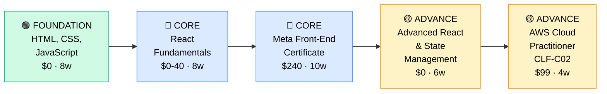

# How to Become a Frontend Developer

**`CP50`** · **Software Engineering** · _Time to hire: 9–18 months_ · _Entry cost: $600–$900 USD_

> **Path summary:** This path takes you from beginner to a hired Frontend Developer building user interfaces and web applications using React, Vue, or Angular. You'll master HTML, CSS, JavaScript, and modern frameworks, in 9–18 months. One of the most accessible software engineering paths.

---

## Role Overview

### What does a Frontend Developer actually do?

A Frontend Developer builds what users see and interact with. Your day involves writing React components (or Vue/Angular), styling with CSS, making APIs calls to backends, debugging browser issues, and collaborating on UX improvements. You sit at the intersection of design and engineering—translating wireframes into working applications. You think about: How do we make this fast? How do we make this accessible? How do we make this beautiful? Tools: HTML, CSS, JavaScript (ES6+), React/Vue/Angular, Git, testing frameworks (Jest, React Testing Library), build tools (Webpack, Vite).

Frontend Developers work on teams of 3–10, often in cross-functional squads with designers, backend developers, and product managers. The role is remote-friendly (82%+—very high). You're rarely on-call for critical production incidents. You collaborate with designers (who create the look), backend developers (who provide the data), and product managers (who define the vision). This is a creative technical role with visible output.

### Demand in 2026

- **Global job postings:** 52,000+ active Frontend Developer roles on LinkedIn as of May 2026 [(source)](https://www.linkedin.com/jobs/search/?keywords=Frontend%20Developer)
- **Growth rate:** 10% YoY / Stable, high demand [(source)](https://www.bls.gov/ooh/computer-and-information-technology/)
- **South Africa:** Strong demand. Every startup, tech company, bank, and enterprise building web applications needs frontend engineers. High availability, good salaries.
- **Remote availability:** 82% of roles are remote/hybrid. Frontend is the most remote-friendly software engineering role.

---

## Who Is This Path For?

### Ideal starting backgrounds

| Background | Readiness | What you already have |
|---|---|---|
| Recent CS graduate | ✅ Strong start | Theory solid; needs 2–3 months hands-on framework experience |
| Bootcamp graduate | ✅ Strong start | HTML/CSS/JavaScript foundation; add React/Vue depth |
| Self-taught programmer | ✅ Strong start | Self-learning mindset; structured learning accelerates growth |
| UX/UI Designer | 🟡 Good with gaps | Design skills strong; needs JavaScript and component thinking |
| Backend Developer | ✅ Strong start | Programming fundamentals; learn frontend frameworks |
| Complete beginner | 🟡 Possible | Can learn; need 2–3 months HTML/CSS/JS foundation |

### You're ready to start this path if you can:
- Write HTML and understand semantic markup
- Style web pages with CSS (flexbox, grid, responsive design)
- Write JavaScript (variables, functions, loops, DOM manipulation)
- Understand React/Vue/Angular basics
- Use Git and command line comfortably

> **Not ready yet?** Start with [The Odin Project](https://www.theodinproject.com/) (free, comprehensive) or [freeCodeCamp](https://www.freecodecamp.org/) (free) for 2–3 months.

---

## Certification Sequence

### Visual path

---

### Stage 1 — Foundation (Months 0–3)

**Goal:** Master HTML, CSS, and JavaScript fundamentals.

| Cert | Code | Cost (USD) | Study Time | Why it matters |
|---|---|---:|---:|---|
| HTML & CSS Fundamentals | — | $0 | 4–5 weeks | Foundation for all web development; free excellent resources |
| JavaScript Fundamentals (ES6+) | — | $0–$40 | 5–6 weeks | Core language for frontend; essential |

**Stage 1 total:** $40 USD · R720 ZAR · 3–4 months

**Study approach:** Use [The Odin Project](https://www.theodinproject.com/) (free, comprehensive, excellent) or [freeCodeCamp HTML/CSS/JavaScript](https://www.freecodecamp.org/) (free YouTube, 10+ hours each). For deeper JavaScript, use [eloquentjavascript.net](https://eloquentjavascript.net/) (free online book) or [You Don't Know JS](https://github.com/getify/You-Dont-Know-JS) (free GitHub). Focus on: DOM manipulation, event listeners, async/await, fetch API.

**Lab requirement:** Build 5 vanilla JavaScript projects: 1) Simple calculator, 2) Todo list with DOM manipulation, 3) Fetch data from API and display, 4) Interactive weather app, 5) Responsive layout (mobile/desktop). Post to GitHub. 30+ hours hands-on.

---

### Stage 2 — Core Specialisation (Months 3–12)

**Goal:** Master React and earn the Meta certificate.

| Cert | Code | Cost (USD) | Study Time | Why it matters |
|---|---|---:|---:|---|
| React Fundamentals & Ecosystem | — | $0–$40 | 6–8 weeks | React is used by 80%+ of companies; hooks, state, props essential |
| Meta Front-End Developer Certificate | — | $240 | 10–12 weeks | Industry-recognized cert; covers React, UI/UX, testing |

**Stage 2 total:** $280 USD · R5,040 ZAR · 8–10 months

**Study approach:** For React, use [React Official Docs](https://react.dev/) (free, recently redesigned, excellent) or [Udemy React course](https://www.udemy.com/course/react-the-complete-guide-incl-redux/) ($15). For Meta cert, use [Coursera Meta Front-End Developer](https://www.coursera.org/professional-certificates/meta-front-end-developer) (can audit free, paid cert $240). This comprehensive cert covers: HTML/CSS/JavaScript, React, state management (Redux), testing, responsive design.

**Project milestone:** Build a 3–4 page React application. Include: multiple components, state management (hooks or Redux), API integration with a backend, responsive design, error handling, testing. Deploy to Vercel or Netlify (free). Post to GitHub with comprehensive documentation. This is your portfolio piece.

---

### Stage 3 — Advanced Specialisation (Months 9–18)

**Goal:** Deepen React skills, add performance optimization and deployment knowledge.

| Cert | Code | Cost (USD) | Study Time | Why it matters |
|---|---|---:|---:|---|
| Advanced React Patterns (State, Performance) | — | $0 | 6–7 weeks | Advanced state management (Redux, Context, Zustand); separates mid from senior |
| AWS Cloud Practitioner | `CLF-C02` | $99 | 3–4 weeks | Cloud deployment context; helpful for full-stack understanding |
| Web Performance & Optimization | — | $0 | 3–4 weeks | Core skill; user experience depends on performance |

**Stage 3 total:** $99 USD · R1,782 ZAR · 8–10 months

**Study approach:** For advanced React, read [Advanced React by Rares Matei](https://advancedreact.com/) or use free resources like [Kent C. Dodds blog](https://kentcdodds.com/). For AWS, use [ACloud.guru Cloud Practitioner](https://acloud.guru/) ($35/mo). For performance, use [Web Vitals](https://web.dev/vitals/) (free) and [Lighthouse](https://developers.google.com/web/tools/lighthouse) tutorials.

> **Optional at hire time:** Many frontend developers land jobs after Stage 2 (Meta cert + portfolio projects) and deepen in Stage 3 on the job.

---

## Timeline & Cost Summary

| Stage | Certs | Duration | Cost (USD) | Cost (ZAR) |
|---|---|---|---:|---:|
| Stage 1 — Foundation | HTML/CSS/JS | Months 0–3 | $40 | R720 |
| Stage 2 — Core | React, Meta Certificate | Months 3–12 | $280 | R5,040 |
| Stage 3 — Advanced | Advanced React, AWS, Performance | Months 9–18 | $99 | R1,782 |
| **Total to hireable** | | **9–15 months** | **$419** | **R7,542** |

**Study hours required:** ~350–400 hours. Assumes 10 hours/week = 15 months.

---

## Salary Progression

> All figures: median base salary, not including bonuses/equity. ZAR = USD × 18. Sources: Robert Half 2026, Levels.fyi, LinkedIn Salary.

| Experience Level | USD/year | ZAR/month | GBP/year | EUR/year | AUD/year |
|---|---:|---:|---:|---:|---:|
| Entry / Junior (0–2 yrs) | $65,000–$100,000 | R42,000–R64,000 | £50,000–€77,000 | €60,000–€93,000 | A$96,000–A$147,000 |
| Mid-level (2–5 yrs) | $100,000–$145,000 | R64,000–R93,000 | €77,000–€112,000 | €93,000–€134,000 | A$147,000–A$213,000 |
| Senior (5–8 yrs) | $145,000–$195,000 | R93,000–R124,000 | £112,000–€151,000 | €134,000–€183,000 | A$213,000–A$287,000 |
| Lead / Principal (8+ yrs) | $195,000–$270,000+ | R124,000–R172,000+ | £151,000–€209,000+ | €183,000–€252,000+ | A$287,000–A$397,000+ |

**South Africa note:** Frontend Developers at Johannesburg tech companies and startups earn R45,000–R75,000/month for entry, R75,000–R120,000/month for mid-level. Remote roles for international companies: R65,000–R110,000/month for entry, R110,000–R170,000/month for mid-level. Frontend is highly remote-friendly; remote international roles are norm for SA developers.

**Salary accelerators:** React mastery, TypeScript knowledge, state management expertise, performance optimization skills, and proven ability to build scalable UIs all command 15–20% premiums.

---

## First Job Strategy

### Month 0–3: Build Your Foundation

1. **Master HTML, CSS, JavaScript** — Use [The Odin Project](https://www.theodinproject.com/) (comprehensive, free) or [freeCodeCamp](https://www.freecodecamp.org/). 8–12 weeks.
2. **Build vanilla JavaScript projects** — Todo list, weather app, calculator. No frameworks yet. 20+ hours.
3. **Learn responsive design** — Mobile-first, flexbox, grid, media queries. Essential skill.
4. **Join communities** — r/webdev, r/Frontend, local JavaScript meetups, Dev.to community.
5. **Start blogging** — Write about what you're learning. Post on Dev.to, Medium, or your blog. Builds presence.

### Month 3–9: Build Your Frontend Portfolio

- **Project 1: React Todo App** — Build a todo list app with React. Include: add/delete todos, filter, local storage, responsive design. Estimated time: 8 hours.
- **Project 2: E-commerce Product Page** — Build a product page with filters, reviews, shopping cart. Fetch data from an API. Include: state management (hooks), error handling. Estimated time: 12 hours.
- **Project 3: Full Dashboard/App** — Build a more complex React app: weather dashboard, recipe search, movie database, or social feed. Include: multiple pages (React Router), state management, API integration, testing. Estimated time: 16 hours.

### Month 9–15: Pursue Certifications & Apply

- **Meta Front-End Certificate:** Complete on Coursera. Can be done alongside projects. 10–12 weeks.
- **Build GitHub presence:** Push all projects. Write READMEs. Contribute to open-source projects (small features).
- **CV positioning:** List as "Frontend Developer" once you have Meta cert + 3 portfolio projects. Highlight React, CSS, responsive design.
- **Target companies:** All tech companies, startups, fintech, e-commerce (Takealot), banks. Remote heavily available.
- **Interview prep:** Be ready to discuss 1) Your React projects and decisions, 2) React hooks and state management, 3) CSS and responsive design, 4) Performance optimization, 5) Testing strategies.

---

## A Day in the Life

### Frontend Developer at Takealot (Cape Town/Remote) — Junior Level

**09:00** — Standup with the squad (designer, PM, backend, QA, you). Sprint planning: new feature—product filters for the search page.

**10:00** — Design review. Designer shows the mockup for the filters UI. Discuss implementation approach: component structure, state management, API contracts with backend.

**10:30** — Get API spec from backend. They'll provide a `/filters` endpoint and `/products?filters=...` endpoint. Document in API spec.

**11:30** — Start building. Create a `Filters` component in React. Use React hooks for state. Build UI from Figma mockup.

**12:30** — Lunch.

**13:30** — Integrate with backend APIs. Fetch available filters, then fetch products when filters change. Handle loading and error states.

**15:00** — Test with QA. They test the UI, flows, edge cases. Find a small bug: filters don't clear properly. Fix it.

**15:30** — Code review with a senior developer. Feedback: add accessibility (ARIA labels), improve component naming, add unit tests. You revise.

**16:30** — Write unit tests using Jest/React Testing Library. Aim for 80%+ coverage.

**17:00** — All tests pass. Deploy to staging. QA re-tests. Good. Schedule for production tomorrow.

**17:30** — End of day. Document component in Storybook.

### Frontend Developer at a London FinTech (Remote/South Africa) — Mid Level

**09:00** — Standup. You're building a new dashboard for users to track their investments. Complex state management needed.

**09:30** — Architecture discussion. Propose state structure using Redux Toolkit. Sketch component hierarchy: top-level layout, portfolio summary, holdings table, charts, filters.

**10:30** — Implement Redux store and slices. Add actions for fetching portfolio data, filtering, sorting.

**11:30** — Build React components. Portfolio summary (showing total value, gains/losses), holdings table (sortable, paginated), charts (using Chart.js or D3).

**12:30** — Lunch.

**13:30** — Performance work. Dashboard loads slowly with large portfolios (1000s of holdings). Implement: virtual scrolling for the table, memoization for heavy components, lazy loading for charts.

**15:00** — Testing. Write integration tests using React Testing Library. Test: filtering, sorting, loading states, error handling.

**16:00** — Accessibility review. Use axe DevTools to check for accessibility issues. Fix: missing ARIA labels, contrast issues, keyboard navigation. Accessibility is critical for financial apps.

**16:30** — Deploy to staging. Performance metrics: Lighthouse score 92 (was 70). Good improvement.

**17:00** — Pair programming with a junior developer. Review their component. Feedback: nice structure, but add error boundaries. Teaching moment.

**17:30** — End of day. All tests pass. Ready for production review tomorrow.

---

## Related Paths & Progressions

| From here you can move to… | Why |
|---|---|
| [Backend Developer (CP49)](CP49_SoftEng_Backend_Developer.md) | Add backend skills; become Full-Stack |
| [Full-Stack Developer (CP51)](CP51_SoftEng_Full_Stack_Developer.md) | Add backend fundamentals; become Full-Stack |
| [Product / UX Designer] | Move toward design-focused role; frontend-to-design transition |
| [Frontend Architect / Principal] | After 5+ years, design frontend systems and strategy |

---

## South Africa Context

### Market specifics

Frontend Developer is one of the most in-demand tech roles in South Africa. Every startup, tech company, bank, and e-commerce company (Takealot, Shoprite) builds web applications and needs frontend engineers. Demand is high, remote availability exceptional—85%+ of SA frontend developers work for international companies.

React dominates the market. Vue and Angular are secondary but growing. TypeScript is increasingly expected. Modern frontend development emphasizes: performance, accessibility, testing, and UX.

Frontend is highly remote-friendly—most SA developers work for UK/US companies at significantly higher salaries than local roles. Remote-first job search is strongly recommended.

### SA-specific resources

| Resource | URL | Note |
|---|---|---|
| The Odin Project | [theodinproject.com](https://www.theodinproject.com/) | Free, comprehensive, excellent foundation |
| freeCodeCamp | [freecodecamp.org](https://www.freecodecamp.org/) | Free courses, 10+ hours |
| Meta Front-End Certificate | [coursera.org/professional-certificates/meta-front-end-developer](https://www.coursera.org/professional-certificates/meta-front-end-developer) | Affordable, industry-recognized |
| Johannesburg JavaScript Meetup | [meetup.com/johannesburg-javascript](https://www.meetup.com/johannesburg-javascript/) | Monthly meetups, networking |
| Dev.to Community | [dev.to](https://dev.to/) | Write and read tech blogs |
| LinkedIn Frontend Jobs (SA) | [linkedin.com/jobs](https://www.linkedin.com/jobs/search/?location=South%20Africa&keywords=Frontend%20Developer) | Job board, 300+ postings |

---

## Frequently Asked Questions

**Q: Do I need a degree to become a Frontend Developer?**

No. Most frontend developers are bootcamp graduates or self-taught. A degree helps but isn't required. Portfolio and hands-on skills matter most.

**Q: Should I learn React, Vue, or Angular?**

React first. It has 80%+ of the market share and is the most in-demand. Vue is easier to learn but smaller market. Angular is complex but used in enterprises. Start with React, then explore others.

**Q: How long does it take from zero?**

9–18 months if starting from scratch. If you have programming experience: 3–6 months. Bootcamp graduates often finish in 12–16 weeks. This is one of the fastest paths to employment.

**Q: Is the Meta Front-End Certificate worth it?**

Yes. It's affordable ($240 or free audit), comprehensive, and well-recognized. It covers the full frontend stack: HTML/CSS/JavaScript/React. Strong addition to your resume.

**Q: Can I do this while working full-time?**

Yes. Many people upskill to frontend while working. Bootcamp often means 3–4 months full-time. Self-taught while working: 12–18 months part-time (10 hours/week).

**Q: What's the difference between Frontend Developer and Full-Stack Developer?**

Frontend = user interfaces, React/Vue/Angular, CSS, JavaScript. Full-Stack = frontend + backend + databases. Frontend is specialized on UX. Full-Stack is broader. Choose based on interest.

---

## Sources & Further Reading

| # | Source | URL | Used for |
|---|---|---|---|
| 1 | LinkedIn Jobs (Frontend Dev) | [linkedin.com/jobs](https://www.linkedin.com/jobs/search/?keywords=Frontend%20Developer) | Job market data |
| 2 | The Odin Project | [theodinproject.com](https://www.theodinproject.com/) | Free comprehensive curriculum |
| 3 | React Official Docs | [react.dev](https://react.dev/) | React fundamentals |
| 4 | Meta Front-End Certificate | [coursera.org](https://www.coursera.org/professional-certificates/meta-front-end-developer) | Industry cert |
| 5 | freeCodeCamp | [freecodecamp.org](https://www.freecodecamp.org/) | Free video courses |
| 6 | You Don't Know JS | [github.com/getify](https://github.com/getify/You-Dont-Know-JS) | JavaScript deep dive |
| 7 | Robert Half 2026 Salary Guide | [roberthalf.com](https://www.roberthalf.com/salary-guide) | Salary benchmarks |
| 8 | Levels.fyi Frontend Engineer | [levels.fyi](https://www.levels.fyi/jobs/frontend-engineer) | Salary transparency |

---

*Template version: 2026-05-02 | Maintained by IT Career Roadmap | ZAR baseline: R18/$1 USD*
*File naming: Career_Paths/CP50_SoftEng_Frontend_Developer.md*
