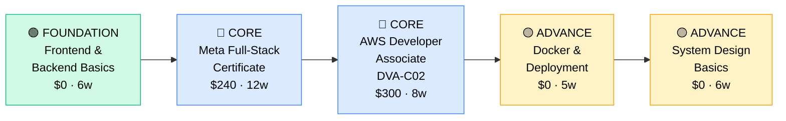

# How to Become a Full-Stack Developer

**`CP51`** · **Software Engineering** · _Time to hire: 12–24 months_ · _Entry cost: $800–$1,200 USD_

> **Path summary:** This path takes you from programmer to a hired Full-Stack Developer building complete web applications from frontend to backend. You'll master React (frontend), a backend framework (Node.js, Python, Java), databases, and deployment, in 12–24 months. The generalist approach to web development.

---

## Role Overview

### What does a Full-Stack Developer actually do?

A Full-Stack Developer builds complete features from UI to database. Your day involves writing React components on the frontend, building REST APIs on the backend, designing database schemas, debugging full-stack issues, and deploying to production. You're the person who owns a feature end-to-end. This is both a strength (you can see the full picture, move fast) and a challenge (you need broad knowledge). Tools: HTML/CSS/JavaScript (frontend), Node.js/Python/Java (backend), SQL/NoSQL databases, Git, Docker, cloud platforms, testing frameworks (both frontend and backend).

Full-Stack Developers work on teams of 5–15, often in startups or smaller companies where people wear many hats. The role is remote-friendly (75%+). You may be on-call for production issues across the entire stack. You collaborate with designers, product managers, and other engineers. This is a versatile role with broad responsibility.

### Demand in 2026

- **Global job postings:** 38,000+ active Full-Stack Developer roles on LinkedIn as of May 2026 [(source)](https://www.linkedin.com/jobs/search/?keywords=Full%20Stack%20Developer)
- **Growth rate:** 9% YoY / Steady demand [(source)](https://www.bls.gov/ooh/computer-and-information-technology/)
- **South Africa:** Strong demand, especially in startups and smaller tech companies. Every startup that's growing needs full-stack engineers.
- **Remote availability:** 76% of roles are remote/hybrid.

---

## Who Is This Path For?

### Ideal starting backgrounds

| Background | Readiness | What you already have |
|---|---|---|
| Recent CS graduate | ✅ Strong start | Theory solid; needs hands-on in both frontend and backend |
| Bootcamp graduate | ✅ Strong start | Web development foundation; specialize in one stack |
| Frontend Developer | ✅ Strong start | UI skills; add backend knowledge |
| Backend Developer | ✅ Strong start | API skills; add frontend knowledge |
| Self-taught Programmer | ✅ Strong start | Self-learning mindset; broader curriculum needed |
| Complete beginner | 🟡 Possible | Can learn; need 3–4 months foundation first |

### You're ready to start this path if you can:
- Write JavaScript proficiently (ES6+, async/await, DOM manipulation)
- Build React components with hooks and state management
- Write server-side code (Node.js/Python/Java)
- Query databases with SQL
- Use Git and understand basic deployment concepts
- Work with APIs (both consuming and building)

> **Not ready yet?** Start with either [Frontend Developer (CP50)](CP50_SoftEng_Frontend_Developer.md) or [Backend Developer (CP49)](CP49_SoftEng_Backend_Developer.md) path first.

---

## Certification Sequence

### Visual path

---

### Stage 1 — Foundation (Months 0–2)

**Goal:** Build full-stack fundamentals: React on frontend, Node.js (or Python) on backend, and databases.

| Cert | Code | Cost (USD) | Study Time | Why it matters |
|---|---|---:|---:|---|
| React Fundamentals | — | $0–$20 | 4–5 weeks | Core frontend framework; high demand |
| Node.js / Python Backend Basics | — | $0–$20 | 4–5 weeks | Server-side programming; choose one language |
| SQL Databases | — | $0 | 2–3 weeks | Foundation for data persistence |

**Stage 1 total:** $40 USD · R720 ZAR · 2–3 months

**Study approach:** Use [React Official Docs](https://react.dev/) (free, excellent) for frontend. For backend, choose: [Express.js tutorial](https://expressjs.com/) (Node.js, popular for full-stack) or [Django tutorial](https://docs.djangoproject.com/en/stable/intro/) (Python, more batteries-included). For databases, use [Mode Analytics](https://mode.com/sql-tutorial/) (free) or PostgreSQL tutorials. Build small projects integrating all three components.

**Lab requirement:** Build 2–3 simple full-stack apps: 1) Todo list (React frontend + Node/Python backend + PostgreSQL), 2) Notes app, 3) Simple e-commerce product catalog. Deploy to Heroku. Post to GitHub. 25+ hours hands-on.

---

### Stage 2 — Core Specialisation (Months 2–14)

**Goal:** Get Meta Full-Stack cert and AWS Developer cert. Prove production-ready skills.

| Cert | Code | Cost (USD) | Study Time | Why it matters |
|---|---|---:|---:|---|
| Meta Full-Stack Developer Certificate | — | $240 | 10–12 weeks | Comprehensive full-stack training; covers React, backend, databases, deployment |
| AWS Certified Developer Associate | `DVA-C02` | $300 | 8–10 weeks | Production deployment and cloud services; critical for modern development |

**Stage 2 total:** $540 USD · R9,720 ZAR · 10–12 months

**Study approach:** Complete [Coursera Meta Full-Stack Certificate](https://www.coursera.org/professional-certificates/meta-full-stack-developer) (can audit free, cert $240). This is comprehensive: React, JavaScript, backend (Node.js), databases, APIs, deployment. For AWS, use [Stephane Maarek's DVA-C02 course](https://www.udemy.com/course/aws-certified-developer-associate-dva-c02/) ($20) and hands-on labs.

**Project milestone:** Build a complete full-stack application. Include: React frontend with multiple pages, Node.js/Python REST API, PostgreSQL database, authentication, error handling, unit tests (both frontend and backend), Docker containerization, deployment to AWS. Post to GitHub with comprehensive documentation. This demonstrates production-ready thinking.

---

### Stage 3 — Advanced Specialisation (Months 12–24)

**Goal:** Deepen in DevOps, system design, and specialization (choose focus: performance, security, architecture).

| Cert | Code | Cost (USD) | Study Time | Why it matters |
|---|---|---:|---:|---|
| Docker & Kubernetes Fundamentals | — | $0 | 5–6 weeks | Container orchestration; critical for modern deployment |
| System Design Fundamentals | — | $0 | 6–8 weeks | Architecture and scaling; separates mid from senior engineers |
| GitHub Foundations / CI/CD | — | $0 | 3–4 weeks | Modern development workflows; GitHub Actions, CI/CD pipelines |

**Stage 3 total:** $0 USD · R0 ZAR · 10–12 months

**Study approach:** Docker learning via [Docker Official Docs](https://docs.docker.com/) (free) or [Udemy Docker course](https://www.udemy.com/course/docker-kubernetes-complete-guide/) ($15). System design via [Grokking System Design](https://www.educative.io/courses/grokking-the-system-design-interview) (Educative, $49) or free resources like [DesignGurus](https://www.designgurus.io/). GitHub/CI/CD via [GitHub Learning Lab](https://github.github.io/skills/) (free).

> **Optional at hire time:** Many full-stack developers land jobs after Stage 2 (Meta cert + AWS cert + portfolio) and deepen in Stage 3 on the job.

---

## Timeline & Cost Summary

| Stage | Certs | Duration | Cost (USD) | Cost (ZAR) |
|---|---|---|---:|---:|
| Stage 1 — Foundation | React, Backend, SQL | Months 0–2 | $40 | R720 |
| Stage 2 — Core | Meta Full-Stack, DVA-C02 | Months 2–14 | $540 | R9,720 |
| Stage 3 — Advanced | Docker, System Design, CI/CD | Months 12–24 | $0 | R0 |
| **Total to hireable** | | **12–20 months** | **$580** | **R10,440** |

**Study hours required:** ~450–550 hours. Assumes 12–15 hours/week = 20 months.

---

## Salary Progression

> All figures: median base salary, not including bonuses/equity. ZAR = USD × 18. Sources: Robert Half 2026, Levels.fyi, LinkedIn Salary.

| Experience Level | USD/year | ZAR/month | GBP/year | EUR/year | AUD/year |
|---|---:|---:|---:|---:|---:|
| Entry / Junior (0–2 yrs) | $75,000–$115,000 | R48,000–R74,000 | £58,000–€89,000 | €70,000–€107,000 | A$110,000–A$169,000 |
| Mid-level (2–5 yrs) | $115,000–$160,000 | R74,000–R102,000 | €89,000–€124,000 | €107,000–€150,000 | A$169,000–A$235,000 |
| Senior (5–8 yrs) | $160,000–$220,000 | R102,000–R141,000 | €124,000–€171,000 | €150,000–€207,000 | A$235,000–A$324,000 |
| Lead / Principal (8+ yrs) | $220,000–$300,000+ | R141,000–R192,000+ | £171,000–€233,000+ | €207,000–€288,000+ | A$324,000–A$441,000+ |

**South Africa note:** Full-Stack Developers at Johannesburg/Cape Town startups earn R50,000–R85,000/month for entry, R85,000–R140,000/month for mid-level. Remote roles for international companies: R75,000–R130,000/month for entry, R130,000–R200,000/month for mid-level. Startups often pay premium for full-stack generalists who can move fast.

**Salary accelerators:** React mastery, Node.js/Python expertise, AWS knowledge, Docker/Kubernetes skills, system design understanding, and proven ability to own full features all command 15–25% premiums.

---

## First Job Strategy

### Month 0–6: Build Your Full-Stack Foundation

1. **Choose your stack** — React (frontend) + Node.js/Python (backend). Most common: MERN (MongoDB, Express, React, Node) or PERN (PostgreSQL, Express, React, Node).
2. **Learn both frontend and backend** — React from [React Docs](https://react.dev/), backend from framework docs or [Udemy courses](https://www.udemy.com/courses/search/?q=full+stack).
3. **Build simple full-stack projects** — Todo app, note-taking app, simple marketplace. Include frontend + backend + database. Deploy to Heroku (free tier).
4. **Join communities** — r/webdev, r/FullStack, framework-specific subreddits.
5. **Start documenting** — GitHub with complete READMEs. Write blog posts about your learning.

### Month 6–12: Build Your Full-Stack Portfolio

- **Project 1: E-commerce Application** — Build a complete e-commerce app: product listing (React), shopping cart (state management), checkout API (backend), payment integration (Stripe sandbox), PostgreSQL database. Estimated time: 20 hours.
- **Project 2: Social Network / Forum** — Build a simple social app: user authentication, posts, comments, likes. Include: React frontend, Node/Python API, PostgreSQL, real-time updates (if you want to add WebSockets). Estimated time: 18 hours.
- **Project 3: Production-Ready App** — Refactor one of your apps for production: add error handling, validation, testing (frontend + backend), Docker containerization, CI/CD pipeline. Estimated time: 15 hours.

### Month 12–18: Pursue Certifications

- **Meta Full-Stack Certificate:** Complete on Coursera (10–12 weeks).
- **AWS DVA-C02:** Study 8–10 weeks. Hands-on labs critical.
- **Build visibility:** Push all projects to GitHub. Write READMEs explaining architecture. Contribute to open-source.
- **CV positioning:** List as "Full-Stack Developer" once you have Meta cert + 2–3 portfolio projects. Highlight React, Node/Python, PostgreSQL, AWS.

### Month 18–24: Apply & Iterate

- **Target companies:** Startups, tech companies, fintech, e-commerce. Startups value full-stack generalists highly. Every company building products needs full-stack engineers.
- **Interview prep:** Be ready to discuss 1) Full feature implementation (frontend to database), 2) System design at scale, 3) Trade-offs between frontend and backend, 4) Deployment and DevOps, 5) Testing strategies.
- **Salary negotiation:** Full-stack roles at startups and growing companies often pay well. Entry-level offers R50k–R85k/month locally; remote international R75k–R130k/month. Negotiate based on portfolio and market.

---

## A Day in the Life

### Full-Stack Developer at a Cape Town FinTech Startup — Junior Level

**09:00** — Standup. You're building a new feature: allow users to export their transaction history as CSV.

**10:00** — Design discussion. Sketch the flow: button on dashboard → backend generates CSV file → user downloads. API design: POST `/api/export` with date range parameters.

**10:30** — Implement backend. Write a Node.js endpoint that queries transactions, generates CSV using a library (csv-stringify), returns file to frontend.

**11:30** — Test the backend API using Postman. Works. Download works.

**12:00** — Implement frontend. Add button to the dashboard. On click, call the API, handle response, trigger browser download.

**13:00** — Lunch.

**13:30** — Test the full feature end-to-end. Works smoothly.

**14:00** — Edge case testing: what if there are no transactions? What if the date range is invalid? Add error handling.

**15:00** — Code review with a senior developer. Feedback: add CSV header labels, handle large exports (might need pagination/streaming), add unit tests. You add basic tests.

**16:00** — Deploy to staging. Test with real data. Good.

**16:30** — Create a GitHub PR. Write clear description of the change. Request review.

**17:00** — After approval, deploy to production using GitHub Actions (CI/CD pipeline is automated).

**17:30** — Monitor the feature for errors. All good. End of day.

### Full-Stack Developer at a London Startup (Remote/South Africa) — Mid Level

**09:00** — Standup. You're designing a new feature: real-time notifications for users.

**09:30** — Architecture discussion. Propose: WebSocket connection from React frontend to Node.js backend, notifications stored in Redis for performance, PostgreSQL for persistence.

**10:30** — Implement backend WebSocket handler using Socket.io. Users connect, server broadcasts notifications.

**12:00** — Implement React frontend. UseEffect hook sets up WebSocket connection. Real-time updates appear on dashboard.

**12:30** — Lunch.

**13:30** — Add database persistence. When a notification is sent, store in PostgreSQL. When user loads the app, fetch recent notifications from DB.

**14:30** — Performance optimization. Real-time features can be resource-intensive. Optimize: connection pooling, Redis caching, selective broadcasting (only send to relevant users).

**15:30** — Test at scale. Load test: 1000 concurrent WebSocket connections. Find bottleneck: database queries. Add indexes. Re-test. Much better.

**16:30** — Pair programming with a junior developer on testing. Write integration tests (frontend + backend). Use Jest, Supertest, and React Testing Library.

**17:00** — All tests pass. Deploy to staging. Monitor metrics. Performance looks good.

**17:30** — Document the feature. Write architecture decisions, performance notes, deployment steps.

---

## Related Paths & Progressions

| From here you can move to… | Why |
|---|---|
| [Backend Developer (CP49)](CP49_SoftEng_Backend_Developer.md) | Specialize deeper in backend; focus on APIs and systems |
| [Frontend Developer (CP50)](CP50_SoftEng_Frontend_Developer.md) | Specialize in UI/UX; become frontend specialist |
| [DevOps / Platform Engineer] | Focus on deployment, infrastructure, CI/CD |
| [Architect / Technical Lead] | After 5+ years, design systems and lead teams |

---

## South Africa Context

### Market specifics

Full-Stack Developer is highly valued in South African startups and smaller tech companies. Every growth-stage startup needs generalist engineers who can move fast and own features end-to-end. Major tech companies (Capitec, Luno, Takealot) also hire full-stack engineers, though larger companies often prefer specialists.

Remote work is very common—most SA full-stack developers work for international startups at significantly higher salaries. The generalist nature of the role appeals to startups, who value velocity.

---

## Frequently Asked Questions

**Q: Do I need a degree to become a Full-Stack Developer?**

No. Bootcamps and self-taught developers are common. Degree helps but portfolio matters more.

**Q: Which stack should I learn?**

MERN (MongoDB/Express/React/Node) or PERN (PostgreSQL/Express/React/Node) are most popular. PERN is more enterprise-friendly. Choose based on market or interest.

**Q: Full-Stack vs. Specialist (Frontend/Backend)?**

Full-Stack = generalist, own features end-to-end, move fast. Specialist = depth in one domain, higher leverage, better specialization. Choose based on interests. Startups favor full-stack; large companies favor specialists.

**Q: How long from zero?**

12–24 months if starting fresh. If you have frontend or backend experience: 6–12 months.

**Q: Is full-stack harder than specializing?**

Broader knowledge required, but not necessarily harder. Full-stack is good entry point; specializing later is easy if interested.

---

## Sources & Further Reading

| # | Source | URL | Used for |
|---|---|---|---|
| 1 | LinkedIn Jobs (Full-Stack) | [linkedin.com/jobs](https://www.linkedin.com/jobs/search/?keywords=Full%20Stack%20Developer) | Job market data |
| 2 | React Official Docs | [react.dev](https://react.dev/) | Frontend fundamentals |
| 3 | Meta Full-Stack Certificate | [coursera.org](https://www.coursera.org/professional-certificates/meta-full-stack-developer) | Industry cert |
| 4 | Express.js Guide | [expressjs.com](https://expressjs.com/) | Node.js backend framework |
| 5 | AWS DVA-C02 | [aws.amazon.com/certification](https://aws.amazon.com/certification/certified-developer-associate/) | Cloud deployment |
| 6 | Docker Official Docs | [docs.docker.com](https://docs.docker.com/) | Containerization |
| 7 | Robert Half 2026 Salary Guide | [roberthalf.com](https://www.roberthalf.com/salary-guide) | Salary benchmarks |
| 8 | Levels.fyi Full-Stack Engineer | [levels.fyi](https://www.levels.fyi/jobs/full-stack-engineer) | Salary transparency |

---

*Template version: 2026-05-02 | Maintained by IT Career Roadmap | ZAR baseline: R18/$1 USD*
*File naming: Career_Paths/CP51_SoftEng_Full_Stack_Developer.md*
